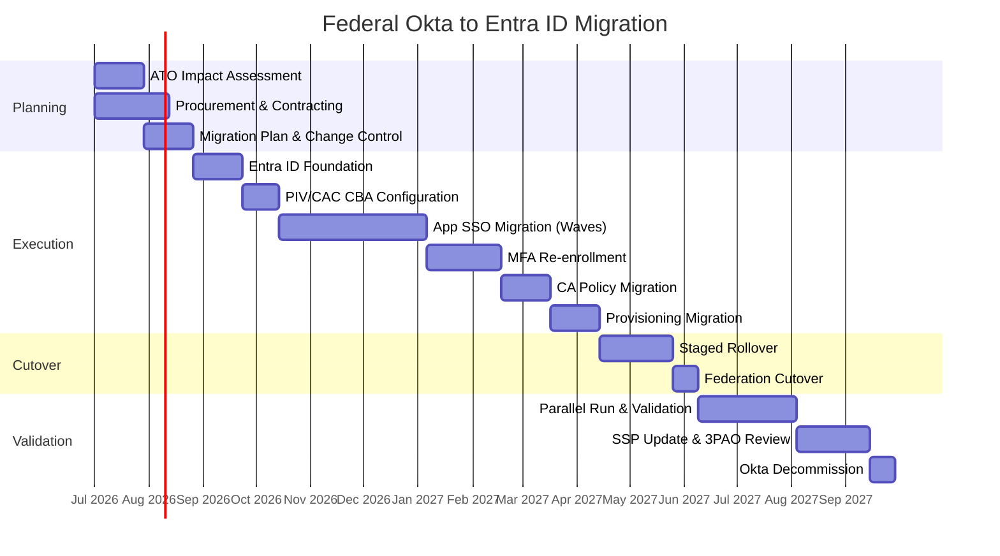

# Federal Migration Guide: Okta to Microsoft Entra ID

**Status:** Authored 2026-04-30
**Audience:** Federal IAM Teams, CISOs, AOs, ISSMs, Federal Security Architects
**Purpose:** Federal-specific guidance for migrating from Okta to Microsoft Entra ID

---

## Overview

Federal agencies face unique requirements when migrating identity providers. FedRAMP authorization levels, PIV/CAC smartcard support, CISA Zero Trust mandates, DoD IL levels, and identity provider consolidation directives all shape the migration approach. This guide addresses each of these federal-specific considerations.

---

## 1. FedRAMP authorization comparison

| Attribute                       | Okta Workforce Identity Cloud | Microsoft Entra ID (Azure Government)        |
| ------------------------------- | ----------------------------- | -------------------------------------------- |
| **FedRAMP authorization level** | Moderate                      | **High**                                     |
| **Authorizing agency**          | DoD (via Okta Federal)        | JAB (Provisional ATO) + multiple agency ATOs |
| **FedRAMP Marketplace listing** | Yes                           | Yes                                          |
| **Impact Level 4 (IL4)**        | Not authorized                | **Authorized**                               |
| **Impact Level 5 (IL5)**        | Not authorized                | **Authorized**                               |
| **Impact Level 6 (IL6)**        | Not authorized                | **Authorized** (Azure Government Secret)     |
| **StateRAMP**                   | Limited                       | **Authorized**                               |
| **ITAR compliance**             | Not supported                 | **Supported** (Azure Government)             |

### What this means for agencies

- **FedRAMP High vs Moderate:** FedRAMP High includes approximately 421 controls (vs 325 for Moderate). Agencies operating at High baseline with Okta must implement compensating controls for the gap. Entra ID in Azure Government inherits FedRAMP High from the Azure Government infrastructure.
- **IL4/IL5:** Agencies handling Controlled Unclassified Information (CUI) at IL4 or IL5 cannot use Okta for identity services for those workloads. Entra ID in Azure Government is authorized at these impact levels.
- **Dual-IdP audit burden:** Running both Okta and Entra ID requires identity controls to be assessed for both platforms during 3PAO assessments, increasing audit scope and cost.

---

## 2. PIV/CAC smartcard support

Federal agencies are required to use PIV (Personal Identity Verification) credentials for logical access under HSPD-12 and FIPS 201.

### Okta PIV/CAC support

Okta does not natively support certificate-based authentication (CBA) for PIV/CAC smartcards. Federal agencies using Okta for PIV authentication typically deploy a third-party SAML bridge:

```
PIV login flow (Okta):

    User inserts PIV card
        └── Third-party SAML bridge (e.g., Identiv, CyberArk)
            └── Validates certificate against OCSP/CRL
            └── Issues SAML assertion to Okta
                └── Okta accepts assertion as authentication
                    └── User accesses resources

    Components required:
    - PIV middleware on endpoints
    - Third-party SAML bridge infrastructure ($50K-$150K)
    - OCSP responder or CRL distribution point
    - Certificate trust chain configuration
    - Annual maintenance ($25K-$50K)
```

### Entra ID PIV/CAC support

Entra ID supports certificate-based authentication (CBA) natively, without third-party bridges:

```
PIV login flow (Entra ID):

    User inserts PIV card
        └── Entra ID CBA validates certificate directly
            └── Certificate validated against trusted CA + OCSP/CRL
            └── Entra ID maps certificate to user account
                └── Conditional Access evaluated
                    └── User accesses resources

    Components required:
    - PIV middleware on endpoints (same as Okta)
    - Certificate authority trust configuration in Entra
    - OCSP/CRL endpoint accessible to Entra
    - No third-party bridge required
```

### Configure Entra CBA for PIV/CAC

```powershell
# Enable certificate-based authentication in Entra ID
# Step 1: Upload trusted CA certificates
$caCert = [System.Convert]::ToBase64String(
    [System.IO.File]::ReadAllBytes("C:\certs\dod-root-ca.cer")
)

$certAuthority = @{
    certificate = $caCert
    isRootAuthority = $true
    issuer = "CN=DoD Root CA 3, OU=PKI, OU=DoD, O=U.S. Government, C=US"
    issuerSki = "certificate-ski-value"
    certificateRevocationListUrl = "http://crl.disa.mil/crl/DODIDCA_59.crl"
}

New-MgOrganizationCertificateBasedAuthConfiguration -OrganizationId $orgId -BodyParameter @{
    certificateAuthorities = @($certAuthority)
}

# Step 2: Configure CBA authentication method
$cbaConfig = @{
    "@odata.type" = "#microsoft.graph.x509CertificateAuthenticationMethodConfiguration"
    state = "enabled"
    authenticationModeConfiguration = @{
        x509CertificateAuthenticationDefaultMode = "x509CertificateSingleFactor"
        rules = @(
            @{
                x509CertificateRuleType = "issuerSubject"
                identifier = "CN=DoD ID CA-59"
                x509CertificateAuthenticationMode = "x509CertificateMultiFactor"
            }
        )
    }
    certificateUserBindings = @(
        @{
            x509CertificateField = "PrincipalName"
            userProperty = "onPremisesUserPrincipalName"
            priority = 1
        },
        @{
            x509CertificateField = "RFC822Name"
            userProperty = "userPrincipalName"
            priority = 2
        }
    )
}

Update-MgPolicyAuthenticationMethodPolicyAuthenticationMethodConfiguration `
    -AuthenticationMethodConfigurationId "x509Certificate" `
    -BodyParameter $cbaConfig
```

---

## 3. CISA Zero Trust requirements

### Executive Order 14028 and OMB M-22-09

OMB M-22-09 ("Moving the U.S. Government Toward Zero Trust Cybersecurity Principles") establishes identity requirements:

| M-22-09 requirement                 | Okta capability                                  | Entra ID capability                                                         |
| ----------------------------------- | ------------------------------------------------ | --------------------------------------------------------------------------- |
| **Phishing-resistant MFA**          | Okta FastPass + FIDO2                            | FIDO2 + passkeys + CBA + Windows Hello + Authenticator (number matching)    |
| **Enterprise-wide SSO**             | Okta SSO (OIN-based)                             | Entra Enterprise Apps + app gallery + Application Proxy                     |
| **Centralized identity management** | Universal Directory                              | Entra ID Directory + hybrid sync                                            |
| **Continuous validation**           | Limited (session-based)                          | **Continuous Access Evaluation (CAE)** -- near-real-time policy enforcement |
| **Least-privilege access**          | Limited (requires Okta Privileged Access add-on) | **PIM** -- just-in-time, time-bound, approval-based privileged access       |
| **Device trust**                    | Requires Workspace ONE / Jamf                    | **Native Intune integration** -- compliant device enforcement in CA         |

### CISA Zero Trust Maturity Model -- Identity pillar

| Maturity level  | Requirement                                                          | Okta                            | Entra ID                                                    |
| --------------- | -------------------------------------------------------------------- | ------------------------------- | ----------------------------------------------------------- |
| **Traditional** | Password + basic MFA                                                 | Yes                             | Yes                                                         |
| **Initial**     | Phishing-resistant MFA for privileged users                          | Yes (FastPass)                  | Yes (FIDO2 + CBA)                                           |
| **Advanced**    | Phishing-resistant MFA for all users, identity threat analytics      | Partial (ThreatInsight limited) | **Yes** (Identity Protection + Conditional Access)          |
| **Optimal**     | Continuous validation, real-time risk assessment, automated response | Not supported                   | **Yes** (CAE + Identity Protection + automated remediation) |

---

## 4. Identity provider consolidation mandates

### Federal ICAM policy direction

Federal ICAM (Identity, Credential, and Access Management) policies increasingly mandate identity provider consolidation:

- **OMB M-19-17:** Requires agencies to implement ICAM capabilities using shared services where possible
- **NIST SP 800-63-4:** Updated digital identity guidelines emphasizing federation and trust frameworks
- **CISA ICAM guidance:** Recommends reducing the number of identity providers to minimize attack surface

### Consolidation benefits for federal agencies

| Benefit                | Dual IdP (Okta + Entra)                      | Single IdP (Entra ID)               |
| ---------------------- | -------------------------------------------- | ----------------------------------- |
| **Attack surface**     | Two identity providers = two targets         | One identity provider = one target  |
| **ATO scope**          | Identity controls assessed in both platforms | Identity controls assessed once     |
| **PIV/CAC management** | Two certificate trust configurations         | One certificate trust configuration |
| **Audit trail**        | Two identity log sources to correlate        | Single unified identity audit log   |
| **SIEM integration**   | Two connector configurations                 | One native connector (Sentinel)     |
| **Incident response**  | Two identity platforms to investigate        | One platform to investigate         |
| **Staff training**     | Two admin consoles, two skill sets           | One admin console, one skill set    |

---

## 5. Federal migration considerations

### Contract and procurement

| Consideration               | Guidance                                                                                                                      |
| --------------------------- | ----------------------------------------------------------------------------------------------------------------------------- |
| **Okta contract alignment** | Time migration to coincide with Okta contract renewal. Issue non-renewal notice per contract terms (typically 30-90 days).    |
| **M365 contract vehicle**   | Verify Entra ID P1/P2 inclusion in current M365 BPA or IDIQ. Most federal M365 contracts include Entra ID P1 (E3) or P2 (E5). |
| **Transition period**       | Budget for 6-12 months of dual-IdP operation during migration.                                                                |
| **Professional services**   | Microsoft FastTrack is included with M365 E3/E5. Additional migration support available through Microsoft federal partners.   |

### Change control and ATO impact

```
ATO Impact Assessment:

    1. Identify SSP controls affected by IdP change:
       - IA-2 (Identification and Authentication)
       - IA-5 (Authenticator Management)
       - AC-2 (Account Management)
       - AC-3 (Access Enforcement)
       - AC-7 (Unsuccessful Logon Attempts)
       - AU-2 (Audit Events)
       - AU-3 (Content of Audit Records)

    2. Update SSP to reflect Entra ID as identity provider
    3. Update POA&M if any controls are in transition
    4. Coordinate with 3PAO for interim assessment if required
    5. Update continuous monitoring procedures
```

### Data sovereignty

- **Okta data residency:** Okta stores identity data in US data centers (commercial). Okta Federal (FedRAMP) operates from US government-designated facilities.
- **Entra ID data residency:** Azure Government stores identity data exclusively in US government data centers (Virginia and Texas). Data does not leave US sovereign boundaries.
- **ITAR compliance:** Entra ID in Azure Government supports ITAR-controlled data. Okta does not have ITAR compliance documentation.

---

## 6. Okta FedRAMP vs Entra FedRAMP -- control mapping

Key NIST 800-53 controls and how each platform addresses them:

| Control                                         | Okta FedRAMP Moderate             | Entra ID FedRAMP High                                                     |
| ----------------------------------------------- | --------------------------------- | ------------------------------------------------------------------------- |
| **IA-2(1): MFA for network access**             | Okta Verify, FIDO2, SMS           | Authenticator, FIDO2, CBA, Windows Hello, passkeys                        |
| **IA-2(6): PIV access**                         | Requires third-party bridge       | Native CBA for PIV/CAC                                                    |
| **IA-2(12): Phishing-resistant auth**           | FastPass, FIDO2                   | FIDO2, CBA, passkeys, Windows Hello                                       |
| **IA-5(2): PKI-based authentication**           | Limited (via SAML bridge)         | Native X.509 certificate authentication                                   |
| **AC-2(4): Automated audit of account actions** | Okta System Log                   | Entra audit logs + Identity Protection                                    |
| **AC-7: Unsuccessful logon attempts**           | Okta lockout policies             | Smart Lockout + Identity Protection                                       |
| **AU-2: Audit events**                          | Okta System Log (IdP events only) | Entra audit + sign-in logs + provisioning logs + Identity Protection logs |
| **SI-4: Information system monitoring**         | ThreatInsight (pre-auth)          | Identity Protection (comprehensive) + Sentinel integration                |

---

## 7. Migration timeline for federal agencies

Federal migrations typically require additional time for change control, ATO updates, and stakeholder coordination:



**Estimated total: 52-65 weeks** (compared to 28-32 weeks for commercial organizations).

---

## 8. CSA-in-a-Box federal identity integration

For federal agencies using CSA-in-a-Box, identity consolidation to Entra ID simplifies compliance evidence across the platform:

| CSA-in-a-Box component     | FedRAMP control  | Benefit of Entra consolidation                                            |
| -------------------------- | ---------------- | ------------------------------------------------------------------------- |
| **Fabric workspaces**      | AC-2, AC-3, AC-6 | RBAC via Entra groups; single identity audit for workspace access         |
| **Purview governance**     | AU-2, AU-3, AU-6 | Unified identity + data access audit trail; automated compliance evidence |
| **Data Factory pipelines** | IA-2, AC-3       | Managed identity (Entra-native); no credential management                 |
| **Power BI reports**       | AC-3, AC-6       | Row-level security via Entra groups; Conditional Access for report access |
| **Azure AI services**      | AC-2, IA-2       | Entra authentication for AI model access; audit trail for AI usage        |

---

## Key references

- [Azure Government FedRAMP documentation](https://learn.microsoft.com/azure/compliance/offerings/offering-fedramp)
- [Entra ID certificate-based authentication](https://learn.microsoft.com/entra/identity/authentication/concept-certificate-based-authentication)
- [CISA Zero Trust Maturity Model](https://www.cisa.gov/zero-trust-maturity-model)
- [OMB M-22-09](https://www.whitehouse.gov/wp-content/uploads/2022/01/M-22-09.pdf)
- [NIST SP 800-63-4 Digital Identity Guidelines](https://pages.nist.gov/800-63-4/)
- [Azure Government compliance](https://learn.microsoft.com/azure/azure-government/compliance/)

---

**Maintainers:** csa-inabox core team
**Last updated:** 2026-04-30
