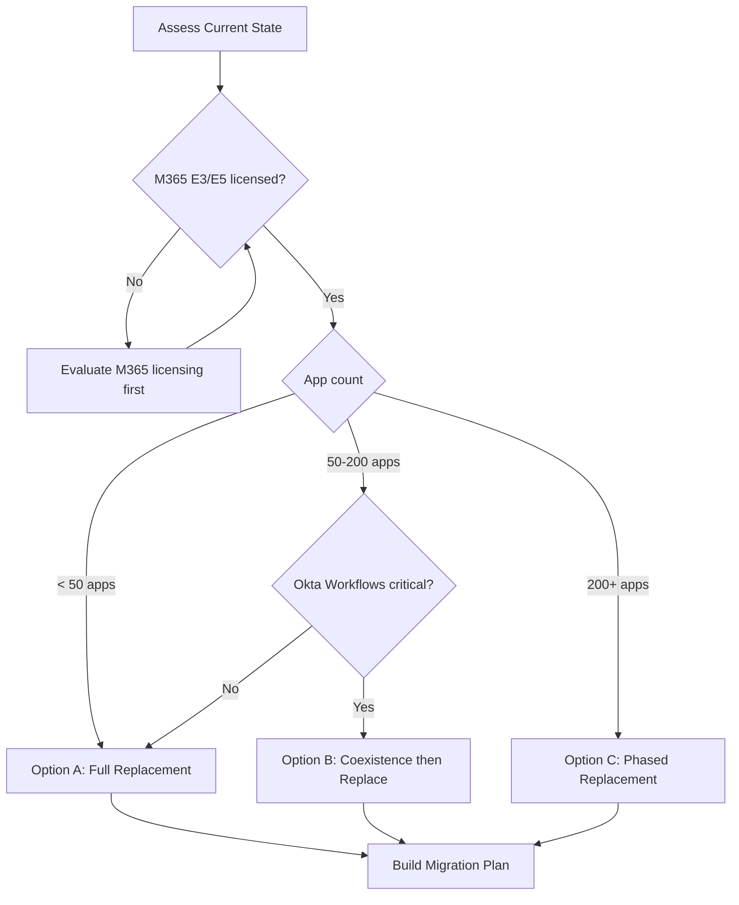
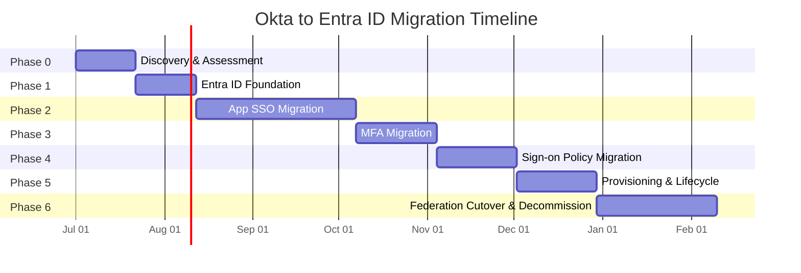

# Okta to Microsoft Entra ID Migration Center

**The definitive resource for migrating from Okta Workforce Identity Cloud to Microsoft Entra ID, with CSA-in-a-Box as the identity governance and data platform integration layer.**

---

## Who this is for

This migration center serves identity architects, security engineers, IT directors, IAM analysts, and federal identity teams who are evaluating or executing a migration from Okta to Microsoft Entra ID. Whether you are responding to Okta security incidents, eliminating duplicate identity costs, consolidating around the Microsoft security stack, or meeting federal identity consolidation mandates, these resources provide the evidence, patterns, and step-by-step guidance to execute confidently.

---

## Quick-start decision matrix

| Your situation                           | Start here                                                      |
| ---------------------------------------- | --------------------------------------------------------------- |
| Executive evaluating Entra ID vs Okta    | [Why Entra ID over Okta](why-entra-over-okta.md)                |
| Need cost justification for migration    | [Total Cost of Ownership Analysis](tco-analysis.md)             |
| Need a feature-by-feature comparison     | [Complete Feature Mapping](feature-mapping-complete.md)         |
| Ready to plan a migration                | [Migration Playbook](../okta-to-entra-id.md)                    |
| Migrating federation (domain cutover)    | [Federation Migration Guide](federation-migration.md)           |
| Migrating SSO applications               | [SSO Application Migration](sso-migration.md)                   |
| Migrating MFA factors                    | [MFA Migration Guide](mfa-migration.md)                         |
| Migrating provisioning connectors        | [Provisioning Migration Guide](provisioning-migration.md)       |
| Migrating sign-on policies               | [Conditional Access Migration](conditional-access-migration.md) |
| Federal/government identity requirements | [Federal Migration Guide](federal-migration-guide.md)           |
| Need performance data                    | [Benchmarks](benchmarks.md)                                     |

---

## Migration approach decision

Before beginning, select the migration model that fits your organization:

### Option A: Full replacement (recommended for M365-native organizations)

Complete Okta decommission. Entra ID becomes the sole identity provider. All SSO, MFA, provisioning, and lifecycle management move to Entra ID.

**Best for:** Organizations with M365 E3/E5 licensing, primarily Microsoft-stack applications, and a mandate to reduce identity provider count.

**Timeline:** 24-32 weeks.

### Option B: Coexistence (transitional)

Okta and Entra ID coexist for an extended period. Entra ID handles Microsoft-stack authentication; Okta handles third-party SaaS. Federation links the two.

**Best for:** Organizations with large Okta application portfolios that cannot migrate all apps quickly, or those with Okta-specific features (Workflows with non-Microsoft connectors) that require replacement planning.

**Timeline:** 32-52 weeks, with ongoing dual-IdP operational cost.

### Option C: Phased replacement (recommended for large enterprises)

Full replacement executed in waves. Wave 1 migrates Microsoft-stack apps and high-risk apps. Wave 2 migrates SaaS apps. Wave 3 migrates custom apps and completes decommission.

**Best for:** Enterprises with 200+ SSO applications, regulated industries, federal agencies with change control requirements.

**Timeline:** 40-52 weeks.

---

## How CSA-in-a-Box fits

CSA-in-a-Box is not an identity provider. Microsoft Entra ID is the identity provider. CSA-in-a-Box is the **data platform landing zone** where identity consolidation unlocks tangible operational benefits across every platform component.

```mermaid
flowchart TD
    subgraph Identity["Identity Layer"]
        ENTRA[Microsoft Entra ID]
        CA[Conditional Access]
        PIM[Privileged Identity Management]
        IP[Identity Protection]
    end

    subgraph CSA["CSA-in-a-Box Platform"]
        subgraph Data["Data Platform"]
            FAB[Fabric Workspaces - RBAC via Entra groups]
            DBX[Databricks - Unity Catalog + Entra SSO]
            ADF[Data Factory - managed identity pipelines]
            ADLS[ADLS Gen2 - Entra RBAC + ACLs]
        end
        subgraph Analytics["Analytics & AI"]
            PBI[Power BI - RLS via Entra groups]
            AI[Azure AI Services - Entra auth]
            ADX[Data Explorer - Entra cluster access]
        end
        subgraph Governance["Governance"]
            PUR[Purview - unified identity audit]
            COMP[Compliance matrices - single IdP evidence]
            MON[Monitor - identity + resource correlation]
        end
    end

    ENTRA --> FAB
    ENTRA --> DBX
    ENTRA --> ADF
    ENTRA --> ADLS
    ENTRA --> PBI
    ENTRA --> AI
    ENTRA --> ADX
    CA --> FAB
    CA --> PBI
    CA --> AI
    PIM --> FAB
    PIM --> PUR
    IP --> MON
    ENTRA --> PUR
    ENTRA --> COMP
```

**What identity consolidation provides for CSA-in-a-Box:**

| Capability                    | With Okta + Entra ID (dual IdP)                                                                      | With Entra ID only (consolidated)                                                         |
| ----------------------------- | ---------------------------------------------------------------------------------------------------- | ----------------------------------------------------------------------------------------- |
| Fabric workspace RBAC         | Okta groups must sync to Entra via federation; sync delays create access gaps                        | Entra security groups directly assigned to Fabric roles; real-time membership             |
| Databricks SSO                | Federation chain: user -> Okta -> Entra -> Databricks; double token negotiation                      | Direct: user -> Entra -> Databricks; single token, lower latency                          |
| Data Factory managed identity | Managed identity is Entra-native; Okta has no role in pipeline identity                              | Fully native; Conditional Access can govern pipeline execution context                    |
| Purview governance audit      | Two identity logs to correlate for compliance evidence                                               | Single identity log; automated compliance evidence for FedRAMP/CMMC                       |
| Power BI row-level security   | Group membership changes propagate through Okta -> Entra sync -> Power BI; minutes to hours of delay | Group membership changes in Entra reflect in Power BI RLS within seconds                  |
| Conditional Access for data   | Okta sign-on policies cannot reach Azure resources; two separate policy engines                      | Unified -- one Conditional Access policy can govern identity, apps, and data resources    |
| Cost of identity operations   | Two admin consoles, two skill sets, two vendor relationships, two contracts                          | One admin console, one skill set, one vendor relationship, zero incremental identity cost |

---

## Strategic resources

These documents provide the business case, cost analysis, and strategic framing for decision-makers.

| Document                                            | Audience                    | Description                                                                                                                                                         |
| --------------------------------------------------- | --------------------------- | ------------------------------------------------------------------------------------------------------------------------------------------------------------------- |
| [Why Entra ID over Okta](why-entra-over-okta.md)    | CISO / CIO / Board          | Executive brief covering M365 licensing inclusion, Okta security incidents, unified Microsoft security stack, Copilot identity integration, and federal positioning |
| [Total Cost of Ownership Analysis](tco-analysis.md) | CFO / CISO / Procurement    | Detailed pricing model comparison -- Okta per-product pricing vs Entra ID inclusion in M365 E3/E5, hidden costs, 3-year TCO projections                             |
| [Benchmarks & Performance](benchmarks.md)           | CTO / Identity Architecture | Authentication latency, MFA prompt speed, provisioning cycle times, API rate limits, global PoP coverage                                                            |

---

## Technical references

| Document                                                | Description                                                                                                                                                                                   |
| ------------------------------------------------------- | --------------------------------------------------------------------------------------------------------------------------------------------------------------------------------------------- |
| [Complete Feature Mapping](feature-mapping-complete.md) | 50+ Okta features mapped to Entra ID equivalents -- Universal Directory vs Entra ID, Adaptive MFA vs Conditional Access, Lifecycle Management vs Entra ID Governance, Workflows vs Logic Apps |
| [Migration Playbook](../okta-to-entra-id.md)            | Concise end-to-end migration playbook with phased approach, architecture, cost comparison, and CSA-in-a-Box integration                                                                       |

---

## Migration guides

Domain-specific deep dives covering every aspect of an Okta-to-Entra ID migration.

| Guide                                                           | Okta capability                                                      | Entra ID destination                                                                      |
| --------------------------------------------------------------- | -------------------------------------------------------------------- | ----------------------------------------------------------------------------------------- |
| [Federation Migration](federation-migration.md)                 | Okta as IdP, domain federation, WS-Fed/SAML federation               | Entra managed authentication, staged rollover, federation cutover                         |
| [SSO Application Migration](sso-migration.md)                   | Okta SSO (SAML, OIDC, SWA), Okta Integration Network (OIN)           | Entra Enterprise Apps, app gallery, custom SAML/OIDC, My Apps                             |
| [MFA Migration](mfa-migration.md)                               | Okta Verify, Adaptive MFA, FastPass, FIDO2, SMS/Voice                | Microsoft Authenticator, Conditional Access MFA, passkeys, FIDO2                          |
| [Provisioning Migration](provisioning-migration.md)             | Okta provisioning (SCIM), HR-driven provisioning, group push         | Entra provisioning (SCIM), HR connectors (Workday/SuccessFactors), dynamic groups         |
| [Conditional Access Migration](conditional-access-migration.md) | Okta sign-on policies, network zones, device trust, session controls | Entra Conditional Access, named locations, device compliance, authentication context, CAE |

---

## Tutorials

Hands-on, step-by-step walkthroughs for the most critical migration scenarios.

| Tutorial                                             | Duration  | What you will build                                                                                                                                                        |
| ---------------------------------------------------- | --------- | -------------------------------------------------------------------------------------------------------------------------------------------------------------------------- |
| [Federation Cutover](tutorial-federation-cutover.md) | 2-4 hours | Plan federation cutover, configure Entra as IdP, staged rollover for pilot group, validate SSO, cut federation, decommission Okta federation with PowerShell and Graph API |
| [App SSO Migration](tutorial-app-sso.md)             | 2-3 hours | Inventory Okta SSO apps, categorize by protocol, configure equivalents in Entra, test SSO, migrate users, validate claims for SAML and OIDC applications                   |

---

## Federal and government

| Document                                              | Description                                                                                                                                              |
| ----------------------------------------------------- | -------------------------------------------------------------------------------------------------------------------------------------------------------- |
| [Federal Migration Guide](federal-migration-guide.md) | Okta FedRAMP vs Entra FedRAMP comparison, PIV/CAC support, CISA Zero Trust requirements, identity provider consolidation mandates, IL4/IL5 authorization |

---

## Best practices

| Document                            | Description                                                                                                                                                                        |
| ----------------------------------- | ---------------------------------------------------------------------------------------------------------------------------------------------------------------------------------- |
| [Best Practices](best-practices.md) | App-by-app migration order, MFA re-enrollment communication, rollback planning, Okta contract timeline alignment, CSA-in-a-Box RBAC integration, identity governance consolidation |

---

## Migration timeline

A realistic full-replacement migration for a mid-to-large enterprise runs 28-32 weeks:

---

## Okta security incident context

Okta has experienced multiple security incidents that have eroded customer confidence, particularly in regulated industries:

- **January 2022 (Lapsus$):** Threat group Lapsus$ compromised an Okta customer support engineer's workstation. Okta initially downplayed the incident, then disclosed that approximately 2.5% of customers (roughly 375 organizations) were potentially affected. The delayed and incomplete disclosure damaged trust.
- **December 2022 (source code theft):** Okta's private GitHub repositories were accessed by unauthorized actors who copied source code. While Okta stated the breach did not impact customers, the compromise of source code for an identity provider is a significant supply chain concern.
- **October 2023 (customer support system):** Attackers gained access to Okta's customer support case management system, accessing HAR files that contained session tokens. The breach affected all customers who had opened support cases. Initial scope claims of 1% of customers were revised upward to 100% of customer support users.
- **Broader pattern:** Each incident followed a pattern of delayed disclosure and underestimated scope. For identity providers, which are the root of trust for entire organizations, this pattern is particularly concerning.

For federal agencies and regulated enterprises, these incidents have accelerated identity provider consolidation planning. This migration center provides the execution guidance to make that transition.

---

## Migration success metrics

Track these metrics throughout your migration to measure success:

| Metric                          | Target                                                      | How to measure                            |
| ------------------------------- | ----------------------------------------------------------- | ----------------------------------------- |
| **SSO migration completeness**  | 100% of Okta apps migrated to Entra                         | App inventory comparison                  |
| **MFA enrollment rate**         | >= 95% of users enrolled in Microsoft Authenticator         | Entra registration report                 |
| **Authentication success rate** | >= 99.5% post-migration                                     | Entra sign-in logs                        |
| **MFA prompt success rate**     | >= 98% post-migration                                       | Conditional Access insights               |
| **Provisioning accuracy**       | 100% of HR-driven accounts provisioned correctly            | HR system reconciliation                  |
| **Conditional Access coverage** | >= Okta sign-on policy coverage                             | Policy-by-policy mapping                  |
| **Cost reduction**              | >= 100% Okta cost eliminated                                | Annual cost comparison (see TCO Analysis) |
| **User satisfaction**           | >= 80% positive                                             | Survey at 30/60/90 days post-cutover      |
| **Help desk ticket volume**     | <= 120% of baseline during migration; <= 90% post-migration | Ticket tracking system                    |

---

## Key Microsoft Learn references

- [Migrate applications from Okta to Microsoft Entra ID](https://learn.microsoft.com/entra/identity/enterprise-apps/migrate-apps-from-okta)
- [Migrate Okta sign-on policies to Conditional Access](https://learn.microsoft.com/entra/identity/enterprise-apps/migrate-okta-sign-on-policies-conditional-access)
- [Migrate Okta sync provisioning to Entra Connect](https://learn.microsoft.com/entra/identity/enterprise-apps/migrate-okta-sync-provisioning-to-azure-active-directory-connect-based-synchronization)
- [Migrate Okta federation to Entra managed authentication](https://learn.microsoft.com/entra/identity/enterprise-apps/migrate-okta-federation-to-azure-active-directory)
- [Tutorial: Migrate from Okta to Entra ID (complete series)](https://learn.microsoft.com/entra/identity/enterprise-apps/migrate-apps-from-okta)
- [Microsoft Entra ID documentation](https://learn.microsoft.com/entra/identity/)
- [Conditional Access documentation](https://learn.microsoft.com/entra/identity/conditional-access/)
- [Entra ID Governance documentation](https://learn.microsoft.com/entra/id-governance/)

---

**Maintainers:** csa-inabox core team
**Last updated:** 2026-04-30
