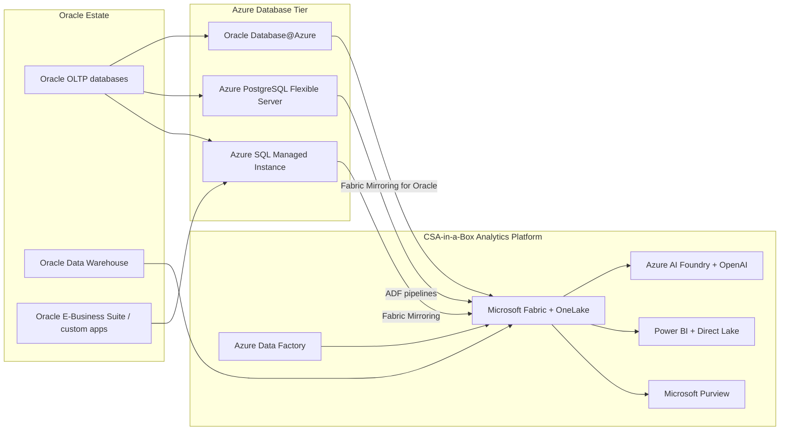

# Migrating from Oracle Database to Azure

**Status:** Authored 2026-04-30
**Audience:** Federal CIO / CDO / DBA leads / Enterprise Architects running Oracle Database estates and migrating to Azure-native managed databases or Oracle Database@Azure.
**Scope:** Oracle Database (Enterprise Edition, Standard Edition 2, RAC, Exadata) migrating to Azure SQL Managed Instance, Azure Database for PostgreSQL, Oracle Database@Azure, or SQL Server on Azure VMs. Covers schema conversion, data movement, security migration, and CSA-in-a-Box analytics integration.

---

!!! tip "Expanded Migration Center Available"
This playbook is the core migration reference. For the complete Oracle-to-Azure migration package -- including white papers, deep-dive guides, tutorials, benchmarks, and federal-specific guidance -- visit the **[Oracle to Azure Migration Center](oracle-to-azure/index.md)**.

    **Quick links:**

    - [Why Azure over Oracle (Executive Brief)](oracle-to-azure/why-azure-over-oracle.md)
    - [Total Cost of Ownership Analysis](oracle-to-azure/tco-analysis.md)
    - [Complete Feature Mapping (50+ features)](oracle-to-azure/feature-mapping-complete.md)
    - [Federal Migration Guide](oracle-to-azure/federal-migration-guide.md)
    - [Tutorials & Walkthroughs](oracle-to-azure/index.md#tutorials)
    - [Benchmarks & Performance](oracle-to-azure/benchmarks.md)
    - [Best Practices](oracle-to-azure/best-practices.md)

    **Migration guides by target:** [Azure SQL](oracle-to-azure/azure-sql-migration.md) | [PostgreSQL](oracle-to-azure/postgresql-migration.md) | [Oracle DB@Azure](oracle-to-azure/oracle-at-azure.md) | [Schema Conversion](oracle-to-azure/schema-migration.md) | [Data Movement](oracle-to-azure/data-migration.md) | [Security](oracle-to-azure/security-migration.md)

---

## 1. Executive summary

Oracle Database is the world's most deployed commercial RDBMS, but its licensing model -- processor-based pricing, mandatory annual support at 22% of license cost, audit exposure, and aggressive Java SE licensing changes -- creates a financial forcing function that drives migration at scale. Federal agencies operate some of the largest Oracle estates in the world, and every agency CIO is evaluating the same question: migrate away, modernize in place, or embrace Oracle Database@Azure.

Microsoft offers a dual strategy. **Displace:** use SQL Server Migration Assistant (SSMA) to convert Oracle schemas to Azure SQL Managed Instance or Azure Database for PostgreSQL. **Embrace:** use Oracle Database@Azure (Exadata infrastructure co-located in Azure datacenters) to keep Oracle workloads while gaining Azure-native networking, identity, and analytics integration. Both paths land data into the CSA-in-a-Box analytics platform through Fabric Mirroring, Azure Data Factory, or direct connectivity.

This playbook is honest. Oracle Database is a mature, feature-rich RDBMS. Complex PL/SQL codebases, RAC clusters, and Oracle-specific features (Advanced Queuing, Spatial, VPD) require significant conversion effort. The migration is not trivial -- but the licensing economics and cloud-native advantages make it compelling for the majority of federal workloads.

### Target platform decision matrix

| Scenario                                          | Recommended target                                | Why                                                                                                |
| ------------------------------------------------- | ------------------------------------------------- | -------------------------------------------------------------------------------------------------- |
| Standard OLTP workloads, moderate PL/SQL          | **Azure SQL Managed Instance**                    | Near-complete SQL Server feature parity, SSMA handles 80%+ conversion, lowest operational overhead |
| Open-source mandate, PostgreSQL-compatible apps   | **Azure Database for PostgreSQL Flexible Server** | No license cost, ora2pg tooling, strong extension ecosystem, Citus for scale-out                   |
| Complex RAC/Exadata, deep PL/SQL, cannot refactor | **Oracle Database@Azure**                         | Keep Oracle, gain Azure networking + identity + analytics, MACC consumption credits                |
| Legacy apps requiring exact Oracle compatibility  | **SQL Server on Azure VMs**                       | Full SQL Server, SSMA conversion, VM-level control for edge cases                                  |
| Data warehouse / analytics workloads              | **Microsoft Fabric / Synapse**                    | Columnar storage, Spark, Direct Lake, integrated with CSA-in-a-Box                                 |

---

## 2. How CSA-in-a-Box fits

CSA-in-a-Box is the analytics, governance, and AI landing zone that consumes data from migrated Oracle workloads regardless of which target database you choose.

Key integration points:

- **Fabric Mirroring for Azure SQL MI** replicates transactional data to OneLake in near-real-time for analytics without impacting OLTP performance.
- **Fabric Mirroring for Oracle** (preview) replicates Oracle Database@Azure tables directly to OneLake.
- **Azure Data Factory** orchestrates batch data movement from any source (Oracle, PostgreSQL, SQL Server) into the CSA-in-a-Box medallion architecture.
- **Microsoft Purview** catalogs migrated databases, applies classifications (PII, CUI, PHI), and maintains lineage from source Oracle through the analytics layer.
- **Power BI with Direct Lake** serves analytics over migrated data with no data movement from OneLake.

---

## 3. Migration approach summary

### Phase 0 -- Discovery and assessment (Weeks 1-3)

- Run SSMA Assessment Report against all Oracle instances
- Inventory PL/SQL complexity (packages, triggers, functions, procedures)
- Catalog Oracle-specific features in use (RAC, Data Guard, Partitioning, VPD, Advanced Queuing, Spatial)
- Map applications to databases and identify migration dependencies
- Classify workloads: displace (Azure SQL / PostgreSQL) vs. embrace (Oracle DB@Azure)

### Phase 1 -- Landing zone deployment (Weeks 4-6)

- Deploy CSA-in-a-Box foundation (Bicep modules)
- Provision target databases (Azure SQL MI, PostgreSQL Flexible Server, or Oracle DB@Azure)
- Configure networking (VNet integration, Private Endpoints, ExpressRoute for Oracle DB@Azure)
- Establish Purview catalog and classification taxonomies

### Phase 2 -- Schema migration (Weeks 7-14)

- Convert schemas using SSMA (for Azure SQL) or ora2pg (for PostgreSQL)
- Remediate conversion issues (PL/SQL to T-SQL or PL/pgSQL)
- Migrate security model (VPD to row-level security, roles to RBAC)
- Deploy and validate converted schemas in target databases

### Phase 3 -- Data migration (Weeks 15-20)

- Migrate historical data using Azure DMS, SSMA data migration, or Oracle Data Pump + AzCopy
- Configure Fabric Mirroring or ADF pipelines for ongoing replication
- Validate data integrity with row counts, checksums, and business-rule validation

### Phase 4 -- Application cutover (Weeks 21-28)

- Update connection strings and ORM configurations
- Parallel-run period with Oracle as fallback
- Performance validation against benchmarks
- User acceptance testing

### Phase 5 -- Decommission and optimize (Weeks 29-36)

- Decommission Oracle instances
- Terminate Oracle licenses at renewal
- Optimize Azure resource sizing based on production workload data
- Publish cost-avoidance metrics

---

## 4. Federal compliance considerations

- **FedRAMP High:** Azure SQL MI, Azure Database for PostgreSQL, and Oracle Database@Azure all operate within Azure Government FedRAMP High boundary. Control mappings in `csa_platform/csa_platform/governance/compliance/nist-800-53-rev5.yaml`.
- **DoD IL4/IL5:** Azure SQL MI and PostgreSQL Flexible Server are IL5-authorized on Azure Government. Oracle Database@Azure IL5 availability per Microsoft/Oracle roadmap.
- **CMMC 2.0 Level 2:** Practice-level mappings in `csa_platform/csa_platform/governance/compliance/cmmc-2.0-l2.yaml`.
- **HIPAA:** BAA-covered services; mappings in `csa_platform/csa_platform/governance/compliance/hipaa-security-rule.yaml`.
- **Oracle audit risk:** Federal agencies face unique audit exposure. License termination at migration eliminates ongoing compliance risk.

---

## 5. Cost impact

For a **typical mid-sized federal Oracle estate** (10 production databases, 500 CPU cores licensed, 20 TB data, Enterprise Edition with RAC + Partitioning + Diagnostics Pack):

- **Oracle annual cost:** $3M-$6M/year (license amortization + 22% annual support + infrastructure)
- **Azure SQL MI equivalent:** $800K-$1.5M/year (Business Critical tier, 99.99% SLA, built-in HA)
- **Azure PostgreSQL equivalent:** $400K-$900K/year (no license cost, Flexible Server, Citus for scale-out)
- **Oracle DB@Azure:** $1.5M-$3M/year (Exadata infrastructure + Oracle licensing, MACC credits applicable)

The 3-year savings for displacement targets (Azure SQL MI or PostgreSQL) typically range from $5M to $15M, depending on Oracle edition, options, and infrastructure costs eliminated.

See [Total Cost of Ownership Analysis](oracle-to-azure/tco-analysis.md) for detailed projections.

---

## 6. Related resources

- **Migration center:** [Oracle to Azure Migration Center](oracle-to-azure/index.md)
- **Migration index:** [docs/migrations/README.md](README.md)
- **Decision trees:** `docs/decisions/fabric-vs-databricks-vs-synapse.md`
- **Compliance matrices:**
    - `docs/compliance/nist-800-53-rev5.md`
    - `docs/compliance/cmmc-2.0-l2.md`
    - `docs/compliance/hipaa-security-rule.md`
- **CSA-in-a-Box guides:**
    - `docs/guides/azure-sql.md` -- Azure SQL integration patterns
    - `docs/guides/sql-server-integration.md` -- SQL Server patterns
    - `docs/ARCHITECTURE.md` -- Platform architecture
    - `docs/GOV_SERVICE_MATRIX.md` -- Government service availability
    - `docs/COST_MANAGEMENT.md` -- FinOps and cost optimization

---

**Maintainers:** csa-inabox core team
**Last updated:** 2026-04-30
