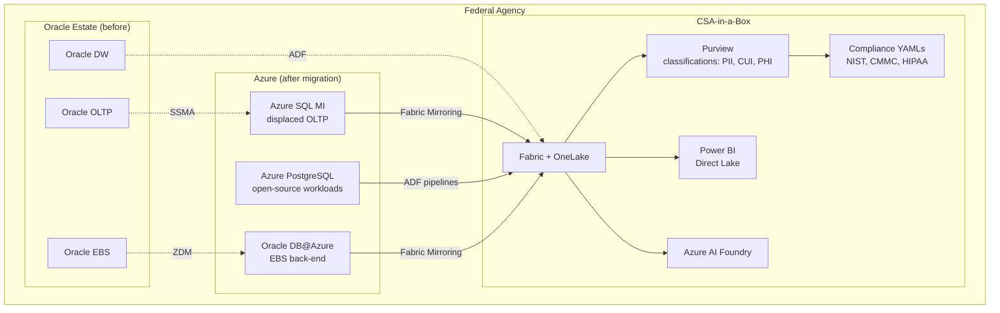

# Oracle Migration in Federal Government

**Oracle displacement in federal agencies: Azure SQL/PostgreSQL in Gov regions, FedRAMP and IL compliance, Oracle licensing audits in government, MACC for Oracle DB@Azure, and CSA-in-a-Box integration for federal analytics.**

---

!!! abstract "Federal Oracle landscape"
The US federal government is one of Oracle's largest customers globally. Federal Oracle spending is estimated at $1B-$2B annually across civilian, defense, and intelligence agencies. Every major department -- Treasury, IRS, DoD, VA, HHS, DHS, DoJ, State, Commerce -- operates significant Oracle estates. Oracle licensing audits in the federal sector have intensified, and several agencies have disclosed multi-million-dollar true-up settlements. The combination of licensing pressure, open-source maturity, and cloud-native capabilities creates a compelling migration case for federal CIOs.

---

## 1. Federal Oracle footprint

### 1.1 Oracle across federal agencies

| Agency / Department      | Oracle usage                                 | Estimated annual spend | Migration drivers                       |
| ------------------------ | -------------------------------------------- | ---------------------- | --------------------------------------- |
| **Treasury / IRS**       | Core tax processing, financial systems       | $100M+                 | Modernization mandate, cloud-first      |
| **DoD (Army, Navy, AF)** | ERP (EBS, PeopleSoft), logistics, HR         | $200M+                 | JEDI/JWCC consolidation, IL5 compliance |
| **VA**                   | VistA back-end, benefits processing          | $80M+                  | VA modernization, interoperability      |
| **HHS / CMS**            | Medicare/Medicaid systems, grants management | $60M+                  | HIPAA compliance, data analytics        |
| **DHS / CBP**            | Border systems, case management              | $50M+                  | Security modernization, FedRAMP         |
| **DoJ**                  | Case management, eDiscovery, legal analytics | $40M+                  | Litigation support modernization        |
| **State**                | Passport, consular, diplomatic systems       | $30M+                  | Global deployment requirements          |
| **Commerce / Census**    | Census data processing, economic indicators  | $25M+                  | Data analytics modernization            |
| **Interior / USGS**      | Natural resource management, geospatial      | $20M+                  | Geospatial migration to PostGIS         |
| **NASA**                 | Mission data, research databases             | $15M+                  | Scientific computing modernization      |

### 1.2 Federal procurement patterns

| Pattern                | Description                                     | Impact on migration                                          |
| ---------------------- | ----------------------------------------------- | ------------------------------------------------------------ |
| **BPA/IDIQ contracts** | Multi-year Oracle blanket purchase agreements   | Lock-in until contract end; plan migration for renewal cycle |
| **GSA Schedule**       | Oracle products on GSA IT Schedule 70           | Standard pricing; no negotiation leverage                    |
| **SEWP**               | NASA SEWP contract for Oracle hardware/software | Alternative procurement vehicle                              |
| **MACC**               | Microsoft Azure Consumption Commitment          | Oracle DB@Azure spend counts toward MACC                     |
| **ULA**                | Unlimited License Agreement (Oracle-specific)   | Complex exit; certification process creates risk             |

---

## 2. Compliance and authorization

### 2.1 Azure database services in Gov regions

| Service                              | Azure Government  | FedRAMP High | DoD IL4     | DoD IL5    | DoD IL6       |
| ------------------------------------ | ----------------- | ------------ | ----------- | ---------- | ------------- |
| **Azure SQL MI**                     | GA                | Authorized   | Authorized  | Authorized | Not available |
| **Azure SQL Database**               | GA                | Authorized   | Authorized  | Authorized | Not available |
| **Azure PostgreSQL Flexible Server** | GA                | Authorized   | Authorized  | Authorized | Not available |
| **Oracle DB@Azure**                  | Roadmap           | Roadmap      | Roadmap     | Roadmap    | Not available |
| **SQL Server on Azure VMs**          | GA                | Authorized   | Authorized  | Authorized | Not available |
| **Microsoft Fabric**                 | Preview/GA varies | In progress  | In progress | Roadmap    | Not available |

!!! warning "Oracle DB@Azure in Gov"
Oracle Database@Azure is not yet available in Azure Government regions. Federal workloads requiring Azure Gov deployment should target Azure SQL MI or Azure PostgreSQL Flexible Server for displacement, or evaluate the Oracle DB@Azure Gov roadmap with Microsoft and Oracle account teams.

### 2.2 FedRAMP control mapping

CSA-in-a-Box maps NIST 800-53 Rev 5 controls for database services in `csa_platform/csa_platform/governance/compliance/nist-800-53-rev5.yaml`. Key control families for database migration:

| Control family                 | Oracle (self-managed)       | Azure SQL MI / PostgreSQL                                                |
| ------------------------------ | --------------------------- | ------------------------------------------------------------------------ |
| **AC (Access Control)**        | Oracle users, roles, VPD    | Entra ID, RBAC, RLS -- control AC-2, AC-3, AC-6 inherited from Azure Gov |
| **AU (Audit)**                 | Oracle Unified Auditing     | Azure SQL Auditing + Azure Monitor -- AU-2, AU-3, AU-6                   |
| **IA (Identification)**        | Oracle authentication       | Entra ID with MFA -- IA-2, IA-5                                          |
| **SC (System Communications)** | Oracle Net encryption       | TLS 1.2+ enforced, TDE -- SC-8, SC-13, SC-28                             |
| **CM (Configuration)**         | Customer-managed patches    | Automated patching -- CM-3, CM-6                                         |
| **CP (Contingency)**           | Customer-managed backups    | Automated geo-redundant backups -- CP-9, CP-10                           |
| **SI (System Integrity)**      | Customer-managed monitoring | Azure Defender for SQL -- SI-4, SI-5                                     |

### 2.3 CMMC 2.0 Level 2 for DIB contractors

Defense Industrial Base contractors running Oracle databases for CUI processing:

- Azure SQL MI and PostgreSQL are authorized for CUI in Azure Government
- CSA-in-a-Box maps CMMC practices in `csa_platform/csa_platform/governance/compliance/cmmc-2.0-l2.yaml`
- Oracle displacement eliminates Oracle audit risk for DIB-specific compliance
- Key CMMC practices: AC.L2-3.1.1 (access control), AU.L2-3.3.1 (audit), SC.L2-3.13.1 (encryption)

### 2.4 HIPAA for health agencies

HHS, VA, IHS, and tribal health organizations:

- Azure SQL MI and PostgreSQL are BAA-covered services
- CSA-in-a-Box maps HIPAA controls in `csa_platform/csa_platform/governance/compliance/hipaa-security-rule.yaml`
- See `examples/tribal-health/` for a worked HIPAA-scoped implementation
- Oracle displacement simplifies BAA scope (fewer vendors)

---

## 3. Oracle licensing audits in federal

### 3.1 Federal audit landscape

Oracle License Management Services (LMS) conducts audits of federal agencies with increasing frequency:

| Audit factor            | Federal context                                                                          |
| ----------------------- | ---------------------------------------------------------------------------------------- |
| **Audit trigger**       | License renewal, major procurement, contract dispute, routine compliance                 |
| **Frequency**           | Every 18-36 months for large federal accounts                                            |
| **Scope**               | All Oracle products deployed across the agency, not just the products under renewal      |
| **Virtualization**      | VMware clusters are the most common finding -- all hosts in the cluster must be licensed |
| **Cloud**               | Oracle on AWS/Azure VMs requires specific licensing calculations                         |
| **Java SE**             | January 2023 employee-based licensing change creates retroactive exposure                |
| **Average finding**     | $500K-$5M for mid-sized agencies; $10M+ for large departments                            |
| **Remediation options** | Pay back-licensing + support, or "upgrade" to ULA                                        |

### 3.2 Eliminating audit risk through migration

Migrating off Oracle eliminates audit exposure for displaced databases:

```
Before migration:
  - 50 Oracle databases across 5 agencies
  - $2M/year audit risk (expected value)
  - $500K/year internal compliance team cost
  - Procurement team managing Oracle contracts

After displacement to Azure SQL MI / PostgreSQL:
  - 0 Oracle databases (for displaced workloads)
  - $0 Oracle audit risk
  - $0 Oracle compliance team cost
  - Simplified vendor management (Azure only)
```

### 3.3 ULA exit strategy

Agencies on Oracle Unlimited License Agreements face a complex exit:

1. **Certification:** At ULA end, Oracle requires a deployment certification listing all Oracle installations
2. **Risk:** Under-reporting during certification leads to compliance gap
3. **Strategy:** Migrate off Oracle before ULA end, certify zero deployments
4. **Timeline:** Start migration 18-24 months before ULA expiration

---

## 4. MACC and federal procurement

### 4.1 Microsoft Azure Consumption Commitment (MACC)

MACC is a committed-spend agreement with Microsoft for Azure services. Key implications for Oracle migration:

| MACC detail                        | Impact                                                    |
| ---------------------------------- | --------------------------------------------------------- |
| **Azure SQL MI**                   | All charges count toward MACC                             |
| **Azure PostgreSQL**               | All charges count toward MACC                             |
| **Oracle DB@Azure infrastructure** | Infrastructure charges count toward MACC                  |
| **Oracle DB@Azure licenses**       | License charges do NOT count toward MACC                  |
| **Microsoft Fabric**               | All charges count toward MACC                             |
| **Consolidation benefit**          | Single committed-spend vehicle for all database workloads |

### 4.2 Federal procurement simplification

| Oracle procurement                           | Azure procurement                |
| -------------------------------------------- | -------------------------------- |
| Separate Oracle contract (license + support) | Single Azure EA or CSP agreement |
| Annual true-up risk                          | Consumption-based (no true-up)   |
| Named-user or processor licensing            | vCore / compute-based            |
| Separate Oracle support contract (22%)       | Included in service price        |
| Oracle hardware procurement (Exadata)        | Included in managed service      |
| Multiple vendor management                   | Single vendor (Microsoft)        |

---

## 5. Federal migration patterns

### 5.1 Pattern 1: Commodity OLTP displacement

For standard OLTP databases (HR, finance, case management, grants):

```
Current: Oracle EE + RAC + Partitioning + Diagnostics
Target:  Azure SQL MI Business Critical
Savings: 60-75% annual cost reduction
Tools:   SSMA assessment + conversion, Azure DMS for data
Timeline: 12-16 weeks per database
```

### 5.2 Pattern 2: Open-source mandate compliance

For agencies with open-source-first policies:

```
Current: Oracle EE (standard OLTP)
Target:  Azure Database for PostgreSQL Flexible Server
Savings: 75-85% annual cost reduction (zero license)
Tools:   ora2pg assessment + conversion
Timeline: 16-24 weeks per database (PL/SQL conversion takes longer)
Federal: PostGIS replaces Oracle Spatial (USGS, NOAA, Interior)
```

### 5.3 Pattern 3: EBS/PeopleSoft retain-and-integrate

For Oracle E-Business Suite or PeopleSoft workloads:

```
Current: Oracle EE on Exadata (on-premises)
Target:  Oracle DB@Azure (retain Oracle, gain Azure integration)
Savings: 20-35% (infrastructure only; Oracle licensing retained)
Tools:   Oracle ZDM, Data Guard
Timeline: 8-12 weeks
Integration: Fabric Mirroring to OneLake for analytics
```

### 5.4 Pattern 4: Data warehouse displacement

For Oracle-based data warehouses being modernized:

```
Current: Oracle EE + Partitioning + In-Memory + Compression
Target:  Microsoft Fabric SQL Endpoint + Direct Lake
Savings: 70-80% annual cost reduction
Tools:   ADF for data movement, dbt for transformation
Timeline: 20-30 weeks (includes analytics rebuild)
CSA-in-a-Box: Full medallion architecture deployment
```

---

## 6. CSA-in-a-Box for federal Oracle migration

### 6.1 Analytics landing zone

CSA-in-a-Box provides the analytics and governance platform for migrated Oracle workloads:



### 6.2 Compliance evidence chain

For each migrated database, CSA-in-a-Box produces:

1. **Purview catalog entry** with classifications (PII, CUI, PHI per column)
2. **Data lineage** from source Oracle through ADF/Mirroring to OneLake to Power BI
3. **Audit trail** via Azure Monitor + tamper-evident logger (CSA-0016)
4. **Control mapping** in machine-readable YAML consumed by 3PAOs for SSP generation
5. **Data contracts** via dbt `contract.yaml` validated in CI/CD

### 6.3 Federal-specific patterns in CSA-in-a-Box

| Pattern                    | Repo location                                                                                  | Oracle migration relevance                |
| -------------------------- | ---------------------------------------------------------------------------------------------- | ----------------------------------------- |
| Government classifications | `csa_platform/csa_platform/governance/purview/classifications/government_classifications.yaml` | Apply CUI/ITAR markings to migrated data  |
| Tribal health (HIPAA)      | `examples/tribal-health/`                                                                      | IHS/tribal Oracle displacement with HIPAA |
| Casino analytics           | `examples/casino-analytics/`                                                                   | Tribal gaming Oracle displacement         |
| EPA environmental          | `examples/epa/`                                                                                | EPA Oracle data warehouse modernization   |
| DOT transportation         | `examples/dot/`                                                                                | DOT Oracle systems modernization          |
| USDA agriculture           | `examples/usda/`                                                                               | USDA Oracle analytics replacement         |

---

## 7. Timeline and staffing for federal migrations

### 7.1 Representative federal migration timeline

| Phase                               | Duration   | Activities                                      | Federal-specific                         |
| ----------------------------------- | ---------- | ----------------------------------------------- | ---------------------------------------- |
| **Authority to Operate (ATO) prep** | 4-8 weeks  | Document controls for migrated databases in SSP | NIST 800-53, FedRAMP, IL compliance      |
| **Discovery and assessment**        | 2-4 weeks  | SSMA/ora2pg assessment, application inventory   | Include FISMA system boundaries          |
| **Landing zone deployment**         | 3-4 weeks  | CSA-in-a-Box + database targets                 | Azure Gov deployment, Private Endpoints  |
| **Schema migration**                | 6-12 weeks | PL/SQL conversion, security model migration     | VPD to RLS, audit configuration          |
| **Data migration**                  | 4-8 weeks  | Historical data + incremental sync              | CUI data handling, encryption in transit |
| **Application testing**             | 4-8 weeks  | Functional, performance, security testing       | ST&E (Security Test & Evaluation)        |
| **Parallel run**                    | 4-6 weeks  | Both systems live, data reconciliation          | Stakeholder sign-off                     |
| **Cutover and decommission**        | 2-4 weeks  | Switch applications, terminate Oracle           | License termination at renewal           |

### 7.2 Staffing model

| Role                  | FTE | Duration                          | Skills                              |
| --------------------- | --- | --------------------------------- | ----------------------------------- |
| Migration architect   | 1   | Full project                      | Oracle + Azure + CSA-in-a-Box       |
| Oracle DBA            | 1-2 | Assessment through cutover        | Oracle internals, PL/SQL            |
| Azure DBA             | 1-2 | Landing zone through optimization | Azure SQL MI or PostgreSQL          |
| Application developer | 2-4 | Schema migration through testing  | T-SQL or PL/pgSQL, application code |
| Security engineer     | 1   | Throughout                        | FedRAMP, NIST controls, encryption  |
| Test engineer         | 1-2 | Testing through cutover           | Functional + performance testing    |
| Project manager       | 1   | Full project                      | Federal acquisition, agile          |

---

## 8. Recommendations for federal CIOs

1. **Start with assessment.** Run SSMA or ora2pg against your Oracle estate now. The assessment is free and non-intrusive. Understanding your PL/SQL complexity and Oracle feature usage is the first step.

2. **Align with license renewal.** Plan migration completion to coincide with Oracle license renewal dates. This maximizes cost avoidance and eliminates the need for interim support payments.

3. **Use MACC strategically.** If you have an existing MACC, all Azure database services (and Oracle DB@Azure infrastructure) count toward your commitment. This simplifies procurement.

4. **Leverage CSA-in-a-Box for analytics.** Do not rebuild analytics in the target database. Use Fabric Mirroring + CSA-in-a-Box medallion architecture + Power BI for analytics. This is faster and produces a more capable analytics platform.

5. **Plan for hybrid.** Most large federal agencies will not achieve 100% Oracle displacement. Plan for a hybrid state with Azure SQL MI / PostgreSQL for commodity workloads and Oracle DB@Azure for complex workloads.

6. **Address compliance early.** Engage your ISSO and 3PAO early. CSA-in-a-Box's machine-readable control YAMLs accelerate the SSP update process, but the security review should start in Phase 1, not Phase 5.

---

**Maintainers:** csa-inabox core team
**Last updated:** 2026-04-30
