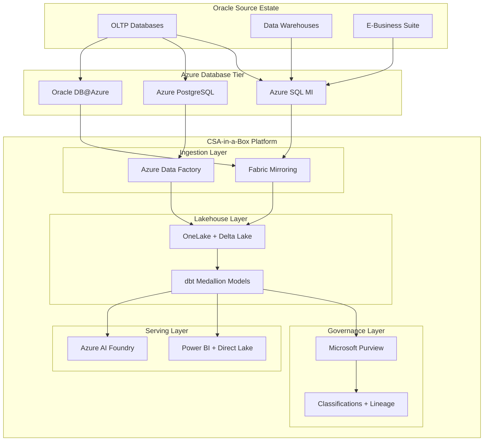

# Oracle Database to Azure Migration Center

**The definitive resource for migrating from Oracle Database to Microsoft Azure -- whether displacing Oracle entirely with Azure SQL or PostgreSQL, or embracing Oracle Database@Azure for workloads that must remain on Oracle.**

---

## Who this is for

This migration center serves federal CIOs, CDOs, Chief Data Architects, database administrators, platform engineers, and application teams who are evaluating or executing a migration from Oracle Database to Azure-native managed databases. Whether you are responding to Oracle license renewal sticker shock, an open-source mandate, audit risk mitigation, or a strategic consolidation onto Azure, these resources provide the evidence, patterns, and step-by-step guidance to execute confidently.

### Audience by role

| Role                          | Start here                                            | Key concern                                                     |
| ----------------------------- | ----------------------------------------------------- | --------------------------------------------------------------- |
| CIO / CDO / Executive sponsor | [Why Azure over Oracle](why-azure-over-oracle.md)     | Strategic rationale, vendor risk, innovation velocity           |
| CFO / Procurement             | [TCO Analysis](tco-analysis.md)                       | Licensing savings, 3/5-year projections, audit risk elimination |
| Enterprise Architect          | [Feature Mapping](feature-mapping-complete.md)        | Capability parity, gap analysis, architectural decisions        |
| DBA / Database Engineer       | [Schema Migration](schema-migration.md)               | PL/SQL conversion, data type mapping, performance tuning        |
| Application Developer         | [Azure SQL Migration](azure-sql-migration.md)         | Connection string changes, ORM updates, query refactoring       |
| Security / Compliance         | [Security Migration](security-migration.md)           | VPD migration, encryption, audit, FedRAMP inheritance           |
| Federal Program Manager       | [Federal Migration Guide](federal-migration-guide.md) | IL compliance, MACC credits, Oracle in Gov regions              |

---

## Quick-start decision matrix

| Your situation                               | Start here                                                             |
| -------------------------------------------- | ---------------------------------------------------------------------- |
| Executive evaluating Oracle displacement     | [Why Azure over Oracle](why-azure-over-oracle.md)                      |
| Need cost justification for migration        | [Total Cost of Ownership Analysis](tco-analysis.md)                    |
| Need a feature-by-feature comparison         | [Complete Feature Mapping (50+ features)](feature-mapping-complete.md) |
| Standard OLTP, moderate PL/SQL complexity    | [Azure SQL MI Migration](azure-sql-migration.md)                       |
| Open-source mandate or PostgreSQL preference | [PostgreSQL Migration](postgresql-migration.md)                        |
| Cannot refactor, must keep Oracle engine     | [Oracle Database@Azure](oracle-at-azure.md)                            |
| Need PL/SQL to T-SQL conversion patterns     | [Schema Migration](schema-migration.md)                                |
| Planning data movement strategy              | [Data Migration](data-migration.md)                                    |
| Federal/government-specific requirements     | [Federal Migration Guide](federal-migration-guide.md)                  |
| Want a hands-on SSMA walkthrough             | [Tutorial: SSMA Migration](tutorial-ssma-migration.md)                 |
| Want a hands-on ora2pg walkthrough           | [Tutorial: Oracle to PostgreSQL](tutorial-oracle-to-postgres.md)       |
| Need performance comparison data             | [Benchmarks](benchmarks.md)                                            |
| Ready to plan full migration                 | [Migration Playbook](../oracle-to-azure.md)                            |

---

## Target platform comparison

The first and most consequential decision is which Azure database platform to target. Oracle workloads typically land on one of four targets.

| Criterion                   | Azure SQL MI                               | Azure PostgreSQL                                           | Oracle DB@Azure                                   | SQL Server on VM                            |
| --------------------------- | ------------------------------------------ | ---------------------------------------------------------- | ------------------------------------------------- | ------------------------------------------- |
| **Best for**                | OLTP, moderate PL/SQL, Microsoft ecosystem | Open-source mandate, cost-sensitive, PostgreSQL-compatible | Complex RAC/Exadata, deep PL/SQL, cannot refactor | Legacy apps needing full SQL Server control |
| **License cost**            | Included in service                        | None (open source)                                         | Oracle licensing required (MACC eligible)         | SQL Server license (AHB eligible)           |
| **PL/SQL conversion**       | SSMA (automated 80%+)                      | ora2pg (automated 60-70%)                                  | Not required                                      | SSMA (automated 80%+)                       |
| **High availability**       | Built-in (99.99% SLA)                      | Built-in (zone-redundant)                                  | RAC + Data Guard                                  | Always On (customer-managed)                |
| **Max database size**       | 16 TB                                      | 64 TB                                                      | Exadata scale                                     | VM disk limits                              |
| **Horizontal scale-out**    | Elastic pools                              | Citus extension                                            | RAC                                               | Not built-in                                |
| **Managed service**         | Yes (PaaS)                                 | Yes (PaaS)                                                 | Yes (Oracle-managed Exadata)                      | No (IaaS)                                   |
| **Fabric Mirroring**        | GA                                         | Via ADF pipelines                                          | Preview (Mirroring for Oracle)                    | Via ADF pipelines                           |
| **Gov region availability** | GA in Azure Gov                            | GA in Azure Gov                                            | Roadmap for Azure Gov                             | GA in Azure Gov                             |
| **Migration complexity**    | Medium                                     | Medium-High                                                | Low (lift and shift)                              | Medium                                      |

---

## How CSA-in-a-Box fits

Regardless of which target database you choose, CSA-in-a-Box serves as the unified analytics, governance, and AI platform that consumes data from migrated Oracle workloads.

Key integration patterns:

- **Fabric Mirroring** replicates Azure SQL MI and Oracle DB@Azure tables to OneLake in near-real-time, enabling analytics without impacting transactional workloads
- **Azure Data Factory** pipelines in `domains/shared/pipelines/adf/` orchestrate batch ingestion from PostgreSQL and other sources into the CSA-in-a-Box medallion architecture
- **Microsoft Purview** in `csa_platform/csa_platform/governance/purview/` catalogs migrated databases, applies data classifications (PII, CUI, PHI), and maintains end-to-end lineage
- **dbt models** in `domains/shared/dbt/` transform raw Oracle data through bronze/silver/gold layers with enforced contracts
- **Power BI with Direct Lake** serves analytics directly from OneLake with no data copy

---

## Strategic resources

Documents providing the business case, cost analysis, and strategic framing for decision-makers.

| Document                                          | Audience                      | Description                                                                                                                                |
| ------------------------------------------------- | ----------------------------- | ------------------------------------------------------------------------------------------------------------------------------------------ |
| [Why Azure over Oracle](why-azure-over-oracle.md) | CIO / CDO / Board             | Executive brief: licensing economics, open-source maturity, cloud-native advantages, AI integration, talent availability                   |
| [Total Cost of Ownership](tco-analysis.md)        | CFO / CIO / Procurement       | Oracle licensing breakdown (EE + RAC + options + 22% support), Azure target cost modeling, 3/5-year projections, audit risk quantification |
| [Feature Mapping](feature-mapping-complete.md)    | CTO / Enterprise Architecture | 50+ Oracle features mapped to Azure equivalents with conversion complexity and CSA-in-a-Box integration notes                              |
| [Benchmarks](benchmarks.md)                       | CTO / Platform Engineering    | Query performance, transaction throughput, IOPS, concurrent session handling, cost-per-transaction comparison                              |

---

## Migration guides

Target-specific deep dives covering every aspect of an Oracle-to-Azure migration.

| Guide                                            | Migration path                                   | Key tools                                               |
| ------------------------------------------------ | ------------------------------------------------ | ------------------------------------------------------- |
| [Azure SQL MI Migration](azure-sql-migration.md) | Oracle to Azure SQL Managed Instance             | SSMA, Azure DMS, Fabric Mirroring                       |
| [PostgreSQL Migration](postgresql-migration.md)  | Oracle to Azure Database for PostgreSQL          | ora2pg, pgloader, Citus                                 |
| [Oracle Database@Azure](oracle-at-azure.md)      | Oracle to Oracle DB@Azure (Exadata in Azure)     | ZDM, Data Guard, GoldenGate                             |
| [Schema Migration](schema-migration.md)          | PL/SQL to T-SQL and PL/pgSQL conversion patterns | SSMA, ora2pg, manual refactoring                        |
| [Data Migration](data-migration.md)              | Data movement strategies and tools               | Azure DMS, ADF, Data Pump, Fabric Mirroring, GoldenGate |
| [Security Migration](security-migration.md)      | Oracle security model to Azure security model    | VPD to RLS, TDE key migration, audit migration          |

---

## Tutorials

Hands-on, step-by-step walkthroughs for common migration scenarios.

| Tutorial                                                           | Duration  | What you will build                                                                                                             |
| ------------------------------------------------------------------ | --------- | ------------------------------------------------------------------------------------------------------------------------------- |
| [SSMA Migration to Azure SQL MI](tutorial-ssma-migration.md)       | 3-4 hours | Install SSMA, assess an Oracle database, convert schema, remediate issues, migrate data, validate on Azure SQL MI               |
| [Oracle to PostgreSQL with ora2pg](tutorial-oracle-to-postgres.md) | 3-4 hours | Install ora2pg, analyze Oracle schema, convert to PostgreSQL, deploy to Azure Database for PostgreSQL Flexible Server, validate |

---

## Federal and government

| Document                                              | Description                                                                                                                                                    |
| ----------------------------------------------------- | -------------------------------------------------------------------------------------------------------------------------------------------------------------- |
| [Federal Migration Guide](federal-migration-guide.md) | Oracle displacement in federal agencies, Azure Gov region availability, FedRAMP/IL compliance, Oracle licensing audits in government, MACC for Oracle DB@Azure |

---

## Assessment and planning

| Document                            | Description                                                                                                                                                                |
| ----------------------------------- | -------------------------------------------------------------------------------------------------------------------------------------------------------------------------- |
| [Best Practices](best-practices.md) | Assessment methodology (SSMA assessment report), complexity tiers, workload decomposition, application testing strategy, parallel-run validation, CSA-in-a-Box integration |

---

## Timeline expectations

Migration timelines depend heavily on Oracle estate complexity. These are representative ranges.

| Oracle estate size | Databases                   | PL/SQL complexity                                | Typical duration |
| ------------------ | --------------------------- | ------------------------------------------------ | ---------------- |
| Small              | 1-5 databases, < 1 TB       | Low (< 50 stored procedures)                     | 8-12 weeks       |
| Medium             | 5-20 databases, 1-10 TB     | Medium (50-500 stored procedures, some packages) | 16-24 weeks      |
| Large              | 20-100 databases, 10-100 TB | High (500+ stored procedures, RAC, partitioning) | 24-40 weeks      |
| Enterprise         | 100+ databases, 100+ TB     | Very high (complex PL/SQL, AQ, Spatial, VPD)     | 40-60+ weeks     |

---

## Navigation

### By migration phase

1. **Assess:** [Feature Mapping](feature-mapping-complete.md) | [TCO Analysis](tco-analysis.md) | [Benchmarks](benchmarks.md)
2. **Plan:** [Migration Playbook](../oracle-to-azure.md) | [Best Practices](best-practices.md) | [Federal Guide](federal-migration-guide.md)
3. **Convert:** [Schema Migration](schema-migration.md) | [Azure SQL Migration](azure-sql-migration.md) | [PostgreSQL Migration](postgresql-migration.md)
4. **Move:** [Data Migration](data-migration.md) | [Security Migration](security-migration.md)
5. **Validate:** [Benchmarks](benchmarks.md) | [Best Practices](best-practices.md)
6. **Optimize:** [CSA-in-a-Box integration](../oracle-to-azure.md#2-how-csa-in-a-box-fits) | [Cost Management](../../COST_MANAGEMENT.md)

### By Oracle feature

| Oracle feature                         | Conversion guide                                                  |
| -------------------------------------- | ----------------------------------------------------------------- |
| PL/SQL packages, procedures, functions | [Schema Migration](schema-migration.md)                           |
| RAC (Real Application Clusters)        | [Feature Mapping](feature-mapping-complete.md#high-availability)  |
| Data Guard                             | [Feature Mapping](feature-mapping-complete.md#disaster-recovery)  |
| Partitioning                           | [Feature Mapping](feature-mapping-complete.md#partitioning)       |
| Virtual Private Database (VPD)         | [Security Migration](security-migration.md)                       |
| Transparent Data Encryption (TDE)      | [Security Migration](security-migration.md)                       |
| Advanced Queuing (AQ)                  | [Feature Mapping](feature-mapping-complete.md#messaging)          |
| Oracle Spatial                         | [Feature Mapping](feature-mapping-complete.md#spatial)            |
| Materialized Views                     | [Feature Mapping](feature-mapping-complete.md#materialized-views) |
| Oracle Text / Full-Text                | [Feature Mapping](feature-mapping-complete.md#full-text-search)   |

---

**Maintainers:** csa-inabox core team
**Last updated:** 2026-04-30
