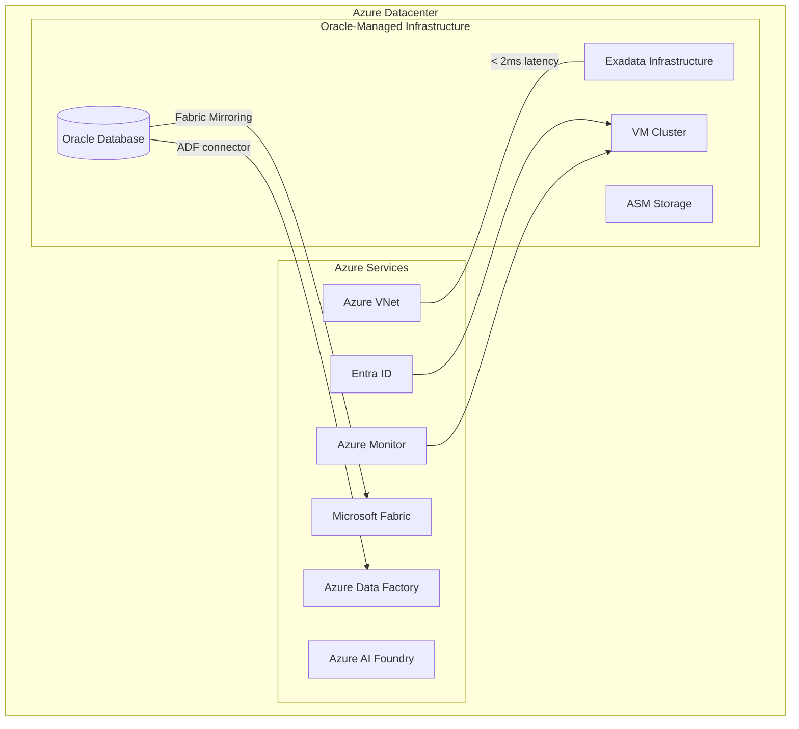

# Oracle Database@Azure

**When to keep Oracle, how Oracle Database@Azure works, Exadata in Azure datacenters, low-latency Azure integration, MACC consumption credits, and migration tools (ZDM, Data Guard, GoldenGate).**

---

!!! abstract "When to choose Oracle Database@Azure"
Choose Oracle Database@Azure when you cannot or should not migrate off Oracle -- deep PL/SQL codebases (100K+ lines), applications certified only on Oracle (EBS, PeopleSoft, Siebel), RAC/Exadata performance requirements, or an incremental migration strategy where individual databases will be displaced over 2-3 years while gaining immediate Azure integration for analytics and AI.

---

## 1. What is Oracle Database@Azure

Oracle Database@Azure is Oracle-managed Exadata infrastructure physically co-located in Azure datacenters with a low-latency cross-connect to Azure services. It is not Oracle Cloud Infrastructure (OCI) -- it runs within the Azure environment with Azure networking, identity, and billing integration.

### 1.1 Architecture



### 1.2 Key characteristics

| Characteristic     | Detail                                                                                           |
| ------------------ | ------------------------------------------------------------------------------------------------ |
| **Infrastructure** | Oracle Exadata X9M/X10M hardware in Azure datacenters                                            |
| **Management**     | Oracle manages Exadata infrastructure; customer manages databases                                |
| **Networking**     | Direct VNet integration, < 2ms latency to Azure services                                         |
| **Identity**       | Entra ID for Azure portal access; Oracle users for database access                               |
| **Billing**        | Infrastructure charges through Azure bill (MACC eligible); Oracle license charges through Oracle |
| **Provisioning**   | Azure Portal or Azure CLI for infrastructure; Oracle tools for database                          |
| **Monitoring**     | Azure Monitor for infrastructure; Oracle Enterprise Manager or Azure Monitor for database        |
| **Regions**        | Available in select Azure regions (expanding)                                                    |
| **Gov regions**    | Roadmap (not yet available in Azure Government)                                                  |

---

## 2. When Oracle Database@Azure makes sense

### 2.1 Decision criteria

| Factor                    | Displace Oracle                           | Keep Oracle (DB@Azure)                   |
| ------------------------- | ----------------------------------------- | ---------------------------------------- |
| PL/SQL codebase size      | < 50,000 lines                            | > 100,000 lines                          |
| Application certification | Flexible (supports SQL Server/PostgreSQL) | Oracle-only (EBS, PeopleSoft, Siebel)    |
| Oracle-specific features  | Few (standard OLTP)                       | Many (RAC, AQ, Spatial, VPD, OLS)        |
| Migration timeline        | Acceptable (6-12 months)                  | Cannot tolerate downtime or risk         |
| Budget for conversion     | Available ($150K-$1M+)                    | Not available or ROI insufficient        |
| DBA skills                | Willing to reskill                        | Deep Oracle expertise, retention desired |
| Strategic direction       | Consolidate on Azure-native               | Incremental displacement over 2-3 years  |

### 2.2 Typical Oracle Database@Azure scenarios

**Scenario 1: EBS back-end database.** Oracle E-Business Suite requires Oracle Database. Move the database to Oracle DB@Azure, gain Azure networking and Fabric analytics integration, and plan to displace EBS itself (to Dynamics 365, SAP on Azure, or custom) on a longer timeline.

**Scenario 2: Complex data warehouse.** A 50 TB Oracle Data Warehouse with 200+ materialized views, 500+ stored procedures, and hundreds of Oracle-specific SQL constructs. Conversion cost exceeds $2M and would take 18+ months. Move to DB@Azure now, mirror to Fabric for modern analytics, and displace individual workloads to Fabric SQL Endpoint or Databricks SQL over time.

**Scenario 3: RAC-dependent OLTP.** An active-active RAC cluster serving a 24/7 mission-critical application that cannot tolerate the active-passive model of Azure SQL MI failover groups. Move to DB@Azure to retain RAC while gaining Azure integration.

---

## 3. Provisioning Oracle Database@Azure

### 3.1 Prerequisites

- Azure subscription with sufficient quota
- Oracle Cloud Infrastructure (OCI) tenancy (created automatically if needed)
- Entra ID tenant for Azure portal access
- VNet with delegated subnet for Exadata infrastructure

### 3.2 Provisioning via Azure CLI

```bash
# Register the Oracle.Database resource provider
az provider register --namespace Oracle.Database

# Create Exadata infrastructure
az oracle-database cloud-exadata-infrastructure create \
    --resource-group rg-oracle-prod \
    --name exadata-prod-01 \
    --location eastus \
    --zone 1 \
    --compute-count 2 \
    --storage-count 3 \
    --shape Exadata.X9M

# Create VM cluster on the infrastructure
az oracle-database cloud-vm-cluster create \
    --resource-group rg-oracle-prod \
    --name vmcluster-prod-01 \
    --location eastus \
    --cloud-exadata-infrastructure-id /subscriptions/.../exadata-prod-01 \
    --cpu-core-count 4 \
    --data-storage-size-in-tbs 2 \
    --db-node-storage-size-in-gbs 120 \
    --memory-size-in-gbs 60 \
    --subnet-id /subscriptions/.../subnets/oracle-subnet \
    --vnet-id /subscriptions/.../virtualNetworks/vnet-prod \
    --ssh-public-keys "$(cat ~/.ssh/id_rsa.pub)" \
    --hostname vmcluster-prod \
    --domain oracle.internal \
    --license-model BringYourOwnLicense \
    --gi-version 19.0.0.0

# Create a database on the VM cluster
az oracle-database db-node list \
    --resource-group rg-oracle-prod \
    --cloud-vm-cluster-name vmcluster-prod-01
```

### 3.3 Database creation (Oracle tools)

After the VM cluster is provisioned, use Oracle Database tools to create databases:

```bash
# Connect to the VM cluster node via SSH
ssh -i ~/.ssh/id_rsa opc@<vm-cluster-ip>

# Create a database using DBCA (Database Configuration Assistant)
dbca -silent \
    -createDatabase \
    -templateName General_Purpose.dbc \
    -gdbName FEDDB \
    -sid FEDDB \
    -characterSet AL32UTF8 \
    -memoryPercentage 40 \
    -emConfiguration NONE \
    -datafileDestination +DATA \
    -recoveryAreaDestination +RECO \
    -storageType ASM \
    -enableArchive true
```

---

## 4. Migrating to Oracle Database@Azure

### 4.1 Oracle Zero Downtime Migration (ZDM)

ZDM automates Oracle-to-Oracle migration with minimal downtime.

```bash
# Install ZDM on a separate Linux host
# (Download from Oracle Technology Network)

# Configure ZDM
zdmcli migrate database \
    -sourcedb FEDDB \
    -sourcenode oracle-onprem.agency.gov \
    -srcauth zdmauth \
    -targetnode <db-azure-node-ip> \
    -tgtauth zdmauth \
    -rsp /opt/zdm/migration/response.rsp \
    -eval  # Evaluation mode first

# Execute migration after successful evaluation
zdmcli migrate database \
    -sourcedb FEDDB \
    -sourcenode oracle-onprem.agency.gov \
    -srcauth zdmauth \
    -targetnode <db-azure-node-ip> \
    -tgtauth zdmauth \
    -rsp /opt/zdm/migration/response.rsp
```

### 4.2 Data Guard for migration

Use Oracle Data Guard to establish a physical standby on Oracle DB@Azure, then switchover.

```sql
-- On source (on-premises): Configure Data Guard
-- 1. Enable ARCHIVELOG mode
ALTER DATABASE ARCHIVELOG;

-- 2. Enable Force Logging
ALTER DATABASE FORCE LOGGING;

-- 3. Configure standby redo logs
ALTER DATABASE ADD STANDBY LOGFILE
    GROUP 4 SIZE 200M,
    GROUP 5 SIZE 200M,
    GROUP 6 SIZE 200M;

-- 4. Set Data Guard parameters
ALTER SYSTEM SET LOG_ARCHIVE_CONFIG='DG_CONFIG=(FEDDB,FEDDB_STBY)';
ALTER SYSTEM SET LOG_ARCHIVE_DEST_2='SERVICE=FEDDB_STBY ASYNC VALID_FOR=(ONLINE_LOGFILES,PRIMARY_ROLE) DB_UNIQUE_NAME=FEDDB_STBY';
ALTER SYSTEM SET FAL_SERVER=FEDDB_STBY;
ALTER SYSTEM SET DB_FILE_NAME_CONVERT='+DATA/FEDDB/','+DATA/FEDDB_STBY/' SCOPE=SPFILE;
ALTER SYSTEM SET LOG_FILE_NAME_CONVERT='+DATA/FEDDB/','+DATA/FEDDB_STBY/' SCOPE=SPFILE;
ALTER SYSTEM SET STANDBY_FILE_MANAGEMENT=AUTO;

-- On target (Oracle DB@Azure): Create standby
-- (Use RMAN DUPLICATE for initial standby creation)

-- Switchover (when ready for cutover)
-- On primary:
ALTER DATABASE SWITCHOVER TO FEDDB_STBY;
-- On new primary (DB@Azure):
ALTER DATABASE OPEN;
```

### 4.3 GoldenGate for zero-downtime migration

For workloads requiring zero downtime, Oracle GoldenGate provides real-time replication.

```bash
# Configure GoldenGate Extract on source
GGSCI> ADD EXTRACT ext_feddb, TRANLOG, BEGIN NOW
GGSCI> ADD EXTTRAIL /ggs/trail/et, EXTRACT ext_feddb
GGSCI> ADD EXTRACT pump_feddb, EXTTRAILSOURCE /ggs/trail/et
GGSCI> ADD RMTTRAIL /ggs/trail/rt, EXTRACT pump_feddb

# Configure GoldenGate Replicat on target (DB@Azure)
GGSCI> ADD REPLICAT rep_feddb, EXTTRAIL /ggs/trail/rt
GGSCI> START EXTRACT ext_feddb
GGSCI> START EXTRACT pump_feddb
GGSCI> START REPLICAT rep_feddb

# Monitor lag
GGSCI> INFO ALL
GGSCI> LAG EXTRACT ext_feddb
GGSCI> LAG REPLICAT rep_feddb
```

---

## 5. Azure integration patterns

### 5.1 Fabric Mirroring for Oracle (preview)

Fabric Mirroring for Oracle replicates Oracle Database@Azure tables to OneLake for analytics.

```
Oracle DB@Azure ──► Fabric Mirroring ──► OneLake (Delta Lake)
                                              │
                              ┌───────────────┼────────────────┐
                              │               │                │
                          dbt models     Power BI         Purview
                      (bronze/silver/gold)  (Direct Lake)  (lineage)
```

This enables CSA-in-a-Box analytics on Oracle data without any data movement infrastructure to build or maintain.

### 5.2 Azure Data Factory Oracle connector

For databases not yet supported by Fabric Mirroring, ADF provides a proven Oracle connector.

```json
{
    "name": "OracleAtAzureLinkedService",
    "properties": {
        "type": "Oracle",
        "typeProperties": {
            "connectionString": {
                "type": "SecureString",
                "value": "Host=<exadata-ip>;Port=1521;SID=FEDDB;User Id=adf_reader;Password=***;"
            }
        },
        "connectVia": {
            "referenceName": "SelfHostedIR",
            "type": "IntegrationRuntimeReference"
        }
    }
}
```

### 5.3 Purview integration

Microsoft Purview can scan Oracle Database@Azure for catalog and classification:

- **Automatic scanning:** Purview discovers tables, views, and stored procedures
- **Classification:** Applies PII, CUI, PHI classifications to columns
- **Lineage:** Tracks data flow from Oracle through ADF/Fabric to analytics

---

## 6. MACC and licensing

### 6.1 MACC credit applicability

| Cost component                             | MACC eligible | Billed through  |
| ------------------------------------------ | ------------- | --------------- |
| Exadata infrastructure (compute + storage) | Yes           | Azure invoice   |
| Azure networking (VNet, Private Endpoints) | Yes           | Azure invoice   |
| Azure Monitor, Log Analytics               | Yes           | Azure invoice   |
| Oracle Database license (BYOL)             | No            | Oracle contract |
| Oracle Database license (subscription)     | No            | Oracle contract |
| Oracle support (22% annual)                | No            | Oracle contract |
| GoldenGate license                         | No            | Oracle contract |

### 6.2 Licensing options

| Option                            | Description                                 | Best for                                              |
| --------------------------------- | ------------------------------------------- | ----------------------------------------------------- |
| **BYOL (Bring Your Own License)** | Use existing Oracle licenses                | Organizations with active Oracle licenses and support |
| **License included**              | Oracle license included in DB@Azure pricing | New deployments, no existing licenses                 |
| **ULA migration**                 | Certify ULA and apply to DB@Azure           | Organizations exiting a ULA                           |

---

## 7. Incremental displacement strategy

Oracle DB@Azure enables a phased displacement strategy:

```
Year 1: Move all Oracle to DB@Azure
        Enable Fabric Mirroring for analytics
        Begin CSA-in-a-Box deployment

Year 2: Displace Tier 2 databases (standard OLTP)
        → Azure SQL MI or PostgreSQL
        Retain Tier 1 databases on DB@Azure

Year 3: Evaluate Tier 1 displacement
        → Convert remaining PL/SQL
        → Or retain on DB@Azure long-term

Each displaced database:
  1. Already has analytics via Fabric Mirroring
  2. Already has governance via Purview
  3. Just needs schema conversion + data migration
  4. Application cutover with connection string change
```

This approach reduces risk by separating the infrastructure migration (Year 1, low risk) from the database engine migration (Years 2-3, medium-high risk).

---

## 8. Limitations and considerations

| Consideration              | Detail                                                                                                                                                              |
| -------------------------- | ------------------------------------------------------------------------------------------------------------------------------------------------------------------- |
| **Azure Gov availability** | Oracle DB@Azure is not yet available in Azure Government regions. Federal workloads requiring Gov region deployment should evaluate timeline with Microsoft/Oracle. |
| **Networking**             | Requires a delegated subnet in the VNet. Cannot share subnet with other Azure services.                                                                             |
| **Oracle licensing**       | Oracle license costs are NOT eliminated. Only infrastructure costs are optimized.                                                                                   |
| **Management split**       | Oracle manages Exadata hardware; customer manages database. Azure Portal for infrastructure, Oracle tools for database.                                             |
| **Patching**               | Oracle Critical Patch Updates (CPUs) are customer-managed on the database layer. Exadata infrastructure patching is Oracle-managed.                                 |
| **Backup**                 | Oracle RMAN for database backups. Can target Azure Blob Storage via Oracle Database Backup Cloud Module.                                                            |
| **Max scale**              | Quarter rack to full rack Exadata configurations. Multiple racks for larger deployments.                                                                            |

---

**Maintainers:** csa-inabox core team
**Last updated:** 2026-04-30
