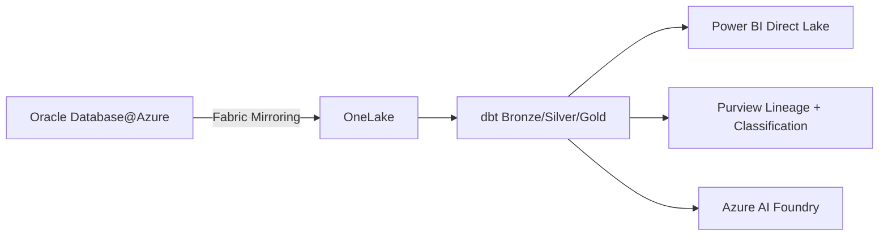

# Why Azure over Oracle Database

**An executive brief for CIOs, CDOs, and enterprise architects evaluating Oracle Database displacement or modernization on Microsoft Azure.**

---

!!! abstract "Key takeaway"
Oracle Database licensing consumes 25-40% of many enterprise IT database budgets while serving 15-20% of actual workloads. Azure-native managed databases (Azure SQL MI, Azure PostgreSQL) eliminate license cost entirely for most workloads, while Oracle Database@Azure provides a keep-Oracle path with Azure-native integration. Either approach integrates with CSA-in-a-Box for unified analytics, governance, and AI.

---

## 1. The Oracle licensing problem

Oracle's licensing model is the single largest driver of migration. Understanding why requires examining the full cost structure.

### 1.1 Processor-based licensing

Oracle Database Enterprise Edition is licensed per processor core. On Intel/AMD x86 processors, Oracle applies a **0.5 core factor**, meaning each physical core requires 0.5 processor licenses. At list price:

| Oracle product                      | List price per processor license | Annual support (22%) |
| ----------------------------------- | -------------------------------- | -------------------- |
| Database Enterprise Edition         | $47,500                          | $10,450              |
| Real Application Clusters (RAC)     | $23,000                          | $5,060               |
| Partitioning                        | $11,500                          | $2,530               |
| Active Data Guard                   | $11,500                          | $2,530               |
| Diagnostics Pack                    | $7,500                           | $1,650               |
| Tuning Pack                         | $5,000                           | $1,100               |
| Advanced Security (TDE + redaction) | $15,000                          | $3,300               |
| Label Security / VPD                | $11,500                          | $2,530               |

A typical production server with 32 cores running Enterprise Edition with RAC, Partitioning, and Diagnostics Pack costs:

- **License:** 32 x 0.5 x ($47,500 + $23,000 + $11,500 + $7,500) = **$1,432,000** (one-time)
- **Annual support:** $1,432,000 x 22% = **$315,040/year** -- forever, whether you use it or not

### 1.2 The 22% annual support trap

Oracle's annual support fee is 22% of the net license price, paid every year in perpetuity. Key pain points:

- **Non-negotiable rate.** Oracle rarely reduces the 22% rate. It compounds as you add options.
- **Reinstatement penalty.** If you let support lapse and later need it, Oracle charges back fees for the entire lapsed period plus a reinstatement penalty (typically 150% of back support).
- **Support-only revenue.** Oracle's support revenue exceeds its license revenue. The incentive structure favors keeping customers paying support, not helping them optimize.
- **Version lock-in.** Without active support, you cannot download patches, security updates, or new versions. Running unpatched Oracle in a FedRAMP environment is a finding.

### 1.3 Audit risk and exposure

Oracle's License Management Services (LMS) team conducts audits that are a material financial risk:

- **Virtualization traps.** Running Oracle on VMware or any soft-partitioned hypervisor requires licensing the _entire physical host cluster_, not just the VMs running Oracle. A 10-node VMware cluster with Oracle on 2 VMs requires licensing all 10 nodes.
- **Cloud deployment ambiguity.** Oracle's licensing policies for third-party clouds (AWS, GCP) require licensing based on vCPU counts with specific core factor calculations that frequently result in under-licensing findings.
- **Audit frequency.** Federal agencies report Oracle audit cycles of 18-36 months. Average compliance gap findings range from $500K to $5M+.
- **Java SE licensing changes.** Oracle's January 2023 Java SE licensing shift to employee-based pricing (rather than processor-based) created unexpected exposure for agencies running Java applications alongside Oracle Database.

### 1.4 The federal Oracle footprint

Oracle Database is deeply embedded in federal IT:

- **Treasury, IRS, HHS, DoD, VA, DHS** -- all operate large Oracle estates
- Many agencies run Oracle E-Business Suite, PeopleSoft, or Siebel on Oracle Database
- Federal Oracle spending is estimated at $1B-$2B annually across civilian and defense agencies
- Oracle audit activity in federal has intensified, with several agencies disclosing multi-million-dollar true-up payments

---

## 2. Azure-native alternatives have matured

The viability gap between Oracle and cloud-native managed databases has closed dramatically.

### 2.1 Azure SQL Managed Instance

Azure SQL MI delivers near-complete SQL Server engine compatibility as a fully managed PaaS:

- **99.99% SLA** with built-in high availability (no RAC equivalent needed -- it is included)
- **Automated patching, backups, and failover** -- no DBA overhead for infrastructure
- **Business Critical tier** provides local SSD storage with in-memory OLTP and read replicas
- **16 TB max database size** covers the vast majority of OLTP workloads
- **SSMA** automates 80%+ of Oracle-to-SQL Server schema conversion
- **Fabric Mirroring** replicates to OneLake for analytics without impacting OLTP

### 2.2 Azure Database for PostgreSQL Flexible Server

PostgreSQL has emerged as the dominant open-source RDBMS:

- **Zero license cost** -- the entire PostgreSQL engine is open source
- **Flexible Server** provides zone-redundant HA, point-in-time recovery, and intelligent performance
- **Citus extension** enables horizontal scale-out for multi-tenant and high-throughput workloads
- **Rich extension ecosystem** (PostGIS for spatial, pgvector for AI embeddings, TimescaleDB for time-series)
- **ora2pg** automates schema conversion from Oracle to PostgreSQL
- **PL/pgSQL** is syntactically closer to PL/SQL than T-SQL, easing conversion for some workloads

### 2.3 Oracle Database@Azure

For workloads that must remain on Oracle, Oracle Database@Azure provides Exadata infrastructure co-located in Azure datacenters:

- **Oracle-managed Exadata** infrastructure with Azure-native networking and identity
- **Low-latency interconnect** between Oracle Database and Azure services (< 2ms)
- **MACC consumption credits** -- Oracle DB@Azure spend counts toward Microsoft Azure Consumption Commitment
- **Azure Portal integration** for provisioning and monitoring
- **Fabric Mirroring for Oracle** (preview) replicates to OneLake for analytics

---

## 3. Cloud-native managed services vs. self-managed Oracle

The operational model shift from self-managed Oracle to Azure managed databases eliminates entire categories of DBA work.

| Operational task   | Oracle (self-managed)                                       | Azure SQL MI / PostgreSQL (managed)              |
| ------------------ | ----------------------------------------------------------- | ------------------------------------------------ |
| OS patching        | DBA team, scheduled downtime                                | Automated, zero downtime                         |
| Database patching  | DBA team, tested quarterly                                  | Automated, configurable window                   |
| Backup management  | RMAN configuration, tape/disk management                    | Automated, configurable retention, geo-redundant |
| High availability  | RAC setup ($23K/processor), Data Guard configuration        | Built-in, included in service price              |
| Disaster recovery  | Active Data Guard ($11.5K/processor), manual failover       | Geo-replication, automated failover groups       |
| Performance tuning | Manual AWR/ASH analysis, Diagnostics Pack ($7.5K/processor) | Intelligent Performance Insights, included       |
| Storage management | ASM configuration, tablespace management                    | Auto-grow, managed storage                       |
| Security patching  | Critical Patch Updates (quarterly), emergency patches       | Automated                                        |
| Encryption         | Advanced Security option ($15K/processor)                   | Included (TDE, TLS, Always Encrypted)            |
| Monitoring         | Enterprise Manager ($5K+/processor), custom scripts         | Azure Monitor, included                          |

**The DBA role does not disappear** -- it evolves from infrastructure management to data architecture, query optimization, and analytics integration. This is a career upgrade, not a job elimination.

---

## 4. AI and analytics integration

Oracle Database was designed for transactional workloads. Modern analytics and AI require a different architecture. Azure provides native integration between the database tier and the analytics/AI platform.

### 4.1 Fabric Mirroring

Fabric Mirroring replicates transactional data from Azure SQL MI (and Oracle DB@Azure in preview) to OneLake in near-real-time. This enables:

- **No-copy analytics** -- Power BI queries OneLake via Direct Lake, not the OLTP database
- **Medallion architecture** -- dbt transforms raw data through bronze/silver/gold layers in CSA-in-a-Box
- **Zero OLTP impact** -- analytics workloads never touch the transactional database

Oracle's equivalent (Oracle Analytics Cloud, Oracle Data Integrator) requires additional licensing and does not integrate with the broader Azure/Fabric ecosystem.

### 4.2 Azure AI integration

Azure SQL MI and PostgreSQL both integrate natively with Azure AI services:

- **Azure OpenAI** for natural language queries over structured data
- **Azure AI Search** with vector indexing for hybrid search over database content
- **Azure AI Foundry** for custom model training and deployment
- **pgvector** (PostgreSQL) stores embeddings directly in the database for RAG patterns

Oracle's AI integration (Oracle AI, Oracle Machine Learning) is locked to the Oracle ecosystem and does not participate in the broader Azure AI platform.

### 4.3 Power BI and the semantic layer

CSA-in-a-Box's semantic model layer (`csa_platform/semantic_model/`) provides:

- **Direct Lake** mode over OneLake (mirrored from the database tier)
- **Power BI Copilot** for natural language analytics
- **Analyze in Excel** for analyst self-service
- **Row-level security** enforced at the semantic model layer

Oracle's BI equivalent (Oracle Analytics Cloud / OBIEE) is a separate, costly product with limited modern AI integration.

---

## 5. Open-source maturity and talent availability

### 5.1 PostgreSQL momentum

PostgreSQL has been the #1 rising RDBMS on DB-Engines ranking for years:

- **Stack Overflow Developer Survey** consistently ranks PostgreSQL as the most-wanted and most-admired database
- **GitHub ecosystem** shows 10x more PostgreSQL-related projects than Oracle
- **Cloud adoption** -- every major cloud provider offers managed PostgreSQL
- **Extension ecosystem** -- 1,000+ extensions covering spatial, time-series, AI/ML, graph, and more

### 5.2 Talent availability

Oracle DBA skills are declining in availability:

- Universities no longer teach Oracle as a primary database
- New graduates learn PostgreSQL, MySQL, or cloud-native databases
- Oracle DBA salaries have flattened while cloud database engineer salaries have grown 30%+ over five years
- Federal contractors report difficulty staffing Oracle DBA positions, particularly at clearance levels

### 5.3 Community and innovation velocity

- **PostgreSQL** releases a major version annually with community-driven features
- **SQL Server** releases updates continuously through Azure SQL MI with rapid feature delivery
- **Oracle Database** releases annually but major features are locked behind additional paid options
- **CSA-in-a-Box** integrates with the Azure innovation cycle (Fabric, AI Foundry, Copilot) -- features that ship on Azure are immediately available to CSA-in-a-Box deployments

---

## 6. Fabric Mirroring for Oracle -- the bridge pattern

For organizations running Oracle Database@Azure or migrating incrementally, Fabric Mirroring for Oracle provides a non-disruptive analytics path:

This pattern allows organizations to:

1. Keep Oracle for OLTP (no application changes)
2. Mirror data to OneLake for analytics (near-real-time, no ETL to build)
3. Build the CSA-in-a-Box analytics platform on mirrored data
4. Migrate individual databases off Oracle over time as economics dictate
5. Maintain a single governance layer (Purview) across Oracle and Azure-native databases

---

## 7. Federal-specific advantages

### 7.1 FedRAMP inheritance

Azure SQL MI and Azure Database for PostgreSQL inherit FedRAMP High authorization through Azure Government. CSA-in-a-Box maps controls in machine-readable YAML (`csa_platform/csa_platform/governance/compliance/nist-800-53-rev5.yaml`) that 3PAOs can directly consume for agency SSPs. Oracle Database (self-managed) requires the agency to document all database-level controls independently.

### 7.2 IL compliance

Azure SQL MI and PostgreSQL Flexible Server are IL5-authorized on Azure Government. Oracle Database@Azure IL5 availability is on the Microsoft/Oracle roadmap. For DoD workloads, Azure-native databases provide a clearer compliance path than self-managed Oracle on-premises or in non-authorized environments.

### 7.3 MACC and procurement simplification

Azure services (including Oracle DB@Azure) consume against Microsoft Azure Consumption Commitment (MACC). This means:

- Single procurement vehicle for all database services
- No separate Oracle contract management (for displacement targets)
- Oracle DB@Azure spend applies to existing MACC commitments
- Simplified vendor management and audit exposure

### 7.4 Oracle audit elimination

Migrating off Oracle Database eliminates:

- Oracle LMS audit exposure
- Virtualization licensing disputes
- Java SE licensing complexity
- Annual true-up risk
- Procurement team overhead managing Oracle contracts

---

## 8. When Oracle is the right choice

This brief is honest. Oracle Database remains the right choice when:

- **Complex RAC deployments** with active-active multi-node that cannot be refactored to active-passive HA
- **Deep PL/SQL codebases** (100K+ lines) where conversion cost exceeds licensing savings over 5 years
- **Oracle-specific features** (Advanced Queuing with complex routing, Spatial with SDO_GEOMETRY at scale, Label Security with compartmentalized access) that have no direct Azure equivalent
- **EBS / PeopleSoft / Siebel** dependencies where the application is certified only on Oracle Database
- **Regulatory requirements** that mandate Oracle (rare but exists in some international contexts)

For these workloads, **Oracle Database@Azure** provides the Azure-native integration (networking, identity, analytics via Fabric Mirroring) without requiring application refactoring.

---

## 9. Decision framework

### Displace Oracle when

- Oracle licensing cost exceeds $500K/year and workloads are standard OLTP
- PL/SQL complexity is moderate (< 500 stored procedures, no packages over 5,000 lines)
- No hard dependency on RAC active-active or Oracle-specific features
- Open-source mandate or policy preference for PostgreSQL
- DBA team is willing to reskill (or is already short-staffed on Oracle expertise)
- Application is being modernized anyway (connection string change is part of the work)

### Embrace Oracle Database@Azure when

- Deep PL/SQL codebase (100K+ lines) makes conversion cost-prohibitive
- Application is certified only on Oracle (EBS, PeopleSoft, Siebel)
- RAC or Exadata performance characteristics are required
- Incremental migration planned (keep Oracle now, migrate databases individually over 2-3 years)
- Azure integration (Fabric, AI, Purview) is the primary driver, not Oracle elimination

### Hybrid approach (most common in large enterprises)

- **Tier 1:** Displace standard OLTP databases to Azure SQL MI or PostgreSQL (70-80% of databases)
- **Tier 2:** Move complex Oracle workloads to Oracle DB@Azure (15-25% of databases)
- **Tier 3:** Retire or consolidate legacy databases (5-10%)
- **All tiers:** Integrate with CSA-in-a-Box via Fabric Mirroring or ADF for unified analytics

---

## 10. Next steps

| Action                                             | Resource                                                |
| -------------------------------------------------- | ------------------------------------------------------- |
| Run an SSMA assessment on your Oracle estate       | [Tutorial: SSMA Migration](tutorial-ssma-migration.md)  |
| Build a TCO comparison for your specific workloads | [TCO Analysis](tco-analysis.md)                         |
| Understand feature parity for your Oracle features | [Complete Feature Mapping](feature-mapping-complete.md) |
| Evaluate federal compliance requirements           | [Federal Migration Guide](federal-migration-guide.md)   |
| Start the full migration                           | [Migration Playbook](../oracle-to-azure.md)             |

---

**Maintainers:** csa-inabox core team
**Last updated:** 2026-04-30
