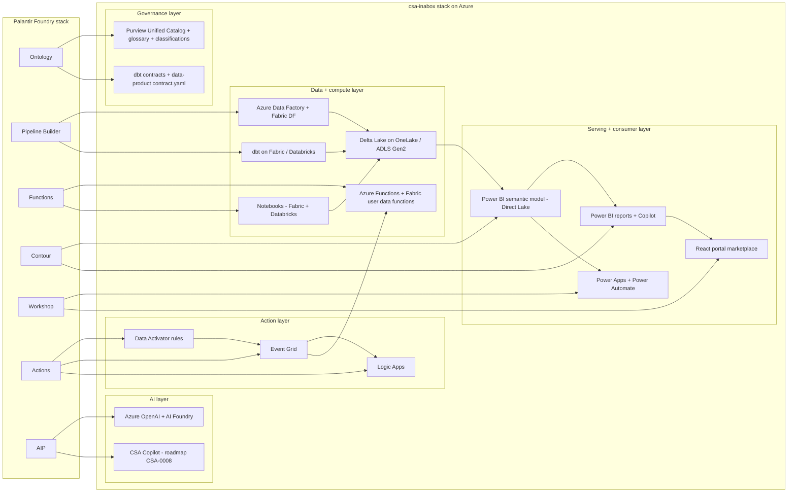

# Migrating from Palantir Foundry to csa-inabox

**Status:** Authored 2026-04-19
**Audience:** Federal CIO / CDO / Chief Data Architect and their implementation teams
**Scope:** Full capability-by-capability migration from Palantir Foundry to the csa-inabox reference platform on Microsoft Azure.

---

## 1. Executive summary

csa-inabox plus Azure PaaS is a fit-for-purpose Foundry alternative for federal customers. FedRAMP High inheritance is documented today (see `docs/compliance/nist-800-53-rev5.md` and the machine-readable matrix in `governance/compliance/nist-800-53-rev5.yaml`). CMMC 2.0 Level 2 (`governance/compliance/cmmc-2.0-l2.yaml`) and HIPAA Security Rule (`governance/compliance/hipaa-security-rule.yaml`) are likewise mapped to repo artifacts. This playbook maps every significant Foundry capability to a concrete Azure service surfaced inside csa-inabox and walks through a worked federal-case-management ontology migration end-to-end.

Foundry's appeal in federal is real: a single vendor, a cohesive ontology-driven UX, deep human-in-the-loop analyst workflows, and a decade of tribal knowledge deployed across DoD components, the Intelligence Community, Treasury, State, and HHS. csa-inabox does not attempt to replicate Foundry's single-vendor UX cohesion. Instead it offers **a composable, Azure-native, open-standards stack** (Delta Lake, Parquet, Purview, dbt, Power BI) with per-consumption pricing, commercial-to-Gov parity, and control-level ATO evidence. For agencies with a forcing function — expiring Foundry license, budget compression, mandate to move to Azure commercial or Azure Government, or an open-standards policy — csa-inabox is the default destination.

This playbook is honest where the gap is real. IL6 (classified SCI) is out of scope today. Foundry Object Explorer's pixel-perfect UX is not replicated by Purview Unified Catalog yet. CSA Copilot (the Quiver/AIP-Agents analogue) is on the roadmap (CSA-0008) and not shipped. Every gap below has a tracked finding ID so the customer can see exactly how it is being worked.

### Federal considerations — Foundry vs csa-inabox

| Consideration | Foundry (today) | csa-inabox (today) | Notes |
|---|---|---|---|
| FedRAMP High | Authorized | Inherited through Azure Government + Azure Commercial authorized services; controls mapped in `governance/compliance/nist-800-53-rev5.yaml` | csa-inabox does not hold its own FedRAMP ATO; it inherits from the Azure platform ATOs and documents control coverage for agency-specific SSPs |
| DoD IL4 | Covered | Covered in Azure Gov | Full parity on Azure Government for IL4 workloads |
| DoD IL5 | Covered | Covered in Azure Gov with most services; Fabric IL5 parity forecast per Microsoft roadmap | Near-term parity; see `docs/GOV_SERVICE_MATRIX.md` for service-level status |
| DoD IL6 | Covered | **Gap** — classified SCI workloads out of scope | Recommend Foundry, Databricks-on-IL6, or bespoke tenant for IL6 |
| ITAR | Covered | Covered by Azure Government tenant defaults inherited by csa-inabox | Data-residency controls assured by Azure Gov tenant-binding |
| CMMC 2.0 Level 2 | Covered | Controls mapped in `governance/compliance/cmmc-2.0-l2.yaml` + `docs/compliance/cmmc-2.0-l2.md` | DIB primes can inherit |
| HIPAA Security Rule | Covered | Mapped in `governance/compliance/hipaa-security-rule.yaml`; see `examples/tribal-health/` | HHS / tribal-health / CMS programs |
| Tribal data sovereignty | Partial | Documented reference implementations in `examples/tribal-health/` and `examples/casino-analytics/` | Explicit tribal-sovereignty patterns |
| Per-seat licensing | Yes (Foundry named-user seats) | No | csa-inabox is consumption-priced Azure; Fabric capacity is workspace-level, not per-seat |
| Vendor lock-in | High (Ontology is proprietary) | Low (Delta, Parquet, dbt, Purview REST APIs all open) | Exit path from csa-inabox is well-understood |

---

## 2. Capability mapping — Foundry → csa-inabox

This is the load-bearing table. Every row cites a real file path in the repo where the equivalent pattern lives today, or flags an honest gap with the tracked finding ID.

| Foundry capability | csa-inabox equivalent | Mapping notes | Effort | Evidence (repo path) |
|---|---|---|---|---|
| **Ontology** (object types, link types, properties) | Purview Unified Catalog business glossary + classifications + dbt semantic layer | Foundry's object types become Purview glossary terms; link types become foreign keys in dbt + relationships in the Power BI semantic model | L | `csa_platform/purview_governance/purview_automation.py`, `csa_platform/purview_governance/classifications/`, `domains/shared/dbt/models/`, `csa_platform/semantic_model/semantic_model_template.yaml` |
| **Pipeline Builder** (visual ETL) | Azure Data Factory + Fabric Data Factory + dbt | ADF replaces visual pipeline builder; dbt replaces transform expressions; Fabric Data Factory brings the visual-pipeline UX to Fabric | L | `domains/shared/pipelines/adf/`, `domains/shared/dbt/dbt_project.yml`, `domains/shared/dbt/models/` |
| **Code Repositories** (Python / PySpark transforms) | Fabric notebooks + Databricks notebooks + Git-integrated Azure DevOps / GitHub | Transforms move to PySpark notebooks with Git backing; CI/CD via existing workflows | M | `domains/shared/notebooks/`, `.github/workflows/deploy.yml`, `.github/workflows/deploy-dbt.yml`, `csa_platform/unity_catalog_pattern/` |
| **Contour** (point-and-click analysis) | Power BI + Power BI Copilot + Fabric Data Agent + Direct Lake on OneLake | Contour board → Power BI report with Direct Lake semantic model; no-copy analytics pattern preserved | M | `csa_platform/semantic_model/`, `csa_platform/semantic_model/semantic_model_template.yaml`, `csa_platform/semantic_model/scripts/` |
| **Workshop** (operational analyst apps) | Power Apps + Power BI Embedded + Fabric Real-Time dashboards + custom React portal | Workshop modules map to Power Apps screens for form-driven workflows, Power BI for analytics, React portal for marketplace/discovery | L | `portal/powerapps/`, `portal/powerapps/flows/`, `portal/powerapps/logic-apps/`, `portal/react-webapp/src/` |
| **Object Explorer** (ontology-aware search + drill) | Purview Unified Catalog + `portal/` marketplace data-product experience | Purview Data Catalog provides the search+lineage surface; the portal adds a data-product browse experience | M | `csa_platform/data_marketplace/`, `portal/react-webapp/src/pages/`, `csa_platform/purview_governance/` |
| **Functions** (user-defined TypeScript/Python functions) | Azure Functions + Fabric user data functions + shared-services functions library | Foundry Functions move to Azure Functions (general purpose) or Fabric user data functions (analytic compute) | M | `domains/sharedServices/aiEnrichment/functions/`, `domains/sharedServices/eventProcessing/`, `csa_platform/shared_services/functions/` |
| **AIP (AI Platform) — LLM chat + workflows** | Azure AI Foundry + Azure OpenAI + agentic enrichment patterns | AIP's agent-workflow + grounded-chat surface maps to Azure OpenAI models + AI Foundry orchestration; gap: no first-party chat UX yet (see CSA-0008) | L | `csa_platform/ai_integration/`, `csa_platform/ai_integration/enrichment/`, `csa_platform/ai_integration/rag/`, `csa_platform/ai_integration/model_serving/` |
| **AIP Agents** (auto-executing agents) | **Gap** — CSA Copilot not shipped | Roadmap via CSA-0008. Primitives exist in `csa_platform/ai_integration/` but no agent loop, chat UX, skill catalog, or eval harness yet | XL | Gap — see CSA-0008. Target location: `apps/copilot/` or `csa_copilot/` |
| **Actions** (code-extensible state-change rules) | Data Activator + Event Grid + Logic Apps + Azure Functions for extensibility | Rules-first logic lives in Data Activator; code-extensible actions escalate through Event Grid → Logic App or Azure Function | M | `csa_platform/data_activator/rules/`, `csa_platform/data_activator/actions/`, `csa_platform/data_activator/functions/` |
| **Quiver** (natural-language analysis) | Power BI Copilot + Fabric Copilot + (future) CSA Copilot | Power BI Copilot ships NL-over-semantic-model today; deeper cross-ontology NL analysis lands with CSA Copilot | M | `csa_platform/semantic_model/` (semantic layer Copilot grounds on); Gap — see CSA-0008 |
| **Fusion** (Excel live connection) | Excel live-connection to Power BI semantic model via Analyze in Excel | Native Microsoft capability, zero new work | XS | `csa_platform/semantic_model/semantic_model_template.yaml` (semantic model is the join point) |
| **Slate** (custom HTML forms) | Power Apps custom canvas apps + (low-code) Logic Apps | Slate's form-builder UX maps to Power Apps; more complex flows move to Logic Apps | S | `portal/powerapps/`, `portal/powerapps/logic-apps/` |
| **Magritte** (connectors / agents for source systems) | Azure Data Factory integration runtime + self-hosted IR + Linked Services | ADF has 100+ connectors today; self-hosted IR handles on-prem / gov-edge scenarios | S | `domains/shared/pipelines/adf/`, `docs/SELF_HOSTED_IR.md`, `docs/ADF_SETUP.md` |
| **Foundry Lineage** | Purview lineage + dbt DAG + ADF pipeline lineage | Purview auto-captures ADF + Fabric lineage; dbt emits lineage through `dbt docs` | M | `csa_platform/purview_governance/purview_automation.py`, `domains/shared/dbt/dbt_project.yml` |
| **Foundry security (Markings / Classifications)** | Purview classifications + Azure RBAC + column-level security + Unity Catalog (where Databricks is used) | Foundry markings map to Purview classifications + ABAC; see the four classification taxonomies shipped today | M | `csa_platform/purview_governance/classifications/pii_classifications.yaml`, `phi_classifications.yaml`, `government_classifications.yaml`, `financial_classifications.yaml` |
| **Foundry Audit** | Azure Monitor diagnostic settings + tamper-evident audit logger + Purview audit | csa-inabox adds a tamper-evident hash-chained audit path (CSA-0016) on top of Azure Monitor | M | Audit logger module (CSA-0016 implementation), Azure Monitor diagnostic settings in Bicep modules |
| **Foundry on-prem / AirGap** | Azure Stack Hub + Azure Government (classified cloud for IL5) + on-prem Databricks (where required) | True air-gap is Azure Stack Hub territory; IL5 covered by Azure Gov | L | `docs/GOV_SERVICE_MATRIX.md` |
| **Foundry data contracts** | dbt contracts + JSON Schema contracts per data product | Every data product in csa-inabox ships a `contract.yaml`; dbt enforces column-level contracts at build time | S | `domains/finance/data-products/invoices/contract.yaml`, `domains/inventory/data-products/inventory/contract.yaml`, `domains/sales/contracts/sales_orders.json`, `.github/workflows/validate-contracts.yml` |

### Gaps called out above (cross-referenced to tracked findings)

- **AIP Agents / Quiver deeper NL** — CSA-0008 (Copilot MVP, 6-phase build, XL)
- **Object Explorer pixel-equivalent UX** — will be partially closed by Fabric data-product experience (CSA-0129 Fabric module depth) and the React portal marketplace
- **IL6** — out of scope for csa-inabox; recommend out-of-band
- **Decision trees for service choice** — CSA-0010 (not a Foundry gap per se, but referenced by migrators picking Fabric vs Databricks vs Synapse)

---

## 3. Reference architecture — Foundry stack mapped to csa-inabox stack



Key architectural simplifications versus Foundry:

- **Storage is a single open format**: Delta Lake on OneLake (Fabric) or ADLS Gen2 (Databricks). No proprietary dataset format.
- **Governance is federated**: Purview catalogs across lakes/workspaces; dbt enforces contracts at build time.
- **Serving is semantic-model-first**: a single Power BI semantic model (Direct Lake) serves Power BI, Power Apps, Excel live-connection, and Copilot NL.
- **Action is event-driven**: Data Activator emits to Event Grid; Event Grid fans out to any Azure compute.

---

## 4. Worked migration example — federal case management ontology, end to end

This section walks through one realistic federal domain (case management — applicable to DoJ, State, HHS-OIG, agency IG offices, and grants-adjudication workflows). The machine-readable form is in `docs/migrations/palantir-foundry/sample-ontology.yaml`.

### 4.1 Original Foundry ontology

Four object types with classic Foundry link-type semantics:

- **Case** — parent object; one-to-many to Evidence and Action; many-to-many to Party.
- **Party** — person or organization involved (complainant, subject, witness, counsel). PII-bearing.
- **Evidence** — one document / digital artifact / physical item per row, belongs to one Case, chain-of-custody tracked.
- **Action** — one state-changing event per row (assign, escalate, status_change, disposition). The Foundry Action `EscalateOverdueCase` writes to this object.

In Foundry, all four types live in a shared ontology namespace with link-type objects binding them. Contour boards pivot across any axis; Workshop apps surface case-officer workflows; one Foundry Action enforces the 30-day escalation SLA.

### 4.2 Target Purview business glossary

Each Foundry object type becomes a Purview glossary term with a classification and steward. The workflow is automated in `csa_platform/purview_governance/purview_automation.py`:

| Glossary term | Classification | Steward | Definition |
|---|---|---|---|
| Case | CUI-Specified | Case Management Domain Team | A legal, investigative, or adjudicative matter tracked from intake through disposition. |
| Party (Case Participant) | PII | Case Management Domain Team | Any person or organization involved in a case (complainant, subject, witness, counsel). |
| Evidence Item | CUI-Specified | Chain-of-Custody Officer | A document, digital artifact, or physical item preserved under chain-of-custody for a case. |
| Case Action | Internal | Case Management Domain Team | A state-changing event on a case (assignment, status change, disposition). |

Classifications resolve to the existing taxonomy files:
- PII → `csa_platform/purview_governance/classifications/pii_classifications.yaml`
- CUI-Specified → `csa_platform/purview_governance/classifications/government_classifications.yaml`

### 4.3 Target dbt model + contract

The four object types become dimension and fact tables in the case-management gold layer:

```
domains/case_management/dbt/models/
  bronze/
    raw_cases.sql
    raw_parties.sql
    raw_evidence.sql
    raw_actions.sql
  silver/
    stg_cases.sql
    stg_parties.sql
    stg_evidence.sql
    stg_actions.sql
  gold/
    dim_case.sql          <- was Case object
    dim_party.sql         <- was Party object
    fact_evidence.sql     <- was Evidence object
    fact_action.sql       <- was Action object
```

Example: `domains/case_management/data-products/case/contract.yaml` follows the pattern already shipped in `domains/finance/data-products/invoices/contract.yaml`:

```yaml
data_product: case
domain: case_management
owner: case_management_domain_team
model: gold.dim_case
classification: cui_specified
columns:
  - name: case_id
    data_type: string
    tests: [not_null, unique]
  - name: case_number
    data_type: string
    tests: [not_null]
  - name: status
    data_type: string
    tests: [accepted_values: [open, under_review, closed, appealed]]
  - name: priority
    data_type: string
  - name: opened_at
    data_type: timestamp
sla:
  freshness: P1D
  availability: 99.5
compliance:
  frameworks: [fedramp_high, cmmc_2_l2]
```

Contract validation runs via `.github/workflows/validate-contracts.yml`.

### 4.4 Target Power BI semantic model (dimensional)

```
fact_evidence ─────> dim_case <───── fact_action
                      ▲
                      │
                    dim_party (bridge: party_case_bridge)
                      ▲
                    dim_date
```

Measures:

- `Open Cases = CALCULATE(DISTINCTCOUNT(dim_case[case_id]), dim_case[status] = "open")`
- `Avg Time to Close (Days) = AVERAGEX(...)`
- `Overdue High-Priority Cases = CALCULATE(..., DATEDIFF(dim_case[opened_at], TODAY(), DAY) > 30, dim_case[priority] IN {"high", "urgent"})`

The semantic model is authored via `csa_platform/semantic_model/semantic_model_template.yaml` and deployed by `csa_platform/semantic_model/scripts/`.

### 4.5 Action migration — Foundry Action → Data Activator rule

The Foundry `EscalateOverdueCase` Action becomes a Data Activator rule:

File: `csa_platform/data_activator/rules/case-escalation.yaml`

```yaml
rule_id: case-escalation-overdue-high-priority
source:
  type: powerbi_semantic_model
  model: case_management_gold
  measure: Overdue High-Priority Cases
condition:
  when: measure > 0
action:
  type: event_grid_publish
  topic: case-escalation-events
  payload_from_measure: true
downstream:
  logic_app: notify-supervisor-flow
  power_automate_flow: update-case-priority-flow
```

Data Activator monitors the Direct Lake semantic model, publishes to Event Grid, and fans out to Logic Apps and Power Automate. For more code-extensible logic (the Foundry Function case), the Event Grid event can fan out to an Azure Function in `csa_platform/data_activator/functions/`.

---

## 5. Migration sequence (phased project plan)

A realistic mid-to-large federal engagement runs 36 weeks end-to-end. Phases overlap by design — landing zones in Phase 1 do not need to complete before Phase 2 ontology discovery begins.

### Phase 0 — Discovery (Weeks 1–2)

Inventory every Foundry artifact:

- Ontologies: object types, link types, property classifications, markings
- Pipelines: data sources, transforms, outputs, schedules
- Workshops: modules, intended users, top-5 workflows
- AIP / Quiver usage: agent templates, chat surfaces, grounding sources
- Actions: rule logic, trigger conditions, downstream systems
- Functions: code inventory, language, external dependencies
- Users and groups: role mapping to Entra ID groups

**Artifacts produced:** Foundry inventory spreadsheet, target-mapping draft, migration risk register, Entra ID group design.
**Risks:** under-documented Foundry tribal knowledge; shadow consumers outside known Workshop usage.
**Success criteria:** 90% of Foundry objects/pipelines mapped to a csa-inabox target; stakeholders identified for each.

### Phase 1 — Landing zones (Weeks 3–6)

Deploy the csa-inabox Data Management Landing Zone (DMLZ) and first Data Landing Zone (DLZ):

- Bicep-based deployment (see ADR-0004 on Bicep over Terraform, prospective)
- Purview provisioned and automated via `csa_platform/purview_governance/purview_automation.py`
- Entra ID groups for domain-steward / data-consumer / data-engineer roles
- Networking, Private Endpoints, Key Vault, Log Analytics workspace
- Diagnostic settings on every resource feeding Azure Monitor + the tamper-evident audit path (CSA-0016)

**Artifacts produced:** running DMLZ + DLZ in Azure Gov (or Commercial for non-classified), Purview catalog bootstrapped, CI/CD wired (`.github/workflows/deploy.yml`, `deploy-gov.yml`, `deploy-portal.yml`).
**Risks:** Azure policy conflicts with organizational policy; private DNS zone collisions.
**Success criteria:** `make deploy-dev` succeeds; Purview shows automated scan of initial storage accounts; portal reachable at a tenant domain.

### Phase 2 — Ontology migration (Weeks 7–12)

Move the **top 20% of Foundry object types** that drive 80% of consumer value:

1. Create Purview glossary terms + classifications per object type
2. Stand up dbt projects per domain under `domains/<domain>/dbt/`
3. Build bronze → silver → gold models for each ontology object
4. Ship `contract.yaml` per data product, wired to `.github/workflows/validate-contracts.yml`
5. Register data products in the portal marketplace (`csa_platform/data_marketplace/`)

**Artifacts produced:** Purview-registered glossary; dbt models merged to main; data-product contracts validated; portal marketplace entries published.
**Risks:** schema drift between Foundry ontology and dbt target; classification mis-assignment.
**Success criteria:** top-20% data products queryable via Power BI; lineage visible in Purview end-to-end.

### Phase 3 — Pipeline migration (Weeks 13–20)

Port the **top 20% of Foundry Pipeline Builder pipelines** that feed the Phase 2 data products:

- ADF pipelines in `domains/<domain>/pipelines/adf/` for orchestration
- dbt models for transformation
- Notebooks in `domains/<domain>/notebooks/` for PySpark-heavy ML / feature engineering
- Self-hosted integration runtime for any on-prem / gov-edge sources (see `docs/SELF_HOSTED_IR.md`)

**Artifacts produced:** ADF pipelines deployed; dbt run successful; notebook-based ML features replacing Foundry Functions.
**Risks:** on-prem source-system access; data-volume delta between Foundry datasets and Azure ingestion rates.
**Success criteria:** parity-run data reconciliation ≤0.5% variance vs Foundry for the in-scope objects.

### Phase 4 — Consumer migration (Weeks 21–28)

Rebuild consumer surfaces:

- **Contour boards → Power BI reports** with Direct Lake semantic models
- **Workshop apps → Power Apps canvas apps + Power BI Embedded + React portal pages**
- **Quiver NL queries → Power BI Copilot** (deeper AIP-style flows land with CSA Copilot — see CSA-0008)
- **Actions → Data Activator rules + Event Grid + Logic Apps**
- **Fusion → Analyze in Excel** (native on the Power BI semantic model)

**Artifacts produced:** Power BI workspace with deployed reports; Power Apps published to the app catalog; Data Activator rules active; portal surfaces live.
**Risks:** UX regression vs Foundry Workshop polish; analyst resistance.
**Success criteria:** pilot users productive on Power BI/Power Apps; Data Activator rules firing at parity with Foundry Actions.

### Phase 5 — Cutover and decommission (Weeks 29–36)

Parallel-run period, user training, Foundry license end-date:

- Weeks 29–32: dual-run with Foundry as read-only reference
- Weeks 33–34: user acceptance testing; residual defect burndown
- Week 35: cutover; Foundry reads disabled
- Week 36: Foundry license end-date; archive export to Azure Blob

**Artifacts produced:** cutover runbook, training curriculum, archive bundle, final Foundry inventory delta report.
**Risks:** last-minute shadow consumers; archive gaps for long-tail objects.
**Success criteria:** zero priority-1 defects for 10 consecutive business days; Foundry decommissioned; cost-avoidance baseline published.

---

## 6. Federal compliance considerations

- **FedRAMP High:** control mappings live in `governance/compliance/nist-800-53-rev5.yaml` with the companion narrative in `docs/compliance/nist-800-53-rev5.md`. Every Bicep module, policy assignment, and diagnostic source is mapped to its control IDs.
- **CMMC 2.0 Level 2:** covered in `governance/compliance/cmmc-2.0-l2.yaml` with narrative `docs/compliance/cmmc-2.0-l2.md`. DIB primes can inherit the practice-level mappings.
- **HIPAA Security Rule:** `governance/compliance/hipaa-security-rule.yaml` + `docs/compliance/hipaa-security-rule.md`. See `examples/tribal-health/` for a worked IHS / tribal-health HIPAA-scoped implementation.
- **IL4:** full parity on Azure Government today; csa-inabox patterns apply 1:1.
- **IL5:** near-parity on Azure Government. Fabric IL5 parity is forecast per the Microsoft roadmap; see `docs/GOV_SERVICE_MATRIX.md`.
- **IL6 (classified SCI):** csa-inabox is **out of scope**. Foundry covers IL6 today. Recommend keeping IL6 workloads on Foundry or on a bespoke Azure Top-Secret tenant.
- **ITAR:** data-residency and access controls inherited through Azure Government tenant-binding.
- **Tribal Data Sovereignty:** csa-inabox ships two federal-tribal reference implementations: `examples/tribal-health/` (IHS data pattern) and `examples/casino-analytics/` (tribal gaming). The sovereignty patterns around jurisdictional data boundaries and tribal-owned consent models are documented in each example's `ARCHITECTURE.md`.

---

## 7. Cost comparison

This section is illustrative, not a bid. Every federal engagement has its own data volumes, concurrency, and capacity commitments. Foundry pricing is per-seat plus compute commitments; csa-inabox is consumption-based on Azure with an optional Fabric capacity reservation.

For a **typical mid-sized federal tenant** (say, 500 analytic users, 20 TB hot data, 100 TB warm data, moderate AIP usage):

- **Foundry:** typically **$4M–$7M/year** depending on named-user seats and compute commitments. Predominantly fixed.
- **csa-inabox on Azure Government:** typically **$2M–$4M/year** at similar scale. Predominantly variable. Breakdown:
  - Azure Government compute (ADF + Databricks + Fabric capacity F64/F128): **~$1.2M–$2.0M**
  - Storage (OneLake + ADLS Gen2 + backups): **~$200K–$400K**
  - Power BI Premium per-user where Fabric capacity doesn't cover embed scenarios: **~$200K–$400K**
  - Azure OpenAI / AI Foundry consumption: **~$200K–$600K**
  - Purview + Monitor + Key Vault + Private Endpoints + network: **~$200K–$400K**
  - Professional services (in-house or partner) — not included

Cost drivers to plan for:

- **Fabric capacity sizing** (F-SKU selection) is the largest knob; see `docs/COST_MANAGEMENT.md` for the cost model and `scripts/deploy/teardown-platform.sh` to kill workshop/dev spend overnight (CSA-0011).
- **OneLake egress** — Direct Lake keeps queries local; avoid copy-to-import semantic models.
- **Log Analytics retention** — tune diagnostic-settings retention per control requirement, not the default.

The consumption model means costs scale with workload, not seats. For agencies with spiky usage (IG investigations, grants cycles, reporting quarters), this is a structural win over per-seat pricing.

---

## 8. Gaps and roadmap

csa-inabox is honest where Foundry is stronger today:

| Gap | Description | Tracked finding | Planned remediation |
|---|---|---|---|
| **CSA Copilot** (equivalent of Quiver / AIP Agents) | No agent loop, chat UX, skill catalog, grounding gate, or eval harness shipped today. Primitives exist in `csa_platform/ai_integration/`. | CSA-0008 (XL) | 6-phase MVP: corpus indexer → grounding + citations → decision-tree walker → skill catalog + tools → gated execute → 4 surfaces (Web/CLI/MCP/API) → LLMOps |
| **Object Explorer UX fidelity** | Purview Data Catalog and the React portal together provide the search + lineage + data-product surface, but not Foundry Object Explorer's pixel-perfect ontology-drill UX. | CSA-0129 (Fabric module depth) | Fabric data-product experience will close most of the gap; residual is product UX polish |
| **IL6 coverage** | No IL6 support in csa-inabox. | N/A (out of scope) | Recommend Foundry or bespoke Top-Secret tenant for IL6 |
| **Action Engine extensibility** | Data Activator is rules-first; Foundry Actions are code-extensible via Functions. | N/A (pattern documented) | Pattern: Event Grid → Azure Function / Logic App provides code-extensibility; documented in Section 4.5 |
| **Decision-tree guidance** | No service-choice decision trees for Fabric vs Databricks vs Synapse etc. | CSA-0010 (L) | 8 decision trees as mermaid + YAML with branching questions and linked examples |
| **Teardown scripts / FinOps safety** | Missing `scripts/deploy/teardown-platform.sh` at time of audit; workshop deployments could leak cost. | CSA-0011 (M) — addressed in recent commit (3f96975) | Delivered |
| **Framework control matrices** | NIST, CMMC, HIPAA matrices delivered; PCI-DSS, SOC 2, GDPR/CCPA still pending. | CSA-0012 (XL) — in progress | Six additional YAMLs + narrative pages |

Every gap has a tracked ID the customer can reference in their own migration risk register.

---

## 9. Competitive framing

Kept professional, not marketing — federal CIOs want a fit assessment, not puffery.

### Where Foundry wins today

- **Ontology-driven UX cohesion.** One navigation surface across data, pipelines, analyses, and operational apps. csa-inabox requires navigating Purview + dbt docs + Power BI + Power Apps + the portal separately.
- **Single-vendor simplicity.** One PO, one vendor, one SLA, one auditor engagement. csa-inabox is multi-service Azure (still one cloud vendor, but many service SLAs).
- **Deployed tribal knowledge.** Customers with 3+ years on Foundry have institutional muscle memory that represents real value. Migration cost is non-trivial to capture that.
- **IL6.** Mentioned above — no csa-inabox equivalent.
- **First-party analyst apps.** Workshop + Contour + Quiver are tightly integrated. Power BI + Power Apps + Copilot are lower-friction at the foundation but require more stitching.

### Where csa-inabox wins today

- **Azure-native FedRAMP inheritance.** No separate vendor ATO to keep current. Control mappings live in machine-readable YAMLs with a 3PAO-friendly narrative.
- **Commercial → Gov parity path.** One codebase deploys to Azure Commercial, Azure Government, and the classified clouds (where services exist). Foundry requires separate environment instances.
- **Open standards.** Delta Lake, Parquet, dbt, Purview REST API, Power BI XMLA endpoint. Exit cost from csa-inabox is measured in weeks; exit cost from Foundry is measured in years.
- **No per-seat licensing.** Consumption-based costs flex with workload. Workshop seats are often the single biggest line item in a Foundry renewal.
- **Composable.** Swap dbt for Fabric notebooks, Power BI for Tableau, ADF for Fivetran. csa-inabox is a reference pattern, not a monolith.
- **Federal-tribal reference implementations.** `examples/tribal-health/` and `examples/casino-analytics/` are distinct value in the tribal sovereignty space.

### Decision framework

- **Start here for csa-inabox:** net-new program; Azure-native mandate; open-standards policy; consumption-pricing preference; budget under compression; IL4 or IL5 (not IL6); strong in-house or partner Azure talent.
- **Stay on Foundry:** mature Foundry deployment with deep Workshop customization; no forcing function to move; IL6 workloads; single-vendor procurement preference; Workshop-centric analyst population that would not tolerate a Power BI + Power Apps split.

There is no universal right answer. This playbook exists so the CIO can have the conversation grounded in evidence instead of vendor slide decks.

---

## 10. Related resources

- **Migration index:** [docs/migrations/README.md](README.md)
- **Sample ontology (YAML):** [palantir-foundry/sample-ontology.yaml](palantir-foundry/sample-ontology.yaml)
- **Decision trees (prospective, CSA-0010):** `docs/decisions/fabric-vs-databricks-vs-synapse.md`
- **ADRs (prospective):** ADR-0004 Bicep over Terraform, ADR-0010 Fabric as strategic target
- **Compliance matrices:**
  - `docs/compliance/nist-800-53-rev5.md` / `governance/compliance/nist-800-53-rev5.yaml`
  - `docs/compliance/cmmc-2.0-l2.md` / `governance/compliance/cmmc-2.0-l2.yaml`
  - `docs/compliance/hipaa-security-rule.md` / `governance/compliance/hipaa-security-rule.yaml`
- **Example verticals worth touring before/during migration:**
  - `examples/commerce/` — e-commerce reference, closest analog to transaction-heavy Foundry ontologies
  - `examples/tribal-health/` — HIPAA + tribal sovereignty reference
  - `examples/epa/` — regulatory / reporting reference
  - `examples/interior/` — federal land-management reference
  - `examples/casino-analytics/` — tribal gaming, streaming + video analytics
- **Operational guides:**
  - `docs/QUICKSTART.md`
  - `docs/ARCHITECTURE.md`
  - `docs/GOV_SERVICE_MATRIX.md`
  - `docs/COST_MANAGEMENT.md`
  - `docs/SELF_HOSTED_IR.md`
- **Platform modules most relevant to a Foundry migration:**
  - `csa_platform/purview_governance/` — ontology / catalog / classifications
  - `csa_platform/semantic_model/` — Direct Lake semantic model for Power BI over OneLake
  - `csa_platform/data_activator/` — Actions analogue
  - `csa_platform/data_marketplace/` — data-product registry for portal discovery
  - `csa_platform/ai_integration/` — AIP-style primitives today; CSA Copilot tomorrow
  - `csa_platform/unity_catalog_pattern/` — OneLake foundational pattern
  - `csa_platform/multi_synapse/` — multi-workspace Synapse pattern for large tenants
  - `csa_platform/shared_services/` — cross-domain functions, notebook utilities

---

**Maintainers:** csa-inabox core team
**Source finding:** CSA-0009 (CRITICAL, XL) — approved via AQ-0009
**Last updated:** 2026-04-19
