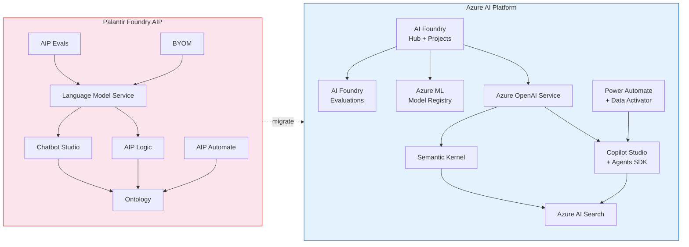
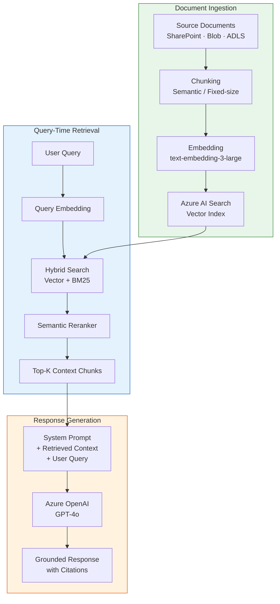
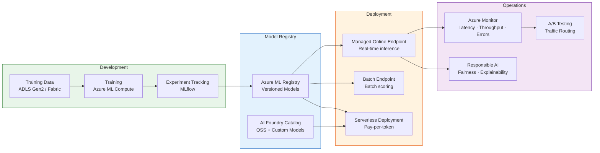

# AI & AIP Migration: Palantir Foundry to Azure

**A deep-dive technical guide for AI/ML architects, data scientists, and platform engineers migrating Palantir Foundry's AIP capabilities to Azure AI services and CSA-in-a-Box.**

---

## Executive summary

Palantir's Artificial Intelligence Platform (AIP) provides a vertically integrated stack for LLM access, agent development, no-code logic functions, evaluations, and automation — all tightly coupled to the Foundry Ontology. This cohesion is the source of both AIP's productivity advantage and its deepest lock-in risk: every prompt, tool call, and evaluation is encoded in Foundry-specific abstractions that have no portable export.

Azure offers an equivalent or superior capability for every AIP feature, assembled from composable, standards-based services. Azure OpenAI Service provides multi-model LLM access with OpenAI-compatible APIs. Azure AI Foundry organizes model catalogs, evaluations, and deployments. Copilot Studio and the Microsoft 365 Agents SDK deliver no-code and pro-code agent development. Semantic Kernel provides an open-source orchestration framework. Power Automate and Data Activator handle event-driven automation. CSA-in-a-Box integrates these services into a governed analytics platform with RAG pipelines, model serving endpoints, and enrichment workflows already in place.

This guide maps every AIP capability to its Azure equivalent, provides working code, and outlines a phased migration path.

---

## 1. Foundry AIP stack overview

Palantir AIP is a collection of capabilities layered on top of the Foundry Ontology:

| AIP capability | Purpose | Ontology coupling |
|---|---|---|
| **Language Model Service** | Unified multi-provider LLM access (OpenAI, Anthropic, Google), model catalog, usage tracking, zero-data-retention options | Medium — LLM calls are independent but routing policies reference Foundry projects |
| **AIP Chatbot Studio** | Build chatbots with retrieval context (documents, objects, functions), tool calling (prompted/sequential and native/parallel), deployable via Threads/Workshop/OSDK/API | High — grounding context, tool definitions, and deployment targets are Ontology-native |
| **AIP Logic** | No-code visual LLM function builder for prompt engineering, Ontology queries, edits, and downstream integration with Automate | Very High — every Logic node references Ontology objects, properties, or actions |
| **AIP Assist** | In-platform assistant for documentation, coding help, data exploration | Medium — useful but not mission-critical for migration |
| **AIP Evals** | Testing environment for LLM evaluation: experiment runs, metrics, auto-generated test cases for non-deterministic models | Medium — eval definitions reference Foundry datasets but logic is reconstructable |
| **AIP Automate** | Triggers (time-based, data-based) that execute actions, functions, logic, notifications; scheduled reports, data alerting | High — trigger conditions reference Ontology change events |
| **BYOM** | Register customer-owned models and connect them to AIP tool calling and Logic | Low — model registration is a metadata wrapper |
| **Model lifecycle** | Model objectives, training, deployment, serving, adapter abstraction | Medium — uses Foundry-specific MLflow fork |
| **LLM pipeline transforms** | Classification, sentiment, summarization, entity extraction, translation inside Pipeline Builder | Medium — prompt templates are portable, Foundry wrappers are not |
| **Proposal-based patterns** | Agents create proposals for human review before executing actions (human-in-the-loop) | High — proposals are Ontology objects with approval workflows |
| **Agent tiers** | Ad-hoc (Threads), task-specific (chatbots), agentic application (integrated), automated (published as functions) | Varies by tier |
| **LLM-provider APIs** | Proxy endpoints accepting OpenAI/Anthropic format requests, routed through Foundry governance | Low — thin proxy, API contract is standard |

---

## 2. Azure AI stack comparison

### Capability mapping

| Foundry AIP | Azure equivalent | Migration complexity |
|---|---|---|
| Language Model Service | **Azure OpenAI Service** (GPT-4o, GPT-4.1, o3, o4-mini) + **AI Foundry model catalog** (Phi-4, Llama 3, Mistral, Cohere) | Low |
| AIP Chatbot Studio | **Copilot Studio** + **Microsoft 365 Agents SDK** + **Azure AI Agent Service** | Medium |
| AIP Logic | **Power Automate** + **Azure Functions** + **Semantic Kernel** chains | Medium |
| AIP Assist | **Microsoft 365 Copilot** + **GitHub Copilot** | Low (no migration — adopt) |
| AIP Evals | **Azure AI Foundry evaluations** + **Prompt Flow eval** + custom eval pipelines | Medium |
| AIP Automate | **Power Automate** + **Data Activator** + **Azure Functions** (timer/event triggers) | Medium |
| BYOM | **Azure ML model registry** + **AI Foundry model catalog** (custom model import) | Low |
| Model lifecycle | **Azure ML pipelines** + **MLflow** (native or Databricks-hosted) | Medium |
| LLM pipeline transforms | **Azure OpenAI** in ADF custom activities + **Fabric notebook** enrichment | Low |
| Proposal patterns | **Power Automate approvals** + **Teams Adaptive Cards** + custom approval APIs | Medium |
| Agent tiers | **Copilot Studio agents** (declarative, custom engine, API-based) | Medium |
| LLM-provider APIs | **Azure OpenAI API** (OpenAI-compatible endpoint, drop-in replacement) | Low |

### Architecture comparison diagram



---

## 3. LLM integration migration

### Foundry Language Model Service

Foundry's Language Model Service provides:

- A unified API abstracting multiple LLM providers (OpenAI, Anthropic, Google, Meta)
- Model catalog with governance policies per model
- Usage tracking and cost allocation per project
- Zero-data-retention (ZDR) options for sensitive workloads
- Rate limiting and quota management per workspace

### Azure OpenAI Service equivalent

Azure OpenAI provides the same capabilities with deeper integration into the Azure ecosystem:

| Feature | Foundry LMS | Azure OpenAI |
|---|---|---|
| Multi-model access | Model catalog with routing | Multi-deployment per resource; AI Foundry model catalog for OSS |
| API compatibility | Proprietary + OpenAI-format proxy | Native OpenAI-compatible API (drop-in replacement) |
| Data residency | Foundry-managed, region selection | Azure region deployment, Government cloud support (IL2-IL6) |
| Zero data retention | ZDR flag per model | Data, privacy, and security commitments; opt-out of abuse monitoring |
| Usage tracking | Per-project metrics in Foundry | Azure Monitor metrics, Cost Management tags, token-level logging |
| Rate limiting | Workspace-level quotas | TPM/RPM quotas per deployment, provisioned throughput units (PTU) |
| Model governance | Foundry markings and permissions | Azure RBAC, managed identity, content filtering policies |

### Migration steps

1. **Inventory Foundry LLM usage.** Export the list of models used, token volumes per project, and any ZDR requirements.

2. **Provision Azure OpenAI resource.** Deploy in the appropriate Azure region (or Azure Government for IL4+).

3. **Create model deployments.** Map each Foundry model to its Azure OpenAI equivalent:

   | Foundry model | Azure OpenAI deployment |
   |---|---|
   | GPT-4 Turbo | `gpt-4o` or `gpt-4.1` |
   | GPT-4 | `gpt-4o` |
   | GPT-3.5 Turbo | `gpt-4o-mini` (superior, lower cost) |
   | Claude 3 / Claude 3.5 | `gpt-4o` or `gpt-4.1` (comparable capability) |
   | Llama 3 | AI Foundry serverless deployment (Llama 3.1 / 3.3) |
   | Mistral | AI Foundry serverless deployment (Mistral Large) |

4. **Update application code.** Replace Foundry SDK calls with Azure OpenAI SDK calls.

### Code example: Foundry to Azure OpenAI migration

**Before (Foundry Python SDK):**

```python
from foundry.v2 import FoundryClient

client = FoundryClient(auth=foundry_auth, hostname="your-instance.palantirfoundry.com")

response = client.aip.language_models.chat.completions.create(
    model="gpt-4-turbo",
    messages=[
        {"role": "system", "content": "You are a federal case analyst."},
        {"role": "user", "content": "Summarize this incident report."},
    ],
    temperature=0.3,
)
print(response.choices[0].message.content)
```

**After (Azure OpenAI Python SDK):**

```python
from openai import AzureOpenAI

client = AzureOpenAI(
    azure_endpoint="https://csa-openai.openai.azure.com",
    api_version="2024-12-01-preview",
    azure_ad_token_provider=get_bearer_token,  # Managed identity
)

response = client.chat.completions.create(
    model="gpt-4o",  # Deployment name
    messages=[
        {"role": "system", "content": "You are a federal case analyst."},
        {"role": "user", "content": "Summarize this incident report."},
    ],
    temperature=0.3,
)
print(response.choices[0].message.content)
```

The API shape is intentionally identical because Azure OpenAI implements the OpenAI API contract. The migration is a configuration change, not a rewrite.

### CSA-in-a-Box integration

CSA-in-a-Box already provides model serving infrastructure:

- **Model endpoint wrapper:** `csa_platform/ai_integration/model_serving/endpoint.py` provides a unified interface for deploying and invoking models on Azure ML managed online endpoints
- **Rate limiting:** `csa_platform/ai_integration/rag/rate_limit.py` implements Azure OpenAI rate limiting with token-bucket management
- **Setup guide:** `docs/guides/azure-ai-foundry.md` covers Hub/Project provisioning, model deployment, and private networking

---

## 4. Chatbot and agent migration

### Foundry AIP Chatbot Studio

Chatbot Studio (formerly Agent Studio) provides:

- Retrieval context: documents, Ontology objects, functions
- Tool calling: action execution, object queries, function calls, variable updates
- Two tool-calling modes: prompted/sequential (step-by-step reasoning) and native/parallel (model-managed)
- Deployment targets: AIP Threads, Workshop embeds, OSDK, REST API
- Conversation history and state management

### Azure agent options

Azure provides three agent development paths, mapping to different Foundry chatbot complexity levels:

| Foundry pattern | Azure path | Best for |
|---|---|---|
| Simple Q&A chatbot with doc grounding | **Copilot Studio** (declarative agent) | No-code, citizen developers |
| Tool-calling chatbot with Ontology integration | **Microsoft 365 Agents SDK** + **Azure AI Agent Service** | Pro-code, enterprise agents |
| Multi-agent team with specialized roles | **Semantic Kernel** multi-agent orchestration | Advanced, custom orchestration |

### Migration approach by chatbot type

#### Type 1: Document-grounded chatbot (Copilot Studio)

Foundry chatbots that simply answer questions from uploaded documents migrate directly to Copilot Studio:

1. Export grounding documents from Foundry (PDFs, SharePoint content, knowledge articles)
2. Create a Copilot Studio agent with knowledge sources pointing to SharePoint or Dataverse
3. Configure topics for guided conversations
4. Publish to Teams, web, or custom channels

#### Type 2: Tool-calling agent (Azure AI Agent Service)

Foundry chatbots that call tools (query objects, execute actions) require the Azure AI Agent Service or Semantic Kernel:

```python
# Azure AI Agent Service with tool calling
from azure.ai.projects import AIProjectClient
from azure.identity import DefaultAzureCredential

project = AIProjectClient(
    credential=DefaultAzureCredential(),
    endpoint="https://csa-ai-project.services.ai.azure.com",
)

# Define tools the agent can call
tools = [
    {
        "type": "function",
        "function": {
            "name": "query_case_records",
            "description": "Search federal case records by criteria",
            "parameters": {
                "type": "object",
                "properties": {
                    "status": {"type": "string", "enum": ["open", "closed", "pending"]},
                    "date_range": {"type": "string", "description": "ISO date range"},
                },
            },
        },
    }
]

agent = project.agents.create_agent(
    model="gpt-4o",
    name="CaseAnalystAgent",
    instructions="You are a federal case analyst. Use tools to query case data.",
    tools=tools,
)

thread = project.agents.create_thread()
project.agents.create_message(thread_id=thread.id, role="user", content="Show open cases from last week")

run = project.agents.create_and_process_run(thread_id=thread.id, agent_id=agent.id)

messages = project.agents.list_messages(thread_id=thread.id)
for msg in messages:
    if msg.role == "assistant":
        print(msg.content[0].text.value)
```

#### Type 3: Multi-agent team (Semantic Kernel)

Complex Foundry chatbots with multiple reasoning steps or specialized sub-agents map to Semantic Kernel's multi-agent framework. CSA-in-a-Box Tutorial 07 (`docs/tutorials/07-agents-foundry-sk/`) demonstrates this pattern:

```python
import asyncio
from semantic_kernel.agents import ChatCompletionAgent, AgentGroupChat
from semantic_kernel.agents.strategies import RoundRobinStrategy
from semantic_kernel.connectors.ai.open_ai import AzureChatCompletion

# Create specialized agents
data_analyst = ChatCompletionAgent(
    name="DataAnalyst",
    instructions="Analyze data queries and provide statistical insights.",
    service=AzureChatCompletion(
        deployment_name="gpt-4o",
        endpoint="https://csa-openai.openai.azure.com",
        ad_token_provider=get_bearer_token,
    ),
)

quality_reviewer = ChatCompletionAgent(
    name="QualityReviewer",
    instructions="Review analysis for accuracy, bias, and completeness.",
    service=AzureChatCompletion(
        deployment_name="gpt-4o",
        endpoint="https://csa-openai.openai.azure.com",
        ad_token_provider=get_bearer_token,
    ),
)

# Orchestrate as a group chat
group_chat = AgentGroupChat(
    agents=[data_analyst, quality_reviewer],
    selection_strategy=RoundRobinStrategy(),
)

async def run_analysis(query: str):
    await group_chat.add_chat_message(role="user", content=query)
    async for response in group_chat.invoke():
        print(f"[{response.agent_name}]: {response.content}")

asyncio.run(run_analysis("Analyze Q1 case closure rates by region"))
```

### Agent tier mapping

| Foundry agent tier | Description | Azure equivalent |
|---|---|---|
| **Ad-hoc** (AIP Threads) | Conversational AI in the platform UI | Microsoft 365 Copilot chat, Copilot Studio test pane |
| **Task-specific** (Chatbot Studio) | Purpose-built chatbot with tools and grounding | Copilot Studio custom agent, Azure AI Agent Service |
| **Agentic application** (integrated) | Agent embedded in Workshop or custom app | Microsoft 365 Agents SDK embedded in Teams/custom app |
| **Automated** (published as functions) | Agent triggered by events, no human interaction | Azure Functions + Semantic Kernel, Power Automate AI actions |

---

## 5. Logic function migration

### Foundry AIP Logic

AIP Logic provides a no-code visual canvas for building LLM-powered functions:

- Drag-and-drop prompt engineering with variable injection
- Ontology object queries and property access within prompts
- Ontology edits (create, update, delete objects) as function outputs
- Integration with AIP Automate for triggered execution
- Chaining multiple LLM calls with conditional branching

### Azure migration paths

AIP Logic functions span a spectrum from simple prompt templates to complex multi-step orchestrations. Choose the Azure target based on complexity:

| Logic function type | Azure target | Rationale |
|---|---|---|
| Single prompt with variable injection | **Azure OpenAI** direct call | No orchestration needed |
| Prompt + data lookup + response formatting | **Semantic Kernel** function chain | Lightweight code-based orchestration |
| Multi-step with conditionals and branching | **Semantic Kernel** + planner | Complex reasoning with step selection |
| Business-user-maintained prompts | **Power Automate** AI Builder actions | No-code, citizen developer friendly |
| Triggered by data changes | **Power Automate** + **Data Activator** | Event-driven, no infrastructure management |

### Semantic Kernel function chain example

This example migrates a Foundry Logic function that: (1) looks up a case record, (2) summarizes it with an LLM, (3) classifies urgency, and (4) updates the case status.

```python
import semantic_kernel as sk
from semantic_kernel.connectors.ai.open_ai import AzureChatCompletion
from semantic_kernel.functions import kernel_function

kernel = sk.Kernel()
kernel.add_service(AzureChatCompletion(
    deployment_name="gpt-4o",
    endpoint="https://csa-openai.openai.azure.com",
    ad_token_provider=get_bearer_token,
))


class CasePlugin:
    """Plugin replacing Foundry Ontology queries and edits."""

    @kernel_function(description="Look up a federal case record by ID")
    async def get_case(self, case_id: str) -> str:
        # Query Azure SQL / Cosmos DB / Fabric lakehouse
        record = await db.query(f"SELECT * FROM cases WHERE id = '{case_id}'")
        return json.dumps(record)

    @kernel_function(description="Update case status and priority")
    async def update_case(self, case_id: str, status: str, priority: str) -> str:
        await db.execute(
            "UPDATE cases SET status = ?, priority = ? WHERE id = ?",
            (status, priority, case_id),
        )
        return f"Case {case_id} updated: status={status}, priority={priority}"


kernel.add_plugin(CasePlugin(), plugin_name="case_ops")

# Semantic function: summarize and classify
summarize_prompt = """
Given this case record, provide:
1. A one-paragraph summary
2. An urgency classification: CRITICAL, HIGH, MEDIUM, LOW

Case record:
{{$case_data}}

Respond in JSON: {"summary": "...", "urgency": "..."}
"""

summarize_fn = kernel.add_function(
    plugin_name="analysis",
    function_name="summarize_and_classify",
    prompt=summarize_prompt,
)

# Orchestrate the full flow
async def process_case(case_id: str):
    # Step 1: Look up case
    case_data = await kernel.invoke(
        kernel.get_function("case_ops", "get_case"),
        case_id=case_id,
    )
    # Step 2: Summarize and classify
    result = await kernel.invoke(
        summarize_fn,
        case_data=str(case_data),
    )
    analysis = json.loads(str(result))
    # Step 3: Update case
    await kernel.invoke(
        kernel.get_function("case_ops", "update_case"),
        case_id=case_id,
        status="reviewed",
        priority=analysis["urgency"],
    )
    return analysis
```

### CSA-in-a-Box enrichment equivalents

CSA-in-a-Box already includes LLM-powered enrichment functions that replace common AIP Logic patterns:

| AIP Logic pattern | CSA-in-a-Box module | Path |
|---|---|---|
| Entity extraction | `EntityExtractor` | `csa_platform/ai_integration/enrichment/entity_extractor.py` |
| Text summarization | `TextSummarizer` | `csa_platform/ai_integration/enrichment/text_summarizer.py` |
| Document classification | `DocumentClassifier` | `csa_platform/ai_integration/enrichment/document_classifier.py` |
| Custom LLM transforms | RAG generate module | `csa_platform/ai_integration/rag/generate.py` |

---

## 6. Evaluation pipeline migration

### Foundry AIP Evals

AIP Evals provides:

- Experiment management: define evaluation runs against specific model configurations
- Test case generation: auto-generate test cases from historical data
- Non-deterministic metrics: handle LLM output variability with statistical measures
- Comparison views: side-by-side model performance across experiments
- Integration with Logic and Chatbot Studio for end-to-end testing

### Azure AI Foundry evaluations

Azure AI Foundry provides built-in evaluation capabilities that cover all AIP Evals features:

| AIP Evals feature | Azure equivalent | Tool |
|---|---|---|
| Experiment runs | Evaluation runs in AI Foundry | AI Foundry portal or SDK |
| Test case generation | Synthetic data generation | AI Foundry + Prompt Flow |
| Quality metrics | Groundedness, relevance, coherence, fluency | Built-in evaluators |
| Safety metrics | Violence, self-harm, hate, sexual content | Azure AI Content Safety evaluators |
| Custom metrics | Custom evaluator functions | Python-based evaluator plugins |
| Comparison views | Evaluation dashboard | AI Foundry portal |

### Evaluation pipeline example

```python
from azure.ai.evaluation import (
    evaluate,
    GroundednessEvaluator,
    RelevanceEvaluator,
    CoherenceEvaluator,
    FluencyEvaluator,
)
from azure.identity import DefaultAzureCredential

# Configure evaluators
model_config = {
    "azure_endpoint": "https://csa-openai.openai.azure.com",
    "azure_deployment": "gpt-4o",
    "api_version": "2024-12-01-preview",
}

groundedness = GroundednessEvaluator(model_config=model_config)
relevance = RelevanceEvaluator(model_config=model_config)
coherence = CoherenceEvaluator(model_config=model_config)
fluency = FluencyEvaluator(model_config=model_config)

# Prepare test dataset (migrated from Foundry eval datasets)
test_data = [
    {
        "query": "What is the status of case 2024-0042?",
        "context": "Case 2024-0042 was opened on Jan 15, 2024. Status: Under Review.",
        "response": "Case 2024-0042 is currently under review, having been opened on January 15, 2024.",
    },
    {
        "query": "Summarize recent enforcement actions",
        "context": "Three enforcement actions were filed in Q1 2024...",
        "response": "In Q1 2024, three enforcement actions were initiated...",
    },
]

# Run evaluation
results = evaluate(
    data=test_data,
    evaluators={
        "groundedness": groundedness,
        "relevance": relevance,
        "coherence": coherence,
        "fluency": fluency,
    },
    output_path="./eval_results.json",
)

print(f"Groundedness: {results['metrics']['groundedness.score']:.2f}")
print(f"Relevance:    {results['metrics']['relevance.score']:.2f}")
print(f"Coherence:    {results['metrics']['coherence.score']:.2f}")
print(f"Fluency:      {results['metrics']['fluency.score']:.2f}")
```

### Custom evaluator for domain-specific metrics

When Foundry Evals included custom metric functions, recreate them as Azure AI evaluator plugins:

```python
from azure.ai.evaluation import EvaluatorBase


class RegulatoryComplianceEvaluator(EvaluatorBase):
    """Custom evaluator checking responses for regulatory compliance markers."""

    def __init__(self, required_disclaimers: list[str]):
        self.required_disclaimers = required_disclaimers

    def __call__(self, *, response: str, **kwargs) -> dict:
        found = [d for d in self.required_disclaimers if d.lower() in response.lower()]
        score = len(found) / len(self.required_disclaimers) if self.required_disclaimers else 1.0
        return {
            "compliance_score": score,
            "missing_disclaimers": [d for d in self.required_disclaimers if d not in found],
        }
```

---

## 7. Automation migration

### Foundry AIP Automate

AIP Automate provides:

- Time-based triggers: cron schedules for periodic execution
- Data-based triggers: fire when Ontology objects change (create, update, delete)
- Action execution: call Functions, Logic flows, or Ontology edits
- Notification delivery: email, Slack, Teams integrations
- Scheduled reports: periodic data snapshots and distribution

### Azure automation equivalents

| AIP Automate feature | Azure service | Configuration |
|---|---|---|
| Time-based triggers | **Power Automate** scheduled flows / **Azure Functions** timer triggers | Cron expressions |
| Data-based triggers | **Data Activator** / **Event Grid** / **Power Automate** Dataverse triggers | Event subscriptions |
| Action execution | **Power Automate** actions / **Azure Functions** / **Logic Apps** | Connector-based or code |
| Notifications | **Power Automate** connectors (Teams, Outlook, Slack) | Built-in connectors |
| Scheduled reports | **Power BI** subscriptions / **Power Automate** + Power BI connector | Schedule configuration |

### Data Activator for real-time triggers

Data Activator (part of Microsoft Fabric) replaces Foundry's data-based triggers with a visual, no-code rule engine:

```
Trigger: When a case record status changes to "escalated"
  AND priority = "CRITICAL"
  AND assigned_agent IS NULL

Action: Send Teams notification to @Supervisors channel
  AND Create Power Automate approval flow
  AND Log event to Azure Monitor
```

### Azure Functions timer trigger example

For Foundry Automate schedules that ran Logic or Functions on a cron schedule:

```python
# function_app.py — Azure Functions equivalent of AIP Automate cron job
import azure.functions as func
import logging
from openai import AzureOpenAI

app = func.FunctionApp()


@app.timer_trigger(schedule="0 0 6 * * 1-5", arg_name="timer", run_on_startup=False)
async def daily_case_summary(timer: func.TimerRequest):
    """
    Replaces: AIP Automate schedule -> AIP Logic 'daily_case_summary'
    Runs: 6 AM UTC, Monday through Friday
    """
    logging.info("Running daily case summary generation")

    # Query cases updated in last 24 hours (replaces Ontology query)
    cases = await query_recent_cases(hours=24)

    # Generate summary using Azure OpenAI (replaces AIP Logic LLM call)
    client = AzureOpenAI(
        azure_endpoint="https://csa-openai.openai.azure.com",
        api_version="2024-12-01-preview",
        azure_ad_token_provider=get_bearer_token,
    )

    response = client.chat.completions.create(
        model="gpt-4o",
        messages=[
            {"role": "system", "content": "Summarize federal case updates for the daily briefing."},
            {"role": "user", "content": f"Cases updated in last 24h:\n{format_cases(cases)}"},
        ],
        temperature=0.2,
    )

    summary = response.choices[0].message.content

    # Distribute via Teams (replaces Foundry notification)
    await send_teams_message(
        channel_id="supervisors-channel",
        title="Daily Case Briefing",
        body=summary,
    )

    logging.info("Daily case summary sent successfully")
```

---

## 8. RAG implementation on Azure

### Foundry RAG architecture

In Foundry, RAG is implicit: AIP Chatbot Studio retrieves context from the Ontology (objects, documents, and functions) and injects it into prompts. The retrieval mechanism is tightly coupled to Foundry's indexing engine.

### Azure RAG architecture

Azure RAG uses explicit, composable components:



### CSA-in-a-Box RAG pipeline

CSA-in-a-Box provides a complete RAG implementation ready for use:

| Component | Module | Path |
|---|---|---|
| Document loading | `DocumentLoader` | `csa_platform/ai_integration/rag/loaders.py` |
| Chunking | `DocumentChunker` | `csa_platform/ai_integration/rag/chunker.py` |
| Indexing | `SearchIndexer` | `csa_platform/ai_integration/rag/indexer.py` |
| Retrieval | `HybridRetriever` | `csa_platform/ai_integration/rag/retriever.py` |
| Reranking | `RerankPolicy` | `csa_platform/ai_integration/rag/rerank.py` |
| Generation | `generate_answer_async` | `csa_platform/ai_integration/rag/generate.py` |
| Service facade | `RAGService` | `csa_platform/ai_integration/rag/service.py` |
| Configuration | `RAGSettings` | `csa_platform/ai_integration/rag/config.py` |
| Telemetry | Latency and chunk metrics | `csa_platform/ai_integration/rag/telemetry.py` |
| GraphRAG | Knowledge graph augmentation | `csa_platform/ai_integration/graphrag/` |

### RAG service usage

```python
from csa_platform.ai_integration.rag.service import RAGService
from csa_platform.ai_integration.rag.config import RAGSettings

settings = RAGSettings(
    azure_openai_endpoint="https://csa-openai.openai.azure.com",
    azure_search_endpoint="https://csa-search.search.windows.net",
    embedding_deployment="text-embedding-3-large",
    chat_deployment="gpt-4o",
    index_name="federal-case-docs",
)

async with RAGService(settings) as rag:
    # Ingest documents (replaces Foundry document grounding)
    report = await rag.ingest(paths=["/data/case-documents/"])
    print(f"Indexed {report.documents_processed} documents, {report.chunks_created} chunks")

    # Query with RAG (replaces Chatbot Studio retrieval)
    answer = await rag.query("What enforcement actions were taken in Q1 2024?")
    print(answer.text)
    for citation in answer.citations:
        print(f"  Source: {citation.document_title}, chunk {citation.chunk_id}")
```

### Tutorials

For hands-on RAG implementation guidance, see:

- **Tutorial 08:** RAG with Vector Search (`docs/tutorials/08-rag-vector-search/`)
- **Tutorial 09:** GraphRAG with Knowledge Graphs (`docs/tutorials/09-graphrag-knowledge/`)
- **AI Search guide:** `docs/guides/azure-ai-search.md`

---

## 9. Model lifecycle migration

### Foundry model lifecycle

Foundry provides a model lifecycle that includes:

- Model objectives: define what the model should optimize
- Training: managed training runs with data from the Ontology
- Deployment: publish models to Foundry's serving infrastructure
- Serving: inference endpoints within the Foundry platform
- Adapter abstraction: swap underlying model implementations without changing consumers
- BYOM: register externally trained models for use in AIP

### Azure model lifecycle

Azure ML and AI Foundry provide a comprehensive model lifecycle:



### Migration steps

1. **Export model artifacts** from Foundry. Models trained in Foundry typically produce standard artifacts (ONNX, PyTorch, scikit-learn). Export these along with training metrics.

2. **Register in Azure ML.** Use the Azure ML SDK or CLI to register model artifacts with versioning:

   ```bash
   az ml model create \
     --name crop-yield-predictor \
     --version 3 \
     --path ./model-artifacts/ \
     --type custom_model \
     --resource-group rg-csa-prod \
     --workspace-name csa-ml-workspace
   ```

3. **Deploy to managed endpoint.** CSA-in-a-Box provides the `ModelEndpoint` wrapper (`csa_platform/ai_integration/model_serving/endpoint.py`):

   ```python
   from csa_platform.ai_integration.model_serving.endpoint import ModelEndpoint

   endpoint = ModelEndpoint(
       workspace_name="csa-ml-workspace",
       resource_group="rg-csa-prod",
       subscription_id="your-subscription-id",
   )

   endpoint.deploy(
       endpoint_name="crop-yield-predictor",
       model_name="crop-yield-v2",
       model_version="3",
       instance_type="Standard_DS3_v2",
       instance_count=1,
   )

   # Invoke
   result = endpoint.invoke("crop-yield-predictor", {"features": [1.2, 3.4, 5.6]})
   ```

4. **Set up monitoring.** Azure Monitor provides metrics for latency, throughput, error rates, and model drift. Configure alerts for SLA violations.

5. **Implement A/B testing.** Route traffic between model versions using the managed endpoint traffic routing:

   ```bash
   az ml online-endpoint update \
     --name crop-yield-predictor \
     --traffic "v2=80 v3=20" \
     --resource-group rg-csa-prod \
     --workspace-name csa-ml-workspace
   ```

### BYOM migration

For Foundry BYOM models (externally trained models registered in Foundry for AIP use):

| Foundry BYOM step | Azure equivalent |
|---|---|
| Register model in Foundry | Register in Azure ML model registry or import to AI Foundry catalog |
| Connect to AIP tool calling | Expose via managed endpoint, call from Semantic Kernel plugin |
| Use in AIP Logic | Call from Azure Functions or Power Automate HTTP action |
| Monitor usage | Azure Monitor metrics + Application Insights |

---

## 10. Human-in-the-loop patterns

### Foundry proposal-based agents

Foundry's proposal pattern is a core AIP design: agents create "proposals" (draft actions) that humans review before execution. This pattern is embedded in the Ontology — proposals are objects with approval states, and actions execute only when proposals are approved.

### Azure human-in-the-loop implementation

Azure provides multiple mechanisms for human-in-the-loop workflows:

#### Option 1: Power Automate approvals

Best for business process approvals with non-technical reviewers:

```
Flow: AI Agent generates recommendation
  → Create approval request in Power Automate
  → Notify reviewer via Teams Adaptive Card
  → Wait for approval/rejection
  → If approved: execute action (Azure Function / Power Automate)
  → If rejected: log reason, notify agent, escalate
```

#### Option 2: Teams Adaptive Cards with structured input

For richer review experiences with structured data:

```json
{
  "type": "AdaptiveCard",
  "version": "1.5",
  "body": [
    {
      "type": "TextBlock",
      "text": "AI Agent Proposal: Case Reclassification",
      "weight": "bolder",
      "size": "large"
    },
    {
      "type": "FactSet",
      "facts": [
        { "title": "Case ID", "value": "2024-0042" },
        { "title": "Current Classification", "value": "Medium Priority" },
        { "title": "Proposed Classification", "value": "Critical" },
        { "title": "AI Confidence", "value": "94%" },
        { "title": "Reasoning", "value": "Multiple escalation indicators detected" }
      ]
    },
    {
      "type": "Input.ChoiceSet",
      "id": "decision",
      "label": "Your Decision",
      "choices": [
        { "title": "Approve", "value": "approved" },
        { "title": "Reject", "value": "rejected" },
        { "title": "Modify", "value": "modify" }
      ]
    },
    {
      "type": "Input.Text",
      "id": "comments",
      "label": "Comments (optional)",
      "isMultiline": true
    }
  ],
  "actions": [
    {
      "type": "Action.Submit",
      "title": "Submit Decision"
    }
  ]
}
```

#### Option 3: Custom approval API with Semantic Kernel

For programmatic human-in-the-loop integrated into agent workflows:

```python
from semantic_kernel.functions import kernel_function


class ApprovalPlugin:
    """Human-in-the-loop approval gate for agent actions."""

    @kernel_function(description="Submit a proposal for human review before execution")
    async def submit_proposal(
        self,
        action: str,
        target: str,
        reasoning: str,
        confidence: float,
    ) -> str:
        # Create approval record
        proposal_id = await create_approval_record(
            action=action,
            target=target,
            reasoning=reasoning,
            confidence=confidence,
        )

        # Send notification (Teams, email, etc.)
        await send_approval_notification(proposal_id)

        # For automated workflows, poll or use webhook callback
        # For synchronous flows, wait for approval
        decision = await wait_for_approval(proposal_id, timeout_minutes=60)

        if decision.approved:
            return f"APPROVED by {decision.reviewer}: proceed with {action} on {target}"
        else:
            return f"REJECTED by {decision.reviewer}: {decision.reason}"
```

### Confidence-based routing

Implement tiered automation based on model confidence, mirroring Foundry's proposal thresholds:

```python
async def route_by_confidence(prediction: dict) -> str:
    confidence = prediction["confidence"]

    if confidence >= 0.95:
        # Auto-execute: high confidence, no human review needed
        await execute_action(prediction)
        return "auto_executed"
    elif confidence >= 0.80:
        # Proposal: create approval request for human review
        await submit_for_approval(prediction)
        return "pending_approval"
    else:
        # Escalate: low confidence, require manual analysis
        await escalate_to_analyst(prediction)
        return "escalated"
```

---

## 11. Multi-modal AI on Azure

### Foundry multi-modal capabilities

Foundry AIP supports multi-modal inputs through its Language Model Service (passing images to vision models) and LLM pipeline transforms (processing documents with OCR + LLM).

### Azure multi-modal services

Azure provides a richer multi-modal ecosystem:

| Modality | Azure service | Use case |
|---|---|---|
| Text + Vision | **Azure OpenAI** GPT-4o (native vision) | Image analysis, chart interpretation, document understanding |
| Document Intelligence | **Azure AI Document Intelligence** | Form extraction, receipt processing, ID document parsing |
| Speech | **Azure AI Speech** | Transcription, real-time translation, text-to-speech |
| Video | **Azure AI Video Indexer** | Video analysis, face detection, scene segmentation |
| Translation | **Azure AI Translator** | Real-time text and document translation |
| Custom Vision | **Azure AI Custom Vision** | Domain-specific image classification and object detection |

### Multi-modal agent example

```python
import base64
from openai import AzureOpenAI

client = AzureOpenAI(
    azure_endpoint="https://csa-openai.openai.azure.com",
    api_version="2024-12-01-preview",
    azure_ad_token_provider=get_bearer_token,
)


def analyze_document_with_vision(image_path: str, question: str) -> str:
    """Use GPT-4o vision to analyze a scanned document."""
    with open(image_path, "rb") as f:
        image_data = base64.b64encode(f.read()).decode("utf-8")

    response = client.chat.completions.create(
        model="gpt-4o",
        messages=[
            {
                "role": "system",
                "content": "You are a federal document analyst. Extract and analyze information from scanned documents.",
            },
            {
                "role": "user",
                "content": [
                    {"type": "text", "text": question},
                    {
                        "type": "image_url",
                        "image_url": {
                            "url": f"data:image/png;base64,{image_data}",
                            "detail": "high",
                        },
                    },
                ],
            },
        ],
        max_tokens=2000,
    )

    return response.choices[0].message.content


# Usage
result = analyze_document_with_vision(
    "scanned_form.png",
    "Extract all fields from this federal application form and return as structured JSON.",
)
```

---

## 12. LLM pipeline transforms migration

### Foundry LLM pipeline transforms

In Foundry Pipeline Builder, LLM transforms apply AI enrichment to datasets at scale:

- Classification: categorize records using LLM prompts
- Sentiment analysis: score text fields for sentiment
- Summarization: generate summaries for long-text fields
- Entity extraction: pull structured entities from unstructured text
- Translation: translate text fields between languages

### Azure enrichment equivalents

| Foundry transform | Azure equivalent | Implementation |
|---|---|---|
| Classification | CSA-in-a-Box `DocumentClassifier` | `csa_platform/ai_integration/enrichment/document_classifier.py` |
| Sentiment analysis | Azure AI Language sentiment API or Azure OpenAI | Azure AI Language SDK or custom prompt |
| Summarization | CSA-in-a-Box `TextSummarizer` | `csa_platform/ai_integration/enrichment/text_summarizer.py` |
| Entity extraction | CSA-in-a-Box `EntityExtractor` | `csa_platform/ai_integration/enrichment/entity_extractor.py` |
| Translation | Azure AI Translator | REST API or SDK |

### Batch enrichment in Fabric notebooks

For high-volume enrichment (replacing Foundry pipeline transforms at scale):

```python
# Fabric notebook: batch LLM enrichment of Gold layer data
from pyspark.sql import functions as F
from openai import AzureOpenAI
import json

client = AzureOpenAI(
    azure_endpoint="https://csa-openai.openai.azure.com",
    api_version="2024-12-01-preview",
    azure_ad_token_provider=get_bearer_token,
)


def classify_record(text: str) -> dict:
    """Classify a case record using Azure OpenAI."""
    response = client.chat.completions.create(
        model="gpt-4o-mini",  # Cost-effective for classification
        messages=[
            {
                "role": "system",
                "content": """Classify this federal case record. Return JSON:
                {"category": "...", "subcategory": "...", "confidence": 0.0-1.0}
                Categories: enforcement, compliance, investigation, adjudication, other""",
            },
            {"role": "user", "content": text[:4000]},
        ],
        temperature=0.1,
        response_format={"type": "json_object"},
    )
    return json.loads(response.choices[0].message.content)


# Register as Spark UDF
classify_udf = F.udf(classify_record, "struct<category:string,subcategory:string,confidence:double>")

# Apply to dataset
df = spark.read.format("delta").load("abfss://gold@csadatalake.dfs.core.windows.net/cases")
enriched = df.withColumn("ai_classification", classify_udf(F.col("description")))
enriched.write.format("delta").mode("overwrite").save(
    "abfss://gold@csadatalake.dfs.core.windows.net/cases_enriched"
)
```

---

## 13. Performance and cost comparison

### Inference latency comparison

| Metric | Foundry AIP | Azure OpenAI | Notes |
|---|---|---|---|
| GPT-4o first-token latency | 800-1200 ms (proxied) | 200-400 ms (direct) | Foundry adds proxy overhead |
| GPT-4o tokens/sec throughput | 40-60 t/s | 60-100 t/s | Azure offers PTU for guaranteed throughput |
| Embedding latency (per batch) | 200-400 ms | 100-200 ms | Azure supports batch embedding API |
| RAG end-to-end (query to answer) | 2-5 sec | 1-3 sec | Azure AI Search hybrid + semantic reranker |
| Chatbot response time | 3-8 sec | 1-4 sec | Depends on tool calling depth |

### Cost comparison for AI workloads

| Workload | Foundry AIP annual cost | Azure annual cost | Savings |
|---|---|---|---|
| **LLM access** (1M tokens/day) | Included in $200K-$800K AIP add-on | $36K-$72K (pay-per-token) | 60-80% |
| **Chatbot** (10 agents, 1K queries/day) | Included in AIP add-on + seat licenses | $24K-$48K (Copilot Studio + AOAI) | Significant |
| **Eval pipelines** (weekly runs) | Included in AIP add-on | $6K-$12K (AI Foundry compute) | Included vs. standalone |
| **Batch enrichment** (100K records/day) | Compute commitment allocation | $18K-$36K (AOAI batch API, 50% discount) | Variable |
| **Model serving** (custom ML, 100 RPS) | Compute commitment allocation | $24K-$60K (managed endpoints) | Variable |
| **Total AI workload** | $200K-$800K/year (AIP add-on alone) | $108K-$228K/year | 40-70% |

**Key cost advantages of Azure:**

- **Pay-per-token pricing** eliminates waste from over-provisioned AIP add-ons
- **Batch API** offers 50% discount for non-real-time workloads (enrichment, eval)
- **Provisioned Throughput Units (PTU)** provide cost predictability for high-volume production workloads
- **Global batch processing** enables lowest-cost inference for background tasks
- **Model selection flexibility** lets you use GPT-4o-mini ($0.15/1M input tokens) for simple tasks instead of GPT-4o ($2.50/1M input tokens), a 16x cost reduction

### Throughput planning

| Azure OpenAI tier | Tokens per minute | Best for |
|---|---|---|
| Standard (pay-as-you-go) | 30K-240K TPM (shared) | Development, low-volume production |
| Provisioned (PTU) | Guaranteed capacity | High-volume production, SLA-bound |
| Global Standard | 30K-2M TPM (global routing) | Burst workloads, multi-region |
| Global Batch | Unlimited (async, 24h SLA) | Enrichment, eval, background processing |

---

## 14. Common pitfalls

### Pitfall 1: Migrating Ontology-coupled prompts without decoupling

**Problem:** Foundry AIP Logic and Chatbot Studio prompts often reference Ontology object types, properties, and link types directly (e.g., "Query all `CaseRecord` objects where `status` is `open`"). These Ontology references have no meaning outside Foundry.

**Solution:** Before migrating prompts, create a data access layer that abstracts Ontology queries into standard database calls. Replace Ontology references with Semantic Kernel plugins or Azure Functions that query your Azure data stores directly.

### Pitfall 2: Underestimating tool-calling migration complexity

**Problem:** Foundry Chatbot Studio tools are deeply integrated with the Ontology — object queries, action execution, and function calls all operate on Ontology abstractions. Teams often assume tool calling is a simple API swap.

**Solution:** Inventory every tool definition in each chatbot. For each tool, determine: (1) what data source it queries, (2) what action it performs, (3) what permissions it requires. Then implement each tool as a Semantic Kernel plugin, Azure Function, or Power Automate connector with equivalent data access and authorization.

### Pitfall 3: Ignoring evaluation pipeline migration

**Problem:** Teams migrate the chatbot but forget to migrate the evaluation pipeline. Without automated evals, quality regressions go undetected and the migrated system degrades silently.

**Solution:** Migrate AIP Evals to Azure AI Foundry evaluations in the same sprint as the chatbot migration. Establish baseline metrics on the Foundry side, reproduce them on Azure, and set up automated eval runs in CI/CD.

### Pitfall 4: Over-provisioning Azure OpenAI capacity

**Problem:** Teams accustomed to Foundry's fixed-cost AIP add-on provision large PTU allocations "just in case," negating the cost advantages of pay-per-token pricing.

**Solution:** Start with standard (pay-as-you-go) deployments. Monitor actual TPM usage for 2-4 weeks. Only move to PTU when you have consistent, predictable high-volume traffic that justifies reserved capacity. Use the Azure OpenAI capacity calculator.

### Pitfall 5: Building monolithic agents instead of composable agents

**Problem:** Foundry chatbots tend to be monolithic — a single agent with many tools. Migrating this pattern directly to Azure creates brittle, hard-to-test agents.

**Solution:** Decompose monolithic Foundry chatbots into specialized Semantic Kernel agents (data analyst, reviewer, classifier) orchestrated via group chat or sequential pipelines. Each agent has a focused instruction set and limited tool access, improving testability and maintainability.

### Pitfall 6: Neglecting rate limiting and retry logic

**Problem:** Foundry's Language Model Service handles rate limiting internally. Moving to Azure OpenAI exposes raw API rate limits (TPM/RPM), and unhandled 429 errors crash production workflows.

**Solution:** Use CSA-in-a-Box's built-in rate limiter (`csa_platform/ai_integration/rag/rate_limit.py`), which implements a token-bucket algorithm with exponential backoff. For custom implementations, use the `tenacity` library with Azure OpenAI-specific retry strategies.

### Pitfall 7: Not planning for Foundry's zero-data-retention (ZDR) requirements

**Problem:** Some Foundry deployments use ZDR to ensure no prompt/completion data is stored by the LLM provider. Teams assume Azure OpenAI works the same way by default.

**Solution:** Azure OpenAI provides data privacy commitments: prompts and completions are not used to train models, and data is not stored beyond the API request lifecycle. For additional assurance, opt out of abuse monitoring (requires an application to Microsoft) or use Azure Government clouds for regulated workloads.

---

## Migration phasing

### Recommended order

| Phase | Duration | What to migrate | Dependencies |
|---|---|---|---|
| **Phase 1: LLM access** | 1-2 weeks | Language Model Service to Azure OpenAI | Azure OpenAI resource provisioned |
| **Phase 2: Enrichment** | 2-3 weeks | LLM pipeline transforms to CSA-in-a-Box enrichment modules | Phase 1 |
| **Phase 3: RAG** | 2-3 weeks | Document grounding to Azure AI Search + RAG pipeline | Phase 1, AI Search index |
| **Phase 4: Agents** | 3-4 weeks | Chatbot Studio agents to Copilot Studio / Semantic Kernel | Phases 1-3 |
| **Phase 5: Evaluations** | 1-2 weeks | AIP Evals to Azure AI Foundry evaluations | Phase 4 |
| **Phase 6: Automation** | 2-3 weeks | AIP Automate to Power Automate / Data Activator | Phases 1-4 |
| **Phase 7: Model lifecycle** | 2-4 weeks | Custom models to Azure ML registry + managed endpoints | Phase 1 |

**Total estimated duration:** 13-21 weeks for a comprehensive AIP migration.

### Parallel workstreams

Phases 2, 3, and 7 can run in parallel after Phase 1 is complete. Phase 5 should run concurrently with Phase 4. This compression reduces the critical path to approximately 10-14 weeks.

---

## CSA-in-a-Box evidence paths

All Azure AI capabilities described in this guide are implemented or documented in the CSA-in-a-Box platform:

| Capability | Path |
|---|---|
| AI integration root | `csa_platform/ai_integration/` |
| RAG pipeline | `csa_platform/ai_integration/rag/` |
| GraphRAG | `csa_platform/ai_integration/graphrag/` |
| Model serving | `csa_platform/ai_integration/model_serving/` |
| Enrichment (NER, summarization, classification) | `csa_platform/ai_integration/enrichment/` |
| MCP server | `csa_platform/ai_integration/mcp_server/` |
| AI Foundry guide | `docs/guides/azure-ai-foundry.md` |
| AI Search guide | `docs/guides/azure-ai-search.md` |
| Tutorial 06: AI-First Analytics | `docs/tutorials/06-ai-analytics-foundry/` |
| Tutorial 07: AI Agents with Semantic Kernel | `docs/tutorials/07-agents-foundry-sk/` |
| Tutorial 08: RAG with Vector Search | `docs/tutorials/08-rag-vector-search/` |
| Tutorial 09: GraphRAG Knowledge Graphs | `docs/tutorials/09-graphrag-knowledge/` |

---

## Next steps

1. **Inventory your AIP usage.** Catalog every Chatbot Studio agent, Logic function, Automate trigger, and Eval suite in your Foundry instance.
2. **Provision Azure AI resources.** Follow `docs/guides/azure-ai-foundry.md` to deploy an AI Foundry Hub, Azure OpenAI resource, and AI Search service.
3. **Run a pilot.** Pick one chatbot and migrate it end-to-end (Phase 1 through Phase 5) to validate the pattern.
4. **Establish evaluation baselines.** Before migrating production agents, capture performance metrics in Foundry Evals and reproduce them in Azure AI Foundry evaluations.
5. **Engage the tutorials.** Work through Tutorials 06-09 to build hands-on familiarity with the Azure AI stack.

For the complete migration context, see the [Migration Center index](index.md) and the [Feature Mapping](feature-mapping-complete.md) for cross-references to other migration domains.
