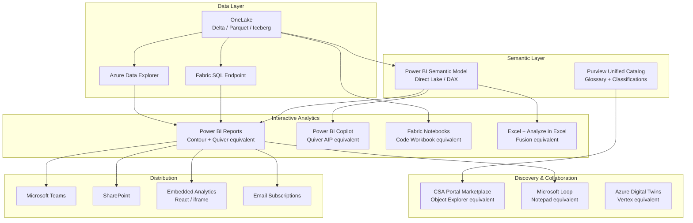

# Analytics Migration: Palantir Foundry to Azure

**A technical guide for migrating Contour, Quiver, Object Explorer, Fusion, Notepad, Code Workbook, and Vertex analytics workloads to Power BI, Microsoft Fabric, and Azure-native services.**

---

## Who this is for

This guide is for data analysts, analytics engineers, BI developers, and platform architects who need to migrate interactive analytics, dashboards, notebooks, and exploratory analysis workloads from Palantir Foundry to Azure. It covers every Foundry analytics surface, provides Azure equivalents with worked examples, and references CSA-in-a-Box accelerators that reduce migration effort.

---

## 1. Overview of the Foundry analytics stack

Palantir Foundry provides a layered analytics surface built on top of its proprietary Ontology and dataset model. Understanding each tool's role is essential to selecting the correct Azure replacement.

| Foundry tool                        | Purpose                             | Operates on        | Key capabilities                                                                                                      |
| ----------------------------------- | ----------------------------------- | ------------------ | --------------------------------------------------------------------------------------------------------------------- |
| **Contour**                         | Point-and-click dataset analysis    | Raw datasets       | Expression boards, filters, joins, aggregations, pivots, board views (table/chart/map), dashboards, scheduled exports |
| **Quiver**                          | Ontology-aware interactive analysis | Ontology objects   | Multi-axis charts, time series, geospatial, link traversal, aggregations, table views, embeddable dashboards          |
| **Quiver AIP**                      | Natural language data analysis      | Ontology objects   | LLM-generated charts, filters, aggregations from plain-English prompts                                                |
| **Object Explorer**                 | Search and browse Ontology objects  | Ontology objects   | Full-text search, faceted filters, bulk actions, drill-down, export                                                   |
| **Insight**                         | Point-and-click modeled analysis    | Ontology objects   | Link traversal, SQL-based aggregations, maps, writeback, dashboards                                                   |
| **Fusion**                          | Spreadsheet analysis                | Datasets / objects | Excel-like interface, formulas, live data connection, writeback                                                       |
| **Notepad**                         | Collaborative documentation         | Mixed              | Rich text, embedded Quiver/Contour visualizations, object references                                                  |
| **Code Workbook / Code Workspaces** | Notebook analysis                   | Datasets           | JupyterLab, RStudio, Python, R, SQL, Spark                                                                            |
| **Vertex**                          | System graph and simulation         | Ontology objects   | Process visualization, network graphs, scenario testing, simulation                                                   |

**Critical distinction:** Contour operates on datasets (tabular files). Quiver, Object Explorer, Insight, and Vertex operate on the Ontology (semantic business objects). This distinction determines the migration path: dataset-oriented tools map to Power BI semantic models, while Ontology-oriented tools require migrating the semantic layer first (see [Ontology Migration](ontology-migration.md)).

---

## 2. Azure analytics stack comparison

The Azure analytics stack replaces Foundry's monolithic toolset with purpose-built services that integrate through shared identity (Entra ID), shared storage (OneLake), and shared governance (Purview).

### Mapping table

| Foundry tool               | Azure equivalent                                              | Migration complexity |
| -------------------------- | ------------------------------------------------------------- | -------------------- |
| Contour                    | Power BI reports with Direct Lake semantic models             | Medium               |
| Quiver                     | Power BI + Fabric Copilot + Fabric Data Agent                 | Medium               |
| Quiver AIP                 | Power BI Copilot (Q&A, natural language) + Fabric Copilot     | Low                  |
| Object Explorer            | Purview Data Catalog + CSA-in-a-Box portal marketplace        | Low                  |
| Insight                    | Power BI with relationships + Fabric SQL endpoint             | Medium               |
| Fusion                     | Excel + Analyze in Excel (live Power BI connection)           | Low                  |
| Notepad                    | Microsoft Loop + OneNote with embedded Power BI visuals       | Low                  |
| Code Workbook / Workspaces | Fabric notebooks (PySpark, Python, R, SQL) + Azure Databricks | Medium               |
| Vertex                     | Azure Digital Twins + Power BI custom visuals                 | High                 |

### Architecture diagram



---

## 3. Contour to Power BI migration

Contour is the most heavily used Foundry analytics tool and the primary migration target. Every Contour concept has a direct Power BI equivalent.

### Feature mapping

| Contour feature                          | Power BI equivalent                                        | Notes                                           |
| ---------------------------------------- | ---------------------------------------------------------- | ----------------------------------------------- |
| Expression board (derived columns)       | DAX calculated columns / measures                          | DAX is more expressive than Contour expressions |
| Board view: table                        | Table visual                                               | Identical capability                            |
| Board view: bar/line/area chart          | Bar/Line/Area chart visuals                                | Power BI offers more chart types                |
| Board view: map                          | Map / ArcGIS / Azure Maps visual                           | Richer geospatial than Contour                  |
| Filters                                  | Report-level / page-level / visual-level filters + slicers | More granular filter control                    |
| Joins                                    | Semantic model relationships (star schema)                 | Define once, use everywhere                     |
| Aggregations                             | DAX measures (SUM, AVERAGE, COUNT, etc.)                   | DAX supports 200+ functions                     |
| Pivot                                    | Matrix visual                                              | Native pivot table with drill-down              |
| Dashboard (text cells + embedded boards) | Power BI dashboard / report pages                          | Richer layout options                           |
| Scheduled export (CSV/Excel)             | Power BI subscriptions + Power Automate exports            | Email delivery or SharePoint write              |

### Worked example: migrating a Contour analysis

**Foundry Contour analysis:** A federal case-management dashboard that joins `cases`, `agents`, and `regions` datasets, creates derived columns for `days_open` and `priority_score`, filters by region, and displays a bar chart of cases by status and a table of top-priority open cases.

**Step 1 -- Ensure Gold-layer tables exist in OneLake.**

The Contour datasets map to Gold-layer Delta tables in the CSA-in-a-Box medallion architecture. Verify that `dim_agent`, `dim_region`, and `fact_case` exist in the Gold lakehouse.

**Step 2 -- Build the semantic model.**

CSA-in-a-Box provides a semantic model template that generates relationships and base measures automatically.

```yaml
# Reference: csa_platform/semantic_model/semantic_model_template.yaml
tables:
    - name: fact_case
      source: Gold.fact_case
      measures:
          - name: Total Cases
            expression: COUNTROWS(fact_case)
          - name: Avg Days Open
            expression: AVERAGE(fact_case[days_open])
          - name: Priority Score
            expression: AVERAGE(fact_case[priority_score])
      columns:
          - name: days_open
            expression: DATEDIFF(fact_case[opened_date], TODAY(), DAY)
            type: calculated
          - name: priority_score
            expression: fact_case[severity] * fact_case[impact_weight]
            type: calculated

    - name: dim_agent
      source: Gold.dim_agent

    - name: dim_region
      source: Gold.dim_region

relationships:
    - from: fact_case.agent_id
      to: dim_agent.agent_id
      cardinality: many-to-one
    - from: fact_case.region_id
      to: dim_region.region_id
      cardinality: many-to-one
```

Generate the semantic model using the CSA-in-a-Box script:

```bash
# Reference: csa_platform/semantic_model/scripts/generate_semantic_model.py
python generate_semantic_model.py \
  --template semantic_model_template.yaml \
  --workspace "Federal Analytics" \
  --dataset "Case Management"
```

**Step 3 -- Build the Power BI report.**

Create a new report connected to the semantic model. Contour board views translate directly:

- **Bar chart of cases by status:** Insert a clustered bar chart visual. Drag `dim_status[status_name]` to the axis and `[Total Cases]` to the values.
- **Table of top-priority open cases:** Insert a table visual. Add `fact_case[case_id]`, `dim_agent[agent_name]`, `[Priority Score]`, `[Avg Days Open]`. Apply a visual-level filter: `fact_case[is_open] = TRUE`. Sort by `[Priority Score]` descending.
- **Region slicer:** Insert a slicer visual bound to `dim_region[region_name]`.

**Step 4 -- Replicate the scheduled export.**

In Power BI Service, create a subscription on the report page. Choose email delivery with an attached Excel file. Set the schedule to match the original Contour export cadence.

### Contour expression to DAX translation

| Contour expression                   | DAX equivalent                                                                            |
| ------------------------------------ | ----------------------------------------------------------------------------------------- |
| `column_a + column_b`                | `fact[column_a] + fact[column_b]`                                                         |
| `if(condition, true_val, false_val)` | `IF(condition, true_val, false_val)`                                                      |
| `date_diff(start, end, "days")`      | `DATEDIFF(fact[start], fact[end], DAY)`                                                   |
| `coalesce(col_a, col_b)`             | `COALESCE(fact[col_a], fact[col_b])`                                                      |
| `string_contains(col, "text")`       | `CONTAINSSTRING(fact[col], "text")`                                                       |
| `round(col, 2)`                      | `ROUND(fact[col], 2)`                                                                     |
| `count_distinct(col)`                | `DISTINCTCOUNT(fact[col])`                                                                |
| `running_sum(col)`                   | `CALCULATE(SUM(fact[col]), FILTER(ALL(dim_date), dim_date[date] <= MAX(dim_date[date])))` |

---

## 4. Quiver to Power BI + Copilot migration

Quiver differs from Contour in one critical way: it operates on the Ontology, not raw datasets. This means Quiver analyses traverse object relationships (links) rather than performing SQL-style joins. The Azure equivalent is Power BI reports built on a semantic model with defined relationships, augmented by Fabric Copilot for AI-assisted exploration.

### Feature mapping

| Quiver feature          | Power BI + Copilot equivalent                | Notes                               |
| ----------------------- | -------------------------------------------- | ----------------------------------- |
| Multi-axis charts       | Combo chart / dual-axis visuals              | Native support for multiple Y-axes  |
| Time series analysis    | Line chart with date hierarchy + forecasting | Built-in AI forecasting visual      |
| Geospatial views        | Map / Filled Map / ArcGIS Maps               | Azure Maps integration available    |
| Link traversal          | Semantic model relationships + drill-through | Star schema replaces link traversal |
| Aggregations on objects | DAX measures over semantic model             | Richer aggregation engine           |
| Table views             | Table / Matrix visuals                       | Conditional formatting, sparklines  |
| Embeddable dashboards   | Embedded Power BI (iframe / JS SDK)          | See section 10 for patterns         |

### Migrating link traversal

Quiver's link traversal (e.g., navigating from a `Case` object to its `Assigned Agent` to the agent's `Region`) is replaced by semantic model relationships and drill-through pages in Power BI.

**Foundry Quiver:** Click on a case row, traverse the `assigned_to` link to see the agent, traverse the `works_in` link to see the region's statistics.

**Power BI equivalent:**

1. Define relationships in the semantic model: `fact_case -> dim_agent -> dim_region` (see section 3).
2. Create a drill-through page for agent details. Right-click a case row to drill through to the agent page.
3. Create a second drill-through page for region details. Drill from agent to region.
4. Add a "Back" button on each drill-through page for navigation.

This replicates Quiver's link traversal without requiring a runtime ontology engine.

### Fabric Data Agent for advanced exploration

For power users who need Quiver's ad-hoc exploration capabilities, Fabric Data Agent provides a conversational interface over the semantic model. Users ask questions in natural language and receive chart or table responses grounded in the underlying data.

```
User: "Show me the top 10 agents by case closure rate in the Northeast region"
Fabric Data Agent: [generates a bar chart from the semantic model]
```

---

## 5. Natural language analytics migration

Quiver AIP allows analysts to generate charts, apply filters, and explore data using plain-English prompts. The Azure equivalent is Power BI Copilot combined with Fabric Copilot.

### Capability comparison

| Quiver AIP capability             | Azure equivalent                      | Service          |
| --------------------------------- | ------------------------------------- | ---------------- |
| Natural language chart generation | Q&A visual + Copilot suggested charts | Power BI Copilot |
| Natural language filters          | Copilot filter suggestions            | Power BI Copilot |
| Prompt-driven aggregations        | Copilot measure generation            | Power BI Copilot |
| Data summarization                | Copilot narrative summaries           | Power BI Copilot |
| Conversational data exploration   | Fabric Data Agent                     | Microsoft Fabric |
| Custom AI analysis prompts        | Fabric notebooks + Azure OpenAI       | Microsoft Fabric |

### Migration approach

**Step 1 -- Enable Power BI Copilot.**

Power BI Copilot is available on Fabric F64+ capacity SKUs. Enable it in the tenant admin settings. Copilot uses the semantic model's metadata (table names, column names, measure descriptions) to ground its responses.

**Step 2 -- Enrich semantic model metadata.**

Copilot quality depends on well-described semantic models. Add descriptions to every table, column, and measure:

```dax
-- In Power BI Desktop, add descriptions via Model View
-- Or programmatically via XMLA endpoint:
-- Table description: "Federal cases with status, priority, and assignment"
-- Column description: "days_open - Number of calendar days since case was opened"
-- Measure description: "Total Cases - Count of all case records in the current filter context"
```

**Step 3 -- Add Q&A synonyms.**

Power BI Q&A uses synonyms to interpret natural language. Add synonyms that match the vocabulary your Quiver AIP users are accustomed to:

| Term in Quiver | Synonym in Power BI Q&A        |
| -------------- | ------------------------------ |
| "objects"      | "records", "rows", "cases"     |
| "link"         | "relationship", "connection"   |
| "property"     | "field", "column", "attribute" |

**Step 4 -- Test with real user prompts.**

Collect the 20 most common Quiver AIP prompts from your analysts. Run each one through Power BI Copilot and Fabric Data Agent. Compare the output. Refine synonyms and descriptions until accuracy is comparable.

---

## 6. Object Explorer to Purview + portal migration

Object Explorer provides a search-and-browse interface over the Foundry Ontology. Users find objects by keyword, filter by properties, drill into object details, perform bulk actions, and export results. The Azure equivalent combines Purview Data Catalog for governance-oriented discovery with the CSA-in-a-Box portal marketplace for user-facing data product browsing.

### Feature mapping

| Object Explorer feature    | Azure equivalent                                   | Notes                                                  |
| -------------------------- | -------------------------------------------------- | ------------------------------------------------------ |
| Full-text object search    | Purview search + portal marketplace search         | Purview indexes metadata; portal indexes data products |
| Faceted property filters   | Purview classification filters                     | Map Ontology properties to Purview classifications     |
| Object detail drill-down   | Purview asset detail page + Power BI drill-through | Asset lineage and schema in Purview                    |
| Bulk actions on objects    | Power Automate flows + Fabric notebooks            | Triggered from portal or scheduled                     |
| Object export (CSV)        | Fabric SQL endpoint + Power BI export              | Export via REST API or UI                              |
| Object bookmarks and lists | Purview collections + portal favorites             | Organize assets by domain                              |

### Purview Data Catalog setup

CSA-in-a-Box includes Purview deployment accelerators that register lakehouse assets automatically:

```python
# Reference: csa_platform/csa_platform/governance/purview/
# The Purview module registers Gold-layer tables as Purview assets,
# applies sensitivity labels, and creates glossary terms from the
# semantic model metadata.
```

### CSA-in-a-Box portal marketplace

The portal marketplace provides a user-friendly data product catalog that replaces Object Explorer's browse-and-discover workflow:

```
# Reference: csa_platform/data_marketplace/
# The marketplace surfaces data products with descriptions, owners,
# quality scores, and access request workflows.

# Reference: portal/react-webapp/src/pages/
# The React portal includes marketplace pages for browsing,
# searching, and requesting access to data products.
```

### Migration approach

1. **Map Ontology object types to Purview glossary terms.** Each Foundry object type becomes a Purview glossary term with properties mapped to term attributes.
2. **Register Gold-layer tables as Purview assets.** Use the CSA-in-a-Box Purview module to auto-register lakehouse tables.
3. **Publish data products to the portal marketplace.** Create data product entries with descriptions, owners, and sample queries.
4. **Redirect Object Explorer users to the portal.** Provide a URL mapping from old Foundry Object Explorer links to new portal marketplace pages.

---

## 7. Spreadsheet and collaborative analysis migration

### Fusion to Excel + Analyze in Excel

Fusion provides a spreadsheet interface connected to Foundry datasets with writeback support. The Azure equivalent is Excel connected to Power BI semantic models via "Analyze in Excel," with writeback through Power Apps or Fabric notebooks.

| Fusion feature          | Azure equivalent                                     | Notes                                 |
| ----------------------- | ---------------------------------------------------- | ------------------------------------- |
| Spreadsheet grid        | Excel                                                | Identical experience                  |
| Live dataset connection | Analyze in Excel (live connection to semantic model) | PivotTable connected to Power BI      |
| Formulas on live data   | Excel formulas + DAX measures                        | Excel formulas work on the PivotTable |
| Writeback to dataset    | Power Apps form + Fabric SQL endpoint                | Separate writeback path required      |
| Sharing / collaboration | Excel in SharePoint / OneDrive + co-authoring        | Real-time co-editing                  |

**Migration steps:**

1. Build the semantic model (see section 3).
2. In Power BI Service, open the semantic model and select "Analyze in Excel."
3. Excel opens with a live PivotTable connected to the semantic model.
4. Analysts build their analysis in Excel using the familiar interface.
5. For writeback, create a Power Apps form or a Fabric notebook that writes to the Silver/Gold layer via the SQL endpoint.

### Notepad to Microsoft Loop + OneNote

Notepad provides collaborative rich-text documents with embedded Quiver and Contour visualizations. Microsoft Loop and OneNote provide the same capability with embedded Power BI visuals.

| Notepad feature                | Azure equivalent                            | Notes                                   |
| ------------------------------ | ------------------------------------------- | --------------------------------------- |
| Rich text editing              | Loop / OneNote                              | Full rich-text editing                  |
| Embedded Contour/Quiver charts | Embedded Power BI visuals                   | Copy visual as image or embed live tile |
| Object references              | Purview asset links + Power BI report links | Hyperlinks to catalog or reports        |
| Collaborative editing          | Loop / OneNote co-authoring                 | Real-time collaboration                 |
| Sharing                        | Loop workspaces / OneNote in Teams          | Integrated with Microsoft 365           |

**Migration steps:**

1. Create a Loop workspace (or OneNote notebook) for the team.
2. For each Notepad document, create a Loop page with the same text content.
3. Replace embedded Contour/Quiver visualizations with Power BI visual embeds. In Power BI, select "Pin to dashboard" and then embed the dashboard tile in Loop via a link or paste the visual as a live component.
4. Replace Foundry object references with hyperlinks to Purview asset pages or Power BI drill-through reports.

---

## 8. Notebook migration

### Code Workbook / Code Workspaces to Fabric notebooks + Databricks

Foundry's Code Workbook provides a notebook interface for Python, R, and SQL analysis over Foundry datasets. Code Workspaces extends this with full JupyterLab and RStudio environments. The Azure equivalents are Fabric notebooks (PySpark, Python, R, SQL) and Azure Databricks notebooks.

### Feature mapping

| Foundry notebook feature  | Azure equivalent                                | Notes                               |
| ------------------------- | ----------------------------------------------- | ----------------------------------- |
| Python notebook cells     | Fabric notebook (Python / PySpark)              | Native PySpark support              |
| R notebook cells          | Fabric notebook (SparkR / R)                    | SparkR for distributed, R for local |
| SQL notebook cells        | Fabric notebook (SQL) + SQL endpoint            | T-SQL and Spark SQL                 |
| JupyterLab environment    | Azure Databricks notebook                       | Full JupyterLab with extensions     |
| RStudio environment       | Databricks RStudio integration                  | Posit Workbench on Databricks       |
| Dataset read/write        | `spark.read.format("delta").load("Tables/...")` | Direct OneLake access               |
| Spark cluster             | Fabric Spark pool / Databricks cluster          | Managed compute                     |
| Scheduling                | Fabric pipeline + notebook activity             | Scheduled or event-triggered        |
| Visualization in notebook | matplotlib, plotly, seaborn (identical)         | Same libraries available            |
| Collaboration             | Fabric notebook sharing + Git integration       | Shared workspaces with RBAC         |

### Migration example: Python analysis notebook

**Foundry Code Workbook:**

```python
# Foundry-specific dataset read
from transforms.api import Input
case_df = Input("/datasets/federal/cases")
agent_df = Input("/datasets/federal/agents")

# Analysis
joined = case_df.join(agent_df, "agent_id")
result = joined.groupBy("region").agg({"priority_score": "avg"})
result.show()
```

**Fabric notebook equivalent:**

```python
# Standard PySpark - no proprietary imports
case_df = spark.read.format("delta").load("Tables/fact_case")
agent_df = spark.read.format("delta").load("Tables/dim_agent")

# Analysis (identical Spark API)
joined = case_df.join(agent_df, "agent_id")
result = joined.groupBy("region").agg({"priority_score": "avg"})
result.show()
```

**Key difference:** The only change is the data access pattern. Foundry uses proprietary `transforms.api` imports. Fabric uses standard PySpark `spark.read` calls. The analysis logic (joins, aggregations, transformations) is identical because both platforms use Apache Spark.

### Migration checklist for notebooks

- [ ] Replace `from transforms.api import Input, Output` with `spark.read.format("delta").load(...)` and `df.write.format("delta").save(...)`
- [ ] Replace Foundry dataset paths (`/datasets/...`) with OneLake paths (`Tables/...` or `abfss://...`)
- [ ] Verify library versions (pandas, numpy, scikit-learn) match between environments
- [ ] Replace Foundry-specific visualization helpers with standard matplotlib/plotly
- [ ] Update scheduling from Foundry pipeline to Fabric pipeline with notebook activity
- [ ] Test with representative data volumes to validate Spark pool sizing

---

## 9. Time series and geospatial migration

### Time series analysis

Foundry provides time series capabilities through Quiver (time series charts), Contour (date-based aggregations), and Code Workbook (Python/R time series libraries). Azure provides a richer time series stack.

| Foundry approach                     | Azure equivalent                                               | When to use                        |
| ------------------------------------ | -------------------------------------------------------------- | ---------------------------------- |
| Quiver time series charts            | Power BI line chart with date hierarchy + AI forecasting       | Standard time series visualization |
| Contour date aggregations            | DAX time intelligence functions (TOTALYTD, SAMEPERIODLASTYEAR) | Period-over-period comparisons     |
| Code Workbook (Prophet, statsmodels) | Fabric notebook (same libraries)                               | Custom forecasting models          |
| Real-time streaming analysis         | Azure Data Explorer (ADX)                                      | High-volume telemetry, IoT, logs   |

**Azure Data Explorer for high-volume time series:**

For workloads that involve millions of time series data points (sensor telemetry, network logs, IoT streams), Azure Data Explorer provides near-real-time ingestion and sub-second query performance. See the [Azure Data Explorer guide](../../guides/azure-data-explorer.md) for CSA-in-a-Box integration patterns.

```kusto
// ADX query: 5-minute average temperature by sensor, last 24 hours
SensorReadings
| where Timestamp > ago(24h)
| summarize AvgTemp = avg(Temperature) by bin(Timestamp, 5m), SensorId
| render timechart
```

### Geospatial analysis

Foundry provides geospatial views in Quiver and Contour (point maps, choropleth maps, heatmaps). Azure provides multiple geospatial options.

| Foundry geospatial feature | Azure equivalent                        | Notes                             |
| -------------------------- | --------------------------------------- | --------------------------------- |
| Point maps                 | Power BI Map visual / Azure Maps visual | Lat/long plotting                 |
| Choropleth maps            | Power BI Filled Map / Shape Map         | State/county/country fills        |
| Heatmaps                   | Power BI Azure Maps heatmap layer       | Density visualization             |
| Geospatial filtering       | Power BI map visual cross-filtering     | Click map to filter other visuals |
| Custom map layers          | Azure Maps custom visual + GeoJSON      | Custom boundaries and overlays    |
| Spatial joins              | Fabric notebook (GeoPandas / Sedona)    | Spatial operations in Spark       |

**Power BI geospatial example:**

1. Add an Azure Maps visual to the Power BI report.
2. Drag `latitude` and `longitude` columns to the location fields.
3. Add a measure (e.g., `[Total Cases]`) to the size field for bubble scaling.
4. Add `dim_region[region_name]` to the legend for color coding.
5. Enable cross-filtering so clicking a map region filters the table and chart visuals.

---

## 10. Dashboard embedding patterns

Both Foundry and Azure support embedding analytics into operational applications. The patterns differ significantly.

### Foundry embedding

In Foundry, Quiver and Contour dashboards are embedded into Workshop and Slate applications using Foundry-specific widget references. The dashboards share the Foundry authentication context and Ontology permissions.

### Azure embedding options

| Embedding pattern          | Use case                              | Authentication                  | Reference                    |
| -------------------------- | ------------------------------------- | ------------------------------- | ---------------------------- |
| Power BI Embedded (iframe) | External-facing portals               | Service principal / embed token | Power BI Embedded REST API   |
| Power BI JavaScript SDK    | React/Angular apps with interactivity | Embed token with RLS            | `powerbi-client` npm package |
| Power BI in Teams          | Internal collaboration                | Entra ID SSO                    | Teams app manifest           |
| Power BI in SharePoint     | Intranet dashboards                   | Entra ID SSO                    | SharePoint web part          |
| Power BI publish to web    | Public dashboards (non-sensitive)     | Anonymous                       | Public embed URL             |

### CSA-in-a-Box portal embedding

The CSA-in-a-Box React portal supports embedded Power BI reports for operational dashboards:

```typescript
// Reference: portal/react-webapp/src/pages/
// The portal uses the Power BI JavaScript SDK to embed reports
// with row-level security (RLS) based on the user's Entra ID claims.

import { PowerBIEmbed } from 'powerbi-client-react';

<PowerBIEmbed
  embedConfig={{
    type: 'report',
    id: reportId,
    embedUrl: embedUrl,
    accessToken: token,
    settings: {
      filterPaneEnabled: false,
      navContentPaneEnabled: true,
    },
  }}
/>
```

### Row-level security mapping

Foundry uses Ontology-level permissions (markings, organizations) to control data access in embedded dashboards. Power BI uses row-level security (RLS) roles defined in the semantic model.

**Migration approach:**

1. Map Foundry markings/organizations to Entra ID security groups.
2. Define RLS roles in the Power BI semantic model using DAX filter expressions.
3. Associate Entra ID groups with RLS roles in Power BI Service.
4. Embedded reports automatically apply RLS based on the authenticated user's group membership.

```dax
-- Example RLS role: Regional Analyst
-- Filters data to the user's assigned region
[region_id] IN
  SELECTCOLUMNS(
    FILTER(
      dim_user_region,
      dim_user_region[user_email] = USERPRINCIPALNAME()
    ),
    "region_id", dim_user_region[region_id]
  )
```

---

## 11. Vertex to Azure Digital Twins migration

Vertex is Foundry's tool for system graphs, process visualization, simulation, and scenario testing. It is the most specialized Foundry analytics tool and the most complex to migrate.

### Azure equivalents

| Vertex feature                | Azure equivalent                            | Notes                                     |
| ----------------------------- | ------------------------------------------- | ----------------------------------------- |
| System graph visualization    | Azure Digital Twins + 3D Scenes Studio      | DTDL models replace Ontology graphs       |
| Process flow visualization    | Power BI custom visuals (Sankey, flow)      | Simpler than Vertex but covers most cases |
| Network graph                 | Power BI Force-Directed Graph custom visual | Community visual from AppSource           |
| Simulation / scenario testing | Azure Digital Twins + Azure Functions       | Event-driven simulation pipeline          |
| What-if analysis              | Power BI what-if parameters + DAX           | Parameter-driven scenario modeling        |

### Migration approach

**For process visualization:** Replace Vertex process graphs with Power BI Sankey diagrams or flow visuals. These cover 80% of process visualization use cases without the complexity of a full graph engine.

**For system-of-systems modeling:** Deploy Azure Digital Twins with DTDL (Digital Twins Definition Language) models. DTDL is an open standard (based on JSON-LD) that replaces the proprietary Foundry Ontology graph. Azure Digital Twins provides:

- Graph-based modeling of physical and logical systems
- Real-time telemetry ingestion from IoT Hub
- Query language for graph traversal
- 3D Scenes Studio for spatial visualization
- Event-driven simulation via Azure Functions

**For simple what-if analysis:** Use Power BI what-if parameters to create slider-driven scenario models without a graph engine:

```dax
-- What-if parameter: Budget Increase Percentage
Budget Increase % = GENERATESERIES(0, 50, 5)

-- Scenario measure
Projected Cases Closed =
  [Current Cases Closed] * (1 + 'Budget Increase %'[Budget Increase % Value] / 100)
```

---

## 12. User experience comparison

This table helps analysts understand what changes and what stays the same.

| Analyst task                     | Foundry experience                                                        | Azure experience                                                                  | Learning curve                |
| -------------------------------- | ------------------------------------------------------------------------- | --------------------------------------------------------------------------------- | ----------------------------- |
| Build a bar chart from a dataset | Open Contour, select dataset, add expression board, choose bar chart view | Open Power BI Desktop, connect to semantic model, drag fields to bar chart visual | Low -- similar drag-and-drop  |
| Ask a question in plain English  | Open Quiver AIP, type prompt, receive chart                               | Open Power BI report, click Copilot icon, type prompt, receive chart              | Low -- nearly identical       |
| Search for a data asset          | Open Object Explorer, type search, browse results                         | Open Purview catalog or portal marketplace, type search, browse results           | Low -- similar search UX      |
| Analyze data in a spreadsheet    | Open Fusion, connect to dataset, use formulas                             | Open Excel, click Analyze in Excel, use PivotTable and formulas                   | Very Low -- Excel is familiar |
| Write a Python analysis notebook | Open Code Workbook, write Python/PySpark code                             | Open Fabric notebook, write Python/PySpark code                                   | Very Low -- same Spark API    |
| Traverse object relationships    | Open Quiver, click object, traverse links                                 | Open Power BI report, use drill-through pages                                     | Medium -- different paradigm  |
| Create a collaborative report    | Open Notepad, embed Quiver/Contour visuals                                | Open Loop, embed Power BI visuals                                                 | Low -- similar concept        |
| Build a system graph             | Open Vertex, model nodes and edges                                        | Deploy Azure Digital Twins, define DTDL models                                    | High -- different platform    |
| Embed a dashboard in an app      | Use Workshop widget reference                                             | Use Power BI JS SDK embed                                                         | Medium -- different API       |
| Schedule a data export           | Contour scheduled export                                                  | Power BI subscription or Power Automate flow                                      | Low -- similar scheduling     |
| Apply row-level security         | Foundry markings / organizations                                          | Power BI RLS roles + Entra ID groups                                              | Medium -- different model     |
| Perform geospatial analysis      | Quiver/Contour map board view                                             | Power BI Azure Maps visual                                                        | Low -- similar interaction    |

---

## 13. Common pitfalls

### Pitfall 1: Ignoring the Ontology dependency

**Problem:** Many Foundry analytics tools (Quiver, Object Explorer, Insight, Vertex) depend on the Ontology. Migrating the analytics layer without first migrating the semantic layer results in broken references and missing relationships.

**Solution:** Complete the semantic layer migration before migrating analytics. See the semantic model template at `csa_platform/semantic_model/semantic_model_template.yaml` and the [Power BI guide](../../guides/power-bi.md) for semantic model best practices.

### Pitfall 2: One-to-one visual replication

**Problem:** Teams attempt to replicate every Contour board and Quiver dashboard pixel-for-pixel, including obsolete or rarely-used analyses.

**Solution:** Audit usage before migrating. Foundry usage analytics (or interviews with analysts) will reveal that 20% of dashboards serve 80% of users. Migrate the high-value dashboards first. Archive the rest and migrate on demand.

### Pitfall 3: Underinvesting in semantic model quality

**Problem:** Power BI Copilot, Q&A, and Analyze in Excel all depend on well-described semantic models. A semantic model with cryptic column names (`col_a`, `fld_03`) produces poor natural language results.

**Solution:** Invest time in naming conventions, column descriptions, measure descriptions, and Q&A synonyms. This is the equivalent of curating the Foundry Ontology -- the effort is similar, but the payoff extends to every downstream consumer.

### Pitfall 4: Forgetting writeback

**Problem:** Fusion and Insight support writeback (analysts editing data that flows back to the source). Power BI semantic models are read-only.

**Solution:** Implement writeback as a separate path using Power Apps forms, Fabric notebooks, or direct SQL endpoint writes. Do not try to force writeback through the BI layer.

### Pitfall 5: Mismatching time series tooling

**Problem:** Teams use Power BI for high-volume streaming time series (millions of events per second) that would be better served by Azure Data Explorer.

**Solution:** Route high-volume time series data to Azure Data Explorer. Use ADX dashboards or Power BI with ADX as a DirectQuery source for visualization. Reserve Power BI Direct Lake for batch-oriented analytical workloads.

### Pitfall 6: Skipping Copilot metadata preparation

**Problem:** Teams enable Power BI Copilot without preparing the semantic model metadata, then conclude that Copilot is inferior to Quiver AIP.

**Solution:** Copilot accuracy is directly proportional to metadata quality. Add descriptions to every table, column, and measure. Add Q&A synonyms. Test with real user prompts before declaring the migration complete.

### Pitfall 7: Neglecting row-level security migration

**Problem:** Foundry's marking-based security is implicit (applied at the Ontology layer). Teams forget to replicate this in Power BI, resulting in either over-permissioned reports or broken access.

**Solution:** Map every Foundry marking and organization to an Entra ID group. Define corresponding RLS roles in the semantic model. Test with users from different groups before go-live.

### Pitfall 8: Over-engineering the Vertex replacement

**Problem:** Teams deploy Azure Digital Twins for simple process flow visualizations that could be handled by a Power BI Sankey diagram.

**Solution:** Evaluate the actual complexity of each Vertex use case. Only deploy Azure Digital Twins for true system-of-systems modeling with graph traversal, simulation, and IoT telemetry. Use Power BI custom visuals for simpler graph and flow visualizations.

---

## Next steps

1. **Assess your Foundry analytics inventory.** Catalog every Contour analysis, Quiver dashboard, notebook, and Fusion spreadsheet. Record ownership, usage frequency, and data dependencies.
2. **Complete the semantic layer migration.** Build the Power BI semantic model using the CSA-in-a-Box template before migrating any analytics surfaces.
3. **Migrate high-value dashboards first.** Start with the 10 most-used Contour/Quiver dashboards. Validate with analysts before proceeding.
4. **Enable and tune Copilot.** Enrich semantic model metadata, add Q&A synonyms, and test with real prompts.
5. **Migrate notebooks.** Replace Foundry-specific imports with standard PySpark calls. This is typically the lowest-effort migration.
6. **Address edge cases.** Migrate Vertex, Fusion writeback, and custom embedding patterns last.

For the overall migration plan, see the [Migration Playbook](../palantir-foundry.md). For semantic model details, see the [Power BI guide](../../guides/power-bi.md). For data integration patterns, see [Data Integration Migration](data-integration-migration.md).
