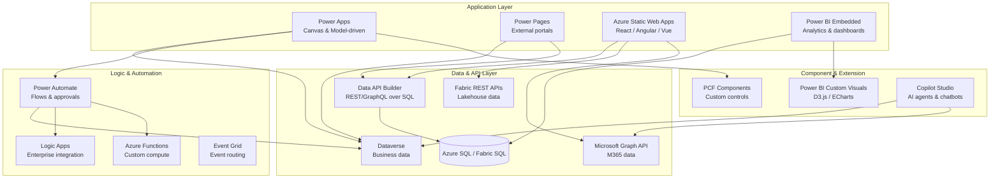

# Application Migration: Palantir Foundry to Azure

**A technical deep-dive for application developers, UX architects, and platform engineers migrating Foundry's application building stack to Azure-native services.**

---

## Executive summary

Palantir Foundry provides a vertically integrated application building stack: Workshop for low-code operational apps, Slate for custom HTML/CSS/JS applications, OSDK for external integrations, and Object Views for embedded object detail displays. All of these tools are tightly coupled to the Foundry Ontology — they query object types, traverse link types, and execute Actions defined in the Ontology layer.

Azure provides a broader, more modular application ecosystem: Power Apps for low-code operational apps, Power Pages for external-facing portals, Azure Static Web Apps for custom React/Angular/Vue applications, Power BI Embedded for analytics, PCF (Power Apps Component Framework) for custom components, and a rich set of REST APIs (Microsoft Graph, Fabric REST, Data API Builder) for external integrations. These tools connect to Dataverse, SQL databases, SharePoint, Fabric lakehouses, and hundreds of other data sources through standard connectors.

This guide provides the detailed mapping, migration patterns, and practical guidance for moving every Foundry application capability to its Azure equivalent.

---

## 1. Foundry application building stack overview

Foundry's application layer consists of six primary tools, all built on top of the Ontology:

| Tool | Purpose | Complexity | Ontology coupling |
|---|---|---|---|
| **Workshop** | Low-code operational apps with 60+ widgets | Low-Medium | Direct — widgets bind to object types and actions |
| **Slate** | Custom HTML/CSS/JS apps with drag-and-drop | Medium-High | API-based — uses Ontology API calls |
| **Object Views** | Embedded UI components for individual objects | Low | Direct — displays object properties and links |
| **OSDK** | Auto-generated TypeScript/Python/Java SDKs | Medium | Deep — SDK mirrors Ontology schema |
| **Custom Workshop Widgets** | React-based OSDK widgets or iframe-hosted apps | High | SDK-based — uses OSDK for data access |
| **Pilot** | AI-generated apps from natural language | Low | Generates Ontology entities and React+OSDK code |
| **Marketplace** | Packaged products (pipelines, Ontology, apps) | Low | Bundles Ontology entities with applications |
| **Consumer Mode** | External-facing apps without full permissions | Low | Limited Ontology access via scoped tokens |

**Key architectural principle:** In Foundry, the Ontology is the single data access layer for all applications. Widgets do not query databases — they query object types. Buttons do not call APIs — they execute Actions. This tight coupling is both Foundry's strength (consistent data access) and its primary lock-in mechanism (nothing works without the Ontology).

---

## 2. Azure application building stack

Azure's application ecosystem is modular. Applications connect to data through connectors, APIs, and direct database access rather than a single proprietary layer.



### CSA-in-a-Box evidence paths

CSA-in-a-Box provides working implementations for many of these components:

| Component | Evidence path | Description |
|---|---|---|
| Power Apps | `portal/powerapps/` | Canvas app for data source management |
| Power Automate flows | `portal/powerapps/flows/` | Five production flows: register-source, approve-access, trigger-pipeline, send-notification, quality-check |
| Logic Apps | `portal/powerapps/logic-apps/` | Enterprise integration workflows |
| React portal | `portal/react-webapp/src/` | Full Next.js application with DataTable, Modal, StatusBadge, Toast, and registration wizard components |
| Data marketplace | `csa_platform/data_marketplace/` | Data product catalog with contract validation, Purview sync, and notifications |
| Data API Builder | `docs/tutorials/11-data-api-builder/` | Tutorial for exposing SQL data as REST/GraphQL endpoints |

---

## 3. Workshop to Power Apps migration

Workshop is Foundry's flagship application builder. It provides 60+ widgets, an event/action system, variables for state management, and direct Ontology binding. The Azure migration target depends on the app type:

| Workshop app type | Primary Azure target | Secondary target |
|---|---|---|
| Operational workflow (task management, approvals) | Power Apps canvas app + Power Automate | Model-driven app + Dataverse |
| Dashboard / COP display | Power BI Embedded + Power Apps | Power BI report with bookmarks |
| Data entry / forms | Power Apps canvas app | Power Pages (if external) |
| Map-centric operations | Power BI + Azure Maps visual | Custom React app + Azure Maps SDK |
| Object detail / drill-down | Power Apps model-driven app | Power BI drill-through pages |

### 3.1. Workshop widget mapping table

This is the comprehensive mapping of Workshop widgets to their Azure equivalents.

#### Data display widgets

| Workshop widget | Power Apps equivalent | Power BI equivalent | Notes |
|---|---|---|---|
| **Object Table** | Gallery control + DataTable control | Table visual / Matrix visual | Power Apps Gallery is more flexible; DataTable is closer to Workshop's table |
| **Object List** | Gallery control (vertical layout) | Table visual (single column) | Gallery supports custom templates per row |
| **Property Value** | Label + data binding | Card visual / KPI visual | Direct property display |
| **Metric** | Label with formatting | KPI visual / Card visual | Power BI cards are richer for single-metric display |
| **Status Indicator** | Icon + conditional formatting | Conditional formatting on visuals | Use `If()` functions for icon selection in Power Apps |
| **Resource List** | Gallery with nested gallery | Decomposition tree | For hierarchical resource displays |
| **Details Panel** | Form control (display mode) | Tooltip pages | Power Apps forms natively show record details |
| **Object Set Widget** | Collection variable + Gallery | Dataset / Filter context | Power Apps collections serve as in-memory object sets |

#### Chart and visualization widgets

| Workshop widget | Power Apps equivalent | Power BI equivalent | Notes |
|---|---|---|---|
| **Bar Chart** | Power BI Embedded tile | Bar chart visual | Power BI is the primary charting target |
| **Line Chart** | Power BI Embedded tile | Line chart visual | Power BI supports trend lines, forecasting |
| **Pie Chart** | Power BI Embedded tile | Pie / Donut chart visual | Power BI donut chart is a modern alternative |
| **Scatter Plot** | Power BI Embedded tile | Scatter chart visual | Power BI supports play axis for animation |
| **Histogram** | Power BI Embedded tile | Histogram visual (custom) | Use R/Python visual or custom visual from AppSource |
| **Timeline** | Power BI Embedded tile | Timeline slicer (custom visual) | Install from AppSource marketplace |
| **Vega / Vega-Lite** | Power BI custom visual (Deneb) | Deneb visual (Vega/Vega-Lite) | Deneb is a direct Vega-Lite renderer for Power BI |
| **KPI** | Label with formatting | KPI visual | Power BI KPI supports trend indicators |
| **Gauge** | Power BI Embedded tile | Gauge visual | Power BI gauge supports min/max/target |

#### Map widgets

| Workshop widget | Power Apps equivalent | Power BI equivalent | Notes |
|---|---|---|---|
| **Map (points)** | Map control (preview) | Azure Maps Power BI visual | Azure Maps visual supports clustering, layers |
| **Map (shapes)** | Custom PCF component | Shape Map visual / Azure Maps | Shape Map for choropleth; Azure Maps for complex |
| **Map (routes)** | Custom PCF with Azure Maps SDK | Azure Maps visual with route layer | Requires Azure Maps account and API key |
| **Map (heatmap)** | Custom PCF component | Azure Maps Power BI visual (heat layer) | Azure Maps visual supports heat map layer |

See [Section 7](#7-map-widgets-to-azure-maps-power-bi) for detailed map migration patterns.

#### Form and input widgets

| Workshop widget | Power Apps equivalent | Power BI equivalent | Notes |
|---|---|---|---|
| **Text Input** | Text input control | N/A (use Power Apps for input) | Power BI is read-only; forms require Power Apps |
| **Dropdown** | Dropdown / Combo box control | Slicer visual | Slicers filter; dropdowns collect input |
| **Date Picker** | Date picker control | Date slicer | Power Apps for input; Power BI for filtering |
| **Checkbox** | Checkbox / Toggle control | N/A | Input control — Power Apps only |
| **Radio Buttons** | Radio control | N/A | Input control — Power Apps only |
| **Slider** | Slider control | Numeric range slicer | Power Apps for input; Power BI for filtering |
| **File Upload** | Attachment control | N/A | Power Apps supports attachments to Dataverse |
| **Rich Text Editor** | Rich text editor control | N/A | Available in Power Apps canvas apps |
| **Multi-select** | Combo box (multi-select) | Multi-select slicer | Power Apps for input; Power BI for filtering |

#### Layout and container widgets

| Workshop widget | Power Apps equivalent | Power BI equivalent | Notes |
|---|---|---|---|
| **Tabs** | Tab list control / Screen navigation | Bookmarks + buttons | Power BI bookmarks simulate tabs |
| **Section** | Container / Group container | Visual group | Containers in Power Apps; groups in Power BI |
| **Collapsible Section** | Container with visibility toggle | Bookmarks | Use `Visible` property with toggle variable |
| **Modal / Dialog** | Overlay container + visibility toggle | N/A | Power Apps pattern: container with `Visible=varShowModal` |
| **Split Pane** | Container with responsive layout | N/A | Use containers with percentage widths |

#### Action and navigation widgets

| Workshop widget | Power Apps equivalent | Power BI equivalent | Notes |
|---|---|---|---|
| **Button** | Button control | Button visual | Power Apps buttons trigger flows; Power BI buttons navigate |
| **Action Button** | Button + Power Automate flow | N/A | See [Section 6](#6-action-buttons-to-power-automate-flows) |
| **Link** | Button / Label with `Launch()` | Button with URL action | `Launch()` opens URLs in Power Apps |
| **Navigation** | Navigate() function | Page navigation / Drillthrough | Multi-screen navigation in Power Apps |
| **Toast / Notification** | Notify() function | N/A | `Notify("Message", NotificationType.Success)` |

#### Media and embed widgets

| Workshop widget | Power Apps equivalent | Power BI equivalent | Notes |
|---|---|---|---|
| **Image** | Image control | Image visual | Both support URLs and base64 |
| **HTML Viewer** | HTML text control | N/A | Power Apps HTML text control renders HTML |
| **IFrame** | N/A (security restricted) | N/A | Use Power Pages for iframe embedding |
| **Video** | Video control | N/A | Power Apps supports MP4 and stream URLs |
| **PDF Viewer** | PDF viewer control | N/A | Power Apps has a native PDF viewer |

### 3.2. Workshop events and actions to Power Apps + Power Automate

Workshop uses an event-action model: user interactions fire events, which trigger actions (navigate, set variable, execute Ontology Action, open panel). Power Apps uses a similar but differently structured model:

| Workshop concept | Power Apps equivalent | Example |
|---|---|---|
| Event (on click, on change) | `OnSelect`, `OnChange` properties | `Button.OnSelect = Set(varStatus, "active")` |
| Variable (local) | `Set()` / `UpdateContext()` | `Set(varSelectedId, ThisItem.Id)` |
| Variable (shared across widgets) | Global variable with `Set()` | Variables are global by default in canvas apps |
| Action: Set Variable | `Set()` or `UpdateContext()` | `Set(varFilter, Dropdown1.Selected.Value)` |
| Action: Navigate | `Navigate()` function | `Navigate(DetailScreen, ScreenTransition.Fade)` |
| Action: Execute Ontology Action | Power Automate flow (`.Run()`) | `RegisterSource.Run(varSourceName, varType)` |
| Action: Open Panel | Overlay container + `Set(varShowPanel, true)` | Toggle container visibility |
| Action: Show Toast | `Notify()` function | `Notify("Saved successfully", NotificationType.Success)` |
| Action: Refresh Data | `Refresh()` function | `Refresh(DataSource)` |
| Action: Download File | `Download()` function | `Download(fileUrl)` |

### 3.3. Workshop theming to Power Apps theming

Workshop supports application-level theming (colors, fonts, spacing). Power Apps provides equivalent capabilities:

- **Theme JSON:** Power Apps canvas apps accept a `Theme` JSON object that controls colors, fonts, and control styling globally
- **Component libraries:** Create reusable styled components shared across apps
- **Fluent UI:** Model-driven apps automatically use Microsoft Fluent UI design language
- **CSS in Power Pages:** Full CSS control for external-facing applications

CSA-in-a-Box evidence: The React portal at `portal/react-webapp/src/` demonstrates a consistent component library approach with reusable components (`Card.tsx`, `Button.tsx`, `StatusBadge.tsx`, `Modal.tsx`) that apply consistent styling.

---

## 4. Slate to Power Pages / React migration

Slate is Foundry's custom application framework for developers who need more control than Workshop provides. Slate apps use HTML, CSS, and JavaScript with drag-and-drop widget placement and direct Ontology API access.

### 4.1. Migration target selection

| Slate app characteristic | Recommended Azure target | Rationale |
|---|---|---|
| Internal app, standard UI patterns | Power Apps canvas app | Faster development, less maintenance |
| External / public-facing app | Power Pages | Built-in authentication (Azure AD B2C), responsive templates |
| Complex custom interactions, D3.js, Three.js | Azure Static Web Apps (React) | Full JavaScript control, custom rendering |
| Real-time data visualization | Azure Static Web Apps + SignalR | WebSocket support for live updates |
| Hybrid: standard layout + custom widgets | Power Apps + PCF components | PCF provides React-based custom controls inside Power Apps |

### 4.2. Slate JavaScript to Azure equivalents

Slate apps embed JavaScript that calls Foundry's Ontology API. The following table maps common Slate API patterns to Azure equivalents:

| Slate API pattern | Azure equivalent | Implementation |
|---|---|---|
| `OntologyService.getObjects(objectType, filters)` | Dataverse Web API / Data API Builder | `fetch('/api/rest/Incidents?$filter=status eq "open"')` |
| `OntologyService.getObject(objectType, primaryKey)` | Dataverse Web API (single record) | `fetch('/api/rest/Incidents/INC-001')` |
| `OntologyService.getLinkedObjects(object, linkType)` | Dataverse relationship navigation | `fetch('/api/rest/Incidents/INC-001/assignments')` |
| `OntologyService.executeAction(actionName, params)` | Power Automate HTTP trigger / Azure Function | `fetch('/api/actions/escalate', { method: 'POST', body })` |
| `OntologyService.aggregateObjects(objectType, groupBy, metrics)` | Fabric REST API / SQL query via Data API Builder | `fetch('/api/graphql', { body: aggregationQuery })` |
| `OntologyService.subscribeToChanges(objectType)` | Azure SignalR Service + Event Grid | WebSocket connection for real-time updates |

### 4.3. Slate drag-and-drop widgets to React components

Slate's widget library provides pre-built UI elements. CSA-in-a-Box's React portal demonstrates equivalent implementations:

| Slate widget | React equivalent (CSA-in-a-Box) | File path |
|---|---|---|
| Table widget | `DataTable` component | `portal/react-webapp/src/components/DataTable.tsx` |
| Modal / Dialog | `Modal` component | `portal/react-webapp/src/components/Modal.tsx` |
| Status badges | `StatusBadge` component | `portal/react-webapp/src/components/StatusBadge.tsx` |
| Page header | `PageHeader` component | `portal/react-webapp/src/components/PageHeader.tsx` |
| Card layout | `Card` component | `portal/react-webapp/src/components/Card.tsx` |
| Button | `Button` component | `portal/react-webapp/src/components/Button.tsx` |
| Error display | `ErrorBanner` component | `portal/react-webapp/src/components/ErrorBanner.tsx` |
| Toast / notification | `Toast` + `useToast` hook | `portal/react-webapp/src/components/Toast.tsx` |
| Activity feed | `ActivityFeed` component | `portal/react-webapp/src/components/ActivityFeed.tsx` |
| Empty state placeholder | `EmptyState` component | `portal/react-webapp/src/components/EmptyState.tsx` |
| Breadcrumb navigation | `Breadcrumbs` component | `portal/react-webapp/src/components/Breadcrumbs.tsx` |
| Sidebar navigation | `Sidebar` component | `portal/react-webapp/src/components/Sidebar.tsx` |

### 4.4. Deployment model

| Slate deployment | Azure equivalent | Benefits |
|---|---|---|
| Foundry-hosted (internal) | Azure Static Web Apps | Global CDN, staging environments, GitHub Actions CI/CD |
| Foundry-hosted (public via Consumer Mode) | Power Pages or Azure Static Web Apps + Azure AD B2C | Built-in external identity management |
| Custom domain | Azure Front Door + Static Web Apps | Custom domains, WAF, DDoS protection |

---

## 5. OSDK to Microsoft APIs migration

OSDK (Ontology SDK) auto-generates typed SDKs in TypeScript, Python, and Java that mirror the Foundry Ontology. External applications use OSDK to query objects, traverse links, execute actions, and subscribe to real-time updates. Azure does not have a single equivalent — the replacement depends on the data source and use case.

### 5.1. API mapping

| OSDK capability | Azure equivalent | When to use |
|---|---|---|
| Query object types | **Data API Builder** (REST/GraphQL over SQL) | When data lives in Azure SQL or Fabric SQL endpoint |
| Query object types | **Microsoft Graph API** | When data lives in Microsoft 365 (SharePoint, Teams, Planner) |
| Query object types | **Dataverse Web API** | When data lives in Dataverse (Power Platform) |
| Query object types | **Fabric REST API** | When data lives in Fabric Lakehouse / Warehouse |
| Traverse link types | Data API Builder relationship navigation | GraphQL nested queries for related entities |
| Execute actions | Power Automate HTTP trigger | Trigger business logic flows from external apps |
| Execute actions | Azure Functions HTTP trigger | Custom compute for complex operations |
| Real-time subscriptions | Azure SignalR Service | WebSocket-based real-time data streaming |
| Real-time subscriptions | Event Grid + WebHooks | Event-driven notifications for data changes |
| Batch operations | Data API Builder batch endpoints | Multiple operations in a single HTTP request |
| OpenAPI spec | Data API Builder auto-generated OpenAPI | Automatic OpenAPI documentation for all endpoints |

### 5.2. Data API Builder as OSDK replacement

Data API Builder (DAB) is the closest Azure equivalent to OSDK for database-backed applications. It auto-generates REST and GraphQL APIs from Azure SQL, PostgreSQL, MySQL, or Cosmos DB schemas.

CSA-in-a-Box evidence: See `docs/tutorials/11-data-api-builder/` for a complete tutorial on setting up DAB for a data product catalog.

**Key similarities to OSDK:**

- Auto-generated typed API from database schema (like OSDK from Ontology)
- REST and GraphQL endpoints (OSDK provides REST and generated SDKs)
- Relationship navigation (OSDK provides link traversal)
- Filtering, sorting, pagination built in
- Azure AD authentication integrated

**Key differences from OSDK:**

- DAB does not auto-generate client SDKs — use OpenAPI codegen or `@azure/data-api-builder-client` for typed access
- DAB operates on relational schemas, not ontology object types
- DAB does not provide real-time subscriptions — pair with SignalR for that
- DAB does not have a built-in action framework — pair with Power Automate or Azure Functions

### 5.3. Migration pattern for OSDK-consuming applications

```
Step 1: Inventory OSDK usage
  - List all external apps consuming OSDK
  - For each app, catalog: object types queried, links traversed,
    actions executed, subscriptions used

Step 2: Map data sources
  - For each object type, identify the Azure data source
    (Dataverse, Azure SQL, Fabric SQL endpoint, SharePoint)
  - Design the API layer (DAB for SQL, Graph for M365, Dataverse API for Power Platform)

Step 3: Set up Data API Builder
  - Define entity mappings in dab-config.json
  - Configure relationships for link traversal
  - Set up Azure AD authentication
  - Deploy to Azure App Service or Container Apps

Step 4: Refactor client code
  - Replace OSDK imports with fetch/axios calls to DAB endpoints
  - Replace OSDK type imports with generated TypeScript types from OpenAPI
  - Replace OSDK action calls with Power Automate HTTP triggers
  - Replace OSDK subscriptions with SignalR connections

Step 5: Test and validate
  - Verify all queries return equivalent data
  - Validate action execution through Power Automate
  - Load test API endpoints
```

---

## 6. Action buttons to Power Automate flows

Foundry Actions are the write-side of the Ontology: they modify object properties, create/delete objects, and trigger side effects. Workshop Action Buttons execute these Actions. In Azure, Power Automate flows provide equivalent write-side automation.

### 6.1. Action type mapping

| Foundry Action type | Power Automate equivalent | Implementation |
|---|---|---|
| Modify object properties | Update row (Dataverse) / Update record (SQL) | Standard connector action |
| Create object | Add row (Dataverse) / Insert record (SQL) | Standard connector action |
| Delete object | Delete row (Dataverse) / Delete record (SQL) | Standard connector action |
| Batch modify | Apply to each + Update row | Loop over collection |
| Trigger notification | Send email (Outlook) / Post message (Teams) | Standard connector action |
| Call external API | HTTP action / Custom connector | HTTP action with authentication |
| Run computation | Azure Functions action | Trigger serverless function |
| Approval workflow | Approvals connector | Start and wait for an approval |

### 6.2. CSA-in-a-Box flow examples

The `portal/powerapps/flows/` directory contains five production Power Automate flows that demonstrate the Action Button replacement pattern:

| Flow | Foundry equivalent | Purpose |
|---|---|---|
| `register-source.json` | Action: Register Data Source | Creates a new data source record, triggers metadata scan, notifies data steward |
| `approve-access.json` | Action: Approve Access Request | Approval workflow with Teams notification, Dataverse status update |
| `trigger-pipeline.json` | Action: Run Pipeline | Triggers ADF pipeline execution, monitors status, sends completion notification |
| `send-notification.json` | Action: Notify Users | Multi-channel notification (email, Teams, push) based on user preferences |
| `quality-check.json` | Action: Run Quality Check | Executes data quality rules, records results, alerts on failures |

### 6.3. Connecting Power Apps buttons to Power Automate flows

In Power Apps, Action Buttons become Button controls with `OnSelect` properties that call Power Automate flows:

```
// Workshop: Action Button executes "EscalateIncident" action
// Power Apps equivalent:
Button.OnSelect = 
    Set(varLoading, true);
    EscalateIncidentFlow.Run(
        Gallery1.Selected.IncidentId,
        User().Email,
        TextInput_Reason.Text
    );
    Notify("Incident escalated successfully", NotificationType.Success);
    Refresh(Incidents);
    Set(varLoading, false)
```

**Pattern:** Every Foundry Action becomes a Power Automate flow. The flow is added as a data source in Power Apps, and buttons call `FlowName.Run(parameters)`.

---

## 7. Map widgets to Azure Maps + Power BI

Workshop and Slate both offer map widgets that display geospatial data from the Ontology. Azure provides two primary mapping options: Azure Maps (interactive SDK) and the Azure Maps Power BI visual (embedded analytics).

### 7.1. Map capability mapping

| Foundry map capability | Azure Maps Power BI visual | Azure Maps SDK (React) | Best for |
|---|---|---|---|
| Point markers | Bubble layer / Symbol layer | HtmlMarker / SymbolLayer | Both work; Power BI for analytics, SDK for apps |
| Clustering | Cluster aggregation | ClusterLayer | Both support clustering |
| Choropleth / filled shapes | Filled map visual | PolygonLayer | Power BI for static; SDK for interactive |
| Heatmap | Heat map layer | HeatMapLayer | Both equivalent |
| Route / path display | Not supported | RouteLayer via REST API | SDK only — requires Azure Maps Route service |
| Real-time movement | Not supported | HtmlMarker with position updates | SDK only — use with SignalR for live tracking |
| Drawing tools | Not supported | DrawingManager | SDK only — for user-drawn areas |
| Indoor maps | Not supported | Indoor Maps module | SDK only — for facility management |
| 3D buildings | Not supported | 3D extrusion | SDK only |
| Popups on click | Tooltip | Popup class | Power BI uses tooltips; SDK uses full popups |

### 7.2. Migration decision

- **If the map is primarily for data visualization** (colored markers, regional analysis, dashboards): use the **Azure Maps Power BI visual** embedded in a Power BI report. This provides filtering, cross-highlighting, and drill-through with no custom code.
- **If the map requires interactivity** (drawing boundaries, route planning, real-time tracking, indoor mapping): build a **custom React component** using the Azure Maps SDK and host it in Azure Static Web Apps or embed it as a PCF component.
- **If the map is in a Power Apps canvas app**: use the Power Apps **Map control** (preview) for simple point displays, or embed a Power BI visual for analytical maps.

### 7.3. Azure Maps implementation in React

```typescript
// Example: Azure Maps in a React component (CSA-in-a-Box pattern)
import { AzureMap, AzureMapDataSourceProvider, 
         AzureMapLayerProvider } from 'react-azure-maps';

const IncidentMap = ({ incidents }) => (
  <AzureMap
    options={{
      authOptions: { authType: 'subscriptionKey', subscriptionKey: process.env.AZURE_MAPS_KEY },
      center: [-77.0369, 38.9072],  // Washington DC
      zoom: 10
    }}
  >
    <AzureMapDataSourceProvider id="incidents">
      {incidents.map(inc => (
        <AzureMapFeature
          key={inc.id}
          type="Point"
          coordinate={[inc.longitude, inc.latitude]}
          properties={{ title: inc.title, severity: inc.severity }}
        />
      ))}
    </AzureMapDataSourceProvider>
    <AzureMapLayerProvider
      type="BubbleLayer"
      options={{
        color: ['match', ['get', 'severity'], 'high', 'red', 'medium', 'orange', 'green'],
        radius: 8
      }}
    />
  </AzureMap>
);
```

---

## 8. Form patterns migration

Workshop forms collect user input and execute Actions to write data. Power Apps canvas apps provide equivalent form patterns with richer validation and layout options.

### 8.1. Form pattern mapping

| Workshop form pattern | Power Apps equivalent | Implementation notes |
|---|---|---|
| Single-object edit form | Edit form control bound to Dataverse | `Form.Mode = FormMode.Edit; SubmitForm(Form1)` |
| Multi-step wizard | Multi-screen app with navigation | Each step is a screen; use variables to track progress |
| Inline table editing | Gallery with edit controls | Editable text inputs inside Gallery items |
| Bulk data entry | Gallery + collection + batch submit | Collect into collection, then `ForAll(Patch())` |
| Conditional field visibility | `Visible` property with conditions | `Visible = If(Dropdown1.Selected.Value = "Other", true, false)` |
| Cascading dropdowns | `Filter()` on dependent dropdown items | `Items = Filter(Cities, State = Dropdown_State.Selected.Value)` |
| File attachment | Attachment control + SharePoint/Blob | Attachments stored in Dataverse or SharePoint |
| Validation rules | Form validation properties + `IsMatch()` | `If(IsBlank(TextInput1.Text), Notify("Required"))` |
| Submission confirmation | `Notify()` + navigation | `SubmitForm(Form1); Notify("Saved"); Navigate(ListScreen)` |

### 8.2. CSA-in-a-Box registration wizard pattern

The React portal at `portal/react-webapp/src/components/register/` implements a multi-step registration wizard that demonstrates the equivalent of a Workshop multi-step form:

| Step | Component | Purpose |
|---|---|---|
| 1. Source Type | `StepSourceType.tsx` | Select data source type (dropdown equivalent) |
| 2. Connection | `StepConnection.tsx` | Enter connection details (form inputs) |
| 3. Schema | `StepSchema.tsx` | Review and configure schema (table display) |
| 4. Ingestion | `StepIngestion.tsx` | Configure ingestion schedule (options) |
| 5. Owner | `StepOwner.tsx` | Assign data steward (lookup) |
| 6. Quality | `StepQuality.tsx` | Define quality rules (rule builder) |
| 7. Review | `StepReview.tsx` | Review and submit (summary + action button) |

This pattern maps directly to a Power Apps multi-screen wizard or a Workshop multi-step form.

### 8.3. Validation patterns

| Workshop validation | Power Apps equivalent |
|---|---|
| Required field | `Required` property on form control; `IsBlank()` check |
| Regex validation | `IsMatch(TextInput.Text, "^[A-Z]{3}-\d{4}$")` |
| Range validation | `If(Value(TextInput.Text) < 1 Or Value(TextInput.Text) > 100, ...)` |
| Cross-field validation | Custom logic in `OnSelect` before `SubmitForm()` |
| Server-side validation | Power Automate flow returns validation errors |
| Submission rules | Business rules in Dataverse (model-driven) or flow logic |

---

## 9. External and public-facing apps

Foundry's Consumer Mode allows external users (citizens, partners, vendors) to access Ontology-backed applications without full Foundry permissions. Azure provides two primary options for external-facing applications.

### 9.1. Power Pages (recommended for most cases)

Power Pages (formerly Power Apps Portals) is purpose-built for external-facing web applications:

| Capability | Power Pages | Consumer Mode (Foundry) |
|---|---|---|
| External identity | Azure AD B2C, social logins, local accounts | Foundry external identity (limited) |
| Responsive design | Built-in responsive templates | Workshop layouts (less responsive) |
| Content management | Built-in CMS with Liquid templates | No CMS capability |
| Data access | Dataverse (table permissions per role) | Ontology (scoped object access) |
| Custom code | JavaScript, Liquid, CSS | Workshop widgets (limited) |
| Forms | Entity forms, multi-step forms | Workshop forms |
| Lists | Entity lists with search, filter, sort | Object Table widget |
| Authentication | Configurable per page/section | Token-based scoping |
| SEO | Server-rendered, indexable | Not indexable (SPA) |
| Performance | CDN, server-rendered | Client-side rendering |

### 9.2. Azure Static Web Apps + Azure AD B2C (for custom apps)

For applications requiring full UI customization:

| Component | Purpose |
|---|---|
| Azure Static Web Apps | Hosts React/Angular/Vue SPA with global CDN |
| Azure AD B2C | External identity (email, social, SAML federation) |
| Data API Builder | REST/GraphQL access to Azure SQL backend |
| Azure Functions | Custom business logic and API endpoints |
| Azure Front Door | WAF, DDoS protection, custom domains |

### 9.3. Migration decision

- **Standard portal** (forms, lists, knowledge base, self-service): **Power Pages** — faster development, built-in authentication, content management
- **Custom interactive app** (real-time dashboards, mapping, complex workflows): **Azure Static Web Apps** with React — full control, custom UI
- **Hybrid**: Power Pages for the portal shell + embedded Power BI visuals or Azure Maps for specialized components

---

## 10. AI-assisted app building

Foundry Pilot generates complete applications from natural language prompts. It creates Ontology entities (object types, link types, actions), a React+OSDK frontend, seed data, and deployment configuration. Azure provides multiple AI-assisted development tools.

### 10.1. AI app building comparison

| Capability | Foundry Pilot | Azure equivalent | Maturity |
|---|---|---|---|
| Generate app from prompt | Full app generation (Ontology + frontend + data) | **Copilot in Power Apps** — generates canvas app from description | GA |
| Generate data model | Creates object types and link types | **Copilot in Dataverse** — suggests tables and columns | GA |
| Generate UI components | React + OSDK code | **Copilot in Power Apps** — generates screens and controls | GA |
| Generate automation | Creates Actions | **Copilot in Power Automate** — generates flows from description | GA |
| Generate AI agents | AIP Chatbot Studio | **Copilot Studio** — creates agents from description | GA |
| Code generation | React + TypeScript | **GitHub Copilot** — inline code suggestions in VS Code | GA |
| Full-stack generation | End-to-end (unique to Pilot) | Combination of Copilot tools (less integrated) | Partial |

### 10.2. Key difference

Foundry Pilot generates a complete vertical slice (data model + API + frontend) in a single prompt. Azure's approach is modular: Copilot in Power Apps generates the app, Copilot in Dataverse generates the schema, Copilot in Power Automate generates the flows. The Azure approach is less magical for simple demos but more flexible for production applications because each layer can be independently tuned, tested, and governed.

---

## 11. Marketplace to managed solutions

Foundry Marketplace is a storefront for discovering, installing, and managing packaged products (bundles of pipelines, Ontology entities, applications, models). Azure provides equivalent packaging and distribution through the Power Platform ecosystem and Azure Marketplace.

### 11.1. Packaging comparison

| Foundry Marketplace concept | Azure equivalent | Implementation |
|---|---|---|
| **Product** (bundle of artifacts) | **Managed solution** (Power Platform) | Solutions package apps, flows, tables, dashboards |
| **Product listing** | **AppSource listing** or internal catalog | AppSource for public; internal catalog for org |
| **Install product** | **Import solution** | `pac solution import` or admin center UI |
| **Product versioning** | **Solution versioning** | Semantic versioning with managed/unmanaged layers |
| **Dependencies** | **Solution dependencies** | Solutions declare dependencies on other solutions |
| **Product updates** | **Solution upgrade** | Managed solution upgrade preserves customizations |
| **Product permissions** | **Security roles in solution** | Roles and team templates bundled in solution |

### 11.2. CSA-in-a-Box data marketplace

The `csa_platform/data_marketplace/` module demonstrates a data product catalog pattern:

| Component | File | Purpose |
|---|---|---|
| Contract validator | `contract_validator.py` | Validates data products against defined contracts |
| Purview sync | `purview_sync.py` | Synchronizes product metadata with Purview catalog |
| Notifications | `notifications.py` | Alerts stakeholders about new/updated products |
| Infrastructure | `deploy/marketplace.bicep` | Bicep template for marketplace infrastructure |

This marketplace pattern can be extended to package and distribute reusable data products, analytics templates, and application components across an organization.

### 11.3. Distribution models

| Scenario | Foundry approach | Azure approach |
|---|---|---|
| Share within organization | Marketplace internal listing | Managed solution in shared environment |
| Share across agencies | Marketplace product export | AppSource private listing or solution file exchange |
| Public distribution | N/A (Foundry is not public) | AppSource public listing |
| Template with customization | Product with configuration | Unmanaged solution (allows customization) |
| Locked/certified deployment | Product with permissions | Managed solution (prevents modification) |

---

## 12. UX comparison and managing expectations

Migrating from Foundry to Azure involves a shift in user experience philosophy. Setting expectations early prevents stakeholder friction during the transition.

### 12.1. What gets better

| Area | Foundry experience | Azure experience | Net change |
|---|---|---|---|
| **Microsoft 365 integration** | Separate platform, SAML federation | Native integration (Teams, Outlook, SharePoint) | Significantly better |
| **Mobile experience** | Limited Workshop mobile support | Power Apps mobile app (iOS/Android) | Better |
| **Offline capability** | None | Power Apps offline mode | New capability |
| **BI and analytics** | Contour (good but limited) | Power BI (industry-leading) | Better |
| **External sharing** | Consumer Mode (limited) | Power Pages, Azure AD B2C | More flexible |
| **Ecosystem breadth** | Foundry only | 400+ Power Platform connectors | Vastly broader |
| **Talent availability** | Niche (Palantir-certified only) | Broad (millions of Power Platform developers) | Much better |
| **AI assistance** | Pilot (app generation) | Copilot across all tools | Broader coverage |
| **Total cost** | Per-seat licensing | Consumption-based | Lower |

### 12.2. What changes (neutral)

| Area | Foundry experience | Azure experience | Managing the change |
|---|---|---|---|
| **Development IDE** | Workshop visual builder | Power Apps Studio | Different UI, similar concepts — training required |
| **Data binding** | Ontology object types | Dataverse tables, SQL, connectors | Different terminology, similar patterns |
| **Action model** | Ontology Actions | Power Automate flows | Different authoring, equivalent outcomes |
| **Variable management** | Workshop variables | Power Apps `Set()` / `UpdateContext()` | Similar concept, different syntax |
| **Layout system** | Workshop sections and tabs | Power Apps containers and screens | Similar patterns, different tools |

### 12.3. What requires careful handling

| Area | Foundry experience | Azure experience | Mitigation |
|---|---|---|---|
| **Ontology-driven coherence** | Single semantic layer for all apps | Multiple data sources, no single "Ontology" | Establish Dataverse as the operational data layer; use Purview for semantic governance |
| **One-click object exploration** | Object Explorer drills into any object type | No single equivalent | Build model-driven Power Apps for entity exploration; use Power BI drill-through for analytics |
| **Real-time Ontology updates** | Objects update across all apps simultaneously | Requires explicit refresh or SignalR | Design refresh patterns; use Dataverse real-time workflows for critical updates |
| **AIP inline integration** | LLM responses reference Ontology objects | Copilot Studio + custom prompts | Copilot Studio agents can query Dataverse; requires explicit configuration |
| **Forward-deployed support** | Palantir engineers embedded in your team | Microsoft partner ecosystem or internal team | Budget for training and partner engagement during transition |

### 12.4. Stakeholder communication template

When presenting the migration to stakeholders, frame the conversation around outcomes rather than features:

- **"Our analysts will access data products in Power BI and Teams, not a separate platform"** — eliminates context switching
- **"Our operational apps will work on mobile devices"** — new capability for field operations
- **"We reduce per-seat costs by 40-60% and eliminate vendor dependency"** — direct financial benefit
- **"Our team builds skills that transfer across the industry"** — career development and hiring flexibility
- **"We gain 400+ connectors to other systems without custom integration"** — ecosystem leverage

---

## 13. Common pitfalls

### Pitfall 1: Trying to replicate the Ontology in Power Apps

**Problem:** Teams attempt to rebuild the entire Foundry Ontology as Dataverse tables before building any applications. This delays app delivery by months.

**Solution:** Migrate data and apps incrementally. Start with the top 3-5 most-used Workshop apps. For each app, migrate only the object types that app uses. Build the Dataverse schema driven by application needs, not by Ontology completeness.

### Pitfall 2: Ignoring the Power Platform learning curve

**Problem:** Teams assume that "low-code" means "no training." Workshop power users struggle with Power Apps formula language (`Set()`, `Navigate()`, `Filter()`, `Patch()`).

**Solution:** Budget 2-3 weeks for Power Apps training. Start with Microsoft Learn modules. Pair Workshop developers with experienced Power Platform developers for the first 2-3 app migrations. The CSA-in-a-Box Power Apps examples at `portal/powerapps/` provide working reference patterns.

### Pitfall 3: Building everything as custom React apps

**Problem:** Teams with strong JavaScript developers default to building everything in React, bypassing Power Apps entirely. This creates a maintenance burden and loses the benefits of the Power Platform ecosystem (connectors, AI Builder, approval workflows).

**Solution:** Use the decision matrix in Section 4.1. Default to Power Apps for internal operational apps. Use React only when the app requires capabilities that Power Apps cannot provide (complex visualizations, real-time interactions, custom map behaviors). The CSA-in-a-Box React portal at `portal/react-webapp/src/` is appropriate for the data platform portal — it would not be appropriate for a simple approval workflow.

### Pitfall 4: Forgetting Power Automate for write operations

**Problem:** Teams build Power Apps with direct Dataverse writes for everything, missing the opportunity to add validation, notifications, audit logging, and error handling through Power Automate flows.

**Solution:** For any write operation that Workshop handled through an Ontology Action, create a Power Automate flow. This provides the same separation of concerns: the app handles UI, the flow handles business logic. The CSA-in-a-Box flows at `portal/powerapps/flows/` demonstrate this pattern for five common operations.

### Pitfall 5: Not planning for map widget complexity

**Problem:** Teams underestimate the effort required to migrate Workshop map widgets. Workshop maps are a single widget with built-in clustering, popups, and Ontology binding. Azure Maps requires more assembly.

**Solution:** For analytical maps (colored markers on a dashboard), use the Azure Maps Power BI visual — this is a single visual with no custom code. For interactive maps (drawing, routing, real-time tracking), budget 2-4 weeks for a custom React component using the Azure Maps SDK. See Section 7 for detailed guidance.

### Pitfall 6: Overlooking PCF for hybrid scenarios

**Problem:** Teams face a binary choice between Power Apps (limited customization) and full React apps (high maintenance). They miss the middle ground.

**Solution:** Power Apps Component Framework (PCF) allows React-based custom components to run inside Power Apps canvas and model-driven apps. This is the equivalent of Foundry's Custom Workshop Widgets. Build complex UI components (interactive charts, custom maps, specialized editors) as PCF components and embed them in Power Apps for the best of both worlds.

### Pitfall 7: Consumer Mode to Power Pages scope creep

**Problem:** Foundry Consumer Mode apps are typically simple (read-only dashboards, filtered views). Teams attempt to migrate these as full Power Pages portals with complex authentication and content management, dramatically increasing scope.

**Solution:** Evaluate each Consumer Mode app independently. If it is a read-only dashboard, a Power BI Publish to Web link may be sufficient (for non-sensitive data) or a Power BI Embedded report in a minimal Power Pages site. Only build a full Power Pages portal when the external app requires data entry, authentication, or content management.

---

## Migration complexity estimator

Use this table to estimate effort for migrating individual Foundry applications:

| App characteristic | Low complexity (1-2 weeks) | Medium complexity (3-6 weeks) | High complexity (8-16 weeks) |
|---|---|---|---|
| Widget count | < 10 widgets | 10-30 widgets | 30+ widgets |
| Actions | 0-2 actions | 3-8 actions | 8+ actions with complex logic |
| Data sources | 1-2 object types | 3-8 object types | 8+ object types with complex links |
| Map usage | No maps | Static point map | Interactive maps with routes/drawing |
| Custom JavaScript | None | Minimal formatting | Complex D3.js / Three.js |
| External users | Internal only | External read-only | External with data entry |
| Real-time requirements | None | Periodic refresh | Live streaming updates |
| Mobile requirements | Desktop only | Responsive layout | Dedicated mobile experience |

---

## Next steps

1. **Inventory your Foundry applications** — catalog every Workshop app, Slate app, and OSDK integration with their widget counts, action counts, and user counts
2. **Classify each app** using the migration complexity estimator above
3. **Start with a high-value, low-complexity app** — a simple dashboard or approval workflow — to build team confidence
4. **Deploy the CSA-in-a-Box portal** (`portal/powerapps/` and `portal/react-webapp/`) as a reference implementation
5. **Train your team** on Power Apps and Power Automate using Microsoft Learn and the CSA-in-a-Box examples
6. **Migrate incrementally** — one app at a time, validating with end users before decommissioning the Foundry equivalent

For the overall migration plan, see the [Migration Playbook](../palantir-foundry.md). For ontology migration (which must precede app migration), see [Ontology Migration](ontology-migration.md). For AI capabilities, see [AI & AIP Migration](ai-migration.md).

---

**Last updated:** 2026-04-30
**Maintainers:** CSA-in-a-Box core team
