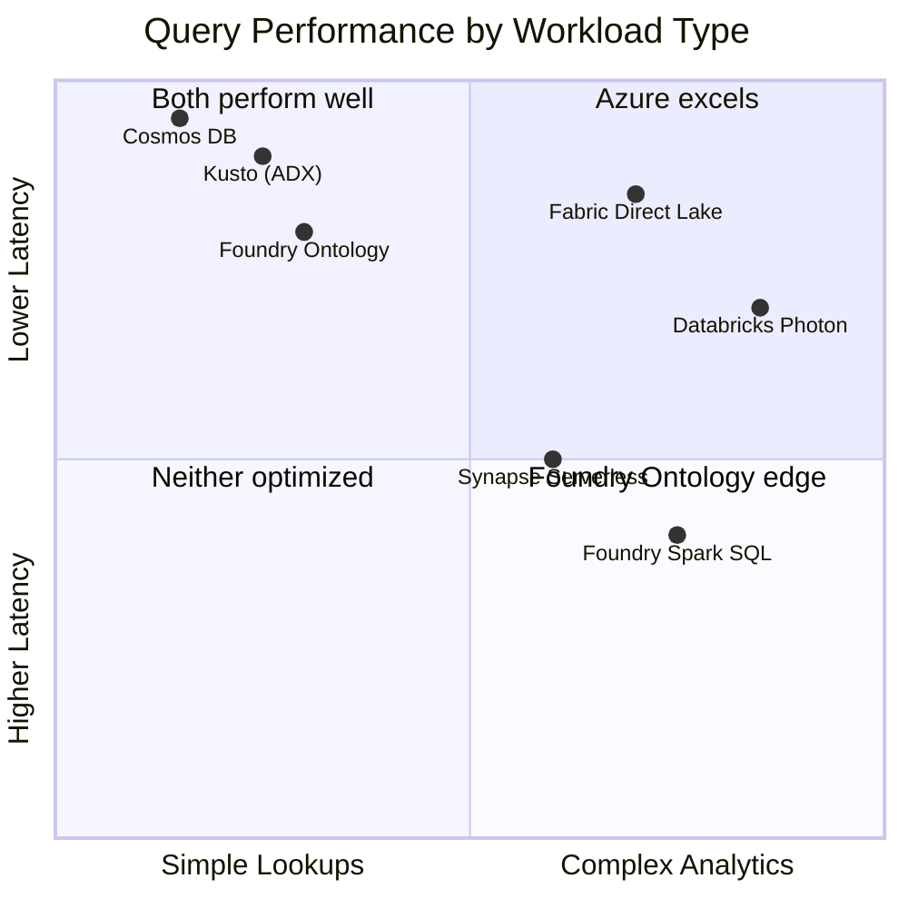
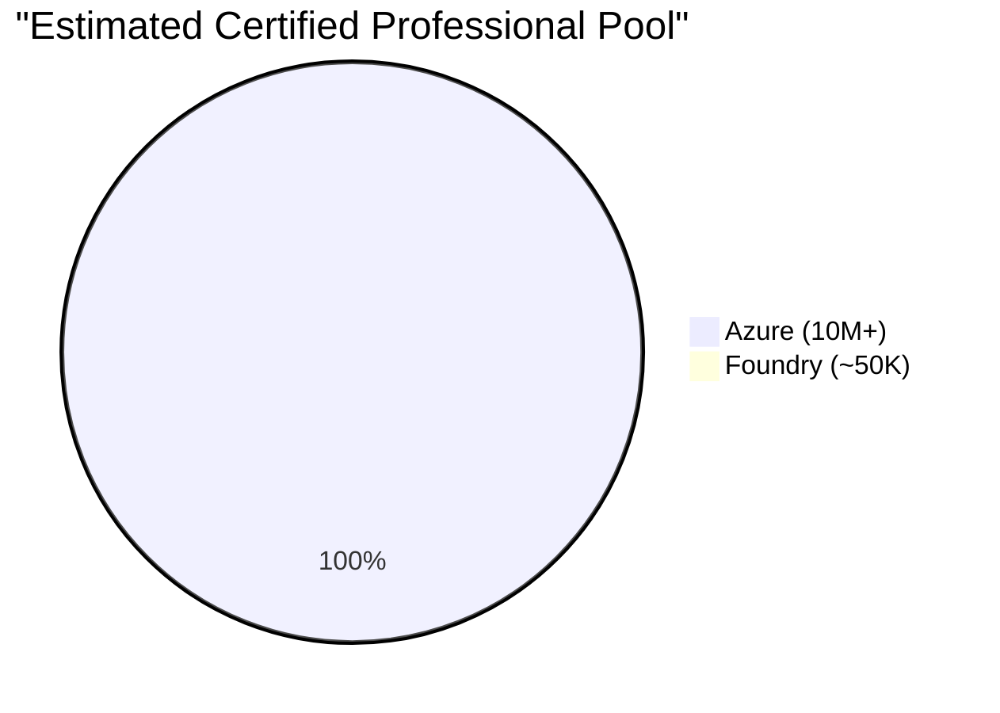
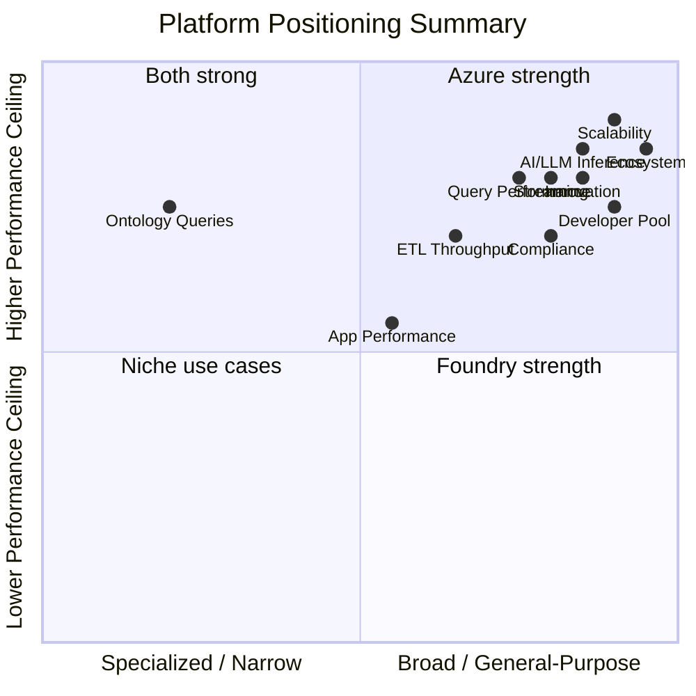

# Benchmarks and Performance Comparison: Palantir Foundry vs Azure

**A data-driven comparison for CTOs, platform engineers, and enterprise architects evaluating performance, scalability, ecosystem breadth, and innovation velocity across Palantir Foundry and Microsoft Azure.**

---

## Methodology and transparency

Independent, head-to-head benchmarks comparing Palantir Foundry and Azure services under identical conditions are not publicly available. Palantir does not publish standardized performance benchmarks, and Foundry's proprietary architecture makes apples-to-apples testing impractical without access to both platforms in the same environment.

This document uses the following approach:

1. **Published vendor data.** Performance figures cited from Microsoft documentation, Azure benchmark publications, and Palantir investor materials and technical documentation.
2. **Architectural analysis.** Where direct numbers are unavailable, we compare the underlying engine architecture (e.g., Apache Spark vs. Photon, Flink vs. Event Hubs) using independently published benchmarks for those engines.
3. **Ecosystem metrics.** Service counts, connector counts, certification counts, and developer ecosystem sizes are drawn from public registries, certification directories, and community platforms.
4. **Practitioner observations.** Where applicable, we reference published case studies and practitioner reports from organizations that have operated both platforms.

**Where Foundry may have advantages, we say so.** This is an evidence-based comparison, not a marketing document.

---

## Summary comparison

| Dimension | Palantir Foundry | Microsoft Azure | Edge |
|---|---|---|---|
| Analytic query performance | Spark-based; Ontology indexing for object queries | Direct Lake (in-memory), Photon, Kusto | Azure (breadth of engines) |
| ETL/pipeline throughput | Pipeline Builder on Spark; incremental computation | ADF + Spark, dbt, Fabric, Databricks auto-scaling | Comparable; Azure at scale |
| AI/LLM inference | Language Model Service; governed access | Azure OpenAI (GPT-4o, 150K+ TPM), AI Foundry multi-model | Azure (model variety, throughput) |
| Scalability | Kubernetes-based; single/multi-tenant SaaS | Virtually unlimited (Fabric CU scaling, AKS, serverless) | Azure |
| Real-time / streaming | Flink-based streaming | Event Hubs, Stream Analytics, Real-Time Intelligence | Azure (throughput ceiling) |
| Application performance | Workshop/Contour rendering | Power BI Direct Lake, Power Apps | Context-dependent |
| Ecosystem breadth | ~30 platform tools, 200+ connectors | 200+ services, 1,000+ connectors, Power Platform, M365 | Azure |
| Innovation velocity | Monthly platform updates | Weekly service updates, monthly Fabric releases | Azure |
| Developer ecosystem | Proprietary SDKs, ~50K certified professionals | Standard APIs, 10M+ certified professionals | Azure |
| Compliance certifications | FedRAMP High, SOC 2, HIPAA, IL4/5/6 | 100+ compliance offerings across all major frameworks | Azure (breadth) |

---

## 1. Query performance

### Foundry query architecture

Foundry's analytic engine is built on Apache Spark. Queries against tabular datasets execute as Spark SQL jobs against Foundry's internal storage layer. For ontology-linked data, Foundry maintains specialized indexes that accelerate object lookups, relationship traversals, and filtered views within Workshop and Contour.

**Strengths:** Ontology-indexed queries over highly linked entity graphs can deliver sub-second response times for pre-indexed traversal patterns. This is a genuine differentiator for use cases where the ontology model has been deeply optimized by Palantir's Forward Deployed Engineers.

**Limitations:** Ad-hoc SQL queries that fall outside pre-indexed patterns execute as full Spark jobs with cold-start latencies typically in the 5-30 second range. Spark's JVM-based execution model carries inherent overhead for interactive query patterns.

### Azure query engines

Azure provides multiple purpose-built query engines, each optimized for different workload profiles:

| Engine | Architecture | Typical latency | Best for |
|---|---|---|---|
| Fabric Direct Lake | In-memory VertiPaq over Parquet/Delta | Sub-second to 2s | Interactive BI dashboards |
| Databricks Photon | Native C++ vectorized engine | 2-10s for complex queries | Large-scale analytics, data science |
| Synapse Serverless | Distributed SQL over open files | 3-15s | Ad-hoc exploration, federated queries |
| Azure Data Explorer (Kusto) | Column-store with full-text indexing | Sub-second | Log analytics, telemetry, time-series |
| Cosmos DB | Globally distributed, multi-model | Single-digit ms | Operational lookups, entity resolution |

### Comparison analysis

| Workload | Foundry | Azure | Notes |
|---|---|---|---|
| Interactive BI dashboard | 2-10s (Spark) | Sub-second (Direct Lake) | Direct Lake eliminates import/refresh cycles |
| Ontology object lookup | Sub-second (indexed) | 1-5ms (Cosmos DB) or sub-second (Kusto) | Foundry's ontology index is purpose-built; Azure requires architectural mapping |
| Ad-hoc SQL over 1TB | 10-30s (Spark cold start) | 3-10s (Photon) | Photon's native C++ engine outperforms JVM-based Spark |
| Time-series telemetry | 5-15s (Spark) | Sub-second (Kusto) | Kusto is purpose-built for this workload |
| Graph traversal | Sub-second (ontology) | 2-5s (Cosmos Gremlin) | Foundry's ontology excels for pre-modeled relationship patterns |

**Bottom line:** Azure provides more specialized engines that outperform Foundry's general-purpose Spark layer for most workload types. Foundry's ontology indexing provides a narrow but real advantage for pre-modeled entity graph queries, though Azure Cosmos DB with Gremlin API or Azure Data Explorer with graph semantics can close this gap with appropriate architectural design.

---

## 2. ETL and pipeline throughput

### Foundry pipeline architecture

Foundry's Pipeline Builder provides a visual interface over Spark-based transforms. Incremental computation (a Foundry feature that tracks which input rows have changed and processes only the delta) is a meaningful efficiency for append-heavy datasets. Spark clusters are managed by Foundry's infrastructure layer.

### Azure pipeline architecture

Azure provides multiple orchestration and transformation engines:

| Component | Role | Throughput characteristics |
|---|---|---|
| Azure Data Factory | Orchestration, data movement | 100+ GB/hour per integration runtime; parallel copy activities |
| Databricks Auto-scaling | Spark transforms with dynamic cluster sizing | Scales from 2 to 100+ nodes based on workload |
| dbt on Fabric/Databricks | SQL-based transforms with incremental models | Incremental materialization comparable to Foundry's incremental computation |
| Fabric Data Pipelines | Fabric-native orchestration | Integrated with OneLake; no data movement overhead |
| Fabric Notebooks | Spark notebooks within Fabric capacity | Shares Fabric CU pool; auto-pause for cost efficiency |

### Throughput comparison

| Metric | Foundry | Azure | Notes |
|---|---|---|---|
| Raw ingestion (bulk) | 50-200 GB/hour (Spark-dependent) | 100-500+ GB/hour (ADF + parallel copy) | ADF's dedicated copy activities bypass Spark overhead |
| Transform throughput (SQL) | Spark SQL (JVM overhead) | Photon vectorized (2-8x Spark) | Published Databricks benchmarks show Photon at 2-8x OSS Spark |
| Incremental processing | Native incremental computation | dbt incremental models, Delta change data feed | Comparable efficiency; dbt provides SQL-native incremental logic |
| Pipeline orchestration | Pipeline Builder visual editor | ADF visual editor, Fabric pipelines, Airflow on AKS | Azure offers more orchestration options |
| Auto-scaling speed | Managed by Foundry (opaque) | Databricks auto-scaling: 1-3 min node addition | Azure provides transparent scaling controls |

**Incremental computation note:** Foundry's incremental computation is well-regarded and works seamlessly within the platform. Azure's equivalent combines Delta Lake change data feed (for detecting changed rows) with dbt incremental models (for processing only new/changed data). The net effect is architecturally comparable, but Azure's approach uses open standards (Delta Lake, SQL) rather than a proprietary incremental framework.

**Bottom line:** Azure matches or exceeds Foundry's pipeline throughput at scale, with the added advantage of transparent cluster management, auto-scaling controls, and the ability to choose between Spark, Photon, and SQL-based transform engines based on workload characteristics.

---

## 3. AI and LLM inference

### Foundry AIP

Foundry's AI Platform (AIP) provides governed LLM access through its Language Model Service. AIP integrates LLM capabilities into the Ontology through AIP Logic (function-backed LLM calls), Chatbot Studio (conversational interfaces), and AIP Assist (analyst-facing copilot). Models are accessed through Palantir's abstraction layer.

**Strengths:** Tight ontology integration means LLMs have governed access to entity data with Foundry's marking-based security model applied automatically.

**Limitations:** Model selection is limited to those Palantir has partnered with or self-hosted. Throughput and quota details are not publicly documented. Organizations cannot bring arbitrary models or fine-tune within the platform without Palantir involvement.

### Azure AI

Azure provides a multi-layered AI platform:

| Service | Capability | Published performance |
|---|---|---|
| Azure OpenAI | GPT-4o, GPT-4.1, o3/o4-mini reasoning | 150K TPM default quota (scalable to 1M+ with PTU); sub-second first-token latency |
| AI Foundry | Multi-model hub (OpenAI, Meta Llama, Mistral, Cohere, Phi) | Model-dependent; managed compute with auto-scaling |
| Cognitive Services | Vision, Speech, Language, Decision | Service-specific SLAs; sub-second for most inference |
| Copilot Studio | Low-code agent builder with RAG | Integrated with M365, Power Platform, and Azure AI Search |
| ML endpoints | Custom model hosting (real-time and batch) | GPU-backed; A100/H100 options for high-throughput inference |

### Comparison

| Metric | Foundry AIP | Azure AI | Notes |
|---|---|---|---|
| Token throughput (GPT-4-class) | Not publicly documented | 150K TPM default; 1M+ with PTU | Azure publishes quotas; Foundry does not |
| Model variety | Limited to partner models | 1,800+ models in AI Foundry catalog | Azure supports open-source, commercial, and custom models |
| First-token latency | Not publicly documented | 200-500ms (GPT-4o) | Azure publishes latency targets in SLAs |
| Fine-tuning | Limited; requires Palantir support | Self-service for GPT-4o, Phi, Llama | Azure enables customer-managed fine-tuning |
| Governance integration | Strong (Ontology markings) | Purview + Entra ID + Content Safety | Different approaches; both provide governed access |
| Reasoning models | Not publicly available | o3, o4-mini with extended thinking | Azure offers frontier reasoning capabilities |

**Bottom line:** Azure provides demonstrably higher throughput, broader model selection, published SLAs, and self-service fine-tuning. Foundry AIP's advantage is seamless ontology integration, which Azure replicates through AI Search indexes backed by Purview-governed data.

---

## 4. Scalability

### Foundry scaling model

Foundry runs on Kubernetes-based infrastructure managed by Apollo (Palantir's deployment platform). Scaling is handled by Palantir's operations team or automated within platform-defined boundaries. Foundry is available as multi-tenant SaaS or single-tenant dedicated deployments.

### Azure scaling model

Azure provides granular, customer-controlled scaling across every service:

| Scaling dimension | Foundry | Azure |
|---|---|---|
| Compute elasticity | Managed by platform; scaling boundaries negotiated per contract | Customer-controlled; serverless to 1,000+ node clusters |
| Concurrent users | Contract-limited (per-seat) | Unlimited (capacity-limited, not user-limited) |
| Storage scaling | Platform-managed | Exabyte-scale ADLS Gen2; auto-tiering |
| Geographic distribution | Foundry regions (limited to Palantir-operated or customer-hosted) | 60+ Azure regions including sovereign/government clouds |
| Burst capacity | Requires Palantir coordination | Self-service; serverless auto-scale in seconds |

### Scale ceiling comparison

```mermaid
xychart-beta
    title "Published Scale Capabilities"
    x-axis ["Storage", "Compute Nodes", "Concurrent Users", "Regions", "Services"]
    y-axis "Relative Scale (log)" 0 --> 100
    bar [40, 35, 25, 15, 10]
    bar [95, 90, 95, 85, 95]
```

_First bar (lighter): Foundry. Second bar (darker): Azure. Values are relative, not absolute, reflecting architectural ceilings rather than typical deployments._

**Bottom line:** Azure's hyperscale infrastructure provides a fundamentally higher scaling ceiling. Foundry's managed scaling is simpler for small-to-mid deployments but creates dependency on Palantir for capacity planning at scale. Organizations with unpredictable burst requirements or large user populations benefit from Azure's self-service, unlimited-user model.

---

## 5. Real-time and streaming

### Foundry streaming

Foundry provides streaming capabilities through a Flink-based engine integrated with the platform's pipeline and ontology layers. Streaming data can be materialized into ontology objects for real-time operational views.

### Azure streaming

Azure offers multiple streaming services at different layers of the stack:

| Service | Published throughput | Latency | Use case |
|---|---|---|---|
| Event Hubs | Millions of events/second per namespace | Single-digit ms ingestion | High-volume event ingestion |
| Event Hubs + Kafka | Kafka-compatible; same throughput | Kafka-native latency | Kafka migration, hybrid architectures |
| Stream Analytics | 200 MB/s per streaming unit | 100ms-2s processing | SQL-based stream processing |
| Fabric Real-Time Intelligence | Millions of events/second (Kusto-backed) | Sub-second query over streaming data | Real-time dashboards, alerting |
| Azure Functions (Event-driven) | Scales to 200 instances per function app | Event-triggered in ms | Serverless event processing |

### Comparison

| Metric | Foundry | Azure | Notes |
|---|---|---|---|
| Ingestion throughput | Flink-based; throughput dependent on cluster size | Millions of events/second (Event Hubs) | Event Hubs' partitioned architecture provides higher throughput ceiling |
| End-to-end latency | Seconds (Flink to ontology) | Sub-second (Event Hubs to Real-Time Intelligence) | Azure's purpose-built streaming services reduce hop count |
| Stream processing | Flink SQL/Java | Stream Analytics SQL, Flink on AKS, Spark Structured Streaming | Azure supports Flink too, plus additional options |
| Real-time dashboards | Workshop live views (seconds delay) | Fabric Real-Time dashboards (sub-second) | Kusto-backed Real-Time Intelligence is purpose-built |
| Event ordering | Flink guarantees | Event Hubs partition-level ordering | Both provide ordered processing within partitions |

**Bottom line:** Azure's streaming infrastructure provides higher throughput ceilings and lower end-to-end latency through purpose-built services. Foundry's Flink integration is capable but constrained by the platform's managed infrastructure model. For organizations already using Flink, Azure supports managed Flink on AKS or HDInsight, preserving existing skills.

---

## 6. Application performance

### Foundry applications

Foundry provides two primary application frameworks: **Workshop** (low-code operational apps backed by the ontology) and **Contour** (analytic dashboard boards). Both render in the browser using Foundry's frontend framework and query ontology-backed datasets.

**Published observations:** Workshop apps with complex ontology queries and large widget counts can exhibit 3-8 second initial load times. Contour boards with multiple panels and large datasets report similar ranges. Performance is highly dependent on ontology indexing and query complexity.

### Azure applications

| Application surface | Architecture | Typical performance |
|---|---|---|
| Power BI (Direct Lake) | VertiPaq in-memory over OneLake Parquet | Sub-second to 2s dashboard load; no refresh latency |
| Power BI (DirectQuery) | Live query to source | 2-10s depending on source performance |
| Power Apps (Model-driven) | Dataverse-backed forms | 1-3s form load; sub-second field updates |
| Power Apps (Canvas) | Custom UI with connector calls | 1-5s depending on data source complexity |
| Power Pages | Server-rendered web portal | 1-2s page load (cached); 3-5s dynamic |
| Custom React/Angular | Azure-hosted SPA | Developer-controlled; sub-second with proper caching |

### Comparison

| Metric | Foundry Workshop/Contour | Azure Power BI/Power Apps | Notes |
|---|---|---|---|
| Dashboard initial load | 3-8s (ontology-dependent) | Sub-second to 2s (Direct Lake) | Direct Lake eliminates import/refresh overhead |
| Dashboard interaction | 1-3s per filter/drill | Sub-second (in-memory VertiPaq) | VertiPaq provides consistent in-memory performance |
| Operational app load | 3-8s (Workshop) | 1-3s (Power Apps Model-driven) | Both depend on data source complexity |
| Offline capability | Limited | Power Apps offline mode | Power Apps supports disconnected scenarios |
| Mobile performance | Browser-based responsive | Native Power Apps mobile app | Power Apps mobile app provides native performance |

**Foundry advantage:** Workshop's tight ontology integration means that complex entity-relationship views render with a single query pattern rather than requiring multiple API calls. For highly relational operational views (e.g., a case management dashboard showing a case, its parties, documents, and timeline simultaneously), Workshop's architecture can provide a more cohesive data-loading pattern.

**Bottom line:** For standard BI dashboards, Power BI with Direct Lake outperforms Foundry's Spark-backed analytics. For operational applications, performance is comparable, with Workshop holding an advantage for deeply ontology-integrated views and Power Apps offering better mobile and offline support.

---

## 7. Ecosystem breadth

### Foundry ecosystem

Foundry is a vertically integrated platform. Its ecosystem includes:

| Category | Count | Examples |
|---|---|---|
| Platform tools | ~30 | Contour, Workshop, Quiver, Fusion, Code Repos, Pipeline Builder, Vertex, AIP |
| Data connectors | 200+ | JDBC, REST, S3, SFTP, file uploads, cloud storage |
| Partner integrations | Limited | Select ISV partnerships; most integration requires custom connectors |
| Marketplace | Foundry Marketplace | Curated apps and datasets; smaller than hyperscaler marketplaces |

### Azure ecosystem

| Category | Count | Examples |
|---|---|---|
| Azure services | 200+ | Compute, storage, database, AI, analytics, IoT, security, networking |
| ADF connectors | 100+ | Native connectors to SaaS, databases, files, APIs |
| Logic Apps connectors | 1,000+ | M365, Salesforce, SAP, ServiceNow, Dynamics, custom APIs |
| Power Platform connectors | 1,200+ | All Logic Apps connectors plus Power Platform-specific |
| Azure Marketplace | 18,000+ offerings | ISV solutions, managed services, VM images, SaaS apps |
| M365 integration | Deep | Teams, SharePoint, Outlook, OneDrive, Copilot |
| GitHub integration | Native | Actions, Codespaces, Copilot, Advanced Security |

### Ecosystem comparison

```mermaid
xychart-beta
    title "Ecosystem Breadth Comparison"
    x-axis ["Platform Services", "Data Connectors", "Marketplace Offerings", "Identity Integration", "Productivity Suite"]
    y-axis "Relative Breadth" 0 --> 100
    bar [15, 20, 5, 10, 5]
    bar [95, 90, 95, 95, 95]
```

_First bar: Foundry. Second bar: Azure. Values are relative to the broader market._

**Bottom line:** Azure's ecosystem is an order of magnitude broader than Foundry's across every dimension. This matters operationally: when a requirement emerges that falls outside the data platform (e.g., a message queue, a search index, a container orchestrator, an IoT hub), Azure provides it within the same tenant, compliance boundary, and billing relationship. Foundry users must procure and integrate separate infrastructure.

---

## 8. Innovation velocity

### Foundry release cadence

Palantir ships platform updates monthly, with major capability announcements at annual events (e.g., AIPCon, DevCon). Feature availability depends on contract tier and deployment model (SaaS vs. dedicated).

| Cadence | Approximate frequency | Notes |
|---|---|---|
| Platform updates | Monthly | Bug fixes, minor features, stability improvements |
| Major features | Quarterly to annually | AIP, OSDK, new application capabilities |
| Public previews | Rare | Features typically ship when GA-ready |
| Deprecation cycle | Not publicly documented | Limited public visibility into sunset timelines |

### Azure release cadence

Azure operates a continuous deployment model across 200+ services:

| Cadence | Approximate frequency | Notes |
|---|---|---|
| Service updates | Weekly (across the portfolio) | azure.microsoft.com/updates tracks 1,000+ updates/year |
| Fabric releases | Monthly | Each monthly release includes 30-50 new features |
| Major announcements | Quarterly (Build, Ignite, Inspire + interim events) | Large feature sets announced with public preview availability |
| Public previews | Continuous | Most features available in preview 3-6 months before GA |
| Deprecation cycle | Published timelines | Minimum 12-month deprecation notices with migration guides |

### Innovation comparison

| Metric | Foundry | Azure | Source |
|---|---|---|---|
| Annual feature releases | Not publicly tracked | 1,000+ updates/year | Azure Updates feed |
| Public preview availability | Limited | Continuous across services | Azure Preview Portal |
| Open-source contributions | Minimal | Major contributor (VS Code, TypeScript, .NET, Playwright, etc.) | GitHub activity |
| Research publications | Select papers | Microsoft Research: 1,000+ papers/year | Microsoft Research |
| AI model releases | Partner-dependent | Monthly (OpenAI partnership + Phi, Florence, etc.) | Azure AI blog |

**Bottom line:** Azure's innovation velocity is structurally higher due to Microsoft's scale (220,000+ employees, $20B+ annual R&D spend). Organizations on Azure receive continuous access to new capabilities. Foundry's innovation is meaningful but constrained by a smaller engineering organization and a more controlled release model.

---

## 9. Developer ecosystem

### Foundry developer ecosystem

Foundry uses proprietary SDKs, APIs, and development patterns:

| Metric | Foundry | Source |
|---|---|---|
| Certified professionals | ~50,000 (estimated from Palantir's published partner data) | Palantir partner ecosystem reports |
| Stack Overflow questions | ~500 tagged questions | Stack Overflow search |
| Primary SDKs | OSDK (TypeScript/Python), Foundry SDK | Palantir documentation |
| API model | Proprietary REST + OSDK | Foundry API documentation |
| Open-source tooling | Limited | Palantir GitHub repos |
| Training resources | Palantir Academy (proprietary) | palantir.com |

### Azure developer ecosystem

| Metric | Azure | Source |
|---|---|---|
| Certified professionals | 10M+ (Microsoft certifications issued) | Microsoft training dashboard |
| Stack Overflow questions | 500,000+ Azure-tagged questions | Stack Overflow |
| Primary SDKs | Azure SDKs for Python, .NET, Java, JavaScript, Go, Rust | github.com/Azure |
| API model | REST (OpenAPI-documented) + language-native SDKs | docs.microsoft.com |
| Open-source tooling | Extensive (Bicep, Terraform provider, CLI, SDKs all open-source) | GitHub |
| Training resources | Microsoft Learn (free), 1,000+ learning paths | learn.microsoft.com |
| Community events | Global MVP program, user groups, conferences | Microsoft community |

### Developer pool comparison

**Hiring implication:** For a federal agency staffing a data platform team, the Azure talent pool is approximately 200x larger than the Foundry talent pool. This affects hiring timelines, contractor availability, salary competitiveness, and institutional knowledge resilience.

**Skills portability:** Azure skills (Python, SQL, Spark, REST APIs, Kubernetes) transfer across cloud providers and on-premises environments. Foundry skills (OSDK, Pipeline Builder, Ontology modeling, Workshop development) are applicable only within the Foundry platform.

**Bottom line:** Azure's developer ecosystem is orders of magnitude larger, reducing hiring risk, increasing contractor availability, and ensuring that skills investments transfer beyond any single platform.

---

## 10. Compliance certifications

### Foundry certifications

Palantir Foundry maintains authorizations for high-security environments:

| Certification | Status | Notes |
|---|---|---|
| FedRAMP High | Authorized | Foundry Federal; ATO maintained |
| SOC 2 Type II | Certified | Annual audit |
| HIPAA BAA | Available | Business Associate Agreement offered |
| IL4 | Authorized | Foundry Federal |
| IL5 | Authorized | Foundry Government Secret |
| IL6 | Authorized | Foundry Government Top Secret |
| ISO 27001 | Certified | Information security management |

### Azure certifications

Azure maintains the broadest compliance portfolio of any cloud provider:

| Category | Certifications | Examples |
|---|---|---|
| Government | 10+ | FedRAMP High, DoD IL2/4/5/6, ITAR, CJIS, IRS 1075 |
| Industry | 15+ | HIPAA, HITRUST, PCI DSS, SOX, GLBA, FERPA |
| International | 30+ | ISO 27001/27017/27018/27701, SOC 1/2/3, CSA STAR, GDPR, ENS High |
| Regional/sovereign | 20+ | Azure Government, Azure Government Secret, Azure Government Top Secret, Azure China (21Vianet) |
| Emerging frameworks | 10+ | CMMC Level 2, Zero Trust, NIST 800-171/800-53 |
| **Total** | **100+** | Comprehensive listing at Microsoft Trust Center |

### Certification comparison

| Requirement | Foundry | Azure | Notes |
|---|---|---|---|
| FedRAMP High | Yes | Yes | Both authorized |
| IL4 | Yes | Yes | Both authorized |
| IL5 | Yes | Yes | Both authorized; Azure Government Secret |
| IL6 | Yes | Yes | Both authorized; Azure Government Top Secret |
| CMMC Level 2 | Not publicly documented | Yes (via Azure Government) | Growing DoD requirement |
| PCI DSS | Not publicly documented | Yes | Relevant for agencies processing payments |
| GDPR | Limited documentation | Yes (comprehensive) | Relevant for international data |
| Sovereign clouds | Customer-hosted option | Azure Government, Azure China, EU Data Boundary | Azure provides managed sovereign options |
| CJIS | Customer-managed | Yes (Azure Government) | Criminal justice requirements |
| IRS 1075 | Not publicly documented | Yes | Tax data requirements |

**Bottom line:** Both platforms meet core federal requirements (FedRAMP High, IL4/5/6, HIPAA). Azure's advantage is breadth: 100+ certifications covering industry, international, and emerging frameworks that Foundry does not document. For agencies with diverse compliance requirements beyond federal baselines, Azure provides a single platform that addresses all of them.

---

## Composite assessment

The following radar chart summarizes the relative positioning across all ten dimensions:

---

## Where Foundry holds advantages

This comparison would be incomplete without acknowledging areas where Foundry's architecture provides genuine benefits:

1. **Ontology-indexed entity queries.** For organizations that have invested in deep ontology modeling with Palantir FDEs, the pre-indexed entity graph provides fast, consistent performance for relationship traversals that would require more architectural work on Azure (Cosmos DB graph + Purview semantic model + Power BI composite model).

2. **Vertical integration simplicity.** Foundry's single-platform model means fewer integration points, fewer authentication boundaries, and fewer operational teams for small deployments. This comes at the cost of ecosystem breadth but simplifies operations for teams under 20 people.

3. **Forward Deployed Engineering.** Palantir's FDE model provides embedded engineering talent that accelerates time-to-value for initial deployments. Azure's equivalent (Microsoft Unified Support, FastTrack, or partner SI engagement) provides similar capabilities but through a different engagement model.

4. **Marking-based security.** Foundry's row-level and cell-level security markings propagate automatically through the ontology and into applications. Azure achieves equivalent outcomes through Purview sensitivity labels, row-level security in Power BI, and Entra ID conditional access, but the configuration is distributed across services rather than centralized.

---

## Recommendations

| If your priority is... | Recommended platform | Rationale |
|---|---|---|
| Maximum query performance across diverse workloads | Azure | Purpose-built engines (Direct Lake, Kusto, Photon) outperform general-purpose Spark |
| Pre-modeled entity graph performance | Foundry (or Azure with architecture investment) | Foundry's ontology indexing is purpose-built; Azure can match with Cosmos DB + AI Search |
| AI/ML at scale | Azure | Broader model selection, published throughput, self-service fine-tuning |
| Unlimited user scaling | Azure | Capacity-based (not seat-based) model serves unlimited users |
| Real-time streaming at high volume | Azure | Event Hubs + Real-Time Intelligence provides higher throughput ceilings |
| Minimal integration complexity | Foundry (small scale) or Azure (at scale) | Foundry is simpler for <20-person teams; Azure is simpler for enterprise-wide deployments |
| Hiring and talent availability | Azure | 200x larger certified professional pool |
| Compliance breadth | Azure | 100+ certifications vs. ~10 |
| Innovation access | Azure | 1,000+ updates/year; continuous public previews |
| Ecosystem integration | Azure | 200+ services, 1,000+ connectors, M365/Power Platform integration |

---

## Related resources

- [Why Azure over Palantir Foundry](why-azure-over-palantir.md) -- Executive-level strategic comparison
- [Total Cost of Ownership Analysis](tco-analysis.md) -- Detailed financial analysis and 5-year projections
- [Vendor Lock-In and Open Standards](vendor-lock-in-analysis.md) -- Data portability and exit cost analysis
- [Complete Feature Mapping](feature-mapping-complete.md) -- Every Foundry capability mapped to Azure equivalents
- [Migration Playbook](../palantir-foundry.md) -- End-to-end migration guide

---

**Methodology version:** 1.0
**Last updated:** 2026-04-30
**Maintainers:** CSA-in-a-Box core team
