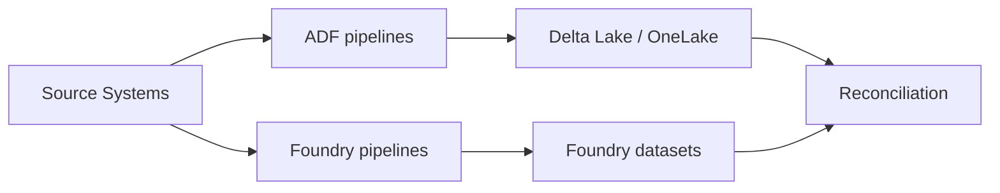

# Migration Best Practices: Palantir Foundry to Azure

**Lessons learned, common pitfalls, and proven patterns for successful platform migrations.**

---

## Pre-migration assessment checklist

Before committing to a migration, complete this assessment to scope the effort accurately and identify risks early.

### Foundry inventory

- [ ] **Object types:** Count and categorize all Ontology object types (simple, complex, heavily linked)
- [ ] **Link types:** Map all relationships and cardinalities
- [ ] **Pipelines:** Inventory all Pipeline Builder pipelines and Code Repository transforms
- [ ] **Workshop apps:** List all Workshop applications, their user bases, and criticality
- [ ] **Slate apps:** List all Slate applications and their external dependencies
- [ ] **Functions:** Inventory all TypeScript and Python functions, note external API dependencies
- [ ] **Actions:** Catalog all Actions with their trigger conditions and downstream effects
- [ ] **AIP usage:** Document AIP Logic flows, Chatbot Studio agents, and Automate rules
- [ ] **Users and groups:** Map all user roles, groups, and permission structures
- [ ] **Data sources:** List all connected external systems and their sync types
- [ ] **Data volumes:** Measure hot, warm, and archive data volumes
- [ ] **Compliance requirements:** Document all compliance frameworks in scope
- [ ] **Shadow usage:** Identify undocumented or informal uses of Foundry data

### Risk register template

| Risk                                         | Likelihood | Impact   | Mitigation                                                     |
| -------------------------------------------- | ---------- | -------- | -------------------------------------------------------------- |
| Under-documented Foundry ontology            | High       | High     | Conduct discovery workshops with Foundry SMEs before migration |
| Shadow consumers outside known Workshop apps | Medium     | High     | Audit Foundry access logs for unknown API consumers            |
| Schema drift during migration                | Medium     | Medium   | Implement data reconciliation checks at each phase gate        |
| User resistance to Power BI/Power Apps UX    | High       | Medium   | Conduct UX previews early; invest in training                  |
| Compliance gap during transition             | Low        | Critical | Maintain dual-run until new ATO is granted                     |
| FDE knowledge loss                           | Medium     | High     | Conduct knowledge transfer sessions; document tribal knowledge |

---

## Discovery phase best practices

### 1. Start with the consumers, not the data

The most common migration mistake is starting with data ingestion and hoping the consumers will follow. Instead:

1. Identify the top 10 Workshop apps and Contour boards by daily active users
2. Interview the analysts and operators who use them
3. Understand the workflows, not just the data
4. Design the Azure consumer surfaces (Power BI reports, Power Apps) first
5. Work backward to determine which data products and pipelines are needed

### 2. Document the tribal knowledge

Foundry deployments often contain years of accumulated decisions that exist only in the heads of Palantir FDEs and senior analysts. Before the migration:

- Schedule knowledge transfer sessions with FDEs
- Record video walkthroughs of complex Workshop apps
- Document undocumented business rules embedded in Functions and Actions
- Capture the "why" behind ontology design decisions
- Record data quality rules that are manually enforced

### 3. Use the 80/20 rule for scoping

Not everything needs to migrate on day one:

- **Phase 1 (20% of objects, 80% of value):** The core object types that drive the most-used dashboards and apps
- **Phase 2 (next 30%):** Supporting object types, secondary dashboards, and batch reports
- **Phase 3 (remaining 50%):** Long-tail objects, archival data, and rarely-used apps
- **Never migrate:** Obsolete objects, broken pipelines, unused Workshop apps

### 4. Map before you build

Create a complete mapping document before writing any code:

| Foundry artifact | Type     | Azure target                    | Owner          | Priority | Status      |
| ---------------- | -------- | ------------------------------- | -------------- | -------- | ----------- |
| Case object type | Ontology | Purview glossary + dbt dim_case | Domain team    | P1       | Not started |
| Case dashboard   | Contour  | Power BI report                 | Analytics team | P1       | Not started |
| Case workflow    | Workshop | Power Apps                      | App team       | P2       | Not started |
| Escalation rule  | Action   | Data Activator + Event Grid     | Platform team  | P2       | Not started |

---

## Data migration patterns

### Pattern 1: Parallel ingestion (recommended for most cases)

Run both Foundry and Azure ingestion pipelines against the same sources. Compare outputs for data parity before cutting over.

**Advantages:** Lowest risk, enables gradual transition, validates data quality continuously.
**Disadvantages:** Double compute cost during parallel period.

### Pattern 2: Export and reload

Export datasets from Foundry as Parquet files, upload to ADLS Gen2, and build dbt models on top.

**When to use:** Simple datasets without complex incremental logic, historical data, reference data.
**Risk:** No ongoing sync during migration — data goes stale.

### Pattern 3: Foundry-to-Azure connector

Use ADF's REST connector or a custom Azure Function to read from the Foundry API and write to ADLS Gen2.

**When to use:** When source systems are difficult to re-connect and Foundry is the only accessible copy.
**Risk:** Foundry API rate limits may constrain throughput.

### Pattern 4: Source system direct connection

Bypass Foundry entirely — connect ADF directly to the original source systems.

**When to use:** This is the preferred long-term pattern. Use for all net-new connections.
**Risk:** Source system access may require network changes, credentials, and approvals.

---

## Incremental migration strategies

### Strategy 1: Domain-by-domain

Migrate one business domain at a time (e.g., case management, then finance, then HR). Each domain includes its object types, pipelines, apps, and functions.

**Best for:** Organizations with clearly separated domains and independent data products.

### Strategy 2: Layer-by-layer

Migrate all data ingestion first, then all transforms, then all analytics, then all apps.

**Best for:** Organizations with heavily cross-referenced ontologies where domains cannot be cleanly separated.

### Strategy 3: Consumer-driven

Start with the most-used consumer surface (e.g., the executive dashboard), build it on Azure, and pull in whatever data products it needs. Repeat for the next consumer surface.

**Best for:** Organizations where executive buy-in depends on visible early wins.

### Recommended approach: hybrid

Most successful migrations combine strategies:

1. **Week 1–2:** Deploy CSA-in-a-Box landing zones (layer approach)
2. **Week 3–12:** Migrate the top domain by consumer value (consumer-driven within a domain)
3. **Week 13–28:** Migrate remaining domains in priority order (domain-by-domain)
4. **Week 29–36:** Cutover and decommission (layer approach for final validation)

---

## Parallel-run approaches

### Full parallel run

Both platforms active for all workloads. Users can access either system. Data is ingested and processed in both.

**Duration:** 4–8 weeks minimum
**Cost:** 1.5–2x normal operating cost
**Risk level:** Lowest

### Shadow parallel run

Azure processes all data but only a pilot group of users accesses Azure outputs. Production users remain on Foundry.

**Duration:** 2–4 weeks
**Cost:** 1.2–1.5x normal operating cost
**Risk level:** Low-moderate

### Cutover with rollback window

Direct cutover to Azure with a defined rollback window (typically 2 weeks) where Foundry can be reactivated.

**Duration:** 2 weeks rollback window
**Cost:** 1.1x (Foundry in read-only mode)
**Risk level:** Moderate

### Reconciliation requirements

During any parallel run, validate:

- Row counts match (±0.1% tolerance for timing differences)
- Key metrics match (revenue, case counts, KPIs)
- Data freshness is comparable
- Edge cases handled (nulls, special characters, timezone handling)
- User feedback collected and addressed

---

## User training strategies

### Training phases

| Phase             | Audience              | Content                                                          | Duration |
| ----------------- | --------------------- | ---------------------------------------------------------------- | -------- |
| Awareness         | All users             | What is changing, why, timeline, where to get help               | 1 hour   |
| Analyst training  | Power BI users        | Power BI basics, Copilot, Direct Lake, filters, drill-through    | 4 hours  |
| Builder training  | Power Apps developers | Power Apps canvas apps, Power Automate, Dataverse/SQL connectors | 8 hours  |
| Engineer training | Data engineers        | dbt, ADF, Fabric notebooks, Purview, CI/CD                       | 16 hours |
| Admin training    | Platform admins       | Azure Monitor, Purview governance, Entra ID, cost management     | 8 hours  |

### Training resources

- **Microsoft Learn:** Free self-paced learning paths for all Azure services
- **Power BI in a Day:** Microsoft-sponsored training events
- **dbt Learn:** Free dbt fundamentals course
- **CSA-in-a-Box tutorials:** Hands-on guides in this repository
- **YouTube:** Microsoft Mechanics, Guy in a Cube (Power BI), dbt Labs channels

### Change management tips

1. **Identify champions:** Find 2–3 analysts who are excited about Power BI and make them peer trainers
2. **Quick wins first:** Rebuild the most-requested dashboard first — visible value builds momentum
3. **Office hours:** Hold weekly drop-in sessions during the first month after migration
4. **Feedback loop:** Create a Teams channel for migration feedback — respond within 24 hours
5. **Don't force perfection:** The first version of a Power BI report doesn't need to match Contour pixel-for-pixel. Start with 80% parity and iterate based on feedback.

---

## Risk mitigation

### Technical risks

| Risk                              | Mitigation                                                                  |
| --------------------------------- | --------------------------------------------------------------------------- |
| Data loss during export           | Validate row counts and checksums before and after every export             |
| Pipeline timing differences       | Use watermark columns and idempotent loads to handle timing drift           |
| Schema evolution                  | Implement dbt contracts and schema change alerts                            |
| Performance regression            | Benchmark key queries before migration; set performance acceptance criteria |
| API rate limits on Foundry export | Parallelize exports across multiple service principals; throttle gracefully |

### Organizational risks

| Risk                | Mitigation                                                             |
| ------------------- | ---------------------------------------------------------------------- |
| User resistance     | Early involvement, champion network, visible quick wins                |
| FDE knowledge loss  | Document everything during discovery; record walkthroughs              |
| Budget overrun      | Fixed-price milestones for partner work; reserve 20% contingency       |
| Timeline slip       | Prioritize ruthlessly; defer non-critical apps to post-migration phase |
| Stakeholder fatigue | Monthly executive updates showing progress metrics and cost savings    |

### Compliance risks

| Risk                      | Mitigation                                                                       |
| ------------------------- | -------------------------------------------------------------------------------- |
| ATO gap during transition | Maintain Foundry ATO until Azure ATO is granted; never run without authorization |
| Classification mismatch   | Validate Purview classifications against Foundry markings before cutover         |
| Audit trail gap           | Ensure Azure Monitor diagnostic settings are active before first data lands      |
| Data residency violation  | Confirm Azure region selection meets all data residency requirements             |

---

## Post-migration validation

### Validation checklist

- [ ] All P1 data products producing correct results (reconciled against Foundry)
- [ ] All P1 Power BI reports accessible to original user groups
- [ ] All P1 Power Apps functioning and tested by pilot users
- [ ] Data freshness SLAs met for all migrated pipelines
- [ ] Purview classifications applied and validated
- [ ] Azure Monitor alerts configured and tested
- [ ] Backup and disaster recovery validated
- [ ] Cost tracking and budgets in place
- [ ] User training completed for all affected groups
- [ ] ATO documentation updated for new Azure-based platform

### Success criteria

Define quantitative success criteria before migration:

- **Data quality:** ≤0.5% variance vs Foundry for all KPI metrics
- **Performance:** Dashboard load times ≤5 seconds (P95)
- **Availability:** 99.5% uptime for production data products
- **User satisfaction:** ≥80% of pilot users rate new platform as "good" or "excellent"
- **Cost:** Azure monthly run-rate ≤60% of Foundry monthly cost by month 6

---

## Common pitfalls and how to avoid them

### 1. Trying to replicate Foundry exactly

**Problem:** Teams spend months trying to make Power BI look exactly like Contour or Power Apps behave exactly like Workshop.
**Solution:** Accept that the tools are different. Focus on the business outcomes, not pixel-perfect replication. Power BI and Power Apps have their own strengths — lean into them.

### 2. Migrating everything at once

**Problem:** Big-bang migrations have high failure rates and create overwhelming change for users.
**Solution:** Use the phased approach described above. Migrate the top 20% first, validate, then continue.

### 3. Ignoring the ontology

**Problem:** Teams migrate data without migrating the semantic context. The result is a data lake with no business meaning.
**Solution:** Invest in Purview glossary terms, dbt documentation, and Power BI semantic models. The ontology is the highest-value asset — don't leave it behind.

### 4. Under-investing in training

**Problem:** Users get a new tool with no training and blame the platform for their productivity loss.
**Solution:** Budget 15–20% of migration cost for training and change management.

### 5. Not testing with real users

**Problem:** Technical validation passes but real users find the experience unacceptable.
**Solution:** Include pilot users from Week 1. Their feedback shapes the migration, not just validates it.

### 6. Forgetting about monitoring

**Problem:** Pipelines break after migration because no one set up alerts.
**Solution:** Configure Azure Monitor alerts, dbt source freshness tests, and Data Activator rules before the first pipeline goes live.

### 7. Losing Foundry FDE knowledge

**Problem:** Palantir FDEs leave at contract end and institutional knowledge disappears.
**Solution:** Start knowledge transfer in the discovery phase. Document everything. Record sessions.

### 8. Neglecting the ATO timeline

**Problem:** The technical migration completes but the system can't go live because the ATO isn't ready.
**Solution:** Start ATO documentation in Phase 1. Use CSA-in-a-Box compliance YAMLs to accelerate. Engage the ISSO from day one.

---

## Team structure recommendations

### Core migration team (mid-sized engagement)

| Role                       | Count | Responsibility                                                   |
| -------------------------- | ----- | ---------------------------------------------------------------- |
| Migration lead / architect | 1     | Overall architecture, risk management, stakeholder communication |
| Data engineer              | 2–3   | ADF pipelines, dbt models, data validation                       |
| BI developer               | 1–2   | Power BI reports, semantic models, Copilot configuration         |
| App developer              | 1–2   | Power Apps, Power Automate, custom React (if needed)             |
| Platform engineer          | 1     | Bicep IaC, CI/CD, Azure Monitor, Purview automation              |
| Security/compliance        | 1     | ATO documentation, Purview classifications, access controls      |
| Change management          | 1     | Training, communication, user feedback                           |
| Foundry SME                | 1     | Knowledge transfer, ontology documentation, validation           |

### Timeline estimation guidelines

| Deployment size | Object types | Pipelines | Apps  | Estimated duration |
| --------------- | ------------ | --------- | ----- | ------------------ |
| Small           | 10–30        | 10–30     | 2–5   | 12–20 weeks        |
| Medium          | 30–100       | 30–100    | 5–15  | 24–36 weeks        |
| Large           | 100–300      | 100–300   | 15–50 | 36–52 weeks        |
| Enterprise      | 300+         | 300+      | 50+   | 52–78 weeks        |

Multiply by 1.3x for federal/government deployments (ATO overhead, clearance requirements, procurement delays).

---

**Last updated:** 2026-04-30
**Maintainers:** CSA-in-a-Box core team
**Related:** [Migration Playbook](../palantir-foundry.md) | [Federal Migration Guide](federal-migration-guide.md) | [Tutorials](index.md#tutorials)
