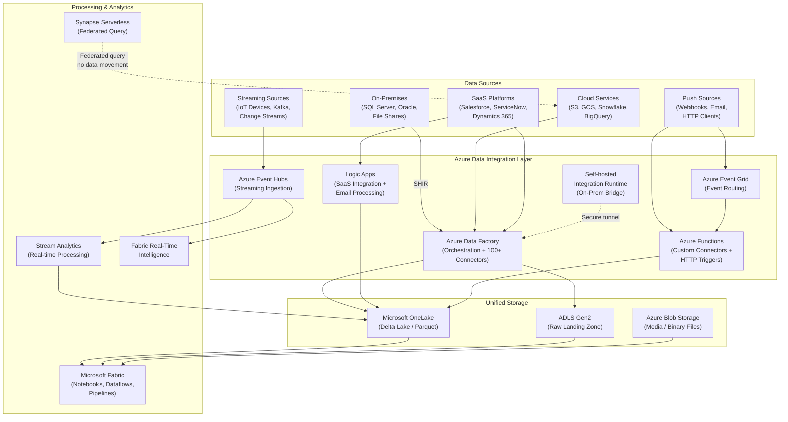

# Data Integration Migration: Palantir Foundry to Azure

**A deep-dive technical guide for data engineers and platform architects migrating Foundry's data integration capabilities to Azure Data Factory, Microsoft Fabric, and Event Hubs.**

---

## Executive summary

Palantir Foundry consolidates data integration through its Data Connection application, Magritte connector framework, and a fleet of agent-based on-premises bridges. While Foundry provides a cohesive experience, every connector definition, sync schedule, agent deployment, and streaming pipeline is locked to the Foundry platform with no portable export format.

Azure provides equivalent — and in many areas superior — capabilities through Azure Data Factory (ADF), Microsoft Fabric Data Factory, Self-hosted Integration Runtime (SHIR), Azure Event Hubs, and OneLake shortcuts. These services use open protocols (JDBC, ODBC, REST, OData, S3-compatible APIs), standard scheduling (cron), and infrastructure-as-code definitions (ARM/Bicep/Terraform) that are portable, auditable, and version-controlled.

This guide provides a connector-by-connector mapping, step-by-step migration procedures for every sync type, and production-ready configuration examples drawn from the CSA-in-a-Box accelerator.

---

## 1. Foundry data integration architecture

Foundry's data integration layer consists of several tightly coupled components.

### Data Connection app

The central management console for all external data sources. Data Connection provides a unified UI for configuring connectors, managing credentials, scheduling syncs, and monitoring ingestion health. All configuration is stored in Foundry's internal metadata store with no standard export mechanism.

### Magritte connector framework

Foundry ships over 200 connectors under the Magritte framework covering relational databases (PostgreSQL, SQL Server, Oracle, MySQL), cloud data warehouses (Snowflake, BigQuery, Redshift), SaaS platforms (Salesforce, ServiceNow, Workday, SAP), cloud storage (S3, GCS, Azure Blob), APIs (REST, GraphQL, SOAP), and file formats (CSV, JSON, Parquet, XML, Excel).

### Agent-based on-premises access

Foundry provides two mechanisms for reaching data behind corporate firewalls:

- **Agent worker connections:** A Java agent installed on an on-premises server that establishes an outbound tunnel to Foundry's cloud control plane.
- **Agent proxy connections (recommended):** A lightweight proxy agent that routes traffic through a secure relay without requiring inbound firewall rules.

### Sync types

| Sync type          | Description                                        | Use case                                               |
| ------------------ | -------------------------------------------------- | ------------------------------------------------------ |
| **Batch sync**     | Scheduled full or incremental data extraction      | Nightly warehouse loads, periodic CRM exports          |
| **CDC sync**       | Change data capture from database transaction logs | Near-real-time replication of operational databases    |
| **Streaming sync** | Continuous real-time data ingestion                | IoT telemetry, clickstream, financial ticks            |
| **Media sync**     | Binary file ingestion (images, PDFs, documents)    | Document processing, medical imaging, geospatial tiles |

### Push-based ingestion

- **HTTPS listeners:** Accept inbound HTTP POST requests with JSON/CSV payloads
- **WebSocket listeners:** Maintain persistent connections for bidirectional streaming
- **Email listeners:** Ingest email attachments from designated mailboxes

### Virtual Tables

Zero-copy federated access to external data sources. Virtual Tables allow Foundry users to query data in-place without ingesting it, using Foundry's query engine to push predicates down to the source system.

### REST API plugins

A custom connector framework that allows Foundry developers to build connectors for unsupported APIs using a declarative YAML definition and optional Java/Python transform logic.

---

## 2. Azure data integration architecture

Azure distributes data integration across purpose-built services that compose into a unified platform.



### Key Azure services

| Azure service                       | Foundry equivalent                | Role                                                                    |
| ----------------------------------- | --------------------------------- | ----------------------------------------------------------------------- |
| **Azure Data Factory**              | Data Connection + Magritte        | Central orchestration, 100+ built-in connectors, scheduling, monitoring |
| **Fabric Data Factory**             | Data Connection (modern)          | Next-gen data integration within Microsoft Fabric, Dataflows Gen2       |
| **Self-hosted Integration Runtime** | Agent worker / proxy              | Secure bridge to on-premises and private-network data sources           |
| **Azure Event Hubs**                | Streaming syncs                   | High-throughput streaming ingestion (millions of events/sec)            |
| **Azure Stream Analytics**          | Streaming transforms              | Real-time SQL-based stream processing                                   |
| **Fabric Real-Time Intelligence**   | Streaming analytics               | Real-time dashboards, KQL-based stream analysis                         |
| **Azure Event Grid**                | HTTPS listeners                   | Event-driven push ingestion, webhook subscriptions                      |
| **Azure Functions**                 | REST API plugins                  | Custom connector logic, HTTP triggers, serverless transforms            |
| **Logic Apps**                      | Email listeners + SaaS connectors | Low-code SaaS integration, email processing workflows                   |
| **OneLake shortcuts**               | Virtual Tables                    | Zero-copy federated access to ADLS, S3, GCS, Dataverse                  |
| **Fabric mirroring**                | CDC syncs (database)              | Near-real-time database replication into OneLake                        |
| **Synapse serverless SQL**          | Virtual Tables (query)            | Federated query over external data without ingestion                    |
| **Azure Blob Storage**              | Media syncs (storage)             | Binary file storage for documents, images, media                        |
| **Azure AI Document Intelligence**  | Media syncs (processing)          | OCR, form extraction, document classification                           |

---

## 3. Connector mapping table

The following table maps Foundry's major connector categories to their Azure equivalents. ADF supports over 100 built-in connectors; only the most common categories are listed.

| Foundry connector category | Examples                                       | Azure equivalent                                                                   | Notes                                                        |
| -------------------------- | ---------------------------------------------- | ---------------------------------------------------------------------------------- | ------------------------------------------------------------ |
| **Relational databases**   | PostgreSQL, SQL Server, Oracle, MySQL, MariaDB | ADF JDBC/ODBC connectors, native connectors for SQL Server/PostgreSQL/Oracle/MySQL | Native connectors offer better performance than generic JDBC |
| **Cloud data warehouses**  | Snowflake, BigQuery, Redshift, Databricks      | ADF Snowflake, BigQuery, Redshift, Databricks connectors                           | Direct connectors with bulk-load support                     |
| **Cloud storage**          | S3, GCS, Azure Blob, SFTP, HDFS                | ADF S3, GCS, Blob, SFTP connectors; OneLake S3-compatible shortcuts                | OneLake shortcuts provide zero-copy S3 access                |
| **SaaS platforms**         | Salesforce, ServiceNow, Workday, SAP, Dynamics | ADF Salesforce, ServiceNow, SAP connectors; Dataverse direct integration           | Dynamics 365 has native Fabric integration                   |
| **REST APIs**              | Custom HTTP/REST endpoints                     | ADF REST connector, Web Activity, Azure Functions custom activities                | Pagination, OAuth, and custom auth supported                 |
| **File formats**           | CSV, JSON, Parquet, Avro, ORC, XML, Excel      | ADF dataset format support for all listed formats                                  | Format conversion during copy is built-in                    |
| **Messaging systems**      | Kafka, RabbitMQ, Azure Service Bus             | Event Hubs (Kafka-compatible), ADF connectors                                      | Event Hubs supports Kafka protocol natively                  |
| **NoSQL databases**        | MongoDB, Cosmos DB, Cassandra, DynamoDB        | ADF MongoDB, Cosmos DB, Cassandra, DynamoDB connectors                             | Cosmos DB has native Fabric mirroring                        |
| **Mainframe / legacy**     | IBM DB2, AS/400, Teradata, Informix            | ADF DB2, Teradata, Informix connectors via SHIR                                    | Requires Self-hosted IR for on-prem mainframes               |
| **Graph databases**        | Neo4j                                          | ADF REST connector to Neo4j HTTP API, custom activity                              | No native ADF connector; use REST or custom                  |
| **Email**                  | IMAP, Exchange, SMTP                           | Logic Apps Office 365 / Outlook connector                                          | Logic Apps handles email triggers natively                   |
| **LDAP / directory**       | Active Directory, LDAP                         | Microsoft Graph API via ADF REST connector                                         | Entra ID provides direct graph access                        |

---

## 4. Batch sync migration

Foundry batch syncs map directly to ADF Copy Activities with trigger-based scheduling.

### 4.1 Foundry batch sync characteristics

- Full sync: Extracts entire dataset on each run
- Incremental sync: Uses a watermark column (timestamp or sequence ID) to extract only changed rows
- Schedule: Cron-based or event-triggered
- Partitioning: Parallel extraction across partitions for large tables

### 4.2 Azure equivalent: ADF Copy Activity

**Step 1: Create a linked service for the source.**

```json
{
    "name": "LS_SqlServer_OnPrem",
    "type": "Microsoft.DataFactory/factories/linkedservices",
    "properties": {
        "type": "SqlServer",
        "typeProperties": {
            "connectionString": {
                "type": "AzureKeyVaultSecret",
                "store": {
                    "referenceName": "LS_KeyVault",
                    "type": "LinkedServiceReference"
                },
                "secretName": "sql-server-connection-string"
            }
        },
        "connectVia": {
            "referenceName": "SelfHostedIR",
            "type": "IntegrationRuntimeReference"
        }
    }
}
```

**Step 2: Create a linked service for the destination (ADLS Gen2 / OneLake).**

```json
{
    "name": "LS_ADLS_Landing",
    "type": "Microsoft.DataFactory/factories/linkedservices",
    "properties": {
        "type": "AzureBlobFS",
        "typeProperties": {
            "url": "https://<storage-account>.dfs.core.windows.net"
        },
        "credential": {
            "referenceName": "ManagedIdentityCredential",
            "type": "CredentialReference"
        }
    }
}
```

**Step 3: Define source and sink datasets.**

```json
{
    "name": "DS_SqlServer_Orders",
    "properties": {
        "type": "SqlServerTable",
        "linkedServiceName": {
            "referenceName": "LS_SqlServer_OnPrem",
            "type": "LinkedServiceReference"
        },
        "typeProperties": {
            "schema": "dbo",
            "table": "Orders"
        }
    }
}
```

```json
{
    "name": "DS_ADLS_Orders_Parquet",
    "properties": {
        "type": "Parquet",
        "linkedServiceName": {
            "referenceName": "LS_ADLS_Landing",
            "type": "LinkedServiceReference"
        },
        "typeProperties": {
            "location": {
                "type": "AzureBlobFSLocation",
                "folderPath": "raw/orders",
                "fileSystem": "landing"
            }
        }
    }
}
```

**Step 4: Create a pipeline with incremental copy logic.**

```json
{
    "name": "PL_IncrementalCopy_Orders",
    "properties": {
        "activities": [
            {
                "name": "LookupLastWatermark",
                "type": "Lookup",
                "typeProperties": {
                    "source": {
                        "type": "AzureSqlSource",
                        "sqlReaderQuery": "SELECT MAX(LastModified) AS LastWatermark FROM dbo.Watermarks WHERE TableName = 'Orders'"
                    },
                    "dataset": {
                        "referenceName": "DS_Watermark",
                        "type": "DatasetReference"
                    }
                }
            },
            {
                "name": "CopyIncrementalData",
                "type": "Copy",
                "dependsOn": [
                    {
                        "activity": "LookupLastWatermark",
                        "dependencyConditions": ["Succeeded"]
                    }
                ],
                "typeProperties": {
                    "source": {
                        "type": "SqlServerSource",
                        "sqlReaderQuery": {
                            "value": "SELECT * FROM dbo.Orders WHERE LastModified > '@{activity('LookupLastWatermark').output.firstRow.LastWatermark}'",
                            "type": "Expression"
                        }
                    },
                    "sink": {
                        "type": "ParquetSink",
                        "storeSettings": {
                            "type": "AzureBlobFSWriteSettings"
                        },
                        "formatSettings": {
                            "type": "ParquetWriteSettings"
                        }
                    }
                }
            },
            {
                "name": "UpdateWatermark",
                "type": "SqlServerStoredProcedure",
                "dependsOn": [
                    {
                        "activity": "CopyIncrementalData",
                        "dependencyConditions": ["Succeeded"]
                    }
                ],
                "typeProperties": {
                    "storedProcedureName": "usp_UpdateWatermark",
                    "storedProcedureParameters": {
                        "TableName": { "value": "Orders" },
                        "LastModified": {
                            "value": {
                                "value": "@utcnow()",
                                "type": "Expression"
                            }
                        }
                    }
                }
            }
        ],
        "parameters": {},
        "annotations": ["incremental", "orders", "batch-sync"]
    }
}
```

**Step 5: Attach a schedule trigger.**

```json
{
    "name": "TR_NightlySync",
    "properties": {
        "type": "ScheduleTrigger",
        "typeProperties": {
            "recurrence": {
                "frequency": "Day",
                "interval": 1,
                "startTime": "2026-01-01T02:00:00Z",
                "timeZone": "Eastern Standard Time",
                "schedule": {
                    "hours": [2],
                    "minutes": [0]
                }
            }
        },
        "pipelines": [
            {
                "pipelineReference": {
                    "referenceName": "PL_IncrementalCopy_Orders",
                    "type": "PipelineReference"
                }
            }
        ]
    }
}
```

> **CSA-in-a-Box reference:** See `domains/shared/pipelines/adf/` for production-ready pipeline templates and `docs/ADF_SETUP.md` for factory provisioning.

---

## 5. CDC sync migration

Foundry CDC syncs read database transaction logs to capture inserts, updates, and deletes in near-real-time. Azure offers three paths depending on target architecture.

### 5.1 Option A: Fabric Mirroring (recommended for supported sources)

Fabric Mirroring provides automatic, near-real-time replication of operational databases into OneLake as Delta tables. No pipeline authoring is required.

**Supported sources (as of 2026):** Azure SQL Database, SQL Server, Azure Cosmos DB, Snowflake, Azure Databricks, PostgreSQL, MySQL, MongoDB.

**Configuration in Fabric:**

1. Open the Fabric workspace and select **New item > Mirrored database**.
2. Select the source type (e.g., Azure SQL Database).
3. Provide the connection string or server/database details.
4. Authenticate using managed identity or SQL authentication (managed identity recommended).
5. Select tables to mirror or choose **Mirror all tables**.
6. Fabric automatically creates Delta tables in OneLake and begins continuous replication.

```yaml
# Fabric mirroring conceptual configuration
mirrored_database:
    name: "OperationalDB_Mirror"
    source:
        type: "AzureSqlDatabase"
        server: "myserver.database.windows.net"
        database: "OperationalDB"
        authentication: "ManagedIdentity"
    replication:
        mode: "continuous"
        tables:
            - schema: "dbo"
              name: "Orders"
              include_columns: "*"
            - schema: "dbo"
              name: "Customers"
              include_columns: "*"
            - schema: "dbo"
              name: "Products"
              include_columns: "*"
    destination:
        workspace: "Analytics_Workspace"
        lakehouse: "OperationalMirror"
        format: "delta"
```

**Advantages over Foundry CDC:**

- Zero pipeline code to maintain
- Automatic schema evolution
- Built-in monitoring in Fabric workspace
- Data lands in open Delta Lake format

### 5.2 Option B: ADF CDC connector

For sources not supported by Fabric Mirroring, ADF provides a native CDC connector.

```json
{
    "name": "PL_CDC_OrderChanges",
    "properties": {
        "activities": [
            {
                "name": "CDCCapture",
                "type": "Copy",
                "typeProperties": {
                    "source": {
                        "type": "SqlServerSource",
                        "sqlReaderQuery": "SELECT * FROM cdc.fn_cdc_get_all_changes_dbo_Orders(@from_lsn, @to_lsn, 'all update old')"
                    },
                    "sink": {
                        "type": "ParquetSink",
                        "storeSettings": {
                            "type": "AzureBlobFSWriteSettings"
                        }
                    },
                    "enableStaging": false
                }
            }
        ]
    }
}
```

### 5.3 Option C: Debezium on Azure Event Hubs (Kafka-compatible)

For heterogeneous source databases or complex CDC topologies, deploy Debezium to capture change events and publish them to Event Hubs using the Kafka protocol.

```yaml
# Debezium connector configuration for SQL Server
# Deploy via Kafka Connect on AKS or Azure Container Apps
connector.class: io.debezium.connector.sqlserver.SqlServerConnector
database.hostname: sqlserver.internal.contoso.com
database.port: 1433
database.user: ${vault:debezium-db-user}
database.password: ${vault:debezium-db-password}
database.names: OperationalDB
topic.prefix: cdc.operational
table.include.list: dbo.Orders,dbo.Customers,dbo.Products
database.encrypt: true
snapshot.mode: initial
schema.history.internal.kafka.bootstrap.servers: <event-hubs-namespace>.servicebus.windows.net:9093
schema.history.internal.kafka.topic: cdc.schema-history
schema.history.internal.consumer.security.protocol: SASL_SSL
schema.history.internal.consumer.sasl.mechanism: PLAIN
schema.history.internal.consumer.sasl.jaas.config: >
    org.apache.kafka.common.security.plain.PlainLoginModule required
    username="$ConnectionString"
    password="Endpoint=sb://<namespace>.servicebus.windows.net/;SharedAccessKeyName=<key-name>;SharedAccessKey=<key>";
```

> **CSA-in-a-Box reference:** See `patterns/streaming-cdc.md` for production Debezium deployment patterns and Event Hubs configuration.

---

## 6. Streaming sync migration

Foundry streaming syncs provide continuous real-time ingestion from event sources. Azure Event Hubs is the primary replacement, with Stream Analytics or Fabric Real-Time Intelligence for processing.

### 6.1 Azure Event Hubs ingestion

**Provision an Event Hubs namespace (Bicep):**

```bicep
resource eventHubNamespace 'Microsoft.EventHub/namespaces@2024-01-01' = {
  name: 'evhns-data-ingestion'
  location: resourceGroup().location
  sku: {
    name: 'Standard'
    tier: 'Standard'
    capacity: 4
  }
  properties: {
    isAutoInflateEnabled: true
    maximumThroughputUnits: 20
    kafkaEnabled: true
  }
}

resource eventHub 'Microsoft.EventHub/namespaces/eventhubs@2024-01-01' = {
  parent: eventHubNamespace
  name: 'telemetry-events'
  properties: {
    partitionCount: 16
    messageRetentionInDays: 7
    captureDescription: {
      enabled: true
      encoding: 'Avro'
      intervalInSeconds: 300
      sizeLimitInBytes: 314572800
      destination: {
        name: 'EventHubArchive.AzureBlobStorage'
        properties: {
          storageAccountResourceId: storageAccount.id
          blobContainer: 'event-capture'
          archiveNameFormat: '{Namespace}/{EventHub}/{PartitionId}/{Year}/{Month}/{Day}/{Hour}/{Minute}/{Second}'
        }
      }
    }
  }
}
```

**Producer example (Python):**

```python
"""
Send events to Azure Event Hubs.
Replaces Foundry streaming sync producer configuration.
"""
from azure.eventhub import EventHubProducerClient, EventData
from azure.identity import DefaultAzureCredential
import json

credential = DefaultAzureCredential()
producer = EventHubProducerClient(
    fully_qualified_namespace="evhns-data-ingestion.servicebus.windows.net",
    eventhub_name="telemetry-events",
    credential=credential,
)

def send_telemetry_batch(events: list[dict]) -> None:
    """Send a batch of telemetry events to Event Hubs."""
    with producer:
        event_batch = producer.create_batch()
        for event in events:
            event_batch.add(EventData(json.dumps(event)))
        producer.send_batch(event_batch)
```

### 6.2 Stream Analytics processing

Create a Stream Analytics job to process streaming data and land results in OneLake or ADLS.

```sql
-- Stream Analytics query: aggregate telemetry per device per minute
-- Replaces Foundry streaming transform logic
SELECT
    deviceId,
    System.Timestamp() AS windowEnd,
    AVG(temperature) AS avgTemperature,
    MAX(temperature) AS maxTemperature,
    MIN(temperature) AS minTemperature,
    COUNT(*) AS eventCount
INTO [onelake-output]
FROM [eventhub-input]
TIMESTAMP BY eventTimestamp
GROUP BY
    deviceId,
    TumblingWindow(minute, 1)
HAVING COUNT(*) > 0
```

### 6.3 Fabric Real-Time Intelligence

For organizations fully invested in Microsoft Fabric, Real-Time Intelligence provides an integrated alternative to Stream Analytics.

1. Create an **Eventstream** in the Fabric workspace.
2. Add the Event Hub as a source.
3. Apply transformations (filter, aggregate, enrich) using the visual editor or KQL.
4. Route processed events to a **KQL Database** for real-time analytics or a **Lakehouse** for long-term storage.

> **CSA-in-a-Box reference:** See `guides/event-hubs.md` for Event Hubs provisioning and `patterns/streaming-cdc.md` for end-to-end streaming patterns.

---

## 7. Media sync migration

Foundry media syncs handle binary files — documents, images, videos, geospatial tiles. Azure separates storage from processing.

### 7.1 Storage: Azure Blob Storage / OneLake

Upload media files to Azure Blob Storage or directly to a Fabric Lakehouse Files section.

```python
"""
Upload media files to Azure Blob Storage.
Replaces Foundry media sync ingestion.
"""
from azure.storage.blob import BlobServiceClient
from azure.identity import DefaultAzureCredential

credential = DefaultAzureCredential()
blob_service = BlobServiceClient(
    account_url="https://stmediaingest.blob.core.windows.net",
    credential=credential,
)
container = blob_service.get_container_client("documents")

def upload_document(file_path: str, blob_name: str) -> str:
    """Upload a document and return the blob URL."""
    with open(file_path, "rb") as data:
        blob_client = container.upload_blob(
            name=blob_name,
            data=data,
            overwrite=True,
            metadata={
                "source": "media-sync-migration",
                "original_path": file_path,
            },
        )
    return blob_client.url
```

### 7.2 Processing: Azure AI Document Intelligence

For documents that require text extraction, form recognition, or classification, use Azure AI Document Intelligence (formerly Form Recognizer).

```python
"""
Extract text and structure from uploaded documents.
Replaces Foundry media sync transform pipelines.
"""
from azure.ai.documentintelligence import DocumentIntelligenceClient
from azure.identity import DefaultAzureCredential

credential = DefaultAzureCredential()
client = DocumentIntelligenceClient(
    endpoint="https://di-media-processing.cognitiveservices.azure.net",
    credential=credential,
)

def extract_document(blob_url: str) -> dict:
    """Analyze a document and return structured content."""
    poller = client.begin_analyze_document(
        model_id="prebuilt-layout",
        analyze_request={"urlSource": blob_url},
    )
    result = poller.result()
    return {
        "pages": len(result.pages),
        "tables": len(result.tables) if result.tables else 0,
        "paragraphs": [p.content for p in result.paragraphs],
    }
```

### 7.3 ADF pipeline for automated media ingestion

```json
{
    "name": "PL_MediaSync_Documents",
    "properties": {
        "activities": [
            {
                "name": "CopyFromSFTP",
                "type": "Copy",
                "typeProperties": {
                    "source": {
                        "type": "SftpSource",
                        "recursive": true,
                        "wildcardFileName": "*.pdf"
                    },
                    "sink": {
                        "type": "BlobSink",
                        "storeSettings": {
                            "type": "AzureBlobStorageWriteSettings"
                        }
                    }
                }
            },
            {
                "name": "TriggerDocumentProcessing",
                "type": "WebActivity",
                "dependsOn": [
                    {
                        "activity": "CopyFromSFTP",
                        "dependencyConditions": ["Succeeded"]
                    }
                ],
                "typeProperties": {
                    "url": "https://func-doc-processing.azurewebsites.net/api/process",
                    "method": "POST",
                    "body": {
                        "container": "documents",
                        "prefix": "@pipeline().parameters.batchPrefix"
                    },
                    "authentication": {
                        "type": "ManagedServiceIdentity",
                        "resource": "https://func-doc-processing.azurewebsites.net"
                    }
                }
            }
        ]
    }
}
```

---

## 8. Listener and push-based ingestion migration

Foundry listeners accept inbound data via HTTPS, WebSocket, and email. Azure provides purpose-built services for each pattern.

### 8.1 HTTPS listeners: Azure Functions + Event Grid

Replace Foundry HTTPS listeners with an Azure Function HTTP trigger backed by Event Grid for reliable delivery.

```python
"""
Azure Function HTTP trigger replacing Foundry HTTPS listener.
Accepts JSON payloads and routes to Event Grid for processing.
"""
import azure.functions as func
from azure.eventgrid import EventGridPublisherClient, EventGridEvent
from azure.identity import DefaultAzureCredential
import json
import uuid
from datetime import datetime, timezone

app = func.FunctionApp()
credential = DefaultAzureCredential()

@app.function_name(name="IngestWebhook")
@app.route(route="ingest/{source}", methods=["POST"], auth_level=func.AuthLevel.FUNCTION)
def ingest_webhook(req: func.HttpRequest) -> func.HttpResponse:
    """Accept webhook payloads and publish to Event Grid."""
    source = req.route_params.get("source", "unknown")
    try:
        payload = req.get_json()
    except ValueError:
        return func.HttpResponse("Invalid JSON", status_code=400)

    event = EventGridEvent(
        id=str(uuid.uuid4()),
        subject=f"/ingest/{source}",
        data=payload,
        event_type="DataIngestion.WebhookReceived",
        data_version="1.0",
        event_time=datetime.now(timezone.utc),
    )

    client = EventGridPublisherClient(
        endpoint="https://eg-data-ingestion.eastus-1.eventgrid.azure.net",
        credential=credential,
    )
    client.send([event])

    return func.HttpResponse(
        json.dumps({"status": "accepted", "eventId": event.id}),
        status_code=202,
        mimetype="application/json",
    )
```

### 8.2 Email listeners: Logic Apps

Replace Foundry email listeners with a Logic App that triggers on incoming email and routes attachments to Blob Storage.

```json
{
    "definition": {
        "triggers": {
            "When_a_new_email_arrives": {
                "type": "ApiConnection",
                "inputs": {
                    "host": {
                        "connection": {
                            "name": "@parameters('$connections')['office365']['connectionId']"
                        }
                    },
                    "method": "get",
                    "path": "/v2/Mail/OnNewEmail",
                    "queries": {
                        "folderPath": "Inbox/DataIngestion",
                        "hasAttachment": true,
                        "importance": "Any",
                        "subjectFilter": "[DATA-INGEST]"
                    }
                },
                "recurrence": { "frequency": "Minute", "interval": 5 }
            }
        },
        "actions": {
            "For_each_attachment": {
                "type": "Foreach",
                "foreach": "@triggerBody()?['attachments']",
                "actions": {
                    "Upload_to_Blob": {
                        "type": "ApiConnection",
                        "inputs": {
                            "host": {
                                "connection": {
                                    "name": "@parameters('$connections')['azureblob']['connectionId']"
                                }
                            },
                            "method": "post",
                            "path": "/v2/datasets/default/files",
                            "queries": {
                                "folderPath": "/email-ingestion/@{utcNow('yyyy/MM/dd')}",
                                "name": "@items('For_each_attachment')?['name']"
                            },
                            "body": "@base64ToBinary(items('For_each_attachment')?['contentBytes'])"
                        }
                    }
                }
            }
        }
    }
}
```

---

## 9. Virtual Tables migration

Foundry Virtual Tables provide zero-copy federated access to external data. Azure offers three mechanisms.

### 9.1 OneLake shortcuts (recommended)

OneLake shortcuts create zero-copy pointers to data in ADLS Gen2, S3, GCS, or Dataverse without moving data.

**Create a shortcut to S3 (replacing Foundry Virtual Table over S3):**

1. In a Fabric Lakehouse, select **New shortcut**.
2. Choose **Amazon S3** as the source.
3. Provide the S3 bucket URL, access key, and secret key (store in Key Vault).
4. Select the target folder path within the bucket.
5. The shortcut appears as a folder in the Lakehouse and is queryable via Spark, SQL, or Power BI.

**Create a shortcut via REST API:**

```bash
# Create an S3 shortcut in a Fabric Lakehouse
curl -X POST "https://api.fabric.microsoft.com/v1/workspaces/{workspace-id}/items/{lakehouse-id}/shortcuts" \
  -H "Authorization: Bearer $FABRIC_TOKEN" \
  -H "Content-Type: application/json" \
  -d '{
    "name": "external-sales-data",
    "path": "Tables",
    "target": {
      "amazonS3": {
        "location": "https://my-bucket.s3.us-east-1.amazonaws.com",
        "subpath": "sales/current/",
        "connectionId": "{s3-connection-id}"
      }
    }
  }'
```

### 9.2 Fabric mirroring (for databases)

Fabric mirroring creates continuously replicated read-only copies of operational databases. See section 5.1 for configuration details.

### 9.3 Synapse serverless SQL (federated query)

For ad-hoc federated queries without creating persistent shortcuts or mirrors.

```sql
-- Query external Parquet files in S3 via Synapse serverless
-- Replaces Foundry Virtual Table with on-demand query
CREATE EXTERNAL DATA SOURCE ExternalS3
WITH (
    LOCATION = 's3://my-bucket.s3.us-east-1.amazonaws.com',
    CREDENTIAL = S3Credential
);

SELECT
    CustomerID,
    OrderDate,
    TotalAmount
FROM OPENROWSET(
    BULK 'sales/2026/*.parquet',
    DATA_SOURCE = 'ExternalS3',
    FORMAT = 'PARQUET'
) AS orders
WHERE OrderDate >= '2026-01-01';
```

---

## 10. Self-hosted Integration Runtime setup

The Self-hosted Integration Runtime (SHIR) replaces Foundry's agent worker and agent proxy connections. It provides secure access to on-premises data sources without opening inbound firewall ports.

### 10.1 Architecture

```
┌──────────────────┐         ┌──────────────────────┐
│  On-Premises     │         │  Azure               │
│                  │         │                       │
│  ┌────────────┐  │  HTTPS  │  ┌────────────────┐  │
│  │ SQL Server │◄─┼─────────┼──│ Self-hosted IR │  │
│  │ Oracle     │  │ outbound│  │ (relay via      │  │
│  │ File Share │  │  only   │  │  Service Bus)   │  │
│  └────────────┘  │         │  └───────┬────────┘  │
│                  │         │          │            │
│  ┌────────────┐  │         │  ┌───────▼────────┐  │
│  │ SHIR Node  │──┼────────►┼──│ Azure Data     │  │
│  │ (Windows)  │  │  443    │  │ Factory        │  │
│  └────────────┘  │         │  └────────────────┘  │
└──────────────────┘         └──────────────────────┘
```

### 10.2 Installation steps

1. **Download the SHIR installer** from the ADF portal under **Manage > Integration runtimes > New > Self-hosted**.
2. **Install on a Windows server** with line-of-sight to the data sources. Minimum requirements: 4 cores, 8 GB RAM, Windows Server 2019 or later.
3. **Register with the authentication key** provided by ADF during creation.
4. **Configure high availability** by installing additional nodes (up to 4 nodes per logical SHIR).

```powershell
# Silent installation of Self-hosted Integration Runtime
# Run on the on-premises Windows server
.\IntegrationRuntime.msi /quiet /norestart

# Register the node with ADF
& "C:\Program Files\Microsoft Integration Runtime\5.0\Shared\dmgcmd.exe" `
    -RegisterNewNode `
    -AuthKey "IR@<your-auth-key>" `
    -NodeName "SHIR-Node-01" `
    -EnableRemoteAccess 8060
```

### 10.3 Network requirements

| Direction | Port   | Protocol | Purpose                                                                          |
| --------- | ------ | -------- | -------------------------------------------------------------------------------- |
| Outbound  | 443    | HTTPS    | Control plane communication with ADF                                             |
| Outbound  | 443    | HTTPS    | Azure Service Bus relay (data channel)                                           |
| Outbound  | 443    | HTTPS    | Azure Key Vault (credential retrieval)                                           |
| Local     | Varies | TCP      | Connections to on-prem data sources (1433 for SQL, 1521 for Oracle, 445 for SMB) |

**No inbound firewall rules are required.** The SHIR initiates all connections outbound.

### 10.4 Comparison with Foundry agents

| Capability        | Foundry Agent Worker      | Foundry Agent Proxy       | Azure SHIR                                          |
| ----------------- | ------------------------- | ------------------------- | --------------------------------------------------- |
| Installation      | Java agent on-prem        | Lightweight proxy on-prem | Windows service on-prem                             |
| Connectivity      | Outbound to Foundry cloud | Outbound relay            | Outbound via Service Bus relay                      |
| High availability | Manual failover           | N/A                       | Built-in multi-node HA (up to 4 nodes)              |
| Monitoring        | Foundry UI                | Foundry UI                | ADF Monitor, Azure Monitor, Log Analytics           |
| Auto-update       | Manual                    | Manual                    | Automatic with configurable maintenance windows     |
| OS support        | Linux, Windows            | Linux, Windows            | Windows only (Linux via SHIR on AKS for containers) |

> **CSA-in-a-Box reference:** See `docs/SELF_HOSTED_IR.md` for detailed SHIR deployment procedures.

---

## 11. Security considerations

### 11.1 Credential management

**Never store credentials in pipeline definitions.** Use Azure Key Vault for all connection strings, passwords, API keys, and certificates.

```json
{
    "name": "LS_KeyVault",
    "properties": {
        "type": "AzureKeyVault",
        "typeProperties": {
            "baseUrl": "https://kv-data-integration.vault.azure.net/"
        },
        "credential": {
            "referenceName": "ManagedIdentityCredential",
            "type": "CredentialReference"
        }
    }
}
```

**Key practices:**

- Use **managed identities** for all Azure-to-Azure connections (ADF to ADLS, ADF to Key Vault, ADF to SQL Database).
- Use **Key Vault-backed linked services** for external and on-premises connections.
- Rotate secrets on a schedule enforced by Key Vault expiration policies.
- Use **Azure RBAC** on the Data Factory to control who can author, execute, and monitor pipelines.

### 11.2 Network security

| Control                          | Implementation                                                                       |
| -------------------------------- | ------------------------------------------------------------------------------------ |
| **Private endpoints**            | Deploy ADF, ADLS, Key Vault, and Event Hubs with private endpoints in a managed VNet |
| **Managed VNet**                 | Enable ADF Managed Virtual Network to isolate integration runtime traffic            |
| **NSG rules**                    | Restrict SHIR server outbound traffic to required Azure service tags only            |
| **Data exfiltration protection** | Enable ADF data exfiltration prevention to restrict approved targets                 |
| **TLS enforcement**              | All connections use TLS 1.2+; enforce via linked service configuration               |

### 11.3 Encryption

- **In transit:** All ADF, Event Hubs, and Fabric connections enforce TLS 1.2 minimum.
- **At rest:** ADLS Gen2 and OneLake use AES-256 encryption. Customer-managed keys (CMK) available for regulated workloads.
- **SHIR local cache:** Data cached on SHIR nodes during copy operations is encrypted with DPAPI. Configure SHIR to disable local caching for sensitive datasets.

### 11.4 Audit and compliance

- Enable **ADF diagnostic logs** and route to Log Analytics for pipeline execution audit trails.
- Enable **Event Hubs diagnostic logs** for ingestion audit.
- Use **Purview** to track data lineage from source through ADF pipelines to destination.
- For FedRAMP and IL4/IL5 workloads, deploy to Azure Government regions with appropriate compliance certifications.

---

## 12. Performance optimization

### 12.1 ADF Copy Activity tuning

| Parameter                  | Default          | Recommendation                             | Impact                                    |
| -------------------------- | ---------------- | ------------------------------------------ | ----------------------------------------- |
| `parallelCopies`           | Auto (DIU-based) | Set explicitly for large tables (16-32)    | Higher throughput for partitioned sources |
| `dataIntegrationUnits`     | Auto             | 16-64 for large batch copies               | More compute for parallel extraction      |
| `enableStaging`            | false            | true for cross-region or format conversion | Reduces direct source load                |
| `writeBatchSize`           | 10000            | 50000-100000 for ADLS Parquet sinks        | Fewer, larger files                       |
| `maxConcurrentConnections` | Unlimited        | Set to source DB connection pool limit     | Prevents source overload                  |

### 12.2 Event Hubs throughput

- Use **Standard tier with auto-inflate** for variable workloads (up to 20 TUs automatically).
- Use **Premium tier** for workloads exceeding 20 TUs or requiring isolation.
- Set **partition count** based on expected consumer parallelism (cannot be changed after creation).
- Enable **Event Hubs Capture** to automatically archive events to ADLS as Avro files for reprocessing.

### 12.3 SHIR performance

- Deploy SHIR on servers with **SSD storage** and minimum 8 cores / 16 GB RAM for production.
- Enable **compression** on copy activities to reduce network transfer over WAN links.
- Use **parallel copy settings** to saturate available bandwidth.
- Monitor SHIR CPU and memory via Azure Monitor; scale out to additional nodes when CPU exceeds 70% sustained.

### 12.4 OneLake and ADLS optimization

- Use **Parquet format** with Snappy compression for analytical workloads (optimal balance of compression ratio and read speed).
- Partition data by date or a high-cardinality column used in common filter predicates.
- Target file sizes of **128 MB to 1 GB** for optimal read performance.
- Avoid millions of small files; use ADF's `maxRowsPerFile` or merge operations to consolidate.

---

## 13. Common pitfalls

### 13.1 Attempting a 1:1 connector port

Foundry's Magritte connectors are tightly integrated with the Foundry metadata store, incremental computation engine, and schema enforcement layer. Attempting to replicate every Foundry connector configuration as an identical ADF pipeline is counterproductive. Instead, evaluate each data source and choose the simplest Azure integration path — many sources that required custom Foundry connectors can be served by ADF's built-in connectors, Fabric shortcuts, or Fabric mirroring with zero custom code.

### 13.2 Ignoring Fabric mirroring for CDC

Teams frequently build complex ADF CDC pipelines when Fabric mirroring would provide the same result with zero pipeline code. Check whether the source database is supported by mirroring before designing a CDC pipeline.

### 13.3 Running SHIR on underprovisioned hardware

The SHIR is a Windows service that runs on-premises. Deploying it on a shared server with 2 cores and 4 GB RAM leads to copy failures, timeouts, and node disconnections. Dedicate hardware with a minimum of 4 cores, 8 GB RAM, and SSD storage. For high-throughput workloads, scale to 8 cores / 16 GB and add a second node for high availability.

### 13.4 Storing credentials in pipeline JSON

Never embed connection strings, passwords, or API keys in ADF pipeline definitions. All credentials must flow through Azure Key Vault via Key Vault-backed linked services. This is both a security best practice and a Foundry migration trap — Foundry manages credentials internally, leading teams to assume ADF works the same way.

### 13.5 Over-partitioning Event Hubs

Setting a high partition count (64+) on Event Hubs is irreversible and creates operational overhead. Start with 8-16 partitions for most workloads and scale up only when consumer parallelism demands it. Each partition is a unit of ordering and parallelism — more partitions mean more consumer instances required.

### 13.6 Neglecting data validation post-migration

After migrating any sync from Foundry to Azure, implement row-count and checksum validation to confirm data completeness. ADF provides built-in data consistency verification in Copy Activity settings. Enable it for all production pipelines.

```json
{
    "typeProperties": {
        "validateDataConsistency": true,
        "logSettings": {
            "enableCopyActivityLog": true,
            "copyActivityLogSettings": {
                "logLevel": "Warning",
                "enableReliableLogging": true
            },
            "logLocationSettings": {
                "linkedServiceName": {
                    "referenceName": "LS_ADLS_Logs",
                    "type": "LinkedServiceReference"
                },
                "path": "pipeline-logs/copy-validation"
            }
        }
    }
}
```

### 13.7 Skipping lineage tracking

Foundry automatically tracks data lineage within its platform. In Azure, lineage is tracked through Microsoft Purview, but it must be explicitly configured. Connect ADF to Purview and enable lineage capture for all pipelines to maintain the governance visibility teams expect.

### 13.8 Not planning for schema evolution

Foundry handles schema changes within its platform. In Azure, plan for schema drift using ADF's **schema drift** feature in mapping data flows, Delta Lake's schema evolution capabilities, and Fabric mirroring's automatic schema synchronization.

---

## Migration checklist

Use this checklist to track progress across data integration migration workstreams.

- [ ] Inventory all Foundry Data Connection sources (export connector list from Data Connection app)
- [ ] Classify each source by sync type (batch, CDC, streaming, media, virtual)
- [ ] Map each source to the appropriate Azure service (ADF, Fabric mirroring, Event Hubs, shortcuts)
- [ ] Provision Azure Data Factory with managed VNet and private endpoints
- [ ] Deploy and register Self-hosted Integration Runtime for on-premises sources
- [ ] Configure Azure Key Vault and migrate all connection credentials
- [ ] Implement batch sync pipelines (start with highest-priority datasets)
- [ ] Configure Fabric mirroring for CDC-eligible databases
- [ ] Set up Event Hubs and streaming consumers for real-time sources
- [ ] Migrate media ingestion to Blob Storage + Document Intelligence
- [ ] Replace HTTPS/email listeners with Azure Functions and Logic Apps
- [ ] Create OneLake shortcuts for Virtual Table replacements
- [ ] Validate row counts and checksums for all migrated datasets
- [ ] Connect ADF to Microsoft Purview for lineage tracking
- [ ] Configure monitoring dashboards in Azure Monitor
- [ ] Run parallel operation (Foundry and Azure) for 2-4 weeks before cutover
- [ ] Decommission Foundry connectors after validation

---

## Related resources

| Resource                                                                                                       | Description                                       |
| -------------------------------------------------------------------------------------------------------------- | ------------------------------------------------- |
| [Migration Playbook](../palantir-foundry.md)                                                                   | End-to-end Foundry-to-Azure migration guide       |
| [Ontology Migration](ontology-migration.md)                                                                    | Migrating Foundry Ontology to Purview and dbt     |
| [Pipeline Migration](pipeline-migration.md)                                                                    | Migrating Foundry Pipeline Builder to ADF and dbt |
| [Complete Feature Mapping](feature-mapping-complete.md)                                                        | Full feature-by-feature comparison                |
| [ADF Setup Guide](../../ADF_SETUP.md)                                                                          | CSA-in-a-Box ADF provisioning                     |
| [Self-hosted IR Guide](../../SELF_HOSTED_IR.md)                                                                | SHIR deployment procedures                        |
| [Event Hubs Guide](../../guides/event-hubs.md)                                                                 | Event Hubs configuration                          |
| [Streaming CDC Patterns](../../patterns/streaming-cdc.md)                                                      | CDC and streaming architecture patterns           |
| [ADF documentation](https://learn.microsoft.com/en-us/azure/data-factory/)                                     | Official Microsoft documentation                  |
| [Fabric mirroring documentation](https://learn.microsoft.com/en-us/fabric/database/mirrored-database/overview) | Official Fabric mirroring docs                    |
