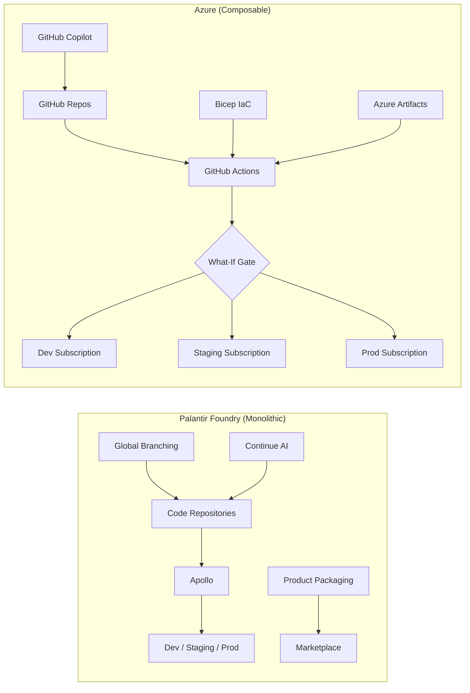
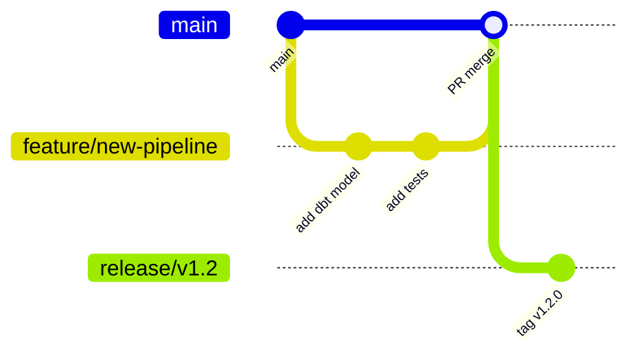
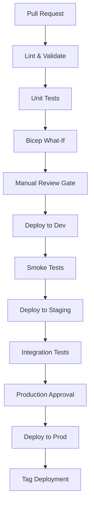
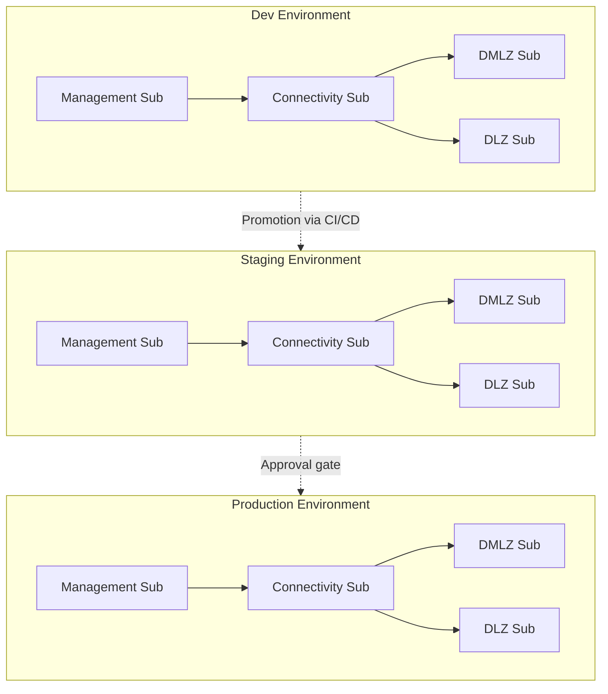

# DevOps & Deployment Migration: Foundry to Azure

**A technical deep-dive for platform engineers, DevOps leads, and release managers migrating from Palantir Foundry's Apollo and Code Repositories to Azure-native CI/CD, Infrastructure as Code, and developer tooling.**

---

## Executive summary

Palantir Foundry bundles deployment management (Apollo), source control (Code Repositories), AI-assisted coding (Continue), and multi-environment orchestration into a single proprietary platform. This tight coupling simplifies initial setup but creates deep operational lock-in: deployment runbooks, branching strategies, package distribution, and developer workflows are all Foundry-specific and non-portable.

Azure replaces this monolithic model with a composable toolchain -- GitHub (or Azure DevOps) for source control and CI/CD, Bicep for Infrastructure as Code, Azure Artifacts for package management, and GitHub Copilot for AI-assisted development. Each component is independently replaceable, standards-based, and backed by a global ecosystem of tooling, talent, and community support.

This guide walks through every Foundry DevOps capability, maps it to its Azure equivalent, and provides working code examples drawn from CSA-in-a-Box's own deployment infrastructure.

---

## Foundry DevOps model overview

Foundry's DevOps capabilities are organized around two core systems:

**Apollo** is Palantir's deployment management platform. It handles continuous delivery of Foundry services across customer environments, including zero-downtime upgrades, service orchestration, rollback, and multi-environment promotion. Apollo is deeply integrated with Foundry's internal service architecture and is not exposed as a general-purpose deployment tool -- customers configure it through Foundry's administrative interface, not through code.

**Code Repositories** is Foundry's built-in development environment. It provides a web-based IDE with Git version control, branching, pull requests, CI/CD checks, IntelliSense, and library management. Code Repositories supports Python, Java, SQL, and TypeScript transforms. Critically, Code Repositories uses Foundry-specific decorators, build systems, and dependency resolution -- standard Git workflows do not apply.

Supporting capabilities include:

| Foundry capability     | What it does                                                                                    |
| ---------------------- | ----------------------------------------------------------------------------------------------- |
| Global Branching       | Coordinates branches across multiple resources (pipelines, Ontology, apps) for isolated testing |
| Product packaging      | Bundles pipelines, Ontology resources, apps, and models into installable products               |
| Marketplace            | Storefront for discovering, installing, and managing packaged products                          |
| Upgrade Assistant      | Manages platform version upgrades and dependency migrations                                     |
| Environment management | Provides dev, staging, and production environments within the platform                          |
| VS Code Integration    | Palantir's VS Code extension for local development with platform connectivity                   |
| Continue               | AI-powered coding assistant integrated into Code Repositories                                   |

---

## Azure DevOps model comparison

Azure replaces Foundry's monolithic DevOps model with composable, standards-based components:

| Foundry capability     | Azure equivalent                                          | Key advantage                                                  |
| ---------------------- | --------------------------------------------------------- | -------------------------------------------------------------- |
| Apollo                 | GitHub Actions + Bicep IaC + Azure deployment slots       | Infrastructure defined as code, not configured through a UI    |
| Code Repositories      | GitHub / Azure Repos + VS Code                            | Industry-standard Git; 100M+ developer ecosystem               |
| Global Branching       | Git feature branches + GitHub environments + PR workflows | Standard Git branching; no proprietary coordination layer      |
| Product packaging      | Bicep modules + Helm charts + Azure Artifacts             | Open packaging standards; reusable across organizations        |
| Marketplace            | Azure Marketplace + Power Platform AppSource              | Global distribution; ISV monetization built in                 |
| Upgrade Assistant      | Azure Advisor + Azure Resource Graph + Dependabot         | Automated dependency updates; security vulnerability detection |
| Environment management | Azure subscriptions + resource groups + deployment slots  | True infrastructure isolation; RBAC at every level             |
| VS Code Integration    | VS Code + Azure extensions + GitHub Copilot               | Native VS Code; no proprietary plugin required                 |
| Continue               | GitHub Copilot + GitHub Copilot Workspace                 | Multi-model AI coding; works across all languages and repos    |

### Architecture comparison



The key architectural difference: Foundry's DevOps is a **platform feature** that you configure. Azure's DevOps is **code you own** -- every pipeline, every infrastructure definition, and every deployment strategy is version-controlled, reviewable, and portable.

---

## Apollo to GitHub Actions / Azure DevOps migration

### What Apollo does

Apollo manages the deployment lifecycle for Foundry services. It provides:

- Continuous delivery of service updates across environments
- Zero-downtime rolling upgrades
- Automatic rollback on failure detection
- Multi-environment promotion (dev to staging to production)
- Service health monitoring during deployments
- Configuration management across environments

Apollo operates as a black box -- customers interact with it through Foundry's administrative UI, not through code or APIs. Deployment strategies, rollback policies, and promotion rules are configured through the platform, not defined in version-controlled files.

### Why GitHub Actions is the replacement

GitHub Actions replaces Apollo with a transparent, code-defined deployment system. Every deployment strategy, environment gate, rollback trigger, and promotion rule is expressed in YAML files that are version-controlled alongside your infrastructure code. CSA-in-a-Box uses GitHub Actions for all deployments (see `.github/workflows/deploy.yml`).

### Migration steps

1. **Inventory Apollo configurations** -- Document current environment topology, promotion rules, rollback policies, and service dependencies from Foundry's administrative interface.

2. **Define environments in GitHub** -- Create GitHub environments matching your Foundry environments (dev, staging, prod). Configure protection rules, required reviewers, and deployment branches.

3. **Create workflow files** -- Translate Apollo's deployment sequences into GitHub Actions workflows. CSA-in-a-Box's `deploy.yml` provides a production-ready template.

4. **Implement OIDC authentication** -- Replace any Foundry service credentials with Azure OIDC federated credentials. This eliminates stored secrets for Azure authentication.

5. **Configure concurrency controls** -- Use GitHub Actions concurrency groups to prevent parallel deployments to the same environment, replicating Apollo's deployment locking.

6. **Set up deployment tagging** -- Implement deployment tags for rollback targeting, as CSA-in-a-Box does in the `tag-deployment` job.

### CSA-in-a-Box evidence: multi-environment deployment workflow

The following is drawn from CSA-in-a-Box's actual deployment workflow (`.github/workflows/deploy.yml`). It deploys infrastructure across four Azure subscriptions with what-if validation, environment gates, and deployment tagging:

```yaml
# .github/workflows/deploy.yml (simplified from CSA-in-a-Box)
name: Deploy Infrastructure

on:
    workflow_dispatch:
        inputs:
            environment:
                description: "Target environment"
                required: true
                type: choice
                options:
                    - dev
                    - test
                    - prod
            dry_run:
                description: "What-if mode (no actual deployment)"
                required: false
                type: boolean
                default: true

concurrency:
    group: deploy-${{ inputs.environment }}
    cancel-in-progress: false

permissions:
    id-token: write
    contents: read

jobs:
    validate:
        name: Validate Templates
        runs-on: ubuntu-latest
        timeout-minutes: 30
        steps:
            - uses: actions/checkout@v4

            - name: Azure Login (OIDC)
              uses: azure/login@v2
              with:
                  client-id: ${{ secrets.AZURE_CLIENT_ID }}
                  tenant-id: ${{ secrets.AZURE_TENANT_ID }}
                  subscription-id: ${{ secrets.AZURE_MGMT_SUBSCRIPTION_ID }}

            - name: Validate Bicep Templates
              run: |
                  bicep build deploy/bicep/DMLZ/main.bicep
                  bicep build deploy/bicep/DLZ/main.bicep

    deploy-dmlz:
        name: Deploy Data Management Landing Zone
        needs: validate
        runs-on: ubuntu-latest
        environment: ${{ inputs.environment }}
        steps:
            - uses: actions/checkout@v4

            - name: Azure Login
              uses: azure/login@v2
              with:
                  client-id: ${{ secrets.AZURE_CLIENT_ID }}
                  tenant-id: ${{ secrets.AZURE_TENANT_ID }}
                  subscription-id: ${{ secrets.AZURE_DMLZ_SUBSCRIPTION_ID }}

            - name: What-If / Deploy DMLZ
              run: |
                  MODE=""
                  if [ "${{ inputs.dry_run }}" = "true" ]; then MODE="--what-if"; fi
                  az deployment sub create \
                    --location eastus \
                    --template-file deploy/bicep/DMLZ/main.bicep \
                    --parameters deploy/bicep/DMLZ/params.${{ inputs.environment }}.json \
                    $MODE
```

**Apollo equivalent:** This workflow replaces Apollo's environment promotion, what-if analysis, and deployment orchestration -- but as auditable, version-controlled code.

---

## Code Repositories to GitHub migration

### What you are leaving behind

Foundry Code Repositories provides a tightly integrated development experience:

- Web-based IDE with IntelliSense for Foundry APIs
- Git-based version control (proprietary Git hosting)
- Branching and pull requests with CI/CD checks
- Foundry-specific dependency management (transforms library, Ontology SDK)
- Build system that produces Foundry-native artifacts
- Integrated code review and merge workflows

### What you are moving to

GitHub (or Azure Repos) provides industry-standard Git hosting with a vastly larger ecosystem:

| Feature               | Foundry Code Repos           | GitHub                                                    |
| --------------------- | ---------------------------- | --------------------------------------------------------- |
| Git hosting           | Proprietary (Foundry-hosted) | GitHub.com or GitHub Enterprise Server                    |
| Web IDE               | Built-in (limited)           | github.dev, Codespaces, VS Code for the Web               |
| Pull requests         | Foundry-specific             | Standard GitHub PRs with checks, reviews, CODEOWNERS      |
| CI/CD                 | Foundry checks system        | GitHub Actions (any language, any target)                 |
| Dependency management | Foundry transforms library   | pip, npm, Maven, NuGet -- any package manager             |
| Code search           | Foundry-scoped               | GitHub code search (cross-repo, regex, symbol)            |
| Secret scanning       | Not available                | GitHub Advanced Security (secret scanning, code scanning) |
| Developer ecosystem   | Palantir-specific            | 100M+ developers, 400M+ repositories                      |

### Migration steps

1. **Export Git history** -- Use Foundry's Git export (if available) or clone repositories through the Foundry VS Code extension. Preserve commit history where possible.

2. **Remove Foundry decorators** -- Strip Foundry-specific decorators (`@transform`, `@transform.using`, `@configure`) from Python code. Replace with standard PySpark, dbt SQL, or ADF pipeline definitions.

3. **Replace Foundry SDK imports** -- Replace `from transforms.api import transform, Input, Output` with standard library imports (`pyspark.sql`, `pandas`, `dbt`).

4. **Set up GitHub repository** -- Create a new GitHub repository (or Azure Repos repository). Push the cleaned code with full Git history.

5. **Configure branch protection** -- Set up branch protection rules on `main`: require pull request reviews, require status checks, require linear history.

6. **Add CI/CD workflows** -- Create GitHub Actions workflows for linting, testing, and deployment. See the CI/CD pipeline setup section below.

7. **Configure CODEOWNERS** -- Define code ownership for automated review assignment.

---

## Global Branching to Git branching strategies

### The Foundry problem

Foundry's Global Branching coordinates branches across multiple resources -- pipelines, Ontology definitions, applications, and datasets. When you create a branch in Foundry, it creates a parallel universe where all these resources can be modified together and tested in isolation before merging.

This solves a real problem: in Foundry, pipelines, Ontology, and apps are tightly coupled. You cannot test a pipeline change without also testing the Ontology changes it depends on.

### The Azure solution

In Azure, this coupling does not exist. Pipelines (dbt models, ADF definitions), infrastructure (Bicep), and applications (React, Power Apps) are independent codebases with independent deployment lifecycles. Standard Git branching handles each one.

**Recommended branching strategy: GitHub Flow + environment branches**



**Strategy mapping:**

| Foundry Global Branch pattern  | Azure equivalent                                   |
| ------------------------------ | -------------------------------------------------- |
| Feature branch (all resources) | Feature branch per repo (infra, data, app)         |
| Branch testing environment     | GitHub environment with PR-triggered deployment    |
| Branch merge (coordinated)     | PR merge per repo; dependency order enforced by CI |
| Branch-level permissions       | GitHub branch protection rules + CODEOWNERS        |

**For coordinated changes across repos** (e.g., a new dbt model requires a new Bicep resource), use linked pull requests with cross-repo status checks or a monorepo structure like CSA-in-a-Box.

---

## CI/CD pipeline setup with GitHub Actions

### Pipeline architecture

A complete CI/CD pipeline for a data platform migration replaces Apollo's deployment management and Code Repositories' build system:



### PR validation workflow

This workflow runs on every pull request to catch issues before merge -- replacing Foundry's Code Repositories CI checks:

```yaml
# .github/workflows/pr-validation.yml
name: PR Validation

on:
    pull_request:
        branches: [main]
        paths:
            - "deploy/bicep/**"
            - "transform/dbt/**"
            - ".github/workflows/**"

permissions:
    id-token: write
    contents: read
    pull-requests: write

jobs:
    lint:
        name: Lint & Validate
        runs-on: ubuntu-latest
        steps:
            - uses: actions/checkout@v4

            - name: Bicep Lint
              run: az bicep build --file deploy/bicep/DMLZ/main.bicep

            - name: PSRule for Azure
              uses: microsoft/ps-rule@v2
              with:
                  modules: PSRule.Rules.Azure
                  inputPath: deploy/bicep/

    what-if:
        name: What-If Analysis
        needs: lint
        runs-on: ubuntu-latest
        environment: dev
        steps:
            - uses: actions/checkout@v4

            - name: Azure Login (OIDC)
              uses: azure/login@v2
              with:
                  client-id: ${{ secrets.AZURE_CLIENT_ID }}
                  tenant-id: ${{ secrets.AZURE_TENANT_ID }}
                  subscription-id: ${{ secrets.AZURE_DEV_SUBSCRIPTION_ID }}

            - name: What-If
              run: |
                  az deployment sub what-if \
                    --location eastus \
                    --template-file deploy/bicep/DMLZ/main.bicep \
                    --parameters deploy/bicep/DMLZ/params.dev.json \
                    --no-pretty-print > what-if-output.txt

            - name: Post What-If to PR
              uses: actions/github-script@v7
              with:
                  script: |
                      const fs = require('fs');
                      const output = fs.readFileSync('what-if-output.txt', 'utf8');
                      github.rest.issues.createComment({
                        issue_number: context.issue.number,
                        owner: context.repo.owner,
                        repo: context.repo.repo,
                        body: `## Bicep What-If Results\n\`\`\`\n${output.substring(0, 60000)}\n\`\`\``
                      });

    dbt-test:
        name: dbt Tests
        runs-on: ubuntu-latest
        steps:
            - uses: actions/checkout@v4

            - name: Set up Python
              uses: actions/setup-python@v5
              with:
                  python-version: "3.11"

            - name: Install dbt
              run: pip install dbt-databricks

            - name: dbt compile & test
              run: |
                  cd transform/dbt
                  dbt compile --target ci
                  dbt test --target ci
```

### Government deployment workflow

CSA-in-a-Box includes a dedicated government deployment workflow (`.github/workflows/deploy-gov.yml`) that targets Azure Government regions with FedRAMP compliance checks:

```yaml
# Simplified from .github/workflows/deploy-gov.yml
env:
    AZURE_GOV_ENVIRONMENT: AzureUSGovernment

jobs:
    deploy:
        environment: gov-prod
        steps:
            - name: Azure Gov Login
              uses: azure/login@v2
              with:
                  client-id: ${{ secrets.AZURE_GOV_CLIENT_ID }}
                  tenant-id: ${{ secrets.AZURE_GOV_TENANT_ID }}
                  subscription-id: ${{ secrets.AZURE_GOV_SUBSCRIPTION_ID }}
                  environment: AzureUSGovernment

            - name: Deploy
              run: |
                  az deployment sub create \
                    --location usgovvirginia \
                    --template-file deploy/bicep/gov/main.bicep \
                    --parameters deploy/bicep/gov/params.gov-prod.json

            - name: Post FedRAMP Compliance Check
              run: |
                  echo "Checking encryption at rest..."
                  az resource list --resource-group "rg-csa-gov-prod-platform" \
                    --query "[?type=='Microsoft.Storage/storageAccounts'].{name:name,encryption:properties.encryption.services.blob.enabled}" \
                    --output table
```

---

## Infrastructure as Code with Bicep

### Why Bicep over Terraform for Foundry migrations

CSA-in-a-Box chose Bicep as its primary IaC language (see [ADR-0004](../../adr/0004-bicep-over-terraform.md)). Key factors for Foundry migrations:

- **Day-one Azure API coverage** -- New Azure resource types are available in Bicep immediately via ARM, while Terraform's AzureRM provider lags by weeks to months.
- **No state file** -- ARM is the state store, eliminating state-file custody problems that add compliance burden (especially relevant for FedRAMP environments).
- **Azure Government parity** -- Bicep uses the same ARM control plane across Commercial, Government, and sovereign clouds.
- **What-if built in** -- `az deployment sub what-if` replaces Apollo's deployment preview with a native, scriptable command.

### Bicep module organization

CSA-in-a-Box organizes Bicep modules by deployment layer, mirroring Azure's subscription topology:

```
deploy/bicep/
  landing-zone-alz/     # Azure Landing Zone (management + connectivity)
    main.bicep
    modules/
      networking/       # Hub/spoke VNets, peering, private DNS
      policy/           # Azure Policy definitions and assignments
      security/         # Key Vault, security center, Sentinel
      logging/          # Log Analytics, diagnostic settings
  DMLZ/                 # Data Management Landing Zone
    main.bicep
    modules/
      APIM/             # API Management
      KeyVault/         # Key Vault
      Purview/          # Purview (governance)
      OpenAI/           # Azure OpenAI
      Storage/          # Storage accounts
  DLZ/                  # Data Landing Zone
    main.bicep
    modules/
      databricks/       # Databricks workspaces
      datafactory/      # Data Factory
      synapse/          # Synapse Analytics
      storage/          # Data lake storage
      machinelearning/  # Azure ML workspaces
  gov/                  # Azure Government deployments
    main.bicep
    modules/
      dataFactory.bicep
      databricks.bicep
      keyVault.bicep
      purview.bicep
  shared/               # Cross-cutting modules
    modules/
      privateEndpoint.bicep
      roleAssignment.bicep
      networking/
      security/
      alerts/
```

### Example: private endpoint module

This reusable module from CSA-in-a-Box (`deploy/bicep/shared/modules/privateEndpoint.bicep`) replaces Apollo's network configuration management:

```bicep
// deploy/bicep/shared/modules/privateEndpoint.bicep (simplified)
@description('Name of the private endpoint')
param name string

@description('Location for the private endpoint')
param location string = resourceGroup().location

@description('Resource ID of the target resource')
param privateLinkServiceId string

@description('Group ID for the private link (e.g., blob, sqlServer)')
param groupId string

@description('Subnet resource ID for the private endpoint')
param subnetId string

@description('Private DNS zone resource ID for DNS registration')
param privateDnsZoneId string

resource privateEndpoint 'Microsoft.Network/privateEndpoints@2023-11-01' = {
  name: name
  location: location
  properties: {
    subnet: {
      id: subnetId
    }
    privateLinkServiceConnections: [
      {
        name: '${name}-connection'
        properties: {
          privateLinkServiceId: privateLinkServiceId
          groupIds: [groupId]
        }
      }
    ]
  }
}

resource dnsZoneGroup 'Microsoft.Network/privateEndpoints/privateDnsZoneGroups@2023-11-01' = {
  parent: privateEndpoint
  name: 'default'
  properties: {
    privateDnsZoneConfigs: [
      {
        name: 'config'
        properties: {
          privateDnsZoneId: privateDnsZoneId
        }
      }
    ]
  }
}
```

### Example: conditional deployment pattern

Bicep's conditional deployment replaces Apollo's feature flags for selective service deployment:

```bicep
// Conditional deployment -- deploy AI services only when requested
@description('Deploy AI services (Azure OpenAI, ML workspace)')
param deployAIServices bool = false

module openai 'modules/OpenAI/openai.bicep' = if (deployAIServices) {
  name: 'deploy-openai'
  scope: resourceGroup(rgName)
  params: {
    name: 'oai-${environmentPrefix}-${uniqueSuffix}'
    location: location
    skuName: 'S0'
    privateEndpointSubnetId: subnetId
    logAnalyticsWorkspaceId: logAnalyticsId
  }
}
```

---

## Environment management patterns

### Foundry vs Azure environment isolation

Foundry manages environments within the platform -- dev, staging, and production are logical partitions, not physically separate infrastructure. Apollo coordinates deployments across these environments.

Azure provides true infrastructure isolation through subscriptions and resource groups:

| Isolation level     | Foundry                | Azure                                               |
| ------------------- | ---------------------- | --------------------------------------------------- |
| Compute isolation   | Logical (shared infra) | Physical (separate subscriptions)                   |
| Network isolation   | Foundry-managed        | VNet isolation, private endpoints, NSGs             |
| Identity isolation  | Foundry roles          | Separate Entra ID groups per environment            |
| Data isolation      | Dataset permissions    | Separate storage accounts, separate encryption keys |
| Cost isolation      | Not available          | Separate subscriptions with budget alerts           |
| Compliance boundary | Platform-level         | Per-subscription Azure Policy assignments           |

### CSA-in-a-Box environment topology

CSA-in-a-Box deploys across four Azure subscriptions per environment, providing defense-in-depth isolation:



### GitHub environment configuration

GitHub environments replace Apollo's environment management with native protection rules:

```yaml
# In your workflow, reference environments for deployment gates
jobs:
    deploy-staging:
        environment:
            name: staging
            url: https://portal.azure.com
        steps:
            - name: Deploy
              run: az deployment sub create ...

    deploy-production:
        environment:
            name: production
            url: https://portal.azure.com
        needs: deploy-staging
        steps:
            - name: Deploy
              run: az deployment sub create ...
```

Configure each GitHub environment with:

- **Required reviewers** -- 1-2 approvers for staging, 2-3 for production
- **Wait timer** -- Optional delay between staging and production (e.g., 30 minutes)
- **Deployment branches** -- Restrict production deployments to `main` or `release/*`
- **Environment secrets** -- Separate Azure credentials per environment (OIDC client IDs, subscription IDs)

---

## Product packaging to Azure Artifacts / managed solutions

### Foundry product packaging

Foundry lets you bundle pipelines, Ontology resources, applications, and models into installable "products" distributed through the Marketplace. This is a proprietary packaging format with no external equivalent.

### Azure alternatives

| Foundry concept          | Azure equivalent                 | Use case                                            |
| ------------------------ | -------------------------------- | --------------------------------------------------- |
| Product package          | Bicep module + parameter files   | Infrastructure + configuration as a deployable unit |
| Marketplace distribution | Azure Marketplace / AppSource    | Public or private distribution to other tenants     |
| Internal distribution    | Azure Artifacts feed             | Private package registry for internal teams         |
| Versioned bundles        | Container images + Helm charts   | Application packaging with semantic versioning      |
| Install/upgrade          | `az deployment` + GitHub Actions | Automated deployment from artifact feeds            |

### Bicep module registry pattern

Publish reusable Bicep modules to Azure Container Registry, replacing Foundry's internal package distribution:

```bicep
// Consuming a module from a private Bicep registry
module dataLandingZone 'br:csainbox.azurecr.io/bicep/dlz:v1.2.0' = {
  name: 'deploy-dlz'
  params: {
    environmentPrefix: 'prod'
    location: 'eastus'
    enableDatabricks: true
    enableSynapse: false
  }
}
```

Publish modules in CI/CD:

```yaml
# .github/workflows/publish-modules.yml
jobs:
    publish:
        runs-on: ubuntu-latest
        steps:
            - uses: actions/checkout@v4

            - name: Azure Login
              uses: azure/login@v2
              with:
                  client-id: ${{ secrets.AZURE_CLIENT_ID }}
                  tenant-id: ${{ secrets.AZURE_TENANT_ID }}
                  subscription-id: ${{ secrets.AZURE_MGMT_SUBSCRIPTION_ID }}

            - name: Publish Bicep Module
              run: |
                  VERSION=$(cat VERSION)
                  az bicep publish \
                    --file deploy/bicep/DLZ/main.bicep \
                    --target "br:csainbox.azurecr.io/bicep/dlz:v${VERSION}"
```

---

## Zero-downtime deployment patterns

### How Apollo handles zero-downtime

Apollo performs rolling updates of Foundry services, monitoring health checks and automatically rolling back on failure. This is opaque to the customer -- you configure the desired state, and Apollo manages the transition.

### Azure zero-downtime strategies

Azure provides multiple zero-downtime patterns, each appropriate for different workload types:

**1. Deployment slots (App Service, Function Apps)**

```bicep
// Blue-green deployment with deployment slots
resource appService 'Microsoft.Web/sites@2023-12-01' = {
  name: appServiceName
  location: location
  properties: {
    siteConfig: {
      appSettings: [
        { name: 'SLOT_SETTING', value: 'production' }
      ]
    }
  }
}

resource stagingSlot 'Microsoft.Web/sites/slots@2023-12-01' = {
  parent: appService
  name: 'staging'
  location: location
  properties: {
    siteConfig: {
      appSettings: [
        { name: 'SLOT_SETTING', value: 'staging' }
      ]
    }
  }
}
```

**2. AKS rolling updates (containerized workloads)**

```yaml
# Kubernetes rolling update strategy
apiVersion: apps/v1
kind: Deployment
metadata:
    name: data-api
spec:
    replicas: 3
    strategy:
        type: RollingUpdate
        rollingUpdate:
            maxUnavailable: 1
            maxSurge: 1
    template:
        spec:
            containers:
                - name: data-api
                  image: csainbox.azurecr.io/data-api:v1.2.0
                  readinessProbe:
                      httpGet:
                          path: /health
                          port: 8080
                      initialDelaySeconds: 10
                      periodSeconds: 5
```

**3. Bicep what-if + incremental deployment (infrastructure)**

Azure Resource Manager deployments are inherently incremental -- existing resources are updated in place, not destroyed and recreated. The `what-if` command (used in CSA-in-a-Box's deploy workflow) previews changes before applying them.

---

## Rollback strategies

### Apollo rollback

Apollo provides one-click rollback to a previous service version. The rollback target is selected from Apollo's deployment history, and the platform orchestrates the transition.

### Azure rollback patterns

**1. Git-based rollback (revert the deployment commit)**

The simplest and most auditable rollback: revert the PR that introduced the change, triggering a new deployment of the previous state.

```bash
# Revert the problematic commit
git revert <commit-sha>
git push origin main
# GitHub Actions redeploys the previous known-good state
```

**2. Tag-based rollback (CSA-in-a-Box pattern)**

CSA-in-a-Box tags every successful deployment. To roll back, redeploy from the tagged commit:

```yaml
# CSA-in-a-Box tags successful deployments for rollback targeting
# Tag format: deploy/<environment>-<short-sha>-<run-number>
- name: Create deployment tag
  run: |
      SHORT_SHA=$(git rev-parse --short HEAD)
      TAG="deploy/${{ inputs.environment }}-${SHORT_SHA}-${{ github.run_number }}"
      git tag -a "$TAG" -m "Deployed by ${{ github.actor }}"
      git push origin "$TAG"
```

To roll back, trigger the deployment workflow at the desired tag:

```bash
# List recent deployment tags
git tag --list 'deploy/prod-*' --sort=-creatordate | head -5

# Trigger rollback deployment from the GitHub CLI
gh workflow run deploy.yml \
  --ref deploy/prod-abc1234-42 \
  -f environment=prod \
  -f dry_run=false
```

**3. ARM deployment rollback (infrastructure)**

Azure maintains a deployment history at the subscription and resource group level:

```bash
# List recent deployments
az deployment sub list --query "[].{name:name, state:properties.provisioningState, timestamp:properties.timestamp}" -o table

# Redeploy a previous deployment by name
az deployment sub create \
  --location eastus \
  --template-file deploy/bicep/DMLZ/main.bicep \
  --parameters @deploy/bicep/DMLZ/params.prod.json
```

---

## Developer tooling migration

### Foundry developer experience vs Azure

| Capability          | Foundry                                     | Azure                                           |
| ------------------- | ------------------------------------------- | ----------------------------------------------- |
| IDE                 | Code Repositories (web) + VS Code extension | VS Code (native) + any JetBrains IDE            |
| AI coding assistant | Continue                                    | GitHub Copilot (multi-model, cross-language)    |
| Local development   | Limited (VS Code extension)                 | Full local development with emulators           |
| Debugging           | Foundry-specific debugger                   | Standard debuggers (Python, Node, .NET)         |
| Package management  | Foundry library management                  | pip, npm, Maven, NuGet, Cargo                   |
| Code review         | Foundry pull requests                       | GitHub PRs with CODEOWNERS, status checks       |
| Secret management   | Foundry secrets                             | Azure Key Vault + GitHub Secrets                |
| Notebooks           | Foundry notebooks                           | Databricks notebooks, Fabric notebooks, Jupyter |

### VS Code setup for Azure development

Replace the Palantir VS Code extension with Azure-native extensions:

**Essential extensions:**

- **Azure Account** -- Authentication and subscription management
- **Azure Resources** -- Browse and manage Azure resources
- **Bicep** -- IntelliSense, validation, and visualization for Bicep files
- **Azure Pipelines / GitHub Actions** -- Workflow authoring support
- **GitHub Copilot** -- AI-powered code completion and chat
- **GitHub Copilot Chat** -- Conversational AI for code explanation, debugging, and generation
- **Python** + **Pylance** -- Python development (replacing Foundry's Python support)
- **dbt Power User** -- dbt model development and testing

### GitHub Copilot vs Foundry Continue

GitHub Copilot replaces Foundry's Continue AI coding assistant with broader capabilities:

| Feature             | Foundry Continue         | GitHub Copilot                                                           |
| ------------------- | ------------------------ | ------------------------------------------------------------------------ |
| Code completion     | Foundry-specific context | Any language, any framework, any repo                                    |
| Chat interface      | Integrated in Code Repos | VS Code, JetBrains, CLI, GitHub.com                                      |
| Multi-model         | Single model             | GPT-4o, Claude, Gemini (model selection)                                 |
| Workspace agents    | Not available            | GitHub Copilot Workspace (multi-file edits)                              |
| Custom instructions | Limited                  | Repository-level custom instructions (`.github/copilot-instructions.md`) |
| Enterprise controls | Platform-managed         | GitHub Copilot Business/Enterprise policies                              |

---

## Common pitfalls and how to avoid them

### 1. Treating Azure DevOps as a 1:1 Apollo replacement

**Pitfall:** Teams try to replicate Apollo's exact behavior in GitHub Actions, creating overly complex workflows that fight the platform.

**Solution:** Embrace the composable model. Azure's strength is that each component (Git, CI/CD, IaC, monitoring) is independent. Design workflows around this independence rather than trying to recreate Foundry's monolithic coordination.

### 2. Ignoring the state-management difference

**Pitfall:** Teams accustomed to Apollo's stateful deployment tracking expect Azure deployments to maintain equivalent state. They add unnecessary state-tracking databases or custom dashboards.

**Solution:** ARM is the state store. Use `az deployment list`, Azure Resource Graph, and deployment tags for deployment history. Do not build custom state management.

### 3. Over-engineering environment promotion

**Pitfall:** Teams build complex promotion pipelines that mimic Apollo's automatic promotion, including custom artifact registries and multi-step approval chains.

**Solution:** Use GitHub environments with protection rules. A simple workflow with `environment: production` and required reviewers provides the same control with far less complexity.

### 4. Neglecting OIDC authentication

**Pitfall:** Teams store Azure service principal credentials as GitHub secrets, creating a credential rotation burden and security risk.

**Solution:** Use OIDC federated credentials (workload identity federation). CSA-in-a-Box uses OIDC exclusively -- no stored credentials for Azure authentication. See `permissions: id-token: write` in the workflow examples above.

### 5. Not using what-if before deployment

**Pitfall:** Teams deploy Bicep templates directly without previewing changes, leading to unexpected resource modifications or deletions.

**Solution:** Always run `az deployment sub what-if` before deployment. CSA-in-a-Box's `deploy.yml` includes a `dry_run` toggle that defaults to `true`, ensuring every deployment is previewed first.

### 6. Copying Foundry's Global Branching into Git

**Pitfall:** Teams try to coordinate branches across multiple repositories to replicate Foundry's Global Branching behavior, creating brittle cross-repo dependencies.

**Solution:** Use a monorepo (like CSA-in-a-Box) or accept that independent repos have independent release cycles. Cross-repo coordination belongs in CI/CD (e.g., triggering downstream workflows), not in branching strategy.

### 7. Skipping post-deployment validation

**Pitfall:** Teams deploy and move on without verifying the deployment succeeded. Apollo handles health checks automatically; in Azure, you must implement them.

**Solution:** Add post-deployment validation jobs. CSA-in-a-Box's deploy workflow includes `post-deploy` (resource group verification, network connectivity checks, DNS validation) and `smoke-test` (data contract validation, Gold layer table verification) jobs.

### 8. Underestimating the cultural shift

**Pitfall:** Teams expect the Foundry-to-Azure DevOps migration to be purely technical. It is not. Foundry's managed deployment model means teams have never owned their CI/CD. Moving to GitHub Actions requires DevOps skills that may not exist on the team.

**Solution:** Invest in training. Start with CSA-in-a-Box's existing workflows as templates. Assign a DevOps champion to own the pipeline code. Consider GitHub's professional services or a Microsoft partner for the initial setup.

---

## Migration checklist

Use this checklist to track your DevOps migration progress:

- [ ] Inventory all Apollo deployment configurations and environment topologies
- [ ] Export all code from Foundry Code Repositories (preserve Git history)
- [ ] Remove Foundry-specific decorators and SDK imports from code
- [ ] Create GitHub repository with branch protection rules
- [ ] Set up OIDC federated credentials for Azure authentication
- [ ] Create GitHub environments (dev, staging, prod) with protection rules
- [ ] Implement PR validation workflow (lint, test, what-if)
- [ ] Implement deployment workflow (validate, deploy, verify, tag)
- [ ] Migrate Foundry secrets to Azure Key Vault + GitHub Secrets
- [ ] Configure CODEOWNERS for automated review assignment
- [ ] Set up Dependabot for dependency updates (replacing Upgrade Assistant)
- [ ] Install Azure and GitHub Copilot VS Code extensions
- [ ] Run parallel deployments (Foundry + Azure) during transition period
- [ ] Validate rollback procedures in dev and staging
- [ ] Decommission Foundry Code Repositories and Apollo configurations

---

## CSA-in-a-Box evidence paths

| Evidence                    | Path                                    | Relevance                                                                                                |
| --------------------------- | --------------------------------------- | -------------------------------------------------------------------------------------------------------- |
| Primary deployment workflow | `.github/workflows/deploy.yml`          | Multi-subscription Bicep deployment with what-if, environment gates, smoke tests, and deployment tagging |
| Government deployment       | `.github/workflows/deploy-gov.yml`      | Azure Government deployment with FedRAMP compliance checks                                               |
| Portal deployment           | `.github/workflows/deploy-portal.yml`   | Application deployment workflow                                                                          |
| dbt deployment              | `.github/workflows/deploy-dbt.yml`      | Data transformation CI/CD                                                                                |
| Bicep modules (DMLZ)        | `deploy/bicep/DMLZ/`                    | Data Management Landing Zone infrastructure                                                              |
| Bicep modules (DLZ)         | `deploy/bicep/DLZ/`                     | Data Landing Zone infrastructure                                                                         |
| Bicep modules (ALZ)         | `deploy/bicep/landing-zone-alz/`        | Azure Landing Zone (networking, policy, security)                                                        |
| Bicep modules (Gov)         | `deploy/bicep/gov/`                     | Government-specific infrastructure                                                                       |
| Shared modules              | `deploy/bicep/shared/modules/`          | Reusable components (private endpoints, networking, RBAC)                                                |
| IaC best practices          | `docs/IaC-CICD-Best-Practices.md`       | Comprehensive Bicep and GitHub Actions guide                                                             |
| ADR: Bicep over Terraform   | `docs/adr/0004-bicep-over-terraform.md` | Decision rationale for Bicep as primary IaC                                                              |

---

## Further reading

- [IaC & CI/CD Best Practices for CSA-in-a-Box](../../IaC-CICD-Best-Practices.md) -- Comprehensive guide covering Bicep module organization, OIDC authentication, PSRule scanning, ring-based deployments, and policy-as-code
- [ADR 0004: Bicep over Terraform](../../adr/0004-bicep-over-terraform.md) -- Decision rationale with pros/cons analysis
- [Vendor Lock-In Analysis](vendor-lock-in-analysis.md) -- Why Foundry's DevOps model creates operational lock-in
- [Migration Playbook](../palantir-foundry.md) -- End-to-end migration planning
- [Microsoft Learn: GitHub Actions for Azure](https://learn.microsoft.com/azure/developer/github/github-actions) -- Official documentation
- [Microsoft Learn: Bicep documentation](https://learn.microsoft.com/azure/azure-resource-manager/bicep/) -- Bicep language reference
- [GitHub Actions documentation](https://docs.github.com/actions) -- Workflow syntax and features

---

**Last updated:** 2026-04-30
**Maintainers:** CSA-in-a-Box core team
