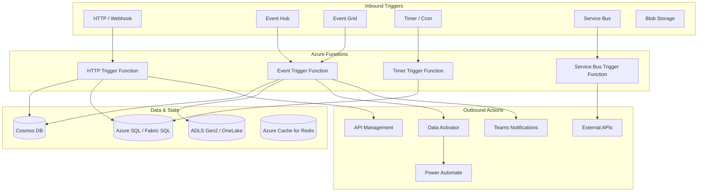

# Functions Migration: Palantir Foundry to Azure

**A deep-dive technical guide for platform engineers and developers migrating Foundry Functions, Actions, Compute Modules, and automation capabilities to Azure Functions, Event Grid, Data Activator, and AKS.**

---

## Executive summary

Palantir Foundry consolidates serverless compute, ontology mutations, external integrations, and automation into a single proprietary runtime. TypeScript and Python functions run inside Foundry's managed compute, tightly coupled to the Ontology SDK. Actions orchestrate state changes. Compute Modules provide containerized custom runtimes. Automate chains triggers, conditions, and actions.

Azure provides the same capabilities through composable, open-standards services: Azure Functions for serverless compute, Event Grid for event routing, Data Activator for reactive rules, Power Automate for workflow automation, and AKS/Container Apps for containerized workloads. Each service is independently scalable, governed by Azure RBAC and Entra ID, and deployable via Infrastructure as Code.

This guide maps every Foundry function capability to its Azure equivalent, provides before/after code examples, and references working implementations in the CSA-in-a-Box codebase.

---

## 1. Foundry Functions architecture overview

Foundry Functions operate within a closed compute environment managed by the platform. All function types share a common execution model: they run on Foundry-managed infrastructure, authenticate through the Foundry token, and interact with the Ontology through the OSDK.

### Function types and capabilities

| Foundry capability      | Runtime            | Key features                                                   | Lock-in risk           |
| ----------------------- | ------------------ | -------------------------------------------------------------- | ---------------------- |
| TypeScript v2 Functions | Node.js            | OSDK queries/edits, interfaces, configurable resources         | High (OSDK dependency) |
| TypeScript v1 Functions | Node.js            | Webhooks, functions-on-models, BYOM                            | High                   |
| Python Functions        | Python             | Ontology objects/edits, Pipeline Builder integration           | High                   |
| Ontology SQL            | SQL                | Read-only parameterized queries over object types              | Medium                 |
| Function-backed columns | TypeScript/Python  | Derived properties computed on-the-fly                         | High                   |
| Function-backed actions | TypeScript/Python  | Ontology-editing functions implementing action logic           | High                   |
| External Functions      | TypeScript         | Call external REST APIs from within Foundry                    | Medium                 |
| Webhooks                | HTTP               | Receive inbound HTTP calls from external systems               | Low                    |
| Compute Modules         | Container          | BYO compute for custom runtimes, models, apps                  | Medium                 |
| Actions                 | Config + Functions | State-changing operations with parameters, rules, side effects | High                   |
| Automate                | Config + Triggers  | Trigger-based automation executing actions/functions           | Medium                 |

### Foundry execution model

```
External System                Foundry Platform
      |                              |
      |--- Webhook / API call ------>|
      |                              |---> Function Runtime (Node.js / Python)
      |                              |       |
      |                              |       |---> OSDK: Query Ontology
      |                              |       |---> OSDK: Edit Objects
      |                              |       |---> External API call
      |                              |       |
      |                              |<--- Return result / side effects
      |<--- Response ----------------|
```

The critical observation is that **every function is coupled to the Ontology SDK**. Migrating functions requires replacing OSDK calls with Azure-native data access patterns (Cosmos DB SDK, SQL queries, Fabric REST API, etc.).

---

## 2. Azure Functions architecture

Azure Functions provides the primary serverless compute layer, complemented by Event Grid for routing, Data Activator for reactive intelligence, and Power Automate for business-user automation.

### Architecture diagram



### CSA-in-a-Box evidence

The CSA-in-a-Box platform includes working Azure Functions implementations:

| Function               | Path                                      | Purpose                                                        |
| ---------------------- | ----------------------------------------- | -------------------------------------------------------------- |
| Event processing       | `csa_platform/functions/eventProcessing/` | Event Hub trigger, Cosmos DB output, batch processing          |
| AI enrichment          | `csa_platform/functions/aiEnrichment/`    | HTTP trigger for AI-powered data enrichment                    |
| Validation             | `csa_platform/functions/validation/`      | PII detection, quality validation, schema validation           |
| Secret rotation        | `csa_platform/functions/secretRotation/`  | Timer trigger for credential lifecycle                         |
| Data Activator rules   | `csa_platform/data_activator/rules/`      | YAML-driven rule engine with aggregation and anomaly detection |
| Data Activator actions | `csa_platform/data_activator/actions/`    | Teams notifications, dead-letter queues, retry logic           |

---

## 3. TypeScript function migration

### Foundry TypeScript v2 function (before)

```typescript
// Foundry: TypeScript v2 Function querying Ontology objects
import {
    Function,
    Edits,
    OntologyEditFunction,
    Integer,
} from "@foundry/functions-api";
import { Objects, FlightAlert, FlightAlertStatus } from "@foundry/ontology-api";

export class FlightAlertFunctions {
    // Query function: find overdue alerts
    @Function()
    public getOverdueAlerts(thresholdHours: Integer): FlightAlert[] {
        const cutoff = new Date();
        cutoff.setHours(cutoff.getHours() - thresholdHours);

        return Objects.search()
            .flightAlert()
            .filter((alert) =>
                alert.status
                    .isEqualTo(FlightAlertStatus.OPEN)
                    .and(alert.createdAt.isBefore(cutoff)),
            )
            .orderBy((alert) => alert.createdAt.asc())
            .take(100);
    }

    // Edit function: escalate an alert
    @Edits(FlightAlert)
    @OntologyEditFunction()
    public escalateAlert(alert: FlightAlert, reason: string): void {
        alert.status = FlightAlertStatus.ESCALATED;
        alert.escalationReason = reason;
        alert.escalatedAt = new Date();
    }
}
```

### Azure Functions equivalent (after)

```typescript
// Azure: HTTP-triggered function querying Cosmos DB
import {
    app,
    HttpRequest,
    HttpResponseInit,
    InvocationContext,
} from "@azure/functions";
import { CosmosClient } from "@azure/cosmos";
import { DefaultAzureCredential } from "@azure/identity";

const credential = new DefaultAzureCredential();
const cosmos = new CosmosClient({
    endpoint: process.env.COSMOS_ENDPOINT!,
    aadCredentials: credential,
});
const container = cosmos.database("operations").container("flight-alerts");

// Query function: find overdue alerts
app.http("getOverdueAlerts", {
    methods: ["GET"],
    authLevel: "function",
    route: "alerts/overdue",
    handler: async (
        request: HttpRequest,
        context: InvocationContext,
    ): Promise<HttpResponseInit> => {
        const thresholdHours = Number(
            request.query.get("thresholdHours") ?? "24",
        );
        const cutoff = new Date();
        cutoff.setHours(cutoff.getHours() - thresholdHours);

        const { resources } = await container.items
            .query({
                query: `SELECT TOP 100 * FROM c
                WHERE c.status = 'OPEN'
                AND c.createdAt < @cutoff
                ORDER BY c.createdAt ASC`,
                parameters: [{ name: "@cutoff", value: cutoff.toISOString() }],
            })
            .fetchAll();

        return { status: 200, jsonBody: resources };
    },
});

// Edit function: escalate an alert
app.http("escalateAlert", {
    methods: ["POST"],
    authLevel: "function",
    route: "alerts/{alertId}/escalate",
    handler: async (
        request: HttpRequest,
        context: InvocationContext,
    ): Promise<HttpResponseInit> => {
        const alertId = request.params.alertId;
        const { reason } = (await request.json()) as { reason: string };

        const { resource: alert } = await container
            .item(alertId, alertId)
            .read();

        if (!alert) {
            return { status: 404, jsonBody: { error: "Alert not found" } };
        }

        alert.status = "ESCALATED";
        alert.escalationReason = reason;
        alert.escalatedAt = new Date().toISOString();

        await container.item(alertId, alertId).replace(alert);

        return { status: 200, jsonBody: alert };
    },
});
```

### Key migration patterns for TypeScript

| Foundry pattern                 | Azure equivalent                                | Notes                                                   |
| ------------------------------- | ----------------------------------------------- | ------------------------------------------------------- |
| `Objects.search().objectType()` | Cosmos DB SQL query or Fabric SQL endpoint      | Replace OSDK queries with parameterized SQL             |
| `@Edits(ObjectType)` decorator  | Direct Cosmos DB `replace()` / `upsert()`       | Use transactions for multi-document updates             |
| `@Function()` decorator         | `app.http()` / `app.eventHub()` registration    | Azure Functions v4 programming model                    |
| `alert.property = value`        | `alert.property = value` + explicit `replace()` | Foundry auto-persists; Azure requires explicit write    |
| Ontology `.filter()` chains     | Cosmos DB SQL `WHERE` clauses                   | Convert filter chains to parameterized SQL              |
| Interface-based queries         | Cosmos DB cross-partition queries               | Use container-level queries with partition key strategy |
| Configurable resources          | App Settings + Key Vault references             | `@Microsoft.KeyVault(SecretUri=...)` in app settings    |

---

## 4. Python function migration

### Foundry Python function (before)

```python
# Foundry: Python function for data enrichment
from functions.api import function, OntologyEdits
from ontology import FlightRecord, RiskAssessment


@function()
def assess_flight_risk(
    flight: FlightRecord,
) -> RiskAssessment:
    """Compute risk score for a flight record."""
    score = 0.0

    if flight.delay_hours and flight.delay_hours > 4:
        score += 30.0
    if flight.weather_severity and flight.weather_severity > 7:
        score += 25.0
    if flight.crew_fatigue_index and flight.crew_fatigue_index > 0.8:
        score += 20.0
    if flight.maintenance_overdue:
        score += 25.0

    return RiskAssessment(
        flight_id=flight.flight_id,
        risk_score=min(score, 100.0),
        risk_level="HIGH" if score >= 70 else "MEDIUM" if score >= 40 else "LOW",
        assessed_at=datetime.now(timezone.utc),
    )


@function(edits=OntologyEdits)
def batch_assess_and_update(flights: list[FlightRecord]) -> None:
    """Assess all flights and update risk fields in the Ontology."""
    for flight in flights:
        assessment = assess_flight_risk(flight)
        flight.risk_score = assessment.risk_score
        flight.risk_level = assessment.risk_level
        flight.last_assessed = assessment.assessed_at
```

### Azure Functions equivalent (after)

```python
# Azure: Python function for data enrichment
# See: csa_platform/functions/aiEnrichment/functions/function_app.py
import json
import os
from datetime import datetime, timezone

import azure.functions as func
from azure.cosmos import CosmosClient
from azure.identity import DefaultAzureCredential

app = func.FunctionApp()

credential = DefaultAzureCredential()
cosmos = CosmosClient(os.environ["COSMOS_ENDPOINT"], credential)
container = cosmos.get_database_client("operations").get_container_client(
    "flight-records"
)


@app.route(route="flights/{flight_id}/risk", methods=["GET"], auth_level=func.AuthLevel.FUNCTION)
async def assess_flight_risk(req: func.HttpRequest) -> func.HttpResponse:
    """Compute risk score for a single flight record."""
    flight_id = req.route_params.get("flight_id")
    flight = container.read_item(item=flight_id, partition_key=flight_id)

    score = 0.0
    if flight.get("delay_hours", 0) > 4:
        score += 30.0
    if flight.get("weather_severity", 0) > 7:
        score += 25.0
    if flight.get("crew_fatigue_index", 0) > 0.8:
        score += 20.0
    if flight.get("maintenance_overdue", False):
        score += 25.0

    assessment = {
        "flight_id": flight_id,
        "risk_score": min(score, 100.0),
        "risk_level": "HIGH" if score >= 70 else "MEDIUM" if score >= 40 else "LOW",
        "assessed_at": datetime.now(timezone.utc).isoformat(),
    }

    return func.HttpResponse(json.dumps(assessment), mimetype="application/json")


@app.timer_trigger(schedule="0 0 */2 * * *", arg_name="timer", run_on_startup=False)
async def batch_assess_flights(timer: func.TimerRequest) -> None:
    """Batch risk assessment — runs every 2 hours.

    Queries all flights needing assessment, computes risk, and
    writes results back to Cosmos DB.
    """
    query = "SELECT * FROM c WHERE c.risk_level IS NULL OR c.last_assessed < @cutoff"
    cutoff = datetime.now(timezone.utc).isoformat()

    flights = list(
        container.query_items(
            query=query,
            parameters=[{"name": "@cutoff", "value": cutoff}],
            enable_cross_partition_query=True,
        )
    )

    for flight in flights:
        score = 0.0
        if flight.get("delay_hours", 0) > 4:
            score += 30.0
        if flight.get("weather_severity", 0) > 7:
            score += 25.0
        if flight.get("crew_fatigue_index", 0) > 0.8:
            score += 20.0
        if flight.get("maintenance_overdue", False):
            score += 25.0

        flight["risk_score"] = min(score, 100.0)
        flight["risk_level"] = (
            "HIGH" if score >= 70 else "MEDIUM" if score >= 40 else "LOW"
        )
        flight["last_assessed"] = datetime.now(timezone.utc).isoformat()

        container.upsert_item(flight)
```

### Key migration patterns for Python

| Foundry pattern                   | Azure equivalent                        | Notes                                                                                |
| --------------------------------- | --------------------------------------- | ------------------------------------------------------------------------------------ |
| `@function()` decorator           | `@app.route()` / `@app.timer_trigger()` | Azure Functions v2 Python model                                                      |
| `from ontology import ObjectType` | Cosmos DB / SQL SDK client              | Replace Ontology imports with SDK clients                                            |
| `flight.property` (typed access)  | `flight.get("property")` (dict access)  | Azure uses standard Python dicts                                                     |
| `edits=OntologyEdits`             | `container.upsert_item()`               | Explicit persistence required                                                        |
| Ontology object references        | Cosmos DB document IDs + partition keys | Design partition key strategy upfront                                                |
| Pipeline Builder integration      | Fabric notebook / ADF activity          | Python functions in Foundry pipelines become notebook cells or ADF custom activities |

---

## 5. Function-backed columns to Power BI measures

Foundry function-backed columns are derived properties computed on-the-fly when an object is read. The Azure equivalent depends on the consumption pattern: Power BI DAX measures for analytics, Fabric computed columns for lakehouse tables, or Cosmos DB change-feed processors for materialized views.

### Foundry function-backed column (before)

```typescript
// Foundry: function-backed column computing urgency level
import { Function, Integer } from "@foundry/functions-api";

export class DerivedProperties {
    @Function()
    public getUrgencyLevel(delayHours: Integer): string {
        if (delayHours >= 12) return "CRITICAL";
        if (delayHours >= 6) return "HIGH";
        if (delayHours >= 2) return "MEDIUM";
        return "LOW";
    }

    @Function()
    public getEstimatedCost(
        delayHours: Integer,
        passengerCount: Integer,
        aircraftType: string,
    ): number {
        const hourlyRate = aircraftType === "wide-body" ? 15000 : 8000;
        const passengerCompensation =
            delayHours >= 3 ? passengerCount * 250 : 0;
        return delayHours * hourlyRate + passengerCompensation;
    }
}
```

### Power BI DAX measure (after)

```dax
// Power BI: DAX measure for urgency level
Urgency Level =
SWITCH(
    TRUE(),
    [Delay Hours] >= 12, "CRITICAL",
    [Delay Hours] >= 6,  "HIGH",
    [Delay Hours] >= 2,  "MEDIUM",
    "LOW"
)

// Power BI: DAX measure for estimated cost
Estimated Cost =
VAR HourlyRate =
    IF([Aircraft Type] = "wide-body", 15000, 8000)
VAR PassengerCompensation =
    IF([Delay Hours] >= 3, [Passenger Count] * 250, 0)
RETURN
    [Delay Hours] * HourlyRate + PassengerCompensation

// Power BI: Conditional formatting color
Urgency Color =
SWITCH(
    [Urgency Level],
    "CRITICAL", "#DC2626",
    "HIGH",     "#EA580C",
    "MEDIUM",   "#CA8A04",
    "#16A34A"
)
```

### Fabric computed column (alternative)

For cases where the derived value must be persisted in the lakehouse (not just computed at query time), use a Fabric notebook or dbt model:

```sql
-- dbt model: stg_flights_with_urgency.sql
SELECT
    *,
    CASE
        WHEN delay_hours >= 12 THEN 'CRITICAL'
        WHEN delay_hours >= 6  THEN 'HIGH'
        WHEN delay_hours >= 2  THEN 'MEDIUM'
        ELSE 'LOW'
    END AS urgency_level,
    delay_hours * IIF(aircraft_type = 'wide-body', 15000, 8000)
        + IIF(delay_hours >= 3, passenger_count * 250, 0)
        AS estimated_cost
FROM {{ ref('stg_flights') }}
```

### Decision guide: DAX vs computed column

| Factor              | DAX measure           | Computed column (dbt / notebook)      |
| ------------------- | --------------------- | ------------------------------------- |
| Computation timing  | At query time         | At ETL/transformation time            |
| Storage cost        | None                  | Column stored in Delta table          |
| Performance         | Fast for simple logic | Better for complex joins/aggregations |
| Real-time freshness | Always current        | Refreshed on schedule                 |
| Reusability         | Within Power BI only  | Available to all downstream consumers |

---

## 6. Action migration to Data Activator and Event Grid

Foundry Actions are state-changing operations with parameters, validation rules, submission criteria, and side effects (notifications, webhooks, data edits). Azure distributes these responsibilities across Event Grid (event routing), Data Activator (reactive rules), Power Automate (workflow), and Azure Functions (custom logic).

### Foundry Action definition (before)

```yaml
# Foundry: Action configuration
actionType:
    name: EscalateFlightDelay
    parameters:
        - name: flightAlert
          type: FlightAlert
          required: true
        - name: escalationLevel
          type: string
          enum: [SUPERVISOR, MANAGER, DIRECTOR]
          required: true
        - name: reason
          type: string
          required: true
    rules:
        - type: modification
          target: flightAlert
          field: status
          value: ESCALATED
        - type: modification
          target: flightAlert
          field: escalationLevel
          value: "{{escalationLevel}}"
    submissionCriteria:
        - condition: flightAlert.status == "OPEN"
          message: "Only open alerts can be escalated"
    sideEffects:
        - type: notification
          channel: email
          recipients: "{{escalationLevel}}_group@agency.gov"
          template: escalation_notification
        - type: webhook
          url: "https://ops.agency.gov/api/escalations"
          method: POST
```

### Azure equivalent (after)

The Foundry Action maps to three Azure components working together:

**Step 1: Azure Function implementing the action logic**

```python
# Azure Function: action handler
import json
from datetime import datetime, timezone

import azure.functions as func
from azure.eventgrid import EventGridPublisherClient, EventGridEvent
from azure.identity import DefaultAzureCredential

app = func.FunctionApp()

credential = DefaultAzureCredential()
eg_client = EventGridPublisherClient(
    endpoint=os.environ["EVENT_GRID_ENDPOINT"],
    credential=credential,
)


@app.route(route="actions/escalate", methods=["POST"], auth_level=func.AuthLevel.FUNCTION)
async def escalate_alert(req: func.HttpRequest) -> func.HttpResponse:
    """Action: Escalate a flight alert."""
    body = req.get_json()
    alert_id = body["alertId"]
    escalation_level = body["escalationLevel"]
    reason = body["reason"]

    # --- Submission criteria (validation) ---
    alert = container.read_item(item=alert_id, partition_key=alert_id)
    if alert["status"] != "OPEN":
        return func.HttpResponse(
            json.dumps({"error": "Only open alerts can be escalated"}),
            status_code=400,
            mimetype="application/json",
        )

    # --- Apply modifications ---
    alert["status"] = "ESCALATED"
    alert["escalationLevel"] = escalation_level
    alert["escalationReason"] = reason
    alert["escalatedAt"] = datetime.now(timezone.utc).isoformat()
    container.upsert_item(alert)

    # --- Publish event for side effects ---
    event = EventGridEvent(
        event_type="FlightAlert.Escalated",
        subject=f"/alerts/{alert_id}",
        data={
            "alertId": alert_id,
            "escalationLevel": escalation_level,
            "reason": reason,
            "escalatedBy": req.headers.get("x-ms-client-principal-name", "system"),
        },
        data_version="1.0",
    )
    eg_client.send([event])

    return func.HttpResponse(json.dumps(alert), mimetype="application/json")
```

**Step 2: Data Activator rule for reactive monitoring**

```yaml
# CSA-in-a-Box Data Activator rule
# See: csa_platform/data_activator/rules/sample_rules.yaml
name: flight_delay_auto_escalate
description: Auto-escalate alerts open longer than 6 hours
enabled: true
source: cosmos://operations/flight-alerts
condition:
    field: delay_hours
    operator: gte
    threshold: 6
    window_minutes: 0
actions:
    - type: webhook
      url: "${FUNCTION_APP_URL}/api/actions/escalate"
      method: POST
      body:
          alertId: "{{id}}"
          escalationLevel: SUPERVISOR
          reason: "Auto-escalated: delay exceeds 6 hours"
    - type: teams_notification
      channel: ops-alerts
      template: escalation_card
tags:
    - safety
    - auto-escalation
```

**Step 3: Event Grid subscription for side effects**

```bicep
// Bicep: Event Grid subscription for escalation notifications
// See: csa_platform/data_activator/deploy/event-grid.bicep
resource escalationSubscription 'Microsoft.EventGrid/topics/eventSubscriptions@2024-06-01-preview' = {
  name: 'escalation-notifications'
  parent: eventGridTopic
  properties: {
    destination: {
      endpointType: 'AzureFunction'
      properties: {
        resourceId: notificationFunction.id
      }
    }
    filter: {
      subjectBeginsWith: '/alerts/'
      includedEventTypes: [
        'FlightAlert.Escalated'
      ]
    }
  }
}
```

---

## 7. Webhook migration

Foundry webhooks receive inbound HTTP calls from external systems and route them to functions. Azure provides multiple options depending on the pattern.

### Foundry webhook (before)

```typescript
// Foundry: Webhook receiving external system events
import { Webhook, WebhookRequest } from "@foundry/functions-api";
import { Objects, ExternalEvent } from "@foundry/ontology-api";

export class InboundWebhooks {
    @Webhook()
    public handleExternalEvent(request: WebhookRequest): void {
        const payload = request.body as ExternalEventPayload;

        // Create an Ontology object from the external event
        Objects.create()
            .externalEvent({
                eventId: payload.id,
                source: payload.source,
                eventType: payload.type,
                payload: JSON.stringify(payload.data),
                receivedAt: new Date(),
            })
            .execute();
    }
}
```

### Azure equivalent (after)

```python
# Azure: HTTP-triggered function receiving webhooks
# Mirrors pattern in: csa_platform/functions/eventProcessing/functions/function_app.py

@app.route(route="webhooks/external", methods=["POST"], auth_level=func.AuthLevel.FUNCTION)
async def handle_external_event(req: func.HttpRequest) -> func.HttpResponse:
    """Receive inbound webhook from external system."""
    # Validate webhook signature (if applicable)
    signature = req.headers.get("X-Webhook-Signature")
    if not _verify_signature(req.get_body(), signature):
        return func.HttpResponse("Unauthorized", status_code=401)

    payload = req.get_json()

    # Write to Cosmos DB (replaces Ontology create)
    event_doc = {
        "id": payload["id"],
        "source": payload["source"],
        "eventType": payload["type"],
        "payload": payload.get("data", {}),
        "receivedAt": datetime.now(timezone.utc).isoformat(),
        "partition_key": payload["source"],
    }
    container.upsert_item(event_doc)

    # Optionally forward to Event Grid for downstream processing
    eg_event = EventGridEvent(
        event_type=f"External.{payload['type']}",
        subject=f"/external/{payload['source']}/{payload['id']}",
        data=payload.get("data", {}),
        data_version="1.0",
    )
    eg_client.send([eg_event])

    return func.HttpResponse(json.dumps({"received": True}), status_code=202)
```

### Webhook migration decision matrix

| Inbound pattern                | Azure service                  | When to use                                         |
| ------------------------------ | ------------------------------ | --------------------------------------------------- |
| Simple HTTP callback           | Azure Functions (HTTP trigger) | Custom logic required, low-to-medium volume         |
| High-throughput event stream   | Event Grid + Functions         | Event fan-out, filtering, multiple subscribers      |
| No-code webhook processing     | Logic Apps (HTTP trigger)      | Citizen-developer scenarios, simple transformations |
| API gateway with rate limiting | API Management + Functions     | Production APIs needing throttling, caching, auth   |

---

## 8. External API integration patterns

Foundry External Functions call external REST APIs from within the platform. Azure separates concerns: API Management handles API governance, Azure Functions implements the calling logic, and Managed Identity eliminates credential management.

### Foundry External Function (before)

```typescript
// Foundry: External Function calling a weather API
import { ExternalFunction } from "@foundry/functions-api";

export class ExternalIntegrations {
    @ExternalFunction({
        url: "https://api.weather.gov/alerts/active",
        method: "GET",
        headers: { "User-Agent": "agency-app" },
    })
    public getWeatherAlerts(
        latitude: number,
        longitude: number,
    ): WeatherAlert[] {
        // Foundry handles the HTTP call and passes the response
        // The function body transforms the response
        return response.features.map((f) => ({
            id: f.id,
            severity: f.properties.severity,
            headline: f.properties.headline,
            area: f.properties.areaDesc,
        }));
    }
}
```

### Azure equivalent (after)

```python
# Azure: Function calling external API with managed identity + APIM
import httpx

APIM_ENDPOINT = os.environ["APIM_GATEWAY_URL"]
APIM_KEY = os.environ.get("APIM_SUBSCRIPTION_KEY", "")


@app.route(route="external/weather-alerts", methods=["GET"], auth_level=func.AuthLevel.FUNCTION)
async def get_weather_alerts(req: func.HttpRequest) -> func.HttpResponse:
    """Query external weather API through API Management."""
    latitude = req.params.get("latitude")
    longitude = req.params.get("longitude")

    async with httpx.AsyncClient() as client:
        response = await client.get(
            f"{APIM_ENDPOINT}/weather/alerts/active",
            params={"point": f"{latitude},{longitude}"},
            headers={
                "Ocp-Apim-Subscription-Key": APIM_KEY,
                "User-Agent": "csa-inabox/1.0",
            },
            timeout=30.0,
        )
        response.raise_for_status()

    data = response.json()
    alerts = [
        {
            "id": f["id"],
            "severity": f["properties"]["severity"],
            "headline": f["properties"]["headline"],
            "area": f["properties"]["areaDesc"],
        }
        for f in data.get("features", [])
    ]

    return func.HttpResponse(json.dumps(alerts), mimetype="application/json")
```

### External API best practices on Azure

1. **Route through API Management.** APIM provides rate limiting, caching, request/response transformation, and logging. Never call external APIs directly from production functions.
2. **Use Managed Identity** for Azure-to-Azure calls. For third-party APIs, store keys in Key Vault with automatic rotation (see `csa_platform/functions/secretRotation/`).
3. **Implement circuit-breaker patterns.** Use Polly (.NET) or tenacity (Python) for retry logic with exponential backoff.
4. **Set aggressive timeouts.** Azure Functions has a default 5-minute timeout (Consumption plan). External API calls should time out in 30 seconds or less.

---

## 9. Compute Modules to AKS / Container Apps

Foundry Compute Modules let you run arbitrary containerized workloads: custom ML models, specialized runtimes, or full applications. Azure provides three container hosting options, each suited to different workloads.

### Migration decision matrix

| Workload type                  | Azure service                      | When to use                                    |
| ------------------------------ | ---------------------------------- | ---------------------------------------------- |
| Stateless HTTP services, APIs  | Azure Container Apps               | Auto-scaling, KEDA triggers, Dapr integration  |
| Long-running ML inference      | AKS (Azure Kubernetes Service)     | GPU nodes, custom scheduling, full K8s control |
| Batch/one-shot containers      | Azure Container Instances (ACI)    | Burst compute, no cluster management           |
| Simple functions in containers | Azure Functions (custom container) | Familiar programming model, custom runtime     |

### Foundry Compute Module (before)

```yaml
# Foundry: Compute Module manifest
computeModule:
    name: anomaly-detection-model
    image: foundry-registry/anomaly-model:v2.1
    resources:
        cpu: 4
        memory: 16Gi
        gpu: 1
    endpoints:
        - name: predict
          path: /predict
          method: POST
        - name: health
          path: /health
          method: GET
    env:
        MODEL_VERSION: "v2.1"
        BATCH_SIZE: "32"
```

### Azure Container Apps equivalent (after)

```bicep
// Bicep: Container App for ML inference
resource containerApp 'Microsoft.App/containerApps@2024-03-01' = {
  name: 'anomaly-detection-model'
  location: location
  identity: {
    type: 'SystemAssigned'
  }
  properties: {
    managedEnvironmentId: containerAppEnv.id
    configuration: {
      ingress: {
        external: false           // Internal only — exposed via APIM
        targetPort: 8080
        transport: 'http'
      }
      secrets: [
        {
          name: 'model-config'
          keyVaultUrl: '${keyVault.properties.vaultUri}secrets/model-config'
          identity: 'system'
        }
      ]
    }
    template: {
      containers: [
        {
          name: 'anomaly-model'
          image: '${acrName}.azurecr.io/anomaly-model:v2.1'
          resources: {
            cpu: json('4.0')
            memory: '16Gi'
          }
          env: [
            { name: 'MODEL_VERSION', value: 'v2.1' }
            { name: 'BATCH_SIZE', value: '32' }
          ]
          probes: [
            {
              type: 'Liveness'
              httpGet: { path: '/health', port: 8080 }
              periodSeconds: 30
            }
          ]
        }
      ]
      scale: {
        minReplicas: 1
        maxReplicas: 10
        rules: [
          {
            name: 'http-scaling'
            http: { metadata: { concurrentRequests: '50' } }
          }
        ]
      }
    }
  }
}
```

### AKS for GPU workloads

For workloads requiring GPU (e.g., large model inference), use AKS with GPU node pools:

```yaml
# AKS: Kubernetes Deployment for GPU-backed model
apiVersion: apps/v1
kind: Deployment
metadata:
    name: anomaly-detection-gpu
    namespace: ml-inference
spec:
    replicas: 2
    selector:
        matchLabels:
            app: anomaly-detection
    template:
        metadata:
            labels:
                app: anomaly-detection
        spec:
            nodeSelector:
                kubernetes.azure.com/agentpool: gpupool
            containers:
                - name: model
                  image: myacr.azurecr.io/anomaly-model:v2.1-gpu
                  resources:
                      limits:
                          nvidia.com/gpu: 1
                          memory: "16Gi"
                      requests:
                          cpu: "4"
                          memory: "8Gi"
                  ports:
                      - containerPort: 8080
                  livenessProbe:
                      httpGet:
                          path: /health
                          port: 8080
                      periodSeconds: 30
                  env:
                      - name: MODEL_VERSION
                        value: "v2.1"
```

---

## 10. Automation migration

Foundry Automate provides trigger-based automation: time-based schedules, data-condition triggers, and event-driven execution. Azure distributes automation across Power Automate (business-user flows), Azure Functions timer triggers (developer-owned schedules), and Data Activator (data-condition monitoring).

### Foundry Automate rule (before)

```yaml
# Foundry: Automate rule
automation:
    name: DailyFlightRiskScan
    trigger:
        type: schedule
        cron: "0 6 * * *" # Daily at 6 AM
    conditions:
        - type: objectSet
          objectType: FlightRecord
          filter: "riskLevel == null OR lastAssessed < today() - 1"
          minCount: 1
    actions:
        - type: function
          function: batchAssessAndUpdate
          parameters:
              flights: "{{matchingObjects}}"
        - type: notification
          channel: teams
          message: "Risk scan complete: {{matchingObjects.length}} flights assessed"
```

### Azure equivalents (after)

**Option A: Azure Functions timer trigger (developer-owned)**

```python
# Azure Function: scheduled automation
# Pattern demonstrated in: csa_platform/functions/eventProcessing/functions/function_app.py

@app.timer_trigger(schedule="0 0 6 * * *", arg_name="timer", run_on_startup=False)
async def daily_risk_scan(timer: func.TimerRequest) -> None:
    """Daily risk assessment scan at 6 AM UTC."""
    # Query flights needing assessment
    flights = list(
        container.query_items(
            query="""
                SELECT * FROM c
                WHERE IS_NULL(c.riskLevel)
                   OR c.lastAssessed < @cutoff
            """,
            parameters=[{"name": "@cutoff", "value": one_day_ago.isoformat()}],
            enable_cross_partition_query=True,
        )
    )

    assessed = 0
    for flight in flights:
        flight["riskScore"] = compute_risk(flight)
        flight["riskLevel"] = classify_risk(flight["riskScore"])
        flight["lastAssessed"] = datetime.now(timezone.utc).isoformat()
        container.upsert_item(flight)
        assessed += 1

    # Send Teams notification via webhook
    await send_teams_notification(
        f"Risk scan complete: {assessed} flights assessed"
    )
```

**Option B: Power Automate scheduled flow (business-user-owned)**

For automation owned by business users rather than developers, Power Automate provides a no-code equivalent:

| Flow step | Configuration                                       |
| --------- | --------------------------------------------------- |
| Trigger   | Recurrence: Daily at 6:00 AM                        |
| Action 1  | HTTP: GET `{functionApp}/api/flights/unassessed`    |
| Condition | If `body.count > 0`                                 |
| Action 2  | HTTP: POST `{functionApp}/api/flights/batch-assess` |
| Action 3  | Post message to Teams channel: "Risk scan complete" |

**Option C: Data Activator for condition-based triggers**

When the trigger is a data condition rather than a schedule, Data Activator monitors data streams and fires actions when conditions are met:

```yaml
# Data Activator rule: trigger when new high-risk flight detected
# See: csa_platform/data_activator/rules/sample_rules.yaml
name: high_risk_flight_detected
description: Alert when a newly assessed flight has HIGH risk
enabled: true
source: eventgrid://flight-risk-assessed
condition:
    field: riskLevel
    operator: eq
    threshold: "HIGH"
actions:
    - type: teams_notification
      channel: safety-ops
      template: high_risk_alert
    - type: webhook
      url: "${FUNCTION_APP_URL}/api/actions/escalate"
      method: POST
```

### Automation pattern mapping

| Foundry Automate pattern     | Azure equivalent               | Best for                                    |
| ---------------------------- | ------------------------------ | ------------------------------------------- |
| Scheduled function execution | Azure Functions timer trigger  | Developer-owned, code-first automation      |
| Scheduled workflow           | Power Automate scheduled flow  | Business-user-owned, no-code automation     |
| Data condition trigger       | Data Activator rule            | Reactive monitoring, threshold-based alerts |
| Event-driven trigger         | Event Grid + Azure Functions   | System integration, high-throughput events  |
| Multi-step orchestration     | Durable Functions / Logic Apps | Long-running workflows with state           |

---

## 11. Testing and monitoring

### Unit testing Azure Functions

Azure Functions can be tested locally without cloud dependencies. The CSA-in-a-Box codebase demonstrates this pattern:

```python
# Unit test pattern from: csa_platform/functions/validation/tests/test_functions.py
import json
import pytest
import azure.functions as func


def test_validate_event_data_valid():
    """Test that valid event data passes validation."""
    event_data = {
        "data": {"temperature": 72.5},
        "type": "sensor_reading",
        "source": "iot-hub-01",
    }
    is_valid, error = _validate_event_data(event_data)
    assert is_valid is True
    assert error == ""


def test_validate_event_data_missing_payload():
    """Test that events without data or payload field are rejected."""
    event_data = {"type": "sensor_reading"}
    is_valid, error = _validate_event_data(event_data)
    assert is_valid is False
    assert "data" in error.lower() or "payload" in error.lower()


def test_process_event_enrichment():
    """Test that events are enriched with processing metadata."""
    event_data = {
        "data": {"value": 42},
        "source": "test",
        "type": "test_event",
    }
    result = _process_event(event_data)
    assert "processing" in result
    assert result["processing"]["processor"] == "csa-event-processing"
    assert result["partition_key"] == "test_test_event"
```

### Monitoring strategy

| Foundry monitoring       | Azure equivalent                              | Implementation                                      |
| ------------------------ | --------------------------------------------- | --------------------------------------------------- |
| Function execution logs  | Application Insights                          | Auto-instrumented; traces, dependencies, exceptions |
| Ontology audit trail     | Cosmos DB change feed + Log Analytics         | Track all document mutations via change feed        |
| Action execution history | Azure Monitor workbooks                       | Custom KQL queries over Function invocation logs    |
| Compute Module health    | Container Apps revision logs / AKS monitoring | Azure Monitor Container Insights                    |
| End-to-end tracing       | Application Insights distributed tracing      | Correlation IDs propagated across services          |

### Key KQL queries for monitoring migrated functions

```kql
// Function execution summary — last 24 hours
FunctionAppLogs
| where TimeGenerated > ago(24h)
| summarize
    Invocations = count(),
    Failures = countif(Level == "Error"),
    AvgDurationMs = avg(DurationMs),
    P95DurationMs = percentile(DurationMs, 95)
  by FunctionName
| order by Invocations desc

// Failed invocations with error details
FunctionAppLogs
| where TimeGenerated > ago(1h)
| where Level == "Error"
| project TimeGenerated, FunctionName, Message, ExceptionMessage
| order by TimeGenerated desc
```

---

## 12. Cost comparison

### Foundry compute pricing

Foundry charges for compute through bundled compute units. Typical costs for function-heavy workloads:

| Component                               | Typical annual cost | Notes                                               |
| --------------------------------------- | ------------------- | --------------------------------------------------- |
| Compute commitment (includes Functions) | $500K-$2M/year      | Bundled with pipeline and Ontology indexing compute |
| Compute Module add-on                   | $100K-$400K/year    | Additional for containerized workloads              |
| AIP compute (if AI functions)           | $200K-$800K/year    | LLM inference for function-backed AI features       |

### Azure compute pricing (Consumption plan)

| Component                  | Unit cost                   | Typical annual cost   | Notes                               |
| -------------------------- | --------------------------- | --------------------- | ----------------------------------- |
| Azure Functions executions | $0.20 per million           | $500-$5,000/year      | First 1M free per month             |
| Azure Functions compute    | $0.000016/GB-s              | $2,000-$20,000/year   | Memory x duration                   |
| Event Grid events          | $0.60 per million           | $500-$2,000/year      | First 100K free per month           |
| Container Apps (vCPU)      | $0.000024/vCPU-s            | $10,000-$50,000/year  | Scale-to-zero capable               |
| AKS (node pool)            | VM pricing                  | $20,000-$100,000/year | Pay for VMs, K8s control plane free |
| Power Automate             | $15/user/month              | $5,000-$50,000/year   | Per-user or per-flow licensing      |
| Data Activator             | Included in Fabric capacity | $0 incremental        | Included with Fabric F-SKU          |

### Cost comparison summary

| Workload profile                   | Foundry annual cost                 | Azure annual cost | Savings |
| ---------------------------------- | ----------------------------------- | ----------------- | ------- |
| Light (100K function calls/day)    | $500K+ (minimum compute commitment) | $5,000-$15,000    | 95%+    |
| Medium (1M function calls/day)     | $800K-$1.2M                         | $25,000-$75,000   | 90-95%  |
| Heavy (10M calls/day + containers) | $1.5M-$2.5M                         | $100,000-$250,000 | 85-90%  |
| Heavy + GPU inference              | $2M-$3.5M                           | $200,000-$400,000 | 80-90%  |

The cost advantage comes from two factors: Azure Functions' Consumption plan charges per-execution (Foundry requires a compute commitment regardless of utilization), and Azure separates compute tiers so simple HTTP functions do not subsidize expensive GPU workloads.

For a detailed organization-wide cost analysis, see [Total Cost of Ownership Analysis](tco-analysis.md).

---

## 13. Common pitfalls

### 1. Treating Azure Functions as a monolith

**Mistake:** Migrating all Foundry functions into a single Azure Function App with dozens of functions.

**Fix:** Group functions by domain (one Function App per bounded context). CSA-in-a-Box demonstrates this with separate apps for `aiEnrichment`, `eventProcessing`, `validation`, and `secretRotation`.

### 2. Ignoring cold-start latency

**Mistake:** Migrating latency-sensitive Foundry functions to the Azure Functions Consumption plan without testing cold-start behavior.

**Fix:** Use the Premium plan (EP1+) for sub-second cold starts, or use the Flex Consumption plan for a balance between cost and startup time. Always-ready instances eliminate cold starts entirely for critical paths.

### 3. Not replacing the Ontology layer

**Mistake:** Replacing OSDK calls with raw SQL queries scattered across functions, losing the semantic consistency that the Ontology provided.

**Fix:** Introduce a service layer (e.g., a shared Python package or TypeScript module) that encapsulates data access patterns. Use Cosmos DB stored procedures or change-feed processors to enforce business rules that were previously embedded in the Ontology.

### 4. Synchronous external API calls in event-driven functions

**Mistake:** Calling external APIs synchronously from Event Hub-triggered functions, causing batch processing to stall on slow responses.

**Fix:** Use `async`/`await` consistently (as demonstrated in `csa_platform/functions/eventProcessing/functions/function_app.py`). For unreliable external APIs, publish to a Service Bus queue and process asynchronously.

### 5. Missing dead-letter handling

**Mistake:** Not implementing dead-letter queues for failed function invocations, losing failed events silently.

**Fix:** Configure dead-letter destinations on Event Hub consumer groups and Service Bus subscriptions. Implement replay endpoints (see the `replay_events` function in the CSA-in-a-Box event processing app) for manual reprocessing. CSA-in-a-Box also provides a dead-letter queue implementation in `csa_platform/data_activator/actions/dlq.py`.

### 6. Skipping API Management for external-facing endpoints

**Mistake:** Exposing Azure Functions HTTP endpoints directly to external systems without rate limiting, authentication, or logging.

**Fix:** Front all external-facing endpoints with Azure API Management. APIM provides OAuth validation, rate limiting, request/response transformation, and comprehensive logging at no additional development cost.

### 7. Over-engineering container solutions

**Mistake:** Deploying every Foundry Compute Module to AKS, even simple stateless HTTP services.

**Fix:** Default to Azure Container Apps for stateless HTTP workloads (simpler, auto-scales to zero). Use AKS only when you need GPU node pools, custom scheduling, or Kubernetes-specific features. Use Azure Container Instances for burst/batch workloads.

### 8. Forgetting Managed Identity

**Mistake:** Storing connection strings and API keys in application settings instead of using Managed Identity.

**Fix:** Use `DefaultAzureCredential` in all function code (as shown in all CSA-in-a-Box examples). Configure role assignments via Bicep. Store only third-party secrets in Key Vault with automatic rotation.

---

## Migration checklist

Use this checklist to track progress across the function migration:

- [ ] Inventory all Foundry functions by type (TypeScript v1/v2, Python, External, Webhooks)
- [ ] Map each function to an Azure trigger type (HTTP, Event Hub, Timer, Event Grid, Service Bus)
- [ ] Replace OSDK queries with Cosmos DB / SQL / Fabric SDK calls
- [ ] Replace Ontology edits with explicit persistence (`upsert`, `replace`, transactions)
- [ ] Migrate function-backed columns to DAX measures or dbt computed columns
- [ ] Convert Foundry Actions to Azure Functions + Event Grid events
- [ ] Set up Data Activator rules for condition-based triggers
- [ ] Migrate Compute Modules to Container Apps (default) or AKS (GPU/custom)
- [ ] Configure API Management for external-facing endpoints
- [ ] Implement dead-letter handling and replay endpoints
- [ ] Set up Application Insights and KQL dashboards
- [ ] Convert Automate schedules to timer triggers or Power Automate flows
- [ ] Implement Managed Identity for all inter-service authentication
- [ ] Load test migrated functions under production-equivalent conditions
- [ ] Run parallel execution with Foundry during validation period

---

**Last updated:** 2026-04-30
**Maintainers:** CSA-in-a-Box core team
