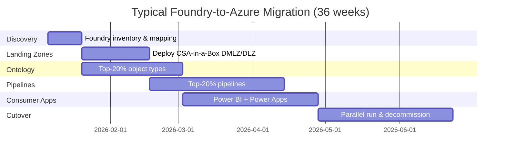

# Palantir Foundry to Azure Migration Center

**The definitive resource for migrating from Palantir Foundry to Microsoft Azure, Microsoft Fabric, and CSA-in-a-Box.**

---

## Who this is for

This migration center serves federal CIOs, CDOs, Chief Data Architects, platform engineers, data engineers, and analysts who are evaluating or executing a migration from Palantir Foundry to Azure-native services. Whether you are responding to a Foundry license expiration, a budget compression mandate, or an organizational pivot toward open standards, these resources provide the evidence, patterns, and step-by-step guidance to execute confidently.

---

## Quick-start decision matrix

| Your situation | Start here |
|---|---|
| Executive evaluating Azure vs Foundry | [Why Azure over Palantir](why-azure-over-palantir.md) |
| Need cost justification for migration | [Total Cost of Ownership Analysis](tco-analysis.md) |
| Concerned about vendor lock-in | [Vendor Lock-In & Open Standards](vendor-lock-in-analysis.md) |
| Need a feature-by-feature comparison | [Complete Feature Mapping](feature-mapping-complete.md) |
| Ready to plan a migration | [Migration Playbook](../palantir-foundry.md) |
| Federal/government-specific requirements | [Federal Migration Guide](federal-migration-guide.md) |
| Want hands-on tutorials | [Tutorials](#tutorials) |
| Need performance data | [Benchmarks](benchmarks.md) |

---

## Strategic resources

These documents provide the business case, cost analysis, and strategic framing for decision-makers.

| Document | Audience | Description |
|---|---|---|
| [Why Azure over Palantir Foundry](why-azure-over-palantir.md) | CIO / CDO / Board | Executive white paper covering 10 strategic advantages, ecosystem synergies, talent availability, and innovation velocity |
| [Total Cost of Ownership Analysis](tco-analysis.md) | CFO / CIO / Procurement | Detailed pricing model comparison, 3-year and 5-year TCO projections, hidden cost analysis, and FinOps best practices |
| [Vendor Lock-In & Open Standards](vendor-lock-in-analysis.md) | CTO / Enterprise Architecture | Technical lock-in vectors, data portability analysis, exit cost comparison, and multi-cloud flexibility |
| [Benchmarks & Performance](benchmarks.md) | CTO / Platform Engineering | Query performance, ETL throughput, AI inference latency, scalability, and ecosystem breadth comparisons |

---

## Technical references

| Document | Description |
|---|---|
| [Complete Feature Mapping](feature-mapping-complete.md) | Every Palantir Foundry feature mapped to its Azure equivalent with migration complexity ratings and CSA-in-a-Box evidence paths |
| [Migration Playbook](../palantir-foundry.md) | The original end-to-end migration playbook with capability mapping, worked example, phased project plan, and competitive framing |
| [Sample Ontology (YAML)](sample-ontology.yaml) | Machine-readable federal case-management ontology migration example |

---

## Migration guides

Domain-specific deep dives covering every aspect of a Foundry-to-Azure migration.

| Guide | Foundry capability | Azure destination |
|---|---|---|
| [Ontology Migration](ontology-migration.md) | Ontology, object types, links, properties | Purview Unified Catalog, dbt semantic layer, Fabric semantic model |
| [Data Integration](data-integration-migration.md) | Magritte connectors, Data Connection, agents | Azure Data Factory, Self-hosted IR, Fabric Data Factory |
| [Pipeline Migration](pipeline-migration.md) | Pipeline Builder, transforms, scheduling | ADF pipelines, dbt, Fabric notebooks |
| [Analytics Migration](analytics-migration.md) | Contour, Quiver, Object Explorer, Fusion | Power BI, Fabric Copilot, Purview Data Catalog |
| [Application Migration](app-migration.md) | Workshop, Slate, Object Views, OSDK | Power Apps, Power Pages, React portal, PCF |
| [AI & AIP Migration](ai-migration.md) | AIP, Chatbot Studio, AIP Logic, Evals | Azure AI Foundry, Azure OpenAI, Copilot Studio |
| [Security & Governance](security-governance-migration.md) | Markings, classifications, audit, lineage | Purview, Entra ID, Azure Monitor, RBAC |
| [DevOps & Deployment](devops-migration.md) | Apollo, Code Repositories, packaging | Azure DevOps, GitHub Actions, Bicep |
| [Functions Migration](functions-migration.md) | Functions, Actions, Compute Modules | Azure Functions, Event Grid, AKS |

---

## Tutorials

Hands-on, step-by-step walkthroughs for common migration scenarios.

| Tutorial | Duration | What you'll build |
|---|---|---|
| [Your First Data Product on Azure](tutorial-first-data-product.md) | 2-3 hours | Deploy CSA-in-a-Box landing zone, ingest data, build dbt models, register in Purview, create a Power BI report |
| [Ontology to Purview](tutorial-ontology-to-purview.md) | 1-2 hours | Export a Foundry ontology, map to Purview glossary terms, automate classification, build relationships |
| [Workshop to Power Apps](tutorial-workshop-to-powerapp.md) | 2-3 hours | Analyze a Workshop app, design and build a Power Apps equivalent with Power Automate flows |
| [Pipeline to ADF/dbt](tutorial-pipeline-to-adf.md) | 2-3 hours | Migrate a Foundry pipeline to ADF orchestration with dbt transforms and scheduling |
| [AIP to Azure AI](tutorial-aip-to-azure-ai.md) | 2-3 hours | Set up Azure OpenAI, build a Copilot Studio agent, implement RAG with AI Search |

---

## Government & federal

| Document | Description |
|---|---|
| [Federal Migration Guide](federal-migration-guide.md) | FedRAMP inheritance, IL4/IL5/IL6 analysis, CMMC mapping, HIPAA, ITAR, tribal sovereignty, agency-specific patterns |
| [Best Practices](best-practices.md) | Pre-migration assessment, incremental strategies, change management, common pitfalls, team structure |

---

## How CSA-in-a-Box fits

CSA-in-a-Box is the **core migration destination** — an Azure-native reference implementation providing Data Mesh, Data Fabric, and Data Lakehouse capabilities. It deploys a complete data platform with:

- **Infrastructure as Code** (Bicep across 4 Azure subscriptions)
- **Data governance** (Purview automation, classification taxonomies, data contracts)
- **Data engineering** (ADF pipelines, dbt models, Databricks/Fabric notebooks)
- **Analytics** (Power BI semantic models, Direct Lake, Copilot integration)
- **AI integration** (Azure OpenAI, AI Foundry, RAG patterns)
- **Compliance** (FedRAMP, CMMC, HIPAA machine-readable control mappings)

For capabilities beyond CSA-in-a-Box's current scope (e.g., Copilot Studio agents, Power Apps operational apps, Microsoft Fabric Real-Time Intelligence), this migration center provides direct guidance using the broader Azure and Microsoft ecosystem.

---

## Migration timeline overview

---

**Last updated:** 2026-04-30
**Maintainers:** CSA-in-a-Box core team
