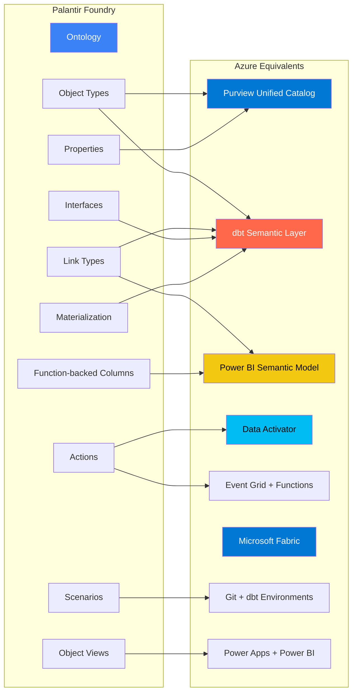
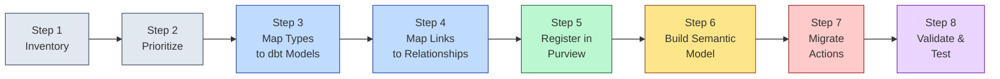
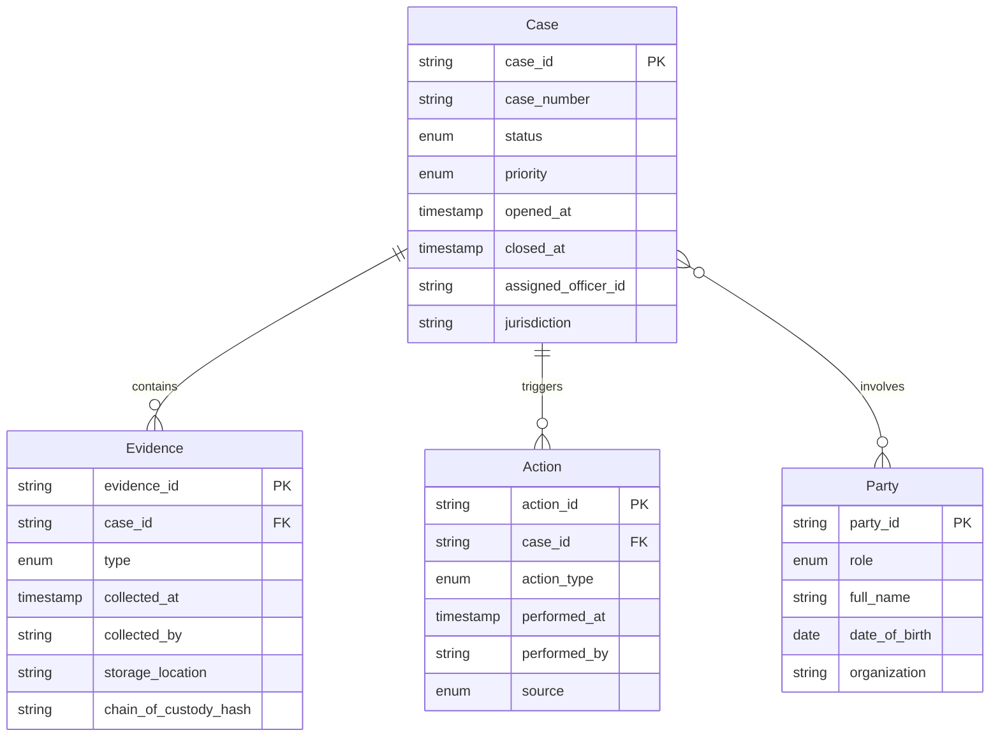
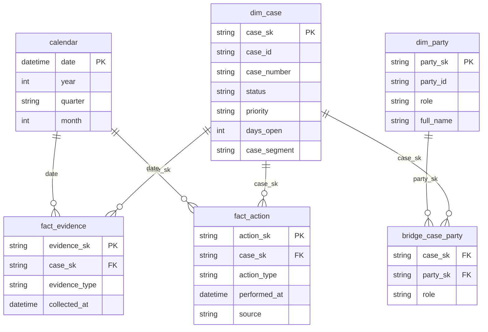

# Ontology Migration: Palantir Foundry to Azure

**A deep-dive technical guide for migrating Palantir Foundry's Ontology to Azure equivalents -- Purview Unified Catalog, dbt semantic layer, Power BI semantic model, and Microsoft Fabric.**

---

## Table of contents

1. [Understanding the Foundry Ontology](#1-understanding-the-foundry-ontology)
2. [Azure equivalents overview](#2-azure-equivalents-overview)
3. [Component mapping tables](#3-component-mapping-tables)
4. [Step-by-step migration process](#4-step-by-step-migration-process)
5. [Worked example: Federal Case Management](#5-worked-example-federal-case-management)
6. [Purview glossary term automation](#6-purview-glossary-term-automation)
7. [dbt model examples](#7-dbt-model-examples)
8. [Power BI semantic model](#8-power-bi-semantic-model)
9. [Validation and testing](#9-validation-and-testing)
10. [Common pitfalls](#10-common-pitfalls)

---

## 1. Understanding the Foundry Ontology

The Palantir Foundry Ontology is the platform's semantic layer -- a unified graph of typed entities, relationships, computed properties, and state-changing operations that sits above raw datasets. It provides a business-friendly abstraction that applications (Workshop, Slate, OSDK) consume without needing to understand the underlying data plumbing.

Before migrating, you must understand each component and its role in the overall architecture.

### 1.1 Object Types

Object Types are schema definitions for real-world entities such as `Case`, `Customer`, or `Order`. Each Object Type defines:

- **Properties**: typed attributes (string, integer, date, array, struct, geoshape) that describe the entity.
- **Primary key**: one or more properties that uniquely identify an instance.
- **Backing dataset**: the Foundry dataset that provides the underlying data.
- **Search configuration**: which properties are indexed for full-text search.
- **Classifications and markings**: security and sensitivity labels.

Object Types are the core building block. Every other Ontology component references or extends them.

### 1.2 Link Types

Link Types define relationships between Object Types with explicit cardinality:

| Cardinality | Implementation | Example |
|---|---|---|
| One-to-one | Foreign key on either side | `Employee` -- `Badge` |
| One-to-many | Foreign key on the "many" side | `Case` -- `Evidence` |
| Many-to-many | Join table (bridge dataset) | `Case` -- `Party` |

Each Link Type declares a source Object Type, a target Object Type, the foreign key columns involved, and the cardinality constraint. Links are directional but can be traversed in both directions in queries.

### 1.3 Properties

Properties are typed attributes on Object Types. Foundry supports these types:

| Foundry type | Description | Examples |
|---|---|---|
| `string` | Unicode text | Names, identifiers |
| `integer` / `long` | Whole numbers | Counts, IDs |
| `double` / `float` | Floating-point numbers | Measurements, scores |
| `boolean` | True/false | Flags, toggles |
| `date` | Calendar date | `2026-04-30` |
| `timestamp` | Date with time and timezone | `2026-04-30T14:30:00Z` |
| `array` | Ordered list of values | Tags, multi-select |
| `struct` | Nested key-value object | Address, metadata |
| `geoshape` | GeoJSON geometry | Polygons, points |
| `enum` | Constrained set of values | Status codes |

Properties can carry classifications (PII, CUI, HIPAA) that control visibility and masking behavior.

### 1.4 Interfaces

Interfaces are abstract type definitions that enable polymorphism. An Interface declares a set of properties that multiple Object Types can implement. For example, an `Auditable` interface might require `created_at`, `created_by`, `updated_at`, and `updated_by` properties. Any Object Type implementing `Auditable` guarantees those properties exist.

This enables generic queries ("give me all Auditable objects modified today") without coupling to specific Object Types.

### 1.5 Actions

Actions are state-changing operations defined declaratively in the Ontology. Each Action specifies:

- **Parameters**: typed inputs the caller must provide.
- **Rules**: validation logic that determines whether the action can execute.
- **Submission criteria**: conditions that must be met before the action is submitted (e.g., the user has a specific role).
- **Side effects**: what happens when the action executes -- creating objects, updating properties, sending notifications, triggering downstream pipelines.

Actions are the Ontology's equivalent of API endpoints. Workshop apps bind buttons and forms to Actions.

### 1.6 Function-backed columns

Function-backed columns are computed properties evaluated at runtime rather than stored in the backing dataset. They use TypeScript or Python functions registered in Foundry to calculate values on the fly. Examples include age derived from date of birth, risk scores computed from multiple properties, or formatted display strings.

These columns appear as regular properties to consumers but incur compute cost at query time.

### 1.7 Materialization

Materialization is the process by which Foundry merges input datasets with user-generated edits (manual overrides entered through Workshop apps) into a single output dataset. The materialized dataset is the backing store for the Object Type. This merge process handles conflict resolution, audit trails, and incremental updates.

### 1.8 Scenarios

Scenarios provide what-if branching of the Ontology. A user creates a Scenario, makes hypothetical changes to objects and links, and evaluates the impact without affecting production data. Scenarios are isolated copies of a subset of the Ontology that can be promoted or discarded.

### 1.9 Object Views

Object Views are reusable UI components for embedding ontology objects in Workshop and Slate applications. They define how an object's properties, links, and actions are rendered -- card layouts, table views, detail panels, and map visualizations.

---

## 2. Azure equivalents overview

There is no single Azure service that replicates the Foundry Ontology. Instead, the Ontology's capabilities map to a combination of Azure services, each handling the aspect it does best.



### Mapping summary

| Foundry component | Primary Azure equivalent | Secondary equivalent | CSA-in-a-Box evidence |
|---|---|---|---|
| Object Types | Purview business glossary terms + dbt gold-layer models (dimensions/facts) | Fabric lakehouse tables | `csa_platform/governance/purview/purview_automation.py` |
| Link Types | Foreign key relationships in dbt + Power BI model relationships | Purview relationship attributes | `domains/shared/dbt/models/gold/schema.yml` |
| Properties | Column definitions in dbt schema + Purview classifications | Fabric table columns | `csa_platform/governance/purview/classifications/` |
| Interfaces | dbt abstract/base models or Purview classification hierarchies | Fabric shared schemas | `domains/shared/dbt/models/` |
| Actions | Data Activator rules + Event Grid + Azure Functions | Power Automate flows | `csa_platform/data_activator/rules/` |
| Function-backed columns | Power BI DAX measures / Fabric computed columns | dbt ephemeral models | `csa_platform/semantic_model/semantic_model_template.yaml` |
| Materialization | dbt incremental models + SCD Type 2 patterns | Fabric lakehouse merge | `domains/shared/dbt/models/gold/fact_orders.sql` |
| Scenarios | Git branches + dbt environments (`dev` / `staging` / `prod`) | Fabric deployment pipelines | Git-based workflow |
| Object Views | Power BI visuals + Power Apps components | Power Pages, React portals | Power BI report templates |

---

## 3. Component mapping tables

### 3.1 Object Types to dbt models and Purview terms

| Foundry Object Type attribute | dbt equivalent | Purview equivalent |
|---|---|---|
| Name | Model file name (`dim_case.sql`) | Glossary term name |
| Description | `description` in `schema.yml` | Glossary term definition |
| Primary key | `unique_key` in model config + `unique` test | N/A (metadata only) |
| Backing dataset | Source ref in `sources.yml` | Registered data asset |
| Properties | Column definitions in `schema.yml` | Term attributes / entity columns |
| Classifications | dbt `tags` + `meta.classification` | Purview classification labels |
| Search config | N/A | Purview search indexing (automatic) |

### 3.2 Link Types to relationships

| Foundry Link attribute | dbt equivalent | Power BI equivalent |
|---|---|---|
| Source Object Type | `ref()` in SQL FROM clause | "From" table in relationship |
| Target Object Type | `ref()` in SQL JOIN clause | "To" table in relationship |
| Cardinality | `relationships` test in `schema.yml` | `cardinality` property (many_to_one, etc.) |
| Foreign key | Column used in JOIN | `fromColumn` / `toColumn` |
| Many-to-many bridge | Bridge model (`bridge_case_party.sql`) | Bridge table with dual relationships |

### 3.3 Property types to column types

| Foundry type | dbt/SQL type | Power BI type | Purview classification |
|---|---|---|---|
| `string` | `VARCHAR` / `STRING` | `string` | Auto-detected |
| `integer` | `INT` / `BIGINT` | `int64` | N/A |
| `double` | `DOUBLE` / `FLOAT` | `double` | N/A |
| `boolean` | `BOOLEAN` | `boolean` | N/A |
| `date` | `DATE` | `dateTime` | N/A |
| `timestamp` | `TIMESTAMP` | `dateTime` | N/A |
| `array` | `ARRAY<T>` (Spark/Databricks) | Flatten to rows or serialize | N/A |
| `struct` | `STRUCT<...>` (Spark/Databricks) | Flatten to columns | N/A |
| `geoshape` | `STRING` (WKT/GeoJSON) | Map visual binding | Custom classification |
| `enum` | `STRING` + `accepted_values` test | `string` + slicer | N/A |

### 3.4 Actions to Azure event-driven services

| Foundry Action attribute | Azure equivalent | Implementation |
|---|---|---|
| Parameters | Azure Function HTTP trigger parameters | Request body schema |
| Rules (validation) | Function input validation + Data Activator conditions | Python/TypeScript validation |
| Submission criteria | Entra ID RBAC + conditional access | Azure RBAC role assignments |
| Side effects: create object | Insert row via dbt incremental or direct Fabric SQL | SQL INSERT / Spark append |
| Side effects: update property | Update row via merge pattern | SQL MERGE / dbt incremental |
| Side effects: notify | Event Grid topic publish + Logic App / Power Automate | Event Grid + email/Teams connector |
| Side effects: trigger pipeline | ADF trigger or Fabric pipeline trigger | REST API call to ADF/Fabric |

### 3.5 Interfaces to dbt patterns

| Foundry Interface pattern | dbt equivalent | How it works |
|---|---|---|
| Shared property set | dbt base model or macro | Define shared columns in a base model that downstream models `ref()` |
| Polymorphic query | dbt `UNION ALL` across implementing models | Create a union model that combines all implementations |
| Type constraint | `schema.yml` column tests | Enforce column presence and types across models |
| Classification hierarchy | Purview classification hierarchy | Nested classification terms in Purview glossary |

---

## 4. Step-by-step migration process

### Overview



### Step 1: Inventory your Ontology

Export a complete inventory of your Foundry Ontology. For each Object Type, capture:

- Name, description, and owner
- All properties with types, classifications, and nullability
- Primary key definition
- All Link Types (source, target, cardinality, foreign key)
- All Actions that reference this Object Type
- Function-backed columns and their logic
- Materialization configuration
- Object Views that render this type

**Output:** A YAML manifest like `sample-ontology.yaml` in this repository. See `docs/migrations/palantir-foundry/sample-ontology.yaml` for the full reference.

If your Foundry deployment provides API access, you can automate the inventory:

```python
# Pseudocode -- Foundry Ontology API export
import requests

FOUNDRY_URL = "https://<stack>.palantirfoundry.com"
TOKEN = "<service-account-token>"
headers = {"Authorization": f"Bearer {TOKEN}"}

# List all object types
response = requests.get(
    f"{FOUNDRY_URL}/api/v2/ontologies/<ontology_rid>/objectTypes",
    headers=headers,
)
object_types = response.json()["data"]

# For each object type, get properties and link types
for ot in object_types:
    props = requests.get(
        f"{FOUNDRY_URL}/api/v2/ontologies/<ontology_rid>/objectTypes/{ot['apiName']}/properties",
        headers=headers,
    ).json()
    links = requests.get(
        f"{FOUNDRY_URL}/api/v2/ontologies/<ontology_rid>/objectTypes/{ot['apiName']}/linkTypes",
        headers=headers,
    ).json()
    # Write to YAML inventory file
```

### Step 2: Prioritize Object Types

Not all Object Types are equally critical. Rank them using a weighted scoring model:

| Factor | Weight | How to measure |
|---|---|---|
| Consumer count | 30% | Number of Workshop apps, reports, and OSDK clients that reference the type |
| Data volume | 20% | Row count and storage size of the backing dataset |
| Action count | 20% | Number of Actions that create/modify instances |
| Link density | 15% | Number of Link Types involving this type |
| Compliance sensitivity | 15% | PII/CUI/HIPAA classification level |

Focus on the top 20% of Object Types first. These typically cover 80% of consumer-facing functionality.

### Step 3: Map Object Types to dbt gold-layer models

For each prioritized Object Type, create a dbt model in the gold layer. The model name follows the Kimball naming convention used by CSA-in-a-Box:

| Foundry Object Type role | dbt model prefix | Example |
|---|---|---|
| Entity (who, what, where) | `dim_` | `dim_case`, `dim_party` |
| Event / transaction | `fact_` | `fact_evidence`, `fact_action` |
| Aggregate / metric | `gld_` | `gld_case_metrics` |
| Many-to-many bridge | `bridge_` | `bridge_case_party` |

Each model should:

1. Read from a silver-layer model (`ref('slv_case')`) that has already been cleansed and validated.
2. Filter to valid rows only (`WHERE is_valid = TRUE`).
3. Apply business transformations (derived columns, type casting, SCD logic).
4. Define a surrogate key if the natural key is not suitable.
5. Include `_dbt_refreshed_at` for lineage tracking.

Define the schema in a companion `schema.yml` file with column descriptions, tests, and relationship constraints. See `domains/shared/dbt/models/gold/schema.yml` for the CSA-in-a-Box pattern.

### Step 4: Map Link Types to relationships

Translate each Foundry Link Type into the appropriate dbt and Power BI construct:

**One-to-many links** (most common): The foreign key column already exists on the "many" side. Add a `relationships` test in `schema.yml`:

```yaml
columns:
  - name: case_id
    description: FK to dim_case
    tests:
      - not_null
      - relationships:
          to: ref('dim_case')
          field: case_id
          severity: warn
```

**Many-to-many links**: Create a bridge model:

```sql
-- models/gold/bridge_case_party.sql
{{
  config(
    materialized='table',
    tags=['gold', 'bridge', 'case_management']
  )
}}

SELECT DISTINCT
    cp.case_id,
    cp.party_id,
    cp.role,
    cp.added_at,
    now() AS _dbt_refreshed_at
FROM {{ ref('slv_case_party') }} cp
WHERE cp.is_valid = TRUE
```

**One-to-one links**: Treat identically to one-to-many with an additional `unique` test on the foreign key column.

### Step 5: Register in Purview Unified Catalog

For each migrated Object Type, create a Purview business glossary term and apply classifications. CSA-in-a-Box provides automation for this through `csa_platform/governance/purview/purview_automation.py`.

This step creates the governance layer that replaces the Foundry Ontology's metadata, classification, and discoverability capabilities. See [Section 6](#6-purview-glossary-term-automation) for detailed automation code.

Key activities:

1. Create a glossary hierarchy that mirrors your domain structure.
2. Create a glossary term for each Object Type with definition, owner, and classifications.
3. Link glossary terms to the physical dbt models registered in Purview as data assets.
4. Apply classification rules from `csa_platform/governance/purview/classifications/` to columns containing PII, CUI, or other sensitive data.
5. Configure scan schedules to keep classifications current.

### Step 6: Build the Power BI semantic model

The Power BI semantic model replaces the Foundry Ontology's role as the consumer-facing query interface. Define tables, relationships, measures, and row-level security using the CSA-in-a-Box semantic model template pattern (see `csa_platform/semantic_model/semantic_model_template.yaml`).

Key activities:

1. Add each gold-layer dbt model as a table in the semantic model.
2. Define relationships matching the Link Types (cardinality and cross-filter direction).
3. Migrate function-backed columns to DAX measures.
4. Configure row-level security to replicate Foundry markings.
5. Define display folders and sort orders to match Object View layouts.

See [Section 8](#8-power-bi-semantic-model) for the full semantic model definition.

### Step 7: Migrate Actions to event-driven services

Foundry Actions become a combination of Data Activator rules, Event Grid topics, and Azure Functions. The migration path depends on the Action type:

| Foundry Action pattern | Azure equivalent | When to use |
|---|---|---|
| Threshold-based alert | Data Activator rule | Condition on a metric triggers a notification |
| CRUD operation | Azure Function + Fabric SQL endpoint | Creating or updating objects programmatically |
| Workflow trigger | Power Automate flow | Multi-step business processes with approvals |
| Complex business logic | Azure Function + Event Grid | Custom code triggered by events |

CSA-in-a-Box provides a Data Activator rule engine at `csa_platform/data_activator/rules/`. Define rules in YAML:

```yaml
rules:
  - name: case-escalation-overdue
    description: >
      Escalate cases open > 30 days with high/urgent priority
    source: case-event-topic
    enabled: true
    condition:
      field: days_open
      operator: gt
      threshold: 30.0
      window_minutes: 0
    actions:
      - type: teams
        config:
          webhook_url: ${TEAMS_WEBHOOK_URL}
          channel: "#case-management-alerts"
      - type: email
        config:
          recipients:
            - supervisor-oncall@agency.gov
    tags:
      domain: case_management
      priority: high
```

### Step 8: Validate and test

Run the validation suite described in [Section 9](#9-validation-and-testing) to confirm:

- Row counts match between Foundry and Azure.
- All properties are present with correct types.
- Relationship integrity is maintained.
- Computed values match function-backed column outputs.
- Actions trigger correctly under the same conditions.
- Classifications and access controls are equivalent.

---

## 5. Worked example: Federal Case Management

This section walks through the complete migration of the Federal Case Management ontology defined in `docs/migrations/palantir-foundry/sample-ontology.yaml`. The ontology contains four Object Types (`Case`, `Party`, `Evidence`, `Action`) with multiple Link Types and one migrated Foundry Action.

### 5.1 Ontology structure



### 5.2 dbt gold-layer models

**`dim_case.sql`** -- Case dimension:

```sql
{{
  config(
    materialized='table',
    file_format='delta' if target.type != 'duckdb' else none,
    tags=['gold', 'case_management', 'dimension']
  )
}}

/*
  Gold: Case dimension (SCD Type 1).
  Grain: one row per case.
  Source: silver-layer case data from the case management system.
*/

WITH cases AS (
    SELECT * FROM {{ ref('slv_case') }}
    WHERE is_valid = TRUE
),

final AS (
    SELECT
        {{ dbt_utils.generate_surrogate_key(['case_id']) }} AS case_sk,
        case_id,
        case_number,
        status,
        priority,
        opened_at,
        closed_at,
        assigned_officer_id,
        jurisdiction,

        -- Derived attributes
        CASE
            WHEN closed_at IS NOT NULL
            THEN DATEDIFF(DAY, opened_at, closed_at)
            ELSE DATEDIFF(DAY, opened_at, CURRENT_DATE())
        END AS days_open,

        CASE
            WHEN status = 'closed' THEN 'resolved'
            WHEN DATEDIFF(DAY, opened_at, CURRENT_DATE()) > 90 THEN 'aging'
            WHEN priority IN ('high', 'urgent') THEN 'priority'
            ELSE 'normal'
        END AS case_segment,

        now() AS _dbt_refreshed_at
    FROM cases
)

SELECT * FROM final
```

**`dim_party.sql`** -- Party dimension:

```sql
{{
  config(
    materialized='table',
    file_format='delta' if target.type != 'duckdb' else none,
    tags=['gold', 'case_management', 'dimension']
  )
}}

WITH parties AS (
    SELECT * FROM {{ ref('slv_party') }}
    WHERE is_valid = TRUE
),

final AS (
    SELECT
        {{ dbt_utils.generate_surrogate_key(['party_id']) }} AS party_sk,
        party_id,
        role,
        full_name,
        date_of_birth,
        organization,
        now() AS _dbt_refreshed_at
    FROM parties
)

SELECT * FROM final
```

**`fact_evidence.sql`** -- Evidence fact:

```sql
{{
  config(
    materialized='incremental',
    unique_key='evidence_sk',
    incremental_strategy='merge',
    file_format='delta' if target.type != 'duckdb' else none,
    tags=['gold', 'case_management', 'fact'],
    on_schema_change='fail'
  )
}}

WITH evidence AS (
    SELECT * FROM {{ ref('slv_evidence') }}
    WHERE is_valid = TRUE
    
    AND _dbt_loaded_at > (SELECT MAX(_dbt_loaded_at) FROM {{ this }})
    
),

cases AS (
    SELECT case_sk, case_id FROM {{ ref('dim_case') }}
),

final AS (
    SELECT
        {{ dbt_utils.generate_surrogate_key(['e.evidence_id']) }} AS evidence_sk,
        e.evidence_id,
        e.case_id,
        c.case_sk,
        e.type AS evidence_type,
        e.collected_at,
        e.collected_by,
        e.storage_location,
        e.chain_of_custody_hash,
        e._dbt_loaded_at,
        now() AS _dbt_refreshed_at
    FROM evidence e
    LEFT JOIN cases c ON e.case_id = c.case_id
)

SELECT * FROM final
```

**`bridge_case_party.sql`** -- Many-to-many bridge:

```sql
{{
  config(
    materialized='table',
    file_format='delta' if target.type != 'duckdb' else none,
    tags=['gold', 'case_management', 'bridge']
  )
}}

/*
  Bridge table: Case <-> Party (many-to-many).
  Replaces the Foundry "involves" Link Type.
*/

WITH case_parties AS (
    SELECT * FROM {{ ref('slv_case_party') }}
    WHERE is_valid = TRUE
),

cases AS (
    SELECT case_sk, case_id FROM {{ ref('dim_case') }}
),

parties AS (
    SELECT party_sk, party_id FROM {{ ref('dim_party') }}
),

final AS (
    SELECT
        cp.case_id,
        c.case_sk,
        cp.party_id,
        p.party_sk,
        cp.role,
        cp.added_at,
        now() AS _dbt_refreshed_at
    FROM case_parties cp
    LEFT JOIN cases c ON cp.case_id = c.case_id
    LEFT JOIN parties p ON cp.party_id = p.party_id
)

SELECT * FROM final
```

### 5.3 Schema definition (`schema.yml`)

```yaml
version: 2

models:
  - name: dim_case
    description: >
      Gold layer: Case dimension. One row per case tracked from intake
      through disposition. Migrated from Foundry Object Type "Case".
    meta:
      foundry_source: case_object
      purview_glossary_term: Case
      purview_classification: CUI-Specified
    columns:
      - name: case_sk
        description: Surrogate key
        tests: [unique, not_null]
      - name: case_id
        description: Natural case identifier
        tests: [unique, not_null]
      - name: case_number
        description: Agency-assigned human-readable identifier
      - name: status
        description: "Case status: open, under_review, closed, appealed"
        tests:
          - accepted_values:
              values: [open, under_review, closed, appealed]
      - name: priority
        description: "Case priority: low, normal, high, urgent"
        tests:
          - accepted_values:
              values: [low, normal, high, urgent]
      - name: days_open
        description: Computed days since case opened (replaces function-backed column)
      - name: case_segment
        description: Derived segmentation for analytics

  - name: dim_party
    description: >
      Gold layer: Party dimension. Any person or organization involved
      in a case. Migrated from Foundry Object Type "Party".
    meta:
      foundry_source: party_object
      purview_glossary_term: "Party (Case Participant)"
      purview_classification: PII
    columns:
      - name: party_sk
        description: Surrogate key
        tests: [unique, not_null]
      - name: party_id
        description: Natural party identifier
        tests: [unique, not_null]
      - name: full_name
        description: Full name (PII -- masked in non-production environments)
        meta:
          classification: pii
      - name: date_of_birth
        description: Date of birth (PII -- hash or redact)
        meta:
          classification: pii
          masking: hash_or_redact

  - name: fact_evidence
    description: >
      Gold layer: Evidence fact table. Chain-of-custody items
      linked to cases. Migrated from Foundry Object Type "Evidence".
    meta:
      foundry_source: evidence_object
      purview_glossary_term: "Evidence Item"
      purview_classification: CUI-Specified
    columns:
      - name: evidence_sk
        description: Surrogate key
        tests: [unique, not_null]
      - name: case_id
        description: FK to dim_case
        tests:
          - not_null
          - relationships:
              to: ref('dim_case')
              field: case_id
              severity: warn
      - name: case_sk
        description: Surrogate FK to dim_case
        tests:
          - relationships:
              to: ref('dim_case')
              field: case_sk
              severity: warn

  - name: fact_action
    description: >
      Gold layer: Case action fact table. State-changing events on
      cases. Migrated from Foundry Object Type "Action".
    meta:
      foundry_source: action_object
      purview_glossary_term: "Case Action"
      purview_classification: Internal
    columns:
      - name: action_id
        description: Natural action identifier
        tests: [not_null]
      - name: case_id
        description: FK to dim_case
        tests:
          - not_null
          - relationships:
              to: ref('dim_case')
              field: case_id
              severity: warn
      - name: action_type
        tests:
          - accepted_values:
              values:
                - assign
                - reassign
                - escalate
                - status_change
                - disposition
                - appeal_filed

  - name: bridge_case_party
    description: >
      Bridge table implementing the Case-Party many-to-many
      relationship. Replaces Foundry "involves" Link Type.
    columns:
      - name: case_sk
        tests:
          - relationships:
              to: ref('dim_case')
              field: case_sk
      - name: party_sk
        tests:
          - relationships:
              to: ref('dim_party')
              field: party_sk
```

---

## 6. Purview glossary term automation

CSA-in-a-Box automates Purview glossary management through `csa_platform/governance/purview/purview_automation.py`. The following examples show how to create glossary terms from the ontology inventory.

### 6.1 Glossary term YAML definition

Define your migrated Object Types as Purview glossary terms in YAML:

```yaml
# purview/glossary/case_management_terms.yaml
apiVersion: csa.microsoft.com/v1
kind: GlossaryTermSet

metadata:
  name: case-management-glossary
  domain: case_management
  owner: case-management-team@agency.gov

glossary: case_management_ontology

terms:
  - name: Case
    definition: >
      A legal, investigative, or adjudicative matter tracked from intake
      through disposition. One case aggregates parties, evidence, and
      actions. Migrated from Palantir Foundry Object Type "case_object".
    status: Approved
    classifications: [CUI-Specified]
    contacts:
      - name: Case Management Domain Lead
        email: case-mgmt-lead@agency.gov
        role: Expert
    related_terms:
      - "Party (Case Participant)"
      - "Evidence Item"
      - "Case Action"
    resources:
      - name: dbt model
        url: "domains/case_management/dbt/models/gold/dim_case.sql"
      - name: data contract
        url: "domains/case_management/data-products/case/contract.yaml"

  - name: "Party (Case Participant)"
    definition: >
      Any person or organization involved in a case -- complainant,
      subject, witness, or counsel. Contains PII subject to masking.
    status: Approved
    classifications: [PII]
    contacts:
      - name: Privacy Officer
        email: privacy@agency.gov
        role: Steward

  - name: "Evidence Item"
    definition: >
      A document, digital artifact, or physical item preserved under
      chain-of-custody for a case. CUI-Specified classification.
    status: Approved
    classifications: [CUI-Specified]

  - name: "Case Action"
    definition: >
      A state-changing event on a case such as assignment, escalation,
      status change, or disposition. Generated by humans, Data Activator
      rules, or Power Automate flows.
    status: Approved
    classifications: [Internal]
```

### 6.2 Python automation script

Use the CSA-in-a-Box `PurviewAutomation` class to import glossary terms programmatically:

```python
"""Import Foundry ontology terms into Purview glossary.

Usage:
    python scripts/import_ontology_to_purview.py \
        --account-name purview-prod \
        --glossary-file purview/glossary/case_management_terms.yaml
"""

from pathlib import Path

import yaml
from azure.identity import DefaultAzureCredential

from csa_platform.governance.purview.purview_automation import (
    GlossaryTerm,
    PurviewAutomation,
)


def load_ontology_terms(yaml_path: str) -> list[GlossaryTerm]:
    """Parse ontology glossary YAML into GlossaryTerm objects."""
    with open(yaml_path) as f:
        data = yaml.safe_load(f)

    terms = []
    for term_def in data.get("terms", []):
        terms.append(
            GlossaryTerm(
                name=term_def["name"],
                definition=term_def["definition"],
                status=term_def.get("status", "Approved"),
                classifications=term_def.get("classifications", []),
                contacts=[
                    {"name": c["name"], "email": c["email"]}
                    for c in term_def.get("contacts", [])
                ],
                related_terms=term_def.get("related_terms", []),
                resources=[
                    {"displayName": r["name"], "url": r["url"]}
                    for r in term_def.get("resources", [])
                ],
            )
        )
    return terms


def main(account_name: str, glossary_file: str) -> None:
    credential = DefaultAzureCredential()
    purview = PurviewAutomation(
        account_name=account_name,
        credential=credential,
    )

    terms = load_ontology_terms(glossary_file)

    for term in terms:
        print(f"Importing glossary term: {term.name}")
        purview.import_glossary_terms_from_objects([term])
        print(f"  -> Created with classifications: {term.classifications}")

    print(f"\nImported {len(terms)} glossary terms successfully.")


if __name__ == "__main__":
    import argparse

    parser = argparse.ArgumentParser()
    parser.add_argument("--account-name", required=True)
    parser.add_argument("--glossary-file", required=True)
    args = parser.parse_args()
    main(args.account_name, args.glossary_file)
```

### 6.3 Classification application

After importing glossary terms, apply Purview classification rules to the physical data assets. CSA-in-a-Box ships classification rule sets at `csa_platform/governance/purview/classifications/`:

| Classification file | Scope |
|---|---|
| `pii_classifications.yaml` | SSN, email, phone, address, name |
| `phi_classifications.yaml` | HIPAA Protected Health Information |
| `government_classifications.yaml` | CUI, FCI, classified markings |
| `financial_classifications.yaml` | Account numbers, routing numbers |

Apply classifications to the case management tables:

```python
purview.apply_classification_rules(
    "csa_platform/governance/purview/classifications/pii_classifications.yaml"
)
purview.apply_classification_rules(
    "csa_platform/governance/purview/classifications/government_classifications.yaml"
)
```

This replaces Foundry's built-in classification and marking system with Purview's automated scanning and classification engine.

---

## 7. dbt model examples

### 7.1 Interfaces as base models

Foundry Interfaces map to dbt base models or macros. Create a shared base that downstream models can extend:

```sql
-- macros/auditable_columns.sql

    created_at,
    created_by,
    updated_at,
    updated_by,
    now() AS _dbt_refreshed_at

```

Usage in a model:

```sql
-- models/gold/dim_case.sql
SELECT
    case_id,
    case_number,
    status,
    -- ... other columns ...
    {{ auditable_columns() }}
FROM {{ ref('slv_case') }}
WHERE is_valid = TRUE
```

### 7.2 Function-backed columns as dbt computed columns

Foundry function-backed columns that compute values at the SQL level migrate directly into dbt model SELECT clauses. The `days_open` and `case_segment` columns in `dim_case.sql` (Section 5.2) demonstrate this pattern.

For complex computed properties that require runtime logic (e.g., calling an ML model), use Power BI DAX measures instead. See Section 8.

### 7.3 Materialization as dbt incremental models

Foundry's materialization process -- merging input data with user edits -- maps to dbt's `incremental` materialization strategy with the `merge` strategy. The `fact_evidence.sql` model in Section 5.2 demonstrates this pattern.

For SCD Type 2 (tracking historical changes), use the `dbt_utils.generate_surrogate_key` macro with snapshot tables:

```sql
-- snapshots/snap_case.sql

{{
  config(
    target_schema='snapshots',
    unique_key='case_id',
    strategy='timestamp',
    updated_at='updated_at',
    invalidate_hard_deletes=True
  )
}}

SELECT * FROM {{ ref('slv_case') }}


```

### 7.4 Data contracts

Each migrated Object Type should have a data contract that defines the schema, SLAs, and quality rules. Follow the pattern in `domains/finance/data-products/invoices/contract.yaml`:

```yaml
apiVersion: csa.microsoft.com/v1
kind: DataProductContract

metadata:
  name: case_management.cases
  domain: case_management
  owner: case-data-engineering@agency.gov
  version: "1.0.0"
  description: >
    Case records migrated from Palantir Foundry. Tracks all cases
    from intake through disposition with full audit history.

schema:
  primary_key: [case_sk]
  columns:
    - name: case_sk
      type: string
      nullable: false
      description: Surrogate key (generated by dbt)
    - name: case_id
      type: string
      nullable: false
      description: Natural case identifier from source system
    - name: status
      type: string
      nullable: false
      allowed_values: [open, under_review, closed, appealed]
    - name: priority
      type: string
      nullable: false
      allowed_values: [low, normal, high, urgent]

sla:
  freshness_minutes: 60
  valid_row_ratio: 0.99
  supported_until: "2028-12-31"

quality_rules:
  - rule: expect_column_values_to_not_be_null
    column: case_sk
  - rule: expect_column_values_to_be_unique
    column: case_sk
  - rule: expect_column_values_to_be_in_set
    column: status
    value_set: [open, under_review, closed, appealed]
```

---

## 8. Power BI semantic model

### 8.1 Model diagram

The Power BI semantic model replaces the consumer-facing query capabilities of the Foundry Ontology. It defines the star schema, relationships, and measures that analysts and applications consume.



### 8.2 Semantic model template

Following the CSA-in-a-Box pattern from `csa_platform/semantic_model/semantic_model_template.yaml`:

```yaml
apiVersion: csa.microsoft.com/v1
kind: SemanticModelTemplate

metadata:
  name: case-management-model
  version: "1.0.0"
  description: >
    Power BI semantic model for the case management domain.
    Migrated from Palantir Foundry Ontology.
  owner: case-analytics@agency.gov
  tags: [power-bi, case-management, ontology-migration]

connection:
  type: databricks_sql
  workspace:
    hostname: "adb-{workspace_id}.azuredatabricks.net"
  sqlWarehouse:
    httpPath: "/sql/1.0/warehouses/{warehouse_id}"
    name: case-mgmt-warehouse
  authentication:
    type: azure_ad
    tenantId: "${AZURE_TENANT_ID}"
    clientId: "${AZURE_CLIENT_ID}"
  catalog: case_management_catalog

tables:
  - name: dim_case
    schema: gold
    source: case_management_catalog.gold.dim_case
    description: Case dimension -- migrated from Foundry Case object type
    mode: DirectQuery
    columns:
      - name: case_sk
        dataType: string
        isKey: true
      - name: case_id
        dataType: string
      - name: case_number
        dataType: string
      - name: status
        dataType: string
      - name: priority
        dataType: string
      - name: opened_at
        dataType: dateTime
      - name: closed_at
        dataType: dateTime
      - name: days_open
        dataType: int64
        description: Computed -- replaces Foundry function-backed column
      - name: case_segment
        dataType: string

  - name: dim_party
    schema: gold
    source: case_management_catalog.gold.dim_party
    description: Party dimension -- migrated from Foundry Party object type
    mode: DirectQuery
    columns:
      - name: party_sk
        dataType: string
        isKey: true
      - name: party_id
        dataType: string
      - name: full_name
        dataType: string
        piiClassification: direct_identifier
      - name: role
        dataType: string

  - name: fact_evidence
    schema: gold
    source: case_management_catalog.gold.fact_evidence
    mode: DirectQuery
    columns:
      - name: evidence_sk
        dataType: string
        isKey: true
      - name: case_sk
        dataType: string
      - name: evidence_type
        dataType: string
      - name: collected_at
        dataType: dateTime

  - name: fact_action
    schema: gold
    source: case_management_catalog.gold.fact_action
    mode: DirectQuery
    columns:
      - name: action_sk
        dataType: string
        isKey: true
      - name: case_sk
        dataType: string
      - name: action_type
        dataType: string
      - name: performed_at
        dataType: dateTime
      - name: source
        dataType: string

  - name: bridge_case_party
    schema: gold
    source: case_management_catalog.gold.bridge_case_party
    mode: DirectQuery
    columns:
      - name: case_sk
        dataType: string
      - name: party_sk
        dataType: string
      - name: role
        dataType: string

relationships:
  - name: evidence_to_case
    fromTable: fact_evidence
    fromColumn: case_sk
    toTable: dim_case
    toColumn: case_sk
    cardinality: many_to_one
    crossFilterDirection: single

  - name: action_to_case
    fromTable: fact_action
    fromColumn: case_sk
    toTable: dim_case
    toColumn: case_sk
    cardinality: many_to_one
    crossFilterDirection: single

  - name: bridge_to_case
    fromTable: bridge_case_party
    fromColumn: case_sk
    toTable: dim_case
    toColumn: case_sk
    cardinality: many_to_one
    crossFilterDirection: both

  - name: bridge_to_party
    fromTable: bridge_case_party
    fromColumn: party_sk
    toTable: dim_party
    toColumn: party_sk
    cardinality: many_to_one
    crossFilterDirection: both

measures:
  - name: Total Cases
    table: dim_case
    expression: "COUNTROWS(dim_case)"
    formatString: "#,##0"

  - name: Open Cases
    table: dim_case
    expression: "CALCULATE(COUNTROWS(dim_case), dim_case[status] = \"open\")"
    formatString: "#,##0"

  - name: Avg Days to Resolution
    table: dim_case
    expression: >
      AVERAGEX(
        FILTER(dim_case, dim_case[status] = "closed"),
        dim_case[days_open]
      )
    formatString: "#,##0.0"
    description: Average days from open to close (replaces Foundry function-backed column)

  - name: Evidence Count
    table: fact_evidence
    expression: "COUNTROWS(fact_evidence)"
    formatString: "#,##0"

  - name: Escalation Rate
    table: fact_action
    expression: |
      DIVIDE(
        CALCULATE(COUNTROWS(fact_action), fact_action[action_type] = "escalate"),
        COUNTROWS(fact_action),
        0
      )
    formatString: "0.0%"
    description: Percentage of actions that are escalations

  - name: Cases per Party
    table: bridge_case_party
    expression: "DIVIDE(DISTINCTCOUNT(bridge_case_party[case_sk]), DISTINCTCOUNT(bridge_case_party[party_sk]), 0)"
    formatString: "#,##0.0"

rowLevelSecurity:
  roles:
    - name: JurisdictionFilter
      description: Restricts case visibility to user's jurisdiction
      tableFilters:
        - table: dim_case
          daxFilter: "[jurisdiction] = USERPRINCIPALNAME()"

    - name: ClassifiedAccess
      description: CUI-Specified access requires cleared personnel
      tableFilters:
        - table: fact_evidence
          daxFilter: "TRUE()"
        - table: dim_party
          daxFilter: "TRUE()"
```

### 8.3 Function-backed columns as DAX measures

Foundry function-backed columns that require complex runtime computation (beyond SQL) become DAX measures in the Power BI model. The `Avg Days to Resolution`, `Escalation Rate`, and `Cases per Party` measures above demonstrate this pattern.

For real-time computed values that cannot be pre-calculated in dbt, DAX measures provide equivalent functionality with the advantage of being computed at query time within the Power BI engine.

---

## 9. Validation and testing

### 9.1 Row count validation

Compare row counts between the Foundry backing datasets and the Azure gold-layer tables:

```sql
-- Run in Foundry
SELECT COUNT(*) AS foundry_count FROM foundry_dataset_case;

-- Run in Databricks/Fabric
SELECT COUNT(*) AS azure_count FROM case_management_catalog.gold.dim_case;
```

Acceptable variance: less than 0.1% (differences may arise from filtering invalid rows in the silver layer).

### 9.2 dbt tests

The `schema.yml` definitions in Section 5.3 encode the validation rules as dbt tests. Run the full test suite:

```bash
# Run all tests for the case management domain
dbt test --select tag:case_management

# Expected output:
# Finished running 25 tests in 0 hours 0 minutes and 12.34 seconds.
# Completed successfully.
#
# Done. PASS=25 WARN=0 ERROR=0 SKIP=0 TOTAL=25
```

Key tests to verify:

| Test | What it validates |
|---|---|
| `unique` on surrogate keys | No duplicate rows |
| `not_null` on primary keys | No missing identifiers |
| `accepted_values` on enums | Status/type values match Foundry definitions |
| `relationships` on foreign keys | Referential integrity matches Link Types |

### 9.3 Property-level comparison

For each Object Type, verify that every Foundry property has a corresponding column with the correct type:

```python
"""Validate column-level parity between Foundry and Azure."""

import yaml

def validate_property_mapping(ontology_path: str, schema_path: str) -> list[str]:
    """Compare ontology properties against dbt schema columns."""
    with open(ontology_path) as f:
        ontology = yaml.safe_load(f)
    with open(schema_path) as f:
        schema = yaml.safe_load(f)

    errors = []
    for obj_type in ontology["ontology"]["object_types"]:
        model_name = obj_type["target_dbt_model"].split("/")[-1].replace(".sql", "")
        model_def = next(
            (m for m in schema["models"] if m["name"] == model_name),
            None,
        )
        if model_def is None:
            errors.append(f"Missing dbt model for {obj_type['name']}: {model_name}")
            continue

        schema_columns = {c["name"] for c in model_def.get("columns", [])}
        for prop in obj_type["properties"]:
            if prop["name"] not in schema_columns:
                # Allow surrogate key and derived columns to differ
                if not prop.get("is_primary_key"):
                    errors.append(
                        f"{obj_type['name']}.{prop['name']} missing in {model_name}"
                    )

    return errors
```

### 9.4 Relationship integrity

Verify that every Foundry Link Type is implemented as a dbt relationship test or Power BI model relationship:

```python
def validate_relationships(ontology_path: str, schema_path: str) -> list[str]:
    """Check that all Link Types have corresponding relationship tests."""
    with open(ontology_path) as f:
        ontology = yaml.safe_load(f)
    with open(schema_path) as f:
        schema = yaml.safe_load(f)

    errors = []
    for obj_type in ontology["ontology"]["object_types"]:
        for rel in obj_type.get("relationships", []):
            target = rel["to"]
            cardinality = rel["cardinality"]

            # Check for relationship test in schema
            model_name = obj_type["target_dbt_model"].split("/")[-1].replace(".sql", "")
            model_def = next(
                (m for m in schema["models"] if m["name"] == model_name),
                None,
            )
            if model_def is None:
                errors.append(f"No model for {obj_type['name']} to check {rel['name']}")
                continue

            # For many-to-many, check bridge table exists
            if cardinality == "many_to_many":
                bridge_name = f"bridge_{obj_type['name'].lower()}_{target.lower()}"
                bridge_def = next(
                    (m for m in schema["models"] if m["name"] == bridge_name),
                    None,
                )
                if bridge_def is None:
                    errors.append(
                        f"Missing bridge table for {obj_type['name']} <-> {target}"
                    )

    return errors
```

### 9.5 Action behavior validation

For each migrated Foundry Action, verify the equivalent Azure mechanism fires under the same conditions:

1. **Create test data** that satisfies the trigger condition (e.g., a case open for 31 days with `high` priority).
2. **Publish a test event** to the Event Grid topic.
3. **Verify** that the Data Activator rule fires and the expected side effects occur (Teams notification, email, status update).
4. **Compare** the outcome against the Foundry Action's documented behavior.

```bash
# Test the case escalation rule
az eventgrid topic event-subscription create \
  --name test-escalation \
  --source-resource-id /subscriptions/{sub}/resourceGroups/{rg}/providers/Microsoft.EventGrid/topics/case-escalation-events \
  --endpoint https://{function-app}.azurewebsites.net/api/escalate

# Publish a test event
az eventgrid topic event publish \
  --topic-name case-escalation-events \
  --resource-group {rg} \
  --event-type CaseEscalation \
  --subject "cases/CASE-2026-0042" \
  --data '{"case_id": "CASE-2026-0042", "status": "open", "priority": "high", "days_open": 35}'
```

### 9.6 Classification parity

Verify that Purview classifications match the Foundry classifications:

| Foundry classification | Expected Purview classification | Verification method |
|---|---|---|
| PII | `CSA_PII_*` rules applied | Purview scan results |
| CUI-Basic | `CSA_GOV_CUI_BASIC` | Purview scan results |
| CUI-Specified | `CSA_GOV_CUI_SPECIFIED` | Purview scan results |
| Internal | No sensitivity label | Default behavior |

Run a Purview scan and compare the auto-detected classifications against the ontology manifest.

---

## 10. Common pitfalls

### 10.1 Treating the Ontology as "just a schema"

The most common mistake is treating the Foundry Ontology migration as a schema copy exercise. The Ontology is not a database schema -- it is a semantic layer that combines metadata, relationships, computed logic, access control, and application bindings. A successful migration requires addressing each of these dimensions.

**Mitigation:** Use the component mapping tables in Section 3. For each Object Type, verify that you have addressed metadata (Purview glossary), relationships (dbt tests + Power BI model), computed logic (dbt SQL + DAX measures), access control (RLS + Purview classifications), and application bindings (Power BI visuals + Power Apps).

### 10.2 Losing many-to-many relationships

Foundry Link Types with `many_to_many` cardinality are backed by hidden join tables. If you only export Object Types without their Link Type definitions, you lose these relationships entirely.

**Mitigation:** Always export Link Types during the inventory step. Create explicit bridge models (`bridge_case_party.sql`) in the dbt gold layer. Define dual relationships in the Power BI semantic model.

### 10.3 Ignoring function-backed columns

Function-backed columns appear as regular properties in Foundry exports, but their values are not stored in the backing dataset. If you migrate the dataset without migrating the function logic, these columns will be null or missing.

**Mitigation:** Identify all function-backed columns during inventory. For SQL-expressible logic, implement as dbt computed columns. For complex runtime logic, implement as Power BI DAX measures. Document the migration in the `schema.yml` `description` field.

### 10.4 Flattening Interfaces prematurely

Foundry Interfaces enable polymorphic queries that span multiple Object Types. If you flatten each Object Type into its own dbt model without preserving the Interface abstraction, you lose the ability to query across types.

**Mitigation:** Create dbt macros for shared column sets (Section 7.1). If polymorphic queries are critical, create a union model that combines all implementing Object Types:

```sql
-- models/gold/union_auditable.sql
SELECT 'Case' AS entity_type, case_id AS entity_id, created_at, updated_at
FROM {{ ref('dim_case') }}
UNION ALL
SELECT 'Evidence' AS entity_type, evidence_id, collected_at, NULL
FROM {{ ref('fact_evidence') }}
```

### 10.5 Missing materialization conflict resolution

Foundry's materialization process handles conflicts between automated pipeline data and manual user edits. The default Azure migration path (dbt incremental models) does not provide built-in conflict resolution.

**Mitigation:** If your Ontology relies on user edits merged with pipeline data, implement an explicit conflict resolution layer. Options include:

1. **Last-write-wins**: Use dbt `merge` with `updated_at` as the tie-breaker.
2. **Source priority**: Add a `source_priority` column and resolve conflicts in the dbt model.
3. **Audit trail**: Use SCD Type 2 snapshots to preserve both the pipeline value and the user edit.

### 10.6 Neglecting Scenarios (what-if analysis)

Foundry Scenarios provide isolated what-if environments that most migration teams ignore. If your organization uses Scenarios for budget planning, policy analysis, or impact assessment, you need an equivalent.

**Mitigation:** Use Git branches combined with dbt environments:

| Foundry Scenario | Azure equivalent |
|---|---|
| Create scenario | Create Git feature branch |
| Modify objects | Edit dbt models or seed data |
| Evaluate impact | Run `dbt build` against `dev` target |
| Promote scenario | Merge branch to `main`, run against `prod` target |
| Discard scenario | Delete feature branch |

For more sophisticated what-if analysis, use Fabric deployment pipelines or separate Databricks workspaces.

### 10.7 Underestimating Action complexity

Foundry Actions can be deeply integrated into Workshop apps with multi-step validation, conditional branching, and chained side effects. A simple Data Activator rule may not capture the full behavior.

**Mitigation:** For complex Actions, decompose into discrete steps:

1. **Input validation** -- Azure Function with parameter validation.
2. **Authorization** -- Entra ID RBAC check.
3. **Business logic** -- Azure Function or Power Automate flow.
4. **Side effects** -- Event Grid publish for downstream consumers.
5. **UI feedback** -- Power Apps status update or Teams notification.

### 10.8 Skipping the data contract

Without a data contract, consumers of the migrated data have no formal agreement about schema stability, freshness, or quality. This leads to brittle downstream dependencies.

**Mitigation:** Create a `contract.yaml` for every migrated Object Type following the pattern in `domains/finance/data-products/invoices/contract.yaml`. Include schema definitions, SLA commitments, and quality rules. Enforce contracts in CI using the CSA-in-a-Box contract validator.

### 10.9 Not mapping Object Views to Power BI visuals

Object Views define how Foundry Workshop apps render objects. If you migrate the data layer without migrating the presentation layer, end users lose their familiar interface.

**Mitigation:** For each Object View, identify the visual components (cards, tables, charts, maps) and create equivalent Power BI visuals or Power Apps components. Document the mapping in your migration tracker:

| Foundry Object View | Component type | Azure equivalent |
|---|---|---|
| Case Detail Card | Card layout | Power BI card visual or Power Apps detail form |
| Evidence Table | Data table | Power BI table visual with drill-through |
| Case Map | Map visual | Power BI ArcGIS or Azure Maps visual |
| Action Timeline | Timeline | Power BI line chart with markers |

### 10.10 Ignoring Purview lineage registration

The Foundry Ontology provides built-in lineage from source datasets through Object Types to consumer applications. Azure does not automatically replicate this lineage. If you skip lineage registration, you lose impact analysis and root cause tracking capabilities.

**Mitigation:** Register dbt lineage in Purview using the CSA-in-a-Box automation:

```python
purview.register_dbt_lineage(
    manifest_path="target/manifest.json",
    run_results_path="target/run_results.json",
)
```

This creates lineage edges in Purview from source tables through dbt models to the gold-layer tables consumed by Power BI.

---

## Appendix: Migration checklist

Use this checklist for each Object Type you migrate:

- [ ] Object Type exported to YAML inventory
- [ ] Priority score calculated (Section 4, Step 2)
- [ ] dbt gold-layer model created (`dim_` / `fact_` / `bridge_`)
- [ ] `schema.yml` with column descriptions and tests
- [ ] All Link Types implemented (FK tests or bridge tables)
- [ ] Function-backed columns migrated (dbt SQL or DAX measures)
- [ ] Purview glossary term created
- [ ] Classifications applied (PII, CUI, etc.)
- [ ] Data contract created (`contract.yaml`)
- [ ] Power BI semantic model table and relationships defined
- [ ] Row-level security configured
- [ ] Actions migrated to Data Activator / Azure Functions
- [ ] Row count validation passed
- [ ] dbt tests passing
- [ ] Lineage registered in Purview
- [ ] Object Views mapped to Power BI visuals / Power Apps
- [ ] End-user acceptance testing completed

---

**Related resources:**

- [Sample Ontology YAML](sample-ontology.yaml) -- machine-readable case management ontology
- [Migration Playbook](../palantir-foundry.md) -- end-to-end migration guide
- [Complete Feature Mapping](feature-mapping-complete.md) -- every Foundry feature mapped to Azure
- [Security and Governance Migration](security-governance-migration.md) -- markings, classifications, audit
- Purview Automation -- see `csa_platform/governance/purview/purview_automation.py` in the repository
- Semantic Model Template -- see `csa_platform/semantic_model/semantic_model_template.yaml` in the repository
- Data Activator Rules -- see `csa_platform/data_activator/rules/` in the repository

**Last updated:** 2026-04-30
**Maintainers:** CSA-in-a-Box core team
