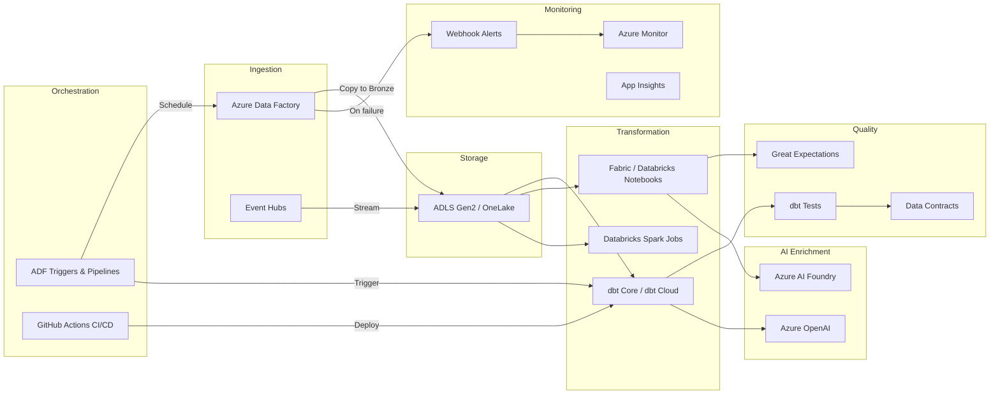

# Pipeline & Transform Migration: Foundry to Azure

**A technical deep-dive for data engineers migrating Palantir Foundry pipelines, transforms, and scheduling to Azure Data Factory, dbt, and Microsoft Fabric.**

---

## 1. Overview of Foundry pipeline architecture

Palantir Foundry organizes data transformation through a layered system that couples compute, orchestration, and governance into a single proprietary surface.

| Foundry component           | Purpose                                                                                                                           |
| --------------------------- | --------------------------------------------------------------------------------------------------------------------------------- |
| **Pipeline Builder**        | Visual drag-and-drop ETL designer with type-safe transforms, health checks, and LLM-assisted transform generation                 |
| **Code Repositories**       | Web-based IDE for Python, Java, SQL, and Mesa transforms with Git branching, pull requests, and CI/CD                             |
| **Python transforms**       | PySpark jobs wrapped in Foundry decorators (`@transform`, `@transform_df`, `@transform.using`) with automatic dependency tracking |
| **SQL transforms**          | Declarative SQL with automatic input/output dataset binding                                                                       |
| **Java transforms**         | Full Spark Java API for complex or performance-critical workloads                                                                 |
| **Incremental computation** | Process only changed rows or files since the last successful run                                                                  |
| **Streaming**               | Flink-based low-latency ingestion and transformation                                                                              |
| **Scheduling**              | Cron-based, dependency-based, and event-based triggers                                                                            |
| **Data Expectations**       | Assertion-based quality checks on pipeline outputs                                                                                |
| **Health Checks**           | Monitoring dashboards with alert routing to email, PagerDuty, and Slack                                                           |
| **LLM transforms**          | Classification, sentiment analysis, summarization, entity extraction, and translation using integrated LLMs                       |

The key architectural constraint is that every component above runs inside Foundry's proprietary runtime. Code, scheduling definitions, quality rules, and monitoring configuration are stored in Foundry-specific formats that cannot be exported to standard tooling without rewriting.

---

## 2. Azure pipeline architecture

The Azure equivalent separates concerns into purpose-built services, each best-in-class for its function.



**Why this is better:** Each service can be replaced independently. dbt models are portable SQL. ADF pipelines are ARM/Bicep templates stored in Git. Notebooks run on any Spark-compatible engine. There is no single vendor whose removal would require rewriting everything.

---

## 3. Pipeline Builder to ADF migration

Foundry's Pipeline Builder provides a visual canvas for connecting data sources, applying transforms, and scheduling execution. Azure Data Factory provides an equivalent visual designer with broader connector support.

### Foundry Pipeline Builder pattern

In Foundry, a typical ingestion pipeline is configured through the visual builder and produces a graph of dataset dependencies. Behind the scenes, it generates transform code and schedules. The pipeline is not exportable as a standard format.

### Azure Data Factory equivalent

CSA-in-a-Box provides a reference ADF pipeline for batch ingestion at `domains/shared/pipelines/adf/pl_ingest_to_bronze.json`:

```json
{
    "name": "pl_ingest_to_bronze",
    "properties": {
        "description": "Generic batch ingestion pipeline. Copies data from source to ADLS raw/bronze container with metadata logging.",
        "activities": [
            {
                "name": "SetIngestionTimestamp",
                "type": "SetVariable",
                "typeProperties": {
                    "variableName": "ingestionTimestamp",
                    "value": "@utcnow('yyyy-MM-ddTHH:mm:ssZ')"
                }
            },
            {
                "name": "CopyToRaw",
                "type": "Copy",
                "dependsOn": [
                    {
                        "activity": "SetIngestionTimestamp",
                        "dependencyConditions": ["Succeeded"]
                    }
                ],
                "typeProperties": {
                    "source": { "type": "DelimitedTextSource" },
                    "sink": {
                        "type": "ParquetSink",
                        "storeSettings": { "type": "AzureBlobFSWriteSettings" }
                    }
                }
            }
        ],
        "parameters": {
            "sourceContainer": {
                "type": "String",
                "defaultValue": "source-data"
            },
            "sourceFolderPath": { "type": "String" },
            "domainName": { "type": "String", "defaultValue": "shared" },
            "entityName": { "type": "String" }
        }
    }
}
```

The master orchestration pipeline (`pl_medallion_orchestration`) chains ingestion with dbt transforms through the full Bronze, Silver, and Gold medallion sequence:

```
ForEachEntity_IngestToBronze (parallel, batch=4)
    --> RunDbt_Bronze (tag:bronze)
        --> RunDbt_Silver (tag:silver)
            --> RunDbt_Gold (tag:gold)
                --> OnFailure: WebActivity alert via webhook
```

**CSA-in-a-Box evidence:** `domains/shared/pipelines/adf/pl_medallion_orchestration.json`

### Migration checklist

| Foundry Pipeline Builder feature | ADF equivalent                              | Notes                                           |
| -------------------------------- | ------------------------------------------- | ----------------------------------------------- |
| Drag-and-drop canvas             | ADF visual authoring                        | Near-identical experience                       |
| Source connectors                | 100+ ADF connectors                         | Broader connector coverage                      |
| Transform steps                  | ADF Data Flows / dbt models                 | dbt preferred for SQL transforms                |
| Dependency graph                 | ADF activity dependencies                   | `dependencyConditions` in JSON                  |
| Parameterization                 | ADF pipeline parameters                     | Expression language: `@pipeline().parameters.x` |
| Error handling                   | ADF failure dependencies + WebActivity      | Webhook alerts on failure                       |
| Version control                  | ADF Git integration (Azure Repos or GitHub) | ARM templates committed to repo                 |

---

## 4. Python transform migration

Foundry Python transforms use PySpark wrapped in proprietary decorators that handle input/output dataset binding, dependency tracking, and incremental computation. Migrating requires removing the decorator layer and replacing it with dbt models, Fabric notebooks, or Databricks jobs.

### Before: Foundry Python transform

```python
# Foundry Code Repository - Python transform
from transforms.api import transform_df, Input, Output

@transform_df(
    Output("/Company/datasets/silver/customers_cleaned"),
    source=Input("/Company/datasets/bronze/raw_customers"),
)
def compute(source):
    from pyspark.sql import functions as F

    return (
        source
        .dropDuplicates(["customer_id"])
        .withColumn("first_name", F.upper(F.trim(F.col("first_name"))))
        .withColumn("last_name", F.upper(F.trim(F.col("last_name"))))
        .withColumn("email", F.lower(F.trim(F.col("email"))))
        .withColumn("country_code", F.upper(F.coalesce(F.col("country"), F.lit("US"))))
        .filter(F.col("customer_id").isNotNull())
    )
```

### After: dbt SQL model (recommended path)

The same logic expressed as a dbt incremental model. This is the CSA-in-a-Box standard pattern from `domains/shared/dbt/models/silver/slv_customers.sql`:

```sql
{{
    config(
        materialized='incremental',
        unique_key='customer_sk',
        incremental_strategy='merge',
        file_format='delta',
        tags=['silver', 'customers'],
        on_schema_change='fail'
    )
}}

with bronze as (
    select * from {{ ref('brz_customers') }}
    
    where _dbt_loaded_at > (select max(_dbt_loaded_at) from {{ this }})
    
),

deduped as (
    select
        *,
        row_number() over (
            partition by customer_id
            order by _source_modified_at desc, _dbt_loaded_at desc
        ) as _row_num
    from bronze
),

cleaned as (
    select
        {{ dbt_utils.generate_surrogate_key(['customer_id']) }} as customer_sk,
        cast(customer_id as string) as customer_id,
        trim(upper(coalesce(first_name, ''))) as first_name,
        trim(upper(coalesce(last_name, ''))) as last_name,
        trim(lower(coalesce(email, ''))) as email,
        trim(upper(coalesce(country, 'US'))) as country_code,
        now() as _dbt_loaded_at,
        '{{ invocation_id }}' as _dbt_run_id
    from deduped
    where _row_num = 1
)

select * from cleaned
```

### After: Fabric/Databricks notebook (when PySpark is required)

For transforms that genuinely require Python (ML feature engineering, complex UDFs, API calls), use a Fabric or Databricks notebook:

```python
# Fabric / Databricks notebook - no proprietary decorators
from pyspark.sql import functions as F

# Read from Delta Lake directly - no Foundry Input() wrapper
bronze_df = spark.read.format("delta").table("bronze.raw_customers")

cleaned = (
    bronze_df
    .dropDuplicates(["customer_id"])
    .withColumn("first_name", F.upper(F.trim(F.col("first_name"))))
    .withColumn("last_name", F.upper(F.trim(F.col("last_name"))))
    .withColumn("email", F.lower(F.trim(F.col("email"))))
    .withColumn("country_code", F.upper(F.coalesce(F.col("country"), F.lit("US"))))
    .filter(F.col("customer_id").isNotNull())
    .withColumn("_processed_at", F.current_timestamp())
)

# Write to Delta Lake directly - no Foundry Output() wrapper
cleaned.write.format("delta").mode("overwrite").saveAsTable("silver.customers_cleaned")
```

### Key differences

| Foundry pattern               | Azure pattern                                              | Impact                                           |
| ----------------------------- | ---------------------------------------------------------- | ------------------------------------------------ |
| `@transform_df` decorator     | dbt `config()` block or plain Spark                        | Remove all Foundry imports                       |
| `Input("/path/to/dataset")`   | `{{ ref('model_name') }}` or `spark.read.table()`          | Dataset paths become dbt refs or catalog tables  |
| `Output("/path/to/dataset")`  | dbt materializes automatically or `df.write.saveAsTable()` | No explicit output declaration needed            |
| `@transform.using(param=...)` | dbt `{{ var('param') }}` or notebook widgets               | Parameters externalized                          |
| Foundry type system           | Delta Lake schema enforcement                              | Schema managed by Delta + dbt `on_schema_change` |

---

## 5. SQL transform migration to dbt

Foundry SQL transforms map directly to dbt models. The migration is primarily syntactic.

### Before: Foundry SQL transform

```sql
-- Foundry SQL Transform (Code Repository)
-- Inputs and outputs declared in the Foundry UI
SELECT
    order_id,
    customer_id,
    order_date,
    SUM(line_total) AS order_total,
    COUNT(*) AS line_count
FROM @input('bronze_orders')
GROUP BY order_id, customer_id, order_date
```

### After: dbt SQL model

```sql
-- domains/shared/dbt/models/silver/slv_orders.sql
{{
    config(
        materialized='incremental',
        unique_key='order_sk',
        incremental_strategy='merge',
        file_format='delta',
        tags=['silver', 'orders']
    )
}}

with source as (
    select * from {{ ref('brz_orders') }}
    
    where _dbt_loaded_at > (select max(_dbt_loaded_at) from {{ this }})
    
),

aggregated as (
    select
        {{ dbt_utils.generate_surrogate_key(['order_id']) }} as order_sk,
        order_id,
        customer_id,
        order_date,
        sum(line_total) as order_total,
        count(*) as line_count,
        now() as _dbt_loaded_at
    from source
    group by order_id, customer_id, order_date
)

select * from aggregated
```

### Translation rules

| Foundry SQL syntax        | dbt equivalent                                  |
| ------------------------- | ----------------------------------------------- |
| `@input('dataset_name')`  | `{{ ref('model_name') }}`                       |
| `@output('dataset_name')` | File name is the model name                     |
| Foundry-managed schema    | `schema.yml` with column definitions and tests  |
| Inline quality checks     | dbt tests in `schema.yml` or `tests/` directory |
| Dataset-level scheduling  | Handled by ADF triggers, not in the SQL         |

---

## 6. Incremental pipeline patterns

Foundry's incremental computation is one of its most valuable features. It processes only changed rows or files since the last successful run. dbt provides equivalent incremental functionality through its incremental materialization strategy.

### Before: Foundry incremental Python transform

```python
from transforms.api import transform, Input, Output, incremental

@incremental()
@transform(
    output=Output("/datasets/silver/transactions"),
    source=Input("/datasets/bronze/raw_transactions"),
)
def compute(source, output):
    # Foundry automatically tracks which rows/files are new
    new_rows = source.dataframe()
    output.write_dataframe(new_rows)
```

### After: dbt incremental model

The CSA-in-a-Box project configures incremental models at the project level in `dbt_project.yml`:

```yaml
models:
    csa_analytics:
        bronze:
            +materialized: incremental
            +file_format: delta
            +schema: bronze
        silver:
            +materialized: incremental
            +file_format: delta
            +schema: silver
            +incremental_strategy: merge
        gold:
            +materialized: table # Gold is full rebuild by default
            +file_format: delta
            +schema: gold
```

Individual models control incremental behavior:

```sql
-- Incremental merge pattern (CSA-in-a-Box standard)
{{
    config(
        materialized='incremental',
        unique_key='_surrogate_key',
        incremental_strategy='merge',
        file_format='delta',
        on_schema_change='fail'
    )
}}

with source as (
    select * from {{ source('raw_data', 'sample_customers') }}
    
    {{ incremental_file_filter(this) }}
    
),

staged as (
    select
        {{ dbt_utils.generate_surrogate_key(['customer_id']) }} as _surrogate_key,
        *,
        now() as _dbt_loaded_at,
        {{ source_file_path_from_metadata() }} as _source_file,
        {{ source_file_modification_time() }} as _source_modified_at,
        '{{ invocation_id }}' as _dbt_run_id
    from source
)

select * from staged
```

**CSA-in-a-Box evidence:** `domains/shared/dbt/models/bronze/brz_customers.sql`

### ADF incremental copy (for ingestion)

For source-system ingestion, ADF provides watermark-based and change-data-capture patterns:

```json
{
    "name": "IncrementalCopy",
    "type": "Copy",
    "typeProperties": {
        "source": {
            "type": "SqlSource",
            "sqlReaderQuery": {
                "value": "SELECT * FROM transactions WHERE modified_date > '@{pipeline().parameters.lastWatermark}'",
                "type": "Expression"
            }
        }
    }
}
```

### Incremental strategy comparison

| Pattern              | Foundry                                            | dbt on Azure                                       |
| -------------------- | -------------------------------------------------- | -------------------------------------------------- |
| **Row-level**        | `@incremental()` decorator, automatic row tracking | `is_incremental()` with timestamp watermark        |
| **File-level**       | Automatic new-file detection                       | `incremental_file_filter` macro (CSA-in-a-Box)     |
| **Merge (upsert)**   | Implicit on primary key                            | `incremental_strategy='merge'` + `unique_key`      |
| **Append-only**      | Output mode configuration                          | `incremental_strategy='append'`                    |
| **Full refresh**     | Manual trigger in UI                               | `dbt run --full-refresh` or ADF parameter          |
| **Schema evolution** | Handled by Foundry runtime                         | `on_schema_change='fail'` / `'append_new_columns'` |

---

## 7. Streaming migration approaches

Foundry uses Apache Flink for low-latency streaming pipelines. Azure provides multiple streaming options depending on latency requirements and complexity.

### Option A: Event Hubs + Stream Analytics (managed, lowest effort)

Best for: simple transformations, windowed aggregations, real-time dashboards.

```sql
-- Azure Stream Analytics query
SELECT
    System.Timestamp() AS window_end,
    device_id,
    AVG(temperature) AS avg_temp,
    MAX(temperature) AS max_temp,
    COUNT(*) AS reading_count
INTO [output-power-bi]
FROM [input-event-hub] TIMESTAMP BY event_time
GROUP BY
    device_id,
    TumblingWindow(minute, 5)
```

### Option B: Spark Structured Streaming (Databricks/Fabric)

Best for: complex transformations, ML scoring, multi-source joins.

```python
# Databricks or Fabric notebook
from pyspark.sql import functions as F

stream = (
    spark.readStream
    .format("kafka")
    .option("kafka.bootstrap.servers", broker)
    .option("subscribe", "raw-events")
    .load()
    .select(F.from_json(F.col("value").cast("string"), schema).alias("data"))
    .select("data.*")
)

# Write to Delta Lake with checkpoint for exactly-once semantics
(stream
    .writeStream
    .format("delta")
    .outputMode("append")
    .option("checkpointLocation", "/checkpoints/events")
    .toTable("silver.events_streaming")
)
```

### Option C: Fabric Real-Time Intelligence

Best for: organizations standardizing on Microsoft Fabric, Kusto-based analytics.

```kusto
// Fabric Eventhouse KQL query
RawEvents
| where ingestion_time() > ago(5m)
| summarize avg_temp = avg(temperature),
            max_temp = max(temperature),
            count = count()
  by device_id, bin(event_time, 5m)
| where avg_temp > 80.0
```

### Streaming migration decision matrix

| Requirement                             | Recommended Azure service      |
| --------------------------------------- | ------------------------------ |
| Simple aggregations, < 5 transforms     | Stream Analytics               |
| Complex joins, ML scoring, Python logic | Spark Structured Streaming     |
| Sub-second latency, KQL analytics       | Fabric Real-Time Intelligence  |
| IoT device management + streaming       | IoT Hub + Stream Analytics     |
| Message ordering guarantees             | Event Hubs with partition keys |

---

## 8. Scheduling migration

Foundry supports cron-based, dependency-based, and event-based scheduling. ADF provides direct equivalents through its trigger system.

### Before: Foundry scheduling

Foundry schedules are configured through the UI or API:

- **Cron schedules:** Run at fixed intervals (e.g., daily at 06:00 UTC)
- **Dependency triggers:** Run when upstream datasets are updated
- **Event triggers:** Run when external events occur (e.g., file arrival)

### After: ADF trigger types

CSA-in-a-Box provides reference triggers at `domains/shared/pipelines/adf/triggers/`.

**Schedule trigger** (replaces Foundry cron schedules):

```json
{
    "name": "tr_daily_medallion",
    "properties": {
        "type": "ScheduleTrigger",
        "typeProperties": {
            "recurrence": {
                "frequency": "Day",
                "interval": 1,
                "startTime": "2026-01-01T06:00:00Z",
                "timeZone": "UTC",
                "schedule": {
                    "hours": [6],
                    "minutes": [0]
                }
            }
        },
        "pipelines": [
            {
                "pipelineReference": {
                    "referenceName": "pl_medallion_orchestration",
                    "type": "PipelineReference"
                },
                "parameters": {
                    "environment": "prod",
                    "fullRefresh": false
                }
            }
        ]
    }
}
```

**CSA-in-a-Box evidence:** `domains/shared/pipelines/adf/triggers/tr_daily_medallion.json`

**Tumbling window trigger** (replaces Foundry dependency-based scheduling):

```json
{
    "name": "tr_hourly_ingest",
    "properties": {
        "type": "TumblingWindowTrigger",
        "typeProperties": {
            "frequency": "Hour",
            "interval": 1,
            "startTime": "2026-01-01T00:00:00Z",
            "retryPolicy": { "count": 3, "intervalInSeconds": 30 },
            "dependsOn": []
        }
    }
}
```

**Event-based trigger** (replaces Foundry event triggers):

```json
{
    "name": "tr_file_arrival",
    "properties": {
        "type": "BlobEventsTrigger",
        "typeProperties": {
            "blobPathBeginsWith": "/landing/sales/",
            "blobPathEndsWith": ".csv",
            "events": ["Microsoft.Storage.BlobCreated"],
            "scope": "/subscriptions/{sub}/resourceGroups/{rg}/providers/Microsoft.Storage/storageAccounts/{sa}"
        }
    }
}
```

### Schedule mapping reference

| Foundry schedule type          | ADF trigger type                                | Key configuration                         |
| ------------------------------ | ----------------------------------------------- | ----------------------------------------- |
| Cron (fixed interval)          | `ScheduleTrigger`                               | `recurrence.frequency`, `schedule.hours`  |
| Dependency (upstream complete) | `TumblingWindowTrigger` with `dependsOn`        | Chain triggers with dependency references |
| Event (file arrival)           | `BlobEventsTrigger`                             | `blobPathBeginsWith`, `events`            |
| Event (message arrival)        | `CustomEventsTrigger`                           | Event Grid topic subscription             |
| Manual                         | ADF API / `workflow_dispatch` in GitHub Actions | REST API or GitHub Actions manual trigger |

---

## 9. Data quality migration

Foundry Data Expectations allow pipeline authors to define assertions on output datasets. Azure provides richer alternatives through dbt tests, Great Expectations, and CSA-in-a-Box data contracts.

### Before: Foundry Data Expectations

```python
# Foundry Data Expectations
from transforms.api import transform_df, Input, Output
from transforms.expectations import expect_column_values_to_not_be_null
from transforms.expectations import expect_column_values_to_be_unique

@expect_column_values_to_not_be_null("customer_id")
@expect_column_values_to_be_unique("customer_id")
@transform_df(
    Output("/datasets/silver/customers"),
    source=Input("/datasets/bronze/raw_customers"),
)
def compute(source):
    return source.dropDuplicates(["customer_id"])
```

### After: dbt tests in schema.yml

CSA-in-a-Box defines quality tests in `domains/shared/dbt/models/silver/schema.yml`:

```yaml
version: 2

models:
    - name: slv_customers
      description: >
          Silver layer: Cleansed customer records. Deduped, standardized
          casing, validated email format, surrogate-keyed.
      columns:
          - name: customer_sk
            description: Surrogate key (md5 of customer_id).
            tests:
                - unique
                - not_null
          - name: customer_id
            description: Natural customer identifier from Bronze.
          - name: email
            description: Customer email (lowercased)
          - name: is_valid
            description: True when the row passes every quality check.
            tests:
                - not_null
          - name: category
            tests:
                - accepted_values:
                      values:
                          ["ELECTRONICS", "CLOTHING", "HOME", "BOOKS", "SPORTS"]
                      severity: warn
```

### After: CSA-in-a-Box data contracts

For cross-domain quality enforcement, CSA-in-a-Box uses data product contracts (`domains/finance/data-products/invoices/contract.yaml`):

```yaml
apiVersion: csa.microsoft.com/v1
kind: DataProductContract

metadata:
    name: finance.invoices
    domain: finance
    owner: finance-data-engineering@contoso.com
    version: "1.0.0"

schema:
    primary_key: [invoice_sk]
    columns:
        - name: invoice_sk
          type: string
          nullable: false
        - name: status
          type: string
          nullable: false
          allowed_values: [DRAFT, SENT, PAID, OVERDUE, CANCELLED, PARTIAL]

sla:
    freshness_minutes: 60
    valid_row_ratio: 0.97

quality_rules:
    - rule: expect_column_values_to_not_be_null
      column: invoice_sk
    - rule: expect_column_values_to_be_unique
      column: invoice_sk
    - rule: expect_column_values_to_be_in_set
      column: status
      value_set: [DRAFT, SENT, PAID, OVERDUE, CANCELLED, PARTIAL]
    - rule: expect_column_values_to_be_between
      column: total_amount
      min_value: 0
      mostly: 0.97
```

Contracts are validated in CI via `.github/workflows/validate-contracts.yml`.

### After: Inline validation flags (CSA-in-a-Box pattern)

Rather than filtering bad data, Silver models flag invalid records so Gold models can decide:

```sql
-- From slv_customers.sql - validation pattern
validated as (
    select
        *,
        case when customer_id is null or customer_id = ''
             then true else false end as _is_missing_id,
        {{ flag_invalid_email('email') }} as _is_invalid_email,
        case when first_name = '' and last_name = ''
             then true else false end as _is_missing_name
    from cleaned
)

select
    *,
    not (_is_missing_id or _is_invalid_email or _is_missing_name) as is_valid,
    concat_ws('; ',
        case when _is_missing_id then 'customer_id missing' end,
        case when _is_invalid_email then 'email failed regex validation' end,
        case when _is_missing_name then 'first_name and last_name both empty' end
    ) as validation_errors
from validated
```

### Quality migration comparison

| Foundry Expectations                  | Azure equivalent                                 | Advantage                                |
| ------------------------------------- | ------------------------------------------------ | ---------------------------------------- |
| `expect_column_values_to_not_be_null` | dbt `not_null` test                              | Identical semantics                      |
| `expect_column_values_to_be_unique`   | dbt `unique` test                                | Identical semantics                      |
| `expect_column_values_to_be_in_set`   | dbt `accepted_values` test                       | Supports `severity: warn`                |
| Custom expectations                   | dbt singular tests or `dbt_expectations` package | Richer test library                      |
| Pipeline-level health checks          | dbt source freshness + Azure Monitor alerts      | Broader alerting ecosystem               |
| Output assertions                     | Data contracts with CI validation                | Enforced at build time, not just runtime |

---

## 10. LLM enrichment pipelines on Azure

Foundry's LLM pipeline transforms provide built-in classification, sentiment analysis, summarization, entity extraction, and translation. On Azure, these capabilities are delivered through Azure OpenAI and Azure AI Foundry, integrated into data pipelines via ADF custom activities or notebooks.

### Before: Foundry LLM transform

```python
# Foundry LLM Transform (AIP-enabled pipeline)
from transforms.api import transform_df, Input, Output
from palantir_models.transforms import LlmTransform

@transform_df(
    Output("/datasets/enriched/classified_tickets"),
    source=Input("/datasets/silver/support_tickets"),
)
def compute(source):
    llm = LlmTransform(model="palantir-llm-v2")
    return llm.classify(
        source,
        input_col="ticket_text",
        output_col="category",
        labels=["billing", "technical", "account", "general"],
    )
```

### After: Azure OpenAI in a Fabric/Databricks notebook

```python
# Fabric or Databricks notebook with Azure OpenAI
import openai
from pyspark.sql import functions as F
from pyspark.sql.types import StringType

# Configure Azure OpenAI
client = openai.AzureOpenAI(
    azure_endpoint="https://<resource>.openai.azure.com/",
    api_version="2024-06-01",
    azure_ad_token_provider=get_bearer_token  # Managed Identity
)

def classify_ticket(text: str) -> str:
    response = client.chat.completions.create(
        model="gpt-4o",
        messages=[
            {"role": "system", "content": (
                "Classify the support ticket into exactly one category: "
                "billing, technical, account, general. "
                "Respond with only the category name."
            )},
            {"role": "user", "content": text}
        ],
        max_tokens=10,
        temperature=0.0
    )
    return response.choices[0].message.content.strip().lower()

# Register as Spark UDF
classify_udf = F.udf(classify_ticket, StringType())

# Read source data
tickets = spark.read.format("delta").table("silver.support_tickets")

# Apply classification with rate limiting via repartitioning
classified = (
    tickets
    .repartition(10)  # Control parallelism for API rate limits
    .withColumn("category", classify_udf(F.col("ticket_text")))
    .withColumn("_classified_at", F.current_timestamp())
)

classified.write.format("delta").mode("overwrite").saveAsTable("enriched.classified_tickets")
```

### After: ADF pipeline with Azure OpenAI custom activity

For batch LLM enrichment orchestrated through ADF:

```json
{
    "name": "LLM_Classify_Tickets",
    "type": "DatabricksNotebook",
    "typeProperties": {
        "notebookPath": "/notebooks/enrich/classify_support_tickets",
        "baseParameters": {
            "source_table": "silver.support_tickets",
            "target_table": "enriched.classified_tickets",
            "model_deployment": "gpt-4o",
            "batch_size": "100"
        }
    },
    "linkedServiceName": {
        "referenceName": "ls_databricks",
        "type": "LinkedServiceReference"
    }
}
```

### LLM use-case mapping

| Foundry LLM transform | Azure implementation                         | Service                |
| --------------------- | -------------------------------------------- | ---------------------- |
| Classification        | Azure OpenAI `gpt-4o` with structured output | Azure OpenAI           |
| Sentiment analysis    | Azure AI Language or OpenAI                  | AI Language / OpenAI   |
| Summarization         | Azure OpenAI `gpt-4o`                        | Azure OpenAI           |
| Entity extraction     | Azure AI Language NER or OpenAI              | AI Language / OpenAI   |
| Translation           | Azure AI Translator or OpenAI                | AI Translator / OpenAI |
| Embedding generation  | Azure OpenAI `text-embedding-3-large`        | Azure OpenAI           |
| RAG enrichment        | Azure AI Search + OpenAI                     | AI Foundry             |

---

## 11. CI/CD for pipelines

Foundry Code Repositories provide a built-in web IDE with Git branching, pull requests, and CI checks. On Azure, pipeline and transform code lives in standard Git repositories with GitHub Actions (or Azure DevOps Pipelines) for CI/CD.

### CSA-in-a-Box CI/CD architecture

The reference CI/CD workflow deploys dbt models to Databricks across multiple verticals. From `.github/workflows/deploy-dbt.yml`:

```yaml
name: Deploy dbt Models

on:
    push:
        branches: [main]
        paths:
            - "domains/*/dbt/**"
    workflow_dispatch:
        inputs:
            vertical:
                description: 'Vertical to deploy (or "all")'
                required: true
                type: choice
                options: [all, usda, dot, usps, noaa, epa, commerce, interior]
            environment:
                description: "Target environment"
                type: choice
                options: [dev, staging, prod]
            full_refresh:
                description: "Run full refresh (drop and recreate)"
                type: boolean
                default: false

jobs:
    deploy:
        runs-on: ubuntu-latest
        steps:
            - uses: actions/checkout@v4
            - uses: actions/setup-python@v5
              with:
                  python-version: "3.12"
            - run: pip install dbt-databricks==1.8.* dbt-core==1.8.*
            - run: dbt deps
            - run: dbt seed --target ${{ inputs.environment }}
            - run: dbt run --target ${{ inputs.environment }}
            - run: dbt test --target ${{ inputs.environment }}
            - uses: actions/upload-artifact@v4
              with:
                  name: dbt-artifacts
                  path: |
                      target/manifest.json
                      target/run_results.json
```

### Data contract validation in CI

Quality gates enforce contracts before code reaches production:

```yaml
# .github/workflows/validate-contracts.yml (simplified)
name: Validate Data Contracts

on:
    pull_request:
        paths:
            - "domains/*/data-products/*/contract.yaml"

jobs:
    validate:
        runs-on: ubuntu-latest
        steps:
            - uses: actions/checkout@v4
            - run: pip install pyyaml jsonschema
            - run: python -m governance.contracts.contract_validator
```

### CI/CD comparison

| Foundry CI/CD feature     | Azure equivalent                            | CSA-in-a-Box evidence                      |
| ------------------------- | ------------------------------------------- | ------------------------------------------ |
| Code Repository (web IDE) | GitHub + VS Code / Codespaces               | Standard Git workflow                      |
| Branch-based development  | Git branches + pull requests                | GitHub flow                                |
| CI checks on PR           | GitHub Actions                              | `.github/workflows/deploy-dbt.yml`         |
| Automated testing         | `dbt test` in CI pipeline                   | Test step in deploy workflow               |
| Environment promotion     | Workflow dispatch with environment selector | `dev` / `staging` / `prod` targets         |
| Artifact tracking         | GitHub Actions artifacts                    | `manifest.json`, `run_results.json`        |
| Contract validation       | CI contract checks                          | `.github/workflows/validate-contracts.yml` |

---

## 12. Performance comparison

The following benchmarks are representative of typical mid-sized federal deployments (20 TB, 50-100 pipelines, 500 analytic users). Actual performance varies by workload, data volume, and SKU selection.

### ETL throughput

| Workload                        | Foundry (typical) | Azure (dbt + Databricks) | Notes                                       |
| ------------------------------- | ----------------- | ------------------------ | ------------------------------------------- |
| 10 GB CSV ingest to Parquet     | 8-12 min          | 3-5 min                  | ADF parallel copy + ADLS Gen2               |
| 1 TB incremental merge          | 15-25 min         | 8-15 min                 | dbt merge on Delta Lake, Photon-accelerated |
| 100 SQL transforms (Silver)     | 20-30 min         | 10-20 min                | dbt parallel execution (`threads: 8`)       |
| Full medallion pipeline (20 TB) | 2-4 hours         | 1-2 hours                | ADF orchestration + dbt + Databricks        |

### Cost efficiency

| Metric                                        | Foundry                      | Azure                                   |
| --------------------------------------------- | ---------------------------- | --------------------------------------- |
| Compute for 8-hour daily pipeline window      | Included in license (opaque) | ~$150-300/day (Databricks Jobs Compute) |
| Additional per-seat cost for pipeline authors | $15,000-25,000/seat/year     | $0 (GitHub seats, ~$4/user/month)       |
| Storage (20 TB Delta Lake)                    | Included in license (opaque) | ~$400/month (ADLS Gen2 Hot)             |
| Monitoring and alerting                       | Included                     | ~$50-100/month (Azure Monitor)          |

### Operational advantages

| Dimension               | Foundry                                  | Azure                                                         |
| ----------------------- | ---------------------------------------- | ------------------------------------------------------------- |
| **Debugging**           | Foundry-specific logs, limited to web UI | Spark UI, ADF Monitor, Log Analytics, local dbt debug         |
| **Local development**   | Not supported (cloud-only IDE)           | Full local dev with dbt + DuckDB or local Spark               |
| **Testing**             | Foundry-specific test framework          | dbt tests, pytest, Great Expectations (industry standard)     |
| **Talent availability** | Small, specialized pool                  | Large pool (dbt, Spark, SQL, Python are commodity skills)     |
| **Vendor portability**  | Locked to Foundry runtime                | dbt runs on Databricks, Snowflake, BigQuery, Fabric, Postgres |

---

## 13. Common pitfalls

### Pitfall 1: Attempting a 1:1 port of Foundry transforms

**Problem:** Teams try to replicate every Foundry Python transform as an identical PySpark notebook. This preserves the most complex, hardest-to-maintain pattern.

**Solution:** Audit each transform. If the logic is expressible in SQL (and 80%+ of transforms are), convert to a dbt model. Reserve notebooks for genuine Python requirements: ML features, API integrations, complex UDFs.

### Pitfall 2: Ignoring dbt incremental strategies

**Problem:** Teams materialize everything as `table` (full rebuild), causing pipeline runtimes to grow linearly with data volume.

**Solution:** Use `materialized='incremental'` with `incremental_strategy='merge'` for Silver and Bronze models. Use timestamp watermarks (`_dbt_loaded_at`) to process only new data. CSA-in-a-Box configures this at the project level in `dbt_project.yml`.

### Pitfall 3: Replicating Foundry's monolithic scheduling

**Problem:** Foundry's dependency-based scheduling rebuilds the entire DAG on any upstream change. Teams replicate this with a single ADF trigger that runs everything.

**Solution:** Use ADF's composable trigger system. Schedule ingestion hourly (`tr_hourly_ingest`), run the full medallion pipeline daily (`tr_daily_medallion`), and use event-based triggers for latency-sensitive sources. Let dbt's `is_incremental()` logic handle partial runs efficiently.

### Pitfall 4: Not externalizing data quality

**Problem:** Teams embed quality checks inside transform code (Python assertions, `try/except` blocks) instead of using declarative quality frameworks.

**Solution:** Use dbt tests in `schema.yml` for column-level assertions. Use data contracts (`contract.yaml`) for cross-domain SLAs. Use inline validation flags (`is_valid`, `validation_errors`) instead of silently dropping bad records. This approach is auditable, version-controlled, and enforceable in CI.

### Pitfall 5: Underestimating streaming migration complexity

**Problem:** Teams assume Foundry Flink pipelines can be directly ported to Spark Structured Streaming.

**Solution:** Evaluate latency requirements honestly. Many "streaming" pipelines in Foundry are actually micro-batch with 5-15 minute windows. If true sub-second latency is not required, use ADF scheduled triggers with short intervals or dbt incremental models. If sub-second latency is required, evaluate Stream Analytics (simplest), Spark Structured Streaming (most flexible), or Fabric Real-Time Intelligence (best for KQL-centric teams).

### Pitfall 6: Skipping the local development workflow

**Problem:** Teams develop dbt models only in cloud environments, losing the fast iteration loop.

**Solution:** Use dbt with DuckDB locally for development and testing. The CSA-in-a-Box dbt project supports DuckDB as a development target (note the `if target.type != 'duckdb'` conditionals in model configs). Run `dbt build` locally in seconds, then deploy to Databricks via CI/CD.

### Pitfall 7: Not mapping Foundry Health Checks to Azure Monitor

**Problem:** After migration, teams lose visibility into pipeline health because they did not set up equivalent alerting.

**Solution:** Configure Azure Monitor alerts for ADF pipeline failures. Use dbt source freshness tests for data-arrival monitoring. Set up webhook activities in ADF for failure notifications (see `OnPipelineFailure` in `pl_medallion_orchestration`). Route alerts to Teams, Slack, PagerDuty, or email through Azure Monitor action groups.

---

## Summary: migration path by component

| Foundry component       | Primary Azure target               | Secondary option                   | CSA-in-a-Box evidence                    |
| ----------------------- | ---------------------------------- | ---------------------------------- | ---------------------------------------- |
| Pipeline Builder        | ADF visual designer                | Fabric Data Factory                | `domains/shared/pipelines/adf/`          |
| Code Repositories       | GitHub + VS Code                   | Azure Repos                        | `.github/workflows/`                     |
| Python transforms       | dbt SQL models                     | Fabric/Databricks notebooks        | `domains/shared/dbt/models/`             |
| SQL transforms          | dbt SQL models                     | Fabric SQL                         | `domains/shared/dbt/models/`             |
| Java transforms         | Databricks Spark jobs              | AKS Spark Submit                   | N/A (use notebooks)                      |
| Incremental computation | dbt incremental models             | ADF incremental copy               | `dbt_project.yml`                        |
| Streaming               | Event Hubs + Stream Analytics      | Spark Structured Streaming         | `domains/shared/notebooks/`              |
| Scheduling              | ADF triggers                       | GitHub Actions `workflow_dispatch` | `domains/shared/pipelines/adf/triggers/` |
| Data Expectations       | dbt tests + data contracts         | Great Expectations                 | `domains/shared/dbt/models/*/schema.yml` |
| Health Checks           | Azure Monitor + ADF webhook alerts | dbt source freshness               | `pl_medallion_orchestration.json`        |
| LLM transforms          | Azure OpenAI + notebooks           | Azure AI Foundry                   | `domains/shared/notebooks/`              |

---

**Last updated:** 2026-04-30
**Maintainers:** CSA-in-a-Box core team
**See also:** [Data Integration Migration](data-integration-migration.md) | [DevOps Migration](devops-migration.md) | [AI & AIP Migration](ai-migration.md) | [Migration Playbook](../palantir-foundry.md)
