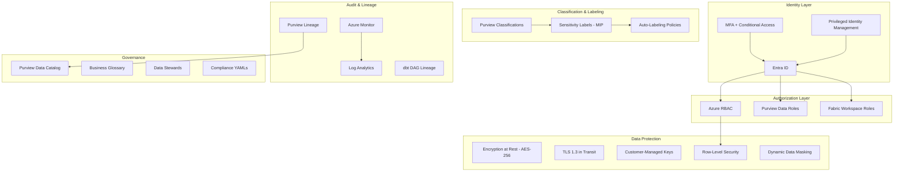

# Security and Governance Migration: Palantir Foundry to Azure

**A deep-dive technical guide for security architects, governance leads, and compliance officers migrating Foundry's security and governance controls to Azure-native services and CSA-in-a-Box.**

---

## Executive summary

Palantir Foundry provides a vertically integrated security and governance stack: Projects for access boundaries, Markings for mandatory access control, Organizations for multi-tenant separation, and built-in audit, lineage, and compliance capabilities. Everything lives inside a single proprietary control plane.

Azure distributes these capabilities across purpose-built services --- Entra ID for identity, Purview for classification and lineage, Azure Monitor for audit, RBAC for authorization, and Microsoft Information Protection for labeling --- each of which is independently configurable, auditable, and portable. CSA-in-a-Box provides automation to wire these services together into a cohesive governance fabric that matches or exceeds Foundry's capabilities while preserving open standards and organizational sovereignty.

This guide maps every Foundry security and governance feature to its Azure equivalent, provides migration procedures and worked examples, and highlights pitfalls to avoid.

---

## 1. Foundry security model overview

Foundry's security model is built on five interlocking layers:

```
+--------------------------------------------------------------+
|                   ORGANIZATIONS (tenant silos)                |
|  +--------------------------------------------------------+  |
|  |                    PROJECTS (RBAC boundary)             |  |
|  |  +--------------------------------------------------+  |  |
|  |  |          MARKINGS (mandatory access control)      |  |  |
|  |  |  +--------------------------------------------+  |  |  |
|  |  |  |   ROW / COLUMN SECURITY (fine-grained)     |  |  |  |
|  |  |  |  +--------------------------------------+  |  |  |  |
|  |  |  |  | ENCRYPTION (at rest / in transit)    |  |  |  |  |
|  |  |  |  +--------------------------------------+  |  |  |  |
|  |  |  +--------------------------------------------+  |  |  |
|  |  +--------------------------------------------------+  |  |
|  +--------------------------------------------------------+  |
+--------------------------------------------------------------+
```

**Projects** are the primary security boundary. Every dataset, code repository, pipeline, and application lives inside a Project. Projects have four built-in roles: Owner, Editor, Viewer, and Discoverer.

**Organizations** provide hard multi-tenant separation. Users in one Organization cannot see resources in another unless explicitly bridged.

**Markings** are mandatory access controls. A marking like `PII` or `CLASSIFIED` is applied to a dataset, column, or object, and the system enforces that only users with the corresponding marking grant can access it. Markings propagate automatically through transformations --- if an input dataset carries a `PII` marking, every downstream output inherits it.

**Row/column security** provides fine-grained access within a dataset. Column-level markings hide specific fields; row-level policies filter records based on user attributes.

**Encryption** covers all data at rest (AES-256) and in transit (TLS 1.2+).

Cross-cutting concerns include SSO/SAML federation, MFA enforcement, comprehensive audit logging, full data lineage, sensitive data scanning, retention policies, and checkpoint justifications (requiring users to state a reason before accessing sensitive data).

---

## 2. Azure security model comparison

Azure decomposes Foundry's monolithic security stack into specialized services that compose together.



### Concept mapping table

| Foundry concept | Azure equivalent | CSA-in-a-Box automation |
|---|---|---|
| Project | Resource Group + Purview Collection + Fabric Workspace | Bicep landing zone templates |
| Organization | Entra ID Tenant / Management Group | Management group hierarchy |
| Roles (Owner/Editor/Viewer/Discoverer) | Azure RBAC + Purview Data Roles + Fabric Roles | RBAC matrix (`rbac-matrix.json`) |
| Markings | Purview Classifications + Sensitivity Labels (MIP) | Classification YAMLs + `purview_automation.py` |
| Encryption at rest | Azure Storage Service Encryption (AES-256) / CMK | Bicep encryption config |
| Encryption in transit | TLS 1.3 enforced by platform | Policy assignments |
| Audit logging | Azure Monitor + Entra ID Sign-in Logs + Log Analytics | CSA-0016 tamper-evident audit |
| Data lineage | Purview Lineage + dbt DAG | `purview_automation.py` lineage registration |
| Sensitive data scanning | Purview Auto-Scanning + Auto-Labeling | Classification rule YAMLs |
| Retention policies | Storage Lifecycle Management + Purview Retention | Bicep lifecycle rules |
| Row/column security | Fabric RLS + Power BI RLS + Dynamic Data Masking | dbt model configs |
| SSO/SAML | Entra ID (SAML, OIDC, WS-Fed) | Entra ID tenant configuration |
| MFA | Entra MFA + Conditional Access | Conditional Access policies |
| Checkpoint justifications | PIM Justifications + Access Reviews | PIM configuration |
| Data Health | Azure Monitor + dbt source freshness + Data Activator | Monitor workbooks |
| Data Expectations | dbt tests + Great Expectations | dbt test suites |
| Classification taxonomy | Purview Classification Rules + Custom Classifiers | Classification YAMLs |
| Data discovery | Purview Data Catalog + Fabric OneLake Data Hub | Purview scan schedules |
| Stewardship | Purview Stewards + Glossary Term Owners | Glossary term YAMLs |
| Usage analytics | Azure Monitor Workbooks + Log Analytics | KQL query library |
| Compliance controls | Azure Compliance (100+ standards) + CSA-in-a-Box YAMLs | NIST, CMMC, HIPAA YAMLs |

---

## 3. Identity and access migration

### 3.1 SSO and authentication

Foundry federates with Active Directory via SAML. Azure replaces this with native Entra ID integration --- no federation bridge is needed because Entra ID **is** the identity provider.

**Migration steps:**

1. **Inventory Foundry SSO configuration.** Export the SAML metadata, attribute mappings, and group-to-role assignments from Foundry's authentication settings.
2. **Map Foundry groups to Entra ID security groups.** For each Foundry Organization, create a corresponding Entra ID security group. For each Foundry Project, create a group per role level (e.g., `sg-project-alpha-contributors`, `sg-project-alpha-readers`).
3. **Configure Conditional Access policies.** Replace Foundry's MFA settings with Entra ID Conditional Access policies that enforce MFA, device compliance, and location restrictions.
4. **Enable PIM for privileged roles.** Foundry's checkpoint justifications --- which require users to state a reason before accessing sensitive data --- map to Entra PIM's just-in-time access with mandatory justification fields.

### 3.2 Role mapping

Foundry roles map to Azure RBAC, Purview, and Fabric roles:

| Foundry role | Azure RBAC | Purview role | Fabric role | Permissions |
|---|---|---|---|---|
| Owner | Owner / User Access Admin | Collection Admin | Admin | Full control including access management |
| Editor | Contributor | Data Curator | Member | Create, update, delete resources; no access management |
| Viewer | Reader | Data Reader | Viewer | Read-only access to resources and data |
| Discoverer | (custom) | Data Reader (metadata only) | (none -- use shared links) | See metadata and descriptions; no data access |

**Key difference:** Foundry collapses RBAC and data-plane roles into a single model. Azure separates them. A user might have Azure RBAC `Reader` on a resource group (control plane) while holding Purview `Data Curator` (data governance plane) and Fabric `Member` (analytics plane). This separation provides finer-grained control but requires deliberate role planning.

### 3.3 Multi-tenancy

Foundry Organizations provide hard multi-tenant separation. Azure offers two options:

- **Entra ID Management Groups** for logical separation within a single tenant (most common for internal organizational boundaries).
- **Separate Entra ID Tenants** for hard multi-tenant isolation (required when data sovereignty mandates true tenant separation, such as cross-agency scenarios).

CSA-in-a-Box deploys a management group hierarchy by default, with separate subscriptions for shared services, data management, and each data landing zone --- achieving organizational separation without the overhead of multiple tenants.

---

## 4. Classification and marking migration

This is the most complex area of migration. Foundry Markings are mandatory access controls that propagate through the data pipeline. Azure achieves equivalent functionality through the combination of Purview Classifications, Microsoft Information Protection (MIP) Sensitivity Labels, and auto-labeling policies.

### 4.1 How Foundry Markings work

- A marking (e.g., `PII`, `PHI`, `CLASSIFIED`) is applied to a dataset or column.
- Users must have the corresponding marking grant to access marked resources.
- Markings **propagate automatically**: if a transformation reads a `PII`-marked dataset, its output is automatically `PII`-marked.
- Markings are enforced at the platform level --- no application code can bypass them.

### 4.2 Azure equivalent: Classifications + Sensitivity Labels

Azure implements marking functionality through two complementary systems:

**Purview Classifications** identify what data is (PII, PHI, financial, government). They are metadata tags applied through automated scanning or manual assignment. Classifications alone do not enforce access control.

**MIP Sensitivity Labels** enforce access control. When a classification triggers a sensitivity label, that label controls who can access, copy, forward, or download the data. Labels can encrypt content, add watermarks, restrict sharing, and audit access.

**Together**, classifications detect sensitive data and sensitivity labels enforce access restrictions --- replicating Foundry's marking behavior.

### 4.3 Marking-to-classification mapping

| Foundry marking | Purview classification | MIP sensitivity label | CSA-in-a-Box YAML |
|---|---|---|---|
| PII | `CSA_PII_SSN`, `CSA_PII_EMAIL`, `CSA_PII_PHONE`, etc. | Restricted / Confidential | `pii_classifications.yaml` |
| PHI | `CSA_PHI_DIAGNOSIS`, `CSA_PHI_MEDICATION`, `CSA_PHI_MRN`, etc. | Restricted (Healthcare) | `phi_classifications.yaml` |
| CUI | `CSA_GOV_CUI_MARKING` | Restricted (Government) | `government_classifications.yaml` |
| FOUO | `CSA_GOV_FOUO` | Restricted (Government) | `government_classifications.yaml` |
| CLASSIFIED | `CSA_GOV_CLASSIFICATION_LEVEL` | Highly Restricted | `government_classifications.yaml` |
| Financial | `CSA_FIN_ACCOUNT_NUMBER`, `CSA_FIN_CREDIT_CARD`, etc. | Confidential (Financial) | `financial_classifications.yaml` |

### 4.4 Marking propagation

Foundry automatically propagates markings through transformations. Azure achieves equivalent behavior through:

1. **Purview lineage-aware labeling.** When Purview captures lineage (from ADF, Fabric, or dbt), sensitivity labels can be configured to propagate from source to sink through label inheritance policies.
2. **dbt meta tags.** CSA-in-a-Box uses dbt `meta` tags to carry classification metadata through the transformation layer. When dbt models declare `meta: {classification: "PII"}`, the Purview automation module reads these tags and applies classifications to downstream assets.
3. **Auto-labeling policies.** MIP auto-labeling policies continuously scan new and modified assets, applying labels based on content inspection --- catching any sensitive data that enters the system regardless of lineage.

**Important:** Marking propagation in Azure is not fully automatic out of the box. CSA-in-a-Box bridges this gap through the `purview_automation.py` module, which reads dbt lineage manifests and applies inherited classifications to downstream assets.

### 4.5 Migration procedure

1. **Export Foundry markings inventory.** List all markings, their descriptions, the datasets and columns they apply to, and the user groups that hold marking grants.
2. **Map to CSA-in-a-Box classification YAMLs.** Match each marking to the corresponding YAML in `csa_platform/governance/purview/classifications/`. Create custom classification rules for any markings not covered by the built-in rule sets.
3. **Apply classifications via automation.**

   ```python
   from csa_platform.governance.purview.purview_automation import PurviewAutomation
   from azure.identity import DefaultAzureCredential

   purview = PurviewAutomation(
       account_name="purview-prod",
       credential=DefaultAzureCredential(),
   )

   # Apply all CSA-in-a-Box classification rule sets
   purview.apply_classification_rules("classifications/pii_classifications.yaml")
   purview.apply_classification_rules("classifications/phi_classifications.yaml")
   purview.apply_classification_rules("classifications/government_classifications.yaml")
   purview.apply_classification_rules("classifications/financial_classifications.yaml")
   ```

4. **Configure sensitivity labels.** In the Microsoft Purview compliance portal, create sensitivity labels that correspond to each classification tier (Public, Internal, Confidential, Restricted, Highly Restricted). Configure auto-labeling rules that trigger on Purview classifications.
5. **Validate propagation.** Run a test pipeline that transforms a PII-marked dataset. Verify that the output dataset inherits the PII classification and that the sensitivity label is applied.

---

## 5. Audit and lineage migration

### 5.1 Audit logging

Foundry provides a single audit log covering all user actions, data access, API calls, and system events. Azure distributes audit across multiple log streams that converge in Log Analytics.

| Foundry audit scope | Azure log source | Destination |
|---|---|---|
| User login / logout | Entra ID Sign-in Logs | Log Analytics |
| Resource access | Azure Monitor Activity Logs | Log Analytics |
| Data reads / writes | Storage Diagnostics + Fabric Audit Logs | Log Analytics |
| API calls | Azure Monitor Resource Logs | Log Analytics |
| Admin actions | Entra ID Audit Logs | Log Analytics |
| Governance changes | Purview Audit Logs | Log Analytics |

**CSA-in-a-Box integration:** The tamper-evident audit pattern (CSA-0016) consolidates all log streams into a single Log Analytics workspace with immutable storage and cross-workspace correlation. This provides a unified audit view equivalent to Foundry's single pane.

**Migration steps:**

1. **Enable diagnostic settings** on all Azure resources to route logs to a central Log Analytics workspace.
2. **Configure Entra ID log export** to the same workspace.
3. **Deploy CSA-in-a-Box audit workbooks** that replicate Foundry's audit dashboard views (who accessed what, when, and from where).
4. **Set up alerts** for high-risk events (bulk data exports, privilege escalation, access from unusual locations) using Azure Monitor alert rules.

### 5.2 Data lineage

Foundry tracks lineage from source through every transformation to final consumers. Azure Purview captures equivalent lineage through multiple integration points.

| Lineage source | How Purview captures it |
|---|---|
| Azure Data Factory pipelines | Native integration --- lineage auto-captured for copy activities and data flows |
| Microsoft Fabric notebooks | Native integration --- lineage captured for Spark transformations |
| dbt transformations | CSA-in-a-Box `purview_automation.py` reads `manifest.json` and registers lineage |
| Databricks | Purview connector captures Spark lineage |
| Power BI | Native integration --- lineage from dataset to report to dashboard |

**Migration steps:**

1. **Register data sources** in Purview for all storage accounts, databases, and Fabric workspaces.
2. **Enable built-in lineage** for ADF, Fabric, and Databricks by configuring the Purview connections in each service.
3. **Register dbt lineage** using the CSA-in-a-Box automation module:

   ```python
   purview.register_dbt_lineage(
       manifest_path="target/manifest.json",
       run_results_path="target/run_results.json",
   )
   ```

4. **Validate end-to-end lineage** in the Purview Data Catalog. Verify that you can trace a dataset from its source system through ingestion, transformation, and downstream reports.

---

## 6. Data protection migration

### 6.1 Encryption

| Foundry | Azure | Notes |
|---|---|---|
| AES-256 at rest (platform-managed) | Azure Storage Service Encryption (AES-256) | Enabled by default on all Azure storage |
| TLS in transit | TLS 1.3 enforced by platform | Azure enforces TLS 1.2 minimum; most services default to TLS 1.3 |
| Customer-managed keys (optional) | Azure Key Vault + CMK | CSA-in-a-Box Bicep templates deploy Key Vault with RBAC access policies |

No migration action is required for encryption --- Azure provides equivalent or stronger encryption by default. Organizations requiring customer-managed keys configure Azure Key Vault during landing zone deployment.

### 6.2 Row-level and column-level security

Foundry provides row and column security through markings and row-level policies. Azure offers multiple enforcement points.

**Column-level security:**

- **Dynamic Data Masking (DDM)** in Azure SQL and Synapse hides sensitive columns from unauthorized users, showing partial or masked values.
- **Column-level grants** in SQL restrict SELECT permissions on specific columns.
- **Sensitivity labels** can prevent labeled columns from being copied or exported.

**Row-level security:**

- **Fabric RLS** uses DAX filters in semantic models to restrict which rows a user can see.
- **Power BI RLS** applies row filters at the report level.
- **Database RLS** (SQL Server / Synapse) uses security predicates as filter functions.

**Example: Migrating a Foundry row-level policy to Fabric RLS**

Foundry row-level policy (pseudo-code):
```
FILTER dataset WHERE region IN user.allowed_regions
```

Equivalent Fabric DAX security role:
```dax
[Region] IN VALUES('UserPermissions'[AllowedRegion])
```

### 6.3 Checkpoint justifications

Foundry's checkpoint justifications require users to state a business reason before accessing sensitive datasets. Azure replicates this through two mechanisms:

1. **Entra PIM (Privileged Identity Management).** Users activate elevated roles on demand, providing a justification. Activation can require manager approval and automatically expires after a configured period.
2. **Entra Access Reviews.** Periodic reviews require users to re-justify their access. Reviewers can revoke access for users who no longer need it.

PIM justifications are captured in the Entra ID audit log, providing the same audit trail as Foundry's checkpoint log.

---

## 7. Compliance framework mapping

CSA-in-a-Box provides machine-readable compliance control mappings that align Foundry's built-in compliance capabilities to Azure evidence.

### 7.1 Framework coverage

| Compliance framework | Foundry approach | Azure + CSA-in-a-Box approach | CSA-in-a-Box YAML |
|---|---|---|---|
| FedRAMP (Moderate/High) | Platform-level authorization | Azure Government FedRAMP High + CSA control evidence | `nist-800-53-rev5.yaml` |
| NIST 800-53 Rev 5 | Inherited from platform | Control-by-control mapping with evidence paths | `nist-800-53-rev5.yaml` |
| CMMC 2.0 Level 2 | Platform assertion | Practice-by-practice mapping with implementation evidence | `cmmc-2.0-l2.yaml` |
| HIPAA Security Rule | Platform BAA | Azure BAA + control implementation evidence | `hipaa-security-rule.yaml` |
| SOC 2 Type II | Palantir SOC 2 report | Azure SOC 2 report + CSA implementation controls | Inherited from Azure |

### 7.2 Control mapping structure

Each CSA-in-a-Box compliance YAML follows a consistent structure with status tracking and evidence paths:

```yaml
framework: "NIST 800-53 Rev 5"
baseline: "Moderate + High"
version: "2026-04"

controls:
  - id: "AC-1"
    title: "Policy and Procedures"
    family: "AC"
    status: "PARTIALLY_IMPLEMENTED"   # IMPLEMENTED | PARTIALLY_IMPLEMENTED | PLANNED | INHERITED
    evidence:
      - kind: "doc"                   # bicep | policy | code | script | ci | doc | config
        path: "csa_platform/governance/compliance/compliance-overview.md"
        note: "Access control narrative"
      - kind: "config"
        path: "csa_platform/governance/rbac/rbac-matrix.json"
        note: "RBAC persona / role matrix"
    gaps:
      - description: "Policy ownership not yet assigned"
        tracking: "CSA-XXXX"
```

**Migration benefit:** Foundry provides compliance as a platform assertion ("Foundry is FedRAMP authorized"). Azure and CSA-in-a-Box provide control-by-control evidence that your specific implementation meets each control requirement. This gives auditors granular traceability rather than blanket platform assertions.

### 7.3 Migration steps

1. **Inventory your compliance obligations.** Determine which frameworks apply to your organization (FedRAMP, CMMC, HIPAA, SOC 2, etc.).
2. **Review CSA-in-a-Box compliance YAMLs.** Located at:
   - `csa_platform/governance/compliance/nist-800-53-rev5.yaml`
   - `csa_platform/governance/compliance/cmmc-2.0-l2.yaml`
   - `csa_platform/governance/compliance/hipaa-security-rule.yaml`
3. **Map your Foundry controls.** For each control you currently satisfy through Foundry, identify the corresponding CSA-in-a-Box evidence path and status.
4. **Address gaps.** For controls with `PLANNED` or `PARTIALLY_IMPLEMENTED` status, create implementation tasks. Some controls are `INHERITED` from Azure's shared responsibility model.

---

## 8. Sensitive data scanning migration

Foundry scans datasets for PII, PHI, and other sensitive patterns. Purview provides equivalent capability through automated scanning with custom classification rules.

### 8.1 CSA-in-a-Box classification rule sets

CSA-in-a-Box ships four classification rule sets that cover the most common sensitive data categories:

| Rule set | File | Patterns covered |
|---|---|---|
| PII | `pii_classifications.yaml` | SSN, email, phone, address, full name, DOB, driver's license, IP address |
| PHI | `phi_classifications.yaml` | Diagnosis codes, medications, medical record numbers, insurance IDs, lab results |
| Government | `government_classifications.yaml` | CUI markings, FOUO, classification levels, federal employee IDs, case numbers, FIPS codes, grant numbers, law enforcement sensitive |
| Financial | `financial_classifications.yaml` | Account numbers, credit cards, routing numbers, tax IDs |

### 8.2 Classification rule YAML structure

Each rule set defines detection patterns, column name patterns, sensitivity levels, and auto-labeling policies:

```yaml
apiVersion: csa.microsoft.com/v1
kind: ClassificationRuleSet

metadata:
  name: pii-classifications
  version: "1.0.0"
  owner: governance-team@contoso.com
  tags: [pii, classification, purview, compliance]
  regulations: [NIST-800-122, CCPA, HIPAA-Safe-Harbor]

defaultSensitivity: Restricted
minimumPercentageMatch: 60.0

classifications:
  - name: CSA_PII_SSN
    description: US Social Security Number
    category: PII
    subcategory: Government ID
    sensitivity: Restricted
    dataPatterns:
      - pattern: '\b\d{3}-\d{2}-\d{4}\b'
        description: SSN with dashes (123-45-6789)
    columnPatterns:
      - pattern: '(?i)(ssn|social_security|social_sec)'
        description: Column names indicating SSN
    minimumPercentageMatch: 80.0
    builtInClassifier: MICROSOFT.PERSONAL.US.SOCIAL_SECURITY_NUMBER
    remediationAction: mask
    maskPattern: "***-**-{last4}"

autoLabelingPolicies:
  - name: PII_Restricted_Auto_Label
    classificationNames: [CSA_PII_SSN, CSA_PII_DOB, CSA_PII_DRIVERS_LICENSE]
    targetLabel: Restricted
```

### 8.3 Creating custom classification rules

For Foundry markings that do not map to an existing CSA-in-a-Box rule set, create a custom YAML:

```yaml
apiVersion: csa.microsoft.com/v1
kind: ClassificationRuleSet

metadata:
  name: custom-agency-classifications
  version: "1.0.0"
  owner: data-governance@agency.gov
  tags: [custom, agency-specific]
  regulations: [agency-policy-001]

classifications:
  - name: CSA_CUSTOM_CASE_SENSITIVE
    description: Agency-specific case-sensitive identifiers
    category: Agency
    subcategory: Case Management
    sensitivity: Restricted
    dataPatterns:
      - pattern: '\bAGY-\d{4}-\d{6}\b'
        description: Agency case number format
    columnPatterns:
      - pattern: '(?i)(case_id|investigation_number|agycase)'
    minimumPercentageMatch: 70.0
    remediationAction: restrict_access

autoLabelingPolicies:
  - name: Agency_Restricted_Auto_Label
    classificationNames: [CSA_CUSTOM_CASE_SENSITIVE]
    targetLabel: Restricted
```

### 8.4 Deploying scan rules

```python
from csa_platform.governance.purview.purview_automation import PurviewAutomation
from azure.identity import DefaultAzureCredential

purview = PurviewAutomation(
    account_name="purview-prod",
    credential=DefaultAzureCredential(),
)

# Deploy built-in rule sets
for ruleset in [
    "classifications/pii_classifications.yaml",
    "classifications/phi_classifications.yaml",
    "classifications/government_classifications.yaml",
    "classifications/financial_classifications.yaml",
    "classifications/custom-agency-classifications.yaml",
]:
    purview.apply_classification_rules(ruleset)

# Schedule scans on all registered data sources
purview.schedule_scan(
    data_source="adls-landing-zone",
    scan_name="weekly-full-scan",
    frequency="weekly",
    classification_rule_sets=["pii-classifications", "phi-classifications",
                              "government-classifications", "financial-classifications"],
)
```

---

## 9. Data governance migration

### 9.1 Data health and quality

| Foundry feature | Azure equivalent | Implementation |
|---|---|---|
| Data Health app | Azure Monitor + Data Activator | Monitor workbooks tracking freshness, volume, schema drift |
| Data Expectations | dbt tests + Great Expectations | dbt schema tests (`not_null`, `unique`, `accepted_values`) plus custom data tests |
| Freshness monitoring | dbt source freshness | `dbt source freshness` command in CI/CD pipeline |
| Schema validation | dbt schema tests | `schema.yml` contracts with column types and constraints |

**Example: dbt test equivalent to Foundry Data Expectations**

Foundry expectation: "Column `customer_id` is never null and is unique."

dbt equivalent in `schema.yml`:
```yaml
models:
  - name: dim_customer
    columns:
      - name: customer_id
        tests:
          - not_null
          - unique
        meta:
          classification: PII
          foundry_marking: INTERNAL
```

### 9.2 Data discovery and catalog

Foundry provides a unified search across all datasets, objects, and resources. Azure provides equivalent discovery through:

- **Purview Data Catalog**: searchable inventory of all registered data assets with classifications, lineage, and glossary terms.
- **Fabric OneLake Data Hub**: browse and discover datasets across Fabric workspaces.
- **Purview Business Glossary**: standardized terminology with term owners, definitions, and relationships.

**Migration steps:**

1. **Register all data sources** in Purview (storage accounts, databases, Fabric workspaces, Power BI).
2. **Run initial scans** to populate the catalog with asset metadata and classifications.
3. **Import glossary terms** from Foundry's data dictionary.
4. **Assign data stewards** to glossary terms and collections.

### 9.3 Stewardship and ownership

Foundry assigns stewardship at the Project level. Azure distributes stewardship across Purview collections, glossary terms, and resource group ownership.

| Foundry stewardship concept | Azure equivalent |
|---|---|
| Project owner | Purview Collection Admin + Resource Group Owner |
| Dataset steward | Purview asset expert / owner annotation |
| Glossary term owner | Purview Glossary Term owner (formal role) |
| Approval workflows | Power Automate flows triggered on governance events |

### 9.4 Usage analytics

Foundry tracks who accesses what data and when. Azure provides equivalent analytics through:

1. **Log Analytics queries** against audit and diagnostic logs.
2. **Azure Monitor Workbooks** with pre-built visualizations for data access patterns.
3. **Power BI reports** connecting to Log Analytics for executive dashboards.

Example KQL query to replicate Foundry's "who accessed this dataset" view:

```kql
StorageBlobLogs
| where TimeGenerated > ago(30d)
| where Uri contains "landing-zone/curated/dim_customer"
| where OperationName in ("GetBlob", "ReadFile")
| summarize AccessCount = count(), LastAccess = max(TimeGenerated)
    by CallerIpAddress, UserAgentHeader, Identity
| order by AccessCount desc
```

---

## 10. Worked example: migrating a classified dataset's security controls

This section walks through a complete migration of a Foundry dataset that carries multiple security controls.

### 10.1 Source: Foundry dataset "case_investigations"

- **Project:** Federal Investigations Unit
- **Markings:** `PII`, `LAW_ENFORCEMENT_SENSITIVE`, `CUI`
- **Row-level security:** Users can only see cases in their assigned region
- **Column-level security:** SSN column hidden from Viewer role
- **Audit:** All access logged with checkpoint justification required
- **Lineage:** Sourced from `raw_tips` and `raw_reports` datasets
- **Retention:** 7-year retention policy

### 10.2 Target: Azure migration plan

**Step 1: Create the access boundary**

```
Resource Group: rg-investigations-prod
Purview Collection: Federal Investigations Unit
Fabric Workspace: ws-investigations
```

Assign Entra ID security groups:
- `sg-investigations-owners` --> Resource Group Owner + Purview Collection Admin + Fabric Admin
- `sg-investigations-analysts` --> Contributor + Purview Data Reader + Fabric Member
- `sg-investigations-viewers` --> Reader + Purview Data Reader (metadata only) + Fabric Viewer

**Step 2: Apply classifications**

The dataset triggers three CSA-in-a-Box classification rule sets:

```python
# PII marking --> pii_classifications.yaml (SSN, names, etc.)
# LAW_ENFORCEMENT_SENSITIVE --> government_classifications.yaml (CSA_GOV_LAW_ENFORCEMENT_SENSITIVE)
# CUI --> government_classifications.yaml (CSA_GOV_CUI_MARKING)

purview.apply_classification_rules("classifications/pii_classifications.yaml")
purview.apply_classification_rules("classifications/government_classifications.yaml")
```

**Step 3: Configure sensitivity labels**

In the Microsoft Purview compliance portal:
- Create label: "Restricted -- Law Enforcement Sensitive"
- Auto-labeling condition: asset has classification `CSA_GOV_LAW_ENFORCEMENT_SENSITIVE` OR `CSA_GOV_CUI_MARKING`
- Enforcement: encrypt content, restrict external sharing, require justification for access

**Step 4: Implement row-level security**

In the Fabric semantic model, create a DAX security role:

```dax
// Role: RegionFilter
// Table: case_investigations
[assigned_region] = LOOKUPVALUE(
    'UserRegionMapping'[Region],
    'UserRegionMapping'[UserPrincipalName],
    USERPRINCIPALNAME()
)
```

**Step 5: Implement column-level security**

Apply Dynamic Data Masking to the SSN column:

```sql
ALTER TABLE case_investigations
ALTER COLUMN ssn ADD MASKED WITH (FUNCTION = 'partial(0,"***-**-",4)');

-- Grant unmask to analysts only
GRANT UNMASK TO [sg-investigations-analysts];
```

**Step 6: Configure audit and justification**

- Enable diagnostic settings on the storage account, Fabric workspace, and Purview to route all logs to Log Analytics.
- Configure PIM for the `sg-investigations-analysts` role with:
  - Maximum activation duration: 8 hours
  - Require justification: Yes
  - Require approval: Yes (approver: investigations unit lead)
  - Send notification on activation: Yes

**Step 7: Establish lineage**

Register the transformation lineage in Purview:

```python
purview.register_dbt_lineage(
    manifest_path="target/manifest.json",
    run_results_path="target/run_results.json",
)
# Lineage: raw_tips --> stg_tips --> case_investigations
# Lineage: raw_reports --> stg_reports --> case_investigations
```

**Step 8: Set retention policy**

Configure Azure Storage lifecycle management:

```json
{
  "rules": [
    {
      "name": "case-investigations-retention",
      "type": "Lifecycle",
      "definition": {
        "filters": {
          "blobTypes": ["blockBlob"],
          "prefixMatch": ["curated/case_investigations/"]
        },
        "actions": {
          "baseBlob": {
            "tierToCool": { "daysAfterModificationGreaterThan": 365 },
            "tierToArchive": { "daysAfterModificationGreaterThan": 1825 },
            "delete": { "daysAfterModificationGreaterThan": 2555 }
          }
        }
      }
    }
  ]
}
```

This moves data to cool storage after 1 year, archive after 5 years, and deletes after 7 years --- matching the Foundry 7-year retention policy with cost optimization tiers.

### 10.3 Validation checklist

After migration, verify each control:

- [ ] Users in `sg-investigations-analysts` can access the dataset; users outside cannot
- [ ] Purview shows `CSA_PII_SSN`, `CSA_GOV_LAW_ENFORCEMENT_SENSITIVE`, and `CSA_GOV_CUI_MARKING` classifications on the asset
- [ ] Sensitivity label "Restricted -- Law Enforcement Sensitive" is applied
- [ ] Row-level security filters results by the user's assigned region
- [ ] SSN column is masked for Viewer-role users
- [ ] PIM activation requires justification and approval
- [ ] Log Analytics captures all data access events
- [ ] Purview lineage shows full path from `raw_tips` and `raw_reports` to `case_investigations`
- [ ] Storage lifecycle policy is applied to the container

---

## 11. CSA-in-a-Box evidence paths

All security and governance automation referenced in this guide lives in the CSA-in-a-Box repository:

| Component | Path | Purpose |
|---|---|---|
| Purview automation | `csa_platform/governance/purview/purview_automation.py` | Classification rules, glossary, lineage, scan schedules |
| PII classifications | `csa_platform/governance/purview/classifications/pii_classifications.yaml` | SSN, email, phone, address, DOB, driver's license, IP |
| PHI classifications | `csa_platform/governance/purview/classifications/phi_classifications.yaml` | Diagnosis, medication, MRN, insurance, lab results |
| Government classifications | `csa_platform/governance/purview/classifications/government_classifications.yaml` | CUI, FOUO, classification levels, federal IDs, case numbers |
| Financial classifications | `csa_platform/governance/purview/classifications/financial_classifications.yaml` | Account numbers, credit cards, routing numbers, tax IDs |
| NIST 800-53 mapping | `csa_platform/governance/compliance/nist-800-53-rev5.yaml` | Control-by-control evidence for NIST 800-53 Rev 5 |
| CMMC 2.0 mapping | `csa_platform/governance/compliance/cmmc-2.0-l2.yaml` | Practice-by-practice evidence for CMMC Level 2 |
| HIPAA mapping | `csa_platform/governance/compliance/hipaa-security-rule.yaml` | HIPAA Security Rule implementation evidence |
| Purview guide | `docs/guides/purview.md` | End-to-end Purview setup and usage guide |
| Security best practices | `docs/best-practices/security-compliance.md` | Platform-wide security patterns |

---

## 12. Common pitfalls

### Pitfall 1: Treating classifications as access controls

**Problem:** Teams apply Purview classifications but assume they enforce access restrictions. Classifications are metadata --- they identify what data is but do not block access on their own.

**Solution:** Always pair classifications with MIP sensitivity labels. Configure auto-labeling policies so that classifications trigger label assignment, and labels enforce access control, encryption, and sharing restrictions.

### Pitfall 2: Ignoring marking propagation

**Problem:** In Foundry, markings propagate automatically through transformations. Teams assume Azure does the same and discover that downstream datasets lack classifications.

**Solution:** Use the CSA-in-a-Box `purview_automation.py` module to register dbt lineage and propagate classifications to downstream assets. Combine this with auto-labeling policies that scan all new assets on a schedule.

### Pitfall 3: Replicating Foundry's flat role model

**Problem:** Teams map Foundry's four roles (Owner, Editor, Viewer, Discoverer) directly to Azure RBAC and ignore the multi-plane nature of Azure authorization.

**Solution:** Azure has three authorization planes (control plane via Azure RBAC, data governance plane via Purview roles, analytics plane via Fabric roles). Design a role matrix that maps each Foundry role to all three planes. Use the CSA-in-a-Box RBAC matrix (`rbac-matrix.json`) as a starting template.

### Pitfall 4: Missing audit log unification

**Problem:** Azure produces audit logs from multiple sources (Entra ID, Azure Monitor, Storage, Fabric, Purview). Teams configure some but not all, leaving gaps in their audit trail.

**Solution:** Configure diagnostic settings on every resource to route logs to a single Log Analytics workspace. Deploy the CSA-in-a-Box tamper-evident audit pattern (CSA-0016) for consolidated, immutable audit storage.

### Pitfall 5: Skipping PIM for sensitive data access

**Problem:** In Foundry, checkpoint justifications are built into the platform. Teams migrate to Azure and leave standing access to sensitive datasets, losing the justification audit trail.

**Solution:** Configure Entra PIM for roles that grant access to sensitive data. Require justification on activation, set maximum activation durations, and enable access reviews on a quarterly cadence.

### Pitfall 6: Treating compliance as inherited

**Problem:** Teams assume that because Azure is FedRAMP authorized, their workload automatically inherits full compliance. Azure's FedRAMP authorization covers the platform; customer-managed controls (data classification, access control, incident response) remain the customer's responsibility.

**Solution:** Use CSA-in-a-Box compliance YAMLs to identify which controls are `INHERITED` from Azure and which require customer implementation. Address all `PLANNED` and `PARTIALLY_IMPLEMENTED` controls before claiming compliance.

### Pitfall 7: Not scanning for sensitive data early

**Problem:** Teams migrate datasets from Foundry without running Purview scans first, resulting in sensitive data landing in Azure without classifications or labels.

**Solution:** Configure Purview scans on all landing zone storage accounts before data migration begins. Run classification scans immediately after each dataset lands in Azure. Set up alerts for any asset that receives a `Restricted` classification without a corresponding sensitivity label.

---

## Related resources

- [Purview Setup Guide](../../guides/purview.md) -- end-to-end Purview deployment and configuration
- [Security and Compliance Best Practices](../../best-practices/security-compliance.md) -- platform-wide security patterns
- [Federal Migration Guide](federal-migration-guide.md) -- FedRAMP, CMMC, HIPAA, and IL4/IL5/IL6 considerations
- [Complete Feature Mapping](feature-mapping-complete.md) -- full Foundry-to-Azure feature mapping
- [Migration Playbook](../palantir-foundry.md) -- end-to-end migration plan

---

**Last updated:** 2026-04-30
**Maintainers:** CSA-in-a-Box core team
