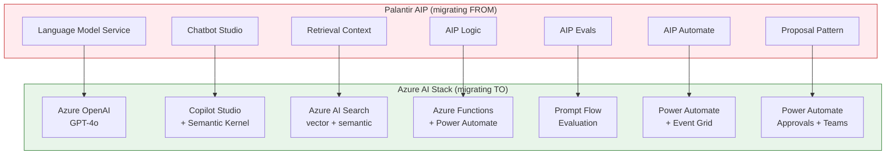
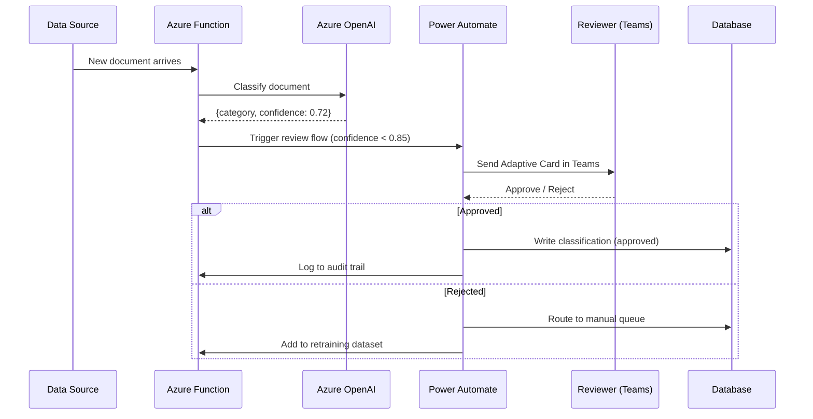

# Tutorial: Building AIP-Equivalent AI Workflows on Azure

**Migrate Palantir AIP capabilities to Azure OpenAI, Copilot Studio, Azure AI Search, Azure Functions, and Power Automate.**

> **Estimated Time:** 2-3 hours
> **Difficulty:** Intermediate-Advanced

---

## Who this is for

This tutorial is for data engineers, AI engineers, and platform architects who are migrating AIP (Artificial Intelligence Platform) workloads from Palantir Foundry to Azure. You will build Azure equivalents of AIP's core capabilities: LLM access, grounded chatbots, RAG pipelines, LLM functions, evaluation, workflow automation, and human-in-the-loop patterns.

---

## Prerequisites

- [ ] **Azure subscription** with Contributor access
- [ ] **Azure OpenAI resource** with GPT-4o deployed ([Request access](https://aka.ms/oai/access))
- [ ] **Azure AI Search resource** (Standard SKU or higher for semantic search)
- [ ] **Python 3.11+** with `pip`
- [ ] **Copilot Studio license** (optional -- for Step 2a no-code path)

```bash
python --version
az version --output table
pip install openai azure-search-documents azure-identity semantic-kernel[azure]
```

---

## Architecture Overview



---

## Step 1: Set Up Azure OpenAI

**AIP equivalent:** Language Model Service (LMS)

In Foundry, AIP's Language Model Service abstracts LLM access behind a proprietary API. Azure OpenAI provides the same capability with standard OpenAI-compatible APIs that work with any OpenAI SDK.

### 1a. Deploy a GPT-4o Model

```bash
export AOAI_NAME="myorg-aoai-dev"
export AOAI_RG="rg-ai-dev"
export AOAI_LOCATION="eastus"

# Deploy GPT-4o
az cognitiveservices account deployment create \
  --name "$AOAI_NAME" \
  --resource-group "$AOAI_RG" \
  --deployment-name "gpt-4o" \
  --model-name "gpt-4o" \
  --model-version "2024-08-06" \
  --model-format OpenAI \
  --sku-capacity 30 \
  --sku-name "Standard"

# Deploy an embedding model (needed for RAG in Step 3)
az cognitiveservices account deployment create \
  --name "$AOAI_NAME" \
  --resource-group "$AOAI_RG" \
  --deployment-name "text-embedding-3-large" \
  --model-name "text-embedding-3-large" \
  --model-version "1" \
  --model-format OpenAI \
  --sku-capacity 30 \
  --sku-name "Standard"
```

### 1b. Get Endpoint and API Key

```bash
export AOAI_ENDPOINT=$(az cognitiveservices account show \
  --name "$AOAI_NAME" --resource-group "$AOAI_RG" \
  --query "properties.endpoint" -o tsv)

export AOAI_KEY=$(az cognitiveservices account keys list \
  --name "$AOAI_NAME" --resource-group "$AOAI_RG" \
  --query "key1" -o tsv)

echo "Endpoint: $AOAI_ENDPOINT"
```

### 1c. Test with a Simple API Call

```python
# test_openai.py
import os
from openai import AzureOpenAI

client = AzureOpenAI(
    azure_endpoint=os.environ["AOAI_ENDPOINT"],
    api_key=os.environ["AOAI_KEY"],
    api_version="2024-06-01",
)

response = client.chat.completions.create(
    model="gpt-4o",
    messages=[
        {"role": "system", "content": "You are a helpful assistant."},
        {"role": "user", "content": "Summarize what Azure OpenAI is in two sentences."},
    ],
    temperature=0.3,
    max_tokens=200,
)

print(response.choices[0].message.content)
```

Run it:

```bash
export AOAI_ENDPOINT="https://myorg-aoai-dev.openai.azure.com/"
export AOAI_KEY="<your-key>"
python test_openai.py
```

> **Foundry comparison:** In Foundry, you call `palantir_models.language_model.complete(...)` through a proprietary SDK bound to Foundry's runtime. Azure OpenAI uses the standard `openai` Python package, which runs anywhere -- locally, in Azure Functions, in containers, or in notebooks.

---

## Step 2: Build a Grounded Chatbot (Replacing AIP Chatbot Studio)

**AIP equivalent:** Chatbot Studio

AIP Chatbot Studio provides a no-code builder for AI chatbots grounded in Foundry data. Azure provides two paths: Copilot Studio (no-code) and Semantic Kernel (code).

### Option A: Copilot Studio (No-Code)

Copilot Studio is the direct replacement for AIP Chatbot Studio. It provides a visual builder for AI agents with built-in grounding, topic management, and channel deployment.

**Step 1 -- Create a new agent.**

1. Navigate to [Copilot Studio](https://copilotstudio.microsoft.com).
2. Select **Create** > **New agent**.
3. Name the agent (e.g., "Federal Data Assistant").
4. Choose the Azure OpenAI connection as the AI model.

**Step 2 -- Add knowledge sources.**

1. In the agent settings, select **Knowledge** > **Add knowledge**.
2. Add one or more sources:
   - **SharePoint sites** -- point to document libraries containing policies and procedures.
   - **Websites** -- add public-facing documentation URLs.
   - **Files** -- upload PDFs, Word documents, or Excel files directly.
3. The agent will automatically index and ground its responses in these sources.

**Step 3 -- Configure topics and actions.**

1. Create a **Topic** for each conversational intent (e.g., "Look up case status", "Find policy document").
2. Add **Actions** that call external APIs (Power Automate flows, HTTP endpoints, or connectors).
3. Configure fallback behavior for unrecognized intents.

**Step 4 -- Deploy to Teams.**

1. Select **Channels** > **Microsoft Teams**.
2. Publish the agent. Users access it directly in Teams chat.

> **Foundry comparison:** AIP Chatbot Studio defines "tools" that the chatbot can invoke (Ontology queries, function calls). Copilot Studio uses "topics" and "actions" for the same purpose, with the advantage of 1,400+ Power Platform connectors for external integration.

### Option B: Custom Chatbot with Semantic Kernel (Code)

For teams that need full control, Semantic Kernel provides a Python framework for building AI agents with plugin-based tool use. This is the CSA-in-a-Box standard pattern.

```python
# grounded_chatbot.py
import asyncio
import os
from semantic_kernel import Kernel
from semantic_kernel.connectors.ai.open_ai import AzureChatCompletion
from semantic_kernel.agents import ChatCompletionAgent
from semantic_kernel.contents import ChatHistory
from semantic_kernel.functions import kernel_function

# --- Plugin: Azure AI Search retrieval ---

class SearchPlugin:
    """Retrieve grounding context from Azure AI Search."""

    def __init__(self):
        from azure.search.documents import SearchClient
        from azure.core.credentials import AzureKeyCredential

        self.client = SearchClient(
            endpoint=os.environ["SEARCH_ENDPOINT"],
            index_name=os.environ["SEARCH_INDEX"],
            credential=AzureKeyCredential(os.environ["SEARCH_KEY"]),
        )

    @kernel_function(
        name="search_knowledge_base",
        description="Search the knowledge base for documents relevant to a query.",
    )
    def search(self, query: str) -> str:
        results = self.client.search(search_text=query, top=5)
        hits = []
        for r in results:
            hits.append(f"[{r['title']}]: {r['content'][:500]}")
        return "\n\n---\n\n".join(hits) if hits else "No relevant documents found."


# --- Kernel and Agent setup ---

async def main():
    kernel = Kernel()
    kernel.add_service(
        AzureChatCompletion(
            service_id="gpt4o",
            deployment_name="gpt-4o",
            endpoint=os.environ["AOAI_ENDPOINT"],
            api_key=os.environ["AOAI_KEY"],
        )
    )
    kernel.add_plugin(SearchPlugin(), plugin_name="Search")

    agent = ChatCompletionAgent(
        kernel=kernel,
        service_id="gpt4o",
        name="DataAssistant",
        instructions=(
            "You are a data platform assistant. Use the Search plugin to find "
            "relevant documents before answering. Always cite your sources. "
            "If no relevant documents are found, say so."
        ),
    )

    chat = ChatHistory()
    print("Grounded Chatbot (type 'quit' to exit)")
    print("-" * 50)

    while True:
        user_input = input("\nYou: ").strip()
        if user_input.lower() in ("quit", "exit"):
            break
        chat.add_user_message(user_input)
        async for response in agent.invoke(chat):
            print(f"\nAssistant: {response.content}")

asyncio.run(main())
```

> **Foundry comparison:** AIP Chatbot Studio's "tool definitions" map directly to Semantic Kernel `@kernel_function` decorated methods. Both allow the LLM to decide which tools to invoke based on the user's question. Semantic Kernel plugins are portable Python classes, not locked to a proprietary runtime.

**CSA-in-a-Box evidence:** `csa_platform/ai_integration/rag/service.py`, `docs/tutorials/07-agents-foundry-sk/`

---

## Step 3: Implement RAG (Retrieval Augmented Generation)

**AIP equivalent:** Retrieval Context

AIP uses "Retrieval Context" to inject relevant documents into LLM prompts. Azure uses AI Search vector indexes for the same purpose, with the advantage of hybrid search (vector + keyword + semantic reranking).

### 3a. Create a Vector Index in Azure AI Search

```python
# create_vector_index.py
import os
from azure.search.documents.indexes import SearchIndexClient
from azure.search.documents.indexes.models import (
    SearchIndex,
    SearchField,
    SearchFieldDataType,
    SimpleField,
    SearchableField,
    VectorSearch,
    HnswAlgorithmConfiguration,
    VectorSearchProfile,
    SemanticConfiguration,
    SemanticSearch,
    SemanticPrioritizedFields,
    SemanticField,
)
from azure.core.credentials import AzureKeyCredential

client = SearchIndexClient(
    endpoint=os.environ["SEARCH_ENDPOINT"],
    credential=AzureKeyCredential(os.environ["SEARCH_KEY"]),
)

fields = [
    SimpleField(name="id", type=SearchFieldDataType.String, key=True),
    SearchableField(name="title", type=SearchFieldDataType.String),
    SearchableField(name="content", type=SearchFieldDataType.String),
    SearchableField(name="source", type=SearchFieldDataType.String, filterable=True),
    SearchField(
        name="content_vector",
        type=SearchFieldDataType.Collection(SearchFieldDataType.Single),
        searchable=True,
        vector_search_dimensions=3072,
        vector_search_profile_name="vector-profile",
    ),
]

index = SearchIndex(
    name="knowledge-base",
    fields=fields,
    vector_search=VectorSearch(
        algorithms=[HnswAlgorithmConfiguration(name="hnsw-config")],
        profiles=[VectorSearchProfile(
            name="vector-profile",
            algorithm_configuration_name="hnsw-config",
        )],
    ),
    semantic_search=SemanticSearch(configurations=[
        SemanticConfiguration(
            name="semantic-config",
            prioritized_fields=SemanticPrioritizedFields(
                title_field=SemanticField(field_name="title"),
                content_fields=[SemanticField(field_name="content")],
            ),
        ),
    ]),
)

result = client.create_or_update_index(index)
print(f"Index '{result.name}' created successfully")
```

### 3b. Build an Embedding and Indexing Pipeline

```python
# index_documents.py
import os
import hashlib
from openai import AzureOpenAI
from azure.search.documents import SearchClient
from azure.core.credentials import AzureKeyCredential

oai = AzureOpenAI(
    azure_endpoint=os.environ["AOAI_ENDPOINT"],
    api_key=os.environ["AOAI_KEY"],
    api_version="2024-06-01",
)

search = SearchClient(
    endpoint=os.environ["SEARCH_ENDPOINT"],
    index_name="knowledge-base",
    credential=AzureKeyCredential(os.environ["SEARCH_KEY"]),
)


def chunk_text(text: str, chunk_size: int = 800, overlap: int = 200) -> list[str]:
    """Split text into overlapping chunks."""
    chunks = []
    start = 0
    while start < len(text):
        end = start + chunk_size
        chunks.append(text[start:end])
        start += chunk_size - overlap
    return chunks


def embed_and_index(title: str, content: str, source: str) -> int:
    """Chunk a document, generate embeddings, and upload to the index."""
    chunks = chunk_text(content)
    documents = []
    for i, chunk in enumerate(chunks):
        doc_id = hashlib.md5(f"{title}_{i}".encode()).hexdigest()
        embedding = oai.embeddings.create(
            model="text-embedding-3-large", input=chunk
        ).data[0].embedding
        documents.append({
            "id": doc_id,
            "title": f"{title} (part {i + 1})",
            "content": chunk,
            "source": source,
            "content_vector": embedding,
        })
    result = search.upload_documents(documents)
    return sum(1 for r in result if r.succeeded)


# Example: index a batch of documents
sample_docs = [
    {"title": "Data Governance Policy", "content": "All data products must...", "source": "policies/governance.md"},
    {"title": "Case Management SOP", "content": "Federal cases are tracked...", "source": "sops/case-mgmt.md"},
]

for doc in sample_docs:
    count = embed_and_index(doc["title"], doc["content"], doc["source"])
    print(f"Indexed {count} chunks for '{doc['title']}'")
```

### 3c. Build a Search, Augment, Generate Pipeline

```python
# rag_query.py
import os
from openai import AzureOpenAI
from azure.search.documents import SearchClient
from azure.search.documents.models import VectorizableTextQuery, QueryType
from azure.core.credentials import AzureKeyCredential

oai = AzureOpenAI(
    azure_endpoint=os.environ["AOAI_ENDPOINT"],
    api_key=os.environ["AOAI_KEY"],
    api_version="2024-06-01",
)

search = SearchClient(
    endpoint=os.environ["SEARCH_ENDPOINT"],
    index_name="knowledge-base",
    credential=AzureKeyCredential(os.environ["SEARCH_KEY"]),
)


def rag_query(question: str) -> str:
    """Search -> Augment -> Generate."""
    # 1. Hybrid search (vector + keyword + semantic reranking)
    results = search.search(
        search_text=question,
        vector_queries=[
            VectorizableTextQuery(
                text=question,
                k_nearest_neighbors=5,
                fields="content_vector",
            )
        ],
        query_type=QueryType.SEMANTIC,
        semantic_configuration_name="semantic-config",
        top=5,
    )

    # 2. Build context from search results
    context_parts = []
    for r in results:
        context_parts.append(f"[{r['title']}] (source: {r['source']})\n{r['content']}")
    context = "\n\n---\n\n".join(context_parts)

    # 3. Generate grounded answer
    response = oai.chat.completions.create(
        model="gpt-4o",
        messages=[
            {
                "role": "system",
                "content": (
                    "Answer using ONLY the provided context. "
                    "Cite sources by title. If the context does not "
                    "contain the answer, say so."
                ),
            },
            {"role": "user", "content": f"Context:\n{context}\n\nQuestion: {question}"},
        ],
        temperature=0.2,
        max_tokens=1024,
    )
    return response.choices[0].message.content


# Test
answer = rag_query("What are the data governance requirements?")
print(answer)
```

> **Foundry comparison:** AIP's Retrieval Context uses Foundry's proprietary object search to find relevant documents. Azure AI Search provides the same retrieval capability with three search modes (vector, keyword, hybrid) and semantic reranking -- giving you more control over relevance tuning.

**CSA-in-a-Box evidence:** `csa_platform/ai_integration/rag/pipeline.py`, `csa_platform/ai_integration/rag/retriever.py`, `docs/tutorials/08-rag-vector-search/`

---

## Step 4: Build an LLM Function (Replacing AIP Logic)

**AIP equivalent:** AIP Logic

AIP Logic provides no-code LLM functions (classify, extract, summarize) that can be called from pipelines and applications. Azure Functions combined with Azure OpenAI provide the same capability with more flexibility.

### 4a. Create an Azure Function for Document Classification

CSA-in-a-Box includes a production-ready `DocumentClassifier` at `csa_platform/ai_integration/enrichment/document_classifier.py`. The following shows the pattern as a standalone Azure Function:

```python
# function_app.py -- Azure Functions v2 (Python)
import azure.functions as func
import json
import os
from openai import AzureOpenAI

app = func.FunctionApp()

client = AzureOpenAI(
    azure_endpoint=os.environ["AOAI_ENDPOINT"],
    api_key=os.environ["AOAI_KEY"],
    api_version="2024-06-01",
)

CATEGORIES = ["billing", "technical", "account", "security", "general"]


@app.function_name("ClassifyDocument")
@app.route(route="classify", methods=["POST"])
def classify_document(req: func.HttpRequest) -> func.HttpResponse:
    """Classify a document into a category using Azure OpenAI."""
    body = req.get_json()
    text = body.get("text", "")

    response = client.chat.completions.create(
        model="gpt-4o",
        messages=[
            {
                "role": "system",
                "content": (
                    f"Classify the text into exactly one category: {CATEGORIES}. "
                    "Return JSON: {\"category\": \"...\", \"confidence\": 0.0-1.0, "
                    "\"reasoning\": \"...\"}"
                ),
            },
            {"role": "user", "content": text},
        ],
        temperature=0.0,
        max_tokens=256,
        response_format={"type": "json_object"},
    )

    result = json.loads(response.choices[0].message.content)
    return func.HttpResponse(json.dumps(result), mimetype="application/json")


@app.function_name("ExtractEntities")
@app.route(route="extract", methods=["POST"])
def extract_entities(req: func.HttpRequest) -> func.HttpResponse:
    """Extract named entities from text using Azure OpenAI."""
    body = req.get_json()
    text = body.get("text", "")

    response = client.chat.completions.create(
        model="gpt-4o",
        messages=[
            {
                "role": "system",
                "content": (
                    "Extract all named entities from the text. Return JSON: "
                    "{\"entities\": [{\"text\": \"...\", \"type\": \"PERSON|ORG|LOCATION|DATE\"}]}"
                ),
            },
            {"role": "user", "content": text},
        ],
        temperature=0.0,
        max_tokens=512,
        response_format={"type": "json_object"},
    )

    result = json.loads(response.choices[0].message.content)
    return func.HttpResponse(json.dumps(result), mimetype="application/json")


@app.function_name("SummarizeDocument")
@app.route(route="summarize", methods=["POST"])
def summarize_document(req: func.HttpRequest) -> func.HttpResponse:
    """Summarize a document using Azure OpenAI."""
    body = req.get_json()
    text = body.get("text", "")
    max_sentences = body.get("max_sentences", 3)

    response = client.chat.completions.create(
        model="gpt-4o",
        messages=[
            {
                "role": "system",
                "content": f"Summarize the text in {max_sentences} sentences or fewer.",
            },
            {"role": "user", "content": text},
        ],
        temperature=0.3,
        max_tokens=512,
    )

    return func.HttpResponse(
        json.dumps({"summary": response.choices[0].message.content}),
        mimetype="application/json",
    )
```

### 4b. Integrate with Power Automate

These Azure Functions can be called from Power Automate flows to create no-code AI pipelines:

1. In Power Automate, create a new **Instant cloud flow** or **Automated cloud flow**.
2. Add an **HTTP** action pointing to your Azure Function URL (`https://<function-app>.azurewebsites.net/api/classify`).
3. Pass the document text in the request body: `{"text": "@{triggerBody()?['content']}"}`.
4. Parse the JSON response and route based on the `category` field.

**Example Power Automate flow description:**

```
Trigger: When a new file arrives in SharePoint "Incoming Documents" folder
  |
  v
Action: Get file content (SharePoint connector)
  |
  v
Action: HTTP POST to Azure Function /api/classify
  Body: {"text": "<file content>"}
  |
  v
Condition: Is category == "security"?
  Yes -> Action: Send email to Security Team
         Action: Move file to "Security Review" folder
  No  -> Action: Move file to "Processed" folder
         Action: Log classification to SharePoint list
```

> **Foundry comparison:** AIP Logic is no-code: you select an LLM task (classify, extract, summarize), configure parameters, and bind it to an Ontology action. Azure Functions + Power Automate achieve the same outcome with more flexibility -- you can use any model, any prompt, and integrate with 1,400+ connectors. For teams that prefer no-code, Power Automate's AI Builder provides built-in classification and extraction without writing a Function.

**CSA-in-a-Box evidence:** `csa_platform/ai_integration/enrichment/document_classifier.py`, `csa_platform/ai_integration/enrichment/entity_extractor.py`

---

## Step 5: Set Up Evaluation (Replacing AIP Evals)

**AIP equivalent:** AIP Evals

AIP Evals lets you define test cases with expected outputs and run evaluations against LLM functions. Azure AI Foundry Prompt Flow provides equivalent evaluation capabilities with built-in metrics.

### 5a. Create an Evaluation Dataset

```json
[
    {
        "question": "What is our data retention policy?",
        "ground_truth": "Data is retained for 7 years per federal records schedule.",
        "context": "Per 36 CFR 1236, all federal electronic records must be retained for a minimum of 7 years..."
    },
    {
        "question": "Who approves data access requests?",
        "ground_truth": "The Data Domain Owner approves access requests.",
        "context": "Data access requests are submitted through the portal and routed to the Data Domain Owner for approval..."
    },
    {
        "question": "What classification levels are supported?",
        "ground_truth": "The platform supports CUI, FOUO, and Public classifications.",
        "context": "CSA-in-a-Box supports three classification levels: CUI (Controlled Unclassified Information), FOUO, and Public..."
    }
]
```

Save this as `eval_dataset.json`.

### 5b. Build an Evaluation Pipeline

```python
# evaluate_rag.py
import json
import os
from openai import AzureOpenAI

client = AzureOpenAI(
    azure_endpoint=os.environ["AOAI_ENDPOINT"],
    api_key=os.environ["AOAI_KEY"],
    api_version="2024-06-01",
)


def evaluate_response(question: str, response: str, ground_truth: str, context: str) -> dict:
    """Evaluate a RAG response on groundedness, relevance, and coherence."""
    eval_prompt = f"""Evaluate the following AI response on three metrics.
Score each metric from 1 (worst) to 5 (best).

Question: {question}
Context provided: {context}
AI Response: {response}
Expected Answer: {ground_truth}

Return JSON:
{{
    "groundedness": <1-5>,
    "relevance": <1-5>,
    "coherence": <1-5>,
    "groundedness_reason": "...",
    "relevance_reason": "...",
    "coherence_reason": "..."
}}

Scoring guide:
- Groundedness: Is the response supported by the context? (5 = fully grounded, 1 = hallucinated)
- Relevance: Does the response answer the question? (5 = fully relevant, 1 = off-topic)
- Coherence: Is the response well-structured and clear? (5 = clear, 1 = incoherent)"""

    result = client.chat.completions.create(
        model="gpt-4o",
        messages=[
            {"role": "system", "content": "You are an AI evaluation judge. Return only valid JSON."},
            {"role": "user", "content": eval_prompt},
        ],
        temperature=0.0,
        max_tokens=512,
        response_format={"type": "json_object"},
    )
    return json.loads(result.choices[0].message.content)


def run_evaluation(dataset_path: str, rag_fn) -> dict:
    """Run evaluation over a dataset and compute aggregate metrics."""
    with open(dataset_path) as f:
        test_cases = json.load(f)

    results = []
    for case in test_cases:
        # Generate a response using your RAG pipeline
        response = rag_fn(case["question"])

        # Evaluate the response
        scores = evaluate_response(
            question=case["question"],
            response=response,
            ground_truth=case["ground_truth"],
            context=case["context"],
        )
        scores["question"] = case["question"]
        results.append(scores)
        print(f"  Q: {case['question'][:60]}...")
        print(f"    Groundedness={scores['groundedness']} "
              f"Relevance={scores['relevance']} "
              f"Coherence={scores['coherence']}")

    # Aggregate metrics
    avg = lambda metric: sum(r[metric] for r in results) / len(results)
    summary = {
        "total_cases": len(results),
        "avg_groundedness": round(avg("groundedness"), 2),
        "avg_relevance": round(avg("relevance"), 2),
        "avg_coherence": round(avg("coherence"), 2),
        "details": results,
    }

    print(f"\n{'='*50}")
    print(f"Evaluation Summary ({summary['total_cases']} cases)")
    print(f"  Groundedness: {summary['avg_groundedness']}/5")
    print(f"  Relevance:    {summary['avg_relevance']}/5")
    print(f"  Coherence:    {summary['avg_coherence']}/5")

    return summary


# Usage with the RAG query function from Step 3:
# from rag_query import rag_query
# run_evaluation("eval_dataset.json", rag_query)
```

### 5c. Run Evaluation in Azure AI Foundry (Alternative)

For a managed evaluation experience, use Azure AI Foundry's built-in evaluation:

1. Navigate to your AI Foundry project in the Azure portal.
2. Select **Evaluation** > **New evaluation**.
3. Upload `eval_dataset.json` as the test dataset.
4. Select metrics: **Groundedness**, **Relevance**, **Coherence**, **Fluency**.
5. Point to your deployed model and RAG endpoint.
6. Run the evaluation and review results in the dashboard.

> **Foundry comparison:** AIP Evals defines test cases with input/expected-output pairs and runs them against AIP functions. The Azure approach provides the same capability through either the programmatic pattern above (full control) or the AI Foundry managed evaluation (no-code). The programmatic approach lets you integrate evaluation into CI/CD pipelines via GitHub Actions.

---

## Step 6: Automate AI Workflows (Replacing AIP Automate)

**AIP equivalent:** AIP Automate

AIP Automate triggers LLM functions when data changes in the Ontology. Azure achieves the same through Power Automate flows triggered by data events, calling Azure OpenAI for enrichment.

### 6a. Power Automate Flow: Data-Triggered AI Enrichment

**Flow description:**

```
Trigger: When a row is added to SQL table "incoming_documents"
  (Power Automate SQL connector, polling interval: 1 minute)
  |
  v
Action: Get row details (document_id, raw_text, source_system)
  |
  v
Action: HTTP POST to Azure Function /api/classify
  Body: {"text": "@{triggerBody()?['raw_text']}"}
  Response: {"category": "security", "confidence": 0.95}
  |
  v
Action: HTTP POST to Azure Function /api/extract
  Body: {"text": "@{triggerBody()?['raw_text']}"}
  Response: {"entities": [{"text": "FEMA", "type": "ORG"}, ...]}
  |
  v
Action: HTTP POST to Azure Function /api/summarize
  Body: {"text": "@{triggerBody()?['raw_text']}", "max_sentences": 3}
  Response: {"summary": "The document describes..."}
  |
  v
Action: Update SQL row with enrichment results
  Set: category, confidence, entities_json, summary, enriched_at
  |
  v
Condition: Is confidence > 0.9 AND category == "security"?
  Yes -> Action: Post adaptive card to Teams "Security Alerts" channel
         Card includes: document title, category, summary, review link
  No  -> Action: Log to SharePoint "Enrichment Log" list
```

### 6b. Event-Driven Pattern with Event Grid

For high-volume scenarios, use Event Grid instead of polling:

```bash
# Create an Event Grid topic
az eventgrid topic create \
  --name "document-events" \
  --resource-group "$AOAI_RG" \
  --location "$AOAI_LOCATION"

# Subscribe to events with an Azure Function endpoint
az eventgrid event-subscription create \
  --name "enrich-on-upload" \
  --source-resource-id "/subscriptions/<sub>/resourceGroups/<rg>/providers/Microsoft.Storage/storageAccounts/<account>" \
  --endpoint "https://<function-app>.azurewebsites.net/api/ClassifyDocument" \
  --included-event-types "Microsoft.Storage.BlobCreated" \
  --subject-begins-with "/blobServices/default/containers/incoming/"
```

### 6c. Send Notifications via Teams

Power Automate can post enrichment results as Teams Adaptive Cards:

```json
{
    "type": "AdaptiveCard",
    "version": "1.4",
    "body": [
        {
            "type": "TextBlock",
            "text": "New Document Classified",
            "weight": "Bolder",
            "size": "Medium"
        },
        {
            "type": "FactSet",
            "facts": [
                {"title": "Document", "value": "${document_title}"},
                {"title": "Category", "value": "${category}"},
                {"title": "Confidence", "value": "${confidence}%"},
                {"title": "Summary", "value": "${summary}"}
            ]
        }
    ],
    "actions": [
        {
            "type": "Action.OpenUrl",
            "title": "Review Document",
            "url": "${document_url}"
        }
    ]
}
```

> **Foundry comparison:** AIP Automate triggers are bound to Ontology object changes (create, update, delete). Power Automate triggers are more flexible -- they can fire on SQL row changes, file uploads, email arrivals, form submissions, or custom Event Grid events. The key difference is that AIP Automate runs inside Foundry's runtime, while Power Automate runs as a managed cloud service with 1,400+ connectors.

---

## Step 7: Human-in-the-Loop Patterns (Replacing Foundry's Proposal Pattern)

**AIP equivalent:** Foundry proposal-based agent pattern

Foundry uses a "proposal" pattern where an AI agent suggests an action (e.g., "Classify this case as Priority 1") and a human reviews and approves or rejects it before execution. Azure achieves the same through Power Automate approvals and Teams Adaptive Cards.

### 7a. Power Automate Approval Flow

**Flow description:**

```
Trigger: When Azure Function /api/classify returns confidence < 0.85
  (Called from the enrichment flow in Step 6)
  |
  v
Action: Start an approval (Power Automate Approvals connector)
  Approval type: Approve/Reject - First to respond
  Assigned to: data-stewards@contoso.com
  Title: "AI Classification Review Required"
  Details: |
    Document: ${document_title}
    AI Suggested Category: ${category}
    Confidence: ${confidence}%
    Reasoning: ${reasoning}
    
    Please review and approve or reject this classification.
  |
  v
Condition: Approval outcome == "Approve"?
  Approve -> Action: Update document with AI classification
             Action: Log approval in audit trail
  Reject  -> Action: Route to manual classification queue
             Action: Log rejection with reviewer comments
             Action: (Optional) Add to evaluation dataset for model improvement
```

### 7b. Teams Adaptive Card for Review

For lightweight reviews that do not require formal approvals, use Teams Adaptive Cards with action buttons:

```json
{
    "type": "AdaptiveCard",
    "version": "1.4",
    "body": [
        {
            "type": "TextBlock",
            "text": "AI Classification Review",
            "weight": "Bolder",
            "size": "Medium"
        },
        {
            "type": "TextBlock",
            "text": "The AI has classified a document but confidence is below threshold.",
            "wrap": true
        },
        {
            "type": "FactSet",
            "facts": [
                {"title": "Document", "value": "${document_title}"},
                {"title": "Suggested Category", "value": "${category}"},
                {"title": "Confidence", "value": "${confidence}%"},
                {"title": "AI Reasoning", "value": "${reasoning}"}
            ]
        },
        {
            "type": "TextBlock",
            "text": "Preview:",
            "weight": "Bolder"
        },
        {
            "type": "TextBlock",
            "text": "${document_preview}",
            "wrap": true,
            "maxLines": 5
        }
    ],
    "actions": [
        {
            "type": "Action.Submit",
            "title": "Approve Classification",
            "data": {"action": "approve", "document_id": "${document_id}"}
        },
        {
            "type": "Action.Submit",
            "title": "Reject & Reclassify",
            "data": {"action": "reject", "document_id": "${document_id}"}
        },
        {
            "type": "Action.OpenUrl",
            "title": "View Full Document",
            "url": "${document_url}"
        }
    ]
}
```

### 7c. End-to-End Human-in-the-Loop Architecture



> **Foundry comparison:** Foundry's proposal pattern uses the Ontology as the state machine -- the AI creates a "proposal" object, a human approves it, and the approval triggers downstream actions. The Azure pattern uses Power Automate approvals (for formal workflows) or Teams Adaptive Cards (for lightweight reviews) as the approval mechanism, with the same approve/reject/escalate semantics. The advantage is that reviewers stay in Teams -- they do not need to switch to a separate platform.

---

## Capability Mapping Summary

| AIP Capability | Azure Equivalent | Service(s) | Migration Complexity |
|---|---|---|---|
| Language Model Service | Azure OpenAI SDK | Azure OpenAI | Low |
| Chatbot Studio | Copilot Studio or Semantic Kernel | Copilot Studio, SK | Medium |
| Retrieval Context | Azure AI Search vector indexes | AI Search, OpenAI | Medium |
| AIP Logic (classify, extract, summarize) | Azure Functions + OpenAI | Functions, OpenAI | Low |
| AIP Evals | Prompt Flow evaluation or custom | AI Foundry, Python | Medium |
| AIP Automate | Power Automate + Event Grid | Power Automate | Low |
| Proposal pattern (human-in-the-loop) | Power Automate Approvals + Teams | Power Automate | Low |
| Ontology-grounded AI | Semantic model + AI Search | Power BI, AI Search | Medium |

---

## What's Next

1. **Production hardening:** Add managed identity authentication (replace API keys with `DefaultAzureCredential`), configure VNet integration, and enable diagnostic logging.
2. **Scale the RAG pipeline:** Use the CSA-in-a-Box `RAGService` class (`csa_platform/ai_integration/rag/service.py`) for production workloads with rate limiting, reranking, and telemetry.
3. **Build agents:** Follow [Tutorial 07: Building AI Agents with Semantic Kernel](../../tutorials/07-agents-foundry-sk/README.md) to create multi-agent teams.
4. **Advanced RAG:** Follow [Tutorial 08: RAG with Azure AI Search](../../tutorials/08-rag-vector-search/README.md) for hybrid search with Cosmos DB conversation history.
5. **Deploy to production:** Use [Tutorial 06: AI-First Analytics](../../tutorials/06-ai-analytics-foundry/README.md) to deploy the full AI infrastructure with Bicep.

---

## Reference

- [Azure OpenAI Documentation](https://learn.microsoft.com/en-us/azure/ai-services/openai/)
- [Azure AI Search Vector Search](https://learn.microsoft.com/en-us/azure/search/vector-search-overview)
- [Copilot Studio Documentation](https://learn.microsoft.com/en-us/microsoft-copilot-studio/)
- [Semantic Kernel Documentation](https://learn.microsoft.com/en-us/semantic-kernel/)
- [Power Automate Approvals](https://learn.microsoft.com/en-us/power-automate/get-started-approvals)
- [Azure AI Foundry Evaluation](https://learn.microsoft.com/en-us/azure/ai-studio/concepts/evaluation-approach-gen-ai)
- [CSA-in-a-Box AI Integration](../../../csa_platform/ai_integration/)
- [Palantir AIP to Azure Migration Guide](ai-migration.md)

---

**Last updated:** 2026-04-30
**Maintainers:** CSA-in-a-Box core team
**See also:** [AI & AIP Migration Guide](ai-migration.md) | [Migration Playbook](../palantir-foundry.md) | [Feature Mapping](feature-mapping-complete.md)
