# Migrating from Qlik Sense to Power BI with CSA-in-a-Box

**Status:** Authored 2026-04-30
**Audience:** BI leads, analytics engineers, data architects, and CDOs running Qlik Sense Enterprise or Qlik Cloud who are evaluating or committed to a Power BI migration.
**Scope:** End-to-end migration of the Qlik estate -- apps, data models, expressions, visualizations, NPrinting reports, server infrastructure, security rules, reload tasks, and user skills -- to Power BI Service and Microsoft Fabric, with CSA-in-a-Box as the data platform layer.

!!! tip "Expanded Migration Center Available"
This playbook is the core migration reference. For the complete Qlik-to-Power BI migration package -- including white papers, deep-dive guides, tutorials, and benchmarks -- visit the **[Qlik to Power BI Migration Center](qlik-to-powerbi/index.md)**.

    **Quick links:**

    - [Why Power BI over Qlik (Executive Brief)](qlik-to-powerbi/why-powerbi-over-qlik.md)
    - [Total Cost of Ownership Analysis](qlik-to-powerbi/tco-analysis.md)
    - [Complete Feature Mapping (50+ features)](qlik-to-powerbi/feature-mapping-complete.md)
    - [Expression Migration (20+ conversions)](qlik-to-powerbi/expression-migration.md)
    - [Tutorials & Walkthroughs](qlik-to-powerbi/index.md#tutorials)
    - [Benchmarks & Performance](qlik-to-powerbi/benchmarks.md)
    - [Best Practices](qlik-to-powerbi/best-practices.md)

---

## 1. Why organizations migrate

Four forcing functions drive Qlik-to-Power BI migrations. Most organizations face more than one.

**Thoma Bravo ownership and pricing pressure.** Qlik's acquisition by Thoma Bravo in 2016 (and subsequent PE-driven optimization) has resulted in aggressive price increases at renewal. Organizations report 15-30% uplift at each renewal cycle, with limited negotiating leverage once locked into the Qlik ecosystem. The per-user model (Analyzer at ~$15-25/user/month, Professional at ~$40-70/user/month) scales poorly compared to Power BI Pro at $10/user/month -- or $0 incremental cost for Microsoft 365 E5 customers.

**Microsoft 365 integration.** Power BI is embedded in the Microsoft ecosystem: Teams, SharePoint, Excel, Outlook, Copilot. For organizations already on M365, Power BI is the BI tool that does not require a second login, governance model, or authentication layer. Reports embed in Teams channels. Excel connects natively to semantic models. Copilot generates DAX and narrative summaries. This integration surface does not exist for Qlik.

**Fabric convergence.** Microsoft Fabric unifies data engineering, data science, real-time analytics, and BI on a single platform with a single capacity model. Power BI is the native BI layer in Fabric. Direct Lake mode connects Power BI to Delta tables in OneLake with zero data movement -- no import, no extract, no scheduled reload. For organizations building on CSA-in-a-Box, this eliminates the QVD/QVW extraction pipeline that Qlik requires.

**BI consolidation.** Many enterprises run Qlik alongside Tableau, Power BI, or SSRS. Consolidating onto Power BI reduces tooling surface, licensing cost, training burden, and governance complexity. With 40,000+ Qlik customers globally and PE-driven pricing pressure, this consolidation wave is accelerating.

!!! info "Honest assessment of trade-offs"
This guide is a migration playbook, not a takedown. Qlik has real strengths: the associative engine enables exploratory analysis without predefined relationships, green/white/gray selection states give users instant visual feedback on data associations, Set Analysis provides a powerful in-expression filtering syntax, and the Qlik data load script (with its incremental load and concatenation patterns) is more expressive than Power Query for certain ETL tasks. Every trade-off is documented below so you can make informed decisions.

---

## 2. Feature comparison

| Capability                | Qlik Sense                                              | Power BI                                                          | Edge                     |
| ------------------------- | ------------------------------------------------------- | ----------------------------------------------------------------- | ------------------------ |
| **Data engine**           | Associative engine (in-memory, all combinations)        | VertiPaq (columnar, compressed) + Direct Lake + DirectQuery       | Depends on use case      |
| **Data connectivity**     | 50+ connectors + REST/ODBC                              | 150+ native connectors + Dataverse, Fabric                        | Power BI                 |
| **Data modeling**         | Associative model (all tables linked, no star required) | Star schema (fact + dimension), composite models, Direct Lake     | Qlik (flexibility)       |
| **Expression language**   | Qlik expressions, Set Analysis, Aggr()                  | DAX measures, calculated columns, Power Query M                   | Comparable               |
| **Visualization**         | 15+ native charts, extensions via Nebula.js             | 30+ native charts, 200+ AppSource custom visuals                  | Power BI (breadth)       |
| **Selection model**       | Associative selections (green/white/gray)               | Slicers, filters, cross-filtering, drillthrough                   | Qlik (exploration)       |
| **Natural language**      | Insight Advisor, Insight Advisor Chat                   | Q&A, Copilot in Power BI                                          | Power BI (Copilot)       |
| **Mobile**                | Qlik Sense Mobile app                                   | Power BI Mobile app                                               | Comparable               |
| **Embedded analytics**    | Qlik Embed (mashups, Nebula.js)                         | Power BI Embedded (capacity pricing)                              | Power BI (cost at scale) |
| **Data preparation**      | Data load script (in-app, per-app)                      | Power Query (included), Dataflows, Fabric notebooks               | Power BI (included)      |
| **Governance**            | Qlik Data Integration (separate license)                | Purview integration, deployment pipelines, endorsement (included) | Power BI (included)      |
| **Pixel-perfect reports** | Qlik NPrinting (separate product/license)               | Paginated reports (included in Premium/Fabric)                    | Power BI (included)      |
| **Server / Cloud**        | Qlik Sense Enterprise (on-prem) or Qlik Cloud           | Power BI Service (cloud) + Report Server (on-prem)                | Comparable               |
| **Developer API**         | Engine API (WebSocket), REST API, Extensions API        | REST API, XMLA endpoints, Tabular Object Model (TOM)              | Comparable               |
| **Collaboration**         | Shared spaces, notes, monitoring apps                   | Teams integration, SharePoint embedding, email subscriptions      | Power BI                 |
| **Version control**       | Manual (QVF export)                                     | Fabric Git integration (TMDL, .pbip format)                       | Power BI                 |
| **AI/ML features**        | Qlik AutoML, Insight Advisor                            | Copilot, Q&A, Smart Narratives, Anomaly Detection, Fabric ML      | Power BI                 |
| **Real-time dashboards**  | Limited (partial reloads, ODAG)                         | Fabric Real-Time Intelligence, push datasets, streaming datasets  | Power BI                 |
| **Excel integration**     | Export to Excel (static)                                | Analyze in Excel (live PivotTable on semantic model)              | Power BI                 |

---

## 3. Licensing cost analysis

### Per-user pricing (as of early 2026)

| Role                  | Qlik license                 | Monthly cost        | Power BI license                | Monthly cost |
| --------------------- | ---------------------------- | ------------------- | ------------------------------- | ------------ |
| Content creator       | Professional                 | $40-70              | Pro (or Fabric capacity)        | $10          |
| Interactive consumer  | Analyzer                     | $15-25              | Pro                             | $10          |
| Capacity-based        | Analyzer Capacity (per-core) | $2,500-4,000/mo     | Premium Capacity (P1)           | $4,995/mo    |
| Data preparation      | Data load script (built-in)  | $0 add-on           | Power Query (included in all)   | $0           |
| Pixel-perfect reports | NPrinting (separate)         | $18,000-50,000/yr   | Paginated reports (Premium/PPU) | $0 add-on    |
| Governance            | Qlik Data Integration        | $30,000-100,000+/yr | Included in Pro + Purview       | $0           |

### Total cost comparison by organization size

| Org profile                                         | Qlik annual cost   | Power BI annual cost            | Annual savings |
| --------------------------------------------------- | ------------------ | ------------------------------- | -------------- |
| **50 users** (10 Prof, 40 Analyzer)                 | $156,000-$204,000  | $6,000 (all Pro)                | ~$150,000-198K |
| **200 users** (30 Prof, 170 Analyzer)               | $450,000-$756,000  | $24,000 (all Pro)               | ~$426,000-732K |
| **1,000 users** (80 Prof, 920 Analyzer) + NPrinting | $1,800,000-$2,500K | $120,000 (Pro) + $60K (Premium) | ~$1.6M-$2.3M   |

!!! note "Microsoft 365 E5 includes Power BI Pro"
If your organization is on Microsoft 365 E5, every user already has a Power BI Pro license. The incremental cost of Power BI is zero. Combined with NPrinting elimination (paginated reports are included in Premium/Fabric), the savings are often the single largest line item in the migration business case.

---

## 4. Migration phases

```mermaid
timeline
    title Qlik to Power BI Migration Timeline
    section Phase 1 - Discovery (Weeks 1-3)
        App inventory      : Export all Qlik apps, streams, data connections
        Usage analysis     : Identify high-value vs stale apps
        Expression catalog : Document Set Analysis and Aggr() usage
        QVD dependency map : Map QVD file chains and reload schedules
    section Phase 2 - Data Layer (Weeks 3-6)
        QVD analysis       : Map QVD files to CSA-in-a-Box Gold tables
        Data model redesign: Associative model to star schema
        Connection migration: Qlik data connections to Power BI sources
        Gold layer setup   : CSA-in-a-Box Gold tables as single source
    section Phase 3 - Report Conversion (Weeks 5-10)
        Priority apps      : Convert top-20 Qlik apps first
        Expression port    : Set Analysis to DAX CALCULATE
        Visual rebuild     : Qlik objects to Power BI visuals
        Validation         : Side-by-side number comparison
    section Phase 4 - Server Migration (Weeks 8-12)
        Workspace setup    : Create workspace hierarchy replacing streams
        Permission config  : Security rules to workspace roles + RLS
        Reload to refresh  : Reload tasks to scheduled refresh
        NPrinting          : NPrinting templates to paginated reports
    section Phase 5 - Adoption (Weeks 10-16)
        Training rollout   : Creator and consumer training sessions
        Champions program  : Train 1 champion per 20 users
        Feedback loop      : Weekly office hours for first 4 weeks
        Decommission       : Archive QVF files, retire Qlik licenses
```

---

## 5. Expression conversion quick reference

The most time-consuming part of any Qlik-to-Power BI migration is converting Qlik expressions to DAX. This section covers the most common patterns; see the [full expression migration guide](qlik-to-powerbi/expression-migration.md) for 20+ conversions.

| Qlik expression                       | DAX equivalent                                                           |
| ------------------------------------- | ------------------------------------------------------------------------ |
| `Sum(Sales)`                          | `SUM(Sales[Amount])`                                                     |
| `Count(DISTINCT CustomerID)`          | `DISTINCTCOUNT(Sales[CustomerID])`                                       |
| `Sum({<Year={2025}>} Sales)`          | `CALCULATE(SUM(Sales[Amount]), Calendar[Year] = 2025)`                   |
| `Sum({<Year={2025}, Region->} Sales)` | `CALCULATE(SUM(Sales[Amount]), Calendar[Year] = 2025, ALL(Geo[Region]))` |
| `Aggr(Sum(Sales), Customer)`          | `SUMX(VALUES(Customers[Customer]), [Total Sales])`                       |
| `Above(Sum(Sales))`                   | `VAR _prev = OFFSET(-1, ...) RETURN ...` (DAX 2023+ OFFSET)              |
| `RangeSum(Above(Sum(Sales), 0, 12))`  | `CALCULATE(SUM(Sales[Amount]), DATESINPERIOD(...))`                      |
| `Dual(MonthName, MonthNum)`           | Format string or Sort By Column                                          |

---

## 6. CSA-in-a-Box advantage

When you migrate from Qlik to Power BI on top of CSA-in-a-Box, you gain architectural benefits beyond the BI tool swap.

| Problem with Qlik                                                                               | How CSA-in-a-Box + Power BI solves it                                                                 |
| ----------------------------------------------------------------------------------------------- | ----------------------------------------------------------------------------------------------------- |
| **QVD sprawl** -- every app has its own QVD chain, duplicating data across Qlik Server storage  | **Direct Lake** reads Gold tables directly. No QVDs. No data duplication. No stale data.              |
| **No end-to-end lineage** -- lineage stops at the Qlik data connection boundary                 | **Purview lineage** traces from source system to Bronze to Silver to Gold to semantic model to report |
| **Per-app data models** -- each Qlik app has its own data model, no shared semantic layer       | **Shared semantic models** provide a single governed definition of measures and relationships         |
| **NPrinting is a separate product** -- pixel-perfect reporting requires separate infrastructure | **Paginated reports** are included in Power BI Premium / Fabric with no additional licensing          |
| **PE-driven pricing escalation** -- Thoma Bravo ownership means renewal costs trend upward      | **Power BI Pro at $10/user/month** or included in E5 provides predictable, competitive pricing        |
| **Limited M365 integration** -- Qlik sits outside the Microsoft collaboration ecosystem         | **Teams, SharePoint, Excel, Copilot** integration is native and automatic                             |

---

## 7. Migration checklist

- [ ] **Phase 1: Discovery**
    - [ ] Export Qlik Sense Management Console inventory (apps, streams, data connections, users, security rules)
    - [ ] Analyze usage metrics (sessions per app, last opened date)
    - [ ] Identify top-20 most-used apps for priority migration
    - [ ] Identify stale apps (not opened in 90+ days) -- archive, do not migrate
    - [ ] Catalog all QVD file locations and reload chains
    - [ ] Document all Set Analysis expressions and Aggr() patterns
    - [ ] Map Qlik streams/spaces to Power BI workspace structure
    - [ ] Catalog reload task schedules
    - [ ] Estimate migration effort per app (simple / medium / complex)
- [ ] **Phase 2: Data Layer**
    - [ ] Map QVD file chains to CSA-in-a-Box medallion architecture
    - [ ] Redesign associative data models to star schemas
    - [ ] Deploy CSA-in-a-Box Gold layer tables for primary data domains
    - [ ] Create Power BI shared semantic models on Gold tables (Direct Lake)
    - [ ] Validate row counts and aggregates against QVD-based models
- [ ] **Phase 3: Report Conversion**
    - [ ] Convert top-20 apps (priority wave)
    - [ ] Port Qlik expressions to DAX measures
    - [ ] Rebuild visualizations using Power BI visuals + AppSource custom visuals
    - [ ] Recreate selection behavior using slicers, cross-filtering, and bookmarks
    - [ ] Side-by-side validation: compare numbers at multiple grain levels
    - [ ] User acceptance testing with app owners
    - [ ] Convert remaining apps in subsequent waves
- [ ] **Phase 4: Server Migration**
    - [ ] Create Power BI workspaces replacing Qlik streams/spaces
    - [ ] Configure workspace roles (Admin, Member, Contributor, Viewer)
    - [ ] Implement row-level security for sensitive datasets
    - [ ] Set up deployment pipelines (Dev to Test to Prod)
    - [ ] Migrate reload tasks to dataset refresh schedules
    - [ ] Convert NPrinting templates to paginated reports
    - [ ] Recreate Qlik alerting as Power BI data-driven subscriptions
- [ ] **Phase 5: Adoption**
    - [ ] Train champions (2 weeks before general rollout)
    - [ ] Deliver creator training (DAX, data modeling, Power Query)
    - [ ] Deliver consumer training (navigation, slicers, subscriptions)
    - [ ] Launch weekly office hours (first 4 weeks post-migration)
    - [ ] Monitor adoption metrics (active users, report views, Copilot usage)
    - [ ] Archive QVF/QVW files (retain for 90 days post-cutover)
    - [ ] Decommission Qlik licenses at next renewal

---

## 8. Timeline template

| Phase                                 | Duration        | Key milestones                                                         |
| ------------------------------------- | --------------- | ---------------------------------------------------------------------- |
| Phase 1: Discovery                    | 3 weeks         | Inventory complete, apps prioritized, effort estimated                 |
| Phase 2: Data layer                   | 3 weeks         | Gold tables deployed, semantic models created, Direct Lake validated   |
| Phase 3: Report conversion (wave 1)   | 5 weeks         | Top-20 apps converted and validated                                    |
| Phase 3: Report conversion (waves 2+) | 4-8 weeks       | Remaining apps converted (parallel with Phase 4-5)                     |
| Phase 4: Server migration             | 4 weeks         | Workspaces, permissions, schedules, NPrinting replacement configured   |
| Phase 5: Adoption                     | 6 weeks         | Training delivered, champions active, office hours running             |
| Decommission                          | 2 weeks         | Qlik Server archived, licenses cancelled at renewal                    |
| **Total**                             | **14-20 weeks** | Varies by estate size, expression complexity, and NPrinting dependency |

!!! note "Complexity drivers"
The timeline assumes 30-150 Qlik apps. For larger estates (300+), add waves to Phase 3. The biggest schedule risk is not the number of apps but the density of Set Analysis expressions and Aggr() functions. These require manual DAX conversion. Apps with 50+ expressions routinely take 3-5 days each.

---

## 9. Cross-references

| Topic                                        | Document                                               |
| -------------------------------------------- | ------------------------------------------------------ |
| ADR: Databricks over OSS Spark               | `docs/adr/0002-databricks-over-oss-spark.md`           |
| ADR: Delta Lake over Iceberg and Parquet     | `docs/adr/0003-delta-lake-over-iceberg-and-parquet.md` |
| ADR: Fabric as strategic target              | `docs/adr/0010-fabric-strategic-target.md`             |
| Cost management                              | `docs/COST_MANAGEMENT.md`                              |
| Power BI guide                               | `docs/guides/power-bi.md`                              |
| Purview setup                                | `docs/guides/purview.md`                               |
| Data governance best practices               | `docs/best-practices/data-governance.md`               |
| Fabric vs Databricks vs Synapse              | `docs/decisions/fabric-vs-databricks-vs-synapse.md`    |
| Tableau to Power BI (companion BI migration) | `docs/migrations/tableau-to-powerbi.md`                |
| Snowflake migration                          | `docs/migrations/snowflake.md`                         |
| AWS migration                                | `docs/migrations/aws-to-azure.md`                      |
| GCP migration (includes Looker to Power BI)  | `docs/migrations/gcp-to-azure.md`                      |
