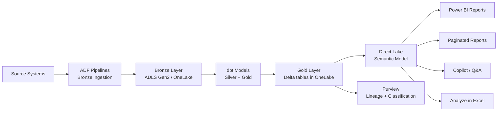

# Qlik to Power BI: Migration Best Practices

**Audience:** Project managers, BI leads, migration architects
**Purpose:** Proven patterns for successful Qlik-to-Power BI migrations
**Reading time:** 15-20 minutes

---

## 1. Migration strategy: report-by-report plan

### 1.1 Do not migrate everything

The first best practice is the most counterintuitive: **do not migrate all Qlik apps**. Most Qlik deployments follow an 80/20 rule:

- 20% of apps get 80% of usage
- 30-50% of apps have not been opened in 90+ days
- 10-20% of apps are duplicates or personal copies

**Migration triage categories:**

| Category             | Criteria                                  | Action                                     |
| -------------------- | ----------------------------------------- | ------------------------------------------ |
| **Migrate (Wave 1)** | Top-20 most-used apps, mission-critical   | Full conversion to Power BI                |
| **Migrate (Wave 2)** | Medium-usage apps, active users           | Scheduled conversion after Wave 1          |
| **Migrate (Wave 3)** | Low-usage apps with active owners         | Convert if owner requests; otherwise defer |
| **Archive**          | No access in 90+ days                     | Export QVF, archive, do not migrate        |
| **Retire**           | Duplicate, superseded, or personal copies | Notify owner, archive, do not migrate      |

### 1.2 Wave planning

Each wave should follow this sequence:

1. **Data layer** -- ensure Gold tables exist for the apps in this wave
2. **Semantic model** -- build or extend the shared semantic model for this domain
3. **Expression conversion** -- port all Qlik expressions to DAX measures in the semantic model
4. **Report build** -- create Power BI reports consuming the shared semantic model
5. **Validation** -- side-by-side number comparison with Qlik
6. **User acceptance** -- app owner signs off
7. **Cutover** -- redirect users, disable Qlik app reload
8. **Monitoring** -- track Power BI usage metrics for 2 weeks

### 1.3 Effort estimation model

| App complexity   | Criteria                                                            | Estimated effort |
| ---------------- | ------------------------------------------------------------------- | ---------------- |
| **Simple**       | < 5 sheets, < 10 expressions, no Set Analysis, no Section Access    | 1-2 days         |
| **Medium**       | 5-10 sheets, 10-30 expressions, basic Set Analysis, simple RLS      | 3-5 days         |
| **Complex**      | 10+ sheets, 30+ expressions, nested Aggr/Set Analysis, ODAG         | 5-10 days        |
| **Very complex** | Multiple data models, advanced mashup, NPrinting, custom extensions | 10-20 days       |

Apply this formula: **Total migration effort = (Simple x 1.5d) + (Medium x 4d) + (Complex x 7.5d) + (Very Complex x 15d)**

---

## 2. Data architecture best practices

### 2.1 Build the semantic layer first

The most common mistake in Qlik-to-Power BI migrations is converting apps one-by-one without building a shared semantic layer. In Qlik, each app has its own data model. In Power BI, shared semantic models provide a single governed definition of measures and relationships.

**Best practice:** Before converting any apps, build domain-level shared semantic models on CSA-in-a-Box Gold tables:

| Domain  | Semantic model name    | Gold tables included                                | Measures                             |
| ------- | ---------------------- | --------------------------------------------------- | ------------------------------------ |
| Sales   | Sales Analytics Model  | fact_sales, dim_customer, dim_product, dim_calendar | Total Revenue, YTD, MoM%, Rank, etc. |
| Finance | Finance Model          | fact_gl, dim_account, dim_cost_center, dim_calendar | Budget vs Actual, Variance, etc.     |
| HR      | People Analytics Model | fact_headcount, dim_employee, dim_department        | Headcount, Attrition Rate, etc.      |
| Ops     | Operations Model       | fact_production, dim_plant, dim_shift               | OEE, Throughput, Downtime, etc.      |

Multiple Power BI reports can then consume the same semantic model, replacing the per-app data model duplication that Qlik creates.

### 2.2 Use Direct Lake, not Import

For CSA-in-a-Box deployments, the target connectivity mode is **Direct Lake** (not Import):

| Connectivity mode | When to use                                             | When NOT to use                                  |
| ----------------- | ------------------------------------------------------- | ------------------------------------------------ |
| **Direct Lake**   | Gold tables in OneLake; Fabric F64+ capacity            | Non-Fabric data sources; small models (< 100 MB) |
| **Import**        | Small datasets; data not in OneLake; Pro-only licensing | Datasets > 1 GB; real-time freshness required    |
| **DirectQuery**   | Operational databases needing real-time data            | Large analytical models (performance risk)       |
| **Composite**     | Mix of Import + DirectQuery for different tables        | Simple models (adds unnecessary complexity)      |

### 2.3 Eliminate QVD-to-QVD chains

In Qlik, QVD chains (raw QVD -> transformed QVD -> aggregated QVD -> app) are the de facto data pipeline. In the target architecture:

- Raw QVDs -> **Bronze layer** (ADF ingestion to ADLS Gen2)
- Transformed QVDs -> **Silver layer** (dbt models to Delta Lake)
- Aggregated QVDs -> **Gold layer** (dbt models to OneLake)
- App data model -> **Shared semantic model** (Direct Lake on Gold)

**Never recreate QVD chains using Power BI Import datasets**. This trades one extract pipeline for another. The CSA-in-a-Box medallion architecture with Direct Lake eliminates the entire concept of BI-layer data caching.

---

## 3. User training best practices

### 3.1 Training curriculum for Qlik users

| Session | Topic                                                     | Audience | Duration | Notes                                             |
| ------- | --------------------------------------------------------- | -------- | -------- | ------------------------------------------------- |
| 1       | Power BI Desktop overview, navigation, connecting to data | All      | 2 hours  | Focus on similarities to Qlik                     |
| 2       | Building visuals: charts, KPIs, tables, formatting        | All      | 2 hours  | Hands-on with sample report                       |
| 3       | Slicers, filters, cross-filtering (replacing selections)  | All      | 2 hours  | Address the selection model difference explicitly |
| 4       | DAX fundamentals: measures, SUM, COUNT, CALCULATE         | Creators | 3 hours  | Focus on CALCULATE as "Set Analysis replacement"  |
| 5       | DAX for Qlik users: Set Analysis to CALCULATE patterns    | Creators | 3 hours  | Workshop with side-by-side conversion             |
| 6       | DAX intermediate: time intelligence, RANKX, iterators     | Creators | 3 hours  | Common Qlik patterns in DAX                       |
| 7       | Data modeling: star schema, relationships, Direct Lake    | Creators | 2 hours  | Explain why star schema is different from Qlik    |
| 8       | Power Query basics, connecting to CSA-in-a-Box            | Creators | 2 hours  | Light shaping only -- heavy ETL is in dbt         |
| 9       | Publishing, workspaces, sharing, apps                     | All      | 2 hours  | Replace Qlik hub navigation                       |
| 10      | RLS, deployment pipelines, governance, Copilot            | Admins   | 2 hours  | Admin-specific capabilities                       |

### 3.2 Addressing the selection model gap

The single biggest user complaint in Qlik-to-Power BI migrations is the loss of associative selections (green/white/gray). Address this proactively:

**Day 1 training topic:** Explain the difference between associative selections and cross-filtering. Use this framing:

- **In Qlik:** "I select a value and the engine shows me everything related. I explore by clicking."
- **In Power BI:** "I use slicers to filter, and the visuals update based on the defined relationships. I explore by asking Copilot or using Q&A."

**Design patterns that mitigate the gap:**

1. **Rich slicer panels** -- add slicer visuals for every dimension users commonly filter by
2. **Cross-filtering configuration** -- set Edit Interactions so that clicking a bar/point filters other visuals (not just highlights)
3. **Q&A visual** -- add a Q&A visual to every report so users can type natural language questions
4. **Copilot** -- train users to ask Copilot "What factors influenced this metric?" instead of clicking through associative selections
5. **Clear All button** -- add a "Reset" bookmark button so users can clear all filters with one click

### 3.3 Champions program

| Element                | Details                                                                  |
| ---------------------- | ------------------------------------------------------------------------ |
| **Champion ratio**     | 1 champion per 20 Qlik users                                             |
| **Selection criteria** | Enthusiastic Qlik power user willing to learn Power BI first             |
| **Training timeline**  | Champions trained 2-3 weeks before general rollout                       |
| **Responsibilities**   | First-line support, lead office hours, assist with expression conversion |
| **Recognition**        | Monthly spotlight, early access to Copilot features                      |
| **Escalation path**    | Champion -> BI team -> Microsoft support                                 |

### 3.4 Common Qlik-user complaints and responses

| Complaint                                      | Response                                                                                                               |
| ---------------------------------------------- | ---------------------------------------------------------------------------------------------------------------------- |
| "I miss green/white/gray selections"           | Use cross-filtering and slicers. Try Copilot for exploration. The star schema gives you faster, more reliable queries. |
| "DAX is harder than Qlik expressions"          | DAX is more explicit about filter context. Use Copilot to write DAX. The CALCULATE = Set Analysis mapping is key.      |
| "My Qlik app had everything in one data model" | Shared semantic models are better: one definition, many reports. No data duplication.                                  |
| "Where are my QVD files?"                      | Replaced by Gold tables in OneLake. Direct Lake reads them with zero extract. Your data is always fresh.               |
| "I can't do [specific chart type]"             | Check AppSource for custom visuals (200+). Most chart types are available.                                             |
| "NPrinting was simpler"                        | Paginated reports (Report Builder) are free and included. No separate server to maintain.                              |

---

## 4. Governance framework

### 4.1 Workspace governance

| Governance rule                                        | Implementation                                                       |
| ------------------------------------------------------ | -------------------------------------------------------------------- |
| Workspace naming convention                            | `[Department]-[Domain]-[Environment]` (e.g., Finance-Sales-Prod)     |
| Workspace creation restricted to BI team               | Admin Portal > Tenant Settings > Create Workspaces = specific groups |
| Production workspaces have deployment pipelines        | All Prod workspaces use Dev/Test/Prod pipeline promotion             |
| Workspace access via Entra ID groups (not individuals) | Use security groups for role assignment                              |
| Shared semantic models endorsed as "Certified"         | BI team certifies domain-level semantic models                       |
| Personal workspace content not shared externally       | Admin Portal > Tenant Settings > Publish to web = disabled           |

### 4.2 Semantic model governance

| Rule                                                 | Rationale                                                   |
| ---------------------------------------------------- | ----------------------------------------------------------- |
| One semantic model per data domain                   | Prevents measure duplication across reports                 |
| All measures defined in semantic model (not reports) | Ensures consistent calculations across all consumers        |
| Measure descriptions documented                      | Every DAX measure has a description (visible in field list) |
| Semantic model version-controlled (TMDL in Git)      | Fabric Git integration tracks changes to model definition   |
| Model owner assigned per domain                      | Clear ownership for measure definitions and data quality    |
| RLS defined in semantic model (not report)           | Security travels with the model to any report that uses it  |

### 4.3 Purview integration

| Governance capability  | Configuration                                                            |
| ---------------------- | ------------------------------------------------------------------------ |
| End-to-end lineage     | Enable Purview scan of Power BI tenant (Admin Portal)                    |
| Sensitivity labels     | Enable label inheritance for Power BI (Purview > Information Protection) |
| Auto-classification    | Enable Purview scanners on Fabric lakehouse and Power BI datasets        |
| Business glossary      | Define terms in Purview; link to Power BI measures and columns           |
| Data access governance | Purview policies enforce access across Fabric and Power BI               |

---

## 5. Copilot adoption strategy

### 5.1 Copilot use cases for migrating Qlik users

| Copilot capability         | Who benefits         | Training approach                                                        |
| -------------------------- | -------------------- | ------------------------------------------------------------------------ |
| Natural language to visual | All consumers        | "Ask Copilot a question about the data"                                  |
| DAX generation             | Report creators      | "Describe what you want to calculate; Copilot writes DAX"                |
| Report narrative           | Executives, managers | "Ask Copilot to summarize this report page"                              |
| Data exploration           | Analysts             | "Ask Copilot what's driving a metric" (replaces associative exploration) |
| Report design suggestions  | Report creators      | "Ask Copilot to suggest a layout for this data"                          |

### 5.2 Copilot rollout phases

1. **Phase 1 (Week 1):** Enable Copilot for the BI team and champions only
2. **Phase 2 (Week 3):** Enable for all report creators with training
3. **Phase 3 (Week 6):** Enable for all consumers with guided documentation
4. **Phase 4 (Ongoing):** Collect feedback, share best practices, publish prompt guides

---

## 6. CSA-in-a-Box Fabric integration

### 6.1 The optimal data flow

### 6.2 Integration best practices

| Practice                                              | Rationale                                                             |
| ----------------------------------------------------- | --------------------------------------------------------------------- |
| Gold tables follow star schema conventions            | Power BI and Direct Lake perform best on star schemas                 |
| Gold tables include all business logic                | BI layer should not contain transformation logic                      |
| data contracts (`contract.yaml`) on Gold tables       | Enforce schema, freshness, and quality before BI consumption          |
| Purview scans both lakehouse and Power BI             | Provides end-to-end lineage from source to report                     |
| dbt tests validate Gold table quality                 | Catch data issues before they appear in Power BI reports              |
| Direct Lake preferred over Import mode                | Eliminates refresh pipeline; always-fresh data                        |
| Semantic model measures align with Gold layer metrics | Gold table columns + semantic model measures = single source of truth |

### 6.3 Performance optimization

| Optimization                                      | Impact                                                                |
| ------------------------------------------------- | --------------------------------------------------------------------- |
| V-Order optimization on Gold Delta tables         | 5-10x faster Direct Lake reads (Fabric auto-applies)                  |
| Partition Gold tables by date                     | Faster incremental processing and Direct Lake framing                 |
| Use integer DateKey (not date type) for joins     | Better compression in VertiPaq                                        |
| Minimize columns in Gold tables                   | Fewer columns = less data read by Direct Lake                         |
| Pre-aggregate in Gold layer for common grains     | Reduce DAX calculation overhead                                       |
| Use CALCULATE instead of row-level IF expressions | CALCULATE leverages VertiPaq storage engine; IF forces formula engine |

---

## 7. Post-migration operations

### 7.1 Health metrics to track

| Metric                       | Target           | Measurement source      |
| ---------------------------- | ---------------- | ----------------------- |
| Active users / week          | 80%+ of licensed | Power BI Activity Log   |
| Report views / week          | Increasing trend | Usage Metrics report    |
| Copilot queries / week       | Increasing trend | Activity Log            |
| Refresh success rate         | 100%             | Dataset refresh history |
| P95 query duration           | < 5 sec          | Fabric Capacity Metrics |
| Support tickets (BI-related) | Decreasing trend | Service desk            |
| Qlik app access (declining)  | Trending to zero | Qlik audit log          |

### 7.2 Decommission timeline

| Milestone                           | Timing                    |
| ----------------------------------- | ------------------------- |
| Wave 1 apps migrated                | Week 10                   |
| Qlik reload tasks disabled (Wave 1) | Week 12                   |
| Wave 2-3 apps migrated              | Week 16-22                |
| All reload tasks disabled           | Week 22                   |
| Qlik Server set to read-only        | Week 24                   |
| QVF files archived                  | Week 26                   |
| Qlik licenses reduced at renewal    | Next renewal date         |
| Qlik Server decommissioned          | 90 days after last access |
| NPrinting Server decommissioned     | Same as Qlik Server       |

---

## 8. Anti-patterns to avoid

!!! danger "Do not convert apps 1:1"
The most common migration anti-pattern is recreating every Qlik app as a separate Power BI report with its own semantic model. This recreates the per-app data duplication problem in a new tool. Build shared semantic models first, then create multiple lightweight reports on top.

!!! danger "Do not recreate QVD chains in Power BI"
Some migration teams replace QVD files with Power BI Import datasets that refresh on schedule. This is architecturally identical to the Qlik pattern and carries the same problems (stale data, refresh failures, storage sprawl). Use Direct Lake instead.

!!! warning "Do not skip data model redesign"
Qlik's associative model allows any table structure. Power BI requires star schemas for optimal performance. Skipping the data model redesign step results in slow queries, incorrect DAX results, and frustrated users.

!!! warning "Do not let creators put measures in reports"
If measures are defined in individual reports instead of the shared semantic model, you lose the governance benefit of centralized measure definitions. Every measure should live in the semantic model.

!!! warning "Do not ignore the selection model difference"
Users who loved Qlik's green/white/gray selections will be vocal about the loss. Address this proactively in training. Do not dismiss the concern -- acknowledge the difference and provide alternatives (slicers, cross-filtering, Copilot, Q&A).

!!! info "Do not rush NPrinting migration"
NPrinting reports often serve operational users with strict formatting requirements (invoices, compliance reports, distribution schedules). Convert these carefully with full stakeholder validation. A broken operational report causes more organizational pain than a missing dashboard.

---

## Cross-references

| Topic                     | Document                                              |
| ------------------------- | ----------------------------------------------------- |
| Full migration playbook   | [Migration Playbook](../qlik-to-powerbi.md)           |
| Expression conversion     | [Expression Migration](expression-migration.md)       |
| Data model migration      | [Data Model Migration](data-model-migration.md)       |
| Server migration          | [Server Migration](server-migration.md)               |
| TCO analysis              | [TCO Analysis](tco-analysis.md)                       |
| Benchmarks                | [Benchmarks](benchmarks.md)                           |
| Federal guide             | [Federal Migration Guide](federal-migration-guide.md) |
| Power BI & Fabric roadmap | `docs/patterns/power-bi-fabric-roadmap.md`            |

---

**Maintainers:** CSA-in-a-Box core team
**Last updated:** 2026-04-30
