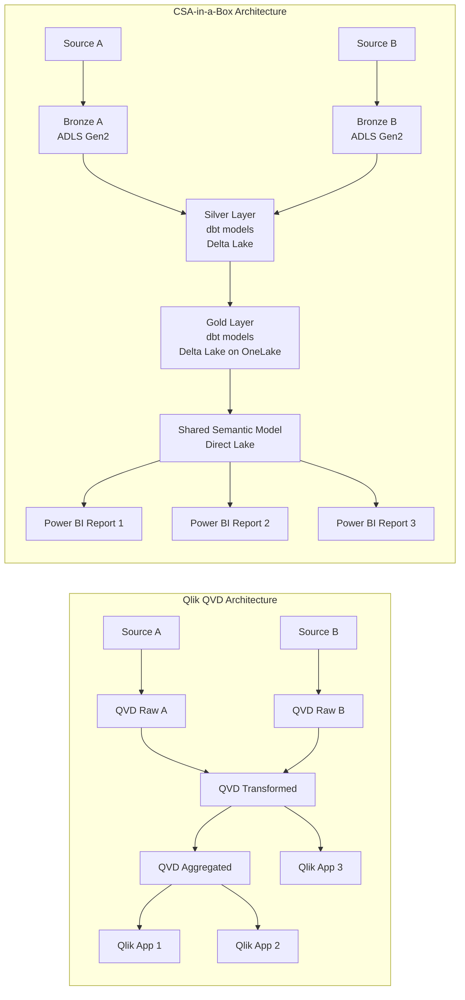

# Qlik to Power BI: Data Model Migration

**Audience:** Data engineers, BI developers, data architects
**Purpose:** Step-by-step guide for converting Qlik's associative data model to Power BI star schemas
**Reading time:** 20-25 minutes

---

## Executive summary

The Qlik associative model and the Power BI star schema are fundamentally different paradigms. Qlik allows any table to link to any other table through shared field names, creating an all-to-all association matrix. Power BI requires explicit relationships between tables, optimized as fact tables surrounded by dimension tables.

This is not a weakness of Power BI -- it is an architectural difference that produces better performance, clearer semantics, and more predictable query behavior. But it means the data model migration is not a lift-and-shift. Every Qlik data model must be analyzed and redesigned.

---

## 1. Understanding the paradigm shift

### Qlik associative model

```
+--------+     +--------+     +--------+
| Sales  |-----| Products|----| Category|
+--------+     +--------+     +--------+
    |               |
+--------+     +--------+
|Customer|     | Region |
+--------+     +--------+
```

In Qlik, these tables are associated through **shared field names**. If `Sales` has a `ProductID` field and `Products` has a `ProductID` field, they are automatically associated. No explicit join is required. The associative engine calculates all possible data combinations at query time.

**Advantages:** No modeling required. Exploration across all dimensions is immediate.
**Disadvantages:** Synthetic keys when multiple fields match between tables. Circular references when table chains loop. Performance degrades with model complexity. No distinction between facts and dimensions.

### Power BI star schema

```
        +----------+
        | Calendar |
        +----------+
             |
+--------+   |   +----------+
|Customer|---+---|  Sales    |---+--- Products
+--------+       | (fact)    |   |   +----------+
                 +----------+   |
                      |         +--- Region
                 +----------+       +----------+
                 | Measures |
                 +----------+
```

In Power BI, relationships are explicitly defined between a fact table (Sales) and dimension tables (Customer, Products, Calendar, Region). The fact table contains numeric measures (amounts, quantities) and foreign keys. Dimension tables contain descriptive attributes.

**Advantages:** Predictable performance. Clear semantics. Optimal compression. DAX operates naturally on filter context propagated through relationships.
**Disadvantages:** Requires upfront modeling. Every relationship must be defined.

---

## 2. QVD layer to CSA-in-a-Box lakehouse

### The QVD problem

In a typical Qlik deployment, the data architecture looks like this:

```
Source DB → QVD (raw) → QVD (transformed) → QVD (aggregated) → Qlik App
```

QVD files serve as:

- **Extraction cache** -- raw data pulled from sources
- **Transformation layer** -- cleaned, enriched, joined data
- **Performance optimization** -- pre-aggregated data for fast reload
- **Sharing mechanism** -- multiple apps read the same QVD files

This creates QVD sprawl: hundreds or thousands of QVD files with implicit dependencies, no lineage tracking, no quality contracts, and no governance.

### The CSA-in-a-Box replacement

CSA-in-a-Box replaces the entire QVD layer with a governed medallion architecture:

| QVD role                 | CSA-in-a-Box equivalent                    | Technology                         |
| ------------------------ | ------------------------------------------ | ---------------------------------- |
| QVD (raw extraction)     | Bronze layer                               | ADF pipeline → ADLS Gen2 (Parquet) |
| QVD (transformed)        | Silver layer                               | dbt models → Delta Lake            |
| QVD (aggregated / gold)  | Gold layer                                 | dbt models → Delta Lake on OneLake |
| QVD sharing between apps | Shared semantic model on Gold tables       | Power BI Direct Lake               |
| QVD reload schedule      | ADF trigger + dbt run + Direct Lake (auto) | Scheduled or event-driven          |



### Migration steps for QVD replacement

1. **Inventory all QVD files** -- list every QVD, its source, its refresh schedule, and which apps consume it
2. **Map QVD chains** -- trace the lineage from source through raw/transformed/aggregated QVDs
3. **Design Bronze layer** -- create ADF pipelines to ingest raw data from the same sources the QVDs pull from
4. **Design Silver layer** -- create dbt models that implement the same transformations as the Qlik data load scripts (cleaning, type casting, deduplication, SCD handling)
5. **Design Gold layer** -- create dbt models for business-ready star schemas (fact + dimension tables)
6. **Create semantic models** -- build Power BI semantic models on the Gold tables using Direct Lake
7. **Validate** -- compare Gold table row counts and aggregates against QVD-based results

---

## 3. Resolving synthetic keys

### What synthetic keys are

Synthetic keys occur in Qlik when two tables share more than one field name. Qlik creates an implicit composite key (a synthetic key) to resolve the ambiguity. For example:

```
// Qlik data load script
Sales:
LOAD OrderID, CustomerID, ProductID, Date, Amount
FROM SalesTable;

Returns:
LOAD OrderID, CustomerID, Date, ReturnAmount
FROM ReturnsTable;
```

`Sales` and `Returns` share three fields: `OrderID`, `CustomerID`, and `Date`. Qlik creates a synthetic key combining all three, which often produces unexpected associations and performance problems.

### Resolution in Power BI

Star schema design eliminates synthetic keys by construction:

**Step 1: Identify the grain.** Each fact table has one grain (one row = one transaction, one event, one measurement).

**Step 2: Use surrogate keys.** Create single-column foreign keys in fact tables that reference dimension tables.

**Step 3: Remove ambiguous relationships.** Every relationship in Power BI connects exactly one column in the fact table to one column in the dimension table.

```
// Qlik (with synthetic key problem)
Sales: OrderID, CustomerID, ProductID, Date, Amount
Returns: OrderID, CustomerID, Date, ReturnAmount
→ Synthetic key on (OrderID, CustomerID, Date)

// Power BI star schema (no synthetic keys)
FactSales: SalesKey, OrderID, CustomerID, ProductID, DateKey, Amount
FactReturns: ReturnKey, OrderID, CustomerID, DateKey, ReturnAmount
DimCustomer: CustomerID, CustomerName, ...
DimDate: DateKey, Date, Month, Year, ...
DimProduct: ProductID, ProductName, ...

Relationships:
  FactSales[CustomerID] → DimCustomer[CustomerID]
  FactSales[DateKey] → DimDate[DateKey]
  FactSales[ProductID] → DimProduct[ProductID]
  FactReturns[CustomerID] → DimCustomer[CustomerID]
  FactReturns[DateKey] → DimDate[DateKey]
```

Each relationship is a single-column join. No synthetic keys. No ambiguity.

### Common synthetic key patterns and resolutions

| Qlik pattern                                          | Root cause                         | Power BI resolution                                                  |
| ----------------------------------------------------- | ---------------------------------- | -------------------------------------------------------------------- |
| Two tables share Date + CustomerID                    | Multiple join columns              | Use surrogate DateKey; separate relationships per dimension          |
| Transaction + detail table share OrderID + LineNumber | Composite primary key              | Create surrogate TransactionKey; or use single-column key            |
| Multiple date columns (OrderDate, ShipDate, DueDate)  | Same dimension with multiple roles | Role-playing dimension: one DimDate, multiple inactive relationships |
| Header + line tables share multiple fields            | Denormalized source                | Normalize into fact + dimension in dbt Silver layer                  |

---

## 4. Resolving circular references

### What circular references are

Circular references occur when the association chain creates a loop:

```
Sales → Customer → Region → Sales (via RegionID)
```

Qlik allows you to break circular references by explicitly specifying which table holds which version of the looping field. Power BI does not allow circular references at all -- and this is a feature, not a limitation.

### Resolution in Power BI

Circular references in Qlik almost always indicate a denormalized or improperly modeled data source. The resolution is proper star schema design:

**Pattern 1: Multiple paths to same dimension**

```
// Problem: Sales has CustomerID → Customer has RegionID, but Sales also has RegionID
// Qlik: works with loosely-connected tables
// Power BI: circular reference error

// Solution: Remove RegionID from Sales fact table. Access region through Customer dimension.
// If Sales.RegionID represents something different (e.g., shipping region vs customer region),
// create a separate DimShippingRegion table.
```

**Pattern 2: Self-referencing hierarchy**

```
// Problem: Employee table with ManagerID → Employee (self-join)
// Solution: Use Parent-Child DAX functions
//   PATH(Employee[EmployeeID], Employee[ManagerID])
//   PATHITEM(path, level)
```

**Pattern 3: Many-to-many relationship**

```
// Problem: Student ↔ Course (many-to-many)
// Qlik: bridge table or link table
// Power BI: Bridge table with two one-to-many relationships
//   DimStudent ← BridgeEnrollment → DimCourse
```

---

## 5. Data load script to Power Query M / dbt

### Mapping data load script constructs

| Qlik data load script                    | Power Query M equivalent                | dbt equivalent (preferred for CSA-in-a-Box)      |
| ---------------------------------------- | --------------------------------------- | ------------------------------------------------ |
| `LOAD ... FROM [file.qvd]`               | `Csv.Document()` / `Parquet.Document()` | `source()` macro + `ref()` for upstream models   |
| `SQL SELECT ... FROM database`           | `Sql.Database()` / `Sql.Databases()`    | `source()` macro pointing to database            |
| `WHERE` clause filtering                 | `Table.SelectRows()`                    | SQL `WHERE` in model query                       |
| `CONCATENATE` (union tables)             | `Table.Combine()`                       | `UNION ALL` in SQL                               |
| `JOIN` / `KEEP`                          | `Table.NestedJoin()` / `Table.Join()`   | SQL `JOIN` in model query                        |
| `MAPPING LOAD` + `ApplyMap()`            | `Table.Join()` or lookup in M           | SQL `JOIN` or `CASE WHEN` for mapping            |
| `Preceding LOAD` (stacked transforms)    | Chained Power Query steps               | CTEs in SQL model                                |
| `CrossTable` (pivot to rows)             | `Table.UnpivotOtherColumns()`           | `UNPIVOT` in SQL                                 |
| `Generic Load`                           | Custom M function with dynamic columns  | `PIVOT` in SQL                                   |
| `IntervalMatch`                          | Custom M logic or bridge table          | `GENERATE` / `CROSS JOIN` with filter in SQL     |
| `Autonumber()`                           | `Table.AddIndexColumn()`                | `ROW_NUMBER()` window function                   |
| `Peek()` / `Previous()`                  | `Table.AddColumn()` with row index      | `LAG()` window function                          |
| `FieldValue()` / `FieldValueCount()`     | No direct M equivalent                  | SQL aggregate functions                          |
| `LET` / `SET` variables                  | M `let ... in` expression               | dbt variables / Jinja macros                     |
| Incremental load (`WHERE ModDate > ...`) | Power BI incremental refresh policy     | dbt `is_incremental()` macro                     |
| `STORE ... INTO [file.qvd]`              | Dataflow Gen2 output                    | dbt model materialization (table/incremental)    |
| `DROP TABLE` / `DROP FIELD`              | `Table.RemoveColumns()` / remove step   | SQL column selection (select only what you need) |
| `RENAME FIELD`                           | `Table.RenameColumns()`                 | SQL `AS` alias                                   |

### Recommendation: use dbt, not Power Query

For CSA-in-a-Box migrations, the transformation logic that currently lives in Qlik data load scripts should move to **dbt models** (Silver and Gold layers), not to Power Query. Power Query should handle only light shaping between the Gold layer and the semantic model.

**Why:**

- dbt models are version-controlled (Git), testable (`dbt test`), and documented (`dbt docs`)
- dbt runs in the data platform (Databricks, Fabric), not in the BI tool
- Multiple consumers (Power BI reports, APIs, notebooks) can access the same dbt-produced Gold tables
- dbt incremental models handle SCD and incremental loads more robustly than Qlik data load scripts
- Purview lineage traces through dbt models automatically

---

## 6. Calendar / master calendar migration

### Qlik master calendar pattern

Most Qlik apps include a master calendar generated in the data load script:

```
// Qlik data load script - typical master calendar
MinMaxTemp:
LOAD
    Min(OrderDate) AS MinDate,
    Max(OrderDate) AS MaxDate
RESIDENT Sales;

LET vMinDate = Peek('MinDate', 0, 'MinMaxTemp');
LET vMaxDate = Peek('MaxDate', 0, 'MinMaxTemp');
DROP TABLE MinMaxTemp;

Calendar:
LOAD
    Date($(vMinDate) + IterNo() - 1) AS Date,
    Year(Date($(vMinDate) + IterNo() - 1)) AS Year,
    Month(Date($(vMinDate) + IterNo() - 1)) AS Month,
    Day(Date($(vMinDate) + IterNo() - 1)) AS Day,
    WeekDay(Date($(vMinDate) + IterNo() - 1)) AS WeekDay
AUTOGENERATE 1
WHILE $(vMinDate) + IterNo() - 1 <= $(vMaxDate);
```

### Power BI calendar options

**Option 1: Auto date/time (simplest)**

Power BI automatically creates date hierarchies for every date column. No explicit calendar table needed for basic scenarios.

**Option 2: DAX CALENDAR function**

```dax
Calendar =
VAR MinDate = MIN(Sales[OrderDate])
VAR MaxDate = MAX(Sales[OrderDate])
RETURN
ADDCOLUMNS(
    CALENDAR(MinDate, MaxDate),
    "Year", YEAR([Date]),
    "Month", FORMAT([Date], "MMMM"),
    "MonthNumber", MONTH([Date]),
    "Quarter", "Q" & FORMAT([Date], "Q"),
    "WeekDay", FORMAT([Date], "dddd"),
    "WeekDayNumber", WEEKDAY([Date]),
    "YearMonth", FORMAT([Date], "YYYY-MM"),
    "FiscalYear", IF(MONTH([Date]) >= 10, YEAR([Date]) + 1, YEAR([Date])),
    "FiscalQuarter", "FQ" & SWITCH(TRUE(),
        MONTH([Date]) >= 10, 1,
        MONTH([Date]) >= 1 && MONTH([Date]) <= 3, 2,
        MONTH([Date]) >= 4 && MONTH([Date]) <= 6, 3,
        4
    )
)
```

**Option 3: dbt calendar in Gold layer (recommended for CSA-in-a-Box)**

Create a `dim_calendar` dbt model in the Gold layer that all semantic models reference. This ensures a single calendar definition across all reports.

---

## 7. Data model migration checklist

- [ ] **Inventory** -- list all tables in the Qlik data model, their row counts, and their association fields
- [ ] **Identify facts and dimensions** -- classify each table as fact (numeric measures, events) or dimension (descriptive attributes)
- [ ] **Draw the target star schema** -- sketch the fact-dimension relationship diagram on paper before building
- [ ] **Resolve synthetic keys** -- identify tables with multiple shared fields; create surrogate keys
- [ ] **Resolve circular references** -- identify loops in the table chain; redesign with proper dimensional modeling
- [ ] **Map QVD chains to medallion layers** -- assign each QVD to Bronze (raw), Silver (clean), or Gold (business-ready)
- [ ] **Port data load script to dbt** -- convert Qlik script logic to dbt SQL models in the CSA-in-a-Box transformation layer
- [ ] **Build the semantic model** -- create the Power BI semantic model on Gold tables with proper relationships
- [ ] **Define measures in the semantic model** -- do not put calculations in reports; put them in the semantic model
- [ ] **Validate** -- compare row counts, distinct counts, and aggregate values between Qlik and Power BI at multiple grain levels

---

## Cross-references

| Topic                        | Document                                           |
| ---------------------------- | -------------------------------------------------- |
| Expression conversion        | [Expression Migration](expression-migration.md)    |
| Feature mapping              | [Feature Mapping](feature-mapping-complete.md)     |
| Tutorial: full app migration | [Tutorial: App to PBIX](tutorial-app-to-pbix.md)   |
| dbt on CSA-in-a-Box          | `docs/adr/0013-dbt-as-canonical-transformation.md` |
| Star schema best practices   | `docs/best-practices/data-engineering.md`          |

---

**Maintainers:** CSA-in-a-Box core team
**Last updated:** 2026-04-30
