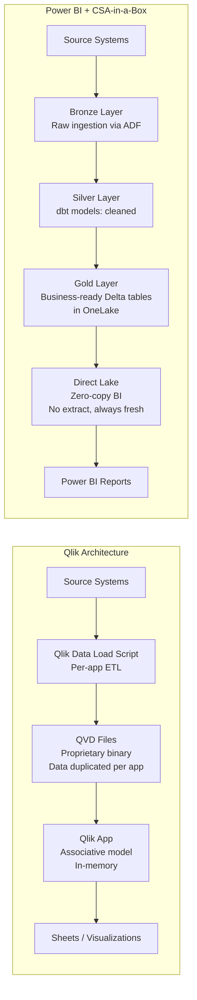
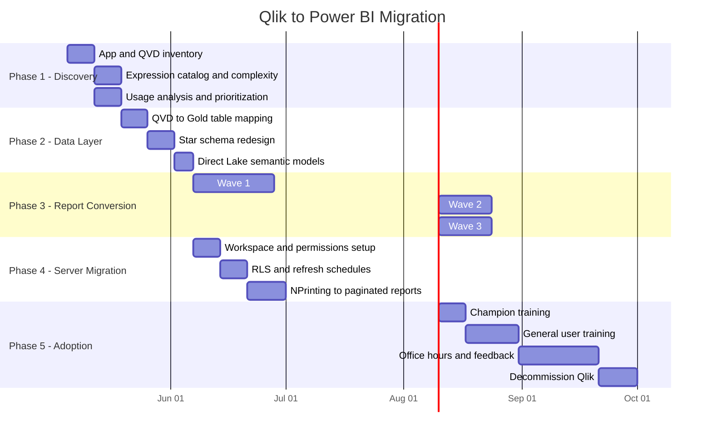

# Qlik to Power BI Migration Center

**The definitive resource for migrating from Qlik Sense Enterprise/Cloud to Power BI, Microsoft Fabric, and CSA-in-a-Box.**

---

## Who this is for

This migration center serves BI leads, analytics engineers, data architects, CDOs, IT directors, and procurement officers who are evaluating or executing a migration from Qlik Sense (Enterprise on Windows, Enterprise SaaS, or Qlik Cloud) to Power BI Service and Microsoft Fabric. Whether you are responding to Thoma Bravo-driven price increases at renewal, consolidating on the Microsoft stack, replacing NPrinting with paginated reports, or pursuing Fabric convergence for zero-copy analytics with Direct Lake, these resources provide the evidence, patterns, and step-by-step guidance to execute confidently.

With over 40,000 Qlik customers worldwide, many of whom face 15-30% annual price increases under PE ownership, BI consolidation to Power BI is one of the most common platform migrations in the analytics market.

---

## Quick-start decision matrix

| Your situation                                   | Start here                                                           |
| ------------------------------------------------ | -------------------------------------------------------------------- |
| Executive evaluating Power BI vs Qlik            | [Why Power BI over Qlik](why-powerbi-over-qlik.md)                   |
| Need cost justification for migration            | [Total Cost of Ownership Analysis](tco-analysis.md)                  |
| Need a feature-by-feature comparison             | [Complete Feature Mapping](feature-mapping-complete.md)              |
| Converting Qlik expressions (Set Analysis, Aggr) | [Expression Migration Reference](expression-migration.md)            |
| Migrating the associative data model             | [Data Model Migration](data-model-migration.md)                      |
| Migrating specific chart types                   | [Visualization Migration](visualization-migration.md)                |
| Migrating Qlik Sense Enterprise server           | [Server Migration](server-migration.md)                              |
| Replacing Qlik NPrinting                         | [NPrinting Migration](nprinting-migration.md)                        |
| Want a hands-on app conversion tutorial          | [Tutorial: App to PBIX](tutorial-app-to-pbix.md)                     |
| Need DAX conversion practice                     | [Tutorial: Expression Conversion](tutorial-expression-conversion.md) |
| Federal / GCC / GCC-High requirements            | [Federal Migration Guide](federal-migration-guide.md)                |
| Need performance benchmarks                      | [Benchmarks](benchmarks.md)                                          |
| Planning rollout and training                    | [Best Practices](best-practices.md)                                  |
| Want the full end-to-end playbook                | [Migration Playbook](../qlik-to-powerbi.md)                          |

---

## Power BI licensing decision matrix

Not all Power BI SKUs are equal. Choosing the right licensing model depends on your user count, feature requirements, and whether Fabric capacity is part of the strategy.

| Scenario                                            | Recommended license             | Monthly cost                      | Key features                                                                           |
| --------------------------------------------------- | ------------------------------- | --------------------------------- | -------------------------------------------------------------------------------------- |
| Small team (< 50 users), basic BI                   | Power BI Pro                    | $10/user                          | Full authoring, sharing, 1 GB model limit, 8 refreshes/day                             |
| Org already on M365 E5                              | Power BI Pro (included)         | $0 incremental                    | All Pro features at no additional cost                                                 |
| 50-300 users, need paginated reports, larger models | Power BI Premium Per User (PPU) | $20/user                          | Pro + 100 GB models, 48 refreshes/day, paginated reports                               |
| 300+ users, embedding, XMLA, AI                     | Power BI Premium Capacity (P1+) | $4,995/mo (P1)                    | Unlimited viewers, XMLA, AutoML, AI, paginated, deployment pipelines                   |
| Unified data + analytics platform                   | Microsoft Fabric (F SKU)        | $262/mo (F2) to $16,384/mo (F128) | Everything in Premium + data engineering, notebooks, lakehouse, Real-Time Intelligence |
| Federal / government                                | Power BI GCC / GCC-High         | Same as commercial                | FedRAMP High, GCC-High for DoD/ITAR                                                    |

!!! tip "Fabric F64 or higher includes Power BI Premium equivalent"
If your organization is deploying CSA-in-a-Box with Fabric capacity F64 or above, all Power BI Premium features are included. This means paginated reports (NPrinting replacement), XMLA endpoints, deployment pipelines, and larger semantic models are available at no additional BI-specific cost. The Fabric capacity covers both data platform and BI workloads.

---

## Strategic resources

These documents provide the business case, cost analysis, and strategic framing for decision-makers.

| Document                                            | Audience                | Description                                                                                                                                |
| --------------------------------------------------- | ----------------------- | ------------------------------------------------------------------------------------------------------------------------------------------ |
| [Why Power BI over Qlik](why-powerbi-over-qlik.md)  | CIO / CDO / CFO         | Strategic case covering Thoma Bravo ownership, M365 integration, Fabric convergence, Copilot, licensing advantage, and honest trade-offs   |
| [Total Cost of Ownership Analysis](tco-analysis.md) | CFO / CIO / Procurement | Per-user pricing across Qlik tiers vs Power BI tiers, scenario modeling (50 to 2,000 users), NPrinting replacement, 5-year TCO projections |
| [Benchmarks & Performance](benchmarks.md)           | CTO / BI Engineering    | Render performance, data model size limits, concurrent users, Direct Lake vs Import, mobile and embedding benchmarks                       |

---

## Migration guides

Domain-specific deep dives covering every aspect of a Qlik-to-Power BI migration.

| Guide                                                 | Qlik capability                                              | Power BI destination                                  |
| ----------------------------------------------------- | ------------------------------------------------------------ | ----------------------------------------------------- |
| [Data Model Migration](data-model-migration.md)       | Associative model, QVDs, synthetic keys, circular references | Star schema, Direct Lake, dataflows, lakehouse        |
| [Expression Migration](expression-migration.md)       | Set Analysis, Aggr(), Above/Below, Dual(), inter-record      | DAX CALCULATE, SUMX, window functions, format strings |
| [Visualization Migration](visualization-migration.md) | Qlik chart objects, extensions, storytelling                 | Power BI visuals, custom visuals, bookmarks           |
| [Server Migration](server-migration.md)               | QMC, streams, security rules, reload tasks                   | Admin portal, workspaces, RLS, scheduled refresh      |
| [NPrinting Migration](nprinting-migration.md)         | NPrinting templates, email distribution, parameters          | Paginated reports, subscriptions, parameters          |

---

## Technical references

| Document                                                  | Description                                                                                                         |
| --------------------------------------------------------- | ------------------------------------------------------------------------------------------------------------------- |
| [Complete Feature Mapping](feature-mapping-complete.md)   | 50+ Qlik features mapped to Power BI equivalents with migration complexity ratings and recommendations              |
| [Expression Migration Reference](expression-migration.md) | Set Analysis, Aggr(), table functions, conditionals with 20+ side-by-side Qlik-to-DAX examples                      |
| [Data Model Migration](data-model-migration.md)           | Associative model to star schema conversion, QVD layer replacement, synthetic key resolution, data load script port |
| [Visualization Migration](visualization-migration.md)     | Chart-by-chart mapping, Qlik extensions to custom visuals, selection model adaptation                               |
| [Server Migration](server-migration.md)                   | QMC to Power BI Admin portal, streams to workspaces, security rules to RLS, reload tasks to refresh schedules       |
| [NPrinting Migration](nprinting-migration.md)             | NPrinting report templates to Power BI paginated reports, email distribution to subscriptions                       |
| [Migration Playbook](../qlik-to-powerbi.md)               | The end-to-end playbook with expression mapping, cost analysis, migration phases, and training curriculum           |

---

## Tutorials

Step-by-step, hands-on guides for the most common migration tasks.

| Tutorial                                                            | Duration  | Description                                                                                                               |
| ------------------------------------------------------------------- | --------- | ------------------------------------------------------------------------------------------------------------------------- |
| [App to PBIX](tutorial-app-to-pbix.md)                              | 4-5 hours | Convert a Qlik Sense app end-to-end: analyze data model, rebuild star schema, port expressions, recreate visuals, publish |
| [Expression Conversion Workshop](tutorial-expression-conversion.md) | 2-3 hours | Convert 15+ common Qlik expressions to DAX with conceptual explanations of filter context vs Set Analysis                 |

---

## Government and federal

| Document                                              | Description                                                                                                                           |
| ----------------------------------------------------- | ------------------------------------------------------------------------------------------------------------------------------------- |
| [Federal Migration Guide](federal-migration-guide.md) | Power BI GCC/GCC-High/DoD, Fabric government availability, Purview for BI governance, sensitivity labels, data residency, procurement |

---

## How CSA-in-a-Box fits

CSA-in-a-Box is the **data platform layer** that makes the Qlik-to-Power BI migration architecturally superior to a simple BI tool swap. Instead of replacing QVD files with Power BI Import extracts (which trades one extract pipeline for another), CSA-in-a-Box provides:

- **Medallion architecture** (Bronze/Silver/Gold) -- raw ingestion through ADF, transformation through dbt, business-ready tables in the Gold layer
- **OneLake / ADLS Gen2** -- Delta Lake tables accessible to Power BI via Direct Lake (zero-copy, always-fresh BI)
- **Microsoft Purview** -- end-to-end lineage from source system through Bronze/Silver/Gold to Power BI report, with auto-classification of PII/PHI/CUI
- **Unity Catalog / Fabric catalog** -- governed metadata layer replacing Qlik's per-app data model isolation
- **Data contracts** (`contract.yaml`) -- schema, SLA, and ownership enforced at the Gold layer before BI consumption
- **Data Mesh support** -- domain-owned data products with self-service BI, versus Qlik's centralized per-app model

### Why Direct Lake replaces the QVD pattern

The QVD file is the backbone of every Qlik Sense deployment. Every app loads data from source systems (or from intermediate QVDs), transforms it in the data load script, and stores it in a proprietary in-memory format. This means:

- Data is duplicated across every app that uses it
- Reload tasks must run on schedule to keep data fresh
- QVD chains (QVD-to-QVD) create hidden dependencies
- No shared semantic layer -- each app defines its own measures

**Direct Lake eliminates all of this.** Power BI reads Delta Parquet files directly from OneLake. No data duplication. No scheduled reload. No stale dashboards. The Gold layer in CSA-in-a-Box becomes the single source of truth, and Power BI's shared semantic model replaces per-app measure definitions.

---

## Migration timeline

---

## Audience and estimated reading time

| Document                                                   | Primary audience            | Estimated reading time |
| ---------------------------------------------------------- | --------------------------- | ---------------------- |
| [Migration Playbook](../qlik-to-powerbi.md)                | BI Leads, CDOs              | 15-20 min              |
| [Why Power BI over Qlik](why-powerbi-over-qlik.md)         | CIO / CDO / CFO             | 20-25 min              |
| [TCO Analysis](tco-analysis.md)                            | CFO / Procurement           | 15-20 min              |
| [Feature Mapping](feature-mapping-complete.md)             | BI Architects               | 20-30 min              |
| [Data Model Migration](data-model-migration.md)            | Data Engineers              | 20-25 min              |
| [Expression Migration](expression-migration.md)            | Report Developers           | 25-30 min              |
| [Visualization Migration](visualization-migration.md)      | Report Developers           | 15-20 min              |
| [Server Migration](server-migration.md)                    | BI Admins                   | 15-20 min              |
| [NPrinting Migration](nprinting-migration.md)              | Report Admins               | 12-15 min              |
| [Tutorial: App to PBIX](tutorial-app-to-pbix.md)           | Report Developers           | 60-90 min (hands-on)   |
| [Tutorial: Expressions](tutorial-expression-conversion.md) | Report Developers           | 45-60 min (hands-on)   |
| [Federal Guide](federal-migration-guide.md)                | Federal BI Leads            | 12-15 min              |
| [Benchmarks](benchmarks.md)                                | BI Architects / Engineering | 12-15 min              |
| [Best Practices](best-practices.md)                        | Project Managers / BI Leads | 15-20 min              |

---

## Cross-references

| Topic                                                  | Document                                                     |
| ------------------------------------------------------ | ------------------------------------------------------------ |
| Tableau to Power BI migration (companion BI migration) | `docs/migrations/tableau-to-powerbi.md`                      |
| Looker to Power BI (within GCP migration)              | `docs/migrations/gcp-to-azure/tutorial-looker-to-powerbi.md` |
| Fabric vs Databricks vs Synapse decision tree          | `docs/decisions/fabric-vs-databricks-vs-synapse.md`          |
| Power BI and Fabric roadmap patterns                   | `docs/patterns/power-bi-fabric-roadmap.md`                   |
| ADR: Fabric as strategic target                        | `docs/adr/0010-fabric-strategic-target.md`                   |
| Data governance best practices                         | `docs/best-practices/data-governance.md`                     |
| Cost management                                        | `docs/COST_MANAGEMENT.md`                                    |
| Government service matrix                              | `docs/GOV_SERVICE_MATRIX.md`                                 |

---

**Maintainers:** CSA-in-a-Box core team
**Last updated:** 2026-04-30
