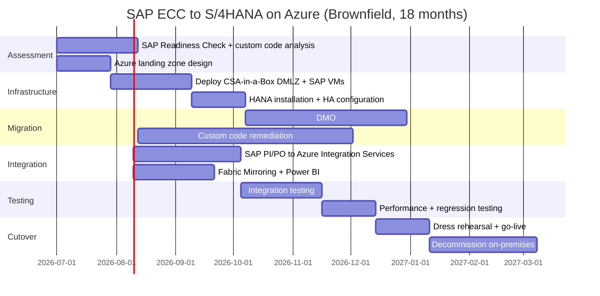

# Migrating SAP Workloads to Azure with CSA-in-a-Box

**Status:** Authored 2026-04-30
**Audience:** SAP Basis administrators, enterprise architects, CIOs, and federal program managers evaluating or executing SAP migrations to Azure --- commercial, Azure Government, or RISE with SAP on Azure.
**Scope:** The full SAP estate: SAP ECC/S/4HANA, SAP HANA database, SAP BW/BW4HANA, SAP PI/PO, SAP Fiori, SAP GRC, SAP Solution Manager, SAP Analytics Cloud, and supporting integration and identity layers. CSA-in-a-Box serves as the data, analytics, governance, and AI landing zone for SAP workloads on Azure.

---

!!! warning "2027 ECC End-of-Support Deadline"
SAP will end mainstream maintenance for SAP ECC 6.0 (EHP 8) and SAP Business Suite 7 on **December 31, 2027**. Extended maintenance is available at a 2% annual premium through 2030, but no new features, no security patches beyond critical, and no regulatory updates. The clock is running. Every month of delay compresses your migration window and increases risk.

!!! tip "Expanded Migration Center Available"
This playbook is the core migration reference. For the complete SAP-to-Azure migration package --- including infrastructure guides, HANA migration, S/4HANA conversion, analytics migration, security, tutorials, benchmarks, and federal-specific guidance --- visit the **[SAP to Azure Migration Center](sap-to-azure/index.md)**.

    **Quick links:**

    - [Why Azure for SAP (Executive Brief)](sap-to-azure/why-azure-for-sap.md)
    - [Total Cost of Ownership Analysis](sap-to-azure/tco-analysis.md)
    - [Complete Feature Mapping (SAP to Azure)](sap-to-azure/feature-mapping-complete.md)
    - [Infrastructure Migration](sap-to-azure/infrastructure-migration.md)
    - [HANA Database Migration](sap-to-azure/hana-migration.md)
    - [S/4HANA Conversion](sap-to-azure/s4hana-conversion.md)
    - [Federal Migration Guide](sap-to-azure/federal-migration-guide.md)
    - [Tutorials & Walkthroughs](sap-to-azure/index.md#tutorials)
    - [Benchmarks & Performance](sap-to-azure/benchmarks.md)
    - [Best Practices](sap-to-azure/best-practices.md)

## 1. Executive summary

98 of the Fortune 100 run SAP. SAP SE generates EUR 36.8 billion in annual revenue. SAP ECC is the transactional backbone of global enterprise --- finance, supply chain, manufacturing, human resources, and procurement. The 2027 end-of-support deadline is not optional; it is a hard cutover that affects every SAP ECC customer worldwide.

Azure is SAP's preferred cloud partner. Microsoft and SAP have a 30-year relationship, formalized in the **Embrace** partnership, and extended through RISE with SAP on Azure, Azure Center for SAP Solutions, and Copilot integrations. Azure is the only hyperscaler where SAP has co-engineered infrastructure certification, deployment automation, and monitoring integration at the platform level.

CSA-in-a-Box extends this foundation. While SAP on Azure provides the compute, storage, and networking for SAP workloads, CSA-in-a-Box provides the **data, analytics, governance, and AI landing zone** that SAP data flows into. Fabric Mirroring for SAP replicates transactional data to OneLake in near-real-time. Purview provides unified governance across SAP and Azure data estates. Power BI replaces SAP Analytics Cloud with a unified BI layer. Azure AI and OpenAI Services enable process intelligence on SAP data that was never possible on-premises.

### Decision matrix --- SAP deployment models on Azure

| Deployment model           | Best for                                                                        | SAP manages                     | Customer manages                                 | CSA-in-a-Box role                                                                    |
| -------------------------- | ------------------------------------------------------------------------------- | ------------------------------- | ------------------------------------------------ | ------------------------------------------------------------------------------------ |
| **RISE with SAP on Azure** | Organizations wanting SAP-managed infrastructure; new S/4HANA Cloud deployments | Infrastructure, HANA, Basis     | Business configuration, integrations, extensions | Analytics landing zone: Fabric Mirroring, Power BI, Azure AI for SAP data            |
| **SAP on Azure VMs**       | Organizations wanting full control; complex custom ABAP, large BW systems       | Nothing (customer self-managed) | Everything: VMs, HANA, Basis, networking         | Full platform: infrastructure templates, data integration, analytics, governance, AI |
| **HANA Large Instances**   | Extreme-scale HANA (6+ TB); bare-metal performance requirements                 | Bare-metal infrastructure       | SAP application, HANA administration             | Analytics landing zone: data extraction, Fabric, Power BI, AI                        |

---

## 2. Migration paths --- which one are you?

### Path A: ECC to S/4HANA on Azure (brownfield conversion)

**Timeline:** 12--24 months | **Complexity:** High | **Best for:** Organizations with heavy customization that must preserve business process and transactional data.

1. **Assess** --- SAP Readiness Check, custom code analysis (ATC), simplification list review
2. **Prepare Azure landing zone** --- Deploy CSA-in-a-Box DMLZ, provision M-series or Mv2 VMs, configure ANF for HANA storage
3. **Database migration** --- Migrate source database (Oracle/DB2/SQL Server/MaxDB) to SAP HANA on Azure using DMO (Database Migration Option) with SUM
4. **System conversion** --- Run SUM with DMO for combined database migration + S/4HANA conversion
5. **Custom code remediation** --- Adapt custom ABAP to S/4HANA-compatible APIs, remove deprecated function modules
6. **Integration rewiring** --- Migrate SAP PI/PO interfaces to Azure Integration Services (Logic Apps, API Management, Service Bus)
7. **Analytics layer** --- Configure Fabric Mirroring for SAP, build Power BI reports on SAP data, deploy Azure AI for process intelligence
8. **Cutover** --- Final delta sync, go-live, decommission on-premises infrastructure

### Path B: New S/4HANA implementation on Azure (greenfield)

**Timeline:** 9--18 months | **Complexity:** Medium | **Best for:** Organizations willing to re-implement business processes using SAP Best Practices and Fit-to-Standard methodology.

1. **Fit-to-Standard workshops** --- Map business requirements to SAP Best Practices
2. **Deploy Azure landing zone** --- CSA-in-a-Box DMLZ + SAP-certified VMs
3. **Install S/4HANA** --- Azure Center for SAP Solutions automated deployment
4. **Configure** --- Business configuration using SAP Activate methodology
5. **Data migration** --- Selective data load using SAP S/4HANA Migration Cockpit
6. **Integrate** --- Azure Integration Services for SAP interfaces
7. **Analytics** --- Fabric Mirroring, Power BI, Azure AI from day one

### Path C: RISE with SAP on Azure

**Timeline:** 6--12 months | **Complexity:** Low--Medium | **Best for:** Organizations preferring SAP-managed infrastructure with subscription-based pricing.

1. **Contract RISE** --- Engage SAP for RISE with SAP on Azure subscription
2. **Deploy CSA-in-a-Box** --- Data and analytics landing zone alongside RISE environment
3. **Configure integration** --- SAP BTP + Azure Integration Services for cross-platform connectivity
4. **Analytics layer** --- Fabric Mirroring for SAP HANA, Power BI, Azure AI

---

## 3. SAP component mapping --- what moves where

| SAP component               | Azure destination                                                    | Migration approach                      | CSA-in-a-Box integration                             |
| --------------------------- | -------------------------------------------------------------------- | --------------------------------------- | ---------------------------------------------------- |
| SAP HANA (database)         | Azure VMs (M-series, Mv2) or HANA Large Instances                    | Backup/restore, HSR, DMO                | Fabric Mirroring for near-real-time data replication |
| SAP NetWeaver (application) | Azure VMs (E-series, D-series)                                       | Lift-and-shift, then optimize           | Azure Monitor for SAP Solutions                      |
| SAP BW / BW/4HANA           | Microsoft Fabric, Synapse Analytics, Databricks                      | Phased migration of InfoProviders       | OneLake as unified data lake, dbt models             |
| SAP PI/PO (integration)     | Azure Integration Services (Logic Apps, API Management, Service Bus) | Interface-by-interface migration        | ADF pipelines for SAP data extraction                |
| SAP Fiori (UX)              | Azure App Service, Azure Front Door                                  | Rehost with Entra ID SSO                | Power BI embedded for analytics views                |
| SAP GRC                     | Microsoft Purview + Entra ID Governance                              | Phased control migration                | Purview data governance, compliance taxonomies       |
| SAP Solution Manager        | Azure Monitor for SAP Solutions                                      | Parallel run, then cutover              | CSA-in-a-Box monitoring integration                  |
| SAP Identity Management     | Microsoft Entra ID                                                   | SAML/OAuth SSO, SCIM provisioning       | Entra ID as unified identity plane                   |
| SAP Analytics Cloud         | Power BI Premium / Fabric                                            | Dashboard-by-dashboard migration        | Direct Lake on OneLake, Copilot for Power BI         |
| SAP ABAP custom code        | Azure Functions, Logic Apps, AKS                                     | Refactor or rewrite non-core extensions | API Management for SAP service exposure              |

---

## 4. How CSA-in-a-Box integrates with SAP on Azure

CSA-in-a-Box is not an SAP migration tool. It is the **data and analytics landing zone** that receives, governs, and activates SAP data once it lands on Azure. The integration model:

```
SAP S/4HANA on Azure VMs
    │
    ├── Fabric Mirroring for SAP ──► OneLake (Delta Lake)
    │                                    │
    │                                    ├── Power BI (Direct Lake)
    │                                    ├── Databricks (ML/AI)
    │                                    └── Purview (governance)
    │
    ├── ADF SAP Connector ──► ADLS Gen2 (batch extraction)
    │                              │
    │                              └── dbt models (medallion architecture)
    │
    ├── Azure Integration Services ──► Logic Apps (RFC/IDoc/BAPI)
    │
    └── Azure Monitor for SAP ──► CSA-in-a-Box monitoring
```

### Key integration points

- **Fabric Mirroring for SAP** --- Near-real-time replication of SAP HANA tables to OneLake as Delta tables. No ETL coding required. SAP data appears in the Fabric lakehouse within minutes.
- **ADF SAP Connectors** --- Batch extraction from SAP ECC/S/4HANA using SAP Table Connector, SAP BW Connector, SAP HANA Connector, and SAP ODP (Operational Data Provisioning).
- **Purview for SAP governance** --- Scan SAP HANA metadata, classify SAP data (PII, financial, HR), and enforce data governance policies across SAP and non-SAP data.
- **Power BI for SAP analytics** --- Replace SAP Analytics Cloud and SAP BusinessObjects with Power BI Premium. Direct Lake mode on OneLake eliminates data import overhead.
- **Azure AI for SAP process intelligence** --- Apply Azure OpenAI to SAP operational data: invoice anomaly detection, supply chain optimization, predictive maintenance on equipment master data.

---

## 5. Federal considerations

SAP runs mission-critical systems across the federal government --- DFAS (Defense Finance and Accounting Service), GFEBS (General Fund Enterprise Business System), civilian HR and finance. Federal SAP migrations to Azure must address:

| Requirement        | Azure capability                              | CSA-in-a-Box support                            |
| ------------------ | --------------------------------------------- | ----------------------------------------------- |
| FedRAMP High       | Azure Government (FedRAMP High P-ATO)         | Compliance mappings in `governance/compliance/` |
| DoD IL4/IL5        | Azure Government regions (IL4/IL5 authorized) | SAP-certified VMs available in Gov regions      |
| ITAR               | Azure Government with data residency controls | Tenant-binding, no data egress to commercial    |
| DFARS 252.204-7012 | Azure Government + Defender for Cloud         | CMMC 2.0 control mappings                       |
| FISMA              | Azure Government inherits FISMA authorization | Continuous monitoring via Azure Monitor         |
| Section 508        | Power BI accessibility compliance             | Accessible analytics layer                      |

See [Federal SAP Migration Guide](sap-to-azure/federal-migration-guide.md) for DoD-specific SAP deployment patterns.

---

## 6. Migration timeline



---

## 7. Cost optimization strategies

| Strategy                          | Savings                       | Notes                                                          |
| --------------------------------- | ----------------------------- | -------------------------------------------------------------- |
| Azure Reserved Instances (3-year) | 40--60% on VM compute         | SAP HANA VMs run 24/7 --- reserved pricing is essential        |
| Azure Hybrid Benefit              | 40--50% on Windows/SQL Server | Bring existing Windows Server and SQL Server licenses          |
| Dev/test pricing                  | 40--55% on non-production     | SAP sandbox and development systems use dev/test subscriptions |
| Snooze non-production             | 30--40% additional            | Stop SAP dev/QA VMs outside business hours                     |
| Azure Spot VMs                    | 60--80% for batch/test        | SAP performance testing and batch jobs                         |
| Fabric capacity reservation       | 10--25% on analytics          | Reserved Fabric capacity for SAP data analytics                |

---

## 8. Next steps

1. **Run SAP Readiness Check** --- Assess your current ECC system for S/4HANA compatibility
2. **Deploy a proof-of-concept** --- Use [Tutorial: Deploy SAP S/4HANA on Azure](sap-to-azure/tutorial-sap-azure-deployment.md) to stand up a sandbox
3. **Configure Fabric Mirroring** --- Follow [Tutorial: SAP Data to Fabric](sap-to-azure/tutorial-sap-data-to-fabric.md) to see SAP data in OneLake within hours
4. **Engage Microsoft FastTrack for SAP** --- Request a migration assessment from Microsoft's SAP practice
5. **Review the full Migration Center** --- [SAP to Azure Migration Center](sap-to-azure/index.md) for deep-dive guides on every migration workstream

---

**Last updated:** 2026-04-30
**Maintainers:** CSA-in-a-Box core team
**Related:** [AWS to Azure Migration](aws-to-azure.md) | [GCP to Azure Migration](gcp-to-azure.md) | [Palantir Foundry Migration](palantir-foundry.md)
