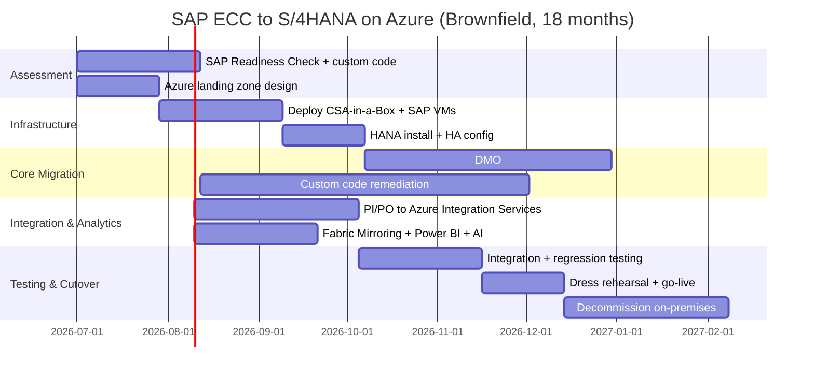

# SAP to Azure Migration Center

**The definitive resource for migrating SAP workloads to Microsoft Azure and integrating SAP data with CSA-in-a-Box for unified analytics, governance, and AI.**

---

!!! danger "2027 Deadline: SAP ECC End of Mainstream Maintenance"
SAP will end mainstream maintenance for ECC 6.0 and Business Suite 7 on **December 31, 2027**. Extended maintenance (available through 2030) carries a 2% annual premium, delivers no new features, and provides only critical security patches. Organizations that have not migrated to S/4HANA by this date face increasing operational risk, compliance gaps, and support cost escalation. Start now.

## Who this is for

This migration center serves SAP Basis administrators, enterprise architects, CIOs, CDOs, federal program managers, and data engineers who are evaluating or executing a migration from SAP ECC/Business Suite to S/4HANA on Azure, modernizing SAP analytics with Microsoft Fabric and Power BI, or integrating SAP data into an Azure-native data and AI platform. Whether you are running a brownfield system conversion, deploying a greenfield S/4HANA instance, adopting RISE with SAP on Azure, or migrating SAP BW to Fabric, these resources provide the architecture, patterns, and step-by-step guidance to execute confidently.

---

## Quick-start decision matrix

| Your situation                                | Start here                                                        |
| --------------------------------------------- | ----------------------------------------------------------------- |
| Executive evaluating Azure for SAP workloads  | [Why Azure for SAP](why-azure-for-sap.md)                         |
| Need cost justification for SAP migration     | [Total Cost of Ownership Analysis](tco-analysis.md)               |
| Need SAP-to-Azure component mapping           | [Complete Feature Mapping](feature-mapping-complete.md)           |
| Ready to plan infrastructure for SAP on Azure | [Infrastructure Migration](infrastructure-migration.md)           |
| Migrating SAP HANA database to Azure          | [HANA Database Migration](hana-migration.md)                      |
| Converting ECC to S/4HANA                     | [S/4HANA Conversion Guide](s4hana-conversion.md)                  |
| Migrating SAP PI/PO integrations              | [Integration Migration](integration-migration.md)                 |
| Migrating SAP BW / Analytics Cloud            | [Analytics Migration](analytics-migration.md)                     |
| Migrating SAP security to Azure               | [Security Migration](security-migration.md)                       |
| Federal/DoD SAP deployment requirements       | [Federal Migration Guide](federal-migration-guide.md)             |
| Want a hands-on deployment walkthrough        | [Tutorial: Deploy SAP on Azure](tutorial-sap-azure-deployment.md) |
| Want to get SAP data into Fabric              | [Tutorial: SAP Data to Fabric](tutorial-sap-data-to-fabric.md)    |

---

## SAP deployment model decision tree

Choosing the right SAP deployment model on Azure is the first critical decision. This matrix compares the three primary models.

| Dimension                          | RISE with SAP on Azure                             | SAP on Azure VMs                                        | HANA Large Instances                               |
| ---------------------------------- | -------------------------------------------------- | ------------------------------------------------------- | -------------------------------------------------- |
| **Management model**               | SAP manages infrastructure + Basis                 | Customer manages everything                             | Microsoft manages bare-metal, customer manages SAP |
| **Pricing model**                  | Subscription (OPEX)                                | Pay-as-you-go or Reserved (CAPEX/OPEX)                  | Reserved bare-metal                                |
| **HANA scale**                     | Up to 24 TB (cloud-certified)                      | Up to 24 TB (M-series, Mv2)                             | Up to 24 TB (Type II/III/IV)                       |
| **Customization**                  | Limited (clean core model)                         | Full (any ABAP, any kernel)                             | Full                                               |
| **S/4HANA version**                | S/4HANA Cloud, Private Edition                     | S/4HANA on-premises edition                             | S/4HANA on-premises edition                        |
| **Infrastructure control**         | None (SAP-managed)                                 | Full (customer-managed VMs)                             | Partial (bare-metal allocated)                     |
| **Azure Center for SAP Solutions** | Not applicable (SAP manages)                       | Full support (deployment, monitoring)                   | Partial support                                    |
| **CSA-in-a-Box integration**       | Via Fabric Mirroring, BTP connectors               | Direct integration (same VNet, same subscriptions)      | Via VNet peering, data extraction                  |
| **Best for**                       | Organizations wanting managed SAP; new deployments | Organizations wanting full control; heavy customization | Extreme-scale HANA workloads requiring bare-metal  |
| **Federal availability**           | Limited (check RISE Gov availability)              | Full (Azure Government regions)                         | Limited (check Gov region availability)            |

---

## Strategic resources

These documents provide the business case, cost analysis, and strategic framing for decision-makers.

| Document                                                | Audience                                | Description                                                                                                                                                                                                   |
| ------------------------------------------------------- | --------------------------------------- | ------------------------------------------------------------------------------------------------------------------------------------------------------------------------------------------------------------- |
| [Why Azure for SAP](why-azure-for-sap.md)               | CIO / CDO / Board                       | Executive brief covering the Microsoft-SAP strategic partnership, Azure infrastructure certification, 2027 deadline urgency, RISE with SAP, Azure Center for SAP Solutions, and Fabric Mirroring for SAP data |
| [Total Cost of Ownership Analysis](tco-analysis.md)     | CFO / CIO / Procurement                 | Detailed TCO comparison: on-premises SAP vs SAP on Azure VMs vs RISE with SAP vs HANA Large Instances, with 3-year and 5-year projections, reserved instance savings, and Hybrid Benefit analysis             |
| [Complete Feature Mapping](feature-mapping-complete.md) | CTO / SAP Basis / Platform Architecture | Every SAP component mapped to its Azure equivalent with migration complexity ratings, CSA-in-a-Box integration points, and gap analysis                                                                       |

---

## Migration guides

Domain-specific deep dives covering every aspect of an SAP-to-Azure migration.

| Guide                                                   | SAP capability                            | Azure destination                                                    |
| ------------------------------------------------------- | ----------------------------------------- | -------------------------------------------------------------------- |
| [Infrastructure Migration](infrastructure-migration.md) | SAP HANA, NetWeaver, application servers  | Azure VMs (M-series, Mv2, E-series), ANF, Premium SSD, Ultra Disk    |
| [HANA Database Migration](hana-migration.md)            | SAP HANA database (any source DB)         | Azure VMs, HANA Large Instances, HSR, DMO                            |
| [S/4HANA Conversion](s4hana-conversion.md)              | SAP ECC to S/4HANA                        | Brownfield, greenfield, selective data transition                    |
| [Integration Migration](integration-migration.md)       | SAP PI/PO, BTP, RFC/IDoc/BAPI             | Azure Integration Services (Logic Apps, API Management, Service Bus) |
| [Analytics Migration](analytics-migration.md)           | SAP BW, BW/4HANA, Analytics Cloud         | Microsoft Fabric, Synapse, Databricks, Power BI                      |
| [Security Migration](security-migration.md)             | SAP authentication, GRC, network security | Entra ID, Purview, Defender for Cloud, Azure Firewall                |

---

## Tutorials

Hands-on, step-by-step walkthroughs for specific migration scenarios.

| Tutorial                                                        | What you will build                                                                                                      | Time       |
| --------------------------------------------------------------- | ------------------------------------------------------------------------------------------------------------------------ | ---------- |
| [Deploy SAP S/4HANA on Azure](tutorial-sap-azure-deployment.md) | A complete SAP S/4HANA deployment using Azure Center for SAP Solutions: VNet, VMs, HANA installation, HA configuration   | 4--6 hours |
| [SAP Data to Fabric](tutorial-sap-data-to-fabric.md)            | Fabric Mirroring for SAP HANA, Delta tables in OneLake, Power BI reports on SAP data, CSA-in-a-Box analytics integration | 2--3 hours |

---

## Technical references

| Document                                                | Description                                                                                                                  |
| ------------------------------------------------------- | ---------------------------------------------------------------------------------------------------------------------------- |
| [Complete Feature Mapping](feature-mapping-complete.md) | Every SAP component mapped to Azure services with migration complexity, CSA-in-a-Box evidence paths, and gap analysis        |
| [Benchmarks & Performance](benchmarks.md)               | HANA performance on Azure VMs: SAPS ratings, memory throughput, IO benchmarks, HSR replication latency, backup/restore times |
| [Best Practices](best-practices.md)                     | SAP on Azure landing zone design, HA/DR, monitoring, backup, cost optimization, and CSA-in-a-Box integration patterns        |
| [Migration Playbook](../sap-to-azure.md)                | The concise end-to-end playbook with decision matrix, component mapping, timeline, and cost optimization                     |

---

## Government and federal

| Document                                              | Description                                                                                                                                       |
| ----------------------------------------------------- | ------------------------------------------------------------------------------------------------------------------------------------------------- |
| [Federal Migration Guide](federal-migration-guide.md) | SAP on Azure Government: DoD financial systems (DFAS, GFEBS), civilian ERP, FedRAMP High, IL4/IL5, ITAR, certified VM availability in Gov regions |

---

## How CSA-in-a-Box fits

CSA-in-a-Box is not an SAP migration tool --- it is the **data, analytics, governance, and AI landing zone** that SAP data flows into once the SAP workload is running on Azure. The integration model:

- **Fabric Mirroring for SAP** --- Near-real-time replication of SAP HANA tables to OneLake as Delta tables. No ETL coding. SAP transactional data (sales orders, purchase orders, material movements, financial postings) appears in the Fabric lakehouse within minutes.
- **Purview for SAP data governance** --- Scan SAP HANA metadata, classify SAP data fields (PII, financial, HR sensitive), enforce data governance policies, and provide unified lineage across SAP and non-SAP data.
- **Power BI for SAP analytics** --- Replace SAP Analytics Cloud and SAP BusinessObjects with Power BI Premium. Direct Lake mode on OneLake eliminates data import latency. Copilot for Power BI enables natural-language queries on SAP data.
- **Azure AI for SAP process intelligence** --- Apply Azure OpenAI and AI Foundry models to SAP operational data: invoice anomaly detection, supply chain demand forecasting, predictive maintenance on equipment master data, contract analysis on SAP procurement data.
- **ADF SAP connectors** --- Batch extraction from SAP ECC/S/4HANA using SAP Table, SAP BW, SAP HANA, and SAP ODP connectors for data warehouse loads and historical data migration.
- **dbt models for SAP data** --- Transform SAP-extracted data through the medallion architecture (bronze/silver/gold) using dbt, with domain-specific models for finance, supply chain, HR, and procurement.

```
SAP S/4HANA on Azure                CSA-in-a-Box Landing Zone
┌─────────────────────┐             ┌────────────────────────────────┐
│  SAP HANA (M-series)│──Mirroring─►│  OneLake (Delta Lake)          │
│  SAP App Servers    │             │    ├── Power BI (Direct Lake)  │
│  SAP Fiori          │──ADF───────►│    ├── Databricks (ML/AI)     │
│  SAP BW/4HANA       │             │    ├── Purview (governance)   │
│  SAP PI/PO          │──IntSvc────►│    └── dbt (transformations)  │
└─────────────────────┘             │                                │
                                    │  Azure AI Foundry              │
                                    │    ├── Process intelligence    │
                                    │    ├── Anomaly detection       │
                                    │    └── NLP on SAP documents    │
                                    └────────────────────────────────┘
```

---

## Migration timeline overview



---

## Audience and roles

| Role                          | Primary interest                                                          | Start with                                                                                                                |
| ----------------------------- | ------------------------------------------------------------------------- | ------------------------------------------------------------------------------------------------------------------------- |
| **CIO / CDO**                 | Business case, strategic direction, 2027 risk                             | [Why Azure for SAP](why-azure-for-sap.md), [TCO Analysis](tco-analysis.md)                                                |
| **Enterprise architect**      | Deployment models, landing zone design, integration patterns              | [Feature Mapping](feature-mapping-complete.md), [Infrastructure Migration](infrastructure-migration.md)                   |
| **SAP Basis administrator**   | VM sizing, HANA installation, HA/DR, monitoring                           | [Infrastructure Migration](infrastructure-migration.md), [HANA Migration](hana-migration.md), [Benchmarks](benchmarks.md) |
| **SAP functional consultant** | S/4HANA conversion, data model changes, business process impact           | [S/4HANA Conversion](s4hana-conversion.md), [Feature Mapping](feature-mapping-complete.md)                                |
| **Data engineer**             | SAP data extraction, Fabric Mirroring, dbt models, medallion architecture | [Analytics Migration](analytics-migration.md), [Tutorial: SAP Data to Fabric](tutorial-sap-data-to-fabric.md)             |
| **Integration developer**     | PI/PO migration, RFC/IDoc/BAPI connectivity, API Management               | [Integration Migration](integration-migration.md)                                                                         |
| **Security architect**        | Entra ID SSO, network security, GRC, data encryption                      | [Security Migration](security-migration.md)                                                                               |
| **Federal program manager**   | FedRAMP, IL4/IL5, Azure Government, DoD-specific patterns                 | [Federal Migration Guide](federal-migration-guide.md)                                                                     |
| **BI analyst**                | SAP BW to Fabric, SAC to Power BI, reporting migration                    | [Analytics Migration](analytics-migration.md)                                                                             |
| **Finance / procurement**     | CFO-level cost comparison, licensing, ROI                                 | [TCO Analysis](tco-analysis.md)                                                                                           |

---

## Prerequisites for SAP migration to Azure

Before beginning any SAP migration to Azure, ensure the following prerequisites are in place:

### SAP prerequisites

- [ ] SAP Readiness Check completed (for brownfield conversion)
- [ ] SAP S-user with software download authorization
- [ ] SAP license keys for target S/4HANA system
- [ ] SAP Maintenance Planner access for stack planning
- [ ] ABAP Test Cockpit (ATC) analysis completed for custom code
- [ ] SAP HANA installation media downloaded
- [ ] SUM (Software Update Manager) downloaded for current release

### Azure prerequisites

- [ ] Azure subscription(s) with appropriate RBAC roles (Owner or Contributor)
- [ ] Azure Center for SAP Solutions provider registered
- [ ] Sufficient VM quota for M-series/Mv2 in target region
- [ ] Azure NetApp Files quota approved
- [ ] ExpressRoute or VPN connectivity to on-premises (if hybrid)
- [ ] Azure Bastion deployed in hub VNet
- [ ] CSA-in-a-Box data management landing zone deployed

### Organizational prerequisites

- [ ] Executive sponsor identified
- [ ] Migration project manager assigned
- [ ] SAP Basis team trained on Azure fundamentals (AZ-900 + AZ-120)
- [ ] Change management plan for business users
- [ ] Go/no-go criteria defined for each migration phase
- [ ] Rollback plan documented

---

## Related migration centers

| Migration center                                      | Relevance to SAP migration                                             |
| ----------------------------------------------------- | ---------------------------------------------------------------------- |
| [AWS to Azure](../aws-to-azure/index.md)              | If consolidating SAP from AWS to Azure alongside analytics migration   |
| [GCP to Azure](../gcp-to-azure/index.md)              | If consolidating from GCP alongside SAP migration                      |
| [Palantir Foundry](../palantir-foundry/index.md)      | If replacing Palantir Foundry analytics with CSA-in-a-Box for SAP data |
| [Tableau to Power BI](../tableau-to-powerbi/index.md) | If migrating Tableau dashboards on SAP data to Power BI                |

---

**Last updated:** 2026-04-30
**Maintainers:** CSA-in-a-Box core team
**Related:** [Migration Playbook](../sap-to-azure.md) | [AWS to Azure](../aws-to-azure/index.md) | [GCP to Azure](../gcp-to-azure/index.md) | [Palantir Foundry](../palantir-foundry/index.md)
