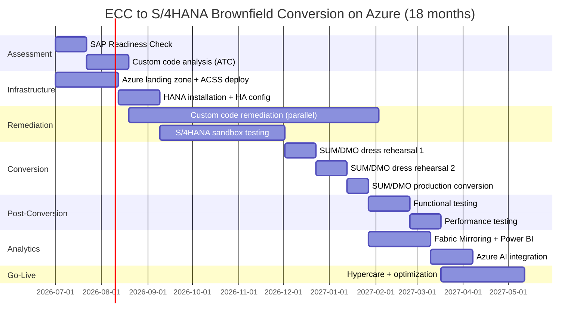

# SAP ECC to S/4HANA Conversion on Azure

**Brownfield, greenfield, and selective data transition approaches for converting SAP ECC to S/4HANA on Azure infrastructure.**

---

!!! danger "2027 Deadline: Act Now"
SAP ECC 6.0 mainstream maintenance ends **December 31, 2027**. A brownfield conversion for a mid-size enterprise typically takes 12--18 months. Starting after mid-2026 leaves no margin for dress rehearsals, testing, or unexpected issues. The time to begin is now.

## Overview

S/4HANA conversion is not a database migration --- it is a functional transformation of the SAP system. Data models change (BSEG to ACDOCA, MATDOC replaces multiple material movement tables, business partner replaces customer/vendor master), custom code must adapt, and business processes may need re-validation. This guide covers the three conversion approaches and how Azure infrastructure supports each.

---

## 1. Conversion approaches compared

| Dimension               | Brownfield (system conversion)             | Greenfield (new implementation)             | Selective data transition (shell conversion)    |
| ----------------------- | ------------------------------------------ | ------------------------------------------- | ----------------------------------------------- |
| **Approach**            | Convert existing ECC system in-place       | Deploy new S/4HANA, re-implement processes  | New S/4HANA shell, selectively migrate data     |
| **Data**                | All historical data preserved              | Only master data + opening balances         | Selected transaction history transferred        |
| **Customizations**      | Must remediate all custom code             | Start clean; re-evaluate each customization | Selectively bring forward customizations        |
| **Business disruption** | Lower (familiar system)                    | Higher (new system, new UX)                 | Medium                                          |
| **Timeline**            | 12--24 months                              | 9--18 months                                | 12--18 months                                   |
| **Cost**                | Medium                                     | High (re-implementation)                    | Medium--High                                    |
| **Risk**                | Technical (custom code complexity)         | Organizational (change management)          | Both                                            |
| **Best for**            | Heavy customization, must preserve history | Clean-slate transformation, Fit-to-Standard | Selective modernization, data archiving         |
| **SAP tool**            | SUM (Software Update Manager)              | SAP Activate methodology                    | SNP/Datavard CrystalBridge, SAP SNP (Bluefield) |

---

## 2. Brownfield conversion (system conversion)

### 2.1 Assessment phase

#### SAP Readiness Check

The SAP Readiness Check is a free SAP service that analyzes your ECC system and produces a detailed report on S/4HANA compatibility.

```
SAP Readiness Check Output:
├── Simplification Item Check
│   ├── Mandatory changes (must fix before conversion)
│   ├── Recommended changes (should fix)
│   └── Informational items
├── Custom Code Analysis
│   ├── Custom programs using deprecated APIs
│   ├── Custom programs affected by data model changes
│   └── Custom programs with hard-coded table references
├── Business Function Check
│   ├── Active business functions
│   └── S/4HANA compatibility of each function
├── Add-On Compatibility
│   ├── SAP add-ons installed
│   └── S/4HANA certified versions
└── Sizing Check
    ├── Current HANA memory usage
    └── Estimated S/4HANA HANA memory requirement
```

#### ABAP Test Cockpit (ATC)

```abap
" Run ATC checks against S/4HANA check variant
" Transaction: ATC
" Check Variant: S4HANA_READINESS_REMOTE or S4HANA_READINESS_2023

" Common findings:
" 1. SELECT on BSEG (replaced by ACDOCA in S/4HANA)
" 2. Direct access to MKPF/MSEG (replaced by MATDOC)
" 3. Customer/vendor master (KNA1/LFA1 → Business Partner)
" 4. Use of deprecated function modules
" 5. Hard-coded table names for removed/renamed tables
```

#### Custom code remediation effort estimation

| ATC finding category                  | Typical count (mid-size ECC) | Effort per finding | Total effort            |
| ------------------------------------- | ---------------------------- | ------------------ | ----------------------- |
| Critical (must fix before conversion) | 200--500                     | 2--8 hours         | 400--4,000 hours        |
| Recommended (fix for functionality)   | 500--2,000                   | 1--4 hours         | 500--8,000 hours        |
| Informational (optimize)              | 1,000--5,000                 | 0.5--2 hours       | 500--10,000 hours       |
| **Total custom code remediation**     |                              |                    | **1,400--22,000 hours** |

!!! tip "Start custom code remediation now"
Custom code remediation can begin **before** the S/4HANA conversion. Many changes (replacing deprecated function modules, using new APIs) are backward-compatible with ECC. Start remediation in your current ECC system to reduce the conversion-time workload.

### 2.2 Conversion execution with SUM

SUM (Software Update Manager) is the SAP tool that performs the system conversion. When combined with DMO (Database Migration Option), SUM can simultaneously convert the database to HANA and upgrade to S/4HANA.

#### SUM phases

| Phase           | Description               | Downtime? | Duration (2 TB DB) |
| --------------- | ------------------------- | --------- | ------------------ |
| DETECT          | Analyze source system     | No        | 30 min             |
| CHECK           | Validate prerequisites    | No        | 1--2 hours         |
| PREPROCESS      | Prepare shadow repository | No        | 2--4 hours         |
| SHADOW_IMPORT   | Import S/4HANA software   | No        | 4--8 hours         |
| SHADOW_MODACT   | Modify active repository  | No        | 2--4 hours         |
| SDB_TRANSFER    | Database migration (DMO)  | **Yes**   | 16--32 hours       |
| ACT_UPG         | Activate upgrade          | **Yes**   | 4--8 hours         |
| POST_PROCESSING | Post-processing steps     | **Yes**   | 2--4 hours         |

**Total downtime (typical):** 24--48 hours for a 2 TB database with DMO.

#### SUM with DMO on Azure

```bash
# Target HANA VM is already deployed on Azure (see infrastructure-migration.md)
# SUM runs on the source system and connects to target HANA on Azure

# Key SUM parameters for Azure deployment
# MIGKEY=DMO_OPTION
# TARGET_HOST=<azure-hana-hostname>
# TARGET_INSTANCE=00
# TARGET_DB_TYPE=HDB  (HANA)
# SOURCE_DB_TYPE=ORA|DB6|MSS|ADA  (source database)
# MAX_PROCESSES=20  (parallelism for data migration)

# Start SUM
cd /usr/sap/<SID>/SUM
./STARTUP confighostagent
# Follow SUM GUI wizard
```

### 2.3 Data model changes in S/4HANA

Key data model changes that affect custom code and reports:

| ECC table/structure        | S/4HANA replacement        | Impact                               |
| -------------------------- | -------------------------- | ------------------------------------ |
| BSEG (FI line items)       | ACDOCA (Universal Journal) | All custom FI reports need updating  |
| BKPF + BSEG                | BKPF + ACDOCA              | Journal entry access pattern changes |
| COEP (CO line items)       | ACDOCA                     | CO and FI merged into single table   |
| MKPF + MSEG (material doc) | MATDOC                     | Material movement reporting changes  |
| KNA1 (customer master)     | BUT000 (Business Partner)  | Customer master access changes       |
| LFA1 (vendor master)       | BUT000 (Business Partner)  | Vendor master access changes         |
| VBRK + VBRP (billing)      | Simplified structures      | Billing document access changes      |
| LIKP + LIPS (delivery)     | Simplified structures      | Delivery document access changes     |
| Credit management tables   | UDM\_\* tables             | New credit management data model     |

### 2.4 Downtime optimization

| Technique                           | Reduction | Description                                                     |
| ----------------------------------- | --------- | --------------------------------------------------------------- |
| Near-Zero Downtime (NZDT)           | 80--95%   | SAP NZDT uses trigger-based replication; requires S/4HANA 2020+ |
| Pre-copy of time-independent tables | 30--50%   | Migrate static/history tables before cutover window             |
| Parallel migration streams          | 20--40%   | Increase MAX_PROCESSES in SUM                                   |
| Table splitting                     | 10--20%   | Split large tables across parallel streams                      |
| ExpressRoute (10 Gbps)              | 10--30%   | High-bandwidth connection between on-prem and Azure             |

---

## 3. Greenfield implementation (new S/4HANA)

### 3.1 SAP Activate methodology

Greenfield S/4HANA implementations follow SAP Activate:

| Phase        | Activities                                  | Duration     | Azure activities                        |
| ------------ | ------------------------------------------- | ------------ | --------------------------------------- |
| **Discover** | Fit-to-Standard workshops, scope definition | 4--6 weeks   | Azure landing zone design               |
| **Prepare**  | Project setup, environment provisioning     | 2--4 weeks   | ACSS deployment, CSA-in-a-Box DMLZ      |
| **Explore**  | Process configuration, gap analysis         | 8--12 weeks  | Configure HANA HA, networking           |
| **Realize**  | Build, configure, unit test                 | 12--16 weeks | Integration testing with Azure services |
| **Deploy**   | Data migration, end-user training, cutover  | 6--8 weeks   | Go-live, Fabric Mirroring setup         |
| **Run**      | Hypercare, optimization                     | Ongoing      | Monitor with ACSS, optimize costs       |

### 3.2 Deploy S/4HANA on Azure with ACSS

```bash
# Deploy S/4HANA using Azure Center for SAP Solutions
az workloads sap-virtual-instance create \
  --resource-group rg-sap-prod \
  --name S4H-PRD \
  --environment Production \
  --sap-product S4HANA \
  --location eastus2 \
  --configuration @sap-deployment-config.json
```

### 3.3 Data migration for greenfield

| Data category                            | Migration tool                 | Approach                                            |
| ---------------------------------------- | ------------------------------ | --------------------------------------------------- |
| Master data (customer, vendor, material) | S/4HANA Migration Cockpit      | Standard migration objects; map to Business Partner |
| Opening balances (FI)                    | S/4HANA Migration Cockpit      | Load to Universal Journal (ACDOCA)                  |
| Open items (AP/AR)                       | S/4HANA Migration Cockpit      | Open invoices, payments                             |
| Purchase orders (open)                   | S/4HANA Migration Cockpit      | Open POs only; closed POs archived                  |
| Sales orders (open)                      | S/4HANA Migration Cockpit      | Open SOs only                                       |
| Historical transactions                  | Custom ADF pipelines to Fabric | Archive historical data in OneLake for reporting    |
| BW data                                  | Fabric Lakehouse               | Migrate InfoProviders to Fabric Delta tables        |

---

## 4. Selective data transition (shell conversion)

Selective data transition (also called "shell conversion" or "bluefield") combines elements of brownfield and greenfield. A new S/4HANA shell is deployed, and selected data is migrated from the source ECC system.

### When to choose selective data transition

- You want a clean S/4HANA system but need specific historical data
- You are consolidating multiple ECC systems into one S/4HANA
- You want to archive old data while keeping recent transactions
- You need to restructure the organizational model (company codes, plants)

### Tools for selective data transition

| Tool                          | Vendor                | Approach                                                |
| ----------------------------- | --------------------- | ------------------------------------------------------- |
| SNP CrystalBridge             | SNP (acquired by SAP) | Automated selective data transfer with transformation   |
| Datavard Bluefield            | Datavard              | Shell conversion with selective data migration          |
| SAP S/4HANA Migration Cockpit | SAP                   | Standard migration objects for master data + open items |
| Custom LSMW/BDC programs      | Custom                | Legacy data migration for specific datasets             |

---

## 5. CSA-in-a-Box integration during conversion

### During conversion: parallel analytics

While the S/4HANA conversion is in progress, CSA-in-a-Box can provide business continuity for analytics:

1. **Extract from source ECC** using ADF SAP Table connector
2. **Build Fabric Lakehouse** with ECC data in Delta tables
3. **Create Power BI reports** against Fabric data
4. **Cut over analytics** to Fabric Mirroring after S/4HANA go-live

### After conversion: full integration

1. **Configure Fabric Mirroring** for S/4HANA HANA
2. **Build dbt models** against S/4HANA data model (ACDOCA, MATDOC, Business Partner)
3. **Deploy Power BI semantic models** for finance, supply chain, procurement
4. **Enable Azure AI** for process intelligence on S/4HANA data

---

## 6. Conversion timeline



---

## 6. Post-conversion validation checklist

After S/4HANA conversion, systematically validate every functional area before go-live.

### Technical validation

| Check                        | Transaction/tool            | Expected result                |
| ---------------------------- | --------------------------- | ------------------------------ |
| HANA database consistency    | `hdbcons 'check table all'` | No inconsistencies             |
| ABAP syntax check            | SE80 → Check all programs   | No syntax errors               |
| ABAP dump analysis           | ST22                        | No new dumps                   |
| System log                   | SM21                        | No critical errors             |
| Short dumps since conversion | ST22 → filter by date       | Zero post-conversion dumps     |
| Transport consistency        | STMS → Import queue         | All transports imported        |
| Unicode consistency          | SE63 → Translation check    | No encoding issues             |
| Table space utilization      | DB02                        | No tables exceeding thresholds |
| Authorization consistency    | SU53 → Check failed auths   | No unexpected auth failures    |

### Functional validation (by module)

| Module                         | Key transactions to test    | Critical business processes                         |
| ------------------------------ | --------------------------- | --------------------------------------------------- |
| FI (Finance)                   | FB01, F-02, FK10N, FS10N    | GL posting, AP payment, AR billing                  |
| CO (Controlling)               | KB21N, KSB1, S_ALR_87013611 | Cost center postings, cost allocation               |
| MM (Materials Management)      | ME21N, MIGO, MIRO           | Purchase order, goods receipt, invoice verification |
| SD (Sales & Distribution)      | VA01, VL01N, VF01           | Sales order, delivery, billing                      |
| PP (Production Planning)       | CO01, CO11N, CO15           | Production order, confirmation, goods receipt       |
| HCM (Human Capital Management) | PA30, PT60, PC00_M99_CIPE   | Personnel master, time, payroll                     |
| PM (Plant Maintenance)         | IW31, IW32, IW41            | Maintenance order, notification, confirmation       |
| WM (Warehouse Management)      | LT01, LT02, LT03            | Transfer order, picking, putaway                    |

### S/4HANA-specific validation

| Check                      | Description                                       | Transaction |
| -------------------------- | ------------------------------------------------- | ----------- |
| Business Partner migration | Verify customer/vendor → Business Partner mapping | BP          |
| Universal Journal          | Verify ACDOCA entries match legacy BSEG/COEP      | FAGLL03     |
| Material Document          | Verify MATDOC entries match legacy MKPF/MSEG      | MB51        |
| Simplified data model      | Confirm deprecated tables are empty/disabled      | SE16N       |
| Fiori apps activation      | Verify Fiori launchpad loads correctly            | /UI2/FLP    |
| Output management          | Verify forms and output determination             | SP01, NACE  |

---

## 7. Common issues and troubleshooting

| Issue                         | Cause                                           | Resolution                                                  |
| ----------------------------- | ----------------------------------------------- | ----------------------------------------------------------- |
| ABAP dump: `TABLE_NOT_EXIST`  | Custom program references removed/renamed table | Update custom code to use S/4HANA table names               |
| Fiori app error: `HTTP 403`   | Missing ICF service or authorization            | Activate ICF services via SICF; assign Fiori catalog roles  |
| Business Partner gaps         | Customer/vendor not migrated to BP              | Run BP migration programs (BUPA_UPGRADE_CUSTOMER/VENDOR)    |
| Performance regression        | Indexes missing after conversion                | Rebuild secondary indexes; run HANA SQL plan cache analysis |
| Output management failures    | Form changes in S/4HANA output                  | Update output determination and form assignments            |
| Custom transaction errors     | Deprecated function module calls                | Replace with S/4HANA-compatible APIs (released APIs)        |
| Lock conflicts during cutover | Open transactions during SUM migration          | Ensure all users logged off; close all open transactions    |

---

## 8. Risk mitigation strategies

| Risk                                   | Mitigation                                                  | Contingency                                                    |
| -------------------------------------- | ----------------------------------------------------------- | -------------------------------------------------------------- |
| Conversion exceeds downtime window     | Optimize DMO parallelism; use NZDT for 80%+ reduction       | Extend maintenance window; notify business users               |
| Custom code breaks in S/4HANA          | Start ATC remediation 12+ months before conversion          | Prioritize critical programs; disable non-critical custom code |
| Data integrity issues after conversion | Run pre-conversion data consistency checks                  | Restore from pre-conversion backup; investigate and fix        |
| Integration failures (PI/PO)           | Test all interfaces in QAS before production cutover        | Fall back to manual processes; fix interfaces incrementally    |
| User adoption resistance               | Early change management; Fiori training                     | Provide SAP GUI as fallback; phase Fiori adoption              |
| Performance degradation                | Size Azure VMs with 20% headroom; test with production data | Scale up VM size; optimize HANA indexes and SQL                |

---

**Last updated:** 2026-04-30
**Maintainers:** CSA-in-a-Box core team
**Related:** [HANA Migration](hana-migration.md) | [Infrastructure Migration](infrastructure-migration.md) | [Feature Mapping](feature-mapping-complete.md)
