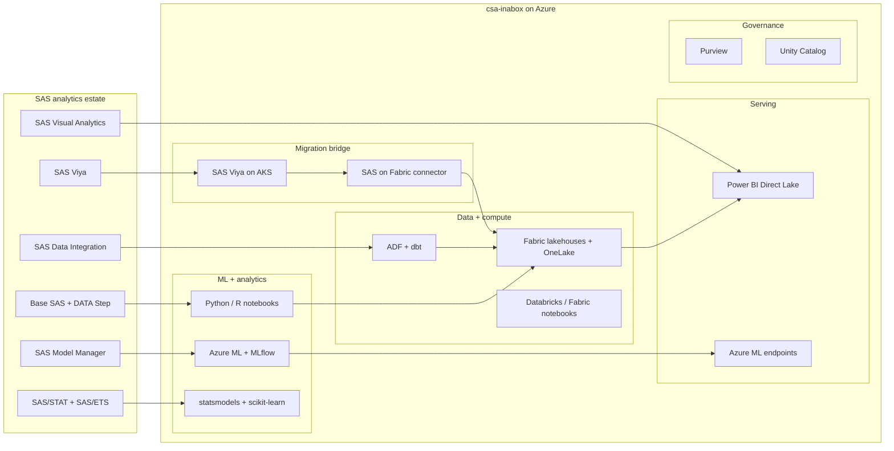

# Migrating from SAS to Azure ML / Fabric on csa-inabox

**Status:** Authored 2026-04-30
**Audience:** Federal CIO / CDO / Chief Analytics Officer / Statistical Program Director running a SAS estate (Base SAS, SAS/STAT, SAS/ETS, SAS Viya, SAS Visual Analytics, SAS Data Integration) and evaluating Azure-native alternatives --- Azure ML, Microsoft Fabric, Databricks, Power BI --- or a hybrid coexistence with SAS on Azure.
**Scope:** The full SAS analytics estate: Base SAS + SAS/STAT + SAS/ETS + SAS Visual Analytics + SAS Viya + SAS Data Integration Studio + SAS Model Manager + SAS Enterprise Guide. Covers lift-and-shift (SAS on Azure), full replacement (Azure ML + Fabric), and hybrid coexistence.

---

!!! tip "Expanded Migration Center Available"
This playbook is the core migration reference. For the complete SAS-to-Azure migration package --- including white papers, deep-dive guides, tutorials, benchmarks, and federal-specific guidance --- visit the **[SAS to Azure Migration Center](sas-to-azure/index.md)**.

    **Quick links:**

    - [Why Azure over SAS (Executive Brief)](sas-to-azure/why-azure-over-sas.md)
    - [Total Cost of Ownership Analysis](sas-to-azure/tco-analysis.md)
    - [Complete Feature Mapping (40+ features)](sas-to-azure/feature-mapping-complete.md)
    - [Federal Migration Guide](sas-to-azure/federal-migration-guide.md)
    - [Tutorials & Walkthroughs](sas-to-azure/index.md#tutorials)
    - [Benchmarks & Performance](sas-to-azure/benchmarks.md)
    - [Best Practices](sas-to-azure/best-practices.md)

## 1. Executive summary

SAS Institute generates over $3B in annual revenue and counts most Fortune 500 companies and the majority of US federal statistical agencies as customers. SAS is deeply embedded in federal analytics --- the FDA runs drug-safety signal detection on SAS, the Census Bureau processes decennial data with SAS, the CDC tracks disease surveillance with SAS, the VA models veteran health outcomes, and DoD uses SAS for logistics and readiness analytics.

The migration landscape changed materially in late 2025 and early 2026. SAS and Microsoft deepened their partnership with **SAS on Fabric** (December 2025), enabling SAS Viya workloads to read and write directly to Fabric OneLake lakehouses. In January 2026, **SAS Viya became available on Azure Government**, achieving FedRAMP High authorization and opening a lift-and-shift path for federal SAS workloads that previously required on-premises deployment.

csa-inabox on Azure provides the **unified analytics landing zone** that replaces or augments SAS capabilities across three vectors:

- **Microsoft Fabric** replaces SAS Data Integration for data engineering and data management
- **Azure ML + Databricks** replaces SAS/STAT, SAS/ETS, and SAS Model Manager for statistical modeling and MLOps
- **Power BI** replaces SAS Visual Analytics for reporting and self-service analytics

This playbook is honest. SAS has 48 years of statistical procedure development and domain-specific libraries (clinical trials, actuarial, econometrics) that have no direct open-source equivalent. The migration calculus depends heavily on which SAS products are in use and how deeply custom SAS macro libraries are embedded. For organizations using Base SAS + SAS/STAT for general-purpose analytics, the migration is straightforward. For organizations using SAS Drug Development, SAS Clinical Trial Data Transparency, or SAS Risk Management for Banking, the specialized domain libraries require careful gap analysis.

### Strategic decision: three migration paths

| Path                               | Description                                                                                                            | Best for                                                                                                                          | Timeline      |
| ---------------------------------- | ---------------------------------------------------------------------------------------------------------------------- | --------------------------------------------------------------------------------------------------------------------------------- | ------------- |
| **Lift-and-shift**                 | Deploy SAS Viya on AKS in Azure Gov; keep SAS programs unchanged                                                       | Agencies with regulatory mandates requiring SAS output format, heavy SAS macro investment, or immediate data-center exit timeline | 3--6 months   |
| **Replace with Azure ML / Fabric** | Rewrite SAS programs in Python/R; deploy on Azure ML + Fabric + Power BI                                               | Organizations seeking cost reduction, open-source flexibility, AI/GenAI integration, or talent pool expansion                     | 12--24 months |
| **Hybrid coexistence**             | SAS Viya on Azure reads/writes Fabric lakehouses; new workloads built on Azure ML; SAS programs migrated incrementally | Most federal agencies --- preserves existing SAS investment while building toward Azure-native                                    | 6--18 months  |

---

## 2. Capability mapping --- SAS to csa-inabox

### 2.1 Data management

| SAS capability                  | csa-inabox equivalent                                  | Mapping notes                                                                                                                | Effort |
| ------------------------------- | ------------------------------------------------------ | ---------------------------------------------------------------------------------------------------------------------------- | ------ |
| SAS DATA Step                   | Python/PySpark in Fabric notebooks or Databricks       | DATA Step row-by-row logic maps to pandas/PySpark transforms; most DATA Steps rewrite cleanly to SQL or DataFrame operations | M      |
| SAS PROC SQL                    | Spark SQL / dbt SQL models / Fabric SQL endpoint       | Direct SQL-to-SQL port; SAS SQL extensions (INTO :macro_var, CALCULATED) require minor adjustments                           | S      |
| SAS Libnames (data connections) | Fabric lakehouses + ADLS Gen2 + Unity Catalog          | LIBNAME statements pointing to SAS datasets become lakehouse table references; SAS7BDAT files convert to Delta tables        | M      |
| SAS Formats / Informats         | dbt seed tables / lookup tables / Delta reference data | User-defined formats become lookup joins; standard SAS formats (date, currency) map to Python/Spark formatting               | S      |
| SAS Data Integration Studio     | ADF + dbt + Fabric Data Pipelines                      | ETL jobs port to ADF pipelines orchestrating dbt models; visual data-flow designer maps to ADF data flows                    | L      |
| SAS Enterprise Guide projects   | Fabric notebooks + Power BI reports                    | Point-and-click analytics become notebook-driven workflows with Power BI for visualization                                   | M      |
| SAS Macro language              | Python functions + Jinja templates in dbt              | `%MACRO` / `%MEND` become Python def/class; `&macro_var` references become f-strings or dbt `{{ var() }}`                    | M      |
| SAS PROC SORT                   | DataFrame `.sort_values()` / Spark `.orderBy()`        | Trivial port; most PROC SORT + BY-group processing simplifies to GROUP BY in SQL                                             | XS     |

### 2.2 Statistical analysis

| SAS procedure                   | csa-inabox equivalent                                           | Mapping notes                                                              | Effort |
| ------------------------------- | --------------------------------------------------------------- | -------------------------------------------------------------------------- | ------ |
| PROC MEANS / SUMMARY            | `df.describe()` / `df.agg()` in pandas/PySpark                  | Direct mapping; CLASS statement maps to `.groupby()`                       | XS     |
| PROC FREQ                       | `pd.crosstab()` / `value_counts()`                              | Chi-square tests via `scipy.stats.chi2_contingency()`                      | XS     |
| PROC UNIVARIATE                 | `scipy.stats.describe()` + `matplotlib` histograms              | Percentiles, normality tests, distribution fitting all available in scipy  | S      |
| PROC REG                        | `sklearn.linear_model.LinearRegression` / `statsmodels.OLS`     | statsmodels provides SAS-equivalent diagnostics (R-squared, VIF, Cook's D) | S      |
| PROC LOGISTIC                   | `sklearn.linear_model.LogisticRegression` / `statsmodels.Logit` | Concordance, Hosmer-Lemeshow via statsmodels; ROC curves via sklearn       | S      |
| PROC GLM / MIXED                | `statsmodels.MixedLM` / `statsmodels.GLM`                       | Mixed models, ANOVA, repeated measures available in statsmodels            | M      |
| PROC ARIMA / ETS                | `statsmodels.tsa` / `pmdarima` / `prophet`                      | Full ARIMA, exponential smoothing, seasonal decomposition                  | M      |
| PROC SURVEYSELECT / SURVEYMEANS | `samplics` / custom Python                                      | Complex survey designs require the `samplics` package or `svy` in R        | M      |

### 2.3 Reporting and visualization

| SAS capability               | csa-inabox equivalent                            | Mapping notes                                                                                                                      | Effort |
| ---------------------------- | ------------------------------------------------ | ---------------------------------------------------------------------------------------------------------------------------------- | ------ |
| SAS Visual Analytics         | Power BI + Direct Lake                           | Interactive dashboards, drill-downs, geographic maps all available in Power BI; Direct Lake semantic models over Fabric lakehouses | M      |
| ODS (Output Delivery System) | Fabric notebooks + Power BI paginated reports    | ODS HTML/PDF/RTF output maps to notebook exports or paginated report rendering                                                     | M      |
| SAS/GRAPH                    | matplotlib / plotly / seaborn / Power BI visuals | All SAS/GRAPH chart types have equivalents; plotly adds interactivity                                                              | S      |
| SAS Stored Processes         | Power BI paginated reports + ADF pipelines       | Parameterized reports become Power BI paginated reports; batch outputs become ADF pipeline artifacts                               | M      |

---

## 3. Reference architecture



---

## 4. Worked migration example --- PROC LOGISTIC to scikit-learn

### 4.1 Starting state (SAS)

```sas
/* Logistic regression: predict loan default */
proc logistic data=loans.portfolio descending;
  class credit_grade (ref='A') region (ref='East') / param=ref;
  model default_flag = credit_grade region debt_to_income
                       loan_amount credit_score
                       / selection=stepwise slentry=0.05 slstay=0.10
                         lackfit rsquare stb;
  output out=loans.scored p=pred_prob;
run;
```

### 4.2 Target state (Python on Fabric notebook)

```python
import pandas as pd
from sklearn.linear_model import LogisticRegression
from sklearn.model_selection import train_test_split
from sklearn.metrics import roc_auc_score, classification_report
from sklearn.preprocessing import OneHotEncoder
from sklearn.compose import ColumnTransformer
from sklearn.pipeline import Pipeline
import mlflow

# Read from Fabric lakehouse
df = spark.sql("SELECT * FROM loans.portfolio").toPandas()

# Feature engineering (replaces CLASS statement)
categorical = ['credit_grade', 'region']
numeric = ['debt_to_income', 'loan_amount', 'credit_score']

preprocessor = ColumnTransformer([
    ('cat', OneHotEncoder(drop='first'), categorical),
    ('num', 'passthrough', numeric)
])

pipeline = Pipeline([
    ('prep', preprocessor),
    ('model', LogisticRegression(max_iter=1000, solver='lbfgs'))
])

X = df[categorical + numeric]
y = df['default_flag']
X_train, X_test, y_train, y_test = train_test_split(X, y, test_size=0.3, random_state=42)

# Train with MLflow tracking (replaces SAS Model Manager)
with mlflow.start_run(run_name="loan_default_logistic"):
    pipeline.fit(X_train, y_train)
    y_pred_prob = pipeline.predict_proba(X_test)[:, 1]
    auc = roc_auc_score(y_test, y_pred_prob)
    mlflow.log_metric("auc", auc)
    mlflow.sklearn.log_model(pipeline, "model")

# Score full dataset (replaces OUTPUT statement)
df['pred_prob'] = pipeline.predict_proba(X)[:, 1]
spark.createDataFrame(df).write.mode("overwrite").saveAsTable("loans.scored")
```

### 4.3 Validation

Reconcile SAS and Python outputs:

- AUC difference must be less than 0.01
- Concordance/discordance percentages within 0.5%
- Predicted probabilities: mean absolute difference less than 0.005 across all observations
- Coefficient signs and significance must match

---

## 5. Migration sequence (phased project plan)

A SAS-to-Azure migration for a mid-size federal agency with 50--200 SAS programs typically runs 36--52 weeks.

### Phase 0 --- Discovery (Weeks 1--4)

- Inventory all SAS programs, datasets, macro libraries, formats, and scheduled jobs
- Catalog SAS product licenses: Base, STAT, ETS, OR, VA, Viya, Grid, Model Manager
- Map data flows: SAS libnames, file paths, database connections (Oracle, SQL Server, Teradata)
- Identify regulatory constraints: programs requiring SAS output formats (e.g., FDA CDISC submissions)
- Classify each program: replace (Python), lift-and-shift (SAS on Azure), or retire

### Phase 1 --- Landing zone + bridge (Weeks 5--10)

- Deploy csa-inabox Data Management Landing Zone via Bicep
- Provision SAS Viya on AKS for programs staying on SAS (if applicable)
- Configure SAS on Fabric connector for lakehouse access
- Migrate SAS datasets (SAS7BDAT) to Delta tables in Fabric lakehouses
- Stand up Azure ML workspace with MLflow tracking

### Phase 2 --- Pilot domain (Weeks 10--20)

- Select one analytical domain (e.g., reporting, descriptive statistics)
- Rewrite 5--10 SAS programs in Python notebooks on Fabric
- Dual-run SAS and Python for 2--4 weeks; reconcile outputs
- Deploy Power BI reports replacing SAS VA dashboards
- Validate with subject-matter experts

### Phase 3 --- Statistical programs (Weeks 16--32)

- Migrate PROC REG/LOGISTIC/GLM programs to scikit-learn/statsmodels
- Port SAS macro libraries to Python function libraries
- Register models in MLflow; deploy scoring endpoints on Azure ML
- Migrate SAS Model Manager champion/challenger workflows to MLflow

### Phase 4 --- Data integration (Weeks 24--40)

- Port SAS Data Integration Studio jobs to ADF + dbt
- Migrate SAS format catalogs to dbt seed tables
- Replace SAS scheduling (Platform LSF / SAS Management Console) with ADF triggers

### Phase 5 --- Reporting + decommission (Weeks 36--52)

- Migrate remaining SAS VA reports to Power BI
- Final reconciliation of all migrated programs
- Decommission SAS servers / terminate SAS licenses
- Document lessons learned; update runbooks

---

## 6. Federal compliance considerations

- **FedRAMP High:** Azure Government inherits FedRAMP High; SAS Viya on Azure Gov achieved FedRAMP High in January 2026, so both paths (replace or lift-and-shift) are compliant
- **FISMA:** Analytics platforms must be included in agency System Security Plans (SSP); Azure Gov + csa-inabox controls map to `csa_platform/csa_platform/governance/compliance/nist-800-53-rev5.yaml`
- **FDA 21 CFR Part 11:** Electronic records and signatures; validated Python environments on Azure ML can meet Part 11 requirements with proper IQ/OQ/PQ documentation
- **Census Title 13:** Data confidentiality for Census Bureau; statistical disclosure limitation algorithms port from SAS to Python (sdcMicro equivalent in R, or custom Python)
- **CMMC 2.0 Level 2:** Controls mapped in `csa_platform/csa_platform/governance/compliance/cmmc-2.0-l2.yaml`
- **HIPAA:** For HHS/VA workloads; see `csa_platform/csa_platform/governance/compliance/hipaa-security-rule.yaml`
- **Section 508:** Power BI accessibility features meet Section 508 requirements for federal reporting

---

## 7. Cost comparison

Illustrative. A federal agency spending **$5M/year** on a SAS estate typically includes:

**Current SAS costs:**

- SAS software licenses (Base + STAT + ETS + VA + Viya): $2.5M--$3.5M
- SAS administrator FTEs (2--3): $300K--$500K
- On-premises infrastructure (servers, storage, network): $500K--$800K
- SAS consulting / professional services: $200K--$400K

**Target Azure costs:**

- Azure ML + Databricks compute: $400K--$800K
- Fabric capacity (F64/F128): $200K--$400K
- Power BI Premium: $100K--$200K
- Storage (ADLS Gen2 + OneLake): $50K--$150K
- Azure Monitor + Purview + Key Vault: $100K--$200K
- Python/R reskilling program (one-time): $200K--$400K
- Migration consulting (one-time): $500K--$1M
- **Typical run-rate: $1.0M--$2.0M/year** (55--70% savings at steady state)

The one-time migration cost ($700K--$1.4M) typically pays back within 12--18 months from license savings alone. The reskilling investment opens access to a talent pool roughly 20x larger than the SAS-certified workforce.

---

## 8. Gaps and roadmap

| Gap                              | Description                                                                         | Planned remediation                                                                                  |
| -------------------------------- | ----------------------------------------------------------------------------------- | ---------------------------------------------------------------------------------------------------- |
| **SAS clinical trial libraries** | SAS Drug Development, CDISC-compliant outputs have no direct open-source equivalent | Use SAS Viya on Azure for regulatory submissions; build Python wrappers for CDISC datasets over time |
| **Complex survey procedures**    | PROC SURVEYSELECT / SURVEYREG / SURVEYMEANS have limited Python equivalents         | R `survey` package or Python `samplics`; some agencies keep SAS for survey work                      |
| **SAS Hash Objects**             | High-performance in-memory lookups; no direct pandas equivalent at scale            | PySpark broadcast joins or Delta table lookups; acceptable for most use cases                        |
| **Validated SAS environments**   | Some agencies have IQ/OQ/PQ-validated SAS installations for regulatory compliance   | Azure ML validated environments with documented qualification protocols                              |
| **PROC OPTMODEL / OR**           | Operations research procedures; limited open-source equivalent                      | PuLP, OR-Tools, or Gurobi on Azure; SAS/OR stays on Viya for complex optimization                    |

---

## 9. Competitive framing

### Where SAS wins today

- **48 years of statistical procedures.** Domain-specific libraries for clinical trials, actuarial science, credit scoring, and survey statistics are unmatched in depth
- **Regulatory acceptance.** FDA, EMA, and other regulators accept SAS output formats directly; Python outputs require additional validation documentation
- **Enterprise support.** Single vendor for software, training, and consulting; 24/7 global support organization
- **SAS on Fabric.** The December 2025 integration lets SAS Viya read/write OneLake lakehouses, reducing the urgency of a full replacement

### Where csa-inabox wins today

- **Cost.** 55--70% lower run-rate costs after migration; consumption-based pricing vs annual site licenses
- **Talent.** Python developers outnumber SAS programmers approximately 20:1; federal hiring is easier
- **AI/GenAI integration.** Azure OpenAI, AI Foundry, Copilot integrate natively; SAS AI capabilities lag
- **Open-source ecosystem.** scikit-learn, statsmodels, TensorFlow, PyTorch, Hugging Face --- all available without additional licensing
- **Unified platform.** Data engineering + ML + BI on one platform vs separate SAS products for each

---

## 10. Related resources

- **Migration index:** [docs/migrations/README.md](README.md)
- **Companion playbooks:** [aws-to-azure.md](aws-to-azure.md), [informatica.md](informatica.md)
- **SAS Migration Center:** [sas-to-azure/index.md](sas-to-azure/index.md)
- **Decision trees:**
    - `docs/decisions/fabric-vs-databricks-vs-synapse.md`
    - `docs/decisions/batch-vs-streaming.md`
    - `docs/decisions/rag-vs-finetune-vs-agents.md`
- **ADRs:**
    - `docs/adr/0001-adf-dbt-over-airflow.md`
    - `docs/adr/0002-databricks-over-oss-spark.md`
    - `docs/adr/0010-fabric-strategic-target.md`
- **Compliance matrices:**
    - `docs/compliance/nist-800-53-rev5.md`
    - `docs/compliance/fedramp-moderate.md`
    - `docs/compliance/hipaa-security-rule.md`
- **Platform modules:**
    - `csa_platform/ai_integration/` --- AI Foundry / Azure OpenAI
    - `csa_platform/unity_catalog_pattern/` --- Catalog + governance
    - `csa_platform/data_marketplace/` --- Data-product registry

---

**Maintainers:** csa-inabox core team
**Last updated:** 2026-04-30
