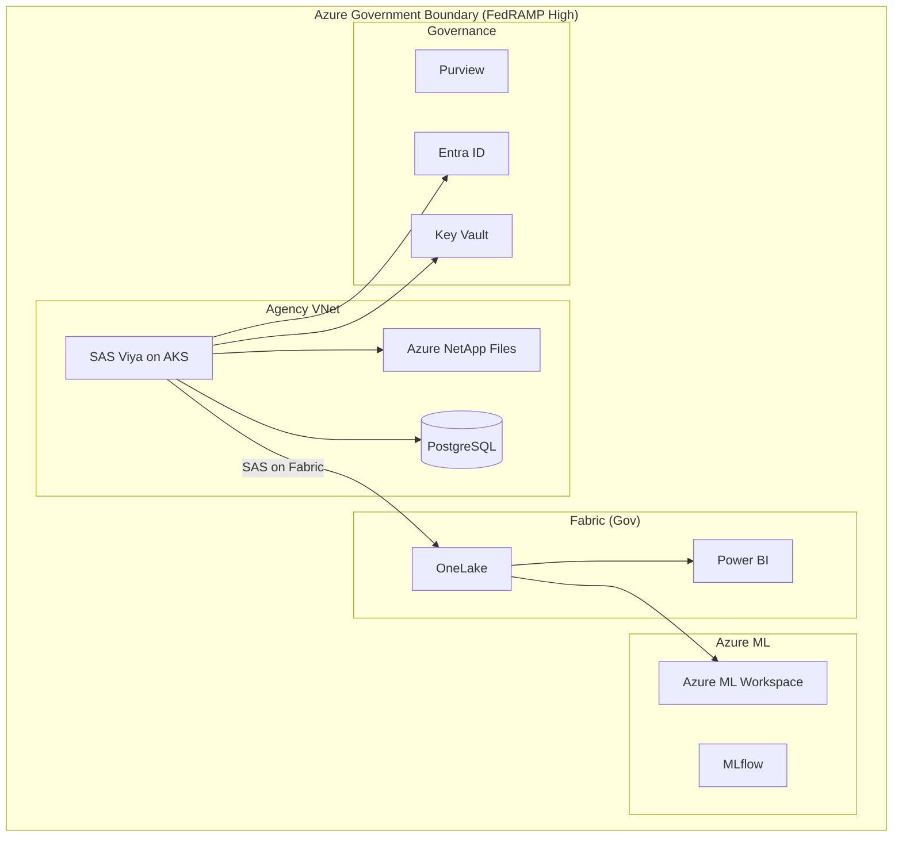

# SAS in Federal Government: Migration Guide

**Audience:** Federal CIOs, CDOs, Agency Analytics Directors, CISO/ISSO
**Purpose:** Federal-specific guidance for migrating SAS analytics workloads to Azure, including agency-specific considerations, FedRAMP compliance, SAS Viya on Azure Gov, and regulatory requirements for statistical agencies.

---

## 1. SAS in the federal landscape

SAS is more deeply embedded in the US federal government than in any other sector. The investment spans decades and touches the most critical statistical and analytical operations in government:

### 1.1 Agency SAS usage map

| Agency / Bureau                           | SAS usage                                                                           | Criticality | Migration complexity   |
| ----------------------------------------- | ----------------------------------------------------------------------------------- | ----------- | ---------------------- |
| **Census Bureau**                         | Decennial census processing, American Community Survey, economic census             | Critical    | Very High              |
| **Bureau of Labor Statistics**            | Employment statistics (CPS, CES, JOLTS), Consumer Price Index, Producer Price Index | Critical    | Very High              |
| **Bureau of Economic Analysis**           | GDP estimates, personal income, international trade                                 | Critical    | High                   |
| **National Center for Health Statistics** | National Health Interview Survey (NHIS), vital statistics, mortality data           | Critical    | High                   |
| **FDA / CBER / CDER**                     | Drug safety signal detection, adverse event analysis, CDISC submissions             | Critical    | Very High (regulatory) |
| **CDC**                                   | Disease surveillance, outbreak investigation, MMWR analysis                         | High        | High                   |
| **CMS**                                   | Medicare/Medicaid claims analysis, fraud detection, quality measures                | High        | High                   |
| **VA**                                    | Veteran health outcomes, disability claims analytics, patient safety                | High        | Medium                 |
| **DoD**                                   | Logistics analytics, readiness modeling, manpower planning                          | High        | Medium                 |
| **IRS**                                   | Tax compliance analytics, fraud detection, Discriminant Index Function              | Critical    | Very High              |
| **SSA**                                   | Disability claims analysis, actuarial projections, program integrity                | High        | High                   |
| **USDA / NASS**                           | Agricultural statistics, crop forecasting, Census of Agriculture                    | High        | High                   |
| **EPA**                                   | Environmental monitoring, risk assessment, compliance analytics                     | Medium      | Medium                 |
| **DOE / EIA**                             | Energy statistics, price forecasting, production analysis                           | Medium      | Medium                 |
| **HUD**                                   | Fair housing analysis, housing survey data, program evaluation                      | Medium      | Medium                 |
| **DOT / BTS**                             | Transportation statistics, safety analytics, traffic modeling                       | Medium      | Medium                 |
| **DOJ / BJS**                             | Crime statistics, justice system analysis, NIBRS data                               | Medium      | Medium                 |

### 1.2 Federal SAS spending estimate

| Category                              | Estimated annual spend | Notes                                                         |
| ------------------------------------- | ---------------------- | ------------------------------------------------------------- |
| SAS software licenses (all agencies)  | $150M--$300M           | Based on USASpending.gov contract data and industry estimates |
| SAS professional services             | $50M--$100M            | Implementation, training, consulting                          |
| SAS-specific infrastructure           | $100M--$200M           | Servers, storage, network dedicated to SAS workloads          |
| SAS administrator FTEs                | $50M--$100M            | Dedicated SAS admin roles across agencies                     |
| **Total estimated federal SAS spend** | **$350M--$700M**       | Annual                                                        |

---

## 2. SAS Viya on Azure Government

### 2.1 Authorization status (January 2026)

SAS Viya achieved FedRAMP High authorization on Azure Government in January 2026. This is a joint authorization --- SAS Viya running on Azure Government infrastructure inherits Azure Government's FedRAMP High P-ATO and adds SAS-specific controls.

| Compliance framework | Status            | Authorization boundary                                  |
| -------------------- | ----------------- | ------------------------------------------------------- |
| FedRAMP High         | **Authorized**    | SAS Viya on Azure Gov                                   |
| DoD IL4              | **Supported**     | Azure Gov IL4 regions                                   |
| DoD IL5              | **Supported**     | Azure Gov IL5 regions (US Gov Virginia, US Gov Arizona) |
| DoD IL6              | **Not supported** | Requires Azure Government Secret (limited)              |
| ITAR                 | **Supported**     | Azure Government tenant-binding                         |
| HIPAA                | **Supported**     | BAA available from both SAS and Microsoft               |
| CJIS                 | **Supported**     | Azure Government CJIS-compliant regions                 |
| IRS 1075             | **Supported**     | Azure Government with IRS 1075 safeguards               |
| CMMC 2.0 Level 2     | **Mapped**        | Controls mapped in csa-inabox compliance YAML           |
| Section 508          | **Compliant**     | SAS Studio and SAS VA meet VPAT requirements            |

### 2.2 Deployment regions

| Azure Gov region | SAS Viya support | Impact level | Notes                                                    |
| ---------------- | ---------------- | ------------ | -------------------------------------------------------- |
| US Gov Virginia  | Full support     | IL4, IL5     | Primary deployment region; broadest service availability |
| US Gov Arizona   | Full support     | IL4, IL5     | DR/secondary region                                      |
| US Gov Texas     | Contact SAS      | IL4          | Limited SAS Viya support; contact SAS account team       |
| US DoD Central   | Contact SAS      | IL5          | DoD-exclusive region                                     |
| US DoD East      | Contact SAS      | IL5          | DoD-exclusive region                                     |

### 2.3 Network architecture for Azure Gov

---

## 3. Compliance requirements by agency type

### 3.1 Statistical agencies (Census, BLS, BEA, NCHS, NASS)

Statistical agencies have the most complex migration requirements due to Title 13/26 confidentiality requirements and the need for statistical disclosure limitation.

| Requirement                           | SAS approach                                                                       | Azure approach                                                        | Gap analysis                                                                                                      |
| ------------------------------------- | ---------------------------------------------------------------------------------- | --------------------------------------------------------------------- | ----------------------------------------------------------------------------------------------------------------- |
| **Title 13 confidentiality** (Census) | SAS on isolated network; physical security controls                                | Azure Gov with CJIS + additional Census controls; FedRAMP High        | Azure Gov meets infrastructure requirements; Census-specific data handling procedures require operational mapping |
| **Title 26 / IRS 1075** (tax data)    | SAS on IRS-approved infrastructure                                                 | Azure Gov with IRS 1075 safeguards                                    | Supported; requires IRS approval of deployment architecture                                                       |
| **Statistical disclosure limitation** | SAS procedures + custom macros (cell suppression, noise injection, synthetic data) | Python `sdcMicro` (R) + custom Python; differential privacy libraries | SAS SDL macros must be re-implemented; R `sdcMicro` is the most mature alternative                                |
| **Reproducibility**                   | SAS program logs; version control of SAS code                                      | Git-versioned Python notebooks; MLflow experiment tracking            | Azure approach provides stronger reproducibility                                                                  |
| **Imputation (missing data)**         | PROC MI + PROC MIANALYZE                                                           | `sklearn.impute` + `fancyimpute` + `mice` (R)                         | Coverage at 95%; PROC MI's FCS method has direct Python equivalent                                                |
| **Survey weighting**                  | PROC SURVEYMEANS/SURVEYREG/SURVEYLOGISTIC                                          | R `survey` package / Python `samplics`                                | R `survey` at 95% parity; Python `samplics` at 85%                                                                |
| **Seasonal adjustment**               | SAS/ETS PROC X13 (X-13ARIMA-SEATS)                                                 | Python `statsmodels` + Census Bureau X-13 binary callable from Python | X-13 binary is open-source from Census; Python wrapper available                                                  |

**Recommendation for statistical agencies:** Hybrid approach. Keep SAS for Title 13/26 production systems during a 3--5 year transition. Build new capabilities on Azure. Migrate reporting and exploratory analysis first.

### 3.2 Regulatory agencies (FDA, SEC, CFPB)

| Requirement                 | SAS approach                         | Azure approach                                                | Gap analysis                                                                         |
| --------------------------- | ------------------------------------ | ------------------------------------------------------------- | ------------------------------------------------------------------------------------ |
| **FDA 21 CFR Part 11**      | IQ/OQ/PQ-validated SAS installation  | Azure ML with documented validation protocol                  | Python validated environments are accepted by FDA; requires validation documentation |
| **CDISC SDTM/ADaM**         | SAS Drug Development suite           | R `pharmaverse` (admiral, teal, rtables) + Python CDISC tools | R submissions accepted by FDA since 2023; Python tools maturing                      |
| **FDA submission packages** | SAS Transport (XPT) files            | R `haven` package generates XPT files                         | Direct equivalent; R-generated XPTs accepted by FDA                                  |
| **Audit trail**             | SAS metadata + SAS logs              | Azure Monitor + MLflow + Purview                              | Azure provides more comprehensive audit trail                                        |
| **Electronic signatures**   | SAS authentication + custom controls | Entra ID + Azure Key Vault                                    | Stronger cryptographic foundation on Azure                                           |

**Recommendation for regulatory agencies:** Maintain SAS for active FDA/SEC submissions. Build new analytical capabilities on Azure ML. Plan SAS phase-out over 3--5 years as R `pharmaverse` matures and FDA acceptance broadens.

### 3.3 Defense and intelligence (DoD, VA, DHS)

| Requirement                     | SAS approach                                 | Azure approach                                            | Gap analysis                                          |
| ------------------------------- | -------------------------------------------- | --------------------------------------------------------- | ----------------------------------------------------- |
| **IL4/IL5 processing**          | SAS on authorized on-premises infrastructure | SAS Viya on Azure Gov (IL4/IL5) or Azure ML on Azure Gov  | Both paths available since January 2026               |
| **CMMC 2.0**                    | Customer-managed SAS controls                | Controls mapped in csa-inabox `cmmc-2.0-l2.yaml`          | Azure provides better evidence automation             |
| **Cross-domain considerations** | SAS on isolated networks per classification  | Azure Gov per impact level; no cross-domain in csa-inabox | Cross-domain data transfer requires separate approval |
| **SCIF requirements**           | SAS in SCIF facilities                       | Not applicable to csa-inabox                              | Classified workloads out of scope                     |

**Recommendation for DoD:** Deploy SAS Viya on Azure Gov for unclassified analytics (IL4/IL5). Build new capabilities on Azure ML + Fabric. Classified analytics remain on-premises or on dedicated classified cloud.

### 3.4 Health agencies (HHS, CDC, VA, NIH)

| Requirement                         | SAS approach                          | Azure approach                                               | Gap analysis                                                                                     |
| ----------------------------------- | ------------------------------------- | ------------------------------------------------------------ | ------------------------------------------------------------------------------------------------ |
| **HIPAA Security Rule**             | SAS on HIPAA-compliant infrastructure | Azure Gov + BAA + csa-inabox HIPAA controls                  | Full HIPAA compliance on Azure; mapped in `hipaa-security-rule.yaml`                             |
| **42 CFR Part 2** (substance abuse) | SAS with data segmentation            | Azure RBAC + Purview classification + data-product contracts | Requires careful access control; Purview classification can automate Part 2 data identification  |
| **Clinical data analysis**          | SAS/STAT, SAS Drug Development        | Python + R + Azure ML                                        | General clinical analysis: high coverage. Regulatory submission: use R pharmaverse or retain SAS |

**Recommendation for health agencies:** Migrate reporting (SAS VA to Power BI) and data management (SAS DI to ADF/dbt) first. Retain SAS for clinical trial analysis. Deploy csa-inabox with HIPAA controls from `examples/tribal-health/` as a reference.

---

## 4. FISMA requirements for analytics platforms

Every federal analytics platform must be covered by a System Security Plan (SSP) under FISMA. When migrating from SAS to Azure, the analytics platform boundary changes:

### 4.1 System boundary changes

| FISMA element           | SAS (current)                       | Azure (target)                                     | Impact                                                                            |
| ----------------------- | ----------------------------------- | -------------------------------------------------- | --------------------------------------------------------------------------------- |
| System name             | "Agency Analytics Platform (SAS)"   | "Agency Analytics Platform (Azure)"                | SSP update required                                                               |
| Authorization boundary  | SAS servers, network, storage       | Azure subscription, VNet, services                 | ATO re-assessment (or addendum)                                                   |
| Security categorization | Typically FIPS 199 Moderate or High | Same categorization applies                        | No change to FIPS 199                                                             |
| Control inheritance     | Agency data center controls         | Azure Gov FedRAMP controls + agency controls       | More controls inherited from Azure; agency responsibility shifts to configuration |
| Continuous monitoring   | Agency-managed ConMon               | Azure Monitor + Defender for Cloud + agency ConMon | Azure provides stronger automated monitoring                                      |
| POA&M                   | SAS-specific findings               | Azure-specific findings                            | New POA&M items for Azure configuration                                           |

### 4.2 ATO timeline considerations

| ATO path              | Timeline     | When to choose                                                        |
| --------------------- | ------------ | --------------------------------------------------------------------- |
| SSP update / addendum | 3--6 months  | Minor system change; same data types; authorizing official agrees     |
| Reauthorization       | 6--12 months | Significant boundary change; new data types; new authorizing official |
| Reciprocity (FedRAMP) | 2--4 months  | Azure Gov FedRAMP P-ATO accepted; agency adds customer controls       |

**Recommendation:** Start the ATO conversation early (Phase 0 of migration). Engage the ISSO and authorizing official before technical deployment begins. Azure Gov's FedRAMP High P-ATO significantly reduces the control assessment burden.

---

## 5. Procurement guidance

### 5.1 SAS contract transition

Federal SAS contracts are typically structured as:

- **Enterprise Agreement (EA):** Multi-year (3--5 year) agreements with annual payments
- **GSA Schedule 70:** Per-product licensing through GSA
- **SEWP V:** Available through SEWP contracts
- **Blanket Purchase Agreement (BPA):** Agency-specific BPAs with SAS resellers

**Key actions for contract transition:**

1. **Review termination clauses.** Most SAS EAs require 12--24 months notice for non-renewal
2. **Negotiate step-down pricing.** As products are replaced, request reduced licensing for remaining products
3. **Avoid auto-renewal traps.** SAS EAs often auto-renew unless explicitly terminated within the notice window
4. **Document usage data.** SAS license audits can result in true-up charges; document actual usage to negotiate down
5. **Consider maintenance-only.** Some agencies can drop to maintenance-only (no new features) at 20--25% of license cost during migration

### 5.2 Azure procurement vehicles

| Vehicle                       | Best for                 | Discount level    | Notes                                        |
| ----------------------------- | ------------------------ | ----------------- | -------------------------------------------- |
| GSA Schedule 70               | Small-to-mid agencies    | 10--15%           | Standard catalog pricing                     |
| SEWP V                        | All agencies             | 15--20%           | Competitive pricing; NASA-managed            |
| Enterprise Agreement (EA)     | Large agencies           | 20--30%           | Requires $500K+ commitment; best pricing     |
| MACC                          | Large agencies with EA   | Additional 5--10% | Pre-committed Azure spend                    |
| CSP (Cloud Solution Provider) | Small agencies / offices | Varies            | Through Microsoft partners                   |
| Azure Government per-use      | Pilot / POC              | List price        | No commitment; good for proving the platform |

### 5.3 Budget planning

| Budget category       | Year 1 (migration)           | Year 2 (steady state) | Year 3+                 |
| --------------------- | ---------------------------- | --------------------- | ----------------------- |
| SAS licensing         | Full (contract still active) | Reduced 30--50%       | $0 or minimal retention |
| Azure consumption     | $300K--$800K                 | $400K--$1M            | $400K--$1M              |
| Migration consulting  | $500K--$1.5M                 | $100K--$300K          | $0                      |
| Reskilling            | $200K--$400K                 | $50K--$100K (ongoing) | $50K--$100K             |
| Dual-running overhead | $200K--$500K                 | $0                    | $0                      |
| **Total**             | **$1.2M--$3.2M + SAS**       | **$550K--$1.4M**      | **$450K--$1.1M**        |

---

## 6. Agency-specific migration playbooks

### 6.1 Statistical agency playbook (Census, BLS, BEA pattern)

| Phase                           | Duration      | Activities                                                                                                                                                         |
| ------------------------------- | ------------- | ------------------------------------------------------------------------------------------------------------------------------------------------------------------ |
| **Phase 0: Assessment**         | 3 months      | Inventory SAS programs, classify by criticality, identify Title 13/26 constraints, engage ISSO                                                                     |
| **Phase 1: Non-production**     | 6 months      | Deploy Azure Gov landing zone; migrate research/exploratory SAS programs to Python; validate with survey methodologists                                            |
| **Phase 2: Reporting**          | 6 months      | Migrate SAS VA dashboards to Power BI; migrate descriptive statistics programs; keep production surveys on SAS                                                     |
| **Phase 3: Data management**    | 6 months      | Migrate SAS DI ETL to ADF + dbt; migrate SAS dataset storage to Delta; SAS reads from Fabric via SAS on Fabric                                                     |
| **Phase 4: Production surveys** | 12--18 months | Migrate survey processing programs (high risk; requires extensive validation with survey statisticians); keep SDL macros on SAS until Python equivalents validated |
| **Phase 5: Optimization**       | Ongoing       | Reduce SAS licensing; decommission SAS servers; retain SAS for specialized survey procedures if needed                                                             |

### 6.2 Regulatory agency playbook (FDA, SEC pattern)

| Phase                                 | Duration   | Activities                                                                                                                  |
| ------------------------------------- | ---------- | --------------------------------------------------------------------------------------------------------------------------- |
| **Phase 0: Assessment**               | 2 months   | Inventory SAS programs; classify by regulatory dependency; identify 21 CFR Part 11 requirements                             |
| **Phase 1: Infrastructure**           | 3 months   | Deploy SAS Viya on Azure Gov (lift-and-shift for regulatory programs); deploy csa-inabox for new work                       |
| **Phase 2: Reporting + DM**           | 6 months   | Migrate SAS VA to Power BI; migrate SAS DI to ADF/dbt                                                                       |
| **Phase 3: Non-regulatory analytics** | 6 months   | Migrate general SAS/STAT programs to Python; deploy Azure ML for new models                                                 |
| **Phase 4: Regulatory evaluation**    | 12+ months | Evaluate R pharmaverse for CDISC submissions; plan SAS phase-out for regulatory programs based on FDA acceptance trajectory |

### 6.3 Defense agency playbook (DoD, DHS pattern)

| Phase                               | Duration     | Activities                                                                                              |
| ----------------------------------- | ------------ | ------------------------------------------------------------------------------------------------------- |
| **Phase 0: Assessment + ATO**       | 4 months     | Inventory SAS programs; initiate ATO process for Azure Gov analytics boundary; classify by impact level |
| **Phase 1: Unclassified analytics** | 6 months     | Deploy csa-inabox on Azure Gov (IL4/IL5); migrate unclassified SAS programs to Python/Fabric            |
| **Phase 2: Reporting**              | 4 months     | Migrate SAS VA to Power BI; deploy Direct Lake semantic models                                          |
| **Phase 3: ML/AI**                  | 6 months     | Deploy Azure ML for new models; migrate SAS Model Manager to MLflow; enable Azure OpenAI for NLP/GenAI  |
| **Phase 4: Remaining SAS**          | 6--12 months | Migrate remaining unclassified SAS programs; classified analytics remain on-premises                    |

---

## 7. Risk management

### 7.1 Migration risks specific to federal

| Risk                                     | Likelihood | Impact   | Mitigation                                                                                                       |
| ---------------------------------------- | ---------- | -------- | ---------------------------------------------------------------------------------------------------------------- |
| SAS contract lock-in (auto-renewal trap) | Medium     | High     | Review contract immediately; issue termination notice within required window                                     |
| ATO delay blocks migration               | High       | High     | Start ATO process in Phase 0; engage ISSO before technical work                                                  |
| Survey statistician resistance           | High       | Medium   | Involve statisticians early; demonstrate Python equivalence with their own data                                  |
| Title 13/26 data handling errors         | Low        | Critical | Implement Purview classification for PII/CUI; apply csa-inabox data contracts                                    |
| SAS output format required by regulation | Medium     | High     | Maintain SAS Viya on Azure for regulatory submissions; plan for R/Python acceptance                              |
| Python validation for 21 CFR Part 11     | Medium     | High     | Document IQ/OQ/PQ for Python environment; reference R Consortium FDA submission precedent                        |
| Budget uncertainty (CR/shutdown)         | Medium     | Medium   | Structure migration in independently valuable phases; each phase delivers value if subsequent phases are delayed |

### 7.2 Rollback plan

If migration fails or is paused:

1. **SAS Viya on Azure remains operational** --- programs continue running unchanged
2. **Data in Fabric lakehouses accessible to both SAS and Python** --- no data loss
3. **SAS licensing can be reinstated** --- contact SAS account team for relicensing
4. **Azure consumption can be scaled down** --- pause Fabric capacity, stop Azure ML compute
5. **Python notebooks preserved in Git** --- no code loss; resume migration when ready

---

## 8. Federal success patterns

### 8.1 What works

- **Start with Power BI** --- lowest risk, highest visibility, builds organizational confidence
- **Involve statisticians early** --- they are the domain experts; their buy-in is essential
- **Run dual systems for 3--6 months** --- prove Python output matches SAS before decommissioning
- **Use SAS on Fabric bridge** --- unifies data layer; allows incremental migration
- **Budget for reskilling** --- 4--8 weeks of Python training per SAS programmer; invest in the workforce

### 8.2 What fails

- **Big-bang migration** --- trying to convert all SAS programs simultaneously; too much risk
- **Skipping validation** --- comparing only a few outputs; errors discovered in production
- **Ignoring survey/clinical specialists** --- their requirements are real and non-negotiable
- **Underestimating SAS macro complexity** --- decades of macro libraries; each one must be analyzed
- **Forgetting ATO** --- technical migration succeeds but cannot go to production without authority to operate

---

**Maintainers:** csa-inabox core team
**Last updated:** 2026-04-30
