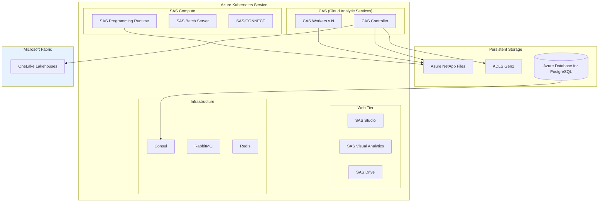
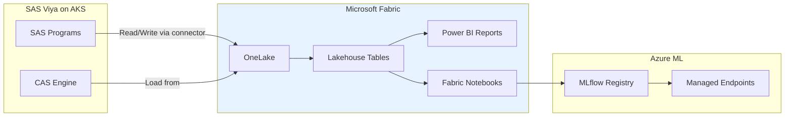

# SAS Lift-and-Shift Migration: SAS on Azure

**Audience:** SAS Administrators, Platform Engineers, Infrastructure Architects
**Purpose:** Deploy SAS Viya or SAS Grid on Azure infrastructure without modifying SAS programs. This guide covers SAS Viya on AKS, SAS Grid on Azure VMs, certified VM sizes, storage configuration, performance tuning, and integration with Microsoft Fabric.

---

## 1. Overview

A lift-and-shift migration moves SAS workloads from on-premises infrastructure to Azure without rewriting SAS programs. SAS programs, macros, format catalogs, and data all move intact. The value is in eliminating data-center risk, gaining cloud elasticity, and positioning for future incremental migration to Azure-native analytics.

Two primary deployment models:

| Model                     | SAS version                              | Azure infrastructure                              | Best for                                                |
| ------------------------- | ---------------------------------------- | ------------------------------------------------- | ------------------------------------------------------- |
| **SAS Viya on AKS**       | SAS Viya 4.x (Cloud-Native Architecture) | Azure Kubernetes Service + ADLS Gen2 + PostgreSQL | New deployments, cloud-native teams, Fabric integration |
| **SAS Grid on Azure VMs** | SAS 9.4 M8                               | Azure VMs (E/M-series) + Azure NetApp Files       | Legacy SAS 9.4 environments, minimal change             |

---

## 2. SAS Viya on AKS deployment

### 2.1 Architecture



### 2.2 Prerequisites

- **SAS Viya license:** SAS Viya 4.x with Cloud-Native Architecture (CNA) deployment entitlement
- **SAS software order:** Download SAS Viya deployment assets from `my.sas.com`
- **Azure subscription:** Azure Government (for federal) or Azure Commercial
- **Container registry:** Azure Container Registry (ACR) for SAS container images
- **DNS:** Private DNS zone for internal service resolution
- **Certificates:** TLS certificates for SAS web applications

### 2.3 Certified Azure VM sizes

SAS certifies specific Azure VM families for Viya workloads:

| SAS component      | Recommended VM family | Minimum size         | Recommended size     | Notes                                                   |
| ------------------ | --------------------- | -------------------- | -------------------- | ------------------------------------------------------- |
| CAS Controller     | Edsv5                 | Standard_E16ds_v5    | Standard_E32ds_v5    | Memory-optimized; local SSD for CAS disk cache          |
| CAS Workers        | Edsv5 or Mdsv2        | Standard_E16ds_v5    | Standard_E32ds_v5    | Scale workers for data size; M-series for 1TB+ datasets |
| SAS Compute        | Ddsv5                 | Standard_D8ds_v5     | Standard_D16ds_v5    | General purpose; one per concurrent user session        |
| Web/infrastructure | Dsv5                  | Standard_D4s_v5      | Standard_D8s_v5      | Web tier, Consul, RabbitMQ, Redis                       |
| System node pool   | Dsv5                  | Standard_D4s_v5      | Standard_D4s_v5      | AKS system pods, CoreDNS, metrics                       |
| GPU (optional)     | NCasT4_v3             | Standard_NC4as_T4_v3 | Standard_NC8as_T4_v3 | Deep learning workloads only                            |

**AKS cluster sizing (medium deployment, 50--100 users):**

| Node pool | VM size           | Min nodes | Max nodes | Scaling            |
| --------- | ----------------- | --------- | --------- | ------------------ |
| system    | Standard_D4s_v5   | 3         | 3         | Fixed              |
| cas       | Standard_E32ds_v5 | 1         | 4         | Manual or auto     |
| compute   | Standard_D16ds_v5 | 2         | 10        | Cluster autoscaler |
| web       | Standard_D8s_v5   | 2         | 4         | Cluster autoscaler |

### 2.4 Storage configuration

**Azure NetApp Files (ANF)** is the recommended shared storage for SAS Viya:

| Purpose              | ANF tier | Capacity pool | Volume          | Protocol |
| -------------------- | -------- | ------------- | --------------- | -------- |
| SAS data (SASDATA)   | Premium  | 4 TB minimum  | `/sas/data`     | NFSv4.1  |
| SAS home directories | Standard | 1 TB minimum  | `/sas/home`     | NFSv4.1  |
| SAS configuration    | Standard | 500 GB        | `/sas/config`   | NFSv4.1  |
| CAS disk cache       | Ultra    | 2 TB minimum  | `/sas/cascache` | NFSv4.1  |

**ADLS Gen2** for integration with Fabric and long-term data storage:

```yaml
# Storage account configuration
storage_accounts:
    - name: sasstorage{env}
      sku: Standard_LRS
      kind: StorageV2
      hierarchical_namespace: true
      containers:
          - name: sasdata
            access: private
          - name: sasbackup
            access: private
          - name: saswork
            access: private
```

**Azure Database for PostgreSQL Flexible Server** for SAS Infrastructure Data Server:

| Setting           | Value                                         |
| ----------------- | --------------------------------------------- |
| SKU               | General Purpose, D4ds_v5 (4 vCPUs, 16 GB RAM) |
| Storage           | 256 GB, auto-grow enabled                     |
| High availability | Zone-redundant (production)                   |
| Backup            | 35-day retention, geo-redundant               |

### 2.5 Network configuration

```yaml
# Virtual network design for SAS Viya on AKS
vnet:
    name: vnet-sas-{env}
    address_space: 10.100.0.0/16
    subnets:
        - name: snet-aks-system
          cidr: 10.100.0.0/22 # 1,024 IPs for system pods
        - name: snet-aks-cas
          cidr: 10.100.4.0/22 # 1,024 IPs for CAS pods
        - name: snet-aks-compute
          cidr: 10.100.8.0/22 # 1,024 IPs for compute pods
        - name: snet-anf
          cidr: 10.100.16.0/24 # ANF delegated subnet
        - name: snet-postgres
          cidr: 10.100.17.0/24 # PostgreSQL delegated subnet
        - name: snet-pe
          cidr: 10.100.18.0/24 # Private endpoints (ADLS, ACR, KV)
```

### 2.6 SAS Deployment Operator

SAS Viya 4.x deploys via the SAS Deployment Operator on Kubernetes:

```bash
# 1. Create AKS cluster
az aks create \
  --resource-group rg-sas-prod \
  --name aks-sas-prod \
  --kubernetes-version 1.28 \
  --network-plugin azure \
  --network-policy calico \
  --vnet-subnet-id /subscriptions/.../snet-aks-system \
  --node-count 3 \
  --node-vm-size Standard_D4s_v5 \
  --enable-managed-identity \
  --enable-workload-identity \
  --attach-acr acrsasprod

# 2. Add node pools
az aks nodepool add \
  --resource-group rg-sas-prod \
  --cluster-name aks-sas-prod \
  --name cas \
  --node-count 1 \
  --node-vm-size Standard_E32ds_v5 \
  --vnet-subnet-id /subscriptions/.../snet-aks-cas \
  --labels workload.sas.com/class=cas \
  --node-taints workload.sas.com/class=cas:NoSchedule

az aks nodepool add \
  --resource-group rg-sas-prod \
  --cluster-name aks-sas-prod \
  --name compute \
  --node-count 2 \
  --max-count 10 \
  --node-vm-size Standard_D16ds_v5 \
  --vnet-subnet-id /subscriptions/.../snet-aks-compute \
  --enable-cluster-autoscaler \
  --labels workload.sas.com/class=compute \
  --node-taints workload.sas.com/class=compute:NoSchedule

# 3. Install cert-manager (required by SAS)
kubectl apply -f https://github.com/cert-manager/cert-manager/releases/download/v1.14.0/cert-manager.yaml

# 4. Install SAS Deployment Operator
kubectl apply -f sas-bases/overlays/deploy-operator/
```

### 2.7 Performance tuning

| Tuning area    | Setting             | Recommendation                                                      |
| -------------- | ------------------- | ------------------------------------------------------------------- |
| CAS memory     | `MEMSIZE`           | Set to 80% of node memory; remaining 20% for OS and Kubernetes      |
| CAS workers    | Worker count        | 1 worker per 500 GB of data in CAS tables                           |
| CAS disk cache | Path + size         | ANF Ultra tier; size = 2x expected CAS table size                   |
| SAS WORK       | `WORK` library path | Local NVMe SSD (ephemeral) for SAS WORK; do not use network storage |
| Thread count   | `NTHREADS`          | Set to vCPU count minus 2 (reserve for OS)                          |
| SORTSIZE       | `SORTSIZE`          | 80% of available memory per compute session                         |
| Network        | MTU                 | 9000 (jumbo frames) for ANF; ensure AKS network supports            |
| I/O scheduler  | Linux scheduler     | `noop` or `none` for NVMe; `mq-deadline` for network storage        |

---

## 3. SAS Grid on Azure VMs

For organizations running SAS 9.4 that are not ready for SAS Viya:

### 3.1 VM sizing

| SAS 9.4 role            | Recommended VM    | vCPUs | RAM      | Storage                   |
| ----------------------- | ----------------- | ----- | -------- | ------------------------- |
| SAS Metadata Server     | Standard_E8ds_v5  | 8     | 64 GB    | Premium SSD 256 GB        |
| SAS Grid Node (compute) | Standard_E32ds_v5 | 32    | 256 GB   | Ephemeral OS + ANF data   |
| SAS Grid Node (large)   | Standard_M64ms    | 64    | 1,792 GB | For in-memory analytics   |
| SAS VA Tier (LASR)      | Standard_E64ds_v5 | 64    | 512 GB   | Local NVMe for LASR cache |
| SAS Web Server          | Standard_D4s_v5   | 4     | 16 GB    | Premium SSD 128 GB        |
| Platform LSF Master     | Standard_D8s_v5   | 8     | 32 GB    | Premium SSD 128 GB        |

### 3.2 Storage layout

| Mount point   | Storage type      | Size      | Purpose                            |
| ------------- | ----------------- | --------- | ---------------------------------- |
| `/opt/sas`    | Premium SSD (P30) | 1 TB      | SAS binaries and configuration     |
| `/sas/data`   | ANF Premium       | 4+ TB     | SAS datasets (SAS7BDAT files)      |
| `/sas/work`   | Ephemeral NVMe    | Local     | SAS WORK library (temporary)       |
| `/sas/utl`    | ANF Standard      | 1 TB      | SAS utility files, formats, macros |
| `/sas/backup` | ADLS Gen2 (Cool)  | Unlimited | Backups and archives               |

---

## 4. SAS on Fabric integration

The December 2025 SAS on Fabric integration enables SAS Viya to read and write directly to Fabric OneLake lakehouses.

### 4.1 Configuration

```sas
/* Configure SAS to read/write Fabric lakehouses */
/* Requires SAS Viya 2025.12+ with Fabric connector */

/* Read from Fabric lakehouse */
libname fabric_lh sasfabric
  workspace="analytics-prod"
  lakehouse="sales_lakehouse"
  authentication=entra_id;

/* Use Fabric lakehouse tables in SAS programs */
proc means data=fabric_lh.fact_sales n mean sum;
  class region product_category;
  var revenue quantity;
run;

/* Write results back to Fabric lakehouse */
data fabric_lh.sales_summary;
  set work.summary_output;
run;
```

### 4.2 Architecture with Fabric



### 4.3 Data flow patterns

| Pattern               | Description                                                 | Use case                                     |
| --------------------- | ----------------------------------------------------------- | -------------------------------------------- |
| **SAS reads Fabric**  | SAS programs read Delta tables from OneLake lakehouses      | SAS analytics on Fabric-managed data         |
| **SAS writes Fabric** | SAS output tables land in OneLake as Delta tables           | SAS results available to Power BI and Python |
| **Bidirectional**     | SAS and Python both read/write the same lakehouse           | Hybrid coexistence during migration          |
| **SAS via shortcut**  | SAS reads data exposed through OneLake shortcuts (S3, ADLS) | Cross-cloud data access                      |

---

## 5. Migration steps (lift-and-shift)

### Phase 1: Assessment (2 weeks)

1. Inventory SAS servers: CPU, memory, storage, OS version
2. Catalog SAS software: products, hot fixes, custom configurations
3. Map storage: SAS data libraries, format catalogs, macro libraries, autoexec files
4. Identify external dependencies: database connections, file shares, FTP endpoints
5. Document scheduling: Platform LSF jobs, cron jobs, SAS Management Console schedules

### Phase 2: Azure infrastructure (2--3 weeks)

1. Deploy Azure networking (VNet, subnets, NSGs, private endpoints)
2. Deploy AKS cluster (for Viya) or Azure VMs (for SAS 9.4)
3. Deploy Azure NetApp Files volumes
4. Deploy Azure Database for PostgreSQL (for Viya)
5. Deploy Azure Container Registry (for Viya)
6. Configure Entra ID integration (LDAP or SAML)

### Phase 3: SAS deployment (2--3 weeks)

1. Build SAS Viya container images in ACR (or install SAS 9.4 on VMs)
2. Deploy SAS using the SAS Deployment Operator (or SAS Deployment Wizard)
3. Configure SAS to use ANF storage
4. Configure SAS to use Azure PostgreSQL
5. Apply SAS hot fixes and updates

### Phase 4: Data migration (1--3 weeks)

1. Copy SAS datasets (SAS7BDAT) to ANF volumes using AzCopy or rsync
2. Copy SAS format catalogs and macro libraries
3. Copy autoexec.sas, sasv9.cfg, and custom configuration files
4. Validate file permissions and ownership

### Phase 5: Validation (2 weeks)

1. Run SAS program regression test suite
2. Compare output between on-premises and Azure
3. Performance benchmark (see [Benchmarks](benchmarks.md))
4. User acceptance testing
5. Load testing with concurrent users

### Phase 6: Cutover (1 week)

1. Final data sync (delta)
2. DNS cutover (point SAS URLs to Azure)
3. Update client configurations (SAS Enterprise Guide, SAS Studio URLs)
4. Disable on-premises SAS servers
5. Monitor for 48 hours

---

## 6. Federal considerations

### 6.1 SAS Viya on Azure Government

As of January 2026, SAS Viya is available on Azure Government with FedRAMP High authorization:

| Requirement  | Status                  | Notes                                                   |
| ------------ | ----------------------- | ------------------------------------------------------- |
| FedRAMP High | Authorized              | SAS Viya + Azure Gov combined authorization             |
| DoD IL4      | Supported               | Azure Gov IL4 regions                                   |
| DoD IL5      | Supported               | Azure Gov IL5 regions (US Gov Virginia, US Gov Arizona) |
| ITAR         | Supported               | Azure Government tenant-binding                         |
| HIPAA        | Supported               | BAA with both SAS and Microsoft                         |
| FISMA        | Customer responsibility | Include SAS Viya in agency SSP                          |

### 6.2 Deployment regions

| Region          | SAS Viya support | IL level | Notes                             |
| --------------- | ---------------- | -------- | --------------------------------- |
| US Gov Virginia | Yes              | IL4, IL5 | Primary federal deployment region |
| US Gov Arizona  | Yes              | IL4, IL5 | DR/secondary region               |
| US Gov Texas    | Limited          | IL4      | Contact SAS for availability      |
| DoD Central     | Contact SAS      | IL5      | DoD-specific region               |
| DoD East        | Contact SAS      | IL5      | DoD-specific region               |

---

## 7. Cost estimation (lift-and-shift)

For a medium deployment (50--100 users, 20 TB SAS data):

| Component                                   | Monthly cost         | Annual cost       |
| ------------------------------------------- | -------------------- | ----------------- |
| AKS cluster (system + CAS + compute + web)  | $8,000--$15,000      | $96K--$180K       |
| Azure NetApp Files (8 TB, Premium)          | $3,500--$5,000       | $42K--$60K        |
| Azure Database for PostgreSQL (D4ds_v5, HA) | $800--$1,200         | $10K--$14K        |
| ADLS Gen2 storage (20 TB)                   | $400--$600           | $5K--$7K          |
| Networking (private endpoints, DNS)         | $200--$400           | $2K--$5K          |
| Azure Monitor                               | $300--$500           | $4K--$6K          |
| **Total Azure infrastructure**              | **$13,200--$22,700** | **$159K--$272K**  |
| SAS Viya license (unchanged)                | Varies               | $500K--$2M        |
| **Total lift-and-shift**                    |                      | **$659K--$2.27M** |

**Key savings vs on-premises:** Eliminates data-center costs ($150K--$300K/year for hardware, power, cooling, space). Net savings of $0--$150K/year depending on current infrastructure costs. The strategic value is in positioning for future Azure-native migration and gaining cloud elasticity.

---

## 8. Next steps after lift-and-shift

Once SAS is running on Azure, the organization is positioned for incremental migration:

1. **Connect SAS to Fabric** --- Use SAS on Fabric connector to share data between SAS and Azure-native services
2. **Deploy Power BI** --- Replace SAS Visual Analytics with Power BI (lowest-risk first step)
3. **Deploy ADF + dbt** --- Replace SAS Data Integration Studio
4. **Pilot Python analytics** --- Convert 5--10 SAS programs to validate the approach
5. **Reduce SAS licensing** --- As capabilities move to Azure-native, reduce SAS product licenses

See [Analytics Migration](analytics-migration.md), [Data Management Migration](data-management-migration.md), and [Reporting Migration](reporting-migration.md) for the next phases.

---

**Maintainers:** csa-inabox core team
**Last updated:** 2026-04-30
