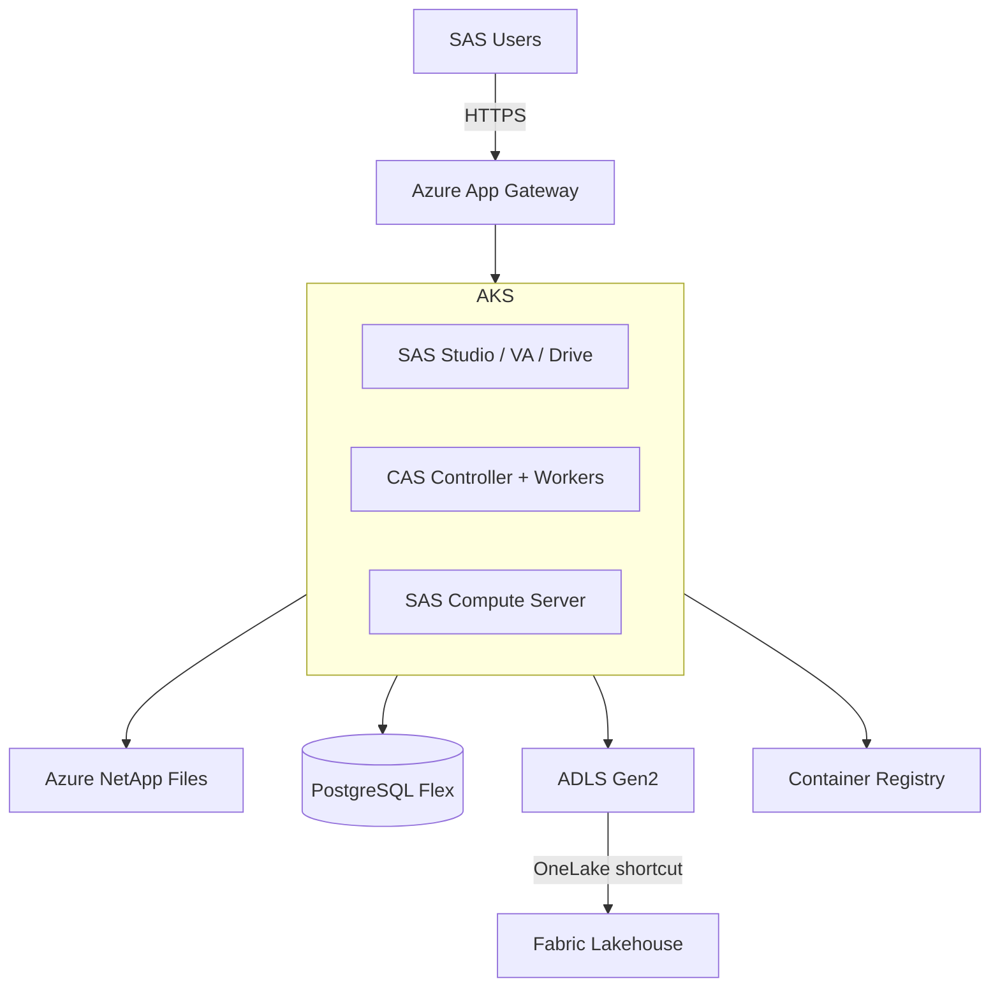

# Tutorial: Deploy SAS Viya on Azure

**Time to complete:** 4--6 hours
**Prerequisites:** SAS Viya 4.x license, Azure subscription (commercial or government), Azure CLI, kubectl, Helm
**Outcome:** SAS Viya running on AKS with persistent storage, integrated with Fabric/ADLS for data access

---

## Overview

This tutorial walks through deploying SAS Viya 4.x (Cloud-Native Architecture) on Azure Kubernetes Service. By the end, you will have a fully functional SAS Viya environment on Azure that can read and write to Fabric lakehouses.

### Architecture



---

## Step 1: Prepare Azure infrastructure

### 1.1 Set variables

```bash
# Configuration
export RESOURCE_GROUP="rg-sas-viya"
export LOCATION="eastus"  # Use "usgovvirginia" for Azure Gov
export AKS_NAME="aks-sas-viya"
export ACR_NAME="acrsasviya$(openssl rand -hex 4)"
export VNET_NAME="vnet-sas"
export ANF_ACCOUNT="anf-sas"
export PG_SERVER="pg-sas-viya"
export ADLS_ACCOUNT="sasviyadatalake"
export KEYVAULT_NAME="kv-sas-viya"

# SAS-specific
export SAS_ORDER="<your-sas-order-number>"
export SAS_CADENCE="stable"  # stable or lts
```

### 1.2 Create resource group and networking

```bash
# Resource group
az group create --name $RESOURCE_GROUP --location $LOCATION

# Virtual network with subnets
az network vnet create \
  --resource-group $RESOURCE_GROUP \
  --name $VNET_NAME \
  --address-prefix 10.100.0.0/16

# AKS subnet
az network vnet subnet create \
  --resource-group $RESOURCE_GROUP \
  --vnet-name $VNET_NAME \
  --name snet-aks \
  --address-prefix 10.100.0.0/20

# ANF subnet (delegated)
az network vnet subnet create \
  --resource-group $RESOURCE_GROUP \
  --vnet-name $VNET_NAME \
  --name snet-anf \
  --address-prefix 10.100.16.0/24 \
  --delegations Microsoft.NetApp/volumes

# PostgreSQL subnet (delegated)
az network vnet subnet create \
  --resource-group $RESOURCE_GROUP \
  --vnet-name $VNET_NAME \
  --name snet-postgres \
  --address-prefix 10.100.17.0/24 \
  --delegations Microsoft.DBforPostgreSQL/flexibleServers

# Private endpoint subnet
az network vnet subnet create \
  --resource-group $RESOURCE_GROUP \
  --vnet-name $VNET_NAME \
  --name snet-pe \
  --address-prefix 10.100.18.0/24
```

### 1.3 Create supporting services

```bash
# Container Registry
az acr create \
  --resource-group $RESOURCE_GROUP \
  --name $ACR_NAME \
  --sku Premium \
  --admin-enabled false

# Key Vault
az keyvault create \
  --resource-group $RESOURCE_GROUP \
  --name $KEYVAULT_NAME \
  --location $LOCATION \
  --enable-rbac-authorization

# ADLS Gen2 storage
az storage account create \
  --resource-group $RESOURCE_GROUP \
  --name $ADLS_ACCOUNT \
  --location $LOCATION \
  --sku Standard_LRS \
  --kind StorageV2 \
  --hns true

# Create containers
az storage container create --account-name $ADLS_ACCOUNT --name sasdata
az storage container create --account-name $ADLS_ACCOUNT --name sasbackup
```

---

## Step 2: Deploy Azure NetApp Files

```bash
# Create ANF account
az netappfiles account create \
  --resource-group $RESOURCE_GROUP \
  --account-name $ANF_ACCOUNT \
  --location $LOCATION

# Create capacity pool (Premium tier, 4 TiB)
az netappfiles pool create \
  --resource-group $RESOURCE_GROUP \
  --account-name $ANF_ACCOUNT \
  --pool-name pool-sas \
  --size 4 \
  --service-level Premium

# Create volumes
# SAS data volume
az netappfiles volume create \
  --resource-group $RESOURCE_GROUP \
  --account-name $ANF_ACCOUNT \
  --pool-name pool-sas \
  --name vol-sas-data \
  --service-level Premium \
  --usage-threshold 2048 \
  --file-path sas-data \
  --vnet $VNET_NAME \
  --subnet snet-anf \
  --protocol-types NFSv4.1 \
  --allowed-clients 10.100.0.0/16

# SAS home volume
az netappfiles volume create \
  --resource-group $RESOURCE_GROUP \
  --account-name $ANF_ACCOUNT \
  --pool-name pool-sas \
  --name vol-sas-home \
  --service-level Premium \
  --usage-threshold 1024 \
  --file-path sas-home \
  --vnet $VNET_NAME \
  --subnet snet-anf \
  --protocol-types NFSv4.1 \
  --allowed-clients 10.100.0.0/16

# CAS cache volume (high performance)
az netappfiles volume create \
  --resource-group $RESOURCE_GROUP \
  --account-name $ANF_ACCOUNT \
  --pool-name pool-sas \
  --name vol-cas-cache \
  --service-level Premium \
  --usage-threshold 1024 \
  --file-path cas-cache \
  --vnet $VNET_NAME \
  --subnet snet-anf \
  --protocol-types NFSv4.1 \
  --allowed-clients 10.100.0.0/16
```

---

## Step 3: Deploy AKS cluster

```bash
# Get subnet ID
AKS_SUBNET_ID=$(az network vnet subnet show \
  --resource-group $RESOURCE_GROUP \
  --vnet-name $VNET_NAME \
  --name snet-aks \
  --query id -o tsv)

# Create AKS cluster
az aks create \
  --resource-group $RESOURCE_GROUP \
  --name $AKS_NAME \
  --kubernetes-version 1.28 \
  --node-count 3 \
  --node-vm-size Standard_D4s_v5 \
  --network-plugin azure \
  --network-policy calico \
  --vnet-subnet-id $AKS_SUBNET_ID \
  --service-cidr 10.200.0.0/16 \
  --dns-service-ip 10.200.0.10 \
  --enable-managed-identity \
  --enable-workload-identity \
  --enable-oidc-issuer \
  --attach-acr $ACR_NAME \
  --enable-addons monitoring \
  --generate-ssh-keys

# Add CAS node pool (memory-optimized)
az aks nodepool add \
  --resource-group $RESOURCE_GROUP \
  --cluster-name $AKS_NAME \
  --name cas \
  --node-count 1 \
  --node-vm-size Standard_E32ds_v5 \
  --max-pods 50 \
  --labels "workload.sas.com/class=cas" \
  --node-taints "workload.sas.com/class=cas:NoSchedule"

# Add compute node pool (auto-scaling)
az aks nodepool add \
  --resource-group $RESOURCE_GROUP \
  --cluster-name $AKS_NAME \
  --name compute \
  --node-count 2 \
  --min-count 1 \
  --max-count 10 \
  --node-vm-size Standard_D16ds_v5 \
  --enable-cluster-autoscaler \
  --labels "workload.sas.com/class=compute" \
  --node-taints "workload.sas.com/class=compute:NoSchedule"

# Get credentials
az aks get-credentials --resource-group $RESOURCE_GROUP --name $AKS_NAME
```

---

## Step 4: Deploy PostgreSQL for SAS Infrastructure Data Server

```bash
PG_SUBNET_ID=$(az network vnet subnet show \
  --resource-group $RESOURCE_GROUP \
  --vnet-name $VNET_NAME \
  --name snet-postgres \
  --query id -o tsv)

az postgres flexible-server create \
  --resource-group $RESOURCE_GROUP \
  --name $PG_SERVER \
  --location $LOCATION \
  --sku-name Standard_D4ds_v5 \
  --tier GeneralPurpose \
  --storage-size 256 \
  --version 15 \
  --subnet $PG_SUBNET_ID \
  --private-dns-zone "privatelink.postgres.database.azure.com" \
  --admin-user sasadmin \
  --admin-password "$(openssl rand -base64 24)" \
  --high-availability ZoneRedundant \
  --backup-retention 35
```

---

## Step 5: Prepare SAS Viya deployment assets

```bash
# 1. Download SAS deployment assets from my.sas.com
# This requires your SAS order number and SAS profile credentials

# 2. Create namespace
kubectl create namespace sas-viya

# 3. Create secret for SAS license
kubectl create secret generic sas-license \
  --from-file=license=./SASViyaV4_license.jwt \
  -n sas-viya

# 4. Install cert-manager (required by SAS)
kubectl apply -f https://github.com/cert-manager/cert-manager/releases/download/v1.14.0/cert-manager.yaml
kubectl wait --for=condition=Available deployment --all -n cert-manager --timeout=120s

# 5. Install NGINX Ingress Controller
helm repo add ingress-nginx https://kubernetes.github.io/ingress-nginx
helm install ingress-nginx ingress-nginx/ingress-nginx \
  --namespace ingress-nginx --create-namespace \
  --set controller.service.annotations."service\.beta\.kubernetes\.io/azure-load-balancer-internal"=true

# 6. Create NFS storage class for ANF
cat <<EOF | kubectl apply -f -
apiVersion: storage.k8s.io/v1
kind: StorageClass
metadata:
  name: anf-premium
provisioner: netapp.io/trident
parameters:
  backendType: "azure-netapp-files"
  serviceLevel: "Premium"
  storagePools: "pool-sas"
EOF

# 7. Create persistent volume claims for SAS
cat <<EOF | kubectl apply -n sas-viya -f -
apiVersion: v1
kind: PersistentVolumeClaim
metadata:
  name: sas-data
spec:
  accessModes: [ReadWriteMany]
  storageClassName: anf-premium
  resources:
    requests:
      storage: 2Ti
---
apiVersion: v1
kind: PersistentVolumeClaim
metadata:
  name: sas-home
spec:
  accessModes: [ReadWriteMany]
  storageClassName: anf-premium
  resources:
    requests:
      storage: 1Ti
EOF
```

---

## Step 6: Deploy SAS Viya

```bash
# 1. Build and push SAS container images to ACR
# (Follow SAS documentation for viya4-deployment)

# 2. Install SAS Deployment Operator
kubectl apply -f sas-bases/overlays/deploy-operator/ -n sas-viya

# 3. Apply the SAS deployment custom resource
# Edit kustomization.yaml with your configuration:
# - Ingress hostname
# - PostgreSQL connection string
# - Storage configuration
# - License file reference

kubectl apply -k . -n sas-viya

# 4. Wait for deployment (this takes 30-60 minutes)
kubectl wait --for=condition=Ready \
  sasdeployment/sas-viya -n sas-viya --timeout=3600s

# 5. Verify all pods are running
kubectl get pods -n sas-viya | grep -v "Completed"
```

---

## Step 7: Configure SAS on Fabric integration

```bash
# 1. Create a managed identity for SAS to access ADLS/Fabric
az identity create \
  --resource-group $RESOURCE_GROUP \
  --name mi-sas-fabric-access

# 2. Assign storage permissions
IDENTITY_PRINCIPAL=$(az identity show \
  --resource-group $RESOURCE_GROUP \
  --name mi-sas-fabric-access \
  --query principalId -o tsv)

STORAGE_ID=$(az storage account show \
  --name $ADLS_ACCOUNT \
  --query id -o tsv)

az role assignment create \
  --assignee $IDENTITY_PRINCIPAL \
  --role "Storage Blob Data Contributor" \
  --scope $STORAGE_ID
```

### 7.1 Configure SAS LIBNAME for ADLS Gen2

```sas
/* In SAS Studio, configure ADLS access */
libname adls sasadls
  storageaccount="sasviyadatalake"
  container="sasdata"
  authentication="managed_identity";

/* Test: read a Delta table */
proc contents data=adls.fact_sales; run;
```

### 7.2 Configure SAS on Fabric connector

```sas
/* Configure Fabric lakehouse access (requires SAS Viya 2025.12+) */
libname fabric sasfabric
  workspace="analytics-prod"
  lakehouse="gold_lakehouse"
  authentication=entra_id;

/* Read from Fabric lakehouse */
proc means data=fabric.fact_sales n mean sum;
  class region;
  var revenue;
run;

/* Write results to Fabric */
data fabric.regional_summary;
  set work.output;
run;
```

---

## Step 8: Validate deployment

### 8.1 Access SAS Studio

```bash
# Get the ingress IP/hostname
kubectl get ingress -n sas-viya

# Access SAS Studio at:
# https://<ingress-hostname>/SASStudio
```

### 8.2 Run validation tests

```sas
/* Test 1: Basic SAS functionality */
data work.test;
  do i = 1 to 1000000;
    x = ranuni(42);
    y = rannor(42);
    output;
  end;
run;

proc means data=work.test n mean std;
  var x y;
run;

/* Test 2: CAS functionality */
cas mysess;
proc cas;
  table.loadTable /
    path="test.sas7bdat"
    caslib="casuser"
    casOut={name="test_cas" replace=true};
  simple.summary /
    table={name="test_cas" caslib="casuser"}
    inputs={"x", "y"};
quit;
cas mysess terminate;

/* Test 3: ADLS connectivity */
libname adls sasadls
  storageaccount="sasviyadatalake"
  container="sasdata"
  authentication="managed_identity";

data adls.connectivity_test;
  test_timestamp = datetime();
  format test_timestamp datetime20.;
  message = "SAS Viya on Azure deployment validated";
  output;
run;

proc print data=adls.connectivity_test; run;

/* Test 4: Fabric connectivity (if configured) */
libname fabric sasfabric
  workspace="analytics-prod"
  lakehouse="gold_lakehouse"
  authentication=entra_id;

proc contents data=fabric._all_ nods; run;
```

### 8.3 Performance baseline

```sas
/* Run a standardized benchmark */
%let start = %sysfunc(datetime());

data work.benchmark;
  array vars{50} v1-v50;
  do obs = 1 to 10000000;
    do j = 1 to 50;
      vars{j} = ranuni(obs * j);
    end;
    output;
  end;
  drop obs j;
run;

proc means data=work.benchmark noprint;
  var v1-v50;
  output out=work.bench_stats;
run;

%let end = %sysfunc(datetime());
%let elapsed = %sysevalf(&end - &start);
%put NOTE: Benchmark completed in &elapsed seconds;
```

Record the elapsed time and compare with on-premises baseline. See [Benchmarks](benchmarks.md) for expected performance ranges.

---

## Step 9: Post-deployment configuration

### 9.1 Entra ID integration

```bash
# Configure SAML authentication for SAS Viya
# 1. Register SAS Viya as an enterprise application in Entra ID
# 2. Configure SAML SSO with SAS Viya's SAML endpoint
# 3. Map Entra ID groups to SAS custom groups

# See SAS documentation: "SAS Viya Administration: Authentication"
```

### 9.2 Monitoring

```bash
# Enable Container Insights
az aks enable-addons \
  --resource-group $RESOURCE_GROUP \
  --name $AKS_NAME \
  --addons monitoring

# Create alerts for SAS-specific metrics
# - CAS memory utilization > 85%
# - SAS compute pod count > threshold
# - ANF volume utilization > 80%
# - PostgreSQL CPU > 80%
```

---

## Troubleshooting

| Issue                        | Cause                                | Resolution                                                   |
| ---------------------------- | ------------------------------------ | ------------------------------------------------------------ |
| CAS pods stuck in Pending    | Insufficient memory on CAS node pool | Scale CAS node pool or use larger VM size                    |
| Slow CAS table loads         | ANF volume throughput limit          | Upgrade to Ultra tier or increase pool size                  |
| SAS Studio 503 errors        | Web pod not ready                    | Check pod logs: `kubectl logs -n sas-viya -l app=sas-studio` |
| PostgreSQL connection failed | Network connectivity                 | Verify private DNS zone and subnet delegation                |
| ADLS authentication error    | Managed identity not assigned        | Verify RBAC role assignment on storage account               |

---

## Next steps

1. **Migrate SAS data** --- Copy SAS datasets to ADLS Gen2 or load into CAS from ADLS
2. **Configure SAS on Fabric** --- Connect to Fabric lakehouses for shared data access
3. **Run existing SAS programs** --- Validate that on-premises SAS programs run without modification
4. **Begin incremental migration** --- Start converting SAS programs to Python (see [Tutorial: SAS to Python](tutorial-sas-to-python.md))

---

**Maintainers:** csa-inabox core team
**Last updated:** 2026-04-30
