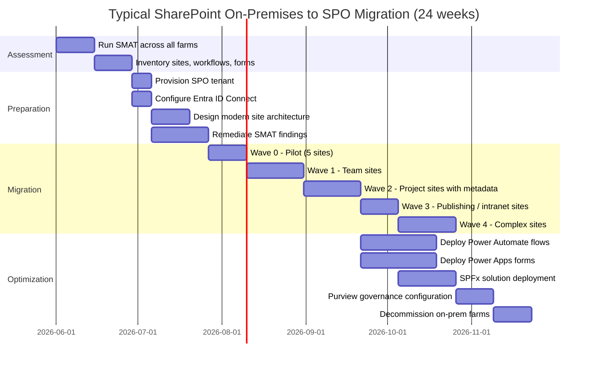

# SharePoint On-Premises to SharePoint Online Migration Center

**The definitive resource for migrating from SharePoint Server 2010/2013/2016/2019 to SharePoint Online, with CSA-in-a-Box integration for governance, analytics, and AI.**

---

## Who this is for

This migration center serves SharePoint administrators, M365 architects, governance specialists, IT directors, federal CIOs, and collaboration platform owners who are planning or executing a migration from SharePoint Server on-premises to SharePoint Online. Whether you are driven by end-of-support timelines, a cloud-first mandate, Copilot for Microsoft 365 enablement, or the need to consolidate collaboration onto a single modern platform, these resources provide the assessment tools, migration patterns, and step-by-step guidance to execute confidently.

---

## Quick-start decision matrix

| Your situation                              | Start here                                                  |
| ------------------------------------------- | ----------------------------------------------------------- |
| Executive evaluating SharePoint Online      | [Why SharePoint Online](why-sharepoint-online.md)           |
| Need cost justification for migration       | [Total Cost of Ownership Analysis](tco-analysis.md)         |
| Need a feature-by-feature comparison        | [Complete Feature Mapping](feature-mapping-complete.md)     |
| Ready to plan a migration                   | [Migration Playbook](../sharepoint-to-online.md)            |
| Federal/government-specific requirements    | [Federal Migration Guide](federal-migration-guide.md)       |
| Migrating sites and site collections        | [Site Migration](site-migration.md)                         |
| Migrating documents, lists, and metadata    | [Content Migration](content-migration.md)                   |
| Migrating SharePoint workflows              | [Workflow Migration](workflow-migration.md)                 |
| Migrating InfoPath forms                    | [InfoPath Migration](infopath-migration.md)                 |
| Migrating farm solutions and customizations | [Customization Migration](customization-migration.md)       |
| Migrating permissions and security          | [Security Migration](security-migration.md)                 |
| Using SPMT for migration                    | [SPMT Tutorial](tutorial-spmt-migration.md)                 |
| Using Migration Manager at scale            | [Migration Manager Tutorial](tutorial-migration-manager.md) |

---

## Strategic resources

These documents provide the business case, cost analysis, and strategic framing for decision-makers.

| Document                                                | Audience                    | Description                                                                                                                                                                   |
| ------------------------------------------------------- | --------------------------- | ----------------------------------------------------------------------------------------------------------------------------------------------------------------------------- |
| [Why SharePoint Online](why-sharepoint-online.md)       | CIO / IT Director / Board   | Executive white paper covering modern experience, Teams integration, Copilot for M365, end-of-support timelines, and an honest assessment of remaining on-premises advantages |
| [Total Cost of Ownership Analysis](tco-analysis.md)     | CFO / CIO / Procurement     | Detailed pricing model comparison: on-premises SharePoint farm costs vs SPO licensing included in M365, 5-year TCO projections, and hidden cost analysis                      |
| [Complete Feature Mapping](feature-mapping-complete.md) | CTO / Platform Architecture | 50+ SharePoint features mapped from on-premises to SPO with migration complexity ratings and gap analysis                                                                     |

---

## Migration guides

Domain-specific deep dives covering every aspect of a SharePoint on-premises to SharePoint Online migration.

| Guide                                                 | Source capability                                  | SPO destination                                  |
| ----------------------------------------------------- | -------------------------------------------------- | ------------------------------------------------ |
| [Site Migration](site-migration.md)                   | Site collections, webs, subsites                   | Modern sites, hub sites, flat architecture       |
| [Content Migration](content-migration.md)             | Document libraries, lists, metadata, content types | SPO libraries, modern lists, managed metadata    |
| [Workflow Migration](workflow-migration.md)           | SharePoint 2010/2013 Workflows, Nintex             | Power Automate cloud flows                       |
| [InfoPath Migration](infopath-migration.md)           | InfoPath forms, form libraries                     | Power Apps, SPO list forms                       |
| [Customization Migration](customization-migration.md) | Farm solutions, sandbox solutions, SP Designer     | SharePoint Framework (SPFx), modern theming      |
| [Security Migration](security-migration.md)           | NTFS, SP groups, AD security groups                | Entra ID groups, sensitivity labels, Purview DLP |

---

## Tutorials

Hands-on, step-by-step walkthroughs for specific migration tools.

| Tutorial                                                    | Tool                      | Description                                                                          |
| ----------------------------------------------------------- | ------------------------- | ------------------------------------------------------------------------------------ |
| [SPMT Step-by-Step](tutorial-spmt-migration.md)             | SharePoint Migration Tool | Download, configure, scan, migrate, validate, and remediate with SPMT                |
| [Migration Manager at Scale](tutorial-migration-manager.md) | Migration Manager         | Set up agents, bulk scan, schedule migrations, and monitor via the M365 admin center |

---

## Technical references

| Document                                                | Description                                                                                         |
| ------------------------------------------------------- | --------------------------------------------------------------------------------------------------- |
| [Complete Feature Mapping](feature-mapping-complete.md) | Every on-premises SharePoint feature mapped to its SPO equivalent with migration complexity ratings |
| [Migration Playbook](../sharepoint-to-online.md)        | The end-to-end migration playbook with phased plan, decision matrix, and CSA-in-a-Box integration   |
| [Benchmarks & Performance](benchmarks.md)               | Migration throughput, search performance, storage limits, and API throttling data                   |

---

## Government and federal

| Document                                              | Description                                                                                                                                            |
| ----------------------------------------------------- | ------------------------------------------------------------------------------------------------------------------------------------------------------ |
| [Federal Migration Guide](federal-migration-guide.md) | SPO GCC/GCC-High/DoD tenant provisioning, compliance boundaries, data residency, records management, NARA requirements, and sensitivity labels for CUI |

---

## How CSA-in-a-Box fits

CSA-in-a-Box provides the **governance, analytics, and AI integration layer** for SharePoint Online content. While the migration itself moves content from on-premises farms to SPO, CSA-in-a-Box ensures that content is properly governed and available for analytics and AI consumption:

- **Microsoft Purview** scans SPO sites for classification, sensitivity labels, and data loss prevention. Content types, metadata, and document properties flow into the Purview data catalog for enterprise-wide governance visibility.
- **Sensitivity labels** applied through Purview protect documents containing CUI, PII, PHI, and other regulated content. Labels persist across Teams, OneDrive, and SPO -- governing content wherever it travels in M365.
- **DLP policies** enforced through Purview prevent sensitive content from being shared externally or with unauthorized users. Policies can target specific SPO site collections, document libraries, or content types.
- **Power BI** connects to SharePoint list data and document metadata for operational reporting. Usage analytics, storage trends, and compliance dashboards provide visibility into the migrated content estate.
- **Copilot for Microsoft 365** surfaces SharePoint Online content through natural language queries, but only when content is properly labeled and governed. Without Purview governance, Copilot may surface sensitive content to unauthorized users -- making the Purview integration a prerequisite, not an optional enhancement.
- **Azure Monitor** provides centralized health monitoring for the M365 tenant, including SharePoint Online service health, storage consumption, and API usage metrics.

For capabilities beyond CSA-in-a-Box's current scope (e.g., Power Platform governance, Teams governance, Viva Engage integration), this migration center provides direct guidance using the broader M365 ecosystem.

---

## Migration timeline overview



---

## Migration tool comparison

### SPMT vs Migration Manager vs FastTrack

| Capability                | SPMT                      | Migration Manager          | FastTrack                |
| ------------------------- | ------------------------- | -------------------------- | ------------------------ |
| **Deployment**            | Desktop app or PowerShell | M365 admin center + agents | Microsoft-led engagement |
| **Ideal scale**           | < 10 TB, < 500 sites      | Any scale, multi-farm      | 500+ licensed seats      |
| **Agent model**           | Single workstation        | Multi-agent distributed    | N/A (advisory)           |
| **Scheduling**            | Manual or scripted        | Built-in calendar          | Coordinated waves        |
| **Scan/assess**           | Pre-migration scan        | Centralized scan dashboard | SMAT + custom assessment |
| **File share support**    | Yes                       | Yes                        | Yes                      |
| **Incremental migration** | Yes                       | Yes                        | N/A                      |
| **Real-time monitoring**  | Local logs                | Admin center dashboard     | FastTrack portal         |
| **PowerShell automation** | Full support              | Limited                    | N/A                      |
| **GCC / GCC-High**        | Supported                 | Supported                  | Supported                |
| **Cost**                  | Free                      | Free                       | Free (500+ seats)        |

### When to use third-party tools

Third-party tools (Sharegate, AvePoint, Quest/Metalogix) are warranted when:

- **Permission remapping** requires granular control beyond AD-to-Entra mapping
- **Workflow analysis** needs deeper inventory than SMAT provides
- **Pre-migration reporting** must satisfy compliance or audit requirements
- **Multi-tenant migrations** or tenant-to-tenant moves are in scope
- **Hybrid coexistence** requires ongoing synchronization between on-prem and SPO
- **Content transformation** (e.g., classic-to-modern page conversion) must happen during migration

---

## Content structure

```
sharepoint-to-online/
    index.md                        # This hub page
    why-sharepoint-online.md        # Executive brief
    tco-analysis.md                 # Total cost of ownership
    feature-mapping-complete.md     # 50+ feature mapping
    site-migration.md               # Site collection migration
    content-migration.md            # Documents, lists, metadata
    workflow-migration.md           # Workflows to Power Automate
    infopath-migration.md           # InfoPath to Power Apps
    customization-migration.md      # Farm solutions to SPFx
    security-migration.md           # Permissions and security
    tutorial-spmt-migration.md      # SPMT step-by-step
    tutorial-migration-manager.md   # Migration Manager at scale
    federal-migration-guide.md      # GCC / GCC-High / DoD
    benchmarks.md                   # Performance and throughput
    best-practices.md               # Assessment-first approach
```

---

## Best practices and operational guidance

| Document                            | Description                                                                                                                                                          |
| ----------------------------------- | -------------------------------------------------------------------------------------------------------------------------------------------------------------------- |
| [Best Practices](best-practices.md) | Assessment-first approach, SMAT scanning, pilot site selection, user adoption, modern page conversion, and governance planning with CSA-in-a-Box Purview integration |

---

## End-of-support timeline

Migration urgency varies by SharePoint version:

| SharePoint version | Mainstream ended | Extended support ends | Migration urgency                        |
| ------------------ | ---------------- | --------------------- | ---------------------------------------- |
| SharePoint 2010    | October 2015     | **October 2020**      | **Critical -- unsupported for 5+ years** |
| SharePoint 2013    | April 2018       | **April 2023**        | **Critical -- unsupported for 3+ years** |
| SharePoint 2016    | July 2021        | **July 2026**         | **Urgent -- 3 months remaining**         |
| SharePoint 2019    | January 2024     | April 2029            | Plan within 1-2 years                    |
| SharePoint SE      | Ongoing          | Ongoing               | Evaluate cloud readiness                 |

!!! danger "SharePoint 2016 extended support ends July 14, 2026"
Organizations running SharePoint 2016 have approximately 3 months to begin migration. After July 2026, no security patches will be available. There are no Extended Security Updates (ESU) planned for SharePoint Server. Migrate to SPO or upgrade to SharePoint Subscription Edition.

---

## Quick-start: 30-minute assessment

Run these three commands to generate a migration readiness snapshot:

```powershell
# Step 1: Get site inventory (2 minutes)
Add-PSSnapin Microsoft.SharePoint.PowerShell
Get-SPSite -Limit All | Select-Object Url, @{N='SizeMB';E={[math]::Round($_.Usage.Storage/1MB,2)}},
    LastContentModifiedDate, @{N='Webs';E={$_.AllWebs.Count}} |
    Export-Csv -Path "C:\Assessment\sites.csv" -NoTypeInformation

# Step 2: Run SMAT (10-30 minutes depending on farm size)
.\SMAT.exe -SiteURL https://sharepoint.contoso.com -OutputFolder C:\Assessment\SMAT

# Step 3: Review SMAT summary
Import-Csv "C:\Assessment\SMAT\ScanSummary.csv" | Format-Table -AutoSize
```

---

## References

- [SharePoint Migration Tool documentation](https://learn.microsoft.com/sharepointmigration/introducing-the-sharepoint-migration-tool)
- [Migration Manager documentation](https://learn.microsoft.com/sharepointmigration/mm-get-started)
- [SharePoint Migration Assessment Tool (SMAT)](https://learn.microsoft.com/sharepointmigration/overview-of-the-sharepoint-migration-assessment-tool)
- [FastTrack for Microsoft 365](https://learn.microsoft.com/fasttrack/introduction)
- [SharePoint Online service description](https://learn.microsoft.com/office365/servicedescriptions/sharepoint-online-service-description/sharepoint-online-service-description)
- [PnP PowerShell](https://pnp.github.io/powershell/)
- [SharePoint Framework (SPFx) documentation](https://learn.microsoft.com/sharepoint/dev/spfx/sharepoint-framework-overview)
- [Power Automate documentation](https://learn.microsoft.com/power-automate/)
- [Power Apps documentation](https://learn.microsoft.com/power-apps/)
- [Microsoft Purview compliance documentation](https://learn.microsoft.com/purview/)

---

**Maintainers:** csa-inabox core team
**Last updated:** 2026-04-30
