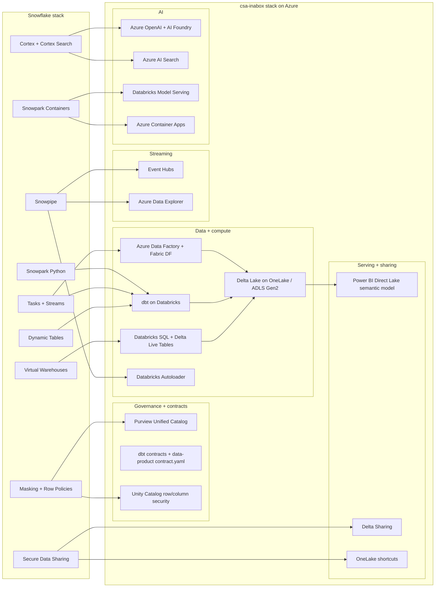

# Migrating from Snowflake to csa-inabox

**Status:** Authored 2026-04-19
**Audience:** Federal CIO / CDO / Chief Data Architect and their implementation teams running a Snowflake tenant today (commercial or Snowflake Government).
**Scope:** Full capability-by-capability migration from Snowflake (warehouses, Snowpark, Cortex, Snowpipe, Tasks/Streams, Data Sharing, dynamic tables) to the csa-inabox reference platform on Microsoft Azure.

---

## 1. Executive summary

Snowflake is a good product. It is not, today, the right federal bet. As of April 2026, Snowflake holds **FedRAMP Moderate** on Snowflake Government — not High — and several of the AI and streaming surfaces (Cortex, Snowpipe Streaming, Snowpark Container Services) have partial or commercial-only coverage in the Gov region. For any federal customer whose Authority to Operate requires FedRAMP High, DoD IL4/IL5, ITAR, or CMMC 2.0 Level 2 coverage, Snowflake imposes either a compliance ceiling or a second-vendor dance to reach parity.

csa-inabox plus Azure PaaS resolves this by inheriting **FedRAMP High** through Azure Government (`docs/compliance/nist-800-53-rev5.md`, `governance/compliance/nist-800-53-rev5.yaml`), **CMMC 2.0 Level 2** (`governance/compliance/cmmc-2.0-l2.yaml`), and **HIPAA Security Rule** (`governance/compliance/hipaa-security-rule.yaml`) at the platform layer, and projecting those controls through to every Bicep module, Purview classification, and Delta Lake table. Data stays in an open format (Delta + Parquet). Compute is consumption-priced and can scale to zero between runs.

This playbook is written for the Snowflake customer who has already made the decision to move or who is under a forcing function — FedRAMP High requirement, budget compression, Azure-first mandate, open-standards policy, or a Cortex feature request that Snowflake has not yet backported to Gov. It maps every significant Snowflake capability to the equivalent in csa-inabox, walks through a worked dbt-on-Snowflake → dbt-on-Databricks migration end-to-end, and gives a phased plan realistic to a mid-to-large federal tenant.

It is also honest where Snowflake is still stronger. Snowflake's account/database/schema model is very clean. Snowpark Container Services is easier on day one than wiring Azure Container Apps + Databricks Model Serving. Secure Data Sharing inside Snowflake is more turnkey than stitching OneLake shortcuts + Delta Sharing across tenants. Every gap is called out below.

### Federal considerations — Snowflake vs csa-inabox

| Consideration | Snowflake (Gov tenant, today) | csa-inabox (today) | Notes |
|---|---|---|---|
| FedRAMP Moderate | Authorized | Inherited (Azure Gov + Azure Commercial authorized services) | csa-inabox documents control coverage in `governance/compliance/nist-800-53-rev5.yaml` |
| FedRAMP High | **Not authorized** (Moderate only as of 2026-04) | Inherited through Azure Gov High | **Material differentiator for federal tenants that require High** |
| DoD IL4 | Limited (partner-dependent) | Covered in Azure Gov | Full parity on Azure Government for IL4 workloads |
| DoD IL5 | **Gap** | Covered in Azure Gov (most services; Fabric IL5 parity forecast per Microsoft roadmap) | See `docs/GOV_SERVICE_MATRIX.md` |
| DoD IL6 | Gap | **Gap** — out of scope for csa-inabox today | Neither platform; recommend bespoke tenant |
| ITAR | Covered (Snowflake Gov region) | Covered by Azure Gov tenant defaults | Data-residency assured by Azure Gov tenant-binding |
| CMMC 2.0 Level 2 | Controls available; customer-managed mappings | Controls mapped in `governance/compliance/cmmc-2.0-l2.yaml` + `docs/compliance/cmmc-2.0-l2.md` | DIB primes inherit directly |
| HIPAA Security Rule | Covered with BAA | Covered; mapped in `governance/compliance/hipaa-security-rule.yaml` | See `examples/tribal-health/` for HHS / IHS worked example |
| Data-residency binding | Snowflake region | Azure Government tenant-binding | Azure Gov is a physically separate cloud instance, not a logical region |
| Storage format | Proprietary (Snowflake micro-partitions) | Delta Lake on Parquet (open) | Exit cost from Snowflake is material; exit cost from csa-inabox is weeks |
| Compute pricing | Snowflake credits (per-warehouse, per-second after 1 minute minimum) | Azure consumption (Databricks DBUs, Fabric capacity, ADF activity runs) | Typical 40–50% cost reduction at comparable workload — see Section 7 |
| Per-seat licensing | No, but reader accounts + BI Copilot cost structured separately | No; Power BI Premium or Fabric capacity covers consumers | Fabric capacity is workspace-level, not per-seat |

---

## 2. Capability mapping — Snowflake → csa-inabox

This is the load-bearing table. Every row cites a real file path in the csa-inabox repo or flags an honest gap.

| Snowflake capability | csa-inabox equivalent | Mapping notes | Effort | Evidence (repo path) |
|---|---|---|---|---|
| **Snowflake virtual warehouses + micro-partitions** | Azure Databricks SQL Warehouses + Delta Lake | Warehouse sizes (XS–6XL) map to Databricks SQL Warehouse sizes (2X-Small–4X-Large). Micro-partition pruning maps to Delta Lake file pruning + Z-ordering. | M | `csa_platform/unity_catalog_pattern/README.md`, `domains/shared/dbt/dbt_project.yml`, ADR-0003 `docs/adr/0003-delta-lake-over-iceberg-and-parquet.md` |
| **Snowpark Python** | Databricks Spark + PySpark + Koalas (pandas-on-Spark) | Snowpark DataFrame API translates to PySpark DataFrame API; Snowpark UDFs become PySpark UDFs or Databricks SQL UDFs. | M | `domains/shared/notebooks/`, `csa_platform/unity_catalog_pattern/`, ADR-0002 `docs/adr/0002-databricks-over-oss-spark.md` |
| **Snowpark Container Services** | Azure Container Apps + Databricks Model Serving | Long-running container workloads split: general compute → Container Apps; model inference → Databricks Model Serving. | L | `csa_platform/ai_integration/model_serving/`, `csa_platform/oss_alternatives/helm/` |
| **Tasks + Streams (CDC)** | ADF schedule triggers + Delta change-data-feed (CDF) + Databricks DLT | Streams become `SELECT ... FROM table CHANGES(...)` on Delta CDF; Tasks become ADF triggers or DLT pipeline schedules. | M | `domains/shared/pipelines/adf/`, `domains/shared/dbt/dbt_project.yml`, ADR-0001 `docs/adr/0001-adf-dbt-over-airflow.md` |
| **Time Travel (data versioning)** | Delta Lake time travel (`VERSION AS OF` / `TIMESTAMP AS OF`) | Semantics are equivalent; retention is configurable via `delta.deletedFileRetentionDuration`. | XS | `csa_platform/unity_catalog_pattern/README.md`, ADR-0003 |
| **Zero-Copy Cloning** | Delta Lake SHALLOW CLONE / DEEP CLONE | Snowflake zero-copy clones are metadata-only; Delta SHALLOW CLONE is the direct analog. | XS | ADR-0003 `docs/adr/0003-delta-lake-over-iceberg-and-parquet.md` |
| **Cortex (LLM functions — `COMPLETE`, `SUMMARIZE`, `TRANSLATE`)** | Azure AI Foundry + Azure OpenAI invoked from dbt macros, notebooks, or Databricks SQL external models | Cortex inline SQL calls become Databricks SQL `ai_query()` calls or dbt macros wrapping Azure OpenAI. | M | `csa_platform/ai_integration/README.md`, `csa_platform/ai_integration/enrichment/`, ADR-0007 `docs/adr/0007-azure-openai-over-self-hosted-llm.md` |
| **Cortex Search (hybrid vector + keyword)** | Azure AI Search + vector embeddings persisted on OneLake | The RAG pipeline in `csa_platform/ai_integration/rag/pipeline.py` is the reference implementation. | M | `csa_platform/ai_integration/rag/pipeline.py`, `csa_platform/ai_integration/rag/config.py` |
| **Data Marketplace / Secure Data Sharing** | Purview data products + Delta Sharing + OneLake shortcuts | Outbound sharing uses Delta Sharing (open protocol); inbound uses OneLake shortcuts + Purview-registered data products. | L | `csa_platform/data_marketplace/`, `csa_platform/data_marketplace/api/`, `csa_platform/purview_governance/` |
| **External tables on S3** | OneLake shortcuts + Databricks Lakehouse Federation | OneLake shortcuts preserve S3 as the source of truth during bridge phase; Lakehouse Federation queries remote warehouses directly. | S | `csa_platform/unity_catalog_pattern/onelake_config.yaml` |
| **Dynamic Tables** | dbt incremental models + Databricks DLT (Delta Live Tables) | Lag-based dynamic refresh becomes dbt `incremental` with `unique_key` and `merge` strategy; heavier CDC pipelines move to DLT. | M | `domains/shared/dbt/dbt_project.yml`, `domains/finance/dbt/`, `domains/sales/dbt/` |
| **Masking policies + dynamic data masking** | Purview sensitivity labels + Databricks Unity Catalog row/column security + Purview classifications | Column-level masking rules re-express as Unity Catalog `MASK` functions; role-based masking via Entra ID groups. | M | `csa_platform/purview_governance/classifications/pii_classifications.yaml`, `phi_classifications.yaml`, `government_classifications.yaml`, `financial_classifications.yaml` |
| **Row access policies** | Unity Catalog row filters + Purview classification-driven access | Rewrite the policy function body as a Unity Catalog row filter; map `CURRENT_ROLE()` → Entra ID group membership. | M | `csa_platform/purview_governance/purview_automation.py` (classifications reused), `csa_platform/unity_catalog_pattern/unity_catalog/` |
| **Snowpipe (batch + streaming ingest)** | Event Hubs + ADX continuous ingest + Databricks Autoloader | Batch Snowpipe → Databricks Autoloader on ADLS Gen2; streaming Snowpipe → Event Hubs + ADX/Databricks structured streaming. | M | ADR-0005 `docs/adr/0005-event-hubs-over-kafka.md`, `examples/iot-streaming/` |
| **Resource monitors + warehouse auto-suspend** | Databricks SQL warehouse auto-stop + Azure Cost Management budgets + `scripts/deploy/teardown-platform.sh` | Auto-stop (1 min default) replaces auto-suspend; budgets replace resource monitors; teardown script kills workshop/dev spend cold. | XS | `scripts/deploy/teardown-platform.sh`, `docs/COST_MANAGEMENT.md` |
| **SnowSQL CLI** | Databricks CLI + Azure CLI + dbt CLI | Interactive queries through Databricks SQL editor; scripts ported to `databricks sql` + dbt. | S | `scripts/deploy/deploy-platform.sh`, `.github/workflows/deploy.yml` |
| **Snowflake Tasks graphs (DAG)** | dbt DAG + ADF pipeline dependencies | Task graphs become dbt `ref()` dependencies; cross-pipeline coordination becomes ADF pipeline triggers. | M | `domains/shared/dbt/`, `domains/shared/pipelines/adf/`, ADR-0001 |
| **Access history + query history** | Purview audit + Azure Monitor + tamper-evident audit log (CSA-0016) | Query-level audit goes to Log Analytics via diagnostic settings; tamper-evident chain layered on top. | M | Audit logger (CSA-0016 implementation), Azure Monitor diagnostic settings in Bicep modules |
| **Account/Database/Schema hierarchy** | Entra tenant / Databricks workspace / Unity Catalog catalog / schema | 1:1 mapping: Snowflake account → workspace + Unity Catalog, database → catalog, schema → schema. | S | `csa_platform/unity_catalog_pattern/unity_catalog/`, `csa_platform/multi_synapse/rbac_templates/` |
| **Data Clean Rooms** | Delta Sharing + Purview data products + Azure Confidential Computing | More stitching than Snowflake; for most federal multi-tenant scenarios Delta Sharing + Purview is sufficient. | L | `csa_platform/data_marketplace/` (data product registry), Gap — purpose-built clean-room UX deferred |

### Gaps called out above

- **Data Clean Rooms** — Snowflake's purpose-built clean-room UX is more turnkey than the csa-inabox stitch of Delta Sharing + Purview + Confidential Computing. For most federal data-sharing scenarios this is acceptable; for complex multi-party tokenization programs, evaluate dedicated clean-room vendors.
- **Snowpark Container Services day-one UX** — Snowflake's single-vendor container hosting is simpler than the Azure Container Apps + Model Serving split. The csa-inabox split is more flexible once past day one.
- **Cortex Gov parity** — as of April 2026 Cortex is limited on Snowflake Gov; Azure OpenAI in Azure Government is the clean comparison and is already GA.

---

## 3. Reference architecture — Snowflake stack mapped to csa-inabox stack



Key architectural simplifications:

- **Storage is open**: Delta Lake on OneLake or ADLS Gen2. Exit cost is measured in weeks, not years.
- **Governance is federated**: Purview cross-catalogs, dbt enforces contracts at build time, Unity Catalog enforces row/column policies.
- **Streaming is first-class**: Event Hubs + ADX continuous ingest + Autoloader handle the Snowpipe workload natively on Azure.
- **AI is modular**: Azure OpenAI replaces Cortex `COMPLETE`/`SUMMARIZE`; AI Search replaces Cortex Search; Databricks Model Serving + Container Apps replace Snowpark Container Services.

---

## 4. Worked migration example — one warehouse, three dbt models, sources → staging → marts

This is the shape of most Snowflake migrations. Pick one business-critical warehouse, move its dbt project, prove reconciliation, then scale.

### 4.1 Starting state (Snowflake)

**Account/database/schema:**
- Account: `ACMEGOV.us-gov-west-1.snowflake-gov.com`
- Database: `FINANCE_DB`
- Schemas: `RAW`, `STAGING`, `MARTS`
- Warehouse: `FINANCE_WH` — size `LARGE` (8 credits/hour), auto-suspend 60s

**dbt project (Snowflake profile):**

```yaml
# profiles.yml — before
finance:
  outputs:
    prod:
      type: snowflake
      account: ACMEGOV.us-gov-west-1.snowflake-gov
      user: DBT_SVC
      password: "{{ env_var('SNOWFLAKE_PASSWORD') }}"
      role: FINANCE_ENGINEER
      database: FINANCE_DB
      warehouse: FINANCE_WH
      schema: MARTS
      threads: 8
```

Three models:

- **`models/staging/stg_invoices.sql`** — `SELECT * FROM RAW.INVOICES WHERE status != 'deleted'`
- **`models/staging/stg_payments.sql`** — `SELECT * FROM RAW.PAYMENTS`
- **`models/marts/fct_invoice_aging.sql`** — dynamic table aggregating invoices + payments with 7/30/60/90 day aging buckets, refresh lag 15 minutes

### 4.2 Target state (csa-inabox / Databricks)

**Workspace/catalog/schema:**
- Databricks workspace: `adb-acmegov-finance` in Azure Gov
- Unity Catalog: `finance_prod`
- Schemas: `raw`, `staging`, `marts`
- SQL Warehouse: `finance-sql-wh` — size `Large` (equivalent), auto-stop 1 min

**dbt project (Databricks profile using `dbt-databricks`):**

```yaml
# profiles.yml — after
finance:
  outputs:
    prod:
      type: databricks
      host: adb-acmegov-finance.12.databricks.azure.us
      http_path: /sql/1.0/warehouses/abc123
      catalog: finance_prod
      schema: marts
      token: "{{ env_var('DATABRICKS_TOKEN') }}"
      threads: 8
```

Models translated:

- `stg_invoices.sql` — no change; SQL dialect is close enough for a simple filter.
- `stg_payments.sql` — no change.
- `fct_invoice_aging.sql` — rewritten as an incremental dbt model:

```sql
{{ config(
    materialized='incremental',
    unique_key='invoice_id',
    incremental_strategy='merge',
    tblproperties={'delta.autoOptimize.autoCompact': 'true'}
) }}

SELECT
  i.invoice_id,
  i.amount,
  DATEDIFF(DAY, i.issued_at, CURRENT_DATE()) AS aging_days,
  CASE
    WHEN DATEDIFF(DAY, i.issued_at, CURRENT_DATE()) <= 7 THEN '0-7'
    WHEN DATEDIFF(DAY, i.issued_at, CURRENT_DATE()) <= 30 THEN '8-30'
    WHEN DATEDIFF(DAY, i.issued_at, CURRENT_DATE()) <= 60 THEN '31-60'
    ELSE '60+'
  END AS aging_bucket
FROM {{ ref('stg_invoices') }} i
LEFT JOIN {{ ref('stg_payments') }} p USING (invoice_id)

WHERE i.updated_at > (SELECT MAX(updated_at) FROM {{ this }})

```

### 4.3 SQL syntax deltas (the ones that actually bite)

| Snowflake | Databricks SQL | Notes |
|---|---|---|
| `CURRENT_TIMESTAMP()` | `CURRENT_TIMESTAMP()` | Same |
| `DATEADD(day, 7, date_col)` | `DATE_ADD(date_col, 7)` or `date_col + INTERVAL 7 DAY` | Arg order differs |
| `IFF(cond, a, b)` | `IF(cond, a, b)` | Function name |
| `TRY_CAST` / `TRY_TO_NUMBER` | `TRY_CAST` | `TRY_CAST` exists on Databricks; specialized `TRY_TO_*` functions don't |
| `ARRAY_AGG` / `OBJECT_CONSTRUCT` | `COLLECT_LIST` / `NAMED_STRUCT` or `TO_JSON(NAMED_STRUCT(...))` | Semantics equivalent |
| `VARIANT` columns + `:field` path | `STRUCT`/`MAP` columns + `col.field` path | Nest-and-navigate differs |
| `QUALIFY` | `QUALIFY` (supported in Databricks Runtime 13+) | Keep as-is |
| `:` parameter binding in Snowflake Scripting | `IDENTIFIER()` function + Databricks notebook widgets | Scripting-heavy Snowflake SPs are the highest-friction port |

### 4.4 Permissions migration

Snowflake roles → Entra ID groups + Unity Catalog grants.

| Snowflake role | Target | Grant example |
|---|---|---|
| `FINANCE_ENGINEER` | Entra group `grp-finance-engineer` | `GRANT ALL PRIVILEGES ON SCHEMA finance_prod.marts TO \`grp-finance-engineer\`` |
| `FINANCE_ANALYST` | Entra group `grp-finance-analyst` | `GRANT SELECT ON SCHEMA finance_prod.marts TO \`grp-finance-analyst\`` |
| `SYSADMIN` | Workspace admin role + Unity Catalog metastore admin | Managed via Terraform/Bicep `unity_catalog/` module |

See `csa_platform/multi_synapse/rbac_templates/` for the RBAC template pattern reused across workspaces.

### 4.5 Warehouse sizing translation

| Snowflake size | Credits/hour | Databricks SQL Warehouse size | DBU/hour (list) |
|---|---|---|---|
| X-Small | 1 | 2X-Small | 4 |
| Small | 2 | X-Small | 6 |
| Medium | 4 | Small | 12 |
| Large | 8 | Medium | 24 |
| X-Large | 16 | Large | 40 |
| 2X-Large | 32 | X-Large | 80 |
| 3X-Large–6X-Large | 64–512 | 2X–4X-Large | 144–320 |

Two notes: (1) Databricks serverless SQL is typically faster per-DBU because spin-up is <10s vs Snowflake's warm-from-cold 2–30s; (2) auto-stop at 60s (adjustable down to 10 minutes minimum on Databricks serverless — Databricks classic warehouses support 1-min auto-stop) is the primary cost knob.

### 4.6 Contract + portal registration

The migrated data product registers in the csa-inabox portal marketplace identically to any other data product. See `domains/finance/data-products/invoices/contract.yaml` for the shape; the migrated `fct_invoice_aging` gets a parallel contract with `classification: cui_specified` if financial data is CUI-scoped.

Contract enforcement is wired through `.github/workflows/validate-contracts.yml`.

---

## 5. Migration sequence (phased project plan)

A realistic mid-sized federal Snowflake tenant (50–200 dbt models, 5–30 warehouses, 10–50 TB hot data) runs 24–32 weeks end-to-end.

### Phase 0 — Discovery (Weeks 1–2)

- Inventory: account/database/schema hierarchy, warehouses + sizing, dbt projects, Snowpipe/Tasks/Streams, masking/row policies, Secure Data Sharing consumers, Cortex usage.
- Map users/roles to target Entra ID groups.
- Pick a **pilot domain** — ideally one that is self-contained, has a dbt project already, and a single downstream BI surface.

**Success criteria:** 90% of Snowflake objects mapped; pilot domain selected; migration risk register published.

### Phase 1 — Landing zones (Weeks 3–6)

Deploy the Data Management Landing Zone (DMLZ) and first Data Landing Zone (DLZ):

- Bicep-based deployment (see ADR-0004 `docs/adr/0004-bicep-over-terraform.md`).
- Unity Catalog metastore + catalogs mirroring the Snowflake database structure.
- Purview provisioned and automated via `csa_platform/purview_governance/purview_automation.py`.
- Entra ID groups for domain-steward / data-engineer / data-analyst.
- Networking, Private Endpoints, Key Vault, Log Analytics, tamper-evident audit path (CSA-0016).

**Success criteria:** `make deploy-dev` succeeds; Unity Catalog browsable; Purview scanning initial ADLS Gen2 containers.

### Phase 2 — Bridge (Weeks 5–10, overlaps Phase 1)

Keep Snowflake as source of truth while Azure targets warm up:

- **OneLake shortcuts** to Snowflake-on-S3 external stages where possible, or
- **Databricks Lakehouse Federation** connector to Snowflake for read-only queries.

Consumers can start validating against both sides without data movement.

### Phase 3 — Pilot domain migration (Weeks 8–14)

Port the pilot domain end-to-end:

1. Port dbt project from `dbt-snowflake` to `dbt-databricks` adapter. Most `ref()` and `source()` calls are unchanged.
2. Rewrite any Snowflake-specific SQL (see 4.3 deltas table).
3. Move Tasks → ADF schedule triggers or Databricks Jobs.
4. Move Streams → Delta change-data-feed (enable via `delta.enableChangeDataFeed = true`).
5. Move Dynamic Tables → dbt incremental models (or DLT for heavy CDC).
6. Migrate masking/row policies → Unity Catalog row filters + column masks.
7. Ship `contract.yaml` per data product; wire to `.github/workflows/validate-contracts.yml`.
8. Register data products in the portal marketplace (`csa_platform/data_marketplace/`).

**Reconciliation:** dual-run the pilot for at least 2 weeks; row counts + aggregate-fact reconciliation ≤0.5% variance.

**Success criteria:** pilot domain reconciled; pilot BI consumers validated on Power BI Direct Lake semantic model; Purview lineage end-to-end.

### Phase 4 — Streaming + AI migration (Weeks 12–20, overlaps Phase 3)

- **Snowpipe → Autoloader / Event Hubs / ADX** for each ingest path.
- **Cortex `COMPLETE` / `SUMMARIZE` calls → Azure OpenAI** invoked from dbt macros, notebooks, or `ai_query()`. See `csa_platform/ai_integration/enrichment/` for the pattern.
- **Cortex Search → Azure AI Search** via the reference RAG pipeline in `csa_platform/ai_integration/rag/pipeline.py`.
- **Snowpark Container Services → Databricks Model Serving + Azure Container Apps** for inference and long-running containers respectively.

**Success criteria:** latency parity on streaming paths; AI feature parity validated against same prompts/corpora; no functional gaps for in-scope features.

### Phase 5 — Remaining domains (Weeks 16–26, overlapping)

Batch the remaining domains in waves. Most domains after the pilot port in 2–3 weeks each because the pattern is now known and CI/CD/contract/lineage plumbing already exists.

**Success criteria:** 100% of in-scope dbt models migrated; all Snowflake scheduled Tasks replaced.

### Phase 6 — Data sharing cutover (Weeks 20–28)

- Outbound Snowflake Secure Data Shares → Delta Sharing shares (standard `open-sharing` protocol) or OneLake shortcuts for Azure-tenant consumers.
- Inbound shares coming from partners → Lakehouse Federation connector (if partner stays on Snowflake) or negotiate Delta Sharing reciprocation.

**Success criteria:** every data-sharing partner has a documented migration path + executed cutover or bridge plan.

### Phase 7 — Decommission (Weeks 28–32)

- Weeks 28–30: Snowflake read-only; final reconciliation.
- Week 31: cutover; Snowflake reads disabled.
- Week 32: Snowflake account end-date; archive export to Azure Blob (or keep account in read-only mode 90 days for audit).

**Success criteria:** zero priority-1 defects for 10 business days; Snowflake decommissioned; cost-avoidance baseline published.

---

## 6. Federal compliance considerations

- **FedRAMP High path.** The biggest compliance win of this migration. Snowflake Gov holds FedRAMP Moderate (as of 2026-04); csa-inabox inherits FedRAMP High through Azure Government. Control mappings live in `governance/compliance/nist-800-53-rev5.yaml` with the narrative in `docs/compliance/nist-800-53-rev5.md`. Every Bicep module, Purview classification, and diagnostic source is tied to its control IDs.
- **CMMC 2.0 Level 2.** Covered in `governance/compliance/cmmc-2.0-l2.yaml` with narrative `docs/compliance/cmmc-2.0-l2.md`. DIB primes inherit practice-level mappings.
- **HIPAA Security Rule.** `governance/compliance/hipaa-security-rule.yaml` + `docs/compliance/hipaa-security-rule.md`. See `examples/tribal-health/` for an IHS worked implementation.
- **IL4:** full parity on Azure Government.
- **IL5:** near-parity on Azure Government; see `docs/GOV_SERVICE_MATRIX.md` for service-level status and Fabric parity forecast.
- **IL6:** out of scope for csa-inabox. Snowflake is also not the answer here; recommend a bespoke Azure Top-Secret or AWS Top-Secret tenant.
- **ITAR:** data-residency inherited through Azure Government tenant-binding.
- **Snowflake-specific compliance gaps to close during migration:** access-history retention defaults differ; customer-managed masking policy evidence differs; the tamper-evident audit chain in csa-inabox (CSA-0016) is stronger than Snowflake's out-of-box audit for FedRAMP High evidence.

---

## 7. Cost comparison

Illustrative, not a bid. Every federal Snowflake tenant has its own credit mix, warehouse pattern, and reader-account sprawl.

**Typical mid-sized federal Snowflake tenant** (500 users, 20 TB hot, 100 TB warm, moderate Cortex usage):

- **Snowflake Gov today:** typically **$3M/year** all-in (credits + storage + Cortex + reader accounts + BI connector licenses).
- **csa-inabox on Azure Government:** typically **$1.5M–$2.5M/year** at similar scale. Breakdown:
  - Databricks SQL + jobs (DBUs): **$800K–$1.2M**
  - Storage (OneLake + ADLS Gen2 + backups): **$150K–$300K**
  - Power BI Premium per-user or Fabric capacity F64–F128: **$200K–$400K**
  - Azure OpenAI / AI Foundry / AI Search: **$150K–$400K**
  - Purview + Monitor + Key Vault + Private Endpoints + network: **$200K–$400K**
  - Professional services — not included

Cost drivers:

- **Warehouse auto-stop** is the single biggest knob; see `scripts/deploy/teardown-platform.sh` and `docs/COST_MANAGEMENT.md`.
- **Serverless vs classic SQL warehouses**: serverless is faster spin-up but higher $/DBU; classic is cheaper for predictable all-day workloads.
- **Reserved capacity commitments** for Fabric and Databricks typically land a 25–40% discount over list.

The consumption model means costs track workload rather than seats, which materially helps agencies with spiky usage (reporting quarters, grants cycles, IG investigations).

---

## 8. Gaps and roadmap

| Gap | Description | Tracked finding | Planned remediation |
|---|---|---|---|
| **Data Clean Rooms turnkey UX** | Snowflake's clean-room UX is more integrated than the csa-inabox stitch. | N/A — documented pattern only | Delta Sharing + Purview data products + Confidential Computing stitches the capability; purpose-built UX not on roadmap |
| **Snowpark Container Services single-vendor simplicity** | csa-inabox splits inference and general container hosting across Databricks Model Serving + Container Apps | N/A — architectural choice | The split trades day-one UX for long-run flexibility; no roadmap to collapse |
| **CSA Copilot** (NL analysis surface analogous to Snowflake Cortex chat UX) | Not shipped | CSA-0008 (XL) | 6-phase MVP; see the Palantir playbook for context on scope |
| **Decision-tree guidance** | See `docs/decisions/` — authored in parallel to this playbook | CSA-0010 (L) | Covered by batch-vs-streaming, fabric-vs-databricks-vs-synapse, lakehouse-vs-warehouse-vs-lake, etl-vs-elt |
| **Framework control matrices** | NIST, CMMC, HIPAA delivered; PCI-DSS, SOC 2, GDPR still pending | CSA-0012 (XL) — in progress | Six YAMLs + narrative pages |

---

## 9. Competitive framing

Kept professional, not marketing.

### Where Snowflake wins today

- **Simplicity on day one.** Single vendor, single pane, single billing SKU. csa-inabox is multi-service.
- **SQL-first developer UX.** SnowSQL + Snowsight are tight; Databricks SQL editor is catching up.
- **Zero-Copy Cloning / Time Travel UX.** Built-in and pixel-smooth. Delta has equivalents but the UX is less polished.
- **Data Clean Rooms.** First-party clean-room product vs csa-inabox's multi-service stitch.

### Where csa-inabox wins today

- **FedRAMP High inheritance.** Material for most federal tenants. Snowflake Gov is Moderate.
- **Open storage format.** Delta + Parquet with a well-defined exit path. Snowflake's micro-partition format is proprietary.
- **Consumption pricing on Azure.** No credit-purchase commitments. Scale to zero between runs.
- **Commercial → Gov → classified continuum.** One codebase, one IaC, one CI/CD. Snowflake Gov is a separate account and separate SKU.
- **Federated governance.** Purview + Unity Catalog + dbt contracts form a stack where each piece can be swapped. Snowflake's governance surfaces are tightly coupled to Snowflake.
- **Federal-tribal reference implementations.** `examples/tribal-health/` (IHS / HIPAA) and `examples/casino-analytics/` (tribal gaming) are unique to csa-inabox.
- **Teardown safety.** `scripts/deploy/teardown-platform.sh` (CSA-0011) is a hard kill-switch for workshop/dev spend; Snowflake resource monitors are softer.

### Decision framework

- **Start here for csa-inabox:** FedRAMP High required, IL4/IL5 required, Azure-first mandate, open-standards policy, consumption pricing preference, heavy streaming/AI footprint, credit-commitment shock.
- **Stay on Snowflake:** Moderate-only ATO sufficient, dbt-only workload with minimal streaming, day-one simplicity valued over long-run flexibility, clean-room product is the primary workload, team has deep Snowflake tribal knowledge and no forcing function.

---

## 10. Related resources

- **Migration index:** [docs/migrations/README.md](README.md)
- **Companion playbook (Foundry):** [palantir-foundry.md](palantir-foundry.md)
- **Decision trees:**
  - `docs/decisions/fabric-vs-databricks-vs-synapse.md`
  - `docs/decisions/batch-vs-streaming.md`
  - `docs/decisions/delta-vs-iceberg-vs-parquet.md`
  - `docs/decisions/etl-vs-elt.md`
  - `docs/decisions/lakehouse-vs-warehouse-vs-lake.md`
  - `docs/decisions/materialize-vs-virtualize.md`
- **ADRs:**
  - `docs/adr/0001-adf-dbt-over-airflow.md`
  - `docs/adr/0002-databricks-over-oss-spark.md`
  - `docs/adr/0003-delta-lake-over-iceberg-and-parquet.md`
  - `docs/adr/0004-bicep-over-terraform.md`
  - `docs/adr/0005-event-hubs-over-kafka.md`
  - `docs/adr/0007-azure-openai-over-self-hosted-llm.md`
  - `docs/adr/0010-fabric-strategic-target.md`
- **Compliance matrices:**
  - `docs/compliance/nist-800-53-rev5.md` / `governance/compliance/nist-800-53-rev5.yaml`
  - `docs/compliance/cmmc-2.0-l2.md` / `governance/compliance/cmmc-2.0-l2.yaml`
  - `docs/compliance/hipaa-security-rule.md` / `governance/compliance/hipaa-security-rule.yaml`
- **Platform modules most relevant:**
  - `csa_platform/unity_catalog_pattern/` — OneLake + Unity Catalog foundation
  - `csa_platform/semantic_model/` — Direct Lake semantic model for Power BI
  - `csa_platform/ai_integration/` — Cortex replacement primitives
  - `csa_platform/data_marketplace/` — data-product registry (Data Marketplace analogue)
  - `csa_platform/purview_governance/` — catalog + classifications
  - `csa_platform/multi_synapse/` — multi-workspace pattern
- **Operational guides:**
  - `docs/QUICKSTART.md`, `docs/ARCHITECTURE.md`, `docs/GOV_SERVICE_MATRIX.md`, `docs/COST_MANAGEMENT.md`, `docs/DATABRICKS_GUIDE.md`

---

**Maintainers:** csa-inabox core team
**Source finding:** CSA-0083 (HIGH, XL) — approved via AQ-0010 ballot B6
**Last updated:** 2026-04-19
