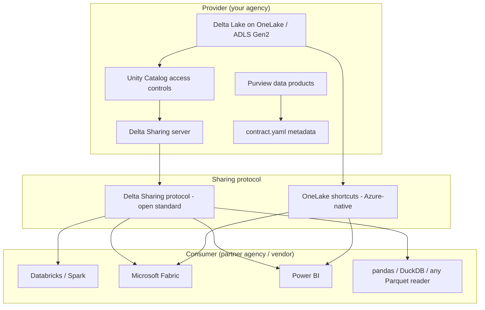

# Snowflake Data Sharing Migration Guide

**Status:** Authored 2026-04-30
**Audience:** Data architects, data stewards, partnership/interagency data teams
**Scope:** Secure Data Sharing to Delta Sharing + OneLake shortcuts, Marketplace to Fabric Data Marketplace, clean rooms comparison

---

## 1. Snowflake Secure Data Sharing: what you are leaving

Snowflake Secure Data Sharing is one of Snowflake's genuine strengths. Before migrating, understand what it provides:

- **Zero-copy sharing** -- data is not copied; consumers query the provider's storage
- **Intra-Snowflake only** -- both provider and consumer must be on Snowflake
- **Turnkey setup** -- create a share, add objects, grant to consumer account
- **Live data** -- consumers always see the latest version
- **Cross-region / cross-cloud replication** -- shares can be replicated to other Snowflake regions
- **Reader accounts** -- provider can create lightweight accounts for consumers without Snowflake licenses (but provider pays compute credits)
- **Secure views** -- share views with embedded security logic
- **Marketplace** -- public or private listings for data products

### What makes this hard to replace

The elegance of Snowflake sharing is the single-vendor assumption. Both sides are on Snowflake, so authorization, compute, and storage are unified. Moving to Azure means breaking this assumption and replacing it with open protocols.

---

## 2. Azure data sharing architecture

The Azure replacement is a three-layer stack:



### Delta Sharing (open protocol)

Delta Sharing is an open protocol created by Databricks and adopted by the Linux Foundation:

- **Open standard** -- any client that implements the protocol can consume shares
- **Cross-platform** -- works with Databricks, Spark, pandas, Power BI, Tableau, DuckDB
- **Cross-cloud** -- shares work across Azure, AWS, GCP
- **No consumer licensing required** -- recipients do not need a Databricks license
- **Provider controls access** -- shares are managed via Unity Catalog
- **Live or snapshot** -- shares can provide live table access or point-in-time snapshots

### OneLake shortcuts (Azure-native)

OneLake shortcuts are Azure-specific pointers to data stored elsewhere:

- **Zero-copy** -- data stays in place; shortcut is a pointer
- **Azure-to-Azure only** -- both sides must be on Azure (or Azure + S3/GCS)
- **Fabric-native** -- shortcuts appear as first-class objects in Fabric
- **Instant** -- no data movement, no replication delay
- **Governed** -- shortcuts respect Purview classifications and access controls

---

## 3. Migration mapping

### Share types

| Snowflake share type | Azure equivalent | Notes |
|---|---|---|
| Direct share (account-to-account) | Delta Sharing share + recipient | One-to-one sharing via activation link |
| Share with multiple consumers | Delta Sharing share + multiple recipients | One share, multiple activation links |
| Reader account | Delta Sharing recipient (no license needed) | Consumer brings own compute; no provider cost |
| Cross-region share | Delta Sharing (inherently cross-region) | Protocol is region-agnostic |
| Cross-cloud share (Snowflake-to-Snowflake) | Delta Sharing (inherently cross-cloud) | Protocol is cloud-agnostic |
| Secure view in share | Delta Sharing with view (Unity Catalog) | Share views, not just tables |
| Listing (Marketplace) | Purview data product + contract.yaml | Metadata, SLA, schema published as data product |
| Private listing | Purview data product (restricted access) | Access controlled via Entra ID groups |

### Object types in shares

| Snowflake shared object | Delta Sharing equivalent | Migration action |
|---|---|---|
| Table | Delta table share | Register table in Unity Catalog; add to share |
| Secure view | View share (Unity Catalog) | Create view in UC; add to share |
| Secure UDF | Not directly shared; wrap in view | Create a view that calls the UDF; share the view |
| Database | Schema share | Share at schema level in Unity Catalog |
| Schema | Schema share | Direct mapping |

---

## 4. Setting up Delta Sharing (provider side)

### Prerequisites

- Databricks workspace with Unity Catalog enabled
- Unity Catalog metastore with external sharing enabled
- Delta tables registered in Unity Catalog

### Step 1: Enable Delta Sharing on the metastore

```sql
-- Databricks SQL: Enable sharing on the metastore
-- (Usually done via workspace admin settings)
-- Verify sharing is enabled:
SELECT * FROM system.information_schema.catalogs
WHERE catalog_name = 'your_catalog';
```

### Step 2: Create a share

```sql
-- Create a share for a partner agency
CREATE SHARE IF NOT EXISTS partner_agency_finance_share
COMMENT 'Financial data shared with Partner Agency per MOU-2026-042';

-- Add tables to the share
ALTER SHARE partner_agency_finance_share
ADD TABLE finance_prod.marts.fct_invoice_aging;

ALTER SHARE partner_agency_finance_share
ADD TABLE finance_prod.marts.dim_vendors;

-- Add a schema (all current and future tables)
ALTER SHARE partner_agency_finance_share
ADD SCHEMA finance_prod.marts;
```

### Step 3: Create a recipient

```sql
-- Create a recipient for the consuming organization
CREATE RECIPIENT IF NOT EXISTS partner_agency_recipient
COMMENT 'Partner Agency data engineering team';

-- Grant the share to the recipient
GRANT SELECT ON SHARE partner_agency_finance_share
TO RECIPIENT partner_agency_recipient;
```

### Step 4: Distribute the activation link

```sql
-- Get the activation link for the recipient
DESCRIBE RECIPIENT partner_agency_recipient;
-- The activation_link column contains the one-time URL
-- Send this securely to the partner agency
```

### Step 5: Register as a Purview data product

Create a `contract.yaml` for the shared data product:

```yaml
# contract.yaml for shared data product
name: partner-agency-finance-share
version: "1.0"
description: "Financial data shared with Partner Agency per MOU-2026-042"
owner: finance-data-team@agency.gov
classification: cui_specified
sharing:
  protocol: delta-sharing
  share_name: partner_agency_finance_share
  recipients:
    - partner_agency_recipient
  refresh: live
  sla:
    availability: "99.5%"
    freshness: "15 minutes"
tables:
  - name: fct_invoice_aging
    schema: finance_prod.marts
    columns:
      - name: invoice_id
        type: string
        classification: pii
      - name: amount
        type: decimal(18,2)
      - name: aging_bucket
        type: string
```

---

## 5. Consuming Delta Shares (consumer side)

### Databricks consumer

```sql
-- Create a catalog from the share
CREATE CATALOG IF NOT EXISTS partner_finance_shared
USING SHARE provider_org.partner_agency_finance_share;

-- Query shared data (reads are live)
SELECT * FROM partner_finance_shared.marts.fct_invoice_aging
WHERE aging_bucket = '60+';
```

### Fabric consumer (OneLake shortcut)

1. Open the Fabric Lakehouse
2. Right-click the Tables folder and select "New shortcut"
3. Choose "Delta Sharing" as the source
4. Paste the activation link
5. Select tables to shortcut
6. Shared tables appear as native Lakehouse tables

### pandas / DuckDB consumer

```python
import delta_sharing

# Load the share profile (downloaded from activation link)
profile = delta_sharing.SharingProfile.read("config.share")

# List available tables
tables = delta_sharing.list_all_tables(profile)

# Read a shared table into pandas
df = delta_sharing.load_as_pandas(
    f"{profile.share_credentials_version}#"
    f"partner_agency_finance_share.marts.fct_invoice_aging"
)
```

---

## 6. OneLake shortcuts for Azure-to-Azure sharing

When both provider and consumer are on Azure, OneLake shortcuts are simpler:

### When to use OneLake shortcuts vs Delta Sharing

| Scenario | Use OneLake shortcuts | Use Delta Sharing |
|---|---|---|
| Both on Azure / Fabric | Preferred | Also works |
| Cross-cloud (Azure to AWS) | Not supported | Required |
| Consumer has no Databricks/Fabric | Not supported | Required (open protocol) |
| Need live data, no replication | Both work | Both work |
| Consumer needs pandas/DuckDB access | Not supported | Required |
| Simplest possible setup | Preferred | More steps |

### Setting up OneLake shortcuts

1. **Provider:** Ensure data is in OneLake or ADLS Gen2
2. **Provider:** Grant the consumer's Entra identity read access to the storage container
3. **Consumer:** In Fabric Lakehouse, create a shortcut pointing to the provider's ADLS Gen2 path or OneLake path
4. **Consumer:** Data appears as a native table -- no copy, no replication

---

## 7. Marketplace migration

### Snowflake Marketplace to Fabric Data Marketplace

| Snowflake Marketplace feature | Fabric / Purview equivalent |
|---|---|
| Public listings | Purview data products (public catalog) |
| Private listings | Purview data products (restricted access) |
| Provider profiles | Purview data source documentation |
| Consumer discovery | Purview catalog search + Fabric Data Marketplace |
| Usage analytics | Purview audit logs + sharing activity |
| Sample data | contract.yaml with sample schema + preview |
| Auto-fulfillment | Delta Sharing activation link |
| Pricing / monetization | Custom (not built-in; handle via procurement) |

### Migrating existing Marketplace listings

For each Snowflake Marketplace listing:

1. Create a Delta Sharing share with the listed tables
2. Create a `contract.yaml` documenting the data product
3. Register the data product in Purview
4. Update the listing documentation with the new access method
5. Distribute activation links to existing consumers
6. Notify consumers of the migration timeline

---

## 8. Clean rooms comparison

### Snowflake Clean Rooms

Snowflake offers a purpose-built clean-room product:

- Two parties bring data into a shared environment
- Computation runs on agreed-upon queries only
- Neither party sees the other's raw data
- Result is aggregate or anonymized
- Single-vendor, integrated UX

### Azure clean-room equivalent

Azure requires stitching multiple services:

- **Delta Sharing** -- each party shares selected tables
- **Purview** -- classifications enforce data boundaries
- **Azure Confidential Computing** -- encrypted enclaves for sensitive computation
- **Unity Catalog row/column security** -- restrict access to agreed columns
- **Azure Logic Apps** -- orchestrate approved query patterns

### Honest assessment

Snowflake's clean-room UX is more integrated. For agencies where clean rooms are a primary workload, this is a genuine gap. For most federal data-sharing scenarios (interagency MOU-based sharing, partner data exchange), Delta Sharing + Purview is sufficient and more flexible.

---

## 9. Migration execution checklist

### Per-share migration

- [ ] Inventory all Snowflake shares (provider and consumer side)
- [ ] Document each share: objects, consumers, refresh frequency, SLA
- [ ] Create Delta Sharing shares in Unity Catalog
- [ ] Register data products in Purview with contract.yaml
- [ ] Generate activation links for each consumer
- [ ] Contact each consumer with migration timeline
- [ ] Set up consumer access (Databricks catalog, Fabric shortcut, or pandas profile)
- [ ] Validate data parity (row counts, schema, freshness)
- [ ] Run parallel (Snowflake share + Delta share) for 2+ weeks
- [ ] Cutover consumers to Delta Sharing
- [ ] Revoke Snowflake shares after confirmation
- [ ] Update MOU/DUA documentation to reference new sharing method

### Common issues during migration

| Issue | Resolution |
|---|---|
| Consumer does not have Databricks or Fabric | Provide Delta Sharing profile; consumer uses pandas or DuckDB |
| Consumer requires Snowflake-specific format | Negotiate format or provide CSV/Parquet export as bridge |
| Share includes secure UDFs | Rewrite UDFs as views; share the views |
| Cross-region latency concerns | Delta Sharing supports regional endpoints; data stays in provider region |
| Consumer needs real-time data | Delta Sharing provides live access to latest Delta version |

---

## Related documents

- [Tutorial: Data Sharing to Delta](tutorial-data-sharing-to-delta.md) -- step-by-step hands-on tutorial
- [Feature Mapping](feature-mapping-complete.md) -- Section 8 for data sharing features
- [Security Migration](security-migration.md) -- access control for shared data
- [Master playbook](../snowflake.md) -- Section 5, Phase 6 for data sharing cutover

---

**Last updated:** 2026-04-30
**Maintainers:** CSA-in-a-Box core team
