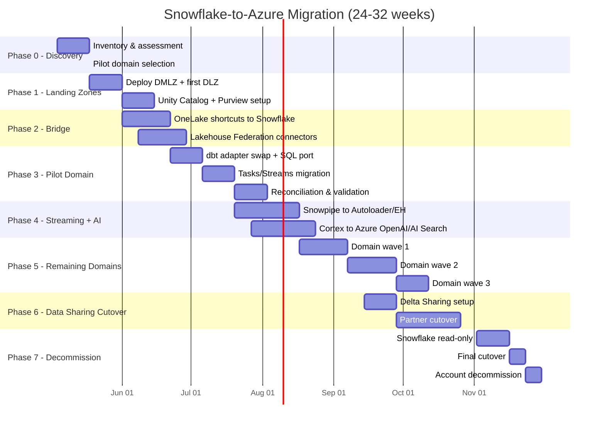

# Snowflake-to-Azure Migration Package

**Status:** Authored 2026-04-30
**Audience:** Federal CIO / CDO / Chief Data Architect and implementation teams running Snowflake tenants (commercial or Snowflake Government)
**Scope:** Full capability-by-capability migration from Snowflake to the csa-inabox reference platform on Microsoft Azure

---

## Quick-start decision matrix

Before diving into the detailed guides, use this matrix to identify which documents matter most for your migration profile.

| Your situation                  | Start here                                                     | Then read                                                      |
| ------------------------------- | -------------------------------------------------------------- | -------------------------------------------------------------- |
| Executive briefing needed       | [Why Azure over Snowflake](why-azure-over-snowflake.md)        | [TCO Analysis](tco-analysis.md)                                |
| FedRAMP High or IL4/IL5 mandate | [Federal Migration Guide](federal-migration-guide.md)          | [Security Migration](security-migration.md)                    |
| Cost justification required     | [TCO Analysis](tco-analysis.md)                                | [Benchmarks](benchmarks.md)                                    |
| dbt-on-Snowflake shop           | [Tutorial: dbt Migration](tutorial-dbt-snowflake-to-fabric.md) | [Warehouse Migration](warehouse-migration.md)                  |
| Heavy Cortex / AI usage         | [Cortex Migration](cortex-migration.md)                        | [Tutorial: Cortex to Azure AI](tutorial-cortex-to-azure-ai.md) |
| Data Sharing is critical        | [Data Sharing Migration](data-sharing-migration.md)            | [Tutorial: Delta Sharing](tutorial-data-sharing-to-delta.md)   |
| Snowpark Python/Java workloads  | [Snowpark Migration](snowpark-migration.md)                    | [Feature Mapping](feature-mapping-complete.md)                 |
| Streams / Tasks / CDC pipelines | [Streams & Tasks Migration](streams-tasks-migration.md)        | [Best Practices](best-practices.md)                            |
| Need the full feature map       | [Feature Mapping (50+ features)](feature-mapping-complete.md)  | [Benchmarks](benchmarks.md)                                    |

---

## Document index

### Strategic

| Document                                                | Lines | Description                                                  |
| ------------------------------------------------------- | ----- | ------------------------------------------------------------ |
| [Why Azure over Snowflake](why-azure-over-snowflake.md) | ~400  | Executive white paper: compliance, openness, AI, pricing     |
| [TCO Analysis](tco-analysis.md)                         | ~400  | Credit pricing vs Fabric CU, 5-year projections, 3 scenarios |
| [Benchmarks](benchmarks.md)                             | ~350  | Query performance, scaling, streaming latency, AI throughput |

### Migration guides

| Document                                                  | Lines | Description                                                  |
| --------------------------------------------------------- | ----- | ------------------------------------------------------------ |
| [Feature Mapping (Complete)](feature-mapping-complete.md) | ~450  | 50+ Snowflake features mapped to Azure equivalents           |
| [Warehouse Migration](warehouse-migration.md)             | ~400  | Multi-cluster warehouses to Databricks SQL / Fabric capacity |
| [Data Sharing Migration](data-sharing-migration.md)       | ~350  | Secure Data Sharing to Delta Sharing + OneLake shortcuts     |
| [Snowpark Migration](snowpark-migration.md)               | ~350  | Snowpark Python/Java/Scala to Fabric notebooks / Databricks  |
| [Cortex Migration](cortex-migration.md)                   | ~400  | Cortex LLM, Search, Analyst, Guard to Azure AI services      |
| [Streams & Tasks Migration](streams-tasks-migration.md)   | ~350  | Streams, Tasks, Dynamic Tables to ADF, Databricks, dbt       |
| [Security Migration](security-migration.md)               | ~350  | Network policies, masking, RBAC, hierarchy mapping           |
| [Federal Migration Guide](federal-migration-guide.md)     | ~400  | FedRAMP gap analysis, IL coverage, procurement, ATO path     |

### Hands-on tutorials

| Document                                                                 | Lines | Description                                              |
| ------------------------------------------------------------------------ | ----- | -------------------------------------------------------- |
| [Tutorial: dbt Snowflake to Fabric](tutorial-dbt-snowflake-to-fabric.md) | ~400  | Step-by-step dbt adapter swap, SQL dialect, testing      |
| [Tutorial: Cortex to Azure AI](tutorial-cortex-to-azure-ai.md)           | ~350  | Replace Cortex functions with Azure OpenAI, build RAG    |
| [Tutorial: Data Sharing to Delta](tutorial-data-sharing-to-delta.md)     | ~350  | Replace Secure Data Sharing with Delta Sharing + OneLake |

### Operational

| Document                            | Lines | Description                                              |
| ----------------------------------- | ----- | -------------------------------------------------------- |
| [Best Practices](best-practices.md) | ~350  | Warehouse-by-warehouse migration, parallel-run, pitfalls |

---

## Migration timeline (Gantt)

This chart reflects a typical mid-sized federal Snowflake tenant (50-200 dbt models, 5-30 warehouses, 10-50 TB hot data). Adjust durations to your scale.

---

## Related resources

- **Master playbook:** [docs/migrations/snowflake.md](../snowflake.md) -- the original 488-line migration playbook
- **Migration index:** [docs/migrations/README.md](../README.md)
- **Companion playbooks:** [Palantir Foundry](../palantir-foundry.md) | [AWS to Azure](../aws-to-azure.md) | [GCP to Azure](../gcp-to-azure.md)
- **Decision trees:** `docs/decisions/fabric-vs-databricks-vs-synapse.md`, `docs/decisions/batch-vs-streaming.md`
- **ADRs:** `docs/adr/0001-adf-dbt-over-airflow.md` through `docs/adr/0010-fabric-strategic-target.md`
- **Compliance:** `docs/compliance/nist-800-53-rev5.md`, `docs/compliance/cmmc-2.0-l2.md`, `docs/compliance/hipaa-security-rule.md`

---

**Last updated:** 2026-04-30
**Maintainers:** CSA-in-a-Box core team
