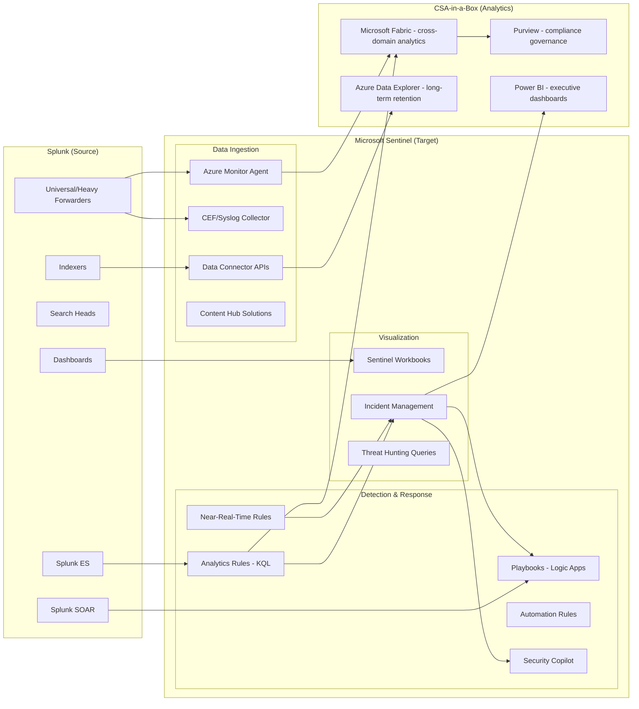

# Migrating from Splunk to Microsoft Sentinel

**Status:** Authored 2026-04-30
**Audience:** SOC Analysts, Security Architects, CISOs, Federal Security Teams
**Scope:** Full migration from Splunk Enterprise / Splunk Cloud to Microsoft Sentinel with CSA-in-a-Box security analytics integration.

---

!!! tip "Expanded Migration Center Available"
This playbook is the concise migration reference. For the complete Splunk-to-Sentinel migration package -- including executive briefs, TCO analysis, SPL-to-KQL conversion tutorials, SOAR migration, federal guidance, and benchmarks -- visit the **[Splunk to Sentinel Migration Center](splunk-to-sentinel/index.md)**.

    **Quick links:**

    - [Why Sentinel over Splunk (Executive Brief)](splunk-to-sentinel/why-sentinel-over-splunk.md)
    - [Total Cost of Ownership Analysis](splunk-to-sentinel/tco-analysis.md)
    - [Complete Feature Mapping (50+ features)](splunk-to-sentinel/feature-mapping-complete.md)
    - [Detection Rules Migration (SPL to KQL)](splunk-to-sentinel/detection-rules-migration.md)
    - [SOAR Migration Guide](splunk-to-sentinel/soar-migration.md)
    - [Federal Migration Guide](splunk-to-sentinel/federal-migration-guide.md)
    - [Tutorials & Walkthroughs](splunk-to-sentinel/index.md#tutorials)
    - [Benchmarks & Performance](splunk-to-sentinel/benchmarks.md)
    - [Best Practices](splunk-to-sentinel/best-practices.md)

    **Migration guides by domain:** [Detection Rules](splunk-to-sentinel/detection-rules-migration.md) | [SOAR](splunk-to-sentinel/soar-migration.md) | [Data Connectors](splunk-to-sentinel/data-connector-migration.md) | [Dashboards](splunk-to-sentinel/dashboard-migration.md) | [Historical Data](splunk-to-sentinel/historical-data-migration.md)

---

## 1. Executive summary

Cisco's $28B acquisition of Splunk has created strategic uncertainty for federal agencies and enterprises that built their security operations on Splunk Enterprise and Splunk Cloud. License renewals are climbing, product roadmap clarity is diminishing, and the market is consolidating around cloud-native SIEM platforms with AI-native capabilities.

Microsoft Sentinel is the cloud-native SIEM/SOAR platform built on Azure. It eliminates infrastructure management, provides consumption-based pricing (pay-per-GB ingestion rather than Splunk's volume-based licensing), and integrates natively with the Microsoft security stack -- Defender XDR, Entra ID, Purview, and Security Copilot. For federal agencies, Sentinel is available in Azure Government with FedRAMP High authorization, IL4/IL5 coverage, and a growing installed base across DoD and civilian agencies.

**CSA-in-a-Box extends the migration story.** Security data that lands in Sentinel and Log Analytics does not have to stay siloed in the SIEM. CSA-in-a-Box provides the analytics and governance landing zone -- Microsoft Fabric for cross-domain security analytics, Purview for compliance-grade data governance, Power BI for executive security dashboards, and Azure Data Explorer for long-term threat hunting over archived security telemetry. The migration is not just Splunk to Sentinel; it is Splunk to a unified security analytics platform.

Microsoft has built a dedicated **SIEM Migration Experience** in the Defender portal with Copilot-powered SPL-to-KQL conversion that automates the most labor-intensive part of any SIEM migration: translating detection rules.

---

## 2. Why migrate now

| Driver                              | Detail                                                                                                                                                                                                                         |
| ----------------------------------- | ------------------------------------------------------------------------------------------------------------------------------------------------------------------------------------------------------------------------------ |
| **Cisco acquisition uncertainty**   | Splunk's product roadmap is being subsumed into Cisco's security portfolio. Federal customers report uncertainty on long-term Splunk Enterprise support, pricing trajectory, and feature investment.                           |
| **Volume-based licensing pressure** | Splunk's per-GB ingest pricing penalizes data growth. Security telemetry volumes are increasing 30-40% YoY across federal agencies. Sentinel's consumption model and free Microsoft data tiers provide structural cost relief. |
| **AI-native security**              | Security Copilot integration in Sentinel provides natural-language threat hunting, automated incident triage, and KQL query generation. Splunk's AI capabilities require add-on products.                                      |
| **Unified Microsoft stack**         | Organizations already using Microsoft 365, Entra ID, Defender XDR, and Azure get zero-friction integration. Splunk requires custom apps and add-ons for each Microsoft data source.                                            |
| **Cloud-native architecture**       | No indexer clusters, search heads, or heavy forwarders to manage. Sentinel scales automatically on Azure infrastructure.                                                                                                       |
| **Federal compliance**              | Sentinel in Azure Government meets FedRAMP High, IL4/IL5. The SIEM Migration Experience accelerates ATO timelines by preserving detection coverage.                                                                            |

---

## 3. Migration architecture overview

---

## 4. Migration phases

### Phase 0 -- Discovery and assessment (Weeks 1-2)

Inventory the Splunk environment:

- **Data sources:** all inputs, forwarder deployments, sourcetypes, indexes
- **Detection rules:** correlation searches (Splunk ES), scheduled searches, alerts
- **SOAR playbooks:** automation workflows, integrations, custom scripts
- **Dashboards and reports:** views, panels, drill-downs, scheduled reports
- **Users and roles:** RBAC mapping to Entra ID groups
- **Data volumes:** daily ingestion rates by sourcetype, retention policies

**Artifacts:** Splunk inventory spreadsheet, data-source-to-connector mapping, detection-rule export (SPL files), SOAR playbook inventory.

### Phase 1 -- Sentinel deployment and data connectors (Weeks 3-6)

1. Deploy Log Analytics workspace (or leverage existing CSA-in-a-Box workspace)
2. Enable Microsoft Sentinel on the workspace
3. Deploy Content Hub solutions for each data source category
4. Configure Azure Monitor Agent (AMA) on endpoints replacing Splunk Universal Forwarders
5. Set up CEF/syslog collectors for network devices and firewalls
6. Enable native Microsoft connectors (Defender XDR, Entra ID, Office 365)
7. Validate data flow -- confirm events arriving in correct tables

### Phase 2 -- Detection rule migration (Weeks 7-12)

1. Export Splunk correlation searches and scheduled alerts
2. Use the **SIEM Migration Experience** in the Defender portal to upload SPL rules
3. Review Copilot-translated KQL rules -- accept, modify, or reject each
4. Deploy analytics rules (scheduled and NRT) to Sentinel
5. Map Splunk notables to Sentinel incidents with entity mapping
6. Validate detection coverage against MITRE ATT&CK framework

### Phase 3 -- SOAR and automation migration (Weeks 13-16)

1. Map Splunk SOAR playbooks to Sentinel playbook templates (Logic Apps)
2. Build automation rules for incident routing, enrichment, and response
3. Integrate Security Copilot for AI-assisted triage
4. Test end-to-end: alert fires, incident created, playbook executes, analyst notified

### Phase 4 -- Dashboard and reporting migration (Weeks 17-20)

1. Map Splunk dashboards to Sentinel workbook templates
2. Convert SPL dashboard queries to KQL
3. Build custom workbooks for SOC-specific views
4. Deploy Power BI dashboards for executive reporting via CSA-in-a-Box

### Phase 5 -- Historical data and parallel run (Weeks 21-28)

1. Export critical Splunk index data for historical investigation needs
2. Ingest into Azure Data Explorer (ADX) for long-term retention
3. Run Splunk and Sentinel in parallel -- validate detection parity
4. Train SOC analysts on KQL, Sentinel UI, and Security Copilot
5. Gradually shift SOC operations to Sentinel

### Phase 6 -- Cutover and decommission (Weeks 29-32)

1. Final detection coverage validation (MITRE ATT&CK mapping comparison)
2. Full SOC cutover to Sentinel
3. Splunk forwarder decommission
4. Splunk license end-of-life
5. Archive remaining Splunk data to Azure Blob Storage

---

## 5. SPL to KQL -- quick reference

The most common conversion patterns:

| SPL pattern                                    | KQL equivalent                                                                            |
| ---------------------------------------------- | ----------------------------------------------------------------------------------------- |
| `index=main sourcetype=syslog`                 | `Syslog \| where Facility == "auth"`                                                      |
| `search ... \| stats count by src_ip`          | `... \| summarize count() by SrcIP`                                                       |
| `\| eval risk_score=if(count>10,"high","low")` | `\| extend risk_score = iff(count_ > 10, "high", "low")`                                  |
| `\| timechart span=1h count by status`         | `\| summarize count() by bin(TimeGenerated, 1h), Status`                                  |
| `\| rex field=_raw "user=(?<username>\w+)"`    | `\| extend username = extract("user=(\\w+)", 1, RawData)`                                 |
| `\| lookup threat_intel ip AS src_ip`          | `\| join kind=leftouter (ThreatIntelligenceIndicator) on $left.SrcIP == $right.NetworkIP` |
| `\| transaction session_id maxspan=30m`        | `\| summarize ... by session_id, bin(TimeGenerated, 30m)`                                 |
| `\| where isnotnull(user)`                     | `\| where isnotempty(user)`                                                               |

For 20+ detailed conversions with explanations, see [Tutorial: SPL to KQL](splunk-to-sentinel/tutorial-spl-to-kql.md).

---

## 6. CSA-in-a-Box integration for security analytics

CSA-in-a-Box extends Sentinel from a SIEM into a full security analytics platform:

| Capability                          | Service                    | How it connects                                                                                                                                                   |
| ----------------------------------- | -------------------------- | ----------------------------------------------------------------------------------------------------------------------------------------------------------------- |
| **Cross-domain security analytics** | Microsoft Fabric           | Query Sentinel data alongside business data in Fabric lakehouses for correlation analysis (e.g., insider threat detection combining HR data with security events) |
| **Compliance data governance**      | Microsoft Purview          | Classify and govern security telemetry under FedRAMP, CMMC, HIPAA compliance frameworks using CSA-in-a-Box compliance matrices                                    |
| **Executive security dashboards**   | Power BI                   | Direct Lake semantic models over security data for board-level reporting -- mean time to detect, incident trends, compliance posture                              |
| **Long-term threat hunting**        | Azure Data Explorer        | Archive years of security telemetry at low cost; run retrospective hunts against historical data with sub-second KQL performance                                  |
| **Security data mesh**              | CSA-in-a-Box data products | Publish curated security datasets as governed data products -- threat intelligence enrichment tables, compliance audit logs, incident metrics                     |

---

## 7. Federal considerations

- **FedRAMP High:** Sentinel in Azure Government inherits FedRAMP High authorization. CSA-in-a-Box compliance matrices (`csa_platform/csa_platform/governance/compliance/nist-800-53-rev5.yaml`) map SIEM controls.
- **IL4/IL5:** Full Sentinel support in Azure Government for IL4; IL5 support available for most Sentinel capabilities.
- **CISA CDM:** Sentinel integrates with CISA CDM feeds; Content Hub provides CDM-aligned workbooks.
- **Event retention:** Federal agencies typically require 12-month online + 7-year archive. Sentinel supports 90-day interactive + Log Analytics archive tier + ADX for extended retention.
- **Splunk in federal:** Splunk holds dominant SIEM market share across DoD and civilian agencies. The SIEM Migration Experience was designed specifically to reduce migration risk for large Splunk deployments.

---

## 8. Cost comparison (illustrative)

For a **typical federal SOC** (50 TB/month ingestion, 200 SOC analysts, 500+ detection rules):

| Cost element             | Splunk Enterprise (annual)                     | Microsoft Sentinel (annual)                               |
| ------------------------ | ---------------------------------------------- | --------------------------------------------------------- |
| License / ingestion      | $3.0M - $5.0M (volume-based)                   | $1.2M - $2.0M (pay-per-GB + commitment tiers)             |
| Infrastructure           | $800K - $1.2M (indexer clusters, search heads) | $0 (cloud-native, no infrastructure)                      |
| Admin FTE (platform ops) | $400K - $600K (3-4 Splunk admins)              | $150K - $250K (1-2 cloud ops)                             |
| SOAR platform            | $300K - $500K (Splunk SOAR license)            | $0 (Logic Apps included, pay-per-execution)               |
| Free Microsoft data      | N/A                                            | -$500K - -$800K (M365, Entra, Defender at no ingest cost) |
| **Total annual**         | **$4.5M - $7.3M**                              | **$1.0M - $2.3M**                                         |

See [TCO Analysis](splunk-to-sentinel/tco-analysis.md) for detailed 3-year projections.

---

## 9. Risk mitigation

| Risk                                    | Mitigation                                                                              |
| --------------------------------------- | --------------------------------------------------------------------------------------- |
| Detection coverage gap during migration | Parallel-run period (Phase 5); MITRE ATT&CK coverage mapping before and after           |
| SPL-to-KQL translation errors           | SIEM Migration Experience + manual review of critical rules; SOC analyst validation     |
| SOC analyst resistance                  | Training program (SPL to KQL), Security Copilot as force multiplier, gradual transition |
| Historical data loss                    | Export and archive to ADX/Azure Blob before Splunk decommission                         |
| Compliance re-certification             | CSA-in-a-Box compliance matrices provide control mapping continuity                     |

---

## 10. Related resources

- **Migration index:** [docs/migrations/README.md](README.md)
- **Sentinel SIEM Migration Experience:** [Tutorial](splunk-to-sentinel/tutorial-siem-migration-tool.md)
- **SPL to KQL conversion guide:** [Tutorial](splunk-to-sentinel/tutorial-spl-to-kql.md)
- **Federal migration guide:** [Federal Guide](splunk-to-sentinel/federal-migration-guide.md)
- **CSA-in-a-Box compliance matrices:**
    - `docs/compliance/nist-800-53-rev5.md`
    - `docs/compliance/fedramp-moderate.md`
    - `docs/compliance/cmmc-2.0-l2.md`
- **CSA-in-a-Box cybersecurity example:** `examples/cybersecurity/` (MITRE ATT&CK reference implementation)
- **Microsoft Learn references:**
    - [Microsoft Sentinel documentation](https://learn.microsoft.com/azure/sentinel/)
    - [SIEM Migration Experience](https://learn.microsoft.com/azure/sentinel/siem-migration)
    - [KQL reference](https://learn.microsoft.com/kusto/query/)

---

**Maintainers:** csa-inabox core team
**Last updated:** 2026-04-30
