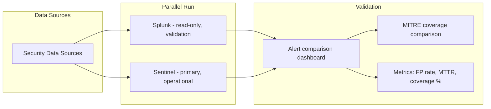

# Best Practices: Splunk to Sentinel Migration

**Status:** Authored 2026-04-30
**Audience:** SOC Managers, Security Architects, Migration Project Leads
**Purpose:** Proven best practices for executing a successful Splunk-to-Sentinel migration with CSA-in-a-Box security analytics integration

---

## 1. Migration strategy: use-case-by-use-case

### The golden rule: do not attempt a big-bang migration

The single most important best practice: migrate **use case by use case**, not all at once. A use case is a complete detection-and-response workflow: data source + detection rule + response playbook + dashboard.

**Example use cases:**

| Use case              | Data source               | Detection                 | Response                  | Dashboard                 |
| --------------------- | ------------------------- | ------------------------- | ------------------------- | ------------------------- |
| Brute force detection | Windows Security Events   | Failed logon threshold    | Disable account playbook  | Authentication workbook   |
| Phishing response     | Office 365 + Defender     | Malicious email detection | Block sender + quarantine | Email security workbook   |
| Lateral movement      | Firewall + endpoint       | RDP/SMB anomaly           | Isolate host playbook     | Network activity workbook |
| Data exfiltration     | Proxy + DLP               | Large upload detection    | Block + notify playbook   | DLP workbook              |
| Insider threat        | HR data + security events | Behavioral anomaly        | Investigation playbook    | Insider risk workbook     |

### Migration order

Migrate use cases in this order:

**Phase 1 -- Low risk, high value (Weeks 3-8):**

1. Microsoft-native data sources (M365, Entra ID, Defender XDR)
2. Detection rules that operate on these free data sources
3. Basic automation (assign, tag, notify)
4. Overview dashboards

**Why first:** These data sources are free to ingest, natively integrated, and represent the lowest migration risk. Quick wins build confidence.

**Phase 2 -- Core security operations (Weeks 9-16):**

1. Perimeter security (firewall, IDS/IPS via CEF)
2. Endpoint security (Windows/Linux via AMA)
3. Core detection rules (brute force, port scan, malware)
4. Primary SOAR playbooks (block, disable, isolate)
5. SOC operational dashboards

**Why second:** These are the bread-and-butter SOC operations. They require data connector deployment (AMA, CEF forwarders) but are well-understood use cases with high Content Hub coverage.

**Phase 3 -- Advanced analytics (Weeks 17-24):**

1. Cloud security (AWS, GCP, Azure)
2. Identity analytics (behavioral, impossible travel)
3. Advanced detection rules (multi-stage, statistical)
4. Complex SOAR playbooks (multi-step orchestration)
5. Threat hunting queries and notebooks

**Why third:** These require more sophisticated KQL and deeper Sentinel knowledge. SOC analysts have built KQL proficiency by this point.

**Phase 4 -- Specialized and compliance (Weeks 25-32):**

1. Compliance-specific use cases (PCI, HIPAA, FISMA)
2. Custom data sources and proprietary formats
3. Executive/CISO dashboards (Power BI via CSA-in-a-Box)
4. Long-term historical data migration to ADX
5. Remaining Splunk-specific automation

---

## 2. Parallel-run strategy

### Why parallel run is essential

Running Splunk and Sentinel simultaneously for a period is critical for:

- **Detection coverage validation** -- confirm Sentinel catches what Splunk catches
- **SOC analyst confidence** -- analysts can verify Sentinel behavior against familiar Splunk
- **False positive tuning** -- identify and fix KQL translations that behave differently than SPL
- **Stakeholder assurance** -- demonstrate to leadership that migration is safe

### Parallel-run implementation



### Parallel-run checklist

| Week  | Activity                    | Success criteria                                    |
| ----- | --------------------------- | --------------------------------------------------- |
| 1-2   | Dual data flow established  | Same events arriving in both SIEMs                  |
| 3-4   | Alert comparison baseline   | Side-by-side alert counts documented                |
| 5-6   | Detection parity validation | < 5% alert count variance for same time period      |
| 7-8   | False positive comparison   | Sentinel FP rate within 20% of Splunk               |
| 9-10  | SOC analyst validation      | Analysts confirm investigation workflows functional |
| 11-12 | Stakeholder sign-off        | CISO/AO approves cutover readiness                  |

### Dual-forwarding configuration

During parallel run, data sources send to both SIEMs:

```bash
# For syslog/CEF sources: configure rsyslog to forward to both
# /etc/rsyslog.d/60-dual-forward.conf

# Forward to Splunk Heavy Forwarder
*.* @@splunk-hf.agency.gov:514

# Forward to Sentinel AMA log forwarder
*.* @@sentinel-forwarder.agency.gov:514
```

For Windows endpoints, run both Splunk UF and AMA simultaneously during the parallel period.

---

## 3. Detection coverage validation

### MITRE ATT&CK coverage mapping

Before migration, document your Splunk detection coverage by MITRE ATT&CK technique:

**Splunk (export current coverage):**

```spl
| rest /servicesNS/-/-/saved/searches
| search action.correlationsearch.enabled=1
| rename action.correlationsearch.annotations.mitre_attack as mitre
| mvexpand mitre
| stats count by mitre
```

**Sentinel (verify post-migration coverage):**

```kql
SecurityAlert
| where TimeGenerated > ago(30d)
| extend Tactics = parse_json(ExtendedProperties).Tactics
| mv-expand Tactics
| summarize RuleCount = dcount(AlertName) by tostring(Tactics)
| sort by RuleCount desc
```

### Coverage gap resolution

| Gap type                           | Resolution                                     |
| ---------------------------------- | ---------------------------------------------- |
| Rule not migrated yet              | Prioritize migration of missing rule           |
| Rule migrated but not firing       | Check data connector, validate KQL query       |
| SPL feature not translatable       | Rewrite detection logic in KQL from scratch    |
| No Splunk equivalent existed       | Deploy Content Hub solution for the technique  |
| Sentinel-native coverage available | Enable Fusion or UEBA rules (net-new coverage) |

---

## 4. SOC analyst training program

### Training curriculum

| Week | Topic                                                  | Format                  | Duration |
| ---- | ------------------------------------------------------ | ----------------------- | -------- |
| 1    | KQL fundamentals (SPL comparison)                      | Instructor-led workshop | 8 hours  |
| 2    | Sentinel navigation and incident management            | Hands-on lab            | 4 hours  |
| 3    | Threat hunting in Sentinel (KQL for hunters)           | Hands-on lab            | 8 hours  |
| 4    | Workbook creation and customization                    | Hands-on lab            | 4 hours  |
| 5    | Security Copilot for analysts                          | Demo + hands-on         | 4 hours  |
| 6    | Playbook creation (Logic Apps basics)                  | Hands-on lab            | 4 hours  |
| 7    | Advanced KQL (joins, ML functions, ADX cross-query)    | Instructor-led          | 8 hours  |
| 8    | SOC workflow validation (hands-on with real incidents) | Shadow/mentored         | 40 hours |

### KQL proficiency milestones

| Level                 | KQL skills                                           | SPL equivalent proficiency                    | Recommended for              |
| --------------------- | ---------------------------------------------------- | --------------------------------------------- | ---------------------------- |
| **L1 (Beginner)**     | Basic `where`, `summarize`, `project`                | `search`, `stats`, `table`                    | Tier 1 analysts              |
| **L2 (Intermediate)** | `join`, `extend`, `let`, `extract`                   | `join`, `eval`, `rex`, subsearches            | Tier 2 analysts              |
| **L3 (Advanced)**     | Window functions, ML functions, cross-workspace, ADX | `eventstats`, `transaction`, `tstats`, macros | Detection engineers, hunters |
| **L4 (Expert)**       | Custom functions, DCR transforms, API integration    | Custom commands, apps, admin                  | Platform engineers           |

### Security Copilot as training accelerator

Security Copilot dramatically reduces the KQL learning curve:

1. **Natural language to KQL:** Analysts describe what they want to find; Copilot generates the query
2. **Query explanation:** Analysts paste a KQL query; Copilot explains what it does
3. **Query optimization:** Copilot suggests improvements to existing queries
4. **SPL-to-KQL translation:** Analysts paste an SPL query; Copilot translates to KQL

**Training exercise:** Have analysts use Copilot to translate their 10 most-used Splunk searches to KQL. This builds both Copilot and KQL proficiency simultaneously.

---

## 5. Data quality validation

### Ensuring data parity

During migration, validate that Sentinel receives the same data quality as Splunk:

```kql
// Data completeness check: compare event counts per source
// Run daily during parallel-run period
union withsource=TableName *
| where TimeGenerated between (ago(24h) .. now())
| summarize EventCount = count() by TableName
| sort by EventCount desc
// Compare with equivalent Splunk query:
// | metadata type=sourcetypes | table sourcetype, totalCount
```

### Field mapping validation

Ensure critical fields are present and correctly mapped:

```kql
// Validate field completeness for security events
SecurityEvent
| where TimeGenerated > ago(1h)
| summarize
    TotalEvents = count(),
    HasSourceIP = countif(isnotempty(IpAddress)),
    HasAccount = countif(isnotempty(TargetAccount)),
    HasComputer = countif(isnotempty(Computer)),
    HasEventID = countif(isnotempty(EventID))
| extend
    SourceIP_Pct = round(100.0 * HasSourceIP / TotalEvents, 1),
    Account_Pct = round(100.0 * HasAccount / TotalEvents, 1),
    Computer_Pct = round(100.0 * HasComputer / TotalEvents, 1)
```

---

## 6. CSA-in-a-Box security analytics integration

### When to set up CSA-in-a-Box

Deploy CSA-in-a-Box security analytics capabilities **after Phase 2** (core security operations) of the migration, when Sentinel is handling primary detection:

| CSA-in-a-Box capability              | When to deploy                                | Prerequisites                                      |
| ------------------------------------ | --------------------------------------------- | -------------------------------------------------- |
| **ADX long-term retention**          | Phase 2 (alongside historical data migration) | ADX cluster deployed, data export configured       |
| **Power BI executive dashboards**    | Phase 3 (advanced analytics)                  | Semantic model over Log Analytics, Fabric capacity |
| **Fabric cross-domain analytics**    | Phase 4 (specialized use cases)               | Fabric workspace, Sentinel data export             |
| **Purview security data governance** | Phase 4 (compliance)                          | Purview instance, Log Analytics scan configured    |
| **Security data products**           | Phase 4 (compliance)                          | Data product contracts, portal marketplace         |

### Cross-domain security analytics patterns

The unique value of CSA-in-a-Box for security: combining SIEM data with business data in Fabric:

| Pattern                  | Security data (Sentinel)               | Business data (CSA-in-a-Box)                       | Insight                                              |
| ------------------------ | -------------------------------------- | -------------------------------------------------- | ---------------------------------------------------- |
| **Insider threat**       | Authentication anomalies, DLP alerts   | HR data (termination notices, performance reviews) | Correlate security anomalies with HR risk indicators |
| **Fraud detection**      | Account takeover alerts, geo-anomalies | Financial transactions, approval workflows         | Link compromised accounts to fraudulent transactions |
| **Compliance reporting** | Audit events, access logs              | Asset inventory, data classification               | Automated compliance evidence for FISMA/FedRAMP      |
| **Supply chain risk**    | Vendor access patterns, API usage      | Procurement data, vendor risk ratings              | Monitor vendor access against risk profile           |

### Security data product example

Publish a curated "Incident Metrics" data product via CSA-in-a-Box:

```yaml
# domains/security/data-products/incident-metrics/contract.yaml
data_product: incident_metrics
domain: security_operations
owner: soc_engineering_team
model: gold.fact_incident_metrics
classification: internal
columns:
    - name: incident_id
      data_type: string
      tests: [not_null, unique]
    - name: created_date
      data_type: date
      tests: [not_null]
    - name: severity
      data_type: string
      tests: [accepted_values: [critical, high, medium, low, informational]]
    - name: time_to_triage_minutes
      data_type: integer
    - name: time_to_resolve_minutes
      data_type: integer
    - name: mitre_tactics
      data_type: string
    - name: automated_resolution
      data_type: boolean
sla:
    freshness: PT1H
    availability: 99.5
consumers:
    - ciso_office
    - compliance_team
    - risk_management
compliance:
    frameworks: [fedramp_high, nist_800_53]
```

---

## 7. Change management

### Stakeholder communication plan

| Audience                       | Message                                            | Frequency                       | Medium                      |
| ------------------------------ | -------------------------------------------------- | ------------------------------- | --------------------------- |
| **CISO / Security leadership** | Migration progress, risk posture, cost savings     | Weekly                          | Executive briefing          |
| **SOC analysts (Tier 1-3)**    | Training schedule, KQL resources, workflow changes | Weekly                          | Team meetings + Slack/Teams |
| **Detection engineering**      | Rule migration status, coverage gaps, KQL patterns | Daily (during active migration) | Stand-up                    |
| **IT operations**              | Agent deployment schedule, infrastructure changes  | Bi-weekly                       | Change advisory board       |
| **Compliance / AO**            | Control mapping status, ATO updates, POA&M items   | Monthly                         | Compliance review           |

### Resistance mitigation

| Resistance type                    | Root cause                                 | Mitigation                                                                                            |
| ---------------------------------- | ------------------------------------------ | ----------------------------------------------------------------------------------------------------- |
| "SPL is better than KQL"           | Familiarity bias, SPL expertise investment | Show Security Copilot KQL generation; highlight KQL advantages (cross-workspace, ADX, Fabric)         |
| "Sentinel won't catch everything"  | Fear of detection gaps                     | Parallel-run evidence; MITRE ATT&CK coverage comparison; show Fusion and UEBA as net-new detection    |
| "I don't want to learn a new tool" | Change fatigue                             | Phased training; Copilot as force multiplier; show reduced operational burden (no indexer management) |
| "Splunk is faster"                 | Perception from tuned Splunk environment   | Show benchmark data; auto-scaling advantages; ADX for historical hunting                              |

---

## 8. Post-migration optimization

### 30-day post-cutover checklist

- [ ] All high-severity detection rules verified (generating alerts as expected)
- [ ] False positive rates within acceptable range (tuning complete for critical rules)
- [ ] Playbook execution verified (end-to-end automation functional)
- [ ] SOC analysts cleared to work independently in Sentinel
- [ ] Commitment tier right-sized based on actual consumption
- [ ] Basic Logs tier applied to appropriate high-volume tables
- [ ] Data Collection Rules optimized (filtering unnecessary events)
- [ ] Historical data export to ADX verified and queryable
- [ ] Executive dashboards deployed in Power BI (CSA-in-a-Box)
- [ ] Splunk decommission plan finalized with stakeholder sign-off

### 90-day post-cutover checklist

- [ ] Detection coverage validation against MITRE ATT&CK baseline
- [ ] Security Copilot adoption metrics reviewed (usage, value assessment)
- [ ] Cost comparison vs Splunk documented and shared with finance
- [ ] KQL proficiency assessment for SOC analysts
- [ ] Content Hub solutions reviewed for new coverage opportunities
- [ ] UEBA and Fusion rules assessed for effectiveness
- [ ] CSA-in-a-Box cross-domain analytics use cases implemented
- [ ] Compliance documentation updated for new SIEM architecture
- [ ] Lessons learned documented and shared

---

## 9. Common pitfalls and how to avoid them

| Pitfall                            | Impact                                                      | Prevention                                                              |
| ---------------------------------- | ----------------------------------------------------------- | ----------------------------------------------------------------------- |
| **Migrating all rules at once**    | Overwhelming volume of alerts, impossible to tune           | Use-case-by-use-case migration, Phase 1-4 approach                      |
| **Skipping parallel run**          | Detection gaps discovered after Splunk decommission         | Minimum 8-week parallel run; extend for complex environments            |
| **Not mapping entity fields**      | Incidents without entity context; investigation graph empty | Configure entity mapping for every analytics rule                       |
| **Ignoring Basic Logs tier**       | Overpaying for high-volume, low-query data                  | Audit ingestion by table; move DNS, network flow, verbose logs to Basic |
| **Underinvesting in KQL training** | Analyst frustration, slow adoption, shadow Splunk usage     | Structured training program; Security Copilot as accelerator            |
| **Not leveraging free data**       | Missing 30-50% cost savings                                 | Enable all Microsoft native connectors first (Phase 1)                  |
| **Ignoring Data Collection Rules** | Ingesting unnecessary data, inflated costs                  | Implement DCR filtering for Windows events, syslog facilities           |
| **No compliance retention plan**   | Audit findings, compliance gaps                             | Plan retention architecture before migration (LA + ADX + Blob)          |

---

## Summary: the 10 commandments of SIEM migration

1. **Migrate use case by use case**, not all at once
2. **Start with free Microsoft data sources** for quick wins
3. **Run parallel** for at least 8 weeks before cutover
4. **Validate MITRE ATT&CK coverage** before and after
5. **Train analysts on KQL** with Security Copilot as an accelerator
6. **Optimize costs** with commitment tiers, Basic Logs, and DCR filtering
7. **Deploy CSA-in-a-Box** for cross-domain analytics and long-term retention
8. **Update compliance documentation** (SSP, POA&M, control mappings)
9. **Communicate continuously** with stakeholders at all levels
10. **Document everything** for the next agency that follows your path

---

**Next steps:**

- [Migration Playbook](../splunk-to-sentinel.md) -- execute the migration
- [Federal Guide](federal-migration-guide.md) -- federal-specific considerations
- [Benchmarks](benchmarks.md) -- performance validation data

---

**Maintainers:** csa-inabox core team
**Last updated:** 2026-04-30
