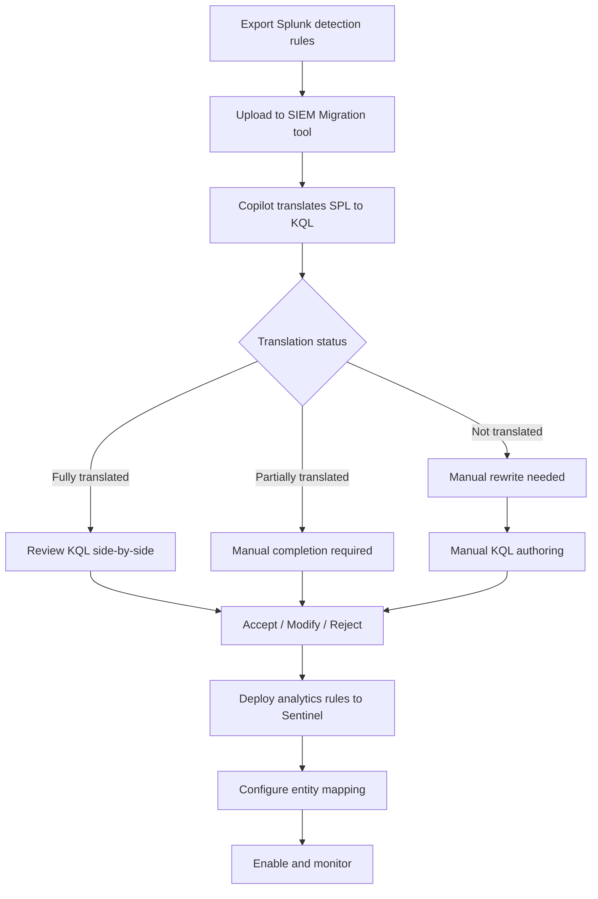

# Detection Rules Migration: SPL to KQL

**Status:** Authored 2026-04-30
**Audience:** Detection Engineers, SOC Analysts, Security Engineers
**Purpose:** Comprehensive guide for migrating Splunk detection rules (correlation searches, alerts, scheduled searches) to Microsoft Sentinel analytics rules

---

## 1. Overview

Detection rule migration is the most labor-intensive and risk-sensitive part of a Splunk-to-Sentinel migration. Your detection library represents years of security engineering investment -- false positive tuning, environment-specific logic, compliance-mandated rules, and institutional knowledge.

Microsoft provides two paths for detection rule migration:

1. **SIEM Migration Experience** -- automated, Copilot-powered SPL-to-KQL translation in the Defender portal (see [Tutorial: SIEM Migration Experience](tutorial-siem-migration-tool.md))
2. **Manual conversion** -- hand-translate SPL to KQL using the patterns in this guide

Most organizations will use a combination: the SIEM Migration Experience for bulk conversion, then manual refinement for complex or critical rules.

---

## 2. SPL to KQL command mapping

### Core search commands

| SPL command     | KQL equivalent                       | Example                                                                           |
| --------------- | ------------------------------------ | --------------------------------------------------------------------------------- |
| `search`        | `where`                              | `SecurityEvent \| where EventID == 4625`                                          |
| `where`         | `where`                              | `\| where count_ > 5`                                                             |
| `eval`          | `extend`                             | `\| extend risk = iff(count_ > 10, "high", "low")`                                |
| `stats`         | `summarize`                          | `\| summarize count() by SrcIP`                                                   |
| `table`         | `project`                            | `\| project TimeGenerated, SrcIP, Account`                                        |
| `rename`        | `project-rename`                     | `\| project-rename SourceIP = SrcIP`                                              |
| `sort`          | `sort by`                            | `\| sort by TimeGenerated desc`                                                   |
| `head` / `tail` | `take` / `top`                       | `\| take 10`                                                                      |
| `dedup`         | `distinct` or `summarize arg_max()`  | `\| summarize arg_max(TimeGenerated, *) by SrcIP`                                 |
| `fields`        | `project` or `project-away`          | `\| project SrcIP, Account, EventID`                                              |
| `rex`           | `extract` or `parse`                 | `\| extend user = extract("user=(\\w+)", 1, RawData)`                             |
| `timechart`     | `summarize ... by bin()`             | `\| summarize count() by bin(TimeGenerated, 1h)`                                  |
| `chart`         | `summarize ... by`                   | `\| summarize count() by SrcIP, EventType`                                        |
| `eventstats`    | `join` with summarize                | See pattern below                                                                 |
| `streamstats`   | `row_number()`, `prev()`, `next()`   | Window functions in KQL                                                           |
| `transaction`   | `summarize` with `make_list()`       | See pattern below                                                                 |
| `append`        | `union`                              | `Table1 \| union Table2`                                                          |
| `join`          | `join`                               | `\| join kind=inner (Table2) on Key`                                              |
| `lookup`        | `join` / `externaldata` / watchlists | `\| join kind=leftouter (_GetWatchlist('ThreatIPs')) on $left.SrcIP == $right.IP` |
| `fillnull`      | `coalesce`                           | `\| extend field = coalesce(field, "N/A")`                                        |
| `mvexpand`      | `mv-expand`                          | `\| mv-expand field`                                                              |
| `makemv`        | `split`                              | `\| extend items = split(field, ",")`                                             |
| `spath`         | `parse_json`                         | `\| extend parsed = parse_json(RawData)`                                          |

### Stats functions mapping

| SPL function      | KQL function                                         | Notes               |
| ----------------- | ---------------------------------------------------- | ------------------- |
| `count`           | `count()`                                            | Identical semantics |
| `dc(field)`       | `dcount(field)`                                      | Distinct count      |
| `sum(field)`      | `sum(field)`                                         | Identical           |
| `avg(field)`      | `avg(field)`                                         | Identical           |
| `min(field)`      | `min(field)`                                         | Identical           |
| `max(field)`      | `max(field)`                                         | Identical           |
| `values(field)`   | `make_set(field)`                                    | Unique values list  |
| `list(field)`     | `make_list(field)`                                   | All values list     |
| `first(field)`    | `take_any(field)` or `arg_min(TimeGenerated, field)` | First occurrence    |
| `last(field)`     | `arg_max(TimeGenerated, field)`                      | Last occurrence     |
| `earliest(field)` | `min(field)`                                         | Earliest value      |
| `latest(field)`   | `max(field)`                                         | Latest value        |
| `median(field)`   | `percentile(field, 50)`                              | Median value        |
| `perc95(field)`   | `percentile(field, 95)`                              | 95th percentile     |
| `stdev(field)`    | `stdev(field)`                                       | Standard deviation  |

### Eval functions mapping

| SPL eval function            | KQL equivalent                                          | Example                                               |
| ---------------------------- | ------------------------------------------------------- | ----------------------------------------------------- |
| `if(condition, true, false)` | `iff(condition, true, false)`                           | `iff(count_ > 5, "alert", "normal")`                  |
| `case(c1, v1, c2, v2, ...)`  | `case(c1, v1, c2, v2, ...)`                             | `case(sev == 1, "critical", sev == 2, "high", "low")` |
| `coalesce(a, b, c)`          | `coalesce(a, b, c)`                                     | Identical                                             |
| `len(field)`                 | `strlen(field)`                                         | String length                                         |
| `lower(field)`               | `tolower(field)`                                        | Lowercase                                             |
| `upper(field)`               | `toupper(field)`                                        | Uppercase                                             |
| `substr(field, start, len)`  | `substring(field, start, len)`                          | Substring                                             |
| `replace(field, regex, new)` | `replace_regex(field, regex, new)`                      | Regex replacement                                     |
| `split(field, delim)`        | `split(field, delim)`                                   | Identical                                             |
| `mvcount(field)`             | `array_length(field)`                                   | Multivalue count                                      |
| `mvindex(field, idx)`        | `field[idx]`                                            | Array index access                                    |
| `tonumber(field)`            | `toint(field)` or `tolong(field)`                       | Type conversion                                       |
| `tostring(field)`            | `tostring(field)`                                       | Identical                                             |
| `strftime(_time, fmt)`       | `format_datetime(TimeGenerated, fmt)`                   | Time formatting                                       |
| `strptime(str, fmt)`         | `todatetime(str)`                                       | String to datetime                                    |
| `now()`                      | `now()`                                                 | Identical                                             |
| `relative_time(time, spec)`  | `ago(timespan)`                                         | `ago(24h)`, `ago(7d)`                                 |
| `cidrmatch(cidr, ip)`        | `ipv4_is_in_range(ip, cidr)`                            | CIDR matching                                         |
| `isnotnull(field)`           | `isnotempty(field)` or `isnotnull(field)`               | Null check                                            |
| `isnull(field)`              | `isempty(field)` or `isnull(field)`                     | Null check                                            |
| `match(field, regex)`        | `field matches regex "pattern"` or `field has_cs "str"` | Regex match                                           |
| `urldecode(field)`           | `url_decode(field)`                                     | URL decode                                            |
| `md5(field)`                 | `hash_md5(field)`                                       | MD5 hash                                              |
| `sha256(field)`              | `hash_sha256(field)`                                    | SHA-256 hash                                          |

---

## 3. Complex pattern translations

### Pattern: eventstats (adding aggregations without reducing rows)

**SPL:**

```spl
index=main sourcetype=auth action=failure
| stats count by src_ip
| eventstats avg(count) as avg_failures
| where count > avg_failures * 3
```

**KQL:**

```kql
let avg_threshold =
    SigninLogs
    | where ResultType != 0
    | summarize failures = count() by IPAddress
    | summarize avg_failures = avg(failures);
SigninLogs
| where ResultType != 0
| summarize failures = count() by IPAddress
| where failures > toscalar(avg_threshold) * 3
```

### Pattern: transaction (grouping events into sessions)

**SPL:**

```spl
index=proxy sourcetype=web_proxy
| transaction session_id maxspan=30m maxpause=5m
| eval duration=tostring(duration, "duration")
| where eventcount > 50
```

**KQL:**

```kql
WebProxy
| summarize
    EventCount = count(),
    StartTime = min(TimeGenerated),
    EndTime = max(TimeGenerated),
    URLs = make_list(Url),
    BytesTotal = sum(BytesSent)
    by SessionId, bin(TimeGenerated, 30m)
| extend Duration = EndTime - StartTime
| where EventCount > 50
```

### Pattern: tstats (accelerated data model search)

**SPL:**

```spl
| tstats summariesonly=true count from datamodel=Authentication
  where Authentication.action=failure
  by Authentication.src, Authentication.user, _time span=1h
```

**KQL:**

```kql
SigninLogs
| where ResultType != 0
| summarize count() by IPAddress, UserPrincipalName, bin(TimeGenerated, 1h)
```

!!! note "Data model mapping"
Splunk data models map to specific Sentinel/Log Analytics tables. The `Authentication` data model maps to `SigninLogs` (Entra ID) or `SecurityEvent` (Windows) depending on the source.

### Pattern: macro expansion

**SPL:**

```spl
`notable_event_filter`
| search severity=critical
| `get_asset_info(src)`
```

**KQL:**

```kql
// Macros become KQL functions defined in Log Analytics
// Create function: notable_event_filter
let notable_event_filter = SecurityAlert
    | where AlertSeverity == "High";
// Create function: get_asset_info that enriches with watchlist
let enriched = notable_event_filter
    | join kind=leftouter (
        _GetWatchlist('AssetInventory')
    ) on $left.CompromisedEntity == $right.Hostname;
enriched
```

### Pattern: subsearch / append

**SPL:**

```spl
index=firewall action=blocked
| stats count by src_ip
| where count > 100
| fields src_ip
| join src_ip [search index=auth action=success | stats count by src_ip]
```

**KQL:**

```kql
let blocked_ips =
    CommonSecurityLog
    | where DeviceAction == "Deny"
    | summarize BlockCount = count() by SourceIP
    | where BlockCount > 100
    | project SourceIP;
SigninLogs
| where ResultType == 0
| where IPAddress in (blocked_ips)
| summarize SuccessCount = count() by IPAddress
```

### Pattern: rex (field extraction with regex)

**SPL:**

```spl
index=web sourcetype=access_combined
| rex field=_raw "(?<method>\w+)\s+(?<url>\S+)\s+HTTP/(?<http_version>\S+)"
| rex field=url "^/(?<app>\w+)/"
```

**KQL:**

```kql
W3CIISLog
| extend method = extract("(\\w+)\\s+\\S+\\s+HTTP", 1, csMethod)
| extend app = extract("^/(\\w+)/", 1, csUriStem)
// Or use parse for structured extraction:
| parse RawData with method " " url " HTTP/" http_version
```

---

## 4. Sentinel analytics rule types

### Scheduled rules

The primary rule type for migrated Splunk correlation searches:

```kql
// Example: Brute force detection (migrated from Splunk ES)
// Original SPL: index=auth action=failure | stats count by src_ip, user
//               | where count > 20 | `notable_event`
SigninLogs
| where TimeGenerated > ago(1h)
| where ResultType != 0
| summarize
    FailureCount = count(),
    DistinctUsers = dcount(UserPrincipalName),
    Users = make_set(UserPrincipalName, 10)
    by IPAddress
| where FailureCount > 20
| extend AccountCustomEntity = tostring(Users[0])
| extend IPCustomEntity = IPAddress
```

**Rule configuration:**

| Setting         | Typical value                                 | Notes                                            |
| --------------- | --------------------------------------------- | ------------------------------------------------ |
| Query frequency | 1 hour                                        | How often the rule runs                          |
| Lookup period   | 1 hour                                        | Time window for the query                        |
| Alert threshold | Generate alert when query returns > 0 results | Match Splunk threshold                           |
| Entity mapping  | IP, Account, Host                             | Map to Sentinel entities for investigation graph |
| MITRE ATT&CK    | T1110 - Brute Force                           | Tag for MITRE coverage tracking                  |
| Severity        | Medium / High                                 | Map from Splunk notable severity                 |

### Near-real-time (NRT) rules

For Splunk real-time searches that require sub-minute detection:

```kql
// NRT rule: Critical asset logon from unusual location
// Runs every 1 minute with minimal latency
SigninLogs
| where UserPrincipalName in (_GetWatchlist('CriticalAccounts') | project UPN)
| where Location !in (_GetWatchlist('ApprovedLocations') | project Location)
| where ResultType == 0
```

**When to use NRT vs scheduled:**

| Criteria          | Scheduled rule   | NRT rule                          |
| ----------------- | ---------------- | --------------------------------- |
| Latency tolerance | 5-60 minutes     | < 1 minute                        |
| Query complexity  | Full KQL support | Full KQL support                  |
| Data volume       | Any              | Consider cost at very high volume |
| Use case          | Most detections  | Critical real-time detections     |

### Fusion rules (ML-powered)

Sentinel Fusion rules use ML to correlate low-fidelity alerts into high-confidence incidents. These have no direct Splunk equivalent and represent net-new detection capability:

- Multi-stage attack detection
- Anomalous sign-in + data exfiltration correlation
- Ransomware campaign detection

---

## 5. Entity mapping

Splunk ES notables use asset and identity correlation. Sentinel uses entity mapping to link alerts to entities for investigation:

| Splunk ES field     | Sentinel entity type | Sentinel field mapping            |
| ------------------- | -------------------- | --------------------------------- |
| `src` / `src_ip`    | IP                   | `IPAddress`                       |
| `dest` / `dest_ip`  | IP                   | `DestinationIP`                   |
| `user`              | Account              | `AccountName`, `AccountUPNSuffix` |
| `src_host` / `host` | Host                 | `HostName`, `DnsDomain`           |
| `url`               | URL                  | `Url`                             |
| `file_name`         | File                 | `Name`, `Directory`               |
| `file_hash`         | FileHash             | `Algorithm`, `Value`              |
| `process`           | Process              | `ProcessId`, `CommandLine`        |
| `registry_path`     | RegistryKey          | `Hive`, `Key`                     |
| `dest_port`         | --                   | Included in IP entity as port     |

### Entity mapping in analytics rule:

```kql
// In the analytics rule query, project entity fields:
| extend
    AccountCustomEntity = UserPrincipalName,
    IPCustomEntity = IPAddress,
    HostCustomEntity = Computer
```

---

## 6. SIEM Migration Experience workflow

The SIEM Migration Experience in the Defender portal automates bulk detection rule conversion:



**Translation success rates (typical):**

| Rule complexity                                | Fully translated | Partially translated | Not translated |
| ---------------------------------------------- | ---------------- | -------------------- | -------------- |
| Simple searches (`search \| stats \| where`)   | 85-95%           | 5-10%                | 0-5%           |
| Moderate (lookups, eval, rex)                  | 60-75%           | 20-30%               | 5-10%          |
| Complex (transaction, multi-subsearch, macros) | 30-50%           | 30-40%               | 20-30%         |
| Custom commands / ES-specific                  | 10-20%           | 20-30%               | 50-70%         |

**Recommendation:** Export all rules to the SIEM Migration Experience first. It will handle the bulk of simple-to-moderate rules, leaving your detection engineering team to focus on the complex rules that require manual attention.

See [Tutorial: SIEM Migration Experience](tutorial-siem-migration-tool.md) for the step-by-step walkthrough.

---

## 7. Detection coverage validation

### MITRE ATT&CK coverage comparison

Before and after migration, map your detection rules to MITRE ATT&CK techniques:

```kql
// Query to assess MITRE ATT&CK coverage in Sentinel
SecurityAlert
| extend Tactics = parse_json(ExtendedProperties).Tactics
| mv-expand Tactics
| summarize
    RuleCount = dcount(AlertName),
    Rules = make_set(AlertName)
    by tostring(Tactics)
| sort by RuleCount desc
```

### Coverage gap analysis

| Step | Action                                                            |
| ---- | ----------------------------------------------------------------- |
| 1    | Export Splunk ES MITRE ATT&CK mapping                             |
| 2    | Map each migrated Sentinel rule to ATT&CK techniques              |
| 3    | Compare coverage matrices side by side                            |
| 4    | Identify gaps -- techniques covered in Splunk but not in Sentinel |
| 5    | Deploy Content Hub solutions to fill common gaps                  |
| 6    | Author custom rules for environment-specific gaps                 |

---

## 8. Post-migration tuning

### False positive reduction

Migrated rules often generate more false positives initially because KQL may match differently than SPL on the same data:

```kql
// Tuning example: exclude known service accounts from brute force detection
SigninLogs
| where ResultType != 0
| where UserPrincipalName !in (_GetWatchlist('ServiceAccounts') | project UPN)
| where IPAddress !in (_GetWatchlist('TrustedIPs') | project IP)
| summarize FailureCount = count() by IPAddress, UserPrincipalName
| where FailureCount > 20
```

### Performance optimization

| Optimization     | SPL approach                 | KQL approach                                          |
| ---------------- | ---------------------------- | ----------------------------------------------------- |
| Time filtering   | `earliest=-1h latest=now`    | `where TimeGenerated > ago(1h)` (always first filter) |
| Table selection  | `index=specific_index`       | Query specific table (avoid `union *`)                |
| Field projection | `fields + field1, field2`    | `project field1, field2` early in pipeline            |
| Pre-filtering    | `search specific_sourcetype` | `where` clause on indexed columns first               |

---

## Summary

Detection rule migration from Splunk to Sentinel follows a structured approach:

1. **Export** all Splunk correlation searches, scheduled searches, and alerts
2. **Upload** to the SIEM Migration Experience for automated Copilot-powered translation
3. **Review** each translated rule -- accept, modify, or flag for manual rewrite
4. **Manually convert** complex rules using the SPL-to-KQL patterns in this guide
5. **Configure** entity mapping, MITRE ATT&CK tagging, and alert grouping
6. **Validate** MITRE ATT&CK coverage parity with pre-migration baseline
7. **Tune** false positives and optimize query performance
8. **Monitor** during parallel-run period before full cutover

---

**Next steps:**

- [Tutorial: SIEM Migration Experience](tutorial-siem-migration-tool.md) -- use the automated tool
- [Tutorial: SPL to KQL](tutorial-spl-to-kql.md) -- 20+ hands-on conversion examples
- [SOAR Migration](soar-migration.md) -- migrate playbooks and automation

---

**Maintainers:** csa-inabox core team
**Last updated:** 2026-04-30
