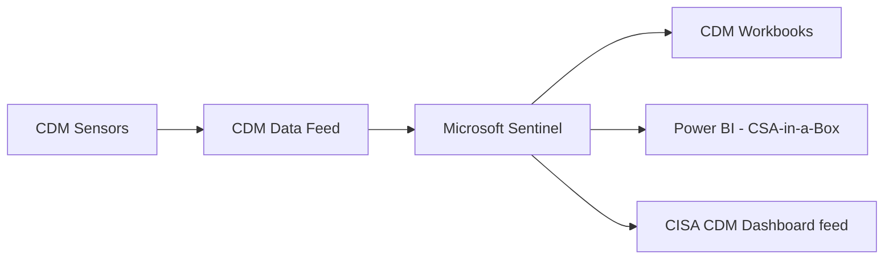
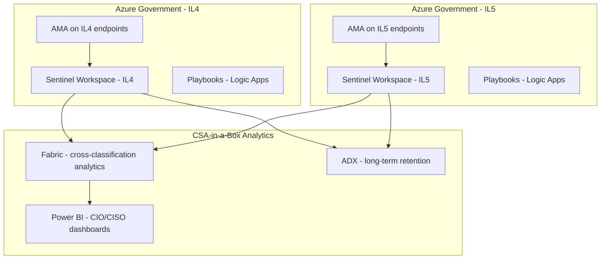

# Federal Migration Guide: Splunk to Sentinel in Government

**Status:** Authored 2026-04-30
**Audience:** Federal CISOs, DoD Security Architects, Civilian Agency Security Teams, AOs
**Purpose:** Federal-specific guidance for migrating from Splunk to Microsoft Sentinel in Azure Government environments

---

## 1. Federal SIEM landscape

### Splunk's federal dominance

Splunk holds the dominant SIEM market position across the US federal government:

| Federal sector                | Splunk market position                        | Key agencies                                    |
| ----------------------------- | --------------------------------------------- | ----------------------------------------------- |
| **Department of Defense**     | Primary SIEM across most military departments | Army, Navy, Air Force, DISA, combatant commands |
| **Intelligence Community**    | Widely deployed for security analytics        | IC agencies, NSA, NGA                           |
| **Civilian CFO Act agencies** | Incumbent at most large agencies              | DHS, DOJ, Treasury, State, HHS, VA, Commerce    |
| **Law enforcement**           | Standard for security and compliance          | FBI, DEA, ATF, USMS, Secret Service             |
| **Regulatory agencies**       | Common deployment                             | SEC, CFTC, FTC, FDIC                            |

**What this means for migration planning:** The federal Splunk ecosystem is large, mature, and deeply embedded. Migration is not just a technology change -- it requires addressing procurement vehicles, existing BPAs, trained workforce, and institutional knowledge.

### Sentinel's federal growth

Microsoft Sentinel in Azure Government is growing rapidly:

- Multiple DoD components have completed or are executing Splunk-to-Sentinel migrations
- ArcSight end-of-life is driving federal agencies to Sentinel as a replacement
- The SIEM Migration Experience was designed specifically for large federal Splunk deployments
- Azure Government FedRAMP High authorization provides compliance foundation
- Sentinel is increasingly specified in new federal RFPs alongside or instead of Splunk

### ArcSight displacement in DoD

Micro Focus ArcSight, once the dominant DoD SIEM, is reaching end-of-life. Sentinel is the primary beneficiary:

| ArcSight gap                         | Sentinel advantage                         |
| ------------------------------------ | ------------------------------------------ |
| On-premises only, aging architecture | Cloud-native, zero infrastructure          |
| Limited AI/ML capabilities           | Security Copilot native                    |
| Complex deployment and maintenance   | Managed Azure service                      |
| Declining vendor support             | Microsoft's investment in federal security |

---

## 2. Azure Government for Sentinel

### Authorization and compliance

| Framework             | Sentinel in Azure Government | Notes                                                 |
| --------------------- | ---------------------------- | ----------------------------------------------------- |
| **FedRAMP High**      | Authorized                   | Inherited from Azure Government P-ATO                 |
| **DoD IL2**           | Authorized                   | Full availability                                     |
| **DoD IL4**           | Authorized                   | Full Sentinel capability                              |
| **DoD IL5**           | Authorized                   | Most Sentinel capabilities available                  |
| **DoD IL6**           | **Not available**            | Classified SCI workloads not supported                |
| **CJIS**              | Available                    | Azure Government meets CJIS requirements              |
| **ITAR**              | Compliant                    | Azure Government data residency                       |
| **IRS 1075**          | Compliant                    | FTI handling supported                                |
| **NIST 800-53 Rev 5** | Controls mapped              | CSA-in-a-Box provides machine-readable control matrix |
| **CMMC 2.0**          | Supports Level 1-3           | CSA-in-a-Box provides practice-level mappings         |
| **HIPAA**             | BAA available                | CSA-in-a-Box provides HIPAA security rule matrix      |

### Azure Government vs Azure Commercial for Sentinel

| Capability                           | Azure Government | Azure Commercial | Notes                               |
| ------------------------------------ | ---------------- | ---------------- | ----------------------------------- |
| Sentinel core (analytics, incidents) | Full             | Full             | Feature parity                      |
| Content Hub                          | Available        | Full             | Most solutions available in Gov     |
| Security Copilot                     | Available        | Full             | Gov deployment may lag slightly     |
| UEBA                                 | Available        | Full             | Entity behavior analytics           |
| Logic Apps (playbooks)               | Available        | Full             | May have connector differences      |
| Notebooks (Jupyter)                  | Available        | Full             | MSTICPy library supported           |
| Data connectors                      | Most available   | Full             | Some third-party connectors may lag |
| Multi-workspace                      | Full             | Full             | Azure Lighthouse supported          |
| Azure Data Explorer                  | Available        | Full             | Long-term retention                 |

### Azure Government endpoints

| Service             | Azure Government endpoint                               |
| ------------------- | ------------------------------------------------------- |
| Defender portal     | https://security.microsoft.us                           |
| Azure portal        | https://portal.azure.us                                 |
| Log Analytics       | https://\<workspace\>.ods.opinsights.azure.us           |
| Data Collection API | https://\<dce\>.usgovvirginia-1.ingest.monitor.azure.us |
| Azure Monitor Agent | Standard install; auto-detects Gov environment          |

---

## 3. Federal compliance and event retention

### Event retention requirements by framework

| Framework             | Online retention                            | Archive retention                    | Implementation                           |
| --------------------- | ------------------------------------------- | ------------------------------------ | ---------------------------------------- |
| **NIST 800-53 AU-11** | Agency-defined (typically 90 days - 1 year) | Agency-defined (typically 3-7 years) | Log Analytics interactive + Archive tier |
| **FedRAMP High**      | 12 months minimum online                    | As specified in SSP                  | Log Analytics 12-month retention         |
| **DoD STIG**          | 1 year online                               | 5 years archive                      | Log Analytics 1 year + ADX/Blob 5 years  |
| **CJIS**              | 1 year                                      | As required                          | Log Analytics 1 year                     |
| **HIPAA**             | 6 years                                     | N/A                                  | ADX for full 6-year queryable retention  |
| **IRS 1075**          | 7 years for FTI                             | N/A                                  | ADX or Blob Archive for 7 years          |
| **FISMA**             | Per agency ISSM guidance                    | Per agency ISSM guidance             | Configurable per-table retention         |

### Implementing federal retention in Sentinel

```bicep
// Bicep: Configure federal-compliant retention
resource workspace 'Microsoft.OperationalInsights/workspaces@2022-10-01' = {
  name: 'law-sentinel-gov'
  location: 'usgovvirginia'
  properties: {
    sku: {
      name: 'PerGB2018'
    }
    retentionInDays: 365  // 1-year online retention (FedRAMP High minimum)
    features: {
      enableDataExport: true  // Enable export to ADX for long-term
    }
  }
}

// Per-table retention for compliance
resource securityEventRetention 'Microsoft.OperationalInsights/workspaces/tables@2022-10-01' = {
  parent: workspace
  name: 'SecurityEvent'
  properties: {
    retentionInDays: 365      // 1 year interactive
    totalRetentionInDays: 2555 // 7 years total (archive)
  }
}

// Data export to ADX for long-term hunting
resource dataExportRule 'Microsoft.OperationalInsights/workspaces/dataExports@2020-08-01' = {
  parent: workspace
  name: 'export-to-adx'
  properties: {
    destination: {
      resourceId: adxCluster.id
      metaData: {
        eventHubName: 'sentinel-export'
      }
    }
    tableNames: [
      'SecurityEvent'
      'CommonSecurityLog'
      'SigninLogs'
      'AuditLogs'
    ]
    enable: true
  }
}
```

---

## 4. CISA CDM integration

### CDM dashboard migration

Many federal agencies use Splunk for CDM (Continuous Diagnostics and Mitigation) dashboard integration. Sentinel supports CDM through:

| CDM capability           | Splunk implementation | Sentinel implementation                             |
| ------------------------ | --------------------- | --------------------------------------------------- |
| **Asset management**     | CDM Splunk app        | Sentinel workbook + Defender for Endpoint inventory |
| **Identity management**  | CDM Splunk app        | Entra ID connector + SigninLogs analytics           |
| **Network security**     | CDM Splunk app        | Network Security workbooks + NSG flow logs          |
| **Data protection**      | CDM Splunk app        | Purview + DLP connectors                            |
| **CDM Agency Dashboard** | Splunk Dashboard      | Sentinel workbook or Power BI (CSA-in-a-Box)        |

### CDM data flow to Sentinel



---

## 5. DoD-specific considerations

### DoD SIEM requirements

| Requirement                | Splunk implementation            | Sentinel implementation                          |
| -------------------------- | -------------------------------- | ------------------------------------------------ |
| **STIG compliance**        | Splunk STIG hardening guide      | Azure Government STIG baseline                   |
| **PKI/CAC authentication** | Splunk SAML with PKI             | Entra ID with CAC/PIV via certificate-based auth |
| **DISA endpoint agent**    | Splunk UF alongside HBSS/Trellix | AMA alongside existing endpoint security         |
| **ACAS scan ingestion**    | Splunk ACAS app                  | Custom connector or CEF for vulnerability data   |
| **SCCM/Intune compliance** | Custom app                       | Native Intune connector                          |
| **Cross-domain solutions** | Splunk with CDS integration      | Sentinel with CDS data feed                      |

### IL4/IL5 deployment architecture



!!! warning "IL5 data handling"
IL5 data must remain in Azure Government regions that support IL5 workloads. Ensure Log Analytics workspace, ADX cluster, and all data export destinations are in IL5-authorized regions.

---

## 6. ATO considerations

### Sentinel in the agency SSP

When migrating from Splunk to Sentinel, the agency's System Security Plan (SSP) must be updated:

| SSP section                    | Update required                                                           |
| ------------------------------ | ------------------------------------------------------------------------- |
| **System boundary**            | Add Sentinel workspace, Log Analytics, and data connectors to boundary    |
| **Data flow diagrams**         | Update to show data flowing to Azure Government instead of on-prem Splunk |
| **Control implementation**     | Update AU (Audit), SI (System Integrity), IR (Incident Response) controls |
| **Interconnection agreements** | Update or add ISA/MOU for Azure Government connectivity                   |
| **Contingency plan**           | Update DR/COOP to reflect cloud-native SIEM architecture                  |
| **POA&M**                      | Track any control gaps during migration as POA&M items                    |

### CSA-in-a-Box compliance support

CSA-in-a-Box provides machine-readable compliance matrices that map to Sentinel controls:

| CSA-in-a-Box artifact      | How it supports Sentinel ATO                                                 |
| -------------------------- | ---------------------------------------------------------------------------- |
| `nist-800-53-rev5.yaml`    | Maps SIEM-related controls (AU, SI, IR) to Azure services including Sentinel |
| `cmmc-2.0-l2.yaml`         | Maps CMMC practices for DIB contractors using Sentinel                       |
| `hipaa-security-rule.yaml` | Maps HIPAA audit controls for healthcare agencies                            |
| `fedramp-moderate.md`      | Narrative guidance for FedRAMP documentation                                 |

---

## 7. Federal procurement considerations

### Contract vehicles for Sentinel

| Vehicle                                 | Covers Sentinel | Notes                                     |
| --------------------------------------- | --------------- | ----------------------------------------- |
| **Microsoft Enterprise Agreement (EA)** | Yes             | Most common federal Microsoft procurement |
| **GSA MAS (Schedule 70)**               | Yes             | Through authorized Microsoft resellers    |
| **NASA SEWP V**                         | Yes             | IT products and services                  |
| **CIO-CS**                              | Yes             | Cybersecurity products                    |
| **DoD ESI**                             | Yes             | DoD Enterprise Software Initiative        |
| **DISA milCloud**                       | Yes             | Azure Government for DoD                  |

### Cost comparison for federal

Splunk federal contracts typically include:

- Multi-year term licenses with fixed GB/day commitment
- Splunk ES premium (50-100% on top of base)
- Splunk SOAR as separate line item
- Professional services / contractor support

Sentinel federal costs are:

- Consumption-based (no term commitment required, but commitment tiers offer discounts)
- No separate ES/SOAR licensing
- Free Microsoft data sources (significant for M365/Entra/Defender shops)
- CSA-in-a-Box infrastructure costs for analytics extension

---

## 8. Federal migration timeline

Federal SIEM migrations require additional time for compliance documentation, ATO updates, and change management:

| Phase               | Commercial timeline | Federal timeline | Federal additions                               |
| ------------------- | ------------------- | ---------------- | ----------------------------------------------- |
| Discovery           | 2 weeks             | 3-4 weeks        | Security control mapping, SSP review            |
| Sentinel deployment | 4 weeks             | 6-8 weeks        | ATO update, ISA/MOU processing, PKI integration |
| Detection migration | 6 weeks             | 8-12 weeks       | STIG compliance validation, CDM alignment       |
| SOAR migration      | 4 weeks             | 4-6 weeks        | Playbook approval through change control        |
| Dashboard migration | 4 weeks             | 4-6 weeks        | CDM dashboard migration                         |
| Parallel run        | 8 weeks             | 12-16 weeks      | Extended parallel for compliance validation     |
| Cutover             | 4 weeks             | 4-8 weeks        | AO sign-off, POA&M closure                      |
| **Total**           | **28-32 weeks**     | **40-60 weeks**  |                                                 |

---

## 9. IL6 split architecture

For agencies with both unclassified and classified SIEM requirements:

| Classification level | SIEM                                     | Rationale                     |
| -------------------- | ---------------------------------------- | ----------------------------- |
| IL2 (Public)         | Microsoft Sentinel (Azure Gov)           | Cloud-native, cost-efficient  |
| IL4 (CUI)            | Microsoft Sentinel (Azure Gov)           | Full feature availability     |
| IL5 (CUI/NSS)        | Microsoft Sentinel (Azure Gov IL5)       | Most features available       |
| IL6 (Classified/SCI) | Splunk Enterprise (on-prem) or alternate | Sentinel not available at IL6 |

**Recommendation:** Migrate IL2-IL5 workloads to Sentinel. Maintain Splunk (or evaluate alternatives) for IL6. Use CSA-in-a-Box as the analytics layer for unclassified security data, combining Sentinel telemetry with other agency data in Fabric lakehouses.

---

## 10. Federal-specific CSA-in-a-Box integration

CSA-in-a-Box provides federal-specific value for security data:

| CSA-in-a-Box capability                     | Federal security use case                                                              |
| ------------------------------------------- | -------------------------------------------------------------------------------------- |
| **Purview with government classifications** | Classify security telemetry as CUI, CUI//SP, PII per `government_classifications.yaml` |
| **Compliance matrices**                     | Automated control mapping for NIST, CMMC, HIPAA, FedRAMP                               |
| **Tamper-evident audit logging**            | Hash-chained audit trail for security event integrity                                  |
| **Fabric security analytics**               | Cross-domain correlation -- combine Sentinel data with HR, finance, IT asset data      |
| **Power BI executive dashboards**           | CIO/CISO-level security posture reporting for FISMA                                    |
| **ADX long-term retention**                 | 7-year queryable archive for compliance and forensics                                  |

---

**Next steps:**

- [Migration Playbook](../splunk-to-sentinel.md) -- full migration plan
- [TCO Analysis](tco-analysis.md) -- federal cost comparison
- [Best Practices](best-practices.md) -- federal migration strategy
- [Benchmarks](benchmarks.md) -- performance data

---

**Maintainers:** csa-inabox core team
**Last updated:** 2026-04-30
