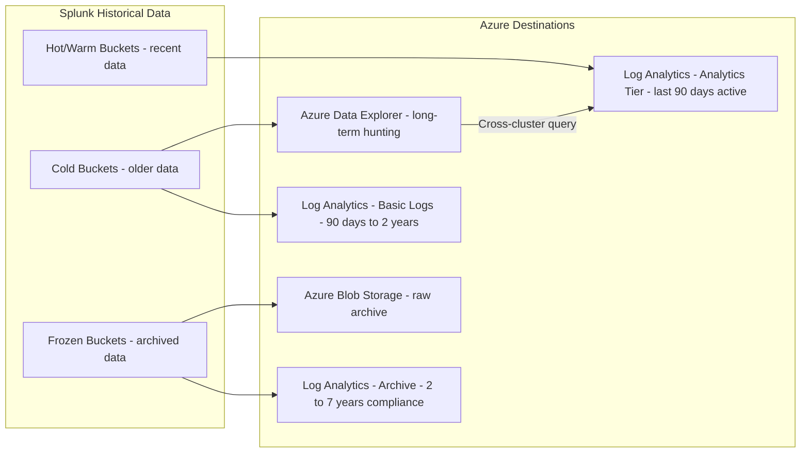

# Historical Data Migration: Splunk Indexes to Azure

**Status:** Authored 2026-04-30
**Audience:** Security Engineers, Platform Engineers, Compliance Officers
**Purpose:** Guide for migrating historical Splunk index data to Azure for long-term retention, compliance, and retrospective threat hunting

---

## 1. Why migrate historical data

Historical security data serves three critical purposes:

1. **Compliance retention** -- Federal agencies typically require 12-month online + 7-year archive retention for security events
2. **Retrospective threat hunting** -- When a new IOC or TTPs are discovered, analysts need to search historical data for prior compromise indicators
3. **Forensic investigation** -- Incident response may require analyzing events from months or years prior

Simply decommissioning Splunk without migrating historical data creates a compliance gap and eliminates retrospective hunting capability.

---

## 2. Data destination options

| Destination                        | Best for                                 | Query capability                     | Cost    | Retention      |
| ---------------------------------- | ---------------------------------------- | ------------------------------------ | ------- | -------------- |
| **Log Analytics (Analytics tier)** | Active investigation data (last 90 days) | Full KQL, real-time                  | Highest | Up to 12 years |
| **Log Analytics (Basic Logs)**     | High-volume, low-query historical data   | Limited KQL (8 min query, no alerts) | Medium  | Up to 12 years |
| **Log Analytics (Archive tier)**   | Compliance retention, infrequent access  | Search jobs (async, pay-per-query)   | Low     | Up to 12 years |
| **Azure Data Explorer (ADX)**      | Long-term hunting with full query power  | Full KQL, sub-second performance     | Medium  | Unlimited      |
| **Azure Blob Storage**             | Raw archive, compliance retention        | No query (export/restore only)       | Lowest  | Unlimited      |

### Recommended architecture



---

## 3. Exporting data from Splunk

### Method 1: Splunk search export (small to medium volumes)

```spl
# Export a specific sourcetype for a time range
index=main sourcetype=pan:traffic earliest="01/01/2025:00:00:00" latest="03/31/2025:23:59:59"
| fields _time, src_ip, dest_ip, dest_port, action, bytes_in, bytes_out, app, rule
| outputcsv splunk_export_firewall_q1_2025.csv
```

**Considerations:**

- Limited to search head memory and disk
- Suitable for < 10 GB exports
- CSV or JSON format
- Run during off-peak hours

### Method 2: Splunk dump command (larger volumes)

```spl
# Dump raw events from an index
| dump basefilename="firewall_export" index="firewall" splunk_server=local
```

### Method 3: Bucket-level export (largest volumes)

For petabyte-scale migrations, export at the bucket level:

```bash
# On the Splunk indexer, copy cold/frozen buckets
# Buckets are stored in: $SPLUNK_HOME/var/lib/splunk/<index>/colddb/

# List cold buckets for an index
ls -la /opt/splunk/var/lib/splunk/main/colddb/

# Export bucket data using Splunk's exporttool
/opt/splunk/bin/splunk cmd exporttool /opt/splunk/var/lib/splunk/main/colddb/db_1704067200_1703980800_0 \
    -output /export/main_bucket_export.csv \
    -format csv

# For bulk export, script across all buckets
for bucket in /opt/splunk/var/lib/splunk/main/colddb/db_*; do
    bucket_name=$(basename "$bucket")
    /opt/splunk/bin/splunk cmd exporttool "$bucket" \
        -output "/export/${bucket_name}.csv" \
        -format csv
done
```

### Method 4: Splunk REST API export

```python
# Python script for API-based export
import requests
import json
import csv
import os

SPLUNK_HOST = "https://splunk-sh:8089"
SPLUNK_TOKEN = os.environ['SPLUNK_TOKEN']

def export_splunk_data(search_query, output_file, earliest, latest):
    """Export Splunk data via REST API."""
    headers = {"Authorization": f"Bearer {SPLUNK_TOKEN}"}

    # Create search job
    response = requests.post(
        f"{SPLUNK_HOST}/services/search/jobs/export",
        headers=headers,
        data={
            "search": f"search {search_query}",
            "earliest_time": earliest,
            "latest_time": latest,
            "output_mode": "json"
        },
        verify=False,
        stream=True
    )

    with open(output_file, 'w') as f:
        for line in response.iter_lines():
            if line:
                f.write(line.decode('utf-8') + '\n')

# Export by month for manageability
export_splunk_data(
    'index=main sourcetype=pan:traffic',
    '/export/firewall_jan2025.json',
    '2025-01-01T00:00:00',
    '2025-02-01T00:00:00'
)
```

---

## 4. Ingesting into Azure

### Ingesting into Log Analytics (recent data)

Use the Data Collection API for structured historical data ingestion:

```python
# Python script for Log Analytics ingestion
import requests
import json
from azure.identity import DefaultAzureCredential
from datetime import datetime

DCE_ENDPOINT = "https://<dce>.usgovvirginia-1.ingest.monitor.azure.us"
DCR_ID = "dcr-xxxxxxxx"
STREAM_NAME = "Custom-HistoricalFirewall_CL"

credential = DefaultAzureCredential()
token = credential.get_token("https://monitor.azure.us/.default")

def ingest_batch(events):
    """Ingest a batch of events to Log Analytics."""
    response = requests.post(
        f"{DCE_ENDPOINT}/dataCollectionRules/{DCR_ID}/streams/{STREAM_NAME}?api-version=2023-01-01",
        headers={
            "Authorization": f"Bearer {token.token}",
            "Content-Type": "application/json"
        },
        data=json.dumps(events)
    )
    return response.status_code

# Process exported Splunk data
with open('/export/firewall_jan2025.json', 'r') as f:
    batch = []
    for line in f:
        event = json.loads(line)
        # Map Splunk fields to Log Analytics schema
        transformed = {
            "TimeGenerated": event.get("_time"),
            "SourceIP": event.get("src_ip"),
            "DestinationIP": event.get("dest_ip"),
            "DestinationPort": int(event.get("dest_port", 0)),
            "Action": event.get("action"),
            "BytesIn": int(event.get("bytes_in", 0)),
            "BytesOut": int(event.get("bytes_out", 0))
        }
        batch.append(transformed)

        if len(batch) >= 1000:
            ingest_batch(batch)
            batch = []

    if batch:
        ingest_batch(batch)
```

### Ingesting into Azure Data Explorer (long-term hunting)

ADX is the recommended destination for historical data that requires full query capability at low cost:

```kql
// Create table in ADX
.create table HistoricalFirewallEvents (
    TimeGenerated: datetime,
    SourceIP: string,
    DestinationIP: string,
    DestinationPort: int,
    Action: string,
    BytesIn: long,
    BytesOut: long,
    Application: string,
    Rule: string,
    OriginalIndex: string,
    OriginalSourcetype: string
)

// Create ingestion mapping
.create table HistoricalFirewallEvents ingestion json mapping 'SplunkMapping'
    '[{"column":"TimeGenerated","path":"$._time","datatype":"datetime"},'
    '{"column":"SourceIP","path":"$.src_ip"},'
    '{"column":"DestinationIP","path":"$.dest_ip"},'
    '{"column":"DestinationPort","path":"$.dest_port","datatype":"int"},'
    '{"column":"Action","path":"$.action"},'
    '{"column":"BytesIn","path":"$.bytes_in","datatype":"long"},'
    '{"column":"BytesOut","path":"$.bytes_out","datatype":"long"},'
    '{"column":"Application","path":"$.app"},'
    '{"column":"Rule","path":"$.rule"},'
    '{"column":"OriginalIndex","path":"$.index"},'
    '{"column":"OriginalSourcetype","path":"$.sourcetype"}]'
```

```bash
# Bulk ingest from Azure Blob Storage using LightIngest
LightIngest "https://<adx-cluster>.kusto.windows.net/<database>" \
    -source "https://<storage>.blob.core.windows.net/splunk-export/" \
    -pattern "*.json" \
    -table HistoricalFirewallEvents \
    -ingestionMappingRef SplunkMapping \
    -format json
```

### Cross-cluster query from Sentinel to ADX

After historical data is in ADX, query it from Sentinel using cross-cluster queries:

```kql
// From Sentinel, query historical data in ADX
let adx_historical = adx("https://<adx-cluster>.kusto.windows.net/<database>").HistoricalFirewallEvents
| where TimeGenerated between (datetime(2025-01-01) .. datetime(2025-03-31))
| where SourceIP == "10.1.2.3";
// Combine with current Sentinel data
let sentinel_current = CommonSecurityLog
| where TimeGenerated > ago(90d)
| where SourceIP == "10.1.2.3";
union adx_historical, sentinel_current
| sort by TimeGenerated desc
```

### Archiving to Azure Blob Storage

For raw archive (compliance retention without query need):

```bash
# Upload exported Splunk data to Azure Blob Storage
az storage blob upload-batch \
    --account-name "stgsplunkarchive" \
    --destination "splunk-archive" \
    --source "/export/" \
    --pattern "*.csv" \
    --tier Archive
```

---

## 5. Data retention strategy

### Recommended retention tiers

| Time range        | Storage tier                        | Monthly cost per TB | Query capability                     |
| ----------------- | ----------------------------------- | ------------------- | ------------------------------------ |
| 0-90 days         | Log Analytics (Analytics)           | $100-$150           | Full KQL, analytics rules, workbooks |
| 90 days - 2 years | Log Analytics (Basic) or ADX        | $15-$40             | Basic queries or full KQL (ADX)      |
| 2-7 years         | Log Analytics Archive or ADX (cold) | $1-$5               | Search jobs (LA) or full KQL (ADX)   |
| 7+ years          | Azure Blob (Archive tier)           | $0.18               | No query; restore to access          |

### Federal retention requirements

| Framework           | Minimum retention                              | Recommended implementation            |
| ------------------- | ---------------------------------------------- | ------------------------------------- |
| NIST 800-53 (AU-11) | Per agency policy (typically 1-3 years online) | Log Analytics 90 days + ADX 3 years   |
| FedRAMP High        | 12 months online minimum                       | Log Analytics 12 months + ADX archive |
| DoD STIG            | 1 year online, 5 years archive                 | Log Analytics 1 year + Blob 5 years   |
| CJIS                | 1 year minimum                                 | Log Analytics 1 year                  |
| HIPAA               | 6 years                                        | ADX 6 years or Blob Archive           |
| SOX                 | 7 years                                        | Blob Archive 7 years                  |

---

## 6. CSA-in-a-Box integration

Historical security data in ADX is accessible to CSA-in-a-Box analytics:

| Integration        | How                                 | Use case                                                 |
| ------------------ | ----------------------------------- | -------------------------------------------------------- |
| **Fabric + ADX**   | Fabric KQL database shortcut to ADX | Query historical security data from Fabric notebooks     |
| **Power BI + ADX** | ADX connector in Power BI           | Historical trend dashboards for CISO reporting           |
| **Purview + ADX**  | Purview scan of ADX databases       | Classify and govern archived security data               |
| **dbt + ADX**      | dbt-kusto adapter                   | Transform historical security data into curated datasets |

---

## 7. Migration checklist

- [ ] Inventory Splunk indexes with size, retention, and compliance requirements
- [ ] Determine retention destination for each index (LA, ADX, Blob, or discard)
- [ ] Plan export schedule (by month, by sourcetype, by priority)
- [ ] Set up Azure storage accounts and ADX clusters (if needed)
- [ ] Create target table schemas and ingestion mappings
- [ ] Execute phased export and ingestion
- [ ] Validate row counts and data integrity between source and destination
- [ ] Configure cross-cluster queries from Sentinel to ADX
- [ ] Update compliance documentation with new retention architecture
- [ ] Decommission Splunk indexes after validation period

---

**Next steps:**

- [Data Connector Migration](data-connector-migration.md) -- migrate live data sources
- [Benchmarks](benchmarks.md) -- query performance comparison
- [Federal Migration Guide](federal-migration-guide.md) -- compliance retention requirements

---

**Maintainers:** csa-inabox core team
**Last updated:** 2026-04-30
