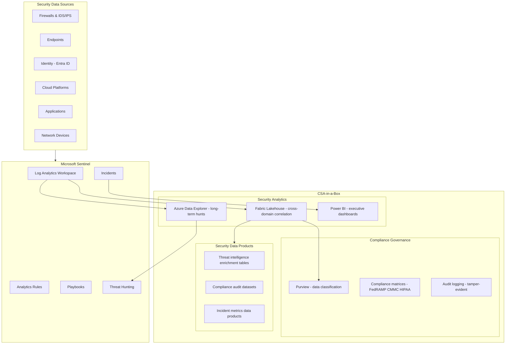
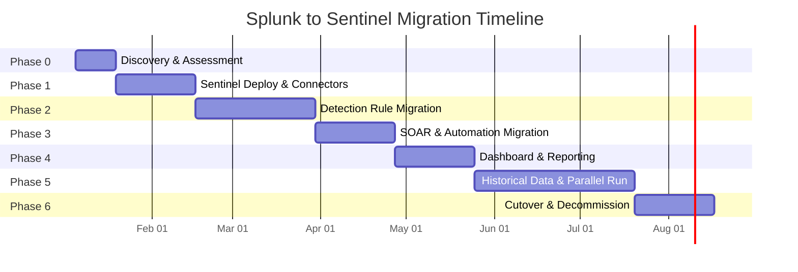

# Splunk to Microsoft Sentinel Migration Center

**The definitive resource for migrating from Splunk Enterprise and Splunk Cloud to Microsoft Sentinel, with CSA-in-a-Box as the security analytics and governance landing zone.**

---

## Who this is for

This migration center serves SOC analysts, security engineers, security architects, CISOs, and federal security teams who are evaluating or executing a migration from Splunk to Microsoft Sentinel. Whether you are responding to Cisco acquisition uncertainty, Splunk license cost pressure, a cloud-native SIEM mandate, or a strategic consolidation around the Microsoft security stack, these resources provide the evidence, patterns, and step-by-step guidance to execute confidently.

---

## Quick-start decision matrix

| Your situation                          | Start here                                                            |
| --------------------------------------- | --------------------------------------------------------------------- |
| Executive evaluating Sentinel vs Splunk | [Why Sentinel over Splunk](why-sentinel-over-splunk.md)               |
| Need cost justification for migration   | [Total Cost of Ownership Analysis](tco-analysis.md)                   |
| Need a feature-by-feature comparison    | [Complete Feature Mapping](feature-mapping-complete.md)               |
| Ready to plan a migration               | [Migration Playbook](../splunk-to-sentinel.md)                        |
| SOC analyst learning KQL                | [SPL to KQL Tutorial](tutorial-spl-to-kql.md)                         |
| Want to use the SIEM Migration tool     | [SIEM Migration Experience Tutorial](tutorial-siem-migration-tool.md) |
| Migrating detection rules               | [Detection Rules Migration](detection-rules-migration.md)             |
| Migrating SOAR playbooks                | [SOAR Migration Guide](soar-migration.md)                             |
| Federal/government SIEM requirements    | [Federal Migration Guide](federal-migration-guide.md)                 |
| Need performance data                   | [Benchmarks](benchmarks.md)                                           |

---

## How CSA-in-a-Box fits

CSA-in-a-Box is not a SIEM. Microsoft Sentinel is the SIEM. CSA-in-a-Box is the **analytics and governance landing zone** that extends what you can do with security data after it lands in Sentinel and Log Analytics.

**What CSA-in-a-Box provides for security teams:**

| Capability               | Without CSA-in-a-Box             | With CSA-in-a-Box                                                                                                          |
| ------------------------ | -------------------------------- | -------------------------------------------------------------------------------------------------------------------------- |
| Cross-domain correlation | SIEM data only                   | Combine security events with HR, finance, IT asset data in Fabric for insider threat, fraud, and compliance analytics      |
| Executive reporting      | Sentinel workbooks (SOC-focused) | Power BI semantic models with Direct Lake for board-level security posture dashboards                                      |
| Long-term threat hunting | 90-day Log Analytics retention   | Years of data in ADX at low cost with sub-second KQL queries                                                               |
| Compliance governance    | Manual compliance evidence       | Purview classifications + CSA-in-a-Box compliance matrices (NIST 800-53, CMMC, HIPAA) automated across security telemetry  |
| Security data products   | Ad-hoc queries                   | Published, governed data products -- enrichment tables, compliance audit logs, incident metrics -- with contracts and SLAs |
| Data mesh for security   | Siloed SIEM                      | Security domain publishes governed data products consumed by risk, compliance, and audit domains                           |

---

## Strategic resources

These documents provide the business case, cost analysis, and strategic framing for decision-makers.

| Document                                                | Audience                    | Description                                                                                                                                         |
| ------------------------------------------------------- | --------------------------- | --------------------------------------------------------------------------------------------------------------------------------------------------- |
| [Why Sentinel over Splunk](why-sentinel-over-splunk.md) | CISO / CIO / Board          | Executive brief covering cloud-native SIEM advantages, Security Copilot, unified Microsoft stack, Cisco acquisition impact, and federal positioning |
| [Total Cost of Ownership Analysis](tco-analysis.md)     | CFO / CISO / Procurement    | Detailed pricing model comparison -- Splunk volume licensing vs Sentinel consumption, hidden costs, 3-year TCO projections                          |
| [Benchmarks & Performance](benchmarks.md)               | CTO / Security Architecture | Query performance (SPL vs KQL), ingestion rates, cost-per-GB, alert processing latency, concurrent query handling                                   |

---

## Technical references

| Document                                                | Description                                                                                                                                      |
| ------------------------------------------------------- | ------------------------------------------------------------------------------------------------------------------------------------------------ |
| [Complete Feature Mapping](feature-mapping-complete.md) | 50+ Splunk features mapped to Sentinel equivalents -- SPL vs KQL, indexes vs workspaces, apps vs Content Hub, ES vs Sentinel, SOAR vs Logic Apps |
| [Migration Playbook](../splunk-to-sentinel.md)          | Concise end-to-end migration playbook with phased approach, architecture, SPL-to-KQL quick reference, and CSA-in-a-Box integration               |

---

## Migration guides

Domain-specific deep dives covering every aspect of a Splunk-to-Sentinel migration.

| Guide                                                     | Splunk capability                                | Sentinel destination                                                               |
| --------------------------------------------------------- | ------------------------------------------------ | ---------------------------------------------------------------------------------- |
| [Detection Rules Migration](detection-rules-migration.md) | Correlation searches, scheduled searches, alerts | Analytics rules (scheduled + NRT), SIEM Migration Experience, Copilot-assisted KQL |
| [SOAR Migration](soar-migration.md)                       | Splunk SOAR playbooks, automation                | Sentinel playbooks (Logic Apps), automation rules, Security Copilot triage         |
| [Data Connector Migration](data-connector-migration.md)   | Forwarders, data inputs, sourcetypes, apps       | Azure Monitor Agent (AMA), Content Hub solutions, native connectors                |
| [Dashboard Migration](dashboard-migration.md)             | Dashboards, views, reports, panels               | Sentinel workbooks, Azure Monitor workbook gallery, Power BI                       |
| [Historical Data Migration](historical-data-migration.md) | Indexes, buckets, cold/frozen tiers              | Log Analytics, Azure Data Explorer (ADX), Basic vs Analytics logs                  |

---

## Tutorials

Hands-on, step-by-step walkthroughs for common migration scenarios.

| Tutorial                                                     | Duration  | What you will build                                                                                                                                                           |
| ------------------------------------------------------------ | --------- | ----------------------------------------------------------------------------------------------------------------------------------------------------------------------------- |
| [SIEM Migration Experience](tutorial-siem-migration-tool.md) | 1-2 hours | Upload Splunk detection rules, review Copilot-translated KQL, deploy analytics rules, configure data connectors using the Defender portal migration tool                      |
| [SPL to KQL Conversion](tutorial-spl-to-kql.md)              | 2-3 hours | Convert 20+ common Splunk SPL queries to KQL with detailed explanations covering authentication, brute force, lateral movement, exfiltration, and privileged access scenarios |

---

## Federal and government

| Document                                              | Description                                                                                                                                                          |
| ----------------------------------------------------- | -------------------------------------------------------------------------------------------------------------------------------------------------------------------- |
| [Federal Migration Guide](federal-migration-guide.md) | Sentinel in Azure Government, FedRAMP High, IL4/IL5, DoD SIEM requirements, Splunk federal market position, ArcSight displacement, compliance retention requirements |

---

## Best practices

| Document                            | Description                                                                                                                                                                               |
| ----------------------------------- | ----------------------------------------------------------------------------------------------------------------------------------------------------------------------------------------- |
| [Best Practices](best-practices.md) | Phased migration strategy, parallel-run validation, detection coverage testing, SOC analyst training (SPL to KQL), Security Copilot adoption, CSA-in-a-Box security analytics integration |

---

## Migration timeline

A realistic migration for a mid-to-large SOC runs 28-32 weeks:

---

## Cisco acquisition context

Cisco completed its $28 billion acquisition of Splunk in March 2024. This is the largest acquisition in Cisco's history and fundamentally changes the SIEM competitive landscape. Key implications:

- **Product roadmap uncertainty** -- Splunk's R&D priorities now compete with Cisco's broader security portfolio (Cisco XDR, SecureX, Talos)
- **Pricing trajectory** -- Cisco has a documented history of post-acquisition price increases across acquired products (Duo, Meraki, AppDynamics)
- **Federal account disruption** -- Organizational integration creates account management transitions during a period when continuity matters most
- **Cloud strategy shifts** -- Cisco may deprioritize Splunk Cloud in favor of Cisco-branded cloud offerings
- **Integration direction** -- The open Splunk ecosystem may tighten around Cisco-native security products

For federal agencies with Splunk contracts approaching renewal, this migration center provides the evidence and execution guidance to evaluate Microsoft Sentinel as the strategic alternative.

---

## Migration success metrics

Track these metrics throughout your migration to measure success:

| Metric                          | Target                                         | How to measure                                 |
| ------------------------------- | ---------------------------------------------- | ---------------------------------------------- |
| **Detection coverage parity**   | >= 95% of Splunk rules operational in Sentinel | MITRE ATT&CK technique comparison              |
| **Mean time to detect (MTTD)**  | <= Splunk MTTD or better                       | Incident creation timestamp vs event timestamp |
| **Mean time to respond (MTTR)** | <= Splunk MTTR or better                       | Incident close timestamp vs creation timestamp |
| **False positive rate**         | Within 20% of Splunk baseline                  | Weekly FP count comparison during parallel run |
| **SOC analyst satisfaction**    | >= 70% positive                                | Survey at 30/60/90 days post-cutover           |
| **Cost reduction**              | >= 50% TCO reduction                           | Annual cost comparison (see TCO Analysis)      |
| **Data ingestion completeness** | 100% of critical sources in Sentinel           | Source-by-source validation                    |
| **Playbook automation rate**    | >= 80% of Splunk SOAR playbooks migrated       | Playbook inventory comparison                  |

---

## Key Microsoft Learn references

- [Microsoft Sentinel documentation](https://learn.microsoft.com/azure/sentinel/)
- [SIEM Migration Experience](https://learn.microsoft.com/azure/sentinel/siem-migration)
- [Migrate to Microsoft Sentinel from Splunk](https://learn.microsoft.com/azure/sentinel/migration-splunk-historical-data)
- [KQL quick reference](https://learn.microsoft.com/kusto/query/kql-quick-reference)
- [Splunk to KQL mapping](https://learn.microsoft.com/azure/data-explorer/kusto/query/splunk-cheat-sheet)
- [Microsoft Sentinel Content Hub](https://learn.microsoft.com/azure/sentinel/sentinel-solutions-catalog)
- [Azure Monitor Agent overview](https://learn.microsoft.com/azure/azure-monitor/agents/azure-monitor-agent-overview)
- [Security Copilot in Sentinel](https://learn.microsoft.com/security-copilot/microsoft-sentinel-plugin)

---

**Maintainers:** csa-inabox core team
**Last updated:** 2026-04-30
