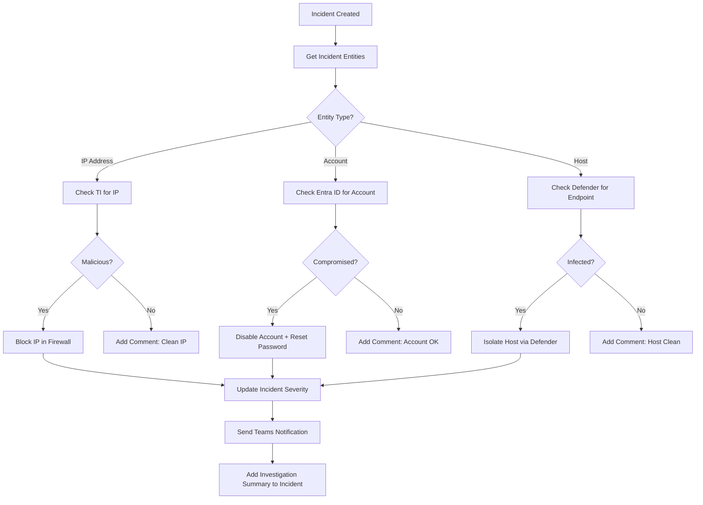

# SOAR Migration: Splunk SOAR to Sentinel Playbooks

**Status:** Authored 2026-04-30
**Audience:** SOC Engineers, Automation Engineers, Security Architects
**Purpose:** Guide for migrating Splunk SOAR playbooks and automation to Sentinel playbooks (Logic Apps) and automation rules

---

## 1. Architecture comparison

### Splunk SOAR architecture

```
Splunk SOAR:
    Events/Notables ──> Playbooks ──> Actions ──> Apps (Integrations)
         │                  │             │
    Trigger rules      Visual editor   Pre-built connectors
    Custom scripts     Decision blocks  Custom scripts (Python)
    Containers         Prompts/approvals REST API calls
```

### Sentinel automation architecture

```
Sentinel Automation:
    Incidents/Alerts ──> Automation Rules ──> Playbooks (Logic Apps)
         │                    │                     │
    Trigger conditions   Simple logic          Full orchestration
    Entity context       Tag/assign/severity   500+ connectors
    Alert grouping       Run playbook          Security Copilot
                         Close/suppress        Custom code (Functions)
```

### Key architectural differences

| Aspect               | Splunk SOAR                                        | Sentinel Playbooks                                           |
| -------------------- | -------------------------------------------------- | ------------------------------------------------------------ |
| **Engine**           | Standalone SOAR platform (separate from Splunk ES) | Logic Apps -- Azure PaaS integrated into Sentinel            |
| **Licensing**        | Separate product ($100K-$500K/year)                | Included -- Logic Apps are pay-per-execution                 |
| **Language**         | Python-based custom actions                        | Logic Apps visual designer + Azure Functions for custom code |
| **Triggers**         | SOAR events, webhooks, scheduled                   | Incident creation, incident update, alert creation           |
| **Connectors**       | SOAR apps (~350+)                                  | Logic Apps connectors (500+) + custom connectors             |
| **State management** | SOAR containers and artifacts                      | Sentinel incident entities and comments                      |
| **Human-in-loop**    | SOAR prompts                                       | Logic Apps approval actions (Teams, email, custom)           |
| **Orchestration**    | Centralized SOAR server                            | Distributed Logic Apps instances                             |

---

## 2. Automation rules vs playbooks

Sentinel provides two automation mechanisms:

### Automation rules (simple logic)

Automation rules execute lightweight actions without a full playbook:

| Action type         | Example                                                         |
| ------------------- | --------------------------------------------------------------- |
| **Assign incident** | Route to specific analyst or team based on incident properties  |
| **Change severity** | Escalate/de-escalate severity based on entity enrichment        |
| **Add tags**        | Tag incidents by data source, compliance framework, or priority |
| **Run playbook**    | Trigger a Logic App for complex orchestration                   |
| **Close incident**  | Auto-close known false positives or informational alerts        |
| **Suppress**        | Suppress duplicate incidents within a time window               |

```json
{
    "automationRule": {
        "displayName": "Route critical identity alerts to Tier 2",
        "triggeringLogic": {
            "isEnabled": true,
            "triggersOn": "Incidents",
            "triggersWhen": "Created",
            "conditions": [
                {
                    "property": "IncidentSeverity",
                    "operator": "Equals",
                    "values": ["High"]
                },
                {
                    "property": "IncidentTactics",
                    "operator": "Contains",
                    "values": ["InitialAccess"]
                }
            ]
        },
        "actions": [
            {
                "actionType": "ModifyProperties",
                "owner": { "assignedTo": "soc-tier2@agency.gov" }
            },
            {
                "actionType": "RunPlaybook",
                "playbookResourceId": "/subscriptions/.../playbooks/enrich-identity"
            }
        ]
    }
}
```

### Playbooks (Logic Apps -- complex orchestration)

Playbooks handle multi-step workflows:



---

## 3. SOAR playbook migration patterns

### Pattern 1: IP enrichment and blocking

**Splunk SOAR playbook:**

```python
# Splunk SOAR custom action
def ip_enrich_and_block(container, action_results):
    ip = container.get_artifact("ip_address")
    # Check VirusTotal
    vt_result = phantom.action("lookup ip", parameters=[{"ip": ip}], app="VirusTotal")
    if vt_result[0]["malicious_count"] > 5:
        # Block in firewall
        phantom.action("block ip", parameters=[{"ip": ip}], app="Palo Alto")
        phantom.set_severity(container, "high")
        phantom.comment(container, f"IP {ip} blocked - {vt_result[0]['malicious_count']} detections")
```

**Sentinel playbook (Logic App):**

1. **Trigger:** Microsoft Sentinel Incident (When incident is created)
2. **Get entities:** Sentinel - Entities - Get IPs
3. **For each IP:**
    - **VirusTotal connector:** Scan IP address
    - **Condition:** If malicious detections > 5
        - **Yes:** Palo Alto connector - Block IP
        - **Yes:** Sentinel - Add comment to incident
        - **Yes:** Sentinel - Update incident severity to High
        - **No:** Sentinel - Add comment (IP clean)

### Pattern 2: User account remediation

**Splunk SOAR playbook:**

```python
def disable_compromised_user(container, action_results):
    username = container.get_artifact("username")
    # Disable in Active Directory
    phantom.action("disable user", parameters=[{"username": username}], app="Active Directory")
    # Reset password
    phantom.action("reset password", parameters=[{"username": username}], app="Active Directory")
    # Revoke sessions
    phantom.action("revoke token", parameters=[{"username": username}], app="Azure AD")
    # Notify manager
    phantom.action("send email", parameters={
        "to": get_manager_email(username),
        "subject": f"Account {username} disabled due to compromise"
    }, app="SMTP")
```

**Sentinel playbook (Logic App):**

1. **Trigger:** Microsoft Sentinel Incident
2. **Get entities:** Sentinel - Get Accounts
3. **For each Account:**
    - **Entra ID connector:** Disable user
    - **Entra ID connector:** Revoke sign-in sessions
    - **Entra ID connector:** Get user manager
    - **Office 365 connector:** Send email to manager
    - **Sentinel connector:** Add comment with remediation details
    - **Teams connector:** Post to SOC channel

### Pattern 3: Incident triage with Security Copilot

This pattern has no Splunk SOAR equivalent -- it leverages Security Copilot for AI-assisted triage:

1. **Trigger:** Microsoft Sentinel Incident
2. **Security Copilot action:** Summarize incident
3. **Security Copilot action:** Assess risk level
4. **Security Copilot action:** Recommend investigation steps
5. **Condition:** If Copilot risk assessment is "Critical"
    - **Yes:** Assign to Tier 3, escalate severity, notify CISO
    - **No:** Add Copilot summary as incident comment for analyst review

### Pattern 4: Ticket creation and ITSM integration

**Splunk SOAR:**

```python
def create_servicenow_ticket(container, action_results):
    phantom.action("create ticket", parameters={
        "short_description": container.get("name"),
        "description": container.get("description"),
        "urgency": map_severity(container.get("severity")),
        "assignment_group": "SOC"
    }, app="ServiceNow")
```

**Sentinel playbook (Logic App):**

1. **Trigger:** Microsoft Sentinel Incident
2. **ServiceNow connector:** Create record
    - Table: `incident`
    - Short description: `@{triggerBody()?['properties']?['title']}`
    - Description: `@{triggerBody()?['properties']?['description']}`
    - Urgency: Map from incident severity
    - Assignment group: SOC
3. **Sentinel connector:** Update incident with ServiceNow ticket number

---

## 4. Connector mapping

| Splunk SOAR app    | Logic Apps connector          | Notes                                   |
| ------------------ | ----------------------------- | --------------------------------------- |
| VirusTotal         | VirusTotal connector          | Native connector available              |
| Palo Alto Networks | Palo Alto PAN-OS connector    | Block/unblock IP, URL                   |
| CrowdStrike        | CrowdStrike Falcon connector  | Host containment, IOC management        |
| ServiceNow         | ServiceNow connector          | Full ITSM integration                   |
| Jira               | Jira connector                | Issue creation and management           |
| Active Directory   | Azure AD / Entra ID connector | User management, group operations       |
| SMTP               | Office 365 Outlook connector  | Email notifications                     |
| Slack              | Slack connector               | Channel notifications                   |
| Microsoft Teams    | Teams connector               | Native -- channel posts, adaptive cards |
| AWS                | AWS connectors (S3, EC2, IAM) | Multi-cloud incident response           |
| Splunk             | Log Analytics connector       | Query Sentinel data                     |
| Carbon Black       | VMware Carbon Black connector | Endpoint response                       |
| Cisco              | Cisco connectors (various)    | Firewall, ISE, Umbrella                 |
| Fortinet           | Fortinet FortiGate connector  | Firewall operations                     |
| Check Point        | Check Point connector         | Firewall operations                     |
| ThreatConnect      | Custom connector / HTTP       | API integration via HTTP action         |
| MISP               | Custom connector / HTTP       | API integration via HTTP action         |
| Recorded Future    | Recorded Future connector     | Threat intelligence enrichment          |

---

## 5. Custom script migration

Splunk SOAR supports custom Python scripts for actions not covered by apps. In Sentinel, these become Azure Functions:

**Splunk SOAR custom script:**

```python
# custom_actions/check_reputation.py
import phantom.rules as phantom
import requests

def check_ip_reputation(container, action_results):
    ip = action_results[0].get_data()[0].get("ip")
    response = requests.get(f"https://api.internal.agency.gov/reputation/{ip}",
                           headers={"Authorization": f"Bearer {phantom.get_config('api_key')}"})
    reputation = response.json()
    phantom.save_artifact(container, {"cef": {"reputation_score": reputation["score"]}})
```

**Azure Function equivalent:**

```python
# function_app.py
import azure.functions as func
import requests
import json
import os

app = func.FunctionApp()

@app.function_name(name="CheckIPReputation")
@app.route(route="check-reputation/{ip}")
def check_ip_reputation(req: func.HttpRequest) -> func.HttpResponse:
    ip = req.route_params.get('ip')
    api_key = os.environ['REPUTATION_API_KEY']  # From Key Vault reference

    response = requests.get(
        f"https://api.internal.agency.gov/reputation/{ip}",
        headers={"Authorization": f"Bearer {api_key}"}
    )
    reputation = response.json()

    return func.HttpResponse(
        json.dumps({"ip": ip, "reputation_score": reputation["score"]}),
        mimetype="application/json"
    )
```

The Azure Function is then called from a Logic App playbook via the HTTP action or Azure Functions connector.

---

## 6. Playbook deployment with Bicep

Deploy playbooks as infrastructure-as-code following CSA-in-a-Box patterns:

```bicep
// modules/sentinel/playbook-ip-enrichment.bicep
param location string
param logAnalyticsWorkspaceId string
param playbookName string = 'Enrich-IP-ThreatIntel'

resource logicApp 'Microsoft.Logic/workflows@2019-05-01' = {
  name: playbookName
  location: location
  tags: {
    'hidden-SentinelTemplateName': 'IPEnrichment'
    'hidden-SentinelTemplateVersion': '1.0'
  }
  identity: {
    type: 'SystemAssigned'
  }
  properties: {
    state: 'Enabled'
    definition: {
      '$schema': 'https://schema.management.azure.com/providers/Microsoft.Logic/schemas/2016-06-01/workflowdefinition.json#'
      contentVersion: '1.0.0.0'
      triggers: {
        Microsoft_Sentinel_incident: {
          type: 'ApiConnectionWebhook'
          inputs: {
            body: {
              callback_url: '@{listCallbackUrl()}'
            }
          }
        }
      }
      actions: {
        // Action definitions...
      }
    }
  }
}

// Assign Sentinel Responder role for playbook to update incidents
resource roleAssignment 'Microsoft.Authorization/roleAssignments@2022-04-01' = {
  name: guid(logicApp.id, 'SentinelResponder')
  properties: {
    roleDefinitionId: subscriptionResourceId('Microsoft.Authorization/roleDefinitions',
      '3e150937-b8fe-4cfb-8069-0eaf05ecd056') // Sentinel Responder
    principalId: logicApp.identity.principalId
    principalType: 'ServicePrincipal'
  }
}
```

---

## 7. Security Copilot integration in playbooks

Security Copilot can be invoked from Logic App playbooks for AI-assisted triage:

| Copilot action           | Use case in playbook                                         |
| ------------------------ | ------------------------------------------------------------ |
| **Summarize incident**   | Generate human-readable incident summary for analyst handoff |
| **Assess risk**          | AI-driven risk assessment to determine escalation path       |
| **Analyze script**       | Evaluate suspicious scripts found in incident evidence       |
| **Generate report**      | Create incident report for management or compliance          |
| **Recommend response**   | Suggest remediation steps based on incident context          |
| **KQL query generation** | Generate hunting queries based on incident entities          |

---

## 8. Migration checklist

- [ ] Inventory all Splunk SOAR playbooks (name, trigger, actions, integrations)
- [ ] Map SOAR app integrations to Logic App connectors
- [ ] Identify custom scripts requiring Azure Functions migration
- [ ] Prioritize playbooks by frequency of execution and business criticality
- [ ] Build automation rules for simple logic (assign, tag, close)
- [ ] Build Logic App playbooks for complex orchestration
- [ ] Configure managed identities and RBAC for playbooks
- [ ] Deploy playbooks via Bicep (CSA-in-a-Box infrastructure-as-code pattern)
- [ ] Test end-to-end: simulate incident, verify playbook execution, validate actions
- [ ] Configure Security Copilot integration for AI-assisted triage
- [ ] Monitor playbook execution metrics in Sentinel workbooks
- [ ] Document playbook catalog for SOC operations runbook

---

**Next steps:**

- [Data Connector Migration](data-connector-migration.md) -- migrate data sources
- [Dashboard Migration](dashboard-migration.md) -- migrate visualization
- [Best Practices](best-practices.md) -- phased migration strategy

---

**Maintainers:** csa-inabox core team
**Last updated:** 2026-04-30
