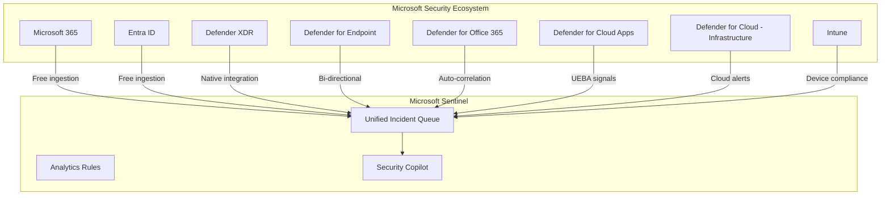

# Why Microsoft Sentinel over Splunk

**Status:** Authored 2026-04-30
**Audience:** CISOs, CIOs, Security Architects, Federal Security Leadership
**Purpose:** Executive brief for decision-makers evaluating a Splunk-to-Sentinel migration

---

## Executive summary

The security information and event management (SIEM) market is at an inflection point. Cisco's $28 billion acquisition of Splunk, completed in March 2024, has fundamentally altered the competitive landscape. Splunk -- the dominant SIEM in federal and enterprise environments -- is now a product line within Cisco's broader security portfolio rather than an independent, SIEM-focused company.

Simultaneously, Microsoft has invested heavily in Sentinel as a cloud-native SIEM/SOAR platform with AI-native capabilities (Security Copilot), consumption-based pricing, and deep integration across the Microsoft security stack. For organizations already invested in Microsoft 365, Entra ID, and Defender XDR, Sentinel offers a unified security operations experience that Splunk cannot replicate without extensive add-ons and custom integrations.

This document presents the strategic case for migrating from Splunk to Microsoft Sentinel. It is written for decision-makers, not marketing audiences. Where Splunk retains advantages, we say so explicitly.

---

## 1. The Cisco acquisition changes the calculus

### What happened

Cisco completed its acquisition of Splunk for $28 billion in March 2024. Splunk is now a wholly owned subsidiary of Cisco Systems, not an independent company.

### What this means for Splunk customers

| Factor                    | Before acquisition                                              | After acquisition                                                                                                                |
| ------------------------- | --------------------------------------------------------------- | -------------------------------------------------------------------------------------------------------------------------------- |
| **Product roadmap**       | SIEM-focused, independent R&D                                   | Subsumed into Cisco security portfolio; investment priorities compete with Cisco XDR, SecureX, and other Cisco security products |
| **Pricing trajectory**    | Aggressive but predictable                                      | Uncertain; Cisco has a history of increasing prices post-acquisition (Duo, Meraki, AppDynamics precedents)                       |
| **Federal relationships** | Direct Splunk federal sales team with deep agency relationships | Cisco federal team absorbing Splunk; organizational transition creates account management disruption                             |
| **Cloud strategy**        | Splunk Cloud as primary cloud SIEM                              | Cisco's cloud strategy may deprioritize Splunk Cloud in favor of Cisco-branded offerings                                         |
| **Integration direction** | Open ecosystem with broad app marketplace                       | Likely tightening around Cisco security portfolio (Talos, Secure Endpoint, Umbrella)                                             |
| **Long-term viability**   | Independent company with SIEM as core mission                   | Division within a $60B networking company; SIEM is not Cisco's core business                                                     |

### The risk of inaction

Staying on Splunk is itself a strategic decision with risk. Federal agencies that assume continuity may face:

- **License cost escalation** at next renewal (Cisco acquisition synergies often translate to price increases)
- **Reduced innovation velocity** as Splunk R&D competes with other Cisco priorities
- **Talent attrition** from Splunk engineering as post-acquisition integration progresses
- **Integration friction** if Cisco prioritizes Cisco-native security products over Splunk's open ecosystem

---

## 2. Cloud-native SIEM architecture

### Splunk: infrastructure-heavy

Splunk Enterprise requires significant infrastructure to operate:

```
Splunk Enterprise Architecture:

    Heavy Forwarders ──> Indexer Cluster ──> Search Head Cluster
         │                    │                     │
    Deploy agents       Provision storage      Manage search
    Manage configs      Scale horizontally     Load balancing
    Network routing     Hot/Warm/Cold tiers    Knowledge objects
                        Replication factor
                        Bucket management
```

- **Indexer clusters** must be sized, provisioned, and maintained
- **Search head clusters** require load balancing and capacity planning
- **Storage tiers** (hot/warm/cold/frozen) must be managed manually
- **Forwarder deployment** at scale requires configuration management
- **Upgrades** are complex multi-component rolling operations
- **High availability** requires cluster replication configuration

### Sentinel: cloud-native, zero infrastructure

```
Sentinel Architecture:

    Data Sources ──> Data Connectors ──> Log Analytics Workspace ──> Sentinel
                                              │                        │
                                         Auto-scales              Analytics Rules
                                         Auto-replicates          Playbooks
                                         Auto-indexes             Workbooks
                                         Managed by Azure         Threat Hunting
                                                                  Security Copilot
```

- **No infrastructure to manage** -- Azure handles all compute, storage, indexing
- **Auto-scaling** -- ingestion capacity scales with demand
- **Built-in HA/DR** -- Azure infrastructure provides zone and region redundancy
- **Seamless updates** -- new features deploy automatically, no upgrade windows
- **Native multi-tenancy** -- Azure Lighthouse for MSSP and multi-agency scenarios

### What this means in practice

| Operational task         | Splunk Enterprise                                   | Microsoft Sentinel                       |
| ------------------------ | --------------------------------------------------- | ---------------------------------------- |
| Scale ingestion capacity | Provision new indexers, rebalance clusters          | Automatic -- pay for what you ingest     |
| Patch/upgrade SIEM       | Rolling upgrade across all components (outage risk) | Automatic -- zero downtime               |
| Manage storage tiers     | Manual hot/warm/cold/frozen bucket policy           | Automatic -- interactive + archive tiers |
| Deploy to new region     | Build new cluster from scratch                      | Enable workspace in target region        |
| Disaster recovery        | Configure cross-site replication                    | Built into Azure infrastructure          |
| Certificate management   | Manual across forwarders and indexers               | Managed by Azure platform                |

**Bottom line:** Sentinel eliminates the undifferentiated heavy lifting of SIEM infrastructure management. Your security team spends time on detection engineering and threat hunting, not indexer maintenance.

---

## 3. Security Copilot integration

Microsoft Security Copilot is the generative AI assistant built into the Microsoft security stack. Its integration with Sentinel is native and deep -- not a bolt-on.

### What Security Copilot does in Sentinel

| Capability                          | How it works                                                                                                                                             |
| ----------------------------------- | -------------------------------------------------------------------------------------------------------------------------------------------------------- |
| **Natural-language threat hunting** | Ask questions in plain English ("Show me all failed authentication attempts from external IPs in the last 24 hours") and Copilot generates the KQL query |
| **Incident summarization**          | Copilot reads all entities, alerts, and evidence in an incident and produces a human-readable summary for analyst triage                                 |
| **KQL query generation**            | Describe what you want to find; Copilot writes the query. Invaluable for analysts transitioning from SPL                                                 |
| **Script analysis**                 | Paste a suspicious PowerShell script; Copilot explains what it does, identifies malicious indicators                                                     |
| **Guided response**                 | Copilot recommends investigation and remediation steps based on incident context                                                                         |
| **Report generation**               | Copilot generates incident reports suitable for management and compliance documentation                                                                  |

### Splunk AI comparison

Splunk has introduced AI capabilities (Splunk AI Assistant, Splunk MLTK), but these are:

- **Add-on products** requiring separate licensing
- **Not integrated** into the core SIEM workflow the way Copilot is embedded in Sentinel
- **Limited in scope** -- Splunk AI Assistant focuses on SPL generation, not end-to-end incident triage
- **Cisco's AI strategy** post-acquisition may redirect AI investment to Cisco-branded products

### Why this matters for federal

Federal SOC analysts face a talent shortage. The cybersecurity workforce gap in the US federal government exceeds 30,000 positions. Security Copilot acts as a force multiplier:

- Junior analysts can perform senior-level threat hunting with Copilot assistance
- KQL learning curve is reduced dramatically with natural-language query generation
- Incident triage time decreases when Copilot summarizes complex, multi-alert incidents
- Documentation burden is reduced with automated report generation

---

## 4. Consumption-based pricing vs volume licensing

### Splunk pricing model

Splunk pricing is fundamentally volume-based:

- **Splunk Enterprise:** priced per GB of daily indexing volume (typically $1,800-$3,600 per GB/day annually)
- **Splunk Cloud:** similar volume-based pricing with platform fees
- **Splunk Enterprise Security (ES):** additional premium (often 50-100% of base license cost)
- **Splunk SOAR:** separate product with its own licensing
- **Hidden costs:** infrastructure (servers, storage, networking), admin FTE, app licensing

**The structural problem:** Security telemetry volumes grow 30-40% year-over-year. Splunk's volume-based model means costs escalate with data growth, creating a perverse incentive to reduce security visibility to control costs.

### Sentinel pricing model

Sentinel pricing is consumption-based with significant cost optimizations:

- **Pay-per-GB ingestion:** no upfront licensing; pay only for data ingested
- **Commitment tiers:** discounts of 15-50% for committed daily ingestion volumes
- **Free Microsoft data sources:** Microsoft 365 audit logs, Entra ID sign-in logs, Defender XDR alerts, Azure Activity logs -- ingested at no cost
- **Basic Logs tier:** 60-75% cost reduction for high-volume, low-query data (e.g., verbose network flow logs)
- **Archive tier:** near-zero cost storage for compliance retention
- **No separate SOAR licensing:** Logic Apps (playbooks) are pay-per-execution
- **No infrastructure costs:** zero servers, zero storage management

### Cost comparison at scale

For a federal SOC ingesting 50 TB/month:

| Cost element               | Splunk Enterprise (annual)    | Microsoft Sentinel (annual) |
| -------------------------- | ----------------------------- | --------------------------- |
| SIEM licensing             | $3,000,000 - $5,000,000       | $1,200,000 - $2,000,000     |
| SOAR licensing             | $300,000 - $500,000           | $0 (pay-per-execution)      |
| Infrastructure             | $800,000 - $1,200,000         | $0 (cloud-native)           |
| Free Microsoft data credit | N/A                           | ($500,000) - ($800,000)     |
| Admin FTE (platform ops)   | $400,000 - $600,000           | $150,000 - $250,000         |
| **Annual total**           | **$4,500,000 - $7,300,000**   | **$1,050,000 - $2,250,000** |
| **3-year total**           | **$13,500,000 - $21,900,000** | **$3,150,000 - $6,750,000** |

See [TCO Analysis](tco-analysis.md) for detailed modeling.

---

## 5. Unified Microsoft security stack

### The integration advantage

Organizations using Microsoft 365, Entra ID, and Azure already have security telemetry flowing through Microsoft services. Sentinel is the natural aggregation point.



**Key integrations that Splunk cannot replicate natively:**

| Integration                      | Sentinel benefit                                                                  | Splunk equivalent                                                     |
| -------------------------------- | --------------------------------------------------------------------------------- | --------------------------------------------------------------------- |
| Defender XDR bi-directional sync | Incidents, entities, and evidence flow between XDR and Sentinel automatically     | Requires Splunk add-on for Microsoft Defender; one-way data flow only |
| Entra ID Identity Protection     | Risk signals, conditional access events, privileged identity alerts flow natively | Requires custom app and API polling                                   |
| Microsoft 365 audit logs         | Free ingestion, pre-built analytics rules and workbooks                           | Requires O365 Management API integration and Splunk app licensing     |
| Intune device compliance         | Device posture and compliance signals available for correlation                   | No native integration; requires custom scripting                      |
| Defender for Cloud               | Cloud security posture and workload protection alerts                             | Requires custom connector development                                 |
| Security Copilot                 | Embedded in Sentinel workflows -- triage, hunting, reporting                      | No equivalent; Splunk AI Assistant is SPL-only                        |

---

## 6. SIEM Migration Experience

Microsoft has built a purpose-built migration tool for Splunk customers.

### What the SIEM Migration Experience provides

1. **Upload SPL detection rules** -- export your Splunk correlation searches and upload to the Defender portal
2. **Copilot-powered translation** -- each SPL rule is automatically translated to KQL with entity mapping
3. **Translation status** -- each rule is categorized as fully translated, partially translated, or not translated
4. **Side-by-side review** -- see SPL and KQL side by side for validation
5. **Data connector recommendations** -- the tool identifies which Sentinel data connectors you need
6. **One-click deployment** -- deploy validated analytics rules directly to your Sentinel workspace

### Why this matters

The number-one barrier to SIEM migration is detection rule conversion. Organizations with 500+ Splunk correlation searches face months of manual SPL-to-KQL translation. The SIEM Migration Experience reduces this to days of review and validation rather than months of rewriting.

See [Tutorial: SIEM Migration Experience](tutorial-siem-migration-tool.md) for the step-by-step walkthrough.

---

## 7. Federal positioning

### Splunk in federal today

Splunk holds dominant SIEM market share in the federal government:

- **DoD:** Splunk is the most widely deployed SIEM across military departments and combatant commands
- **Intelligence Community:** Splunk is used extensively for security analytics and operational intelligence
- **Civilian agencies:** Splunk is the incumbent SIEM at most large civilian agencies (DHS, DOJ, Treasury, State, HHS)
- **CISA CDM:** Splunk is used by many agencies for CDM dashboard integration

### Sentinel in federal today

Sentinel's federal footprint is growing rapidly:

- **Azure Government:** Sentinel is available in Azure Government with FedRAMP High authorization
- **IL4/IL5:** Full support for IL4 workloads; IL5 support for most Sentinel capabilities
- **DoD adoption:** Multiple DoD components have migrated or are actively migrating to Sentinel
- **ArcSight displacement:** Sentinel is the primary beneficiary of ArcSight end-of-life migrations in federal
- **CISA alignment:** Microsoft's federal security team actively supports CDM integration with Sentinel

### Compliance advantage

| Framework    | Splunk                  | Sentinel                                                |
| ------------ | ----------------------- | ------------------------------------------------------- |
| FedRAMP High | Splunk Cloud authorized | Azure Government authorized (inherited)                 |
| IL4          | Available               | Full support                                            |
| IL5          | Available               | Available (most capabilities)                           |
| IL6          | Available               | **Gap** -- not available                                |
| NIST 800-53  | Customer responsibility | CSA-in-a-Box provides machine-readable control mappings |
| CMMC 2.0     | Customer responsibility | CSA-in-a-Box provides practice-level mappings           |
| CJIS         | Available               | Available in Azure Government                           |

**Note:** For IL6 (classified SCI) workloads, Splunk retains an advantage. Sentinel does not currently operate at IL6. Organizations with IL6 requirements should plan a split architecture: Sentinel for IL4/IL5 unclassified SIEM, Splunk or alternative for IL6.

See [Federal Migration Guide](federal-migration-guide.md) for comprehensive federal considerations.

---

## 8. Where Splunk retains advantages

This assessment is honest about where Splunk remains stronger today:

### SPL maturity and ecosystem

SPL (Search Processing Language) has 20+ years of maturity. The Splunk ecosystem includes thousands of apps, add-ons, and community-contributed content on Splunkbase. While KQL is powerful and growing, SPL's ecosystem breadth is larger today.

### On-premises deployment

Splunk Enterprise can be deployed entirely on-premises or in air-gapped environments. Sentinel is cloud-only. For organizations that require a fully on-premises SIEM (some classified environments, some OT/ICS networks), Splunk is the better fit.

### Observability convergence

Splunk positions itself as a unified observability + security platform (logs, metrics, traces, and security events). While Microsoft offers Azure Monitor for observability and Sentinel for security, the integration between them -- though improving -- is not as seamless as Splunk's unified platform.

### IL6 support

As noted above, Splunk operates at IL6 for classified workloads. Sentinel does not.

### Existing tribal knowledge

Organizations with years of Splunk investment have institutional SPL knowledge, trained analysts, and battle-tested detection content. The switching cost is real and should not be underestimated.

---

## 9. Decision framework

### Migrate to Sentinel when

- Your organization uses Microsoft 365, Entra ID, and/or Defender XDR
- Splunk license costs are a budget concern, especially with data growth
- You want to eliminate SIEM infrastructure management
- Security Copilot's AI capabilities align with your SOC modernization strategy
- You are already on Azure or Azure Government
- Your compliance requirements are IL5 or below
- You want consumption-based pricing that scales with workload, not fixed volume licensing

### Stay on Splunk when

- You require IL6 support for classified workloads
- You need a fully on-premises or air-gapped SIEM
- Your organization has deep Splunk investment with minimal Microsoft footprint
- Unified observability (logs + metrics + traces + security) in a single platform is a hard requirement
- Your Splunk contract terms are favorable and long-term
- SOC analyst retraining cost outweighs license savings in your specific scenario

### Split architecture

Many federal agencies will adopt a split approach:

- **Sentinel** for IL4/IL5 unclassified SIEM with Security Copilot and Microsoft stack integration
- **Splunk** (or ArcSight replacement) for IL6 classified SIEM where required
- **CSA-in-a-Box** as the analytics landing zone for security data from both environments

---

## 10. The CSA-in-a-Box advantage

The migration to Sentinel is not just a SIEM swap. With CSA-in-a-Box, security teams gain capabilities that neither Splunk nor Sentinel alone provides:

| Capability               | Splunk alone                        | Sentinel alone           | Sentinel + CSA-in-a-Box                                                |
| ------------------------ | ----------------------------------- | ------------------------ | ---------------------------------------------------------------------- |
| Real-time detection      | Yes                                 | Yes                      | Yes                                                                    |
| Cross-domain analytics   | Limited (requires custom apps)      | Limited (SIEM data only) | Full -- Fabric lakehouses combine security, HR, finance, IT asset data |
| Long-term threat hunting | Cold/frozen tiers (slow, expensive) | 90-day interactive       | Years in ADX at low cost with sub-second KQL                           |
| Compliance governance    | Manual                              | Manual                   | Automated -- Purview classifications + compliance matrices             |
| Executive dashboards     | Splunk dashboards                   | Sentinel workbooks       | Power BI semantic models with Direct Lake                              |
| Security data products   | No                                  | No                       | Governed data products with contracts, SLAs, lineage                   |

---

## Summary

The case for Sentinel over Splunk is built on five pillars:

1. **Cisco acquisition risk** -- Splunk's future is uncertain under Cisco ownership
2. **Cloud-native architecture** -- eliminate infrastructure management burden
3. **Security Copilot** -- AI-native capabilities embedded in SIEM workflows
4. **Consumption-based pricing** -- structural cost advantage, especially with free Microsoft data sources
5. **Unified Microsoft stack** -- native integration with Defender XDR, Entra ID, M365

CSA-in-a-Box extends the value proposition by providing the analytics and governance platform that transforms Sentinel from a reactive SIEM into a proactive security intelligence platform.

---

**Next steps:**

- [TCO Analysis](tco-analysis.md) -- model the cost savings for your specific environment
- [Feature Mapping](feature-mapping-complete.md) -- see how every Splunk feature maps to Sentinel
- [Migration Playbook](../splunk-to-sentinel.md) -- plan your migration
- [Federal Guide](federal-migration-guide.md) -- federal-specific considerations

---

**Maintainers:** csa-inabox core team
**Last updated:** 2026-04-30
