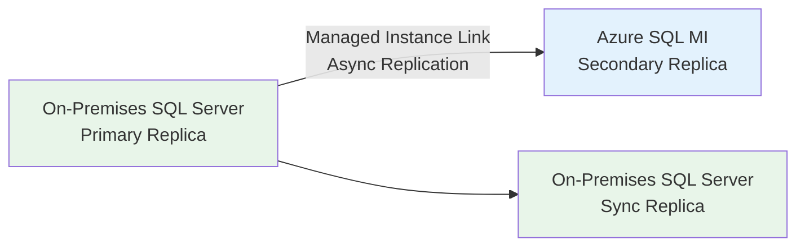

# HA/DR Migration -- SQL Server to Azure SQL

**Audience:** DBAs, infrastructure architects, DR planners
**Scope:** Always On AG migration, failover groups, geo-replication, backup strategy

---

## Overview

On-premises SQL Server high availability and disaster recovery configurations -- Always On Availability Groups, Failover Cluster Instances, log shipping, and database mirroring -- must be translated to Azure-native HA/DR patterns. Azure SQL Database and Managed Instance provide built-in high availability, which in many cases eliminates the need for manual HA configuration entirely. This guide covers the migration of each on-premises HA/DR pattern to its Azure equivalent.

---

## HA/DR capability mapping

| On-premises HA/DR pattern   | Azure SQL Database     | Azure SQL Managed Instance | SQL Server on Azure VM       |
| --------------------------- | ---------------------- | -------------------------- | ---------------------------- |
| **Always On AG (sync)**     | Built-in (automatic)   | Built-in (automatic)       | Full AG support              |
| **Always On AG (async DR)** | Active geo-replication | Auto-failover groups       | AG across Azure regions      |
| **FCI (Failover Cluster)**  | Not applicable         | Not applicable             | FCI with Azure Shared Disks  |
| **Log shipping**            | Not applicable         | Not applicable             | Supported                    |
| **Database mirroring**      | Not applicable         | Not applicable             | Deprecated (use AG)          |
| **Backup/restore DR**       | Automatic PITR + LTR   | Automatic PITR + LTR       | Azure Backup + backup to URL |
| **Replication**             | Active geo-replication | Auto-failover groups       | AG or replication            |

---

## Azure SQL Database HA/DR

### Built-in high availability

Azure SQL Database provides automatic HA at every service tier. No configuration required.

| Service tier          | HA architecture                           | SLA     | Failover behavior                         |
| --------------------- | ----------------------------------------- | ------- | ----------------------------------------- |
| **General Purpose**   | Remote storage with compute redundancy    | 99.99%  | Automatic failover to new compute node    |
| **Business Critical** | Local SSD with 3-4 synchronous replicas   | 99.995% | Automatic failover within the replica set |
| **Hyperscale**        | Distributed architecture with HA replicas | 99.995% | Automatic failover with named replicas    |

### Active geo-replication

Active geo-replication creates readable secondary databases in different Azure regions:

```bash
# Create a geo-replica in a secondary region
az sql db replica create \
  --resource-group myRG \
  --server primary-server \
  --name AdventureWorks \
  --partner-server secondary-server \
  --partner-resource-group dr-rg

# Check replication status
az sql db replica list-links \
  --resource-group myRG \
  --server primary-server \
  --name AdventureWorks

# Manual failover (planned)
az sql db replica set-primary \
  --resource-group dr-rg \
  --server secondary-server \
  --name AdventureWorks

# Forced failover (unplanned, potential data loss)
az sql db replica set-primary \
  --resource-group dr-rg \
  --server secondary-server \
  --name AdventureWorks \
  --allow-data-loss
```

### Auto-failover groups

Auto-failover groups provide automatic failover with a single connection endpoint:

```bash
# Create failover group
az sql failover-group create \
  --resource-group myRG \
  --server primary-server \
  --name myFailoverGroup \
  --partner-server secondary-server \
  --partner-resource-group dr-rg \
  --failover-policy Automatic \
  --grace-period 1

# Add databases to the failover group
az sql failover-group update \
  --resource-group myRG \
  --server primary-server \
  --name myFailoverGroup \
  --add-db AdventureWorks
```

Application connection strings use the failover group endpoints:

```
# Read-write endpoint (always points to primary)
Server=tcp:myFailoverGroup.database.windows.net,1433;Database=AdventureWorks;...

# Read-only endpoint (points to secondary)
Server=tcp:myFailoverGroup.secondary.database.windows.net,1433;Database=AdventureWorks;ApplicationIntent=ReadOnly;...
```

---

## Azure SQL Managed Instance HA/DR

### Built-in HA

SQL MI provides built-in HA with automatic failover:

- **General Purpose:** Remote storage with compute failover (99.99% SLA)
- **Business Critical:** Local SSD with 3-4 synchronous replicas (99.99% SLA)

### Auto-failover groups for SQL MI

```bash
# Create failover group between two managed instances
az sql instance-failover-group create \
  --resource-group myRG \
  --name myMIFailoverGroup \
  --mi primary-mi \
  --partner-mi secondary-mi \
  --partner-resource-group dr-rg \
  --failover-policy Automatic \
  --grace-period 1
```

### Managed Instance Link (hybrid HA)

The Managed Instance Link enables a hybrid HA topology where the on-premises AG and Azure SQL MI share a replication link:



The MI Link can serve dual purposes:

1. **DR:** MI acts as a cloud-based DR replica for on-premises workloads
2. **Migration:** After synchronization, failover to MI to complete migration

```sql
-- Requirements for MI Link:
-- SQL Server 2016 SP3+ or SQL Server 2019 CU17+
-- Always On AG configured on-premises
-- Distributed AG support

-- The link is configured through SSMS 19+ or Azure portal
-- It creates a distributed availability group between
-- the on-premises AG and the MI
```

---

## SQL Server on Azure VM HA/DR

### Always On AG on Azure VMs

For SQL Server on Azure VMs, configure Always On AG manually, similar to on-premises but with Azure-specific networking:

```powershell
# Step 1: Create Windows Server Failover Cluster
New-Cluster -Name "SQLCLUSTER" -Node "SQLVM1","SQLVM2" `
  -StaticAddress "10.0.1.100" `
  -NoStorage

# Step 2: Enable Always On on each SQL Server instance
Enable-SqlAlwaysOn -ServerInstance "SQLVM1" -Force
Enable-SqlAlwaysOn -ServerInstance "SQLVM2" -Force
```

```sql
-- Step 3: Create AG
CREATE AVAILABILITY GROUP [AG-Azure]
WITH (
    AUTOMATED_BACKUP_PREFERENCE = PRIMARY,
    DB_FAILOVER = ON,
    CLUSTER_TYPE = WSFC
)
FOR DATABASE [AdventureWorks]
REPLICA ON
    N'SQLVM1' WITH (
        ENDPOINT_URL = N'TCP://SQLVM1:5022',
        AVAILABILITY_MODE = SYNCHRONOUS_COMMIT,
        FAILOVER_MODE = AUTOMATIC,
        SEEDING_MODE = AUTOMATIC
    ),
    N'SQLVM2' WITH (
        ENDPOINT_URL = N'TCP://SQLVM2:5022',
        AVAILABILITY_MODE = SYNCHRONOUS_COMMIT,
        FAILOVER_MODE = AUTOMATIC,
        SEEDING_MODE = AUTOMATIC
    );
```

### Azure load balancer for AG listener

```bicep
// Bicep: Internal load balancer for AG listener
resource agListener 'Microsoft.Network/loadBalancers@2023-09-01' = {
  name: 'ag-lb'
  location: location
  sku: {
    name: 'Standard'
  }
  properties: {
    frontendIPConfigurations: [
      {
        name: 'agListenerFrontend'
        properties: {
          subnet: {
            id: subnetId
          }
          privateIPAddress: '10.0.1.200'
          privateIPAllocationMethod: 'Static'
        }
      }
    ]
    backendAddressPools: [
      {
        name: 'sqlVMs'
      }
    ]
    loadBalancingRules: [
      {
        name: 'agListenerRule'
        properties: {
          frontendIPConfiguration: {
            id: resourceId('Microsoft.Network/loadBalancers/frontendIPConfigurations', 'ag-lb', 'agListenerFrontend')
          }
          backendAddressPool: {
            id: resourceId('Microsoft.Network/loadBalancers/backendAddressPools', 'ag-lb', 'sqlVMs')
          }
          protocol: 'Tcp'
          frontendPort: 1433
          backendPort: 1433
          enableFloatingIP: true
          idleTimeoutInMinutes: 4
          probe: {
            id: resourceId('Microsoft.Network/loadBalancers/probes', 'ag-lb', 'agProbe')
          }
        }
      }
    ]
    probes: [
      {
        name: 'agProbe'
        properties: {
          protocol: 'Tcp'
          port: 59999
          intervalInSeconds: 5
          numberOfProbes: 2
        }
      }
    ]
  }
}
```

---

## Backup strategy migration

### Azure SQL Database / MI automatic backup

| Backup type            | Frequency             | Retention        | Configuration |
| ---------------------- | --------------------- | ---------------- | ------------- |
| Full backup            | Weekly                | 7-35 days (PITR) | Automatic     |
| Differential backup    | Every 12-24 hours     | Included in PITR | Automatic     |
| Transaction log backup | Every 5-10 minutes    | Included in PITR | Automatic     |
| Long-term retention    | Weekly/monthly/yearly | Up to 10 years   | Configurable  |

```bash
# Configure long-term retention
az sql db ltr-policy set \
  --resource-group myRG \
  --server myserver \
  --database AdventureWorks \
  --weekly-retention P4W \
  --monthly-retention P12M \
  --yearly-retention P5Y \
  --week-of-year 1
```

### Point-in-time restore

```bash
# Restore to a specific point in time
az sql db restore \
  --resource-group myRG \
  --server myserver \
  --name AdventureWorks-Restored \
  --dest-name AdventureWorks-Restored \
  --time "2026-04-29T14:30:00Z"
```

### SQL on VM backup with Azure Backup

```bash
# Enable Azure Backup for SQL on VM
az backup protection enable-for-azurewl \
  --resource-group myRG \
  --vault-name myBackupVault \
  --policy-name SQLBackupPolicy \
  --protectable-item-type SQLDataBase \
  --protectable-item-name "sqldatasource;mssqlserver;AdventureWorks" \
  --server-name SQLVM1 \
  --workload-type MSSQL
```

---

## DR testing

### Failover group DR drill

```bash
# Step 1: Initiate planned failover
az sql failover-group set-primary \
  --resource-group dr-rg \
  --server secondary-server \
  --name myFailoverGroup

# Step 2: Validate application connectivity to secondary
# Application should connect automatically via failover group endpoint

# Step 3: Fail back to primary
az sql failover-group set-primary \
  --resource-group myRG \
  --server primary-server \
  --name myFailoverGroup
```

---

## Related

- [Security Migration](security-migration.md)
- [Azure SQL DB Migration](azure-sql-db-migration.md)
- [Azure SQL MI Migration](azure-sql-mi-migration.md)
- [SQL on VM Migration](sql-on-vm-migration.md)
- [Best Practices](best-practices.md)

---

## References

- [Azure SQL Database HA](https://learn.microsoft.com/azure/azure-sql/database/high-availability-sla)
- [Auto-failover groups](https://learn.microsoft.com/azure/azure-sql/database/auto-failover-group-overview)
- [Active geo-replication](https://learn.microsoft.com/azure/azure-sql/database/active-geo-replication-overview)
- [Managed Instance Link](https://learn.microsoft.com/azure/azure-sql/managed-instance/managed-instance-link-feature-overview)
- [SQL on VM HA](https://learn.microsoft.com/azure/azure-sql/virtual-machines/windows/hadr-cluster-best-practices)
- [Azure Backup for SQL](https://learn.microsoft.com/azure/backup/backup-azure-sql-database)
- [Point-in-time restore](https://learn.microsoft.com/azure/azure-sql/database/recovery-using-backups)
