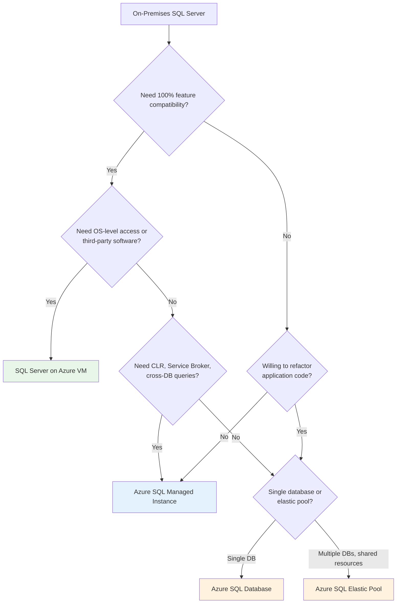

# SQL Server to Azure SQL Migration Center

**The definitive resource for migrating on-premises SQL Server to Azure SQL Database, Azure SQL Managed Instance, and SQL Server on Azure VMs -- integrated with the CSA-in-a-Box analytics and governance platform.**

---

## Who this is for

This migration center serves database administrators, data engineers, cloud architects, application developers, and IT leadership who are planning or executing a migration from on-premises SQL Server to Azure. Whether you are responding to end-of-support deadlines, pursuing cost optimization, modernizing your data platform, or meeting federal compliance requirements, these resources provide the assessment tools, migration patterns, and step-by-step guidance to execute confidently.

---

## Quick-start decision matrix

| Your situation                           | Start here                                                             |
| ---------------------------------------- | ---------------------------------------------------------------------- |
| Executive evaluating Azure SQL benefits  | [Why Azure SQL (Executive Brief)](why-azure-sql.md)                    |
| Need cost justification for migration    | [Total Cost of Ownership Analysis](tco-analysis.md)                    |
| Need a feature-by-feature comparison     | [Complete Feature Mapping (60+ features)](feature-mapping-complete.md) |
| Ready to plan a migration                | [Migration Playbook](../sql-server-to-azure.md)                        |
| Targeting Azure SQL Database (PaaS)      | [Azure SQL DB Migration Guide](azure-sql-db-migration.md)              |
| Targeting Azure SQL Managed Instance     | [Azure SQL MI Migration Guide](azure-sql-mi-migration.md)              |
| Targeting SQL Server on Azure VM         | [SQL on VM Migration Guide](sql-on-vm-migration.md)                    |
| Need schema conversion guidance          | [Schema Migration](schema-migration.md)                                |
| Need data movement strategies            | [Data Migration](data-migration.md)                                    |
| Migrating security and compliance        | [Security Migration](security-migration.md)                            |
| Migrating HA/DR                          | [HA/DR Migration](ha-dr-migration.md)                                  |
| Federal/government-specific requirements | [Federal Migration Guide](federal-migration-guide.md)                  |
| Want hands-on tutorials                  | [Tutorials](#tutorials)                                                |
| Need performance data                    | [Benchmarks](benchmarks.md)                                            |

---

## Choosing the right Azure SQL target

The most critical decision in a SQL Server migration is selecting the right Azure target. Each option optimizes for different priorities.

### Target comparison at a glance

| Dimension                | Azure SQL Database              | Azure SQL Managed Instance            | SQL Server on Azure VM            |
| ------------------------ | ------------------------------- | ------------------------------------- | --------------------------------- |
| **Service model**        | PaaS (database-level)           | PaaS (instance-level)                 | IaaS (full VM)                    |
| **T-SQL compatibility**  | ~95%                            | ~99%                                  | 100%                              |
| **Migration complexity** | Medium (app changes likely)     | Low (near drop-in)                    | Lowest (lift-and-shift)           |
| **Operational overhead** | Lowest                          | Low                                   | Highest                           |
| **Cost efficiency**      | Best for small-medium workloads | Best for multi-database consolidation | Best for complex legacy workloads |
| **Max size**             | 100 TB (Hyperscale)             | 16 TB                                 | Limited by VM storage             |
| **Built-in HA**          | Automatic (99.99% SLA)          | Automatic (99.99% SLA)                | Requires Always On AG config      |
| **Scaling**              | Elastic (serverless available)  | Manual (vCore)                        | Manual (VM resize)                |
| **Modernization path**   | Direct to cloud-native          | Step toward full PaaS                 | Intermediate step                 |

---

## How CSA-in-a-Box fits

CSA-in-a-Box is not a database migration tool. It is the **analytics, governance, and AI platform** that makes migrated SQL data productive in the cloud. Once your databases are running on Azure SQL, CSA-in-a-Box provides:

### Data governance with Microsoft Purview

- **Auto-scan** Azure SQL databases to discover and classify sensitive data (PII, PHI, financial)
- **Data lineage** from source SQL tables through ADF/Fabric pipelines to analytics outputs
- **Business glossary** mapping SQL objects to business-friendly terminology
- **Data catalog** enabling self-service discovery across all migrated databases

### Analytics with Microsoft Fabric

- **ADF pipelines** mirror Azure SQL data into OneLake in Delta Lake format
- **dbt models** transform raw SQL data through the medallion architecture (bronze/silver/gold)
- **Direct Lake** semantic models provide sub-second query performance without data duplication
- **Power BI** reports and dashboards deliver self-service analytics to business users

### AI integration

- **Azure OpenAI** enables natural-language queries over migrated SQL data
- **AI enrichment** pipelines add intelligent classification, summarization, and anomaly detection
- **Copilot in Azure SQL** provides AI-assisted query tuning and optimization

### Monitoring and operations

- **Azure Monitor** provides centralized observability across all Azure SQL instances
- **Microsoft Defender for SQL** delivers threat detection and vulnerability assessment
- **Automated alerting** integrates with CSA-in-a-Box operational dashboards

---

## Strategic resources

These documents provide the business case, cost analysis, and strategic framing for decision-makers.

| Document                                   | Audience                   | Description                                                                                                           |
| ------------------------------------------ | -------------------------- | --------------------------------------------------------------------------------------------------------------------- |
| [Why Azure SQL](why-azure-sql.md)          | CIO / CTO / IT Director    | Strategic brief on managed service benefits, AI integration, cost savings, and end-of-support timelines               |
| [Total Cost of Ownership](tco-analysis.md) | CFO / CIO / Procurement    | 3-year and 5-year TCO projections comparing on-prem licensing to Azure SQL with Hybrid Benefit and reserved instances |
| [Benchmarks & Performance](benchmarks.md)  | DBA / Platform Engineering | Query latency, IOPS, and throughput comparisons across all three Azure SQL targets                                    |

---

## Technical references

| Document                                                | Description                                                                                                                                             |
| ------------------------------------------------------- | ------------------------------------------------------------------------------------------------------------------------------------------------------- |
| [Complete Feature Mapping](feature-mapping-complete.md) | 60+ SQL Server features mapped to Azure SQL Database, SQL Managed Instance, and SQL Server on Azure VM with compatibility status and migration guidance |
| [Migration Playbook](../sql-server-to-azure.md)         | End-to-end migration playbook with phased plan, decision matrix, and CSA-in-a-Box integration                                                           |

---

## Migration guides

Target-specific and domain-specific deep dives covering every aspect of a SQL Server-to-Azure migration.

### By target

| Guide                                                             | Source                   | Azure target                                      |
| ----------------------------------------------------------------- | ------------------------ | ------------------------------------------------- |
| [Azure SQL Database Migration](azure-sql-db-migration.md)         | SQL Server (any version) | Azure SQL Database (PaaS, database-level)         |
| [Azure SQL Managed Instance Migration](azure-sql-mi-migration.md) | SQL Server (any version) | Azure SQL Managed Instance (PaaS, instance-level) |
| [SQL Server on Azure VM](sql-on-vm-migration.md)                  | SQL Server (any version) | SQL Server on Azure Virtual Machines (IaaS)       |

### By domain

| Guide                                       | Domain                 | Key topics                                                                             |
| ------------------------------------------- | ---------------------- | -------------------------------------------------------------------------------------- |
| [Schema Migration](schema-migration.md)     | Schema conversion      | Compatibility levels, deprecated features, DMA assessment, Azure Data Studio extension |
| [Data Migration](data-migration.md)         | Data movement          | DMS online/offline, bacpac, transactional replication, Azure Data Box, SSIS to ADF     |
| [Security Migration](security-migration.md) | Security & compliance  | Entra authentication, TDE, Always Encrypted, Key Vault, Defender for SQL               |
| [HA/DR Migration](ha-dr-migration.md)       | High availability & DR | Failover groups, geo-replication, MI link, backup to Azure Blob                        |

---

## Tutorials

Hands-on, step-by-step walkthroughs for common migration scenarios.

| Tutorial                                                                   | Duration  | What you will accomplish                                                                                                 |
| -------------------------------------------------------------------------- | --------- | ------------------------------------------------------------------------------------------------------------------------ |
| [Online Migration with DMS](tutorial-dms-migration.md)                     | 2-3 hours | Set up Azure DMS, create a migration project, perform online migration to SQL MI with minimal downtime, execute cutover  |
| [Assess and Migrate with Azure Data Studio](tutorial-azure-data-studio.md) | 1-2 hours | Install the SQL Migration extension, run compatibility assessment, generate migration recommendations, execute migration |

---

## Federal and government

| Document                                              | Description                                                                                         |
| ----------------------------------------------------- | --------------------------------------------------------------------------------------------------- |
| [Federal Migration Guide](federal-migration-guide.md) | Azure SQL in Government regions, FedRAMP High, IL4/IL5, DoD considerations, Defender for SQL in Gov |

---

## Timeline overview

A typical SQL Server migration follows this timeline, adjusted for estate size:

| Phase            | Duration  | Key activities                                                                          |
| ---------------- | --------- | --------------------------------------------------------------------------------------- |
| **Assess**       | 2-4 weeks | Discover instances, run DMA/Azure Migrate, classify targets, estimate costs             |
| **Prepare**      | 3-4 weeks | Deploy landing zone, provision Azure SQL, configure networking, remediate schema issues |
| **Migrate**      | 4-8 weeks | Execute migration waves (dev/test, low-risk, medium-risk, high-risk production)         |
| **Optimize**     | 2-4 weeks | Enable Hybrid Benefit, configure monitoring, integrate with CSA-in-a-Box analytics      |
| **Decommission** | 2-4 weeks | Validate, document, decommission on-premises infrastructure                             |

!!! info "Estate size adjustments" - **Small** (1-10 databases): Compress to 8-12 weeks total - **Medium** (11-50 databases): 12-18 weeks with 2-3 migration waves - **Large** (50+ databases): 18-30 weeks with 4+ migration waves and dedicated migration factory

---

## Related

- [Azure SQL Guide](../../guides/azure-sql.md)
- [SQL Server Integration Guide](../../guides/sql-server-integration.md)
- [ADF Setup](../../ADF_SETUP.md)
- [Microsoft Purview Guide](../../guides/purview.md)
- [Power BI Guide](../../guides/power-bi.md)
- [Medallion Architecture Best Practices](../../best-practices/medallion-architecture.md)
- [Data Governance Best Practices](../../best-practices/data-governance.md)

---

## References

- [Azure SQL migration documentation](https://learn.microsoft.com/azure/azure-sql/migration-guides/)
- [Azure Database Migration Service](https://learn.microsoft.com/azure/dms/)
- [Data Migration Assistant](https://learn.microsoft.com/sql/dma/)
- [Azure SQL Migration extension](https://learn.microsoft.com/azure-data-studio/extensions/azure-sql-migration-extension)
- [Azure Hybrid Benefit](https://learn.microsoft.com/azure/azure-sql/azure-hybrid-benefit)
- [SQL Server end-of-support](https://learn.microsoft.com/sql/sql-server/end-of-support/sql-server-end-of-support-overview)
- [Microsoft Fabric documentation](https://learn.microsoft.com/fabric/)
- [Microsoft Purview documentation](https://learn.microsoft.com/purview/)
