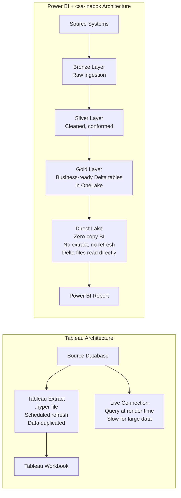
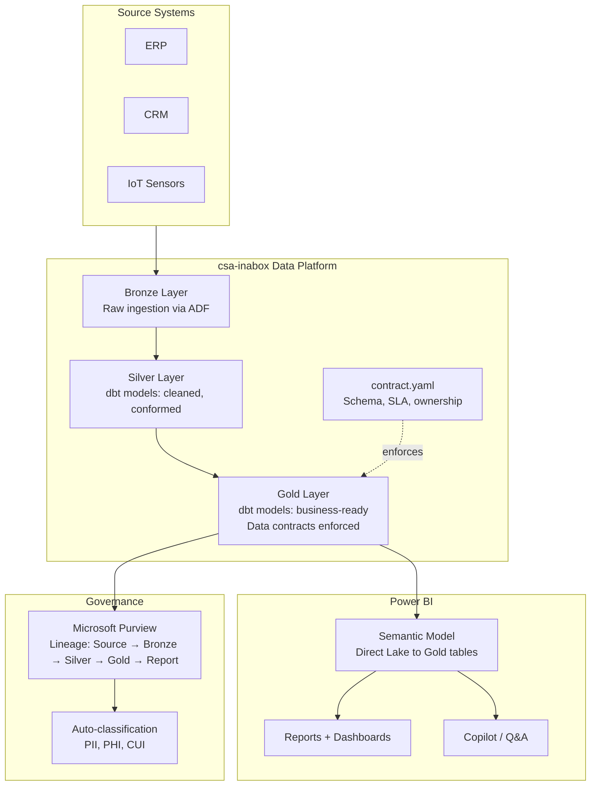

# Migrating from Tableau to Power BI with CSA-in-a-Box

**Status:** Authored 2026-04-29 | Expanded 2026-04-30
**Audience:** BI leads, analytics engineers, data architects, and CDOs running Tableau Server or Tableau Cloud who are evaluating or committed to a Power BI migration.
**Scope:** End-to-end migration of the Tableau estate — workbooks, data sources, calculations, server infrastructure, permissions, schedules, and user skills — to Power BI Service and Microsoft Fabric, with csa-inabox as the data platform layer.

!!! tip "Expanded Migration Center Available"
    This playbook is the core migration reference. For the complete Tableau-to-Power BI migration package — including white papers, deep-dive guides, tutorials, and benchmarks — visit the **[Tableau to Power BI Migration Center](tableau-to-powerbi/index.md)**.

    **Quick links:**

    - [Why Power BI over Tableau (Executive Brief)](tableau-to-powerbi/why-powerbi-over-tableau.md)
    - [Total Cost of Ownership Analysis](tableau-to-powerbi/tco-analysis.md)
    - [Complete Feature Mapping (105+ features)](tableau-to-powerbi/feature-mapping-complete.md)
    - [Tutorials & Walkthroughs](tableau-to-powerbi/index.md#tutorials)
    - [Benchmarks & Performance](tableau-to-powerbi/benchmarks.md)
    - [Best Practices](tableau-to-powerbi/best-practices.md)

---

## 1. Why organizations migrate

There are four forcing functions behind Tableau-to-Power BI migrations. Organizations usually have more than one.

**Licensing cost.** Tableau Creator seats run $75/user/month. At scale (200+ users with a mix of creators, explorers, and viewers), the licensing cost difference between Tableau and Power BI Pro ($10/user/month) or Power BI included in Microsoft 365 E5 is material — often $500K-$1M+ per year for large deployments. Section 4 has the full cost analysis.

**Microsoft 365 integration.** Power BI is embedded in the Microsoft ecosystem: Teams, SharePoint, Excel, Outlook, Copilot. For organizations already on Microsoft 365, Power BI is the BI tool that does not require a second login, a second governance model, or a second browser tab. Reports embed in Teams channels. Excel connects natively to semantic models. Copilot writes DAX. This integration surface does not exist for Tableau.

**Fabric convergence.** Microsoft Fabric unifies data engineering, data science, real-time analytics, and BI on a single platform with a single capacity model. Power BI is the native BI layer in Fabric. Direct Lake mode connects Power BI to Delta tables in OneLake with zero data movement — no import, no extract, no scheduled refresh. For organizations building on csa-inabox (which lands data in Delta on ADLS Gen2 / OneLake), this eliminates the entire extract pipeline that Tableau requires.

**Embedded analytics.** Power BI Embedded provides row-level-secure, white-labeled analytics at a capacity-based price point. Tableau Embedded Analytics works but is priced per-user and carries Tableau's full licensing model into the embedded scenario. For ISVs and federal portals serving thousands of external users, Power BI Embedded is typically 3-5x cheaper.

!!! info "Honest assessment of trade-offs"
This guide is a migration playbook, not a takedown. Tableau has real strengths: its visual grammar (mark-based rendering) is more flexible for certain chart types, the drag-and-drop experience is more intuitive for ad-hoc exploration by non-technical users, LOD expressions are more concise than DAX for certain analytical patterns, and Tableau Prep's visual data preparation UX is friendlier than Power Query for some personas. Every trade-off is documented below so you can make informed decisions.

---

## 2. Feature comparison

| Capability                  | Tableau                                          | Power BI                                                              | Edge                       |
| --------------------------- | ------------------------------------------------ | --------------------------------------------------------------------- | -------------------------- |
| **Data connectivity**       | 100+ native connectors                           | 150+ native connectors + Dataverse, Fabric                            | Power BI                   |
| **Data modeling**           | Logical + physical layer (relationships)         | Vertipaq engine, star schema, composite models, Direct Lake           | Power BI (deeper modeling) |
| **Calculation language**    | Calculated fields, LOD expressions, table calcs  | DAX measures, calculated columns, Power Query M                       | Tableau (LOD conciseness)  |
| **Visualization types**     | Marks-based grammar, any field to any shelf      | Field-based visuals, 200+ AppSource custom visuals                    | Tableau (flexibility)      |
| **Dashboard interactivity** | Actions (filter, highlight, URL, set, parameter) | Drillthrough, bookmarks, buttons, field parameters, slicer sync       | Comparable                 |
| **Mapping / geospatial**    | Built-in maps, Mapbox integration                | Built-in maps, ArcGIS, Azure Maps, Mapbox                             | Comparable                 |
| **Natural language**        | Ask Data, Tableau Pulse                          | Q&A, Copilot in Power BI                                              | Power BI (Copilot)         |
| **Mobile**                  | Tableau Mobile app                               | Power BI Mobile app                                                   | Comparable                 |
| **Embedded analytics**      | Embedded Analytics (per-user pricing)            | Power BI Embedded (capacity pricing)                                  | Power BI (cost at scale)   |
| **Data preparation**        | Tableau Prep Builder (visual, per-Creator)       | Power Query (included), Dataflows, Fabric notebooks                   | Power BI (included)        |
| **Governance**              | Tableau Data Management ($5.50/user add-on)      | Purview integration, deployment pipelines, endorsement (included)     | Power BI (included)        |
| **Server / Cloud**          | Tableau Server (on-prem) or Tableau Cloud        | Power BI Service (cloud) + Report Server (on-prem)                    | Comparable                 |
| **Developer API**           | REST API, Metadata API, Hyper API                | REST API, XMLA endpoints, Tabular Object Model (TOM)                  | Power BI (XMLA depth)      |
| **Collaboration**           | Tableau Server comments, subscriptions           | Teams integration, SharePoint embedding, email subscriptions          | Power BI                   |
| **Version control**         | Manual (.twbx export)                            | Fabric Git integration (TMDL, .pbip format)                           | Power BI                   |
| **AI features**             | Pulse (metrics), Einstein Discovery (Salesforce) | Copilot, Q&A, Smart Narratives, Anomaly Detection, Decomposition Tree | Power BI                   |
| **Real-time dashboards**    | Limited (extract refresh, some streaming)        | Fabric Real-Time Intelligence dashboards, push datasets               | Power BI                   |
| **Excel integration**       | Export to Excel                                  | Analyze in Excel (live connection), Excel as a client                 | Power BI                   |

---

## 3. Licensing cost analysis

### 3.1 Per-user pricing (as of early 2026)

| Role                 | Tableau license            | Monthly cost | Power BI license                 | Monthly cost |
| -------------------- | -------------------------- | ------------ | -------------------------------- | ------------ |
| Content creator      | Creator                    | $75          | Pro (or Fabric capacity)         | $10          |
| Interactive consumer | Explorer                   | $42          | Pro                              | $10          |
| View-only consumer   | Viewer                     | $15          | Free (with PPU/Premium capacity) | $0           |
| Data preparation     | Prep (included in Creator) | $0 add-on    | Power Query (included in all)    | $0           |
| Data governance      | Data Management add-on     | $5.50/user   | Included in Pro + Purview        | $0           |

### 3.2 Total cost comparison by organization size

| Org profile                                            | Tableau annual cost | Power BI annual cost                                | Annual savings |
| ------------------------------------------------------ | ------------------- | --------------------------------------------------- | -------------- |
| **50 users** (10 Creator, 15 Explorer, 25 Viewer)      | $62,100             | $6,000 (all Pro)                                    | ~$56,000       |
| **200 users** (30 Creator, 70 Explorer, 100 Viewer)    | $244,200            | $24,000 (all Pro)                                   | ~$220,000      |
| **1,000 users** (80 Creator, 220 Explorer, 700 Viewer) | $1,025,400          | $36,000 (Pro for creators) + $60,000 (PPU capacity) | ~$930,000      |

!!! note "TCO beyond licensing"
The table above covers licensing only. Tableau Server on-premises adds infrastructure costs (VM hosting, storage, backup, patching) that Power BI Service eliminates entirely. Conversely, Power BI Premium or Fabric capacity costs ($5,000-$16,000+/month depending on SKU) replace per-user Premium pricing at scale. Run the Azure TCO calculator with your specific workload to get an accurate number.

!!! tip "Microsoft 365 E5 includes Power BI Pro"
If your organization is on Microsoft 365 E5, every user already has a Power BI Pro license. The incremental cost of Power BI is zero. This single fact has driven more Tableau-to-Power BI migrations than any feature comparison.

---

## 4. Migration phases

```mermaid
timeline
    title Tableau to Power BI Migration Timeline
    section Phase 1 — Inventory (Weeks 1-2)
        Workbook catalog   : Export all workbooks, data sources, users
        Usage analysis     : Identify high-value vs stale content
        Permission mapping : Document site/project/workbook permissions
        Schedule inventory : Extract refresh schedules and subscriptions
    section Phase 2 — Data Sources (Weeks 3-5)
        Extract analysis   : Categorize Tableau extracts by source system
        Connection migration: Live connections → DirectQuery or Direct Lake
        Shared datasets    : Published data sources → shared semantic models
        Gold layer setup   : csa-inabox Gold tables as unified source
    section Phase 3 — Report Conversion (Weeks 4-8)
        Priority reports   : Convert top-20 workbooks first
        Calculation port   : LOD → DAX, table calcs → DAX measures
        Visual rebuild     : Dashboard layout redesign for Power BI
        Validation         : Side-by-side number comparison
    section Phase 4 — Server Migration (Weeks 6-10)
        Workspace setup    : Create workspace hierarchy matching Tableau sites/projects
        Permission config  : Workspace roles + row-level security
        Refresh schedules  : Configure dataset refresh
        Subscriptions      : Recreate email subscriptions
    section Phase 5 — Adoption (Weeks 8-14)
        Training rollout   : Creator and consumer training sessions
        Champions program  : Identify and train 1 champion per 20 users
        Feedback loop      : Weekly office hours for first 4 weeks
        Decommission       : Redirect Tableau Server URLs, archive .twbx files
```



---

## 5. Calculation conversion guide

This is the section that will save your migration team the most time. LOD expressions and table calculations are where Tableau and Power BI diverge the most.

### 5.1 LOD expressions to DAX

| Tableau LOD                               | What it does                                 | DAX equivalent                                                          |
| ----------------------------------------- | -------------------------------------------- | ----------------------------------------------------------------------- |
| `{ FIXED [Region] : SUM([Sales]) }`       | Aggregate at a fixed grain regardless of viz | `CALCULATE(SUM(Sales[Amount]), ALLEXCEPT(Sales, Sales[Region]))`        |
| `{ FIXED [Customer] : MIN([OrderDate]) }` | First purchase date per customer             | `CALCULATE(MIN(Sales[OrderDate]), ALLEXCEPT(Sales, Sales[CustomerID]))` |
| `{ INCLUDE [Product] : AVG([Price]) }`    | Include a dimension not in the viz           | `AVERAGEX(VALUES(Products[Product]), [Avg Price])`                      |
| `{ EXCLUDE [Month] : SUM([Sales]) }`      | Remove a dimension from the grain            | `CALCULATE(SUM(Sales[Amount]), ALL(Calendar[Month]))`                   |
| `{ FIXED : SUM([Sales]) }`                | Grand total (table-level)                    | `CALCULATE(SUM(Sales[Amount]), ALL(Sales))`                             |

**Worked example — Customer lifetime value ranking:**

```
// Tableau: LOD expression
{ FIXED [Customer ID] : SUM([Sales]) }
// Then use this as a dimension to rank customers
```

```dax
// Power BI: DAX measure
Customer Lifetime Value =
CALCULATE(
    SUM(Sales[Amount]),
    ALLEXCEPT(Sales, Sales[CustomerID])
)

// Ranking measure
Customer Rank =
RANKX(
    ALL(Sales[CustomerID]),
    [Customer Lifetime Value],
    ,
    DESC
)
```

### 5.2 Table calculations to DAX

| Tableau table calc                                  | DAX equivalent                                                                                | Notes                                 |
| --------------------------------------------------- | --------------------------------------------------------------------------------------------- | ------------------------------------- |
| `RUNNING_SUM(SUM([Sales]))`                         | `CALCULATE(SUM(Sales[Amount]), FILTER(ALL(Calendar), Calendar[Date] <= MAX(Calendar[Date])))` | Or use `WINDOW` function (DAX 2023+)  |
| `LOOKUP(SUM([Sales]), -1)` (previous value)         | `CALCULATE(SUM(Sales[Amount]), PREVIOUSMONTH(Calendar[Date]))`                                | Use time intelligence functions       |
| `WINDOW_SUM(SUM([Sales]), -2, 0)` (3-period moving) | `AVERAGEX(DATESINPERIOD(Calendar[Date], MAX(Calendar[Date]), -3, MONTH), [Total Sales])`      | Rolling window                        |
| `RANK(SUM([Sales]))`                                | `RANKX(ALL(Products[Category]), [Total Sales])`                                               | Specify the table to rank over        |
| `PERCENT_DIFFERENCE(SUM([Sales]))`                  | `DIVIDE([Total Sales] - [Previous Period Sales], [Previous Period Sales])`                    | Compose from base measures            |
| `INDEX()` (row number)                              | `RANKX(ALL(Table), Table[SortColumn])`                                                        | Or use `INDEX()` function (DAX 2023+) |

### 5.3 Sets to DAX

```
// Tableau: Top 10 Customers set
// Create a set → Top N → Top 10 by SUM(Sales)
// Then use IN/OUT of set as a filter

// Power BI: DAX equivalent using TOPN
Top 10 Customer Flag =
IF(
    RANKX(
        ALL(Customers[CustomerName]),
        [Total Sales],
        ,
        DESC
    ) <= 10,
    "Top 10",
    "Other"
)
```

### 5.4 Parameters to Power BI

| Tableau parameter                                       | Power BI equivalent                           | Notes                                              |
| ------------------------------------------------------- | --------------------------------------------- | -------------------------------------------------- |
| **String/numeric parameter** (used in calc fields)      | Power BI What-If parameter or field parameter | What-If creates a disconnected table with a slicer |
| **Date parameter** (date range filter)                  | Slicer with relative date filtering           | Native relative date slicers cover most cases      |
| **Parameter action** (dashboard interaction sets param) | Field parameter + slicer interaction          | More limited than Tableau parameter actions        |
| **Top N parameter**                                     | What-If parameter + `TOPN()` in DAX           | Combine What-If slicer with TOPN measure           |

```dax
// What-If parameter for dynamic Top N
// 1. Create What-If parameter "Top N Value" (range 5-50, increment 5)
// 2. Create measure:
Dynamic Top N Filter =
IF(
    RANKX(
        ALL(Products[ProductName]),
        [Total Sales],
        ,
        DESC
    ) <= 'Top N Value'[Top N Value Value],
    1,
    0
)
// 3. Add as visual-level filter: Dynamic Top N Filter = 1
```

---

## 6. Visualization mapping

### 6.1 Chart type mapping

| Tableau chart type               | Power BI equivalent                             | Notes                                                         |
| -------------------------------- | ----------------------------------------------- | ------------------------------------------------------------- |
| Bar / Column chart               | Bar / Column chart                              | Direct mapping                                                |
| Line chart                       | Line chart                                      | Direct mapping                                                |
| Area chart                       | Area chart                                      | Direct mapping                                                |
| Scatter plot                     | Scatter chart                                   | Direct mapping; Power BI adds Play axis for animation         |
| Pie / Donut                      | Pie / Donut                                     | Direct mapping (but consider alternatives for both)           |
| Treemap                          | Treemap                                         | Direct mapping                                                |
| Heat map (text table with color) | Matrix with conditional formatting              | Use background color rules on matrix cells                    |
| Packed bubble                    | Not native                                      | Use custom visual from AppSource or switch to treemap         |
| Box-and-whisker                  | Not native (custom visual available)            | Import "Box and Whisker" from AppSource                       |
| Gantt chart                      | Not native (custom visual available)            | Import Gantt visual from AppSource                            |
| Waterfall                        | Waterfall chart                                 | Native in Power BI                                            |
| Funnel                           | Funnel chart                                    | Native in Power BI                                            |
| Bullet chart                     | Bullet chart (custom visual)                    | Available on AppSource                                        |
| Dual-axis chart                  | Combo chart (line + column)                     | Power BI combo chart supports two Y axes                      |
| Reference lines / bands          | Analytics pane (constant, average, trend lines) | Add via the Analytics pane in the visual                      |
| Filled map (choropleth)          | Filled map / Shape map / Azure Maps             | Shape map for custom geo boundaries; Azure Maps for satellite |
| Symbol map                       | Map visual / ArcGIS Maps                        | ArcGIS for advanced geospatial                                |
| Dashboard containers / layout    | Report page layout + bookmarks                  | Use bookmarks for toggling visibility (replaces containers)   |
| Story (multi-page narrative)     | Report with page navigator or paginated report  | Page navigator bar provides the story-page UX                 |
| Tooltip viz (hover detail)       | Report page tooltip                             | Create a page-type tooltip with a detail visual               |
| Small multiples (trellis)        | Small multiples (native since 2021)             | Native Power BI feature; apply to most chart types            |

### 6.2 Dashboard actions to Power BI interactions

| Tableau action                                   | Power BI equivalent                    | How to implement                                                   |
| ------------------------------------------------ | -------------------------------------- | ------------------------------------------------------------------ |
| **Filter action** (click to filter other sheets) | Cross-filtering (default behavior)     | Built-in; configure via Edit Interactions                          |
| **Highlight action**                             | Cross-highlighting (default behavior)  | Built-in; toggle between filter and highlight in Edit Interactions |
| **URL action**                                   | Button with URL or web URL visual      | Add a button with a dynamic URL using DAX                          |
| **Go to Sheet action**                           | Drillthrough or page navigation button | Drillthrough for detail pages; buttons for navigation              |
| **Set action**                                   | Slicer + bookmark or field parameter   | More limited; combine slicer interaction with bookmarks            |
| **Parameter action**                             | Field parameter with slicer            | Available since 2023; covers numeric/text scenarios                |

---

## 7. Data source migration

### 7.1 Connection type mapping

| Tableau connection                                   | Power BI equivalent                         | Recommendation with csa-inabox                                                     |
| ---------------------------------------------------- | ------------------------------------------- | ---------------------------------------------------------------------------------- |
| **Tableau Extract** (.hyper file, scheduled refresh) | Import mode (scheduled refresh)             | Migrate to **Direct Lake** on csa-inabox Gold tables — eliminates extract entirely |
| **Live connection** (real-time query to database)    | DirectQuery                                 | Use DirectQuery for low-latency operational sources                                |
| **Published data source** (shared, governed)         | Shared semantic model (shared dataset)      | One semantic model per data domain; endorse as "Certified"                         |
| **Tableau Prep flow**                                | Power Query in Dataflow Gen2                | Or replace with dbt models in the csa-inabox transformation layer                  |
| **Custom SQL**                                       | Power Query native query or DirectQuery SQL | Prefer modeled tables over custom SQL for performance                              |
| **Federated / cross-database join**                  | Composite model (DirectQuery + Import)      | Composite models allow mixing sources in one semantic model                        |

### 7.2 Eliminating extract sprawl with Direct Lake

This is the single biggest architectural improvement you gain from migrating to Power BI on csa-inabox.



!!! tip "Direct Lake is the migration's killer feature"
With Tableau, you choose between extract mode (fast but stale, duplicates data, consumes server storage) and live connection (fresh but slow for large datasets). Direct Lake on Fabric eliminates this trade-off: Power BI reads Delta Parquet files directly from OneLake with Vertipaq-like performance and zero data duplication. No scheduled refresh. No extract failures. No stale dashboards at 9 AM because the 6 AM extract timed out.

### 7.3 Published data sources to shared semantic models

| Tableau concept         | Power BI concept                                  | Migration action                                            |
| ----------------------- | ------------------------------------------------- | ----------------------------------------------------------- |
| Published data source   | Shared semantic model (formerly "shared dataset") | Create one semantic model per domain (sales, finance, etc.) |
| Certified data source   | Endorsed semantic model (Certified or Promoted)   | Apply endorsement labels for discoverability                |
| Data source permissions | Semantic model permissions + RLS                  | Configure workspace roles + row-level security              |
| Data source revisions   | Fabric Git integration (TMDL)                     | Version-control the semantic model definition               |

### 7.4 Tableau Prep to Power Query / dbt

| Tableau Prep concept           | Power Query / dbt equivalent           | Notes                                                            |
| ------------------------------ | -------------------------------------- | ---------------------------------------------------------------- |
| Input step                     | Power Query `Source` or dbt `source()` | Connect to the same source system                                |
| Clean step                     | Power Query transformations or dbt SQL | Power Query for light transforms; dbt for heavy logic            |
| Pivot / Unpivot                | `Table.Unpivot` / `Table.Pivot` in M   | Or `UNPIVOT` in dbt SQL                                          |
| Join step                      | `Table.NestedJoin` in M or dbt `JOIN`  | dbt is preferred for complex multi-table joins                   |
| Aggregate step                 | `Table.Group` in M or dbt `GROUP BY`   | dbt handles this in the Silver/Gold layer                        |
| Output (published data source) | Dataflow Gen2 output or dbt model      | dbt model lands as a Delta table; Power BI reads via Direct Lake |

!!! note "Prefer dbt over Power Query for transformation"
With csa-inabox, the transformation logic should live in dbt models (Silver and Gold layers), not in Power Query. Power Query should handle only light shaping (column renames, type casts) between the Gold layer and the semantic model. This keeps transformation logic version-controlled, testable, and shared across all consumers — not locked inside a Power BI dataset.

---

## 8. Server migration

### 8.1 Tableau Server to Power BI Service mapping

| Tableau Server concept                      | Power BI Service equivalent                         | Notes                                                  |
| ------------------------------------------- | --------------------------------------------------- | ------------------------------------------------------ |
| **Site**                                    | Fabric capacity + tenant                            | One Tableau site per Power BI capacity or tenant       |
| **Project** (folder hierarchy)              | Workspace                                           | One workspace per project; nest with workspace folders |
| **Workbook**                                | Power BI report (.pbix / .pbip)                     | Report + semantic model (can be separated)             |
| **Dashboard** (pinned sheets)               | Power BI dashboard (pinned tiles)                   | Pin visuals from multiple reports                      |
| **Data source** (published)                 | Shared semantic model                               | Separate from the report for reuse                     |
| **User**                                    | Entra ID user                                       | Synced from Active Directory or Entra ID               |
| **Group**                                   | Entra ID security group                             | Use groups for workspace role assignments              |
| **Site role** (Creator, Explorer, Viewer)   | Workspace role (Admin, Member, Contributor, Viewer) | See permission mapping below                           |
| **Content permissions**                     | Workspace permissions + app permissions             | Workspace for authoring; apps for consumption          |
| **Subscription** (scheduled email with PDF) | Power BI subscription (email with PNG/PDF)          | Similar capability; configure per-report or per-page   |
| **Schedule** (extract refresh)              | Dataset refresh schedule                            | Configure in dataset settings; up to 48/day on Premium |
| **Alert** (data-driven threshold)           | Power BI data alerts on dashboard tiles             | Set threshold alerts on KPI tiles                      |
| **Custom view** (user-saved filter state)   | Personal bookmarks                                  | Each user can save their own filter state              |
| **Favorites**                               | Favorites                                           | Direct mapping                                         |
| **Collections**                             | Apps                                                | Package reports into apps for organized distribution   |

### 8.2 Permission mapping

| Tableau site role            | Power BI workspace role         | Access level                                              |
| ---------------------------- | ------------------------------- | --------------------------------------------------------- |
| Site Administrator / Creator | Workspace Admin                 | Full control including membership management              |
| Creator                      | Workspace Member or Contributor | Member can publish + manage; Contributor can publish only |
| Explorer (Can Publish)       | Workspace Contributor           | Can publish content to the workspace                      |
| Explorer                     | App Viewer                      | Consume through published Power BI Apps                   |
| Viewer                       | App Viewer (or report link)     | View-only through apps or shared links                    |

### 8.3 Row-level security migration

```
// Tableau: User filter on data source
// Filter: [Region] = USERNAME()

// Power BI: Row-level security (RLS) role
// 1. Create RLS role in semantic model (Power BI Desktop)
```

```dax
// In Power BI Desktop → Modeling → Manage Roles
// Role: "RegionFilter"
// Table: Sales
// DAX filter expression:
[Region] = USERPRINCIPALNAME()

// Or for group-based security with a mapping table:
CONTAINS(
    SecurityMapping,
    SecurityMapping[UserEmail], USERPRINCIPALNAME(),
    SecurityMapping[Region], Sales[Region]
)
```

### 8.4 Tableau REST API to Power BI REST API

| Tableau REST API operation    | Power BI REST API equivalent | Endpoint                               |
| ----------------------------- | ---------------------------- | -------------------------------------- |
| List workbooks                | List reports in workspace    | `GET /groups/{groupId}/reports`        |
| Download workbook (.twbx)     | Export report (.pbix)        | `POST /reports/{reportId}/Export`      |
| Publish workbook              | Import report                | `POST /groups/{groupId}/imports`       |
| List data sources             | List datasets                | `GET /groups/{groupId}/datasets`       |
| Refresh extract               | Trigger dataset refresh      | `POST /datasets/{datasetId}/refreshes` |
| List users                    | Use Microsoft Graph API      | `GET /users` (Graph)                   |
| Add user to site              | Add user to workspace        | `POST /groups/{groupId}/users`         |
| Query metadata (Metadata API) | Scan API + XMLA endpoints    | `POST /admin/workspaces/getInfo`       |

---

## 9. CSA-in-a-Box advantage

When you migrate from Tableau to Power BI on top of csa-inabox, you gain architectural benefits that go beyond the BI tool swap.

### 9.1 Gold-layer data products as single source of truth



### 9.2 Why this matters for the Tableau migration

| Problem with Tableau                                                                                    | How csa-inabox + Power BI solves it                                                                                 |
| ------------------------------------------------------------------------------------------------------- | ------------------------------------------------------------------------------------------------------------------- |
| **Extract sprawl** — every workbook has its own extract, duplicating data across Tableau Server storage | **Direct Lake** reads Gold tables directly. No extracts. No data duplication. No stale data.                        |
| **No end-to-end lineage** — lineage stops at the Tableau data source boundary                           | **Purview lineage** traces from source system → Bronze → Silver → Gold → semantic model → report                    |
| **Data quality is BI-layer concern** — calculated fields paper over bad source data                     | **Data contracts** (`contract.yaml`) enforce schema, freshness, and quality at the Gold layer before BI consumption |
| **Per-user governance add-on** — Tableau Data Management is $5.50/user/month extra                      | **Purview + Unity Catalog** are included in the Azure platform at no per-user BI cost                               |
| **No data mesh support** — centralized data source model                                                | **Data products** pattern in csa-inabox supports domain-owned Gold tables with self-service BI                      |

---

## 10. Training and adoption

### 10.1 Skill mapping — Tableau user to Power BI user

| Tableau skill                                 | Power BI equivalent                                | Learning curve                                   |
| --------------------------------------------- | -------------------------------------------------- | ------------------------------------------------ |
| Drag fields to shelves (Rows, Columns, Marks) | Drag fields to visual wells (Axis, Values, Legend) | Low — similar UX paradigm                        |
| Calculated fields                             | DAX measures + calculated columns                  | **High** — DAX is a different language           |
| LOD expressions                               | `CALCULATE` + `ALL` / `ALLEXCEPT` patterns         | **High** — requires understanding filter context |
| Table calculations                            | DAX window functions + time intelligence           | Medium — pattern-based learning                  |
| Data blending                                 | Composite models / relationships                   | Medium                                           |
| Tableau Prep                                  | Power Query (M language)                           | Medium — different UX but similar concepts       |
| Dashboard actions                             | Edit interactions + drillthrough + bookmarks       | Medium                                           |
| Tableau Server publishing                     | Power BI Service workspace publishing              | Low — conceptually identical                     |
| Tableau parameters                            | What-If parameters + field parameters              | Low-Medium                                       |
| Formatting / design                           | Power BI formatting pane + themes                  | Low                                              |

### 10.2 Two-week training curriculum

| Day    | Topic                                                           | Audience | Duration |
| ------ | --------------------------------------------------------------- | -------- | -------- |
| Day 1  | Power BI Desktop overview, connecting to csa-inabox Gold tables | All      | 2 hours  |
| Day 2  | Building visuals: charts, tables, maps, formatting              | All      | 2 hours  |
| Day 3  | Filters, slicers, cross-filtering, drillthrough                 | All      | 2 hours  |
| Day 4  | DAX fundamentals: measures, CALCULATE, filter context           | Creators | 3 hours  |
| Day 5  | DAX intermediate: time intelligence, RANKX, iterators           | Creators | 3 hours  |
| Day 6  | DAX for Tableau users: LOD → CALCULATE patterns workshop        | Creators | 3 hours  |
| Day 7  | Data modeling: star schema, relationships, composite models     | Creators | 2 hours  |
| Day 8  | Power Query basics, connecting to data sources                  | Creators | 2 hours  |
| Day 9  | Publishing to Power BI Service, workspaces, sharing             | All      | 2 hours  |
| Day 10 | Row-level security, deployment pipelines, governance            | Admins   | 2 hours  |

!!! tip "Hands-on lab structure"
Each session should include a lab where users rebuild one of their own Tableau workbooks in Power BI. Start with a simple workbook (< 5 sheets, no LOD expressions) on Day 1 and progress to complex workbooks by Day 8. Nothing accelerates adoption like seeing their own data in the new tool.

### 10.3 Champions program

| Element                | Details                                                                  |
| ---------------------- | ------------------------------------------------------------------------ |
| **Champion ratio**     | 1 champion per 20 users                                                  |
| **Selection criteria** | Enthusiastic Tableau power user willing to learn Power BI first          |
| **Training**           | Champions get training 2 weeks before general rollout                    |
| **Responsibilities**   | First-line support, lead team office hours, report conversion assistance |
| **Recognition**        | Monthly champion spotlight, early access to new features                 |
| **Escalation path**    | Champion → BI team → Microsoft support                                   |

### 10.4 Common Tableau-user complaints and responses

| Complaint                                   | Response                                                                                                                                                                                                         |
| ------------------------------------------- | ---------------------------------------------------------------------------------------------------------------------------------------------------------------------------------------------------------------- |
| "DAX is harder than calculated fields"      | It is different, not inherently harder. DAX is more explicit about filter context, which is confusing at first but gives you more control. The LOD-to-CALCULATE mapping table (Section 5) is your Rosetta Stone. |
| "I can't do X chart type"                   | Check AppSource first — there are 200+ custom visuals. If the exact chart is not available, discuss the analytical goal and find the Power BI pattern that achieves it.                                          |
| "Tableau is more intuitive for exploration" | Power BI's strength is governed, shared semantic models rather than ad-hoc exploration. Use Copilot or Q&A for natural language exploration.                                                                     |
| "I miss dual-axis charts"                   | Use combo charts (line + column) with a secondary Y axis. The UX is slightly different but the capability is the same.                                                                                           |
| "Publishing is more complex"                | The workspace model is actually simpler: publish to workspace, share via app. No site/project/permission hierarchy to navigate.                                                                                  |
| "Where are my extracts?"                    | Direct Lake eliminates extracts. Your data is always fresh, always fast. This is a feature, not a loss.                                                                                                          |

### 10.5 Features Power BI has that Tableau does not

These features are ammunition for the adoption conversation. Lead with what users gain, not what they lose.

| Feature                    | What it does                                                     | Why it matters                                                     |
| -------------------------- | ---------------------------------------------------------------- | ------------------------------------------------------------------ |
| **Copilot**                | Natural language → DAX, visual suggestions, narrative generation | Non-technical users can ask questions of data without learning DAX |
| **Q&A visual**             | Type a question, get a chart                                     | Embedded in any report; no Ask Data add-on required                |
| **Excel integration**      | Analyze in Excel, PivotTable on semantic model                   | Finance users stay in Excel while querying governed data           |
| **Teams embedding**        | Pin reports in Teams channels and chats                          | Reports go where the collaboration happens                         |
| **Deployment pipelines**   | Dev → Test → Prod promotion for BI content                       | ALM for BI without manual .twbx exports                            |
| **Paginated reports**      | Pixel-perfect, print-ready reports (invoices, statements)        | Replaces SSRS; no Tableau equivalent                               |
| **Datamart**               | Self-service relational database with SQL endpoint               | Analysts who want SQL get a managed database                       |
| **Fabric Git integration** | Version control for semantic models (TMDL format)                | True CI/CD for BI content                                          |
| **Smart Narratives**       | AI-generated text summaries of visuals                           | Automated commentary on chart trends                               |
| **Decomposition Tree**     | Interactive root cause analysis visual                           | Drill into contributing factors with AI splits                     |
| **Key Influencers**        | AI visual showing what drives a metric                           | Automated feature importance for business users                    |
| **Direct Lake**            | Zero-copy BI on Delta tables                                     | No extract, no refresh, no stale data                              |

---

## 11. Gotchas and anti-patterns

!!! danger "Don't convert workbooks 1:1"
The most common migration anti-pattern is opening a Tableau workbook and trying to recreate it pixel-for-pixel in Power BI. Tableau and Power BI have different visual paradigms — Tableau is mark-based (every data point is a mark with properties), Power BI is field-based (visuals are defined by field assignments to wells). Redesign for Power BI's strengths: semantic models, Copilot, Teams embedding, Direct Lake. Aim for feature parity in the analytical outcome, not the visual layout.

!!! danger "Don't skip the data model"
Tableau is forgiving about data modeling — you can throw a wide, denormalized table at it and it will produce decent visuals. Power BI is not. Power BI's Vertipaq engine performs best with proper star schemas: fact tables (numeric measures) surrounded by dimension tables (attributes). Invest time in building a clean semantic model. Every hour spent on the data model saves ten hours of DAX gymnastics.

!!! warning "LOD expressions don't map directly to DAX"
Do not try to translate LOD expressions line-by-line into DAX. LOD expressions operate on the visual's level of detail. DAX operates on filter context. The Section 5 mapping table gives you patterns, but the mental model is different. Train your creators on DAX filter context before they touch LOD migration.

!!! warning "Tableau's mark-based model vs Power BI's field-based model"
In Tableau, you can place any field on any shelf — Size, Color, Shape, Detail, Tooltip — and the marks respond. In Power BI, visuals have defined wells (Axis, Values, Legend, Tooltips) and each visual type constrains what goes where. This is not a limitation; it is a different paradigm. Some Tableau visualizations (especially those with marks on the Detail shelf for disaggregation) need to be rethought, not replicated.

!!! warning "Over-importing data"
Tableau extracts encourage importing data into the BI tool. On Power BI, the instinct carries over: teams import 500 GB tables into Import mode semantic models. Do not do this. Use DirectQuery or Direct Lake for large datasets. Import mode is appropriate for datasets under 1 GB or dimensions that change infrequently.

!!! info "Tableau calculated fields in data sources vs Power BI"
Tableau allows calculated fields in published data sources that downstream workbooks inherit. In Power BI, the equivalent is defining measures in the shared semantic model. If you put calculations in the report instead of the semantic model, every report that needs that calculation must redefine it. Build measures in the semantic model.

!!! tip "Start with the semantic model, not the report"
The correct migration order is: (1) build the semantic model on csa-inabox Gold tables, (2) define all measures in the semantic model, (3) build reports that consume the semantic model. This is the opposite of how many Tableau migrations proceed (convert the visual first, figure out the data later).

---

## 12. Migration tools

### 12.1 Microsoft Power BI Migration tool

Microsoft provides migration guidance and assessment tooling. The assessment evaluates your Tableau Server estate and generates a migration plan.

| Tool                                             | Purpose                                                  | Notes                                                    |
| ------------------------------------------------ | -------------------------------------------------------- | -------------------------------------------------------- |
| **Power BI Migration Planning** (Microsoft docs) | Assessment questionnaire and planning template           | Free; start here                                         |
| **Fabric Workload Assessment**                   | Automated scan of Tableau Server metadata                | Generates workbook-by-workbook migration recommendations |
| **ALM Toolkit**                                  | Compare and merge Power BI semantic models               | Useful for promoting models across environments          |
| **Tabular Editor**                               | Edit semantic models externally (TMDL/BISM)              | Advanced; for scripting bulk DAX changes                 |
| **DAX Studio**                                   | Query and debug DAX expressions                          | Essential for validating calculation migration           |
| **Power BI Helper**                              | Document semantic models (auto-generate data dictionary) | Useful for governance documentation                      |

### 12.2 Third-party tools

| Tool                                 | What it does                                        | When to use                                                            |
| ------------------------------------ | --------------------------------------------------- | ---------------------------------------------------------------------- |
| **Converts HQ** (third-party)        | Automated Tableau-to-Power BI conversion            | Large estates (100+ workbooks) where manual conversion is not feasible |
| **Trustworthy AI (third-party)**     | Tableau workbook analysis and conversion assistance | Assessment and partial automation                                      |
| **PBRS (Power BI Report Scheduler)** | Advanced scheduling and distribution                | If Power BI native subscriptions are insufficient                      |

!!! warning "No tool converts LOD expressions to DAX automatically"
Every automated conversion tool handles simple visuals well (bar charts, tables, basic filters) but struggles or fails with LOD expressions, table calculations, complex parameters, and set actions. Budget manual effort for every workbook that uses these features.

### 12.3 Manual conversion for complex workbooks

For workbooks with LOD expressions, table calculations, or custom dashboard actions, manual conversion is the only reliable path. Use this workflow:

1. **Analyze the Tableau workbook** — open in Tableau Desktop, document every calculated field, LOD expression, and table calculation.
2. **Design the Power BI semantic model** — identify fact and dimension tables, define relationships, plan the star schema.
3. **Write DAX measures** — convert calculations using the mapping tables in Section 5. Test each measure in DAX Studio before adding to the model.
4. **Build visuals** — layout the Power BI report using the visualization mapping in Section 6. Do not replicate the Tableau layout; design for Power BI.
5. **Validate numbers** — run the same queries against both Tableau and Power BI. Compare results at multiple aggregation levels.
6. **Get user sign-off** — have the Tableau workbook owner validate the Power BI report against their known-good numbers.

---

## 13. Migration checklist

- [ ] **Phase 1: Inventory**
    - [ ] Export Tableau Server site inventory (workbooks, data sources, users, groups)
    - [ ] Analyze usage metrics (views per workbook, last accessed date)
    - [ ] Identify top-20 most-used workbooks for priority migration
    - [ ] Identify stale content (not viewed in 90+ days) — archive, do not migrate
    - [ ] Document all published data sources and their connection types
    - [ ] Map Tableau site/project/permissions to Power BI workspace structure
    - [ ] Catalog all extract refresh schedules
    - [ ] Identify workbooks with LOD expressions or complex table calculations
    - [ ] Estimate migration effort per workbook (simple / medium / complex)
- [ ] **Phase 2: Data Sources**
    - [ ] Deploy csa-inabox Gold layer tables for primary data domains
    - [ ] Create Power BI shared semantic models on Gold tables (Direct Lake)
    - [ ] Migrate live connections to DirectQuery (interim) or Direct Lake (target)
    - [ ] Convert Tableau Prep flows to dbt models or Power Query Dataflows
    - [ ] Configure scheduled refresh for any Import-mode datasets
    - [ ] Validate data freshness and row counts against Tableau extracts
- [ ] **Phase 3: Report Conversion**
    - [ ] Convert top-20 workbooks (priority wave)
    - [ ] Port calculated fields and LOD expressions to DAX measures
    - [ ] Rebuild visualizations using Power BI visuals + AppSource custom visuals
    - [ ] Configure cross-filtering, drillthrough, and bookmarks
    - [ ] Side-by-side validation: compare numbers at multiple grain levels
    - [ ] User acceptance testing with workbook owners
    - [ ] Convert remaining workbooks in subsequent waves
- [ ] **Phase 4: Server Migration**
    - [ ] Create Power BI workspaces matching Tableau project hierarchy
    - [ ] Configure workspace roles (Admin, Member, Contributor, Viewer)
    - [ ] Implement row-level security for sensitive datasets
    - [ ] Set up deployment pipelines (Dev → Test → Prod)
    - [ ] Configure dataset refresh schedules
    - [ ] Recreate subscriptions and alerts
    - [ ] Set up Fabric Git integration for version control
    - [ ] Validate that all permissions match Tableau access controls
- [ ] **Phase 5: Adoption**
    - [ ] Train champions (2 weeks before general rollout)
    - [ ] Deliver creator training (DAX, data modeling, Power Query)
    - [ ] Deliver consumer training (navigation, filtering, subscriptions)
    - [ ] Launch weekly office hours (first 4 weeks post-migration)
    - [ ] Redirect Tableau Server URLs to Power BI workspace links
    - [ ] Monitor adoption metrics (active users, report views, Copilot usage)
    - [ ] Collect and address feedback from first 30 days
    - [ ] Archive Tableau .twbx files (retain for 90 days post-cutover)
    - [ ] Decommission Tableau Server licenses

---

## 14. Timeline template

| Phase                                  | Duration        | Key milestones                                                       |
| -------------------------------------- | --------------- | -------------------------------------------------------------------- |
| Phase 1: Inventory                     | 2 weeks         | Inventory complete, workbooks prioritized, effort estimated          |
| Phase 2: Data sources                  | 3 weeks         | Gold tables deployed, semantic models created, Direct Lake validated |
| Phase 3: Report conversion (wave 1)    | 4 weeks         | Top-20 workbooks converted and validated                             |
| Phase 3: Report conversion (waves 2-N) | 4-8 weeks       | Remaining workbooks converted (parallel with Phase 4-5)              |
| Phase 4: Server migration              | 3 weeks         | Workspaces, permissions, schedules, RLS configured                   |
| Phase 5: Adoption                      | 4 weeks         | Training delivered, champions active, office hours running           |
| Decommission                           | 2 weeks         | Tableau Server URLs redirected, licenses cancelled                   |
| **Total**                              | **12-18 weeks** | Varies by estate size and workbook complexity                        |

!!! note "Complexity drivers"
The timeline above assumes 50-200 workbooks. For larger estates (500+), add waves to Phase 3. The biggest schedule risk is not the number of workbooks — it is the number of workbooks with LOD expressions, table calculations, and custom actions. These require manual DAX conversion and cannot be parallelized easily.

---

## 15. Cross-references

| Topic                                                 | Document                                               |
| ----------------------------------------------------- | ------------------------------------------------------ |
| ADR: Databricks over OSS Spark                        | `docs/adr/0002-databricks-over-oss-spark.md`           |
| ADR: Delta Lake over Iceberg and Parquet              | `docs/adr/0003-delta-lake-over-iceberg-and-parquet.md` |
| ADR: Fabric as strategic target                       | `docs/adr/0010-fabric-strategic-target.md`             |
| Cost management                                       | `docs/COST_MANAGEMENT.md`                              |
| Databricks guide                                      | `docs/DATABRICKS_GUIDE.md`                             |
| Purview setup                                         | `docs/governance/PURVIEW_SETUP.md`                     |
| Data governance best practices                        | `docs/best-practices/data-governance.md`               |
| Data lineage                                          | `docs/governance/DATA_LINEAGE.md`                      |
| Fabric vs Databricks vs Synapse                       | `docs/decisions/fabric-vs-databricks-vs-synapse.md`    |
| Snowflake migration (for orgs also leaving Snowflake) | `docs/migrations/snowflake.md`                         |
| Cloudera migration (for orgs also leaving CDH)        | `docs/migrations/cloudera-to-azure.md`                 |
| AWS migration                                         | `docs/migrations/aws-to-azure.md`                      |
| GCP migration                                         | `docs/migrations/gcp-to-azure.md`                      |
