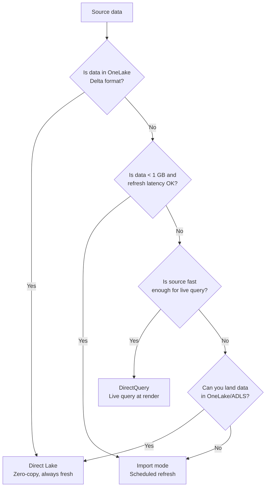
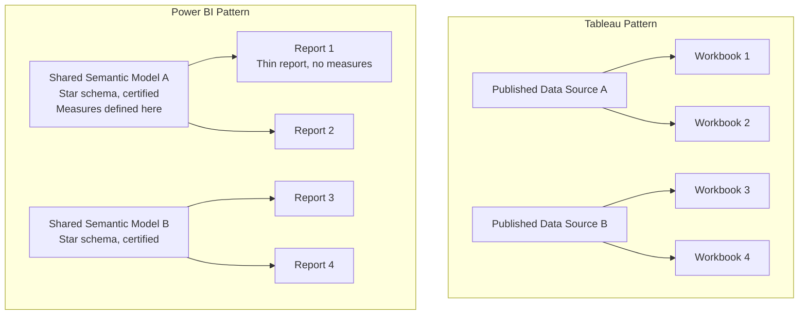

# Data Source Migration: Tableau to Power BI

**A comprehensive guide for migrating Tableau data connections, extracts, published data sources, and data blending to Power BI semantic models, DirectQuery, and Direct Lake.**

---

## Overview

Data source migration is the foundation of a Tableau-to-Power BI migration. Get the data layer right and report conversion is straightforward. Get it wrong and every report will carry technical debt. This guide covers every Tableau data connection pattern and maps it to the optimal Power BI approach, with specific guidance for organizations running csa-inabox.

---

## 1. Connection type mapping

### 1.1 Tableau connection types to Power BI equivalents

| Tableau connection type | Power BI equivalent | When to use | csa-inabox recommendation |
|---|---|---|---|
| **Tableau Extract** (.hyper) | Import mode (scheduled refresh) | Small-to-medium datasets (< 1 GB) that tolerate refresh latency | Migrate to **Direct Lake** on Gold tables instead |
| **Live connection** | DirectQuery | Real-time freshness required; source can handle query load | Use DirectQuery to operational sources; Direct Lake for analytics |
| **Published data source** | Shared semantic model (Certified) | Governed, reusable data layer shared across reports | One semantic model per data domain, endorsed as Certified |
| **Data blending** | Composite model or star schema relationships | Cross-source analysis | Consolidate in the semantic model or use composite model |
| **Custom SQL** | Power Query native query or DirectQuery SQL | Complex queries that cannot be modeled | Prefer dbt views over custom SQL in the semantic model |
| **Federated / cross-database join** | Composite model (DirectQuery + Import) | Mix sources in one model | Composite models support mixing DirectQuery and Import |
| **Tableau Bridge** (cloud to on-prem) | On-premises data gateway | Cloud service connecting to on-premises sources | Install and configure the gateway; map to Tableau Bridge function |
| **File-based** (CSV, Excel, JSON) | Power Query file connectors | Flat file sources | Same files connect through Power Query; schedule refresh |
| **Cloud connectors** (Snowflake, BigQuery, etc.) | Power BI native connectors | Cloud data warehouses | Power BI has 150+ native connectors |

### 1.2 Decision tree for connection type selection



---

## 2. Eliminating extract sprawl with Direct Lake

### 2.1 The extract problem

Tableau extracts (.hyper files) are the most common data connection pattern in Tableau deployments. They provide fast performance but create significant operational overhead:

- **Data duplication** — every extract is a copy of the source data on Tableau Server storage
- **Stale data** — data is only as fresh as the last extract refresh
- **Refresh failures** — extract refreshes fail due to timeouts, source connectivity, or server resource pressure
- **Storage consumption** — large extracts consume significant Tableau Server disk and backgrounder resources
- **Governance gap** — each workbook can create its own extract with its own SQL, leading to divergent data

### 2.2 Direct Lake eliminates every extract problem

Direct Lake is a Power BI storage mode exclusive to Microsoft Fabric. It connects Power BI semantic models to Delta tables in OneLake and reads the Parquet files directly with Vertipaq-like compression and performance.

| Extract problem | Direct Lake solution |
|---|---|
| Data duplication | Zero copies — Power BI reads the Delta files in place |
| Stale data | Always fresh — reads the latest Delta version automatically |
| Refresh failures | No refresh needed — no extract process to fail |
| Storage consumption | No additional storage — data lives in OneLake only |
| Governance gap | All reports read from the same Gold-layer Delta tables |

### 2.3 Direct Lake prerequisites

1. Data must be in Delta format in OneLake (or ADLS Gen2 via shortcut)
2. Fabric capacity (F64 or higher recommended for production)
3. Lakehouse or Warehouse in Fabric workspace
4. Tables must be Delta tables (not CSV, Parquet, or other formats)

### 2.4 Migration path: Extract to Direct Lake

```
Step 1: Identify the source system the Tableau extract queries
Step 2: Verify the source data lands in csa-inabox Gold layer (Delta format)
Step 3: Create a Fabric Lakehouse with shortcuts to the Gold tables
Step 4: Create a Power BI semantic model with Direct Lake storage mode
Step 5: Define relationships and measures in the semantic model
Step 6: Validate data freshness and row counts against the old extract
Step 7: Decommission the Tableau extract
```

---

## 3. Published data sources to shared semantic models

### 3.1 Concept mapping

| Tableau concept | Power BI concept | Notes |
|---|---|---|
| Published data source | Shared semantic model (dataset) | Shared across reports in a workspace or via endorsement |
| Certified data source | Endorsed semantic model (Certified) | Certified label marks the model as trusted |
| Data source permissions | Semantic model permissions + workspace roles | Control who can build on the model |
| Data source revisions | Fabric Git integration (TMDL format) | Version control for model definitions |
| Embedded vs published source | Dedicated vs shared semantic model | Always prefer shared for governance |
| Data source filters | Power Query filters in the model | Filter at the source or in Power Query |

### 3.2 Semantic model design principles

When migrating Tableau published data sources to Power BI shared semantic models:

**One semantic model per data domain.** Do not create one semantic model per report (Tableau's default pattern). Create one semantic model for Sales, one for Finance, one for HR, etc. Reports connect to these shared models.

**Star schema design.** Power BI performs best with star schemas: fact tables (transactions, events) surrounded by dimension tables (customers, products, dates). Tableau is forgiving with denormalized tables. Power BI is not. Invest in the star schema.

**Measures in the model, not the report.** Define all DAX measures in the semantic model. Reports should consume measures, not redefine them. This is the Power BI equivalent of Tableau's calculated fields in published data sources.

**Certify the model.** Use Power BI endorsement to mark the semantic model as "Certified." This makes it discoverable in the data hub and signals governance approval.



### 3.3 Migration steps for published data sources

1. **Inventory** — list all published data sources, their connections, calculated fields, and dependent workbooks
2. **Group by domain** — cluster data sources into data domains (sales, finance, operations, etc.)
3. **Design star schema** — for each domain, design fact and dimension tables
4. **Build in Power BI Desktop** — connect to the source (prefer csa-inabox Gold tables), define relationships, create measures
5. **Migrate calculated fields** — convert Tableau calculated fields to DAX measures (see [Calculation Conversion](calculation-conversion.md))
6. **Publish and certify** — publish the semantic model to a dedicated workspace, apply "Certified" endorsement
7. **Connect reports** — build reports using live connection to the shared semantic model

---

## 4. Data blending migration

### 4.1 The blending problem

Tableau data blending allows ad-hoc cross-source analysis by linking a primary data source to a secondary data source on a shared dimension. It is convenient but creates several issues: performance is poor for large datasets, blending is workbook-specific (not reusable), and the linking logic is implicit.

### 4.2 Power BI alternatives to data blending

| Tableau blending pattern | Power BI solution | Recommendation |
|---|---|---|
| Two sources with a shared dimension | Composite model (DirectQuery to source A, Import for source B) | Use when sources must remain separate |
| Two sources that should be consolidated | Single semantic model with both sources joined in Power Query or dbt | Preferred approach: consolidate in the data layer |
| Supplemental lookup table (e.g., budget targets) | Import the lookup table into the semantic model and create a relationship | Simple and performant |
| Cross-database analysis | Composite model with DirectQuery to multiple sources | Supported since 2020; some performance trade-offs |

### 4.3 Composite model example

```
// Scenario: Sales data in SQL Server, Budget data in Excel
// Tableau: Data blending with Sales as primary, Budget as secondary

// Power BI:
// 1. Create semantic model
// 2. Add Sales connection (DirectQuery to SQL Server)
// 3. Add Budget connection (Import from Excel)
// 4. Create relationship: Sales[Region] → Budget[Region]
// 5. Create measures that reference both tables
// This is a composite model — mixing DirectQuery and Import
```

---

## 5. Custom SQL migration

### 5.1 Tableau custom SQL patterns

Tableau allows custom SQL at the data source level. Common patterns:

- Pre-aggregated queries for performance
- Complex joins not possible in the visual join interface
- Parameterized queries
- Stored procedure calls

### 5.2 Power BI alternatives

| Tableau custom SQL pattern | Power BI solution | Recommendation |
|---|---|---|
| Pre-aggregation query | DirectQuery with aggregation tables | Use Power BI aggregation tables for dual-speed models |
| Complex joins | Power Query M (merge queries) | Build joins in Power Query for Import models |
| Parameterized query | Power Query parameters | Create parameters in Power Query and reference in the query |
| Stored procedure | DirectQuery or Import with stored proc | Power BI supports stored procedures via DirectQuery |
| Views | DirectQuery to SQL views | Preferred: create dbt views, connect Power BI via DirectQuery |

!!! tip "Prefer dbt views over custom SQL"
    With csa-inabox, transformation logic should live in dbt models (Silver and Gold layers), not in Power Query or custom SQL inside the semantic model. Create dbt views or tables that encapsulate the logic, then connect Power BI to those views via Direct Lake or DirectQuery.

---

## 6. Tableau Bridge to on-premises data gateway

### 6.1 Concept mapping

| Tableau Bridge | On-premises data gateway | Notes |
|---|---|---|
| Bridge client (installed on-prem) | Gateway application (installed on-prem) | Both run as Windows services on a machine with access to on-prem data |
| Bridge pool (multiple clients) | Gateway cluster (multiple nodes) | High availability through multiple gateway instances |
| Live connection through Bridge | DirectQuery through gateway | Real-time query forwarded through the gateway |
| Extract refresh through Bridge | Scheduled refresh through gateway | Refresh triggered by Power BI Service, executed through gateway |
| Bridge connection rules | Gateway data source configuration | Define connections to specific databases/files |

### 6.2 Gateway migration steps

1. **Install the on-premises data gateway** on a server with network access to on-prem data sources
2. **Configure gateway data sources** for each on-prem database the Tableau Bridge connects to
3. **Map credentials** — configure authentication for each data source (Windows, SQL, OAuth)
4. **Add gateway to workspace** — associate the gateway with the Power BI workspace
5. **Configure semantic model** — point the semantic model's data source to the gateway connection
6. **Test connectivity** — validate that Power BI Service can reach on-prem sources through the gateway
7. **Decommission Tableau Bridge** — once all data sources are migrated

---

## 7. File-based source migration

### 7.1 Common file patterns

| File type | Tableau approach | Power BI approach | Notes |
|---|---|---|---|
| **CSV** | Connect via file connector | Power Query CSV connector | Identical approach |
| **Excel** | Connect via Excel connector | Power Query Excel connector | Power BI handles Excel natively |
| **JSON** | Connect via JSON connector | Power Query JSON connector | Power Query flattens nested JSON |
| **Google Sheets** | Tableau Cloud connector | Power Query Google Sheets connector or web connector | May need a gateway for scheduled refresh |
| **SharePoint Excel/CSV** | Tableau Cloud connector | Power Query SharePoint connector | Native integration; auto-refresh supported |
| **PDF tables** | Not supported natively | Power Query PDF connector | Power BI can extract tables from PDFs |

### 7.2 File-based refresh considerations

For file-based data sources, consider moving files to a governed location:

- **SharePoint Online / OneDrive** — Power BI connects directly, supports auto-refresh
- **ADLS Gen2 / OneLake** — best for large files; supports Direct Lake
- **SQL database** — load files into tables via ADF/Fabric pipeline for better governance

---

## 8. Cloud data warehouse connections

### 8.1 Common cloud connections

| Cloud source | Tableau connector | Power BI connector | Recommended mode |
|---|---|---|---|
| **Azure SQL Database** | Native | Native | DirectQuery or Import |
| **Azure Synapse Analytics** | Native | Native | DirectQuery |
| **Snowflake** | Native | Native | DirectQuery |
| **Google BigQuery** | Native | Native | DirectQuery |
| **Amazon Redshift** | Native | Native | DirectQuery |
| **Databricks SQL** | Native | Native (via Databricks connector) | DirectQuery or Direct Lake via OneLake shortcuts |
| **SAP HANA** | Native | Native | DirectQuery |
| **PostgreSQL** | Native | Native | DirectQuery or Import |

### 8.2 Databricks-specific guidance

For organizations using Databricks (common with csa-inabox), the optimal path is:

1. **Databricks SQL warehouse** → DirectQuery (for real-time)
2. **Databricks + OneLake shortcuts** → Direct Lake (for best performance with zero-copy)
3. **Databricks Unity Catalog tables** → Direct Lake via Fabric Lakehouse shortcuts

---

## 9. Union and join migration

### 9.1 Tableau unions to Power Query append

```
// Tableau: Union (append rows from multiple tables/files)
// Drag tables onto each other in the data source pane

// Power BI: Append Queries in Power Query
// Home → Append Queries → select tables to append
// M code equivalent:
= Table.Combine({Table1, Table2, Table3})
```

### 9.2 Tableau joins to Power Query merge

```
// Tableau: Join (merge columns from two tables)
// Drag tables side by side, configure join type and keys

// Power BI: Merge Queries in Power Query
// Home → Merge Queries → select tables, join columns, join type
// M code equivalent:
= Table.NestedJoin(
    Table1, {"KeyColumn"},
    Table2, {"KeyColumn"},
    "Table2",
    JoinKind.LeftOuter
)
```

### 9.3 Tableau relationships to Power BI model relationships

Tableau relationships (introduced in 2020.2) map closely to Power BI model relationships:

| Tableau relationship concept | Power BI relationship concept | Notes |
|---|---|---|
| Relationship between tables | Relationship between tables | Both support 1:1, 1:many, many:many |
| Relationship cardinality | Cardinality | Configure in model view |
| Performance options | Cross-filter direction | Single or Both for bi-directional |
| Root table vs related table | Fact table vs dimension table | Star schema: fact in center, dimensions around |

---

## 10. Migration validation checklist

After migrating each data source:

- [ ] Row counts match between Tableau and Power BI at the table level
- [ ] Key aggregate measures (SUM, COUNT, AVG) match at the grain level
- [ ] Date ranges match (no missing or extra data)
- [ ] Null handling is consistent
- [ ] Data types match (especially dates, decimals, and text encoding)
- [ ] Refresh schedule is configured and tested (for Import mode)
- [ ] DirectQuery performance is acceptable (< 5 seconds for typical queries)
- [ ] RLS rules produce the same filtered results as Tableau user filters
- [ ] Calculated fields are migrated to DAX measures and validated
- [ ] Relationships are correctly defined with proper cardinality

---

**Last updated:** 2026-04-30
**Maintainers:** CSA-in-a-Box core team
**Related:** [Prep Migration](prep-migration.md) | [Server Migration](server-migration.md) | [Calculation Conversion](calculation-conversion.md) | [Migration Playbook](../tableau-to-powerbi.md)
