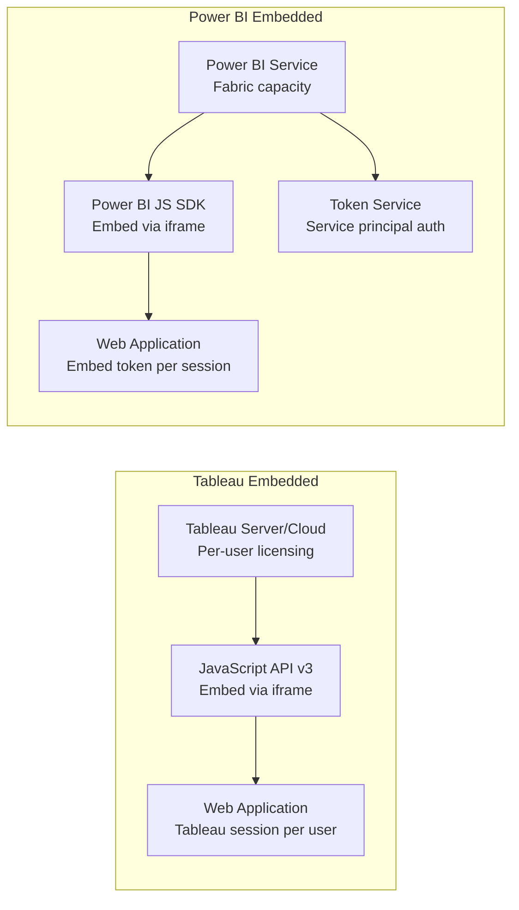

# Embedding Migration: Tableau Embedded to Power BI Embedded

**A comprehensive guide for migrating embedded analytics from Tableau Embedded Analytics to Power BI Embedded, covering pricing, SDK, architecture, multi-tenancy, and white-labeling.**

---

## Overview

Embedded analytics — the ability to embed interactive reports inside customer-facing applications, partner portals, and internal tools — is where the cost difference between Tableau and Power BI is most dramatic. Tableau uses per-user pricing for embedded scenarios. Power BI Embedded uses capacity-based pricing that serves unlimited users within a fixed compute budget. This guide covers the full migration path.

---

## 1. Architecture comparison

### 1.1 High-level architecture



### 1.2 Key architectural differences

| Aspect               | Tableau Embedded                     | Power BI Embedded                                   | Impact                                                |
| -------------------- | ------------------------------------ | --------------------------------------------------- | ----------------------------------------------------- |
| **Pricing model**    | Per-user (Viewer: $15/user/mo)       | Capacity-based (F-SKU: fixed monthly)               | Power BI scales to unlimited users at fixed cost      |
| **Authentication**   | Tableau Server session (SAML/OIDC)   | Embed token (service principal) or AAD              | Power BI supports app-owns-data (no user auth needed) |
| **Embedding method** | JavaScript API v3 + iframe           | Power BI JS SDK + iframe                            | Similar approach; different SDK                       |
| **Multi-tenancy**    | Row-level security or separate sites | RLS + workspace isolation                           | Power BI provides more flexible isolation options     |
| **White-labeling**   | Limited (custom CSS, hide toolbar)   | Full branding control (custom theme, no PBI chrome) | Power BI allows complete brand customization          |
| **Performance**      | Depends on Tableau Server capacity   | Depends on Fabric capacity SKU                      | Both scale with allocated compute                     |

---

## 2. Pricing comparison

### 2.1 Tableau Embedded pricing

Tableau Embedded Analytics requires Viewer licenses for every external user who views embedded content:

| External users | License tier      | Monthly cost | Annual cost |
| -------------- | ----------------- | ------------ | ----------- |
| 100            | Viewer ($15/user) | $1,500       | $18,000     |
| 500            | Viewer            | $7,500       | $90,000     |
| 1,000          | Viewer            | $15,000      | $180,000    |
| 5,000          | Viewer            | $75,000      | $900,000    |
| 10,000         | Viewer            | $150,000     | $1,800,000  |
| 50,000         | Viewer            | $750,000     | $9,000,000  |

Infrastructure costs (Tableau Server VMs to handle embedded traffic) add 20-40% to these numbers.

### 2.2 Power BI Embedded pricing

Power BI Embedded uses Fabric capacity SKUs. You pay for compute, not users:

| F-SKU | Monthly cost | Concurrent users (typical) | Annual cost |
| ----- | ------------ | -------------------------- | ----------- |
| F2    | ~$262        | 5-20                       | ~$3,150     |
| F4    | ~$524        | 10-50                      | ~$6,290     |
| F8    | ~$1,050      | 25-100                     | ~$12,600    |
| F16   | ~$2,100      | 50-250                     | ~$25,200    |
| F32   | ~$3,000      | 100-500                    | ~$36,000    |
| F64   | ~$5,000      | 250-1,000                  | ~$60,000    |
| F128  | ~$10,000     | 500-2,500                  | ~$120,000   |
| F256  | ~$20,000     | 1,000-5,000                | ~$240,000   |

!!! note "Right-sizing capacity"
Concurrent users depend on report complexity, data volume, and query patterns. Start with F32 or F64, monitor with Capacity Metrics App, and scale as needed. Auto-scale is available for burst scenarios.

### 2.3 Cost comparison at scale

| External users | Tableau annual | Power BI annual  | Savings |
| -------------- | -------------- | ---------------- | ------- |
| 500            | $90,000+       | ~$36,000 (F32)   | 60%     |
| 2,000          | $360,000+      | ~$60,000 (F64)   | 83%     |
| 10,000         | $1,800,000+    | ~$120,000 (F128) | 93%     |
| 50,000         | $9,000,000+    | ~$240,000 (F256) | 97%     |

---

## 3. Embedding approaches

### 3.1 Tableau JavaScript API to Power BI JavaScript SDK

| Tableau JS API concept                 | Power BI JS SDK concept                      | Notes                                |
| -------------------------------------- | -------------------------------------------- | ------------------------------------ |
| `tableau.Viz(container, url, options)` | `powerbi.embed(container, config)`           | Initialization pattern               |
| Viz URL                                | Embed URL + embed token                      | Power BI uses token-based auth       |
| `viz.getWorkbook()`                    | Report object                                | Access report object for interaction |
| `viz.getActiveSheet()`                 | Report pages                                 | `report.getPages()`                  |
| `sheet.applyFilterAsync()`             | `page.setFilters()` or `report.setFilters()` | Apply filters programmatically       |
| `sheet.selectMarksAsync()`             | Visual interaction via SDK                   | Click and selection events           |
| `sheet.getSelectedMarksAsync()`        | Data export via SDK                          | Extract selected data                |
| `viz.addEventListener()`               | `report.on('event', callback)`               | Event handling                       |
| `viz.dispose()`                        | `powerbi.reset(container)`                   | Cleanup                              |

### 3.2 Tableau embed code example

```html
<!-- Tableau Embedded -->
<div id="tableauViz"></div>
<script>
    var containerDiv = document.getElementById("tableauViz");
    var url = "https://tableau-server/views/Dashboard/Sheet1";
    var options = {
        hideTabs: true,
        hideToolbar: true,
        width: "100%",
        height: "600px",
        onFirstInteractive: function () {
            console.log("Dashboard loaded");
        },
    };
    var viz = new tableau.Viz(containerDiv, url, options);
</script>
```

### 3.3 Power BI embed code equivalent

```html
<!-- Power BI Embedded -->
<div id="reportContainer"></div>
<script src="https://cdn.jsdelivr.net/npm/powerbi-client/dist/powerbi.min.js"></script>
<script>
    var models = window["powerbi-client"].models;
    var embedConfig = {
        type: "report",
        id: "report-id-guid",
        embedUrl: "https://app.powerbi.com/reportEmbed?reportId=...",
        accessToken: "embed-token-from-backend",
        tokenType: models.TokenType.Embed,
        settings: {
            navContentPaneEnabled: false,
            filterPaneEnabled: false,
            layoutType: models.LayoutType.Custom,
            customLayout: {
                displayOption: models.DisplayOption.FitToWidth,
            },
        },
    };
    var reportContainer = document.getElementById("reportContainer");
    var report = powerbi.embed(reportContainer, embedConfig);

    report.on("loaded", function () {
        console.log("Report loaded");
    });

    report.on("dataSelected", function (event) {
        console.log("Data selected:", event.detail);
    });
</script>
```

### 3.4 SDK feature comparison

| Capability               | Tableau JS API | Power BI JS SDK                 | Notes                                            |
| ------------------------ | -------------- | ------------------------------- | ------------------------------------------------ |
| Embed report             | Yes            | Yes                             | Core capability                                  |
| Apply filters            | Yes            | Yes                             | Similar API patterns                             |
| Get/set parameters       | Yes            | Yes (slicers)                   | Power BI uses slicer state instead of parameters |
| Event handling           | Yes            | Yes                             | Load, render, click, select events               |
| Export data              | Yes            | Yes                             | Export visual or underlying data                 |
| Export report (PDF)      | Limited        | Yes                             | `report.print()` or `report.export()`            |
| Theme/branding           | Limited CSS    | Full theme JSON + custom layout | Power BI provides more control                   |
| Page navigation          | Yes            | Yes                             | Navigate between report pages                    |
| Bookmarks                | N/A            | Yes                             | Apply bookmarks programmatically                 |
| Full-screen mode         | Yes            | Yes                             | Toggle full-screen                               |
| Responsive/mobile layout | Limited        | Yes                             | Power BI supports mobile layout embed            |
| Q&A (natural language)   | N/A            | Yes                             | Embed a Q&A visual for natural language queries  |
| Dashboard embed          | Yes            | Yes                             | Pin tiles from multiple reports                  |
| Single visual embed      | N/A            | Yes                             | Embed individual visuals, not full reports       |

---

## 4. Authentication and security

### 4.1 Authentication model comparison

| Pattern             | Tableau                  | Power BI                        | Description                                             |
| ------------------- | ------------------------ | ------------------------------- | ------------------------------------------------------- |
| **User owns data**  | SAML/OIDC SSO            | Entra ID SSO                    | User authenticates directly; sees their own data        |
| **App owns data**   | Trusted tickets          | Service principal + embed token | App authenticates on behalf of user; token-based access |
| **Anonymous embed** | Publish to web (limited) | Publish to web (limited)        | Public embed without authentication                     |

### 4.2 App-owns-data pattern (most common for embedding)

```
// Token generation flow (backend):
// 1. App authenticates to Entra ID using service principal
// 2. App calls Power BI REST API to generate embed token
// 3. Embed token is passed to the frontend
// 4. Frontend uses embed token to render the report
// 5. RLS identity is included in the token to filter data

// Backend (Node.js example):
const { ConfidentialClientApplication } = require("@azure/msal-node");
const axios = require("axios");

// Step 1: Get AAD token
const msalConfig = {
    auth: {
        clientId: "service-principal-client-id",
        clientSecret: "client-secret",
        authority: "https://login.microsoftonline.com/tenant-id"
    }
};
const cca = new ConfidentialClientApplication(msalConfig);
const tokenResponse = await cca.acquireTokenByClientCredential({
    scopes: ["https://analysis.windows.net/powerbi/api/.default"]
});

// Step 2: Generate embed token with RLS
const embedTokenRequest = {
    datasets: [{ id: "dataset-id" }],
    reports: [{ id: "report-id" }],
    identities: [{
        username: "user@company.com",
        roles: ["RegionFilter"],
        datasets: ["dataset-id"]
    }]
};

const embedToken = await axios.post(
    "https://api.powerbi.com/v1.0/myorg/GenerateToken",
    embedTokenRequest,
    { headers: { Authorization: `Bearer ${tokenResponse.accessToken}` } }
);
```

---

## 5. Multi-tenancy patterns

### 5.1 Comparison of isolation approaches

| Pattern                  | Tableau                         | Power BI                                          | Best for                                      |
| ------------------------ | ------------------------------- | ------------------------------------------------- | --------------------------------------------- |
| **Shared model + RLS**   | User filters on data source     | RLS roles with dynamic identity                   | Cost-efficient; shared infrastructure         |
| **Workspace per tenant** | Site per tenant (expensive)     | Workspace per tenant                              | Strong isolation; tenant-specific data models |
| **Database per tenant**  | Separate data source per tenant | Separate semantic model or data source per tenant | Maximum isolation; regulatory requirements    |

### 5.2 RLS-based multi-tenancy (recommended)

```dax
// Single semantic model serves all tenants
// RLS role: TenantFilter
// Table: Sales
// DAX expression:
[TenantID] = USERNAME()
// or
LOOKUPVALUE(
    TenantMapping[TenantID],
    TenantMapping[UserEmail], USERPRINCIPALNAME()
) = Sales[TenantID]

// Embed token includes effective identity:
{
    "identities": [{
        "username": "tenant-123",
        "roles": ["TenantFilter"],
        "datasets": ["dataset-id"]
    }]
}
```

### 5.3 Workspace-based multi-tenancy

For stronger isolation, create a workspace per tenant with a dedicated semantic model:

```
Workspace: "Embedded - Tenant A"
  - Tenant A Semantic Model (filtered to Tenant A data)
  - Tenant A Report

Workspace: "Embedded - Tenant B"
  - Tenant B Semantic Model (filtered to Tenant B data)
  - Tenant B Report
```

This provides complete data isolation but increases management overhead.

---

## 6. White-labeling and branding

### 6.1 Tableau branding limitations

Tableau offers limited branding for embedded scenarios:

- Custom logo on Tableau Server login page
- CSS overrides (limited, can break on upgrades)
- Hide toolbar and tabs
- Custom URL (via reverse proxy)

### 6.2 Power BI branding capabilities

Power BI Embedded provides comprehensive branding control:

| Branding feature         | How to implement                                                  |
| ------------------------ | ----------------------------------------------------------------- |
| Custom colors and fonts  | Apply a Power BI theme JSON                                       |
| Remove Power BI chrome   | Set `navContentPaneEnabled: false` and `filterPaneEnabled: false` |
| Custom background        | Theme JSON background setting                                     |
| No "Power BI" branding   | A-SKU or F-SKU Embedded licenses remove the footer                |
| Custom loading animation | CSS styling on the container element                              |
| Custom error messages    | Handle errors in the JavaScript SDK event handler                 |
| Responsive layout        | Use `DisplayOption.FitToWidth` or `FitToPage`                     |
| Custom toolbar           | Build your own toolbar using SDK methods (export, print, refresh) |
| Localization             | Power BI supports localization for 40+ languages                  |

### 6.3 Theme JSON for branding

```json
{
    "name": "Customer Portal Theme",
    "dataColors": ["#0063B1", "#2D7D9A", "#77B900", "#FF8C00", "#E81123"],
    "background": "#F5F5F5",
    "foreground": "#333333",
    "tableAccent": "#0063B1",
    "good": "#77B900",
    "neutral": "#FFB900",
    "bad": "#E81123",
    "visualStyles": {
        "*": {
            "*": {
                "title": [
                    {
                        "fontFamily": "Your Brand Font",
                        "fontSize": 14,
                        "color": { "solid": { "color": "#0063B1" } }
                    }
                ]
            }
        }
    }
}
```

---

## 7. Performance optimization

### 7.1 Embedded performance best practices

| Technique                      | Description                                                             | Impact                                                   |
| ------------------------------ | ----------------------------------------------------------------------- | -------------------------------------------------------- |
| **Pre-load reports**           | Embed with `{ type: "report", id: "..." }` config before user navigates | Eliminates load time when user switches to analytics tab |
| **Bookmark for default state** | Apply a bookmark immediately after load                                 | Faster initial view than applying filters post-load      |
| **Reduce visual count**        | Keep embedded pages to 6-8 visuals max                                  | Each visual generates queries; fewer = faster            |
| **Use Import mode**            | Import mode is faster than DirectQuery for most embedded scenarios      | Eliminates source query latency                          |
| **Right-size capacity**        | Monitor CU usage; upgrade if throttling occurs                          | Prevents slow render under load                          |
| **Token caching**              | Cache embed tokens (valid for 60 minutes by default)                    | Reduces backend token generation calls                   |
| **Client-side caching**        | Use `powerbi.bootstrap(container, config)` for pre-initialization       | Report container ready before data arrives               |

### 7.2 Capacity sizing for embedded

| Concurrent report views | Recommended starting SKU | Notes                                   |
| ----------------------- | ------------------------ | --------------------------------------- |
| 1-25                    | F8                       | Light workloads, simple reports         |
| 25-100                  | F16-F32                  | Medium complexity, moderate concurrency |
| 100-500                 | F64                      | Standard production embedding           |
| 500-2,000               | F128-F256                | High-traffic portals                    |
| 2,000+                  | F256+ or auto-scale      | Enterprise-scale embedding              |

---

## 8. Migration steps

### 8.1 Migration execution plan

1. **Inventory embedded Tableau content** — list all embedded dashboards, their applications, and user counts
2. **Set up Power BI Embedded capacity** — provision an F-SKU in Azure portal
3. **Register a service principal** — create an Entra ID app registration for the embedding application
4. **Migrate reports** — convert Tableau workbooks to Power BI reports (see [Tutorial: Workbook to PBIX](tutorial-workbook-to-pbix.md))
5. **Publish to embedding workspace** — publish reports to a dedicated workspace
6. **Implement token generation** — build backend service to generate embed tokens
7. **Update frontend** — replace Tableau JS API with Power BI JS SDK
8. **Configure RLS** — implement row-level security for multi-tenancy
9. **Apply branding** — create and apply Power BI theme
10. **Performance test** — load test with expected concurrent users; right-size capacity
11. **Cut over** — switch the application from Tableau to Power BI
12. **Decommission** — remove Tableau Viewer licenses

### 8.2 Testing checklist

- [ ] Reports render correctly in the embedding container
- [ ] RLS filters data correctly for each tenant/user
- [ ] Filters applied programmatically work as expected
- [ ] Events (loaded, rendered, dataSelected) fire correctly
- [ ] Export (PDF, data) works from embedded context
- [ ] Mobile/responsive layout renders correctly
- [ ] Performance under load meets SLA (< 3 second render time)
- [ ] Token refresh works (tokens expire after 60 minutes by default)
- [ ] White-labeling matches brand guidelines
- [ ] Error handling displays custom error messages

---

**Last updated:** 2026-04-30
**Maintainers:** CSA-in-a-Box core team
**Related:** [TCO Analysis](tco-analysis.md) | [Server Migration](server-migration.md) | [Migration Playbook](../tableau-to-powerbi.md)
