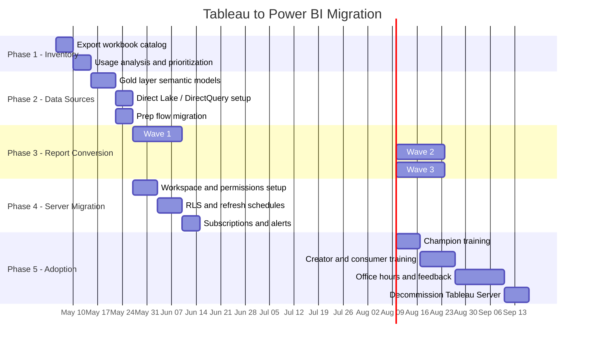

# Tableau to Power BI Migration Center

**The definitive resource for migrating from Tableau Server/Cloud to Power BI, Microsoft Fabric, and CSA-in-a-Box.**

---

## Who this is for

This migration center serves BI leads, analytics engineers, data architects, CDOs, and IT directors who are evaluating or executing a migration from Tableau (Server, Cloud, or Online) to Power BI Service and Microsoft Fabric. Whether you are responding to a Tableau license renewal, consolidating on the Microsoft stack, or pursuing Fabric convergence for zero-copy analytics, these resources provide the evidence, patterns, and step-by-step guidance to execute confidently.

---

## Quick-start decision matrix

| Your situation                               | Start here                                                                   |
| -------------------------------------------- | ---------------------------------------------------------------------------- |
| Executive evaluating Power BI vs Tableau     | [Why Power BI over Tableau](why-powerbi-over-tableau.md)                     |
| Need cost justification for migration        | [Total Cost of Ownership Analysis](tco-analysis.md)                          |
| Need a feature-by-feature comparison         | [Complete Feature Mapping](feature-mapping-complete.md)                      |
| Converting calculations (LOD, table calcs)   | [Calculation Conversion Reference](calculation-conversion.md)                |
| Migrating specific chart types               | [Visualization Migration](visualization-migration.md)                        |
| Moving data connections and extracts         | [Data Source Migration](data-source-migration.md)                            |
| Migrating Tableau Server infrastructure      | [Server Migration](server-migration.md)                                      |
| Replacing Tableau Prep flows                 | [Prep Migration](prep-migration.md)                                          |
| Migrating embedded analytics                 | [Embedding Migration](embedding-migration.md)                                |
| Want a hands-on workbook conversion tutorial | [Tutorial: Workbook to PBIX](tutorial-workbook-to-pbix.md)                   |
| Migrating data models and measures           | [Tutorial: Data Model to Semantic Model](tutorial-data-model-to-semantic.md) |
| Need DAX conversion practice                 | [Tutorial: Calculation Conversion](tutorial-calc-conversion.md)              |
| Need performance benchmarks                  | [Benchmarks](benchmarks.md)                                                  |
| Planning rollout and training                | [Best Practices](best-practices.md)                                          |
| Want the full end-to-end playbook            | [Migration Playbook](../tableau-to-powerbi.md)                               |

---

## Strategic resources

These documents provide the business case, cost analysis, and strategic framing for decision-makers.

| Document                                                 | Audience                | Description                                                                                                                           |
| -------------------------------------------------------- | ----------------------- | ------------------------------------------------------------------------------------------------------------------------------------- |
| [Why Power BI over Tableau](why-powerbi-over-tableau.md) | CIO / CDO / CFO         | Strategic case covering licensing economics, M365 integration, Fabric convergence, Copilot, embedded analytics, and honest trade-offs |
| [Total Cost of Ownership Analysis](tco-analysis.md)      | CFO / CIO / Procurement | Detailed per-user pricing comparison, scenario modeling (50 to 2,000 users), infrastructure costs, 3-year and 5-year TCO projections  |
| [Benchmarks & Performance](benchmarks.md)                | CTO / BI Engineering    | Render performance, concurrent users, mobile experience, embedding benchmarks, Copilot capabilities, and development speed            |

---

## Technical references

| Document                                                      | Description                                                                                                                   |
| ------------------------------------------------------------- | ----------------------------------------------------------------------------------------------------------------------------- |
| [Complete Feature Mapping](feature-mapping-complete.md)       | 50+ Tableau features mapped to Power BI equivalents with migration complexity and recommendations                             |
| [Calculation Conversion Reference](calculation-conversion.md) | Deep-dive on LOD expressions, table calculations, string/date/logical functions with 30+ before/after code examples           |
| [Visualization Migration](visualization-migration.md)         | Chart-by-chart mapping, dashboard actions, formatting comparison, and fidelity guidance                                       |
| [Data Source Migration](data-source-migration.md)             | Extracts to Import/Direct Lake, live connections to DirectQuery, published data sources to shared semantic models             |
| [Server Migration](server-migration.md)                       | Tableau Server to Power BI Service — workspaces, permissions, RLS, schedules, monitoring                                      |
| [Prep Migration](prep-migration.md)                           | Tableau Prep flows to Power Query M, Dataflow Gen2, or dbt models                                                             |
| [Embedding Migration](embedding-migration.md)                 | Tableau Embedded to Power BI Embedded — pricing, SDK, multi-tenancy, white-labeling                                           |
| [Migration Playbook](../tableau-to-powerbi.md)                | The original end-to-end playbook with calculation mapping, visualization reference, server migration, and training curriculum |

---

## Tutorials

Step-by-step, hands-on guides for the most common migration tasks.

| Tutorial                                                           | Duration  | Description                                                                                                                                   |
| ------------------------------------------------------------------ | --------- | --------------------------------------------------------------------------------------------------------------------------------------------- |
| [Workbook to PBIX](tutorial-workbook-to-pbix.md)                   | 3-4 hours | Convert a Tableau workbook end-to-end: data sources, semantic model, DAX, visuals, RLS, publish                                               |
| [Data Model to Semantic Model](tutorial-data-model-to-semantic.md) | 2-3 hours | Migrate Tableau data model (calculated fields, relationships, data source filters) to a Power BI star-schema semantic model with DAX measures |
| [Calculation Conversion Workshop](tutorial-calc-conversion.md)     | 2-3 hours | Convert 15 common Tableau calculations to DAX with conceptual explanations of filter context vs level of detail                               |

---

## Migration timeline

---

## How to use this migration center

**If you are an executive or decision-maker:** Start with [Why Power BI over Tableau](why-powerbi-over-tableau.md) and [TCO Analysis](tco-analysis.md). These two documents provide the strategic and financial case.

**If you are a BI engineer or report developer:** Start with [Feature Mapping](feature-mapping-complete.md) to understand the landscape, then jump to [Calculation Conversion](calculation-conversion.md) and [Visualization Migration](visualization-migration.md) for the technical details. Use the [Workbook to PBIX tutorial](tutorial-workbook-to-pbix.md) to do your first conversion end-to-end.

**If you are a data engineer or platform team:** Focus on [Data Source Migration](data-source-migration.md) and [Prep Migration](prep-migration.md) for the data layer, then [Server Migration](server-migration.md) for infrastructure.

**If you are running the migration program:** Read the full [Migration Playbook](../tableau-to-powerbi.md) first, then use this center as a reference library for each phase.

---

**Last updated:** 2026-04-30
**Maintainers:** CSA-in-a-Box core team
**Related:** [Migration Playbook](../tableau-to-powerbi.md) | [Palantir Foundry Migration](../palantir-foundry/index.md) | [Snowflake Migration](../snowflake.md)
